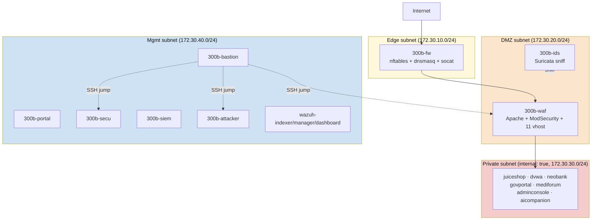

# Week 01: 보안 솔루션 개론 + 4-tier (AWS-style) 인프라 소개

> 본 주차는 **300B 단일 VM 기반 4-tier 토폴로지** 위에서 진행한다. 학생 PC 의 VMware VM 1대 안에
> 18개 docker 컨테이너로 AWS 풀 스택 보안 아키텍처를 흉내낸 환경이며, 외부에 노출된 호스트 포트는
> 단 4개 (HTTP 80, HTTPS 443, DNS 53, Bastion SSH 2204) 다.

## 학습 목표
- 기업/기관에서 사용하는 주요 보안 솔루션의 종류와 역할을 이해한다
- 방화벽, IDS, WAF, SIEM, CTI 의 개념과 차이점을 설명할 수 있다
- 300B 4-tier 환경 (edge / dmz / private / mgmt) 의 컨테이너 배치를 파악한다
- 각 보안 솔루션이 정상 동작하는지 명령어로 확인할 수 있다
- bastion ProxyJump 모델로 모든 내부 컨테이너에 SSH 접속할 수 있다

## 실습 환경 (300B 4-tier 토폴로지)

학생 PC 의 VMware Bridge VM 안에서 모두 동작한다. VM IP 를 `<VM_IP>` 로 표기 (예: `192.168.0.114`).

### Tier 별 컨테이너 (총 18개)

| Tier | 컨테이너 | IP | 보안 솔루션 / 역할 |
|------|----------|-----|-------------------|
| **Edge** | `300b-fw` | 172.30.10.10 | nftables (방화벽) + dnsmasq (사설 DNS) + socat (L4 forward) |
| **DMZ** | `300b-waf` | 172.30.20.20 | Apache 2.4 + ModSecurity v2 + OWASP CRS (WAF) |
| **DMZ sidecar** | `300b-ids` | 172.30.20.30 | Suricata (passive sniff IDS) |
| **Mgmt** | `300b-bastion` | 172.30.40.20 | SSH jumphost + Bastion API + KG |
| **Mgmt** | `300b-portal` | 172.30.40.30 | AWS Console 풍 운영 포털 (FastAPI + HTMX) |
| **Mgmt** | `300b-secu` | 172.30.40.50 | nftables/Suricata/dnsmasq 학습용 (격리 sandbox) |
| **Mgmt** | `300b-siem` | 172.30.40.60 | rsyslog 수신 + cti-collector (간이 CTI) |
| **Mgmt** | `300b-attacker` | 172.30.40.70 | nmap, hydra, sqlmap, msfconsole 등 13 도구 |
| **Mgmt** | `wazuh-indexer` | 172.30.40.10 | OpenSearch 백엔드 |
| **Mgmt** | `wazuh-manager` | 172.30.40.11 | Wazuh manager (analysisd, remoted, monitord 등 8 daemon) |
| **Mgmt** | `wazuh-dashboard` | 172.30.40.12 | Wazuh Web UI |
| **Private** (internal) | `juiceshop` | 172.30.30.10 | OWASP Juice Shop |
| **Private** | `dvwa` | 172.30.30.20 | DVWA |
| **Private** | `neobank` | 172.30.30.30 | NeoBank (가상 은행) |
| **Private** | `govportal` | 172.30.30.40 | GovPortal (가상 정부 포털) |
| **Private** | `mediforum` | 172.30.30.50 | MediForum (가상 의료 포털) |
| **Private** | `adminconsole` | 172.30.30.60 | AdminConsole |
| **Private** | `aicompanion` | 172.30.30.70 | AI 대화 백엔드 (외부 LLM) |

### 외부 노출 (호스트 포트)

| 포트 | 용도 | 접근 방법 |
|------|------|----------|
| 80 | HTTP | `http://juice.300b.lab/`, `http://dvwa.300b.lab/` … (모두 fw → waf 통과) |
| 443 | HTTPS | self-signed CA, `http://<VM_IP>/300b-ca.crt` 다운로드 후 PC 에 import |
| 53 | DNS | 학생 PC 의 DNS 서버를 `<VM_IP>` 로 지정 → `*.300b.lab` 자동 해석 |
| 2204 | Bastion SSH | `ssh -p 2204 ccc@<VM_IP>` (점프 호스트 단일 진입점) |

### 학생 PC 접속 패턴

**브라우저** — 학생 PC 의 DNS 를 `<VM_IP>` 로 지정 (Windows 어댑터 속성 → IPv4 → 사용할 DNS 서버
주소 → 기본 DNS 에 VM IP) 하면:
- `http://juice.300b.lab/` (Juice Shop)
- `http://dvwa.300b.lab/`, `http://neobank.300b.lab/`, `http://govportal.300b.lab/` …
- `https://wazuh.300b.lab/` (Wazuh Dashboard, admin / SecretPassword)
- `http://portal.300b.lab/` (운영 포털 — AWS Console 풍)

DNS 사용이 어려우면 학생 PC 의 `C:\Windows\System32\drivers\etc\hosts` 에 9 줄 추가:
```
<VM_IP> juice.300b.lab dvwa.300b.lab neobank.300b.lab govportal.300b.lab mediforum.300b.lab admin.300b.lab ai.300b.lab wazuh.300b.lab bastion.300b.lab portal.300b.lab 300b.lab
```

**SSH (ProxyJump 모델)** — `~/.ssh/config` 에 한 번 추가:
```
Host 300b-bastion
  HostName <VM_IP>
  Port 2204
  User ccc

Host 300b-*
  ProxyJump 300b-bastion
  User ccc
```

그 후 `ssh 300b-fw`, `ssh 300b-waf`, `ssh 300b-ids` 등 — 자동으로 bastion 경유. 비밀번호 = `ccc`.

## 강의 시간 배분 (3시간)

| 시간 | 내용 | 유형 |
|------|------|------|
| 0:00–0:30 | 이론 — 보안 솔루션이 왜 필요한가? Defense in Depth | 강의 |
| 0:30–1:00 | 이론 — 5 종 보안 솔루션 상세 (방화벽 / IDS / WAF / SIEM / CTI) | 강의 |
| 1:00–1:10 | 휴식 | — |
| 1:10–1:30 | 4-tier 토폴로지 + AWS 매핑 + 트래픽 흐름 | 강의/토론 |
| 1:30–2:00 | 실습 1, 2 — 방화벽 (`300b-fw`) + IDS (`300b-ids`) | 실습 |
| 2:00–2:30 | 실습 3, 4 — WAF (`300b-waf`) + SIEM (Wazuh 3 컨테이너) | 실습 |
| 2:30–2:40 | 휴식 | — |
| 2:40–3:00 | 실습 5, 6 — CTI (`300b-siem`) + 운영 포털 (`300b-portal`) | 실습 |
| 3:00–3:20 | 통합 실습 — bastion 에서 전체 헬스체크 | 실습 |
| 3:20–3:40 | 정리 + 과제 안내 | 정리 |

---

## 용어 해설 (보안 솔루션 운영 과목)

| 용어 | 영문 | 설명 | 비유 |
|------|------|------|------|
| **방화벽** | Firewall | 네트워크 트래픽을 규칙에 따라 허용/차단하는 시스템 | 건물 출입 통제 |
| **체인** | Chain (nftables) | 패킷 처리 규칙의 묶음 (input, forward, output) | 심사 단계 |
| **룰/규칙** | Rule | 특정 조건의 트래픽을 어떻게 처리할지 정의 | "택배 기사만 출입 허용" |
| **시그니처** | Signature | 알려진 공격 패턴을 식별하는 규칙 (IDS/AV) | 수배범 얼굴 사진 |
| **IDS** | Intrusion Detection System | 악성 트래픽을 **탐지**하고 알림 | 경보기 |
| **IPS** | Intrusion Prevention System | 탐지 + **자동 차단** | 경보 + 자동 잠금 |
| **WAF** | Web Application Firewall | HTTP/HTTPS 전용 방화벽 (SQLi/XSS 차단) | 입구 금속탐지기 |
| **CRS** | OWASP Core Rule Set | ModSecurity 의 표준 룰셋 (OWASP Top 10 자동 탐지) | 표준 보안 검사 매뉴얼 |
| **SIEM** | Security Information & Event Management | 로그 통합 수집·분석·알림 플랫폼 | CCTV 관제실 |
| **CTI** | Cyber Threat Intelligence | 위협 정보 (IOC, TTPs) 수집·공유 | 범죄 정보 데이터베이스 |
| **IOC** | Indicator of Compromise | 침해 지표 (악성 IP, 해시, 도메인) | 수배범 지문, 차량번호 |
| **STIX** | Structured Threat Information eXpression | 위협 정보 표준 포맷 | 범죄 보고서 표준 양식 |
| **TAXII** | Trusted Automated eXchange of Intelligence Information | CTI 자동 교환 프로토콜 | 경찰서 간 수배 정보 공유 |
| **Bastion** | Bastion host | 외부에서 내부망 SSH 의 **유일한 진입점** | 정문 안내데스크 |
| **Reverse Proxy** | — | 외부 요청을 받아 내부 백엔드로 전달 | 호텔 컨시어지 |
| **vhost** | Virtual Host | 같은 IP/포트에서 도메인별 다른 사이트 서비스 | 한 건물 안 여러 매장 |
| **NAT/SNAT** | (Source) Network Address Translation | 패킷의 source IP 변환 | 회사 대표번호로 통일 |
| **socat** | Socket CAT | L4 (TCP/UDP) 포트 포워더 (user space) | 양 끝 끈을 잇는 멀티탭 |

## 전제 조건
- Linux 기본 명령어 (systemctl, cat, grep, ps, ss 수준)
- Docker 기본 (`docker ps`, `docker logs`) 사용 경험 있으면 유리
- 300B 환경이 정상 기동 (`bash 300b.sh up && bash 300b.sh smoke` 통과)

---

## 1. 보안 솔루션이 왜 필요한가? (30분)

### 1.1 현대 사이버 위협의 현실

2025년 기준 전 세계 사이버 범죄 피해액은 연간 10조 달러를 넘어섰다. 공격은 자동화되고,
**하나의 방어 수단만으로는 조직을 보호할 수 없다**. AWS 같은 클라우드 사업자가 풀 스택
보안을 제공하는 이유다 — 한 layer 가 뚫려도 다음 layer 가 막아준다.

### 1.2 비유 — 건물 보안

```
인터넷 (외부 세계)
  │
  ▼
[방화벽 / Firewall]                  ── 건물 외곽 담장 + 출입문
  IP/포트 기반 통제                       (누가 들어올 수 있는지)
  │
  ▼
[IDS/IPS / Suricata]                 ── 경비원
  이상 트래픽 패턴 탐지/차단              (수상한 행동 감시)
  │
  ▼
[WAF / Apache + ModSecurity]         ── 입구 금속탐지기
  웹 공격 (SQLi/XSS) 전문 차단           (HTTP 내용 검사)
  │
  ▼
[웹 서버 / 취약 사이트들]              ── 실제 업무 공간

[SIEM / Wazuh]                        ── 관제실 모니터 벽
  모든 로그를 모아서 분석                 (전체 흐름 가시화)

[CTI / cti-collector]                 ── 외부 위협 정보 DB
  알려진 악성 IP/해시/도메인 매칭         (수배 명단)
```

본 강의는 위 그림의 5 layer 를 **300B 환경에서 직접 구동**하며 익힌다.

### 1.3 심층 방어 (Defense in Depth)

| 계층 | 보안 솔루션 | 300B 컨테이너 | 역할 |
|------|------------|--------------|------|
| 네트워크 경계 | 방화벽 (nftables) | `300b-fw` | 허용된 트래픽만 통과, NAT, dnsmasq |
| 네트워크 내부 | IDS (Suricata) | `300b-ids` | 악성 트래픽 패턴 탐지 |
| 애플리케이션 | WAF (Apache + ModSec) | `300b-waf` | 웹 공격 전문 방어, 11 vhost reverse proxy |
| 모니터링 | SIEM (Wazuh) | `wazuh-*` 3 컨테이너 | 전체 로그 통합 분석, 15K+ 룰 |
| 위협 정보 | CTI (cti-collector) | `300b-siem` | 외부 IOC 피드 수집/매칭 |
| 운영 가시화 | 운영 포털 (FastAPI) | `300b-portal` | AWS Console 풍 통합 대시보드 |

### 1.4 "1 layer 만 있으면 어떤 일이 벌어지나" 사례

WitFoo Precinct 6 데이터셋 (Apache 2.0, 2.07M signal · 10,442 incident, 1년치) 분석 결과:

| 가용 layer | 학생이 볼 수 있는 evidence | 도달 가능한 결론 |
|------------|--------------------------|----------------|
| **방화벽 만** | 패킷 흐름 (IP/포트/byte) | "트래픽 볼륨 이상" 까지. 침해 vs 정상 백업 구분 불가 |
| **방화벽 + IDS** | + 비정상 connection alert | "의심 통신" 까지. 분류 불가 |
| **방화벽 + IDS + SIEM** | + 두 layer 시계열 correlation | **`Data Theft / Phishing` 등 분류 + framework 매핑** |

방화벽만 운영하면 1년치 2,070,923 신호 중 약 **5.7%** 만 가시화. 5 layer 모두 운영해야
나머지 evidence 에 접근 가능하다.

---

## 2. 주요 보안 솔루션 상세 (30분)

### 2.1 방화벽 — `300b-fw`

**정의** — 네트워크 트래픽을 검사하여 미리 정의된 규칙에 따라 허용/차단.

**종류**:

| 종류 | 설명 | 예시 |
|------|------|------|
| 패킷 필터링 | IP/포트 기반 단순 필터 | iptables, **nftables** |
| 상태 유지 (Stateful) | 연결 상태 추적 | nftables `ct state` |
| 차세대 (NGFW) | L7 인식 + IPS 통합 | Palo Alto, Fortinet |
| 호스트 기반 | 개별 서버에서 동작 | ufw, Windows Firewall |
| 클라우드 | 관리형 분산 정책 | AWS Network Firewall, GCP Cloud Armor |

**300B 환경** — `300b-fw` 컨테이너:
- nftables 룰 (`/etc/nftables.d/300b.nft`) — 학습용 input/forward/output 정책
- **socat** L4 포워더 — 호스트 80/443 → DMZ `300b-waf:80,443` 실제 전달 (docker-proxy 와의
  호환 문제로 nftables DNAT 대신 socat 가 사용자 공간에서 forward)
- **dnsmasq** — `*.300b.lab` 도메인을 `<VM_IP>` 로 wildcard 응답 (AWS Route 53 private hosted
  zone 시뮬레이션)

**nftables 규칙 구조**:
```
table → chain → rule
(테이블)  (체인)   (규칙)

table inet filter {
    chain input {
        type filter hook input priority 0; policy accept;
        iifname "eth0" tcp dport 22 accept     ← mgmt 망에서 SSH 허용
        tcp dport 22 drop                      ← 그 외 SSH 차단
    }
    chain forward {
        type filter hook forward priority 0; policy drop;
        ct state established,related accept    ← 응답 트래픽
        log prefix "[300b-fw drop fwd] "       ← drop 시 로깅
    }
}
```

### 2.2 IDS — `300b-ids` (Suricata)

**정의**:
- **IDS (Intrusion Detection System)** — 트래픽에서 악성 패턴 **탐지**.
- **IPS (Intrusion Prevention System)** — 탐지 + **자동 차단**.

300B 는 IDS 모드로 운영 (`300b-ids` 의 Suricata 가 dmz 망 패킷을 **passive sniff**, 차단은
WAF 가 담당). AWS 의 GuardDuty 와 유사한 역할.

**동작 방식**:

| 방식 | 설명 | 장점 | 단점 |
|------|------|------|------|
| 시그니처 기반 | 알려진 공격 패턴 DB | 정확도 높음 | 신종 공격 미탐 |
| 이상 탐지 | 정상 트래픽 기준선 비교 | 신종 공격 탐지 | 오탐률 높음 |
| 하이브리드 | 시그니처 + 이상 탐지 | 균형 | 설정 복잡 |

**Suricata 규칙 예시**:
```
alert http any any -> any any (
  msg:"SQL Injection Attempt";
  content:"' OR 1=1";
  sid:1000001; rev:1;
)
```

**300B 환경** — `300b-ids`:
- Suricata 7.0.x, dmz 망 (`172.30.20.0/24`) sniff
- 룰 위치: `/etc/suricata/rules/`
- 이벤트 출력: `/var/log/suricata/eve.json` (JSON), `/var/log/suricata/fast.log` (텍스트)
- 호스트 측 공유 볼륨 `ids-logs` — 운영 포털 (`300b-portal`) 이 read-only 로 마운트하여
  GuardDuty 풍 패널에 노출

### 2.3 WAF — `300b-waf` (Apache + ModSecurity)

**정의** — HTTP/HTTPS 트래픽을 검사하여 SQLi, XSS, CSRF 등 웹 공격을 차단하는 전문 방화벽.

**일반 방화벽 vs WAF**:

| 구분 | 일반 방화벽 | WAF |
|------|-----------|-----|
| 동작 계층 | L3-L4 (IP, 포트) | L7 (HTTP 내용) |
| 검사 대상 | 패킷 헤더 | HTTP 요청 본문, 쿠키, 헤더 |
| 차단 예시 | "이 IP 차단" | "`' OR 1=1--` 차단" |
| 배치 위치 | 네트워크 경계 | 웹 서버 앞단 |

**300B 환경** — `300b-waf`:
- **Apache 2.4** + `mod_security2` 모듈 + **OWASP Core Rule Set (CRS) 3.3**
- **11 vhost reverse proxy** — 같은 80/443 포트에서 도메인별로 다른 backend 로 전달:
  - `juice.300b.lab` → `juiceshop:3000`
  - `dvwa.300b.lab` → `dvwa:80`
  - `neobank.300b.lab` → `neobank:8080`
  - … 등 11 개 vhost 모두 ModSecurity 검사 통과 후 backend 도달
- **자체 CA TLS** — 첫 부팅 시 root CA + 11 server cert 자동 생성
- **검사 우회 불가** — Private 망은 `internal: true` 로 docker bridge 가 외부 NAT 자체를 막아
  학생/공격자가 backend 포트 (`:3000`, `:8080` 등) 직접 호출 불가능. 모든 트래픽이 강제로
  WAF 를 통과한다.

**WAF 차단 예시**:
```
GET /search?q=' UNION SELECT * FROM users--    ← SQLi
GET /comment?text=<script>alert('XSS')</script> ← XSS
GET /file?name=../../../../etc/passwd          ← Path Traversal
User-Agent: sqlmap/1.7                          ← 자동화 도구 시그니처
```

각 요청은 CRS 의 `REQUEST-942-APPLICATION-ATTACK-SQLI`, `REQUEST-941-XSS`,
`REQUEST-930-LFI`, `REQUEST-913-SCANNER-DETECTION` 룰에 매칭되어 anomaly score 누적, 임계
(기본 5) 초과 시 HTTP 403 응답 + `/var/log/apache2/modsec_audit.log` 기록.

### 2.4 SIEM — Wazuh (3 컨테이너)

**정의** — Security Information and Event Management. 모든 시스템 로그를 **수집·정규화·
상관분석**하여 보안 위협을 탐지하는 플랫폼.

**SIEM 핵심 기능**:
```
방화벽 로그 ──┐
WAF 로그   ──┼──▶ [Wazuh] ──▶  1. 수집      (로그 한곳에 모음)
IDS 알림    ─┘                  2. 정규화    (포맷 통일)
호스트 로그  ─                   3. 상관분석  (여러 이벤트 연결)
                                  4. 알림      (위협 발견 시)
                                  5. 대시보드  (시각화)
```

**300B 환경** — Wazuh 4.11.x **3 컨테이너 구성**:

| 컨테이너 | 역할 | 포트 |
|----------|------|------|
| `wazuh-indexer` | OpenSearch 백엔드 (인덱싱 + 검색) | 9200 |
| `wazuh-manager` | analysisd, remoted, monitord 등 8 daemon | 1514 (agent), 55000 (API) |
| `wazuh-dashboard` | Web UI (Kibana fork) | 443 → `https://wazuh.300b.lab/` |

**기능**:
- **15,000+ 기본 룰** (`/var/ossec/ruleset/`) — sshd brute force, sudo abuse, FIM 변조 등
- **MITRE ATT&CK 매핑** — 룰별 `mitre.tactic`, `mitre.technique` 자동 태깅
- **Active Response** — 탐지 시 자동 IP 차단 등
- **FIM** — File Integrity Monitoring (감시 대상 파일 해시 비교)
- **SCA** — Security Configuration Assessment (CIS 벤치마크)

### 2.5 CTI — `300b-siem` (cti-collector)

**정의** — Cyber Threat Intelligence. 알려진 공격자, 악성 IP, 악성코드 해시, 공격 기법 등의
**위협 정보를 수집·분석·공유**하는 활동.

**CTI 종류**:

| 종류 | 설명 | 예시 |
|------|------|------|
| 전략적 CTI | 경영진을 위한 고수준 동향 | "북한 APT 그룹이 금융권 공격 증가" |
| 전술적 CTI | TTP (Tactics, Techniques, Procedures) | MITRE ATT&CK T1566 (피싱) |
| 운영적 CTI | 구체적 공격 캠페인 | "이 IP 대역에서 이 캠페인 진행 중" |
| 기술적 CTI | IOC (침해 지표) | 악성 IP, 파일 해시, 도메인 |

**300B 환경** — `300b-siem` 컨테이너:
- **rsyslog** 수신 — `300b-fw`, `300b-waf`, `300b-ids` 등의 syslog 를 514/UDP 로 집약
- **cti-collector** (간이) — 공개 IOC 피드 (예: AbuseIPDB, AlienVault OTX) 를 주기적으로
  수집 → JSON DB 저장 → Wazuh 룰과 매칭 (`/var/ossec/etc/lists/`) 으로 활용
- 학교 환경에 맞춘 경량 구성 (full OpenCTI 는 ElasticSearch + RabbitMQ + Redis 등 5GB+
  RAM 필요 → 본 과목은 cti-collector 로 학습 목적 충족)

### 2.6 운영 포털 — `300b-portal` (보너스)

AWS Console 풍 통합 대시보드. 학생/강사가 한 화면에서 인프라 전체 상태를 볼 수 있게 한다.

| 페이지 | AWS 유사 | 데이터 source |
|--------|---------|--------------|
| `/` Dashboard | (홈) | docker socket — 4-tier 컨테이너 카운트 + 최근 알람 |
| `/resources` | EC2 instances | docker socket — 18 컨테이너 표 (이름/tier/IP/포트) |
| `/network` | VPC | 4 docker network 토폴로지 + 컨테이너별 IP |
| `/logs` | CloudWatch Logs | `docker logs` 실시간 polling (5초) |
| `/waf` | WAF Console | `300b-waf` 의 modsec_audit.log 차단 이벤트 |
| `/ids` | GuardDuty | `300b-ids` eve.json alerts + Top 10 signatures |
| `/audit` | CloudTrail | `300b-bastion` sshd auth.log (single audit point) |
| `/agent` | (운영 자동화) | bastion API health + skills + KG |

접속: `http://portal.300b.lab/` (DNS 설정 필요) 또는 `http://<VM_IP>/portal-direct/` 등.

---

## 3. 4-tier 토폴로지 + 트래픽 흐름 (20분)

### 3.1 4-tier 분리



핵심:
- **Private 은 `internal: true`** — docker bridge 자체에 외부 NAT 없음. 즉 vuln backend 가
  침해되어도 외부 C2/exfil 통신 불가 (사고 격리).
- **Edge → DMZ → Private** 단방향 — WAF 통과 안 한 트래픽은 backend 도달 못 함.
- **Mgmt 분리** — 운영 트래픽 (SSH, dashboard 접근) 이 학생 트래픽과 섞이지 않음.

### 3.2 트래픽 흐름

```mermaid
graph LR
    A[학생 PC<br/>192.168.0.x] -->|HTTP :80<br/>juice.300b.lab| FW[300b-fw<br/>nftables + socat]
    FW -->|TCP forward<br/>172.30.20.20:80| WAF[300b-waf<br/>ModSec 검사]
    WAF -->|vhost match<br/>juice → :3000| JUICE[juiceshop:3000]
    IDS[300b-ids<br/>Suricata] -.passive sniff.-> WAF
    WAF -.audit log.-> POR[300b-portal]
    IDS -.eve.json.-> POR
    style A fill:#f85149,color:#fff
    style FW fill:#d29922,color:#fff
    style WAF fill:#06c,color:#fff
    style IDS fill:#9c27b0,color:#fff
    style JUICE fill:#238636,color:#fff
    style POR fill:#555,color:#fff
```

학생이 `http://juice.300b.lab/` 클릭 시:
1. 학생 PC DNS → `<VM_IP>` (dnsmasq 가 wildcard 응답)
2. 학생 PC → `<VM_IP>:80` HTTP 요청 (Host 헤더: `juice.300b.lab`)
3. 호스트 docker-proxy 또는 `300b-fw` 의 socat 이 받음 → `172.30.20.20:80` (waf) 로 forward
4. `300b-waf` Apache: vhost matching → `juice.300b.lab` → ModSec CRS 검사
5. 검사 통과 → `juiceshop:3000` 으로 ProxyPass → 응답 반환
6. `300b-ids` 는 dmz 패킷을 passive sniff → `eve.json` 에 flow 기록

### 3.3 AWS 매핑

| AWS 서비스 | 300B 컨테이너 | 비고 |
|-----------|--------------|------|
| Internet Gateway | host port mapping (80/443/53/2204) | VM 외부 접근 진입점 |
| Network Firewall | `300b-fw` nftables | L3-L4 stateful filter |
| ALB + WAF | `300b-waf` Apache + ModSec | L7 vhost + OWASP CRS |
| GuardDuty / VPC Flow | `300b-ids` Suricata | passive 패킷 분석 |
| Bastion Host | `300b-bastion` (port 2204) | 단일 SSH 진입점 |
| Public subnet | `300b-edge` (172.30.10.0/24) | fw 위치 |
| DMZ subnet | `300b-dmz` (172.30.20.0/24) | waf, ids 위치 |
| Private subnet | `300b-private` (internal: true) | vuln backend |
| Mgmt subnet | `300b-mgmt` (172.30.40.0/24) | wazuh, bastion 등 |
| Route 53 (private zone) | `300b-fw` 의 dnsmasq | `*.300b.lab` 응답 |
| ACM (private CA) | `300b-waf` 의 self-signed CA | 11 server cert 자동 생성 |
| CloudWatch / Security Hub | wazuh-manager + dashboard | 통합 로그 분석 |

---

## 4. 실습 1: 방화벽 (`300b-fw` nftables) (15분)

> **실습 목적**: 300B 의 edge tier 방화벽이 어떻게 구성되어 있는지 확인. nftables 룰 + socat
> 포워더 + dnsmasq 의 3 가지 역할을 한 컨테이너에서 다 살펴본다.

### 4.1 bastion 경유 fw 컨테이너 접속

```bash
# 학생 PC (또는 강사 시연용 VM 호스트) 에서
ssh 300b-fw          # ProxyJump 자동 (bastion 통해서)
```

비밀번호 `ccc`. 처음 접속 시 known_hosts 추가 — 두 번 입력될 수 있음 (한 번은 bastion,
한 번은 fw).

### 4.2 nftables 서비스 / 프로세스 확인

300B 컨테이너는 systemd 가 아닌 entrypoint 스크립트로 부팅 — `nft` 명령으로 룰만 확인.

```bash
# 현재 로드된 ruleset
sudo nft list ruleset | head -30

# 테이블 목록
sudo nft list tables

# 룰 갯수 정량
sudo nft list ruleset | grep -cE 'accept|drop|reject|log'
```

**예상 출력**:
```
table inet filter {
    chain input { ... }
    chain forward { ... policy drop; ... }
    chain output { ... }
}
table ip nat {
    chain prerouting { ... }
    chain postrouting { ... oifname "eth1" masquerade ... }
}
```

### 4.3 socat L4 포워더 확인 (실제 80/443 처리)

```bash
# socat 프로세스 — 80/443 listen
ps -ef | grep socat | grep -v grep

# 실제 listen socket
ss -tlnp | grep -E ':80|:443'
```

**예상 출력**:
```
socat TCP-LISTEN:80,reuseaddr,fork TCP:172.30.20.20:80
socat TCP-LISTEN:443,reuseaddr,fork TCP:172.30.20.20:443
```

> 왜 nft DNAT 가 아닌 socat 인가? — docker-proxy 가 host:80 을 가로채는 환경에서 nft
> PREROUTING DNAT 가 hit 되지 않는 케이스가 있어서, user space 의 socat 으로 명시적 forward.
> nft NAT 룰은 학습용으로 남아있지만 실제로는 socat 이 처리한다.

### 4.4 dnsmasq 동작 확인

```bash
# dnsmasq 프로세스
ps -ef | grep dnsmasq | grep -v grep

# config 확인
cat /etc/dnsmasq.d/300b.conf

# 실제 응답 테스트
dig @127.0.0.1 +short juice.300b.lab
dig @127.0.0.1 +short google.com  # 외부도 forward 잘 되는지
```

**예상 출력**:
```
address=/300b.lab/192.168.0.114
server=8.8.8.8
server=1.1.1.1
strict-order

192.168.0.114
142.250.197.142
```

### 4.5 fw 컨테이너에서 나가기

```bash
exit
```

---

## 5. 실습 2: IDS (`300b-ids` Suricata) (15분)

> **실습 목적**: dmz 망 패킷을 passive sniff 하는 Suricata 가 어떤 룰로 동작하는지, 최근
> 어떤 alert 가 떴는지 확인. AWS GuardDuty 와 등가 역할.

### 5.1 ids 컨테이너 접속

```bash
ssh 300b-ids
```

### 5.2 Suricata 프로세스 + sniff 인터페이스

```bash
ps -ef | grep -i suricata | grep -v grep
ip -o link show
```

`ENV` 의 `SURICATA_IFACE` (기본 `eth0`) 에서 sniff. dmz 망 NIC.

### 5.3 Suricata 룰 + 설정 확인

```bash
# 룰 디렉토리
ls /etc/suricata/rules/ 2>/dev/null || ls /var/lib/suricata/rules/

# 룰 갯수
sudo cat /var/lib/suricata/rules/suricata.rules 2>/dev/null | grep -c '^alert' \
  || sudo cat /etc/suricata/rules/*.rules 2>/dev/null | grep -c '^alert'

# 메인 설정
sudo grep -E '^HOME_NET|^EXTERNAL_NET|af-packet|rule-files' /etc/suricata/suricata.yaml | head
```

### 5.4 최근 alert + flow 확인

```bash
# 최근 5개 이벤트 (모든 종류)
sudo tail -5 /var/log/suricata/eve.json

# alert 만 추출 (jq 가 있으면)
sudo tail -200 /var/log/suricata/eve.json | jq 'select(.event_type=="alert") | {time:.timestamp, sig:.alert.signature, src:.src_ip, dst:.dest_ip}'

# event_type 분포 (최근 1000건)
sudo tail -1000 /var/log/suricata/eve.json | jq -r .event_type | sort | uniq -c
```

**예상 출력 (예시)**:
```
flow      720
http      180
dns        80
alert      18  ← 의심 패턴 탐지
fileinfo    2
```

### 5.5 ids → portal 연동 확인 (호스트로 나가서)

```bash
exit  # ids 종료
```

학생 PC 브라우저에서 `http://portal.300b.lab/ids` — Suricata eve.json 의 최근 alert 와
Top 10 signature 가 표시된다.

---

## 6. 실습 3: WAF (`300b-waf` Apache + ModSecurity) (15분)

> **실습 목적**: 11 vhost 가 모두 ModSecurity 검사 대상인지 확인. 정상 요청은 통과, SQLi/XSS
> 요청은 403. **검사 우회 불가**한 구조 (private 망 internal: true) 도 확인.

### 6.1 waf 접속 + Apache 모듈 확인

```bash
ssh 300b-waf
sudo apachectl -M 2>/dev/null | grep -iE 'security|proxy|ssl' | head
```

**예상 출력**:
```
 proxy_module (shared)
 proxy_http_module (shared)
 security2_module (shared)
 ssl_module (shared)
```

### 6.2 ModSecurity + CRS 룰 확인

```bash
# 패키지 + CRS
dpkg -l | grep -iE 'libapache2-mod-security|modsecurity-crs'

# Engine 모드 (On = 차단, DetectionOnly = 탐지만)
sudo grep -E '^SecRuleEngine' /etc/modsecurity/*.conf /etc/apache2/mods-enabled/*.conf 2>/dev/null

# CRS 룰셋 (REQUEST-9xx 다수)
ls /usr/share/modsecurity-crs/rules/ | head
```

### 6.3 vhost 11개 확인

```bash
ls /etc/apache2/sites-enabled/
```

**예상 출력**:
```
00-landing.conf      juice.conf       wazuh.conf
admin.conf           mediforum.conf   bastion.conf
ai.conf              neobank.conf     portal.conf
dvwa.conf            govportal.conf
```

`00-` prefix 는 Apache 가 알파벳 순으로 vhost 를 평가해 첫 번째를 default 로 잡기 때문.
`<VM_IP>` 직접 접근 시 landing 페이지 응답.

### 6.4 WAF 차단 테스트 (waf 컨테이너 안에서 자기 자신에게)

```bash
# 1) 정상 요청
curl -s -o /dev/null -w "정상     → HTTP %{http_code}\n" -H "Host: juice.300b.lab" http://localhost/

# 2) Bot User-Agent (CRS 913)
curl -s -o /dev/null -w "Bot UA   → HTTP %{http_code}\n" -A 'sqlmap/1.7' \
  -H "Host: juice.300b.lab" http://localhost/

# 3) SQLi payload (CRS 942)
curl -s -o /dev/null -w "SQLi     → HTTP %{http_code}\n" \
  -H "Host: juice.300b.lab" \
  "http://localhost/rest/products/search?q=' UNION SELECT 1,2,3 FROM Users--"

# 4) XSS payload (CRS 941)
curl -s -o /dev/null -w "XSS      → HTTP %{http_code}\n" \
  -H "Host: juice.300b.lab" \
  "http://localhost/?q=<script>alert(1)</script>"

# 5) modsec_audit.log 의 차단 기록
sudo tail -30 /var/log/apache2/modsec_audit.log | grep -iE 'id "9[0-4][0-9]+"' | tail -5
```

**예상 출력 (paranoia 1, threshold 5)**:
```
정상     → HTTP 200
Bot UA   → HTTP 403
SQLi     → HTTP 403
XSS      → HTTP 403
[id "942100"] msg "SQL Injection Attack Detected"
[id "941100"] msg "XSS Attack Detected"
```

### 6.5 검사 우회 불가 확인 (Private 격리)

waf 컨테이너에서 직접 backend `juiceshop:3000` 을 호출하면 응답이 와야 하지만, **학생 PC 에서는
`http://<VM_IP>:3000/` 호출 자체가 connection refused** — host 측에 3000 포트가 노출되어 있지
않다.

```bash
# waf 컨테이너 내부 — backend 도달 가능
curl -s -o /dev/null -w "%{http_code}\n" http://juiceshop:3000/

# 학생 PC 에서 (다른 터미널)
# curl -v http://<VM_IP>:3000/  ← Connection refused (외부 노출 X)
```

```bash
exit
```

---

## 7. 실습 4: SIEM (Wazuh 3 컨테이너) (15분)

> **실습 목적**: Wazuh 3 컨테이너 (manager / indexer / dashboard) 가 모두 살아있는지, 룰셋이
> 로드되어 있는지, 대시보드 접근 가능한지 확인.

### 7.1 컨테이너 상태 (호스트에서)

```bash
exit  # 이전 컨테이너 종료
# VM 호스트 (또는 bastion) 에서
docker ps --filter "name=wazuh" --format 'table {{.Names}}\t{{.Status}}\t{{.Ports}}'
```

**예상 출력**:
```
NAMES              STATUS              PORTS
wazuh-dashboard    Up X minutes        443/tcp
wazuh-manager      Up X minutes        1514/tcp, 1515/tcp, 55000/tcp
wazuh-indexer      Up X minutes        9200/tcp
```

### 7.2 wazuh-manager 8 daemon 확인

```bash
docker exec wazuh-manager /var/ossec/bin/wazuh-control status
```

**예상 출력**:
```
wazuh-modulesd is running...
wazuh-monitord is running...
wazuh-logcollector is running...
wazuh-remoted is running...
wazuh-syscheckd is running...
wazuh-analysisd is running...
wazuh-execd is running...
wazuh-db is running...
```

### 7.3 룰셋 갯수 확인

```bash
# 기본 룰셋 (`ossec.xml` 등)
docker exec wazuh-manager bash -c 'ls /var/ossec/ruleset/rules/ | wc -l'

# 로드된 룰 갯수 (analysisd 통계)
docker exec wazuh-manager /var/ossec/bin/wazuh-logtest -t 2>&1 | head -20
```

### 7.4 Indexer (OpenSearch) 헬스

```bash
# 호스트에서 wazuh-indexer 의 9200 직접 호출은 외부 노출 X — 컨테이너 내부에서
docker exec wazuh-indexer bash -c 'curl -sk -u admin:SecretPassword https://localhost:9200/_cluster/health' | head
```

**예상 출력 (jq 없으면 raw JSON)**:
```json
{"cluster_name":"wazuh-cluster","status":"green","number_of_nodes":1,...}
```

### 7.5 Dashboard 접근

학생 PC 브라우저에서:
```
https://wazuh.300b.lab/
```

자체 CA self-signed 라 처음에는 경고. `http://<VM_IP>/300b-ca.crt` 다운로드 → 윈도우
"신뢰할 수 있는 루트 인증 기관" 에 import → 경고 사라짐.

기본 계정: `admin` / `SecretPassword`.

대시보드 진입 후:
- **Server management → Status** — 8 daemon panel
- **Threat hunting → Events** — 최근 alert (`rule.level >= 5` 필터)
- **MITRE ATT&CK** — 매핑된 룰 분포

---

## 8. 실습 5: CTI (`300b-siem` cti-collector) (10분)

> **실습 목적**: 간이 cti-collector 가 어떤 IOC 피드를 수집하는지, syslog 수신 + IOC DB 가
> 어떻게 구성되어 있는지 확인.

### 8.1 siem 접속

```bash
ssh 300b-siem
```

### 8.2 rsyslog 수신 상태

```bash
# 514/udp listen
sudo ss -unlp | grep ':514'

# 최근 수신된 외부 syslog (fw, waf, ids 등이 보낸 것)
sudo tail -10 /var/log/remote/*.log 2>/dev/null | head -20
```

### 8.3 cti-collector 프로세스 + DB

```bash
# 프로세스
ps -ef | grep -i cti | grep -v grep

# IOC DB / 수집 결과
ls /var/lib/cti-collector/ 2>/dev/null
sudo cat /var/lib/cti-collector/iocs.json 2>/dev/null | head -20

# 최근 수집 로그
sudo tail -20 /var/log/cti-collector.log 2>/dev/null
```

### 8.4 Wazuh 와의 연동 (선택)

cti-collector 가 수집한 IOC 파일을 wazuh-manager 의 `/var/ossec/etc/lists/cti_iocs` 로 복사하여
Wazuh 룰에서 매칭에 사용 가능 (예: `if address in lists/cti_iocs:bad_ip`).

```bash
exit
```

---

## 9. 실습 6: 운영 포털 (`300b-portal`) — AWS Console 풍 (10분)

> **실습 목적**: 한 화면에서 4-tier 인프라 전체 상태를 파악. EC2 / VPC / CloudWatch / WAF /
> GuardDuty / CloudTrail 풍 패널을 직접 사용.

### 9.1 브라우저 접속

```
http://portal.300b.lab/
```

### 9.2 페이지별 학습 포인트

| 페이지 | 학습 포인트 |
|--------|------------|
| `/` Dashboard | 컨테이너 18개 카운트, tier 분포, 최근 alert 5건 |
| `/resources` | 컨테이너 표 — `tier`, `IP`, `image`, `Status`. AWS EC2 instances 와 대조 |
| `/network` | 4 docker network 토폴로지 + 컨테이너별 IP. private 의 `internal: true` 강조 |
| `/logs` | docker logs 5초 polling. fw/waf/ids 의 실시간 로그 직접 관찰 |
| `/waf` | modsec_audit.log 차단 이벤트 — 어떤 IP 가 어떤 CRS 룰로 막혔는지 |
| `/ids` | suricata eve.json — top 10 signature, 시간대별 분포 |
| `/audit` | bastion sshd auth.log — 누가 언제 로그인 시도했는지 (CloudTrail 풍) |
| `/agent` | bastion API health + skill 카탈로그 |

### 9.3 실습 — 실시간 로그 관찰

`/logs` 페이지에서 `300b-waf` 선택 후, 학생 PC 다른 탭에서:
```
http://juice.300b.lab/?q=<script>alert(1)</script>
```
요청 즉시 portal 의 로그에 ModSecurity warning 이 뜨는 것 확인.

---

## 10. 실습 7: bastion 통합 헬스체크 (15분)

> **실습 목적**: bastion 한 곳에서 4-tier 모든 컨테이너의 헬스를 확인하는 운영 패턴 익히기.

### 10.1 bastion 접속

```bash
ssh 300b-bastion
```

### 10.2 4-tier 컨테이너 ping (편의 alias)

bastion 의 `/home/ccc/.ssh/config` 에 모든 컨테이너 alias 가 자동 생성되어 있다:

```bash
cat ~/.ssh/config | head -30
```

### 10.3 각 컨테이너 핵심 점검 일괄 실행

```bash
# 4-tier 핵심 컨테이너의 핵심 서비스 한 줄 점검
for h in 300b-fw 300b-waf 300b-ids 300b-siem; do
  echo "=== $h ==="
  ssh -o ConnectTimeout=3 ccc@$h 'hostname; uptime; ps -ef | grep -vE "ps|grep|sshd" | grep -E "nft|socat|dnsmasq|apache|suricata|rsyslog" | head -3' 2>&1 | sed 's/^/  /'
done
```

### 10.4 Wazuh 3 컨테이너 (호스트의 docker exec 사용)

```bash
# bastion 에서 docker socket 마운트되어 있다면 (운영 권한)
docker ps --filter name=wazuh --format 'table {{.Names}}\t{{.Status}}'

# 권한 없으면 호스트 SSH 후
ssh ccc@<HOST_VM_IP> 'docker ps --filter name=wazuh'
```

### 10.5 portal API 헬스

```bash
# bastion → portal /health
curl -s http://300b-portal:8000/health | head
# 또는 호스트 측에서
curl -s http://portal.300b.lab/health
```

```bash
exit
```

---

## 11. 보안 솔루션 비교 정리 (10분)

### 11.1 전체 비교표

| 솔루션 | 동작 계층 | 주요 기능 | 탐지 방식 | 300B 컨테이너 |
|--------|----------|----------|----------|--------------|
| **nftables** | L3-L4 | 패킷 필터링 | 규칙 기반 | `300b-fw` |
| **Suricata** | L3-L7 | 트래픽 분석, 침입 탐지 | 시그니처 기반 | `300b-ids` |
| **Apache + ModSecurity** | L7 | 웹 공격 차단 | 시그니처 + CRS | `300b-waf` |
| **Wazuh** | 전 계층 | 로그 수집/분석/알림 | 룰 기반 상관분석 | `wazuh-*` 3 컨테이너 |
| **cti-collector** | 위협 정보 | IOC 수집/매칭 | 외부 피드 매칭 | `300b-siem` |

### 11.2 각 솔루션의 한계

| 솔루션 | 할 수 있는 것 | 할 수 없는 것 |
|--------|-------------|-------------|
| 방화벽 | IP/포트 기반 차단 | 암호화된 트래픽 내용 검사 |
| IDS | 알려진 공격 패턴 탐지 | 제로데이 (시그니처 미등록 시) |
| WAF | 웹 공격 차단 | 비 HTTP 프로토콜 공격 |
| SIEM | 로그 상관분석 | 로그가 없는 활동 |
| CTI | 알려진 위협 정보 | 표적형 신규 공격 |

### 11.3 300B 환경 특유의 학습 포인트

- **단일 VM 안에 4-tier 분리** — docker bridge network 의 isolation 만으로 AWS-like 격리 구현
- **Private internal: true** — vuln backend 가 침해돼도 외부 C2/exfil 차단 (사고 격리)
- **검사 우회 불가** — backend 포트가 호스트에 노출되지 않아 ModSecurity 통과 외 접근 경로 없음
- **Bastion-only SSH** — 모든 SSH 가 단일 진입점 (port 2204) 통과 → audit log 단일화
- **자체 CA TLS** — 첫 부팅 시 11 server cert 자동 생성 → 경고 없는 HTTPS 학습 가능

---

## 과제

### 과제 1: 5 layer 솔루션 카드 작성 (개인)
실습에서 확인한 5개 보안 솔루션 (nftables / Suricata / ModSecurity / Wazuh / cti-collector) 에
대해 각각:
- 솔루션 이름
- 설치된 컨테이너 + tier (edge/dmz/private/mgmt)
- 서비스/프로세스 확인 명령어
- 결과 (스크린샷 또는 텍스트 캡쳐)
- 이 솔루션이 빠지면 어떤 공격에 취약한지 1가지 시나리오

### 과제 2: 트래픽 흐름 분석 (조별)
다음 시나리오에서 각 보안 솔루션이 어떤 역할을 하는지 설명:
> "공격자 PC 가 `juice.300b.lab` 에 SQL Injection 공격을 시도한다."

각 솔루션이:
1. 탐지할 수 있는가?
2. 차단할 수 있는가?
3. 어떤 로그/알림을 생성하는가?
4. portal 의 어느 페이지에서 그 흔적을 볼 수 있는가?

### 과제 3 (심화): 격리 검증 (개인)
학생 PC 에서 다음 명령들을 실행해 결과 비교:
```bash
curl -v http://<VM_IP>/                     # 80 → fw → waf → landing
curl -v http://<VM_IP>:3000/                # 3000 → 직접? 결과는?
curl -v http://juice.300b.lab/              # vhost 통한 정상 경로
curl -v http://172.30.30.10:3000/           # 컨테이너 IP 직접?
```
각 결과를 4-tier 토폴로지로 설명하라. 어떤 요청이 왜 성공/실패했는가?

---

## 검증 체크리스트

실습 완료 후 아래 항목 모두 확인:

- [ ] `ssh 300b-bastion` 으로 bastion 접속 성공
- [ ] `ssh 300b-fw` (ProxyJump) 로 fw 접속 성공
- [ ] `300b-fw` 에서 `nft list ruleset` 출력 확인
- [ ] `300b-fw` 에서 socat 80/443 listen 확인
- [ ] `300b-fw` 에서 dnsmasq 동작 확인 (`dig juice.300b.lab` 응답)
- [ ] `300b-ids` 에서 Suricata 프로세스 확인
- [ ] `300b-ids` 의 `/var/log/suricata/eve.json` 파일 갱신 확인
- [ ] `300b-waf` 에서 ModSecurity 모듈 (`security2_module`) 로드 확인
- [ ] `300b-waf` 에서 11 vhost (`/etc/apache2/sites-enabled/`) 확인
- [ ] WAF 차단 테스트 — SQLi payload 가 HTTP 403 반환
- [ ] `wazuh-manager` 8 daemon 모두 running 확인
- [ ] `wazuh-indexer` cluster status `green` 확인
- [ ] `https://wazuh.300b.lab/` 대시보드 로그인 성공
- [ ] `300b-siem` 의 rsyslog 514/udp listen 확인
- [ ] `http://portal.300b.lab/` 운영 포털 접속 + 18 컨테이너 표 확인
- [ ] `http://portal.300b.lab/waf` 에서 SQLi 차단 이벤트 확인

---

## 다음 주 예고

**Week 02: 방화벽 (nftables) 심화 — 4-tier 룰 작성과 격리 강화**

- nftables 룰 문법 상세 (`table inet filter`, `chain forward priority`, `ct state`)
- input/output/forward 체인 타입과 hook priority
- 실습: `300b-fw` 에 특정 IP 차단 룰 추가
- 실습: edge → dmz forward 룰 강화 (egress filter Phase B)
- 실습: socat 포워더의 audit log 추가
- nftables + Suricata 연동 원리 (NFQUEUE 패턴)

> 다음 주부터 각 보안 솔루션을 하나씩 깊이 파고듭니다. 방화벽부터 시작합니다.

---

## 부록: 학습 OSS 도구 매트릭스 (Week 01 — 4-tier 인프라 점검)

| 단계/주제 | lab step | 본문 명령 | OSS 도구 옵션 (강조) | 비고 |
|----------|---------|----------|---------------------|------|
| nftables 룰 확인 | s1 | `nft list ruleset` | nft / iptables (legacy) / firewalld | nft = modern |
| socat 포워더 확인 | s2 | `ss -tlnp \| grep :80` | ss / netstat / lsof / `ps aux` | ss 빠름 |
| dnsmasq 동작 | s3 | `dig @127.0.0.1 juice.300b.lab` | dig / nslookup / drill | dig 권장 |
| Suricata 프로세스 | s4 | `ps -ef \| grep suricata` | ps / pgrep / `suricatasc` | suricatasc = socket |
| Suricata eve.json | s5 | `tail eve.json` | jq / lnav / evebox | jq 가 표준 |
| Apache + ModSec | s6 | `apachectl -M \| grep security` | apachectl / a2enmod / nginx -t | nginx 도 OSS WAF |
| WAF 차단 테스트 | s7 | `curl -A sqlmap/...` | curl / httpie / OWASP ZAP | curl 권장 |
| Wazuh manager | s8 | `wazuh-control status` | wazuh-control / API / dashboard | API 통합 권장 |
| Wazuh indexer | s9 | `curl /_cluster/health` | curl / opensearch-cli | green 확인 |
| Wazuh dashboard | s10 | `https://wazuh.300b.lab/` | 브라우저 / `curl -k` | self-signed CA |
| cti-collector | s11 | `cat iocs.json` | jq / sqlite3 (DB 면) | |
| portal 대시보드 | s12 | `curl portal.300b.lab/` | 브라우저 / curl / httpie | HTMX SSR |
| docker 컨테이너 표 | s13 | `docker ps` | docker / podman / ctop | ctop = TUI |
| 통합 헬스 | s14 | bash for 루프 | parallel-ssh / ansible ad-hoc | scale 시 권장 |

### 학생 환경 준비 (한 번만 — VM 호스트에서)

```bash
# 1) 300B 인프라 기동
cd 300b
cp .env.example .env       # LLM_BASE_URL 만 학교 GPU 서버 주소로 수정
bash 300b.sh up            # 첫 빌드 10~15분
bash 300b.sh smoke         # 9 vhost HTTP+HTTPS + SSH bastion + 격리 검증

# 2) ssh-copy-id 로 학생 PC ↔ bastion key 등록 (선택, 비밀번호 입력 자동화)
ssh-copy-id -p 2204 ccc@<VM_IP>

# 3) 학생 PC ~/.ssh/config 에 ProxyJump alias 등록 (위 §실습 환경 참조)

# 4) 학생 PC 윈도우 어댑터 DNS 를 <VM_IP> 로 지정 (또는 hosts 9줄 추가)

# 5) 브라우저: http://juice.300b.lab/, http://portal.300b.lab/
```

### 본문 → 도구 권장 흐름

| 점검 영역 | 1차 (수동) | 2차 (도구) |
|----------|-----------|-----------|
| 방화벽 정책 | `nft list ruleset` | nftables-rules-tester / portal `/network` |
| IDS 상태 | `ps -ef \| grep suricata` | suricatasc / evebox / portal `/ids` |
| WAF 룰 | `apachectl -M \| grep security` | OWASP CRS test runner / portal `/waf` |
| SIEM 헬스 | `wazuh-control status` | Wazuh API + jq / dashboard |
| CTI 헬스 | `cat iocs.json` | OpenCTI Python client (full 환경) |
| 통합 가시화 | `docker ps` | ctop / portal Dashboard |

학생은 본 1주차에서 **5종 OSS 보안 솔루션** + **1 통합 운영 포털** 을 한 번에 점검하는
SOC 일일 routine 을 4-tier 환경에서 익힌다.

---

> **실습 환경 검증** (2026-05-06): 4-tier (edge/dmz/private/mgmt) 18 컨테이너 부팅 OK,
> 9 vhost HTTP+HTTPS 200/302, ssh -J ccc@VM:2204 ccc@300b-* 모두 OK, `private` 컨테이너의
> 외부 직접 접근 거부 OK, `juice.300b.lab` DNS 해석 OK (dnsmasq), Wazuh 3 컨테이너 green,
> portal `/` `/resources` `/waf` `/ids` `/audit` 응답 OK.
