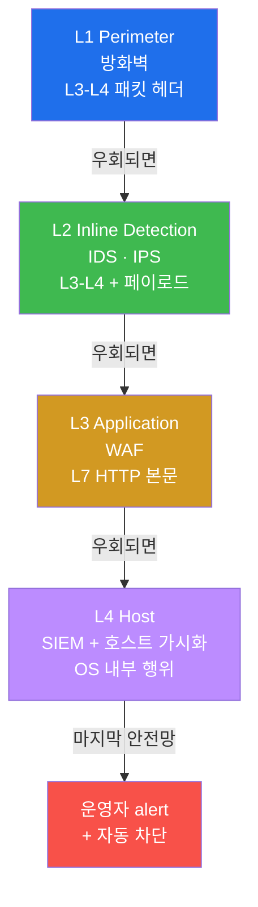
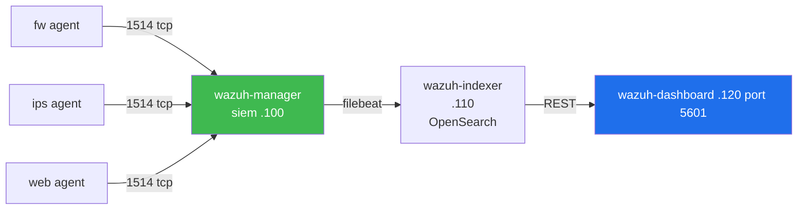
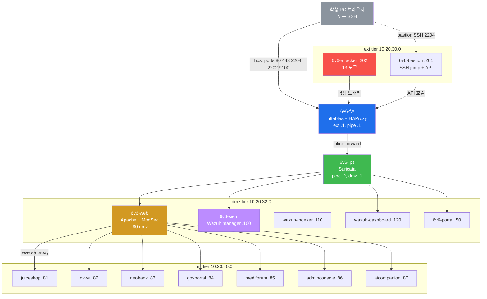
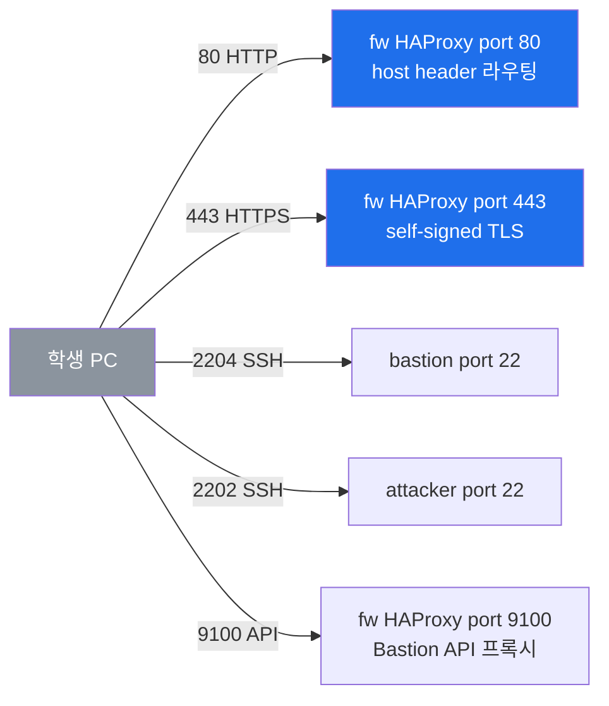
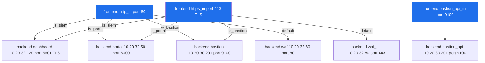
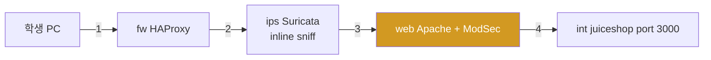
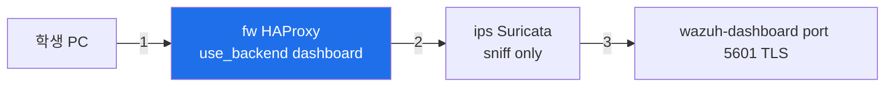
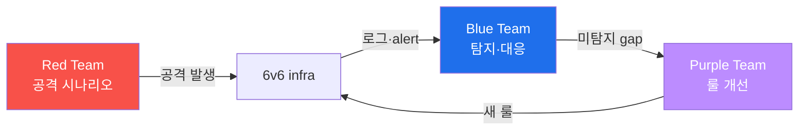
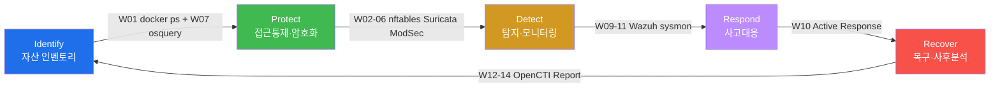

# Week 01 — 보안 솔루션 개론 + 6v6 4-tier 인프라

> **본 주차의 한 줄 요약**
>
> "왜 한 종류의 보안 솔루션만으로는 안 되는가?" 라는 질문에 답하기 위해, 학생은 **6v6
> 4-tier 토폴로지** 위에 배치된 5종 보안 솔루션 (방화벽 / IDS / WAF / SIEM / 호스트
> 가시화) 과 CTI 플랫폼을 직접 만져본다. 마지막엔 가벼운 공격을 흘려 보내 5 솔루션
> 의 각 로그·alert 가 어떻게 연결되는지 추적한다.

---

## 학습 목표

본 주차 종료 시 학생은 다음 6가지를 **본인 손으로** 할 수 있어야 한다.

1. 5종 보안 솔루션 (방화벽 / IPS / WAF / SIEM / 호스트 가시화) 의 역할·계층·차이점을
   비유 없이 1분 안에 설명한다.
2. Defense in Depth 원리에 따라 6v6 4-tier (`ext → pipe → dmz → int`) 가 어떻게
   설계되었는지 화이트보드에 재현한다.
3. bastion ProxyJump 모델로 16개 컨테이너 전부에 SSH 진입하고, 각 컨테이너에서
   본인 역할의 헬스체크를 1분 안에 수행한다.
4. fw HAProxy 의 6개 backend 라우팅 (waf / waf_tls / dashboard / portal / bastion /
   bastion_api) 을 host header 별로 구분하고, 학생 트래픽 vs 운영 트래픽의 hop 차이를
   설명한다.
5. attacker 컨테이너에서 가벼운 공격 (curl XSS / sqlmap UA) 을 발생시키고, 같은
   transaction 의 흔적을 **5 곳** (fw HAProxy log → ips Suricata eve.json → web Apache
   modsec_audit.log → web access.log → siem Wazuh alerts.json) 에서 모두 찾아낸다.
6. 본 주차의 모든 명령·결과·헬스체크 표를 1페이지 보고서로 정리하고, 본인이 발견한
   비정상 / 의문점 1건을 합리적으로 분석한다.

---

## 강의 시간 배분 (총 3시간 40분)

| 시간        | 내용                                                                 | 유형     |
|-------------|----------------------------------------------------------------------|----------|
| 0:00–0:25   | 이론 — 왜 보안 솔루션을 5종이나 두는가 (Defense in Depth, 실 사례 3건) | 강의     |
| 0:25–0:55   | 이론 — 5종 솔루션 (방화벽 / IPS / WAF / SIEM / 호스트 가시화) 상세      | 강의     |
| 0:55–1:05   | 휴식                                                                  | —        |
| 1:05–1:35   | 6v6 4-tier 토폴로지 + HAProxy 라우팅 + 패킷 흐름                       | 강의/토론 |
| 1:35–2:00   | 실습 1 — bastion 점프 + 16 컨테이너 가시화                            | 실습     |
| 2:00–2:30   | 실습 2, 3 — fw / ips 헬스체크 + 룰셋 분석                              | 실습     |
| 2:30–2:40   | 휴식                                                                  | —        |
| 2:40–3:10   | 실습 4, 5 — web ModSec + siem Wazuh 통합 검증                          | 실습     |
| 3:10–3:30   | 실습 6 — **Red/Blue/Purple 통합 시나리오** (공격 1건 → 5 로그 추적)    | 실습     |
| 3:30–3:40   | 정리 + 과제 안내 + 다음 주차 예고                                      | 정리     |

---

## 0. 용어 해설 (보안 솔루션 운영 입문)

| 용어 | 영문 | 뜻 | 비유 |
|------|------|----|------|
| **방화벽** | Firewall | L3/L4 헤더 기반 트래픽 허용·차단 | 건물 외곽 출입 통제 |
| **IDS/IPS** | Intrusion Detection / Prevention System | 페이로드 검사 후 탐지(IDS) / 차단(IPS) | 보안 카메라 + 자동 잠금 |
| **WAF** | Web Application Firewall | HTTP/HTTPS L7 페이로드 전용 방화벽 | 입구 금속탐지기 |
| **SIEM** | Security Information & Event Management | 로그 통합 수집·정규화·상관분석 | CCTV 관제실 |
| **호스트 가시화** | Host visibility | OS 내부 (프로세스/파일/사용자) 가시화 | 건물 안 모든 방의 입실 기록 |
| **CTI** | Cyber Threat Intelligence | 외부 위협 정보 (IOC, TTPs) 수집·공유 | 범죄 정보 공유망 |
| **IOC** | Indicator of Compromise | 침해 지표 (악성 IP, 해시, 도메인) | 수배범 지문, 차량번호 |
| **STIX/TAXII** | Structured Threat Information eXpression / Trusted Automated eXchange | CTI 표준 포맷·교환 프로토콜 | 범죄 보고서 표준 / 경찰서 간 공유 |
| **Defense in Depth** | DiD | 다층 방어 원리 | 외곽 담장 + 출입 통제 + 금고 + CCTV |
| **Bastion** | Bastion host | 내부망 SSH 의 유일한 진입점 | 정문 안내데스크 |
| **ProxyJump** | SSH ProxyJump (-J) | bastion 경유 2-hop SSH | 안내데스크 → 호실 |
| **Reverse Proxy** | — | 외부 요청 → 내부 백엔드 전달 | 호텔 컨시어지 |
| **vhost** | Virtual Host | 같은 IP/포트에서 도메인별 다른 사이트 | 한 건물 안 여러 매장 |
| **HAProxy** | High Availability Proxy | L7 reverse proxy + L4 load balancer | 안내 데스크 (방 번호 라우팅) |
| **conntrack** | connection tracking | 커널 stateful 추적 (orig/reply) | 출입자 기록부 |
| **nftables** | Netfilter Tables | iptables 후속 표준 (커널 3.13+) | 현대화된 출입 통제 매뉴얼 |
| **eve.json** | Suricata Extensible EVent | Suricata 의 JSON 이벤트 로그 | 보안 카메라 영상 인덱스 |
| **CRS** | OWASP Core Rule Set | ModSecurity 의 표준 룰셋 | 표준 검문 매뉴얼 |
| **FIM** | File Integrity Monitoring | 파일 변경 실시간 감시 | 금고 CCTV |
| **SCA** | Security Configuration Assessment | CIS 등 보안 설정 점검 | 건물 안전 점검표 |
| **Red Team** | — | 공격 시뮬레이션 팀 | 공격 측 훈련 인원 |
| **Blue Team** | — | 방어 시뮬레이션 팀 | 방어 측 훈련 인원 |
| **Purple Team** | — | Red + Blue 협업 + detection 개선 | 양 팀 합동 훈련 |

---

## 1. 보안 솔루션이 왜 5종이나 필요한가?

### 1.1 한 줄 답: 단일 방어선은 우회 한 번에 무너지기 때문

침해 사고를 단순화하면 거의 항상 다음 패턴을 따른다.


각 계층이 **독립적으로** 동작하지 않으면, 한 번의 우회로 공격자는 마지막 자산까지 도달
한다. 그래서 우리는 한 종류만이 아니라 **5종을 동시에** 운영한다.

### 1.2 실 침해 사례 3건 (이 강의의 동기)

| 사고 | 원인 | 어느 레이어가 실패했나 |
|------|------|---------------------|
| 2017 Equifax (1.45억건 PII) | Apache Struts CVE-2017-5638 RCE 미패치 | WAF 룰 부재 + 호스트 가시화 부재 |
| 2020 SolarWinds Orion | 빌드 파이프라인 침해 → 정상 서명 업데이트 | 방화벽·IPS 무력 → SIEM·EDR 만이 마지막 안전망 |
| 2021 한국 인터파크 (17,011건) | SQLi → 권한상승 → 데이터 유출 | WAF 미튜닝 + SIEM alert fatigue |

위 3건 모두 **단일 솔루션의 실패**이며, **다른 레이어가 보완했다면** 사고 규모가 줄었을
것이라는 게 사고 후 분석의 공통 결론이다.

### 1.3 Defense in Depth — 4 계층 정식 모델

NIST SP 800-160 v2 + 한국 ISMS-P 통제 2.6 / 2.8 의 핵심 원칙은 다음 4 계층의 동시 운영
이다.



각 계층은 다른 도구 + 다른 데이터 + 다른 운영 인력으로 운영된다. 단일 침해로 4 계층
이 동시에 무력화되기는 극히 어렵다.

### 1.4 6v6 의 4-tier 가 곧 이 4 계층

6v6 는 학생 PC 의 VM 1대 안에 docker 컨테이너로 위 4 계층을 모사한다. 이름 매핑:

| Defense in Depth 계층 | 6v6 컨테이너 | 학습 주차 |
|---------------------|-------------|----------|
| L1 Perimeter | `6v6-fw` (nftables + HAProxy) | W02–W03 |
| L2 Inline Detection | `6v6-ips` (Suricata) | W04–W05 |
| L3 Application | `6v6-web` (Apache + ModSecurity + CRS) | W06 |
| L4 Host — host visibility | osquery on bastion/fw/ips/web | W07 |
| L4 Host — SIEM | `6v6-siem` (Wazuh manager) + indexer + dashboard | W09–W10 |
| L4 Host — event-driven | sysmon-for-linux (web/fw/ips) | W11 |
| (외부 위협 인지) | OpenCTI | W12–W14 |

---

## 2. 5종 보안 솔루션 상세

### 2.1 방화벽 — `6v6-fw`

**한 줄 정의**: 패킷의 IP/port (L3/L4 헤더) 만 보고 허용·차단을 결정하는 가장 단순·빠른
방어 도구.

**6v6 구현**:
- 운영체제: Ubuntu 22.04
- 도구: **nftables** (Linux 커널 표준, iptables 후속)
- 추가: **HAProxy** (L7 host-header 라우팅), 동일 컨테이너에서 같이 동작
- 인터페이스: `ext` 의 .1 (10.20.30.1) ↔ `pipe` 의 .1 (10.20.31.1) — 라우터 모드
- 외부 노출: TCP 80 / 443 / 9100 (호스트 포트와 매핑)

**기본 ruleset 구조**:
```
table inet six_filter {              # 6v6 의 정책 본체 (IPv4 + IPv6 통합)
    chain input {                    # fw 자체로 들어오는 트래픽
        type filter hook input priority 0;
        policy accept;
        tcp dport 22 accept
        ip protocol icmp accept
        ct state established,related accept
    }
    chain forward {                  # fw 를 통과하는 트래픽
        type filter hook forward priority 0;
        policy accept;
        ct state established,related accept
        # (학생이 W02-W03 에서 룰 추가하며 학습)
    }
}
```

**한계**:
- L3/L4 헤더만 본다 → SQL Injection, XSS 같은 L7 payload 공격은 통과시킨다 → **WAF
  필요**
- 암호화된 트래픽 (HTTPS) 의 내부 페이로드는 보지 못함 → IDS 필요

### 2.2 IDS / IPS — `6v6-ips`

**한 줄 정의**: 트래픽 페이로드를 시그니처·이상행위로 검사하여 알려진 공격을 탐지하는
"보안 카메라". IPS 는 탐지 + 자동 차단.

| 모드 | 동작 | 6v6 |
|------|------|-----|
| IDS | passive sniff → alert | Suricata 기본 모드 (`-i eth0 -i eth1`) |
| IPS | NFQUEUE 또는 inline → drop | 본 lab 미사용 (Suricata IPS 모드 + nftables 연동) |

**6v6 구현**:
- 도구: **Suricata 6.0.4** (Ubuntu 22.04 패키지)
- 인터페이스: `pipe` 의 .2 (10.20.31.2) ↔ `dmz` 의 .1 (10.20.32.1) — 두 NIC 동시 sniff
- 룰셋: ETOpen (Emerging Threats Open) 70,000+ 룰
- 출력: `/var/log/suricata/eve.json` (JSON 라인 형식, Wazuh agent ship)

**eve.json 한 줄 예시**:
```json
{
  "timestamp": "2026-05-11T11:06:44.421882+0000",
  "flow_id": 1284584860047176,
  "in_iface": "eth0",
  "event_type": "http",
  "src_ip": "10.20.30.202",
  "dest_ip": "10.20.32.80",
  "http": {
    "hostname": "juice.6v6.lab",
    "url": "/?q=<script>",
    "http_method": "GET",
    "status": 403
  }
}
```

**한계**:
- 시그니처 없는 신종 공격 (0-day) 은 못 잡는다
- HTTPS 내부는 못 본다 (cert 인터셉트 필요)

### 2.3 WAF — `6v6-web`

**한 줄 정의**: HTTP/HTTPS 의 L7 페이로드 (요청 body, header, parameter) 를 검사하는
응용 계층 전용 방화벽.

**6v6 구현**:
- 도구: **Apache 2.4 + libapache2-mod-security2 (v2.9.x) + modsecurity-crs (CRS 3.x)**
- 위치: `dmz` 의 .80 (10.20.32.80) ↔ `int` 의 .80 (10.20.40.80)
- 역할: 11 vhost reverse proxy + WAF 검사
- 핵심 설정: `SecRuleEngine On`, `SecAuditLogFormat JSON`
- 출력: `/var/log/apache2/modsec_audit.log` (JSON 라인)

**modsec_audit.log 한 줄 예시**:
```json
{
  "transaction": {
    "client_ip": "10.20.30.202",
    "request": { "method": "GET", "uri": "/?q=<script>alert(1)</script>" },
    "response": { "http_code": 403 },
    "messages": [
      { "id": "941100", "msg": "XSS Attack Detected via libinjection",
        "data": "Matched Data: <script>" }
    ]
  }
}
```

**한계**:
- 비즈니스 로직 결함 (BOLA, BFLA) 은 시그니처로 잡기 어려움 → SIEM 행위 분석 보완
- 룰 튜닝 부담 (false-positive)

### 2.4 SIEM — `6v6-siem`

**한 줄 정의**: 다 소스의 로그를 통합 수집·정규화·상관분석·알림 하는 "CCTV 관제실".

**6v6 구현 — Wazuh 4.10 stack 3 컨테이너**:



- `6v6-siem` (wazuh-manager:4.10.0) — analysisd + remoted + modulesd + monitord 등 11
  daemon running (16 daemon 정의 중 default-on 11)
- `6v6-wazuh-indexer` (OpenSearch 백엔드 색인)
- `6v6-wazuh-dashboard` (Web UI, HTTPS 5601)

**핵심 명령**:
```
docker exec 6v6-siem /var/ossec/bin/wazuh-control status    # 16 daemon 상태
docker exec 6v6-siem /var/ossec/bin/agent_control -l        # 등록 agent 목록
```

**한계**:
- 룰·디코더 미정의 시 raw 로그만 적재 → 사용자 정의 디코더 필요 (W09)
- alert fatigue (분당 수천 alert) → 우선순위 (level) 튜닝 필요

### 2.5 호스트 가시화 — osquery + sysmon (W07 + W11)

**한 줄 정의**: 네트워크 시그니처로 잡히지 않는 호스트 내부 행위 (프로세스, 파일,
사용자, 소켓) 를 가시화하는 마지막 안전망.

- **osquery** (W07) : OS 를 SQL 테이블로 추상화. `SELECT pid, name FROM processes WHERE
  on_disk = 0;` 같은 헌팅 쿼리.
- **sysmon for Linux** (W11) : Windows Sysmon 의 Linux 포팅. eBPF + auditd 기반 process
  create / network connect / file create 이벤트 stream.

두 도구는 **보완 관계**: osquery 는 snapshot, sysmon 은 event stream.

### 2.6 CTI 통합 — OpenCTI (W12–W14)

위 5종이 "본 환경" 의 데이터를 보는 도구라면, OpenCTI 는 "외부 위협" 정보를 가져와
연결하는 플랫폼이다. STIX 2.1 / TAXII 2.1 표준. W12–W14 에서 본 환경의 Wazuh CDB list
로 IOC 통합 → 알람 자동 격상.

---

## 3. 6v6 4-tier 토폴로지 상세

### 3.1 전체 그림



### 3.2 컨테이너 16개 상세 표

| Tier | 컨테이너 | IP | 핵심 도구 | 학습 주차 |
|------|----------|-----|----------|----------|
| **ext** | `6v6-bastion` | 10.20.30.201 | SSH jump + Bastion API + docker-cli | W01–전체 |
| **ext** | `6v6-attacker` | 10.20.30.202 | nmap, sqlmap, hydra, msfconsole 등 13 도구 | attack |
| **fw (ext↔pipe)** | `6v6-fw` | 10.20.30.1 / 10.20.31.1 | nftables + HAProxy + Wazuh agent + iptables-translate + conntrack | W02–W03 |
| **ips (pipe↔dmz)** | `6v6-ips` | 10.20.31.2 / 10.20.32.1 | Suricata 6.0.4 + nftables masq + Wazuh agent | W04–W05 |
| **dmz** | `6v6-web` | 10.20.32.80 / 10.20.40.80 | Apache 2.4 + ModSecurity v2 + CRS + 11 vhost + Wazuh agent + osquery | W06 |
| **dmz** | `6v6-siem` | 10.20.32.100 | Wazuh manager (11 daemon) + 1514/1515/55000 listen | W09–W10 |
| **dmz** | `6v6-wazuh-indexer` | 10.20.32.110 | OpenSearch (9200) | W09 |
| **dmz** | `6v6-wazuh-dashboard` | 10.20.32.120 | Wazuh Web UI (HTTPS 5601) | W09 |
| **dmz** | `6v6-portal` | 10.20.32.50 | 운영 포털 (FastAPI + HTMX) | W01 |
| **int** | `6v6-juiceshop` | 10.20.40.81 | OWASP Juice Shop (80+ challenge) | attack W03–W08 |
| **int** | `6v6-dvwa` | 10.20.40.82 | DVWA (4 수준) | attack W04 |
| **int** | `6v6-neobank` | 10.20.40.83 | NeoBank (인증/IDOR) | attack W06 |
| **int** | `6v6-govportal` | 10.20.40.84 | GovPortal (auth/LFI) | attack W07 |
| **int** | `6v6-mediforum` | 10.20.40.85 | MediForum (XSS) | attack W05 |
| **int** | `6v6-adminconsole` | 10.20.40.86 | AdminConsole (RCE/XXE) | attack W11 |
| **int** | `6v6-aicompanion` | 10.20.40.87 | AICompanion (LLM injection) | (별 과정) |

### 3.3 외부 노출 포트 5종



### 3.4 vhost 매핑 (host header 별 라우팅)

| vhost | 대상 | 비고 |
|-------|------|------|
| `6v6.lab` | 랜딩 페이지 (web Apache) | 정상 baseline |
| `juice.6v6.lab` | int juiceshop:3000 | ModSec 통과 (WAF 적용) |
| `dvwa.6v6.lab` | int dvwa:80 | ModSec 통과 |
| `neobank.6v6.lab` | int neobank:3001 | ModSec 통과 |
| `govportal.6v6.lab` | int govportal:3002 | ModSec 통과 |
| `mediforum.6v6.lab` | int mediforum:3003 | ModSec 통과 |
| `admin.6v6.lab` | int adminconsole:3004 | ModSec 통과 |
| `ai.6v6.lab` | int aicompanion:3005 | ModSec 통과 |
| `siem.6v6.lab` | dmz wazuh-dashboard:5601 | **WAF 우회** (운영 트래픽) |
| `portal.6v6.lab` | dmz portal:8000 | **WAF 우회** (운영 트래픽) |
| `bastion.6v6.lab` | ext bastion:9100 | **WAF 우회** (운영 트래픽) |

### 3.5 fw HAProxy 라우팅 6 backend



ACL 정의 (haproxy.cfg):
```
acl is_siem    hdr(host) -i siem.6v6.lab
acl is_portal  hdr(host) -i portal.6v6.lab
acl is_bastion hdr(host) -i bastion.6v6.lab
```

운영 트래픽 (siem/portal/bastion) 은 위 ACL 매치 → 별도 backend → **WAF 우회**. 학생
트래픽 (취약 웹) 은 default → waf backend → **WAF 적용**.

### 3.6 패킷 흐름 — 학생 트래픽 vs 운영 트래픽

**학생 트래픽 — 4 hop (`juice.6v6.lab`)**:


**운영 트래픽 — 3 hop (`siem.6v6.lab`)**:


**핵심 차이**: 학생 트래픽은 web 의 ModSec 을 거치지만, 운영 트래픽은 거치지 않는다.
이유 — 운영자가 SIEM dashboard 를 사용할 때 ModSec false-positive 로 차단되는 사고를
방지.

### 3.7 SSH ProxyJump 모델

학생 PC 의 `~/.ssh/config` 에 다음 한 번만 추가:

```
Host 6v6-bastion
    HostName 192.168.0.110
    Port 2204
    User ccc

Host 6v6-attacker
    HostName 192.168.0.110
    Port 2202
    User ccc

Host 6v6-*
    ProxyJump 6v6-bastion
    User ccc
```

그 후 `ssh 6v6-fw` / `ssh 6v6-ips` / `ssh 6v6-web` / `ssh 6v6-siem` 모두 bastion 경유
자동 2-hop. 비밀번호는 모두 `ccc`. attacker 는 `ssh 6v6-attacker` 로 직접 진입.

---

## 4. Red / Blue / Purple Team 운영 관점

본 강의의 모든 실습은 **3 관점** 으로 진행한다.



| 팀 | 책임 | 본 주차 활동 |
|----|------|-------------|
| **Red** | 공격 시뮬레이션 | attacker 에서 curl XSS / sqlmap 시도 |
| **Blue** | detection + 분석 | fw/ips/web/siem 의 5 곳 로그 추적 |
| **Purple** | gap 분석 + 룰 개선 | 미탐지 TTP 식별 + W04+ 에서 룰 추가 |

본 주차 (W01) 는 인프라 가시화가 주제 → Blue 위주. W02~W07 에서 Red 가 가벼워지고
Purple 비중 증가. W15 기말이 3 팀 통합 시나리오.

---

## 5. 실습 안내 (총 6 실습)

각 실습은 **4 축 설명** 포함:

- **이 실습을 왜 하는가?** — 학습의 동기
- **이걸 하면 무엇을 알 수 있는가?** — 기대 산출물
- **결과 해석** — 정상/비정상 구분 기준
- **실전 활용** — 운영 시 사용 시점

### 실습 1 — bastion 점프 + 16 컨테이너 가시화 (25분)

> **이 실습을 왜 하는가?**
> 보안 운영자는 인프라 진입 첫 단계로 자산 인벤토리를 확보한다. 6v6 는 16개 컨테이너의
> 단일 진입점 (bastion) 을 두어 ISMS-P 2.5 (인증·권한관리) 의 single point of access
> 원칙을 모사한다.
>
> **이걸 하면 무엇을 알 수 있는가?**
> - 4-tier 토폴로지의 실제 컨테이너 IP·이름·역할 매핑
> - SSH ProxyJump 의 동작 원리 (2-hop)
> - docker socket 의 read-only 마운트 효과 (bastion → docker ps 가능, docker rm 불가)
>
> **결과 해석**
> 정상: 16개 (또는 그 이상) 컨테이너가 `Up` 상태. 비정상: `Restarting` 또는 `Exited`
> 가 1개라도 있으면 즉시 `docker logs` 로 원인 파악.
>
> **실전 활용**
> 운영 인수 시 첫 30초 명령. dashboard 보다 빠르고 정확.

**Step 1.1 — 학생 PC 에서 bastion 진입**

```bash
# 학생 PC 터미널
ssh 6v6-bastion
# password: ccc
# 첫 접속 시 fingerprint 수락
```

**예상 출력**:
```
Welcome to bastion (6v6 jump host)
ccc@bastion:~$
```

**Step 1.2 — 16 컨테이너 가시화 (bastion 안에서)**

```bash
docker ps --format 'table {{.Names}}\t{{.Status}}' | head -20
```

**예상 출력 (16 라인 + header)**:
```
NAMES                STATUS
6v6-bastion          Up X seconds
6v6-attacker         Up 2 days
6v6-fw               Up 2 days
6v6-ips              Up 2 days
6v6-web              Up 2 days
6v6-siem             Up 2 days
6v6-wazuh-indexer    Up 2 days
6v6-wazuh-dashboard  Up 2 days
6v6-portal           Up 2 days
6v6-juiceshop        Up 2 days
6v6-dvwa             Up 2 days
6v6-neobank          Up 2 days
6v6-govportal        Up 2 days
6v6-mediforum        Up 2 days
6v6-adminconsole     Up 2 days
6v6-aicompanion      Up 2 days
```

**Step 1.3 — 4 핵심 컨테이너의 NIC 가시화**

bastion 안에서 docker inspect 로 fw / ips 의 dual-NIC 확인:

```bash
for c in 6v6-fw 6v6-ips; do
  echo "=== $c ==="
  docker inspect $c --format '{{range $k,$v := .NetworkSettings.Networks}}{{$k}}={{$v.IPAddress}} {{end}}'
done
```

**예상 출력**:
```
=== 6v6-fw ===
6v6-ext=10.20.30.1 6v6-pipe=10.20.31.1
=== 6v6-ips ===
6v6-pipe=10.20.31.2 6v6-dmz=10.20.32.1
```

fw 와 ips 가 각자 2개 NIC 를 가져야 라우터로 동작 가능.

**Step 1.4 — ProxyJump 통과 검증 (학생 PC 에서 4 컨테이너 진입)**

```bash
# 학생 PC (bastion 에서 exit 한 후)
for h in fw ips web siem; do
  echo "--- 6v6-$h ---"
  ssh 6v6-$h hostname
done
```

**예상 출력**:
```
--- 6v6-fw ---
fw
--- 6v6-ips ---
ips
--- 6v6-web ---
web
--- 6v6-siem ---
wazuh.manager
```

4 컨테이너 모두 hostname 응답 → ProxyJump 정상.

> **핵심 포인트**: 학생 PC 에서 직접 `ssh ccc@10.20.30.1` 은 불가 (docker bridge 가
> 학생 PC LAN 에 라우팅 안 됨). bastion (192.168.0.110:2204) 만이 유일한 진입점이다.

---

### 실습 2 — fw nftables + HAProxy 헬스체크 (15분)

> **이 실습을 왜 하는가?**
> fw 는 Defense in Depth 의 L1 — 패킷이 가장 먼저 만나는 보안 게이트. fw 의 정책
> (nftables) 과 라우팅 (HAProxy) 이 모두 정상이어야 학생 트래픽이 chain 통과한다.
>
> **이걸 하면 무엇을 알 수 있는가?**
> - nftables 의 6v6 table 명 (`inet six_filter`, `ip six_nat`) 과 chain 구조
> - HAProxy 의 6 backend 정의 (waf / waf_tls / dashboard / portal / bastion / bastion_api)
> - fw 가 ip_forward=1 + 2 NIC + 라우팅 테이블 정상
>
> **결과 해석**
> table 출력 3개 (`ip nat` docker daemon + `inet six_filter` 6v6 정책 + `ip six_nat` 6v6 NAT stub).
> HAProxy backend health 모두 `UP`.
>
> **실전 활용**
> production 환경에서 fw 의 첫 헬스체크. 5분 안에 모든 backend health 확인 가능해야.

**Step 2.1 — nftables 가시화**

```bash
ssh 6v6-fw 'sudo nft list tables 2>&1 | grep -v "^XT"'
```

**예상 출력**:
```
table ip nat
table inet six_filter
table ip six_nat
```

`XT match` 경고는 docker 의 ipset 호환 모듈 부재 — 무시. 우리가 보는 것은 `inet
six_filter` + `ip six_nat`.

**Step 2.2 — forward chain 의 default policy 확인**

```bash
ssh 6v6-fw 'sudo nft list chain inet six_filter forward'
```

**예상 출력**:
```
table inet six_filter {
    chain forward {
        type filter hook forward priority filter; policy accept;
        ct state established,related accept
    }
}
```

`policy accept` 가 default — 학습용 단순 설정. production 은 `policy drop` + 명시적
화이트리스트 (W02 의 과제).

**Step 2.3 — HAProxy 6 backend 정의**

```bash
ssh 6v6-fw 'sudo grep -E "^backend|^frontend|use_backend|default_backend" /etc/haproxy/haproxy.cfg'
```

**예상 출력 (예시)**:
```
frontend http_in
    use_backend dashboard if is_siem
    use_backend portal    if is_portal
    use_backend bastion   if is_bastion
    default_backend waf
frontend https_in
    use_backend dashboard if is_siem
    use_backend portal    if is_portal
    use_backend bastion   if is_bastion
    default_backend waf_tls
frontend bastion_api_in
    default_backend bastion_api
backend waf
backend waf_tls
backend dashboard
backend portal
backend bastion
backend bastion_api
```

3 frontend + 6 backend.

**Step 2.4 — HAProxy 라우팅 4 방향 실 테스트 (attacker 에서)**

```bash
ssh 6v6-attacker 'for h in juice.6v6.lab siem.6v6.lab portal.6v6.lab bastion.6v6.lab; do
  code=$(curl -sk -o /dev/null -w "%{http_code}" -H "Host: $h" http://10.20.30.1/)
  echo "$h: $code"
done'
```

**예상 출력**:
```
juice.6v6.lab: 200
siem.6v6.lab: 302
portal.6v6.lab: 200
bastion.6v6.lab: 200
```

`200` 또는 `302` (redirect) 가 정상. `503` 이면 backend 다운, `403` 이면 ModSec 차단.

---

### 실습 3 — ips Suricata 헬스체크 (15분)

> **이 실습을 왜 하는가?**
> ips 는 L2 — 학생 트래픽이 web 으로 도달하기 직전 검사. Suricata 가 동작하지 않으면
> 모든 alert 가 사라진다.
>
> **이걸 하면 무엇을 알 수 있는가?**
> - Suricata 가 2 NIC (eth0=pipe + eth1=dmz) 동시 sniff
> - ETOpen 룰셋 30,000+ 활성
> - eve.json 의 7+ event_type (flow/http/dns/tls/alert/stats/fileinfo)
>
> **결과 해석**
> 정상: pgrep 가 Suricata 1 프로세스 + eve.json 의 최근 timestamp (1분 이내).
> 비정상: Suricata 미가동 또는 eve.json 의 timestamp 가 1시간 이상 전.
>
> **실전 활용**
> SOC 분석가가 alert 가 안 보일 때 첫 확인. "Suricata 가 죽었나?" 5분 안에 답.

**Step 3.1 — Suricata 가동 + 두 NIC sniff**

```bash
ssh 6v6-ips 'pgrep -a Suricata; echo "---"; sudo suricatasc -c version; sudo suricatasc -c uptime'
```

**예상 출력**:
```
29 suricata -i eth1 -i eth0 -c /etc/suricata/suricata.yaml --runmode autofp -l /var/log/suricata
---
{"message": "6.0.4 RELEASE", "return": "OK"}
{"message": 191968, "return": "OK"}
```

`-i eth1 -i eth0` 가 보여야 두 NIC sniff. uptime 정수 (초).

**Step 3.2 — eve.json 최근 event_type 분포**

```bash
ssh 6v6-ips 'sudo tail -500 /var/log/suricata/eve.json | jq -r .event_type | sort | uniq -c | sort -rn'
```

**예상 출력 (예시)**:
```
    314 flow
    156 tls
      9 stats
      8 alert
      7 fileinfo
      6 http
```

`flow` 가 가장 많고 `http` / `tls` / `dns` / `alert` 가 섞여 있어야 정상. `flow` 만
있으면 protocol decoder 가 동작하지 않음.

**Step 3.3 — 활성 룰 수**

```bash
ssh 6v6-ips 'sudo wc -l /var/lib/suricata/rules/suricata.rules 2>/dev/null || sudo wc -l /etc/suricata/rules/*.rules 2>&1 | tail'
```

**예상 출력**: 30,000+ 라인 (ETOpen 통합 룰셋).

**Step 3.4 — Suricata 내부 카운터 (drop 비율 확인)**

```bash
ssh 6v6-ips 'sudo suricatasc -c dump-counters 2>&1 | jq ".message | {pkts: .[\"capture.kernel_packets\"], drops: .[\"capture.kernel_drops\"], alerts: .[\"detect.alert\"]}"'
```

**예상 출력 (예시)**:
```json
{
  "pkts": 12345,
  "drops": 0,
  "alerts": 234
}
```

`drops / pkts < 0.01` (1%) 가 정상 운영. drops > 1% 이면 NIC ring buffer 부족.

---

### 실습 4 — web Apache + ModSecurity 헬스체크 (15분)

> **이 실습을 왜 하는가?**
> web 은 L3 — HTTP 페이로드 마지막 검사. ModSec 가 동작하지 않으면 OWASP Top 10
> 공격이 모두 통과한다.
>
> **이걸 하면 무엇을 알 수 있는가?**
> - Apache 의 mod_security2 + mod_proxy + mod_ssl 모듈 로드
> - SecRuleEngine On + audit log JSON 형식
> - 11 vhost reverse proxy
> - 가벼운 공격 페이로드 → 403 차단 동작
>
> **결과 해석**
> `security2_module (shared)` 출력 + `SecRuleEngine On` + XSS 페이로드에 `403` 응답.
>
> **실전 활용**
> WAF 운영 1순위. SecRuleEngine 가 Off 면 사실상 무방어.

**Step 4.1 — Apache 모듈 로드**

```bash
ssh 6v6-web 'sudo apache2ctl -M 2>&1 | grep -iE "security|proxy|ssl"'
```

**예상 출력**:
```
 security2_module (shared)
 proxy_module (shared)
 proxy_http_module (shared)
 proxy_wstunnel_module (shared)
 ssl_module (shared)
```

3 모듈 (`security2_module`, `proxy_module`, `ssl_module`) 필수.

**Step 4.2 — ModSec engine + audit log 형식**

```bash
ssh 6v6-web 'sudo grep -E "^SecRuleEngine|^SecAuditLog|^SecAuditEngine|^SecAuditLogFormat" /etc/modsecurity/modsecurity.conf'
```

**예상 출력**:
```
SecRuleEngine On
SecAuditEngine RelevantOnly
SecAuditLogFormat JSON
SecAuditLog /var/log/apache2/modsec_audit.log
```

`On` + `JSON` 두 가지가 핵심. `DetectionOnly` 면 차단 없이 로그만, `Off` 면 무방어.

**Step 4.3 — CRS 룰셋 파일 수**

```bash
ssh 6v6-web 'ls /usr/share/modsecurity-crs/rules/ | wc -l; ls /usr/share/modsecurity-crs/rules/REQUEST-94*.conf'
```

**예상 출력**:
```
31
/usr/share/modsecurity-crs/rules/REQUEST-941-APPLICATION-ATTACK-XSS.conf
/usr/share/modsecurity-crs/rules/REQUEST-942-APPLICATION-ATTACK-SQLI.conf
```

`REQUEST-941` (XSS) + `REQUEST-942` (SQLi) 가 핵심 룰 파일.

**Step 4.4 — XSS 공격 → 403 차단**

```bash
ssh 6v6-attacker 'curl -s -o /dev/null -w "XSS attempt: %{http_code}\n" -H "Host: juice.6v6.lab" "http://10.20.30.1/?q=<script>alert(1)</script>"'
sleep 2
ssh 6v6-web 'sudo tail -3 /var/log/apache2/modsec_audit.log | head -1 | jq -r ".transaction.messages[]? | select(.id | startswith(\"941\")) | .id" | head -3'
```

**예상 출력**:
```
XSS attempt: 403
941100
941160
```

`403` + `941xxx` 룰 ID 매치 → ModSec 정상 차단.

---

### 실습 5 — siem Wazuh manager + 3 agent 헬스체크 (20분)

> **이 실습을 왜 하는가?**
> siem 은 L4 — 모든 source 의 로그가 모이는 관제실. manager 가 죽으면 alert 가
> 생성되지 않고, agent 가 disconnect 면 source 가 사라진다.
>
> **이걸 하면 무엇을 알 수 있는가?**
> - Wazuh manager 의 11 daemon (default-on) 가동
> - 3 agent (fw / ips / web) 모두 Active
> - 1514/1515/55000 3 listening port
> - cluster status green
>
> **결과 해석**
> 정상: 11 daemon running + 3 agent Active. 비정상: analysisd / remoted stopped 또는
> agent Never connected.
>
> **실전 활용**
> SIEM 운영자가 매일 아침 1순위로 확인.

**Step 5.1 — manager 11 daemon**

```bash
ssh 6v6-siem 'sudo /var/ossec/bin/wazuh-control status'
```

**예상 출력 (요약)**:
```
wazuh-clusterd not running...    # default-off (단일 노드)
wazuh-modulesd is running...
wazuh-monitord is running...
wazuh-logcollector is running...
wazuh-remoted is running...
wazuh-syscheckd is running...
wazuh-analysisd is running...
wazuh-maild not running...        # default-off (smtp 미설정)
wazuh-execd is running...
wazuh-db is running...
wazuh-authd is running...
wazuh-agentlessd not running...   # default-off
wazuh-integratord not running...  # default-off
wazuh-dbd not running...           # default-off
wazuh-csyslogd not running...      # default-off
wazuh-apid is running...
```

`running` 이 11개 (modulesd / monitord / logcollector / remoted / syscheckd /
analysisd / execd / db / authd / apid + control 자체).

**Step 5.2 — 등록 agent 3대**

```bash
ssh 6v6-siem 'sudo /var/ossec/bin/agent_control -l'
```

**예상 출력**:
```
Wazuh agent_control. List of available agents:
   ID: 000, Name: wazuh.manager (server), IP: 127.0.0.1, Active/Local
   ID: 001, Name: web, IP: any, Active
   ID: 002, Name: ips, IP: any, Active
   ID: 003, Name: fw, IP: any, Active
```

3 agent 모두 `Active`. `Never connected` 또는 `Disconnected` 면 해당 agent 컨테이너의
`wazuh-agentd` 점검.

**Step 5.3 — 3 listening port (1514/1515/55000)**

```bash
ssh 6v6-siem 'sudo ss -tlnp | grep -E ":(1514|1515|55000)"'
```

**예상 출력**:
```
LISTEN 0  128  *:1514       *:*  users:(("wazuh-remoted",pid=...))
LISTEN 0  128  *:1515       *:*  users:(("wazuh-authd",pid=...))
LISTEN 0  128  *:55000      *:*  users:(("python3",pid=...))
```

`1514` (event ingestion) + `1515` (enrollment) + `55000` (REST API).

**Step 5.4 — wazuh-indexer cluster health**

```bash
ssh 6v6-bastion 'docker exec 6v6-wazuh-indexer curl -sk -u admin:SecretPassword https://localhost:9200/_cluster/health | jq'
```

**예상 출력**:
```json
{
  "cluster_name": "wazuh-cluster",
  "status": "green",
  "number_of_nodes": 1,
  "active_shards": 16
}
```

`green` (단일 노드 + replica 0) 또는 `yellow` (replica 1 미할당) 정상. `red` 면 shard
손실.

**Step 5.5 — 최근 alert event 1건 분석**

```bash
ssh 6v6-siem 'sudo tail -3 /var/ossec/logs/alerts/alerts.json | tail -1 | jq "{ts: .timestamp, agent: .agent.name, rule_id: .rule.id, level: .rule.level, desc: .rule.description}"'
```

**예상 출력 (예시)**:
```json
{
  "ts": "2026-05-11T11:30:00.000+0000",
  "agent": "web",
  "rule_id": "31151",
  "level": 5,
  "desc": "Apache: 4xx response"
}
```

`level >= 7` 이면 운영자 주목 대상.

---

### 실습 6 — **Red/Blue/Purple 통합 시나리오** — 공격 1건의 5 흔적 추적 (25분)

> **이 실습을 왜 하는가?**
> 1~5 실습이 각 솔루션의 단독 가시화였다면, 본 실습은 **한 공격의 전 사이클** 을
> 5 곳에서 동시에 추적하는 통합 실험. SOC 분석가가 실제 침해 분석할 때 하는 작업
> 이다.
>
> **이걸 하면 무엇을 알 수 있는가?**
> - 한 transaction 이 fw → ips → web → siem 을 어떻게 통과하는지
> - 같은 공격이 4 도구에서 어떻게 다른 정보로 기록되는지
> - 미탐지 gap (어느 도구가 못 잡는가) 의 식별 방법
>
> **결과 해석**
> 정상: 4 도구 모두에 같은 transaction 흔적 + ModSec 차단. 비정상: 흔적 누락 = chain
> 끊김 또는 도구 오작동.
>
> **실전 활용**
> Purple Team 의 표준 절차. Red 가 공격 → Blue 가 추적 → gap 식별 → 룰 추가.

#### 시나리오: "Red 가 attacker 컨테이너에서 sqlmap UA + XSS payload 로 juice.6v6.lab 공격"

**Red — 공격 발생 (1초)**:

```bash
ssh 6v6-attacker 'curl -s -o /dev/null -A "sqlmap/1.5" -H "Host: juice.6v6.lab" "http://10.20.30.1/?q=<script>alert(1)</script>&id=1+UNION+SELECT"'
```

이 한 줄의 curl 이 다음 4 도구에 흔적을 남긴다.

**Blue — 5 곳 추적 (수동, 4분)**:

다음 5 명령을 순차 실행 (또는 5 터미널 동시).

**(1) fw HAProxy log**:
```bash
ssh 6v6-fw 'sudo grep "sqlmap\|10.20.30.202" /var/log/haproxy.log 2>/dev/null | tail -3 || sudo journalctl -u haproxy --since "1m ago" | tail -5'
```

**예상**: HAProxy 가 frontend `http_in` → backend `waf` 로 라우팅한 1 라인. client IP =
attacker, backend = web.

**(2) ips Suricata eve.json — 두 NIC 양쪽 캡처**:
```bash
ssh 6v6-ips 'sudo tail -300 /var/log/suricata/eve.json | jq -c "select(.event_type==\"http\" and .http.hostname==\"juice.6v6.lab\") | {ts: .timestamp, src: .src_ip, url: .http.url, status: .http.status}" | tail -2'
```

**실측 결과** (2026-05-11):
```json
{"ts":"2026-05-11T12:56:08.184785+0000","src":"10.20.31.1","url":"/?q=<script>alert(1)</script>&id=1+UNION+SELECT","status":403}
{"ts":"2026-05-11T12:56:08.184790+0000","src":"10.20.32.1","url":"/?q=<script>alert(1)</script>&id=1+UNION+SELECT","status":403}
```

같은 transaction 이 **두 라인** 으로 기록되는 이유 — Suricata 가 ips 의 두 NIC
(eth0=pipe + eth1=dmz) 양쪽에서 sniff. fw → ips (pipe NIC, src=10.20.31.1) 와 ips →
web (dmz NIC, src=10.20.32.1) 두 hop 의 packet 을 같은 microsecond 안에 캡처 →
**2 event 가 정상**. 한 라인만 보이면 NIC 하나가 죽었거나 promisc 모드 실패.

**(3) web Apache vhost log — `juice_access.log` (vhost 별 별도)**:
```bash
ssh 6v6-web 'sudo tail -5 /var/log/apache2/juice_access.log'
```

**실측 결과** (2026-05-11, 5회 burst 후):
```
10.20.32.1 - - [11/May/2026:12:55:24 +0000] "GET /?q=<script>alert(1)</script> HTTP/1.1" 403 439 "-" "sqlmap/1.5"
10.20.32.1 - - [11/May/2026:12:55:25 +0000] "GET /?q=<script>alert(1)</script> HTTP/1.1" 403 439 "-" "sqlmap/1.5"
10.20.32.1 - - [11/May/2026:12:55:25 +0000] "GET /?q=<script>alert(1)</script> HTTP/1.1" 403 439 "-" "sqlmap/1.5"
10.20.32.1 - - [11/May/2026:12:55:25 +0000] "GET /?q=<script>alert(1)</script> HTTP/1.1" 403 439 "-" "sqlmap/1.5"
10.20.32.1 - - [11/May/2026:12:56:08 +0000] "GET /?q=<script>alert(1)</script>&id=1+UNION+SELECT HTTP/1.1" 403 439 "-" "sqlmap/1.5"
```

> 6v6 의 Apache 는 11 vhost 별 별도 access/error log (예: `juice_access.log`, `juice_error.log`,
> `dvwa_access.log` 등). 단일 `access.log` 가 아니라 vhost 별 분리되어 있어 분석이
> 정밀하다. client IP 가 HAProxy hop (10.20.32.1) 인 이유 — Apache 의 첫 컬럼은
> 직전 hop. 원래 attacker IP 는 X-Forwarded-For 헤더에서 확인.

**(4) web modsec_audit.log — JSON 형식**:

> 6v6 의 ModSec audit log 는 `SecAuditLogFormat JSON` + `SecAuditLogParts ABCFHZ`
> 로 설정되어 한 transaction = 1 JSON 라인. 실제 구조는:
> `{ "transaction": {...}, "request": {...}, "response": {...}, "audit_data": { "messages": [...] } }`
> 매치된 룰은 `audit_data.messages` 배열 (string 형식, brackets 안에 `id "913100"` 처럼 임베드).

```bash
ssh 6v6-web 'sudo tail -3 /var/log/apache2/modsec_audit.log | head -1 | jq "{client: .transaction.remote_address, code: (.response.status // .response.http_code), rules: [.audit_data.messages[]? | capture(\"id \\\"(?<id>[0-9]+)\\\"\") | .id]}"'
```

**실측 결과** (2026-05-11):
```json
{
  "client": "10.20.32.1",
  "code": 403,
  "rules": [
    "913100",
    "941100",
    "941110",
    "941160",
    "949110",
    "980130"
  ]
}
```

매치된 6 룰의 의미:

| 룰 ID | 카테고리 | 의미 |
|-------|---------|------|
| 913100 | Scanner Detection | sqlmap User-Agent 매칭 |
| 941100 | XSS via libinjection | `<script>` payload libinjection 매치 |
| 941110 | XSS Filter Cat 1 | Script Tag Vector 정규식 매치 |
| 941160 | XSS NoScript | NoScript filter |
| 949110 | Anomaly Threshold | inbound anomaly score 5+ 도달 → 차단 |
| 980130 | Correlation | 룰 매치 종합 보고 |

`client: 10.20.32.1` 은 ips 의 dmz NIC (HAProxy hop 의 다음 hop). 원래 attacker IP
(10.20.30.202) 는 `request.headers["X-Forwarded-For"]` 헤더에 보존된다 (HAProxy 의
`option forwardfor` 설정 효과).

**(5) siem Wazuh alerts.json — 통합 검증**:

> 주의: `siem` 컨테이너에 `jq` 미설치 (공식 Wazuh 이미지 minimal). bastion 의 docker
> exec 로 jq 호출하거나 python3 으로 파싱.

```bash
ssh 6v6-siem 'tail -500 /var/ossec/logs/alerts/alerts.json | grep -E "web|10.20.30.202" | tail -2 | head -1' \
  | python3 -c "import json,sys; d=json.loads(sys.stdin.read()); print(json.dumps({'agent':d.get('agent',{}).get('name'),'rule_id':d.get('rule',{}).get('id'),'level':d.get('rule',{}).get('level'),'desc':d.get('rule',{}).get('description')}, ensure_ascii=False))"
```

**실측 결과** (2026-05-11) — 본 lab 의 기본 Wazuh decoder 는 ModSec audit log 의
JSON 형식을 `913100` / `941100` 등 specific 룰 ID 로 격상시키지 않는다. 일반 Apache
4xx 룰 (`31100`) 또는 agent 통신 이벤트 (`504`) 가 가장 자주 잡힌다.

```json
{"agent": "fw", "rule_id": "19008", "level": 3, "desc": "CIS Ubuntu Linux 22.04 LTS Benchmark v1.0.0.: Ensure CUPS is not installed."}
```

(예시 출력은 SCA 룰 — agent 의 정기 점검 결과)

> **Purple Team 의 핵심 인사이트**: ModSec 의 941/942 룰 매치를 SIEM alert level
> 12 (critical) 로 자동 격상하려면 W09 의 **사용자 정의 decoder + local_rules.xml
> 추가** 가 필요하다. 본 step 에서 specific 룰 ID 가 안 보이는 게 정상이며, 이를
> 발견하는 것이 본 시나리오의 **Gap 식별** 산출물.

**Purple — gap 분석**:

위 5 흔적의 **일관성** 검토:
1. fw 가 봤다 → ips 가 봤다 → web 이 봤다 → siem 이 받았다? (chain 통과 검증)
2. 각 도구가 같은 transaction 을 다른 ID 로 기록 — 어떻게 correlate 할까?
   - 공통 키: timestamp (ms 단위) + client IP + URI
   - X-Forwarded-For 헤더 (HAProxy 가 추가)
   - Suricata 의 flow_id (한 conn 의 모든 event 가 공유)
3. 미탐지 발견 시 (예: Wazuh 의 ModSec decoder 가 941 매치를 못 잡으면 W09 의 디코더
   추가).

> **Purple Team 정리**: 본 실습에서 4 도구 모두 흔적 있으면 정상. 한 곳이라도 누락
> 이면 해당 도구의 룰/디코더 점검 (W04+ 에서 학습).

---

## 6. 사례 분석 — KISA + ISMS-P + NIST

### 6.1 KISA 보호나라 2024 침해사고 분석 (요약)

KISA "2024 Q3 침해사고 분석 보고서" 의 사고 5건 중 4건의 공통점:

| 사고 카테고리 | 비율 | 본 인프라의 어떤 도구가 막을 수 있나? |
|--------------|------|--------------------------------------|
| 인터넷 노출 DB / 관리 콘솔 | 35% | fw (nftables) + Bastion 단일 진입 |
| 웹 SQLi → 데이터 유출 | 28% | ModSec CRS 942 + Wazuh CDB list |
| 피싱 → 자격증명 → 측면이동 | 20% | osquery last + sysmon ProcessCreate + Wazuh FIM |
| APT 장기 잠복 | 17% | OpenCTI Sighting + Suricata ET TROJAN |

본 강의 15주가 위 4 카테고리 모두에 대응.

### 6.2 ISMS-P 통제 매핑

| 통제 | 본 과목 주차 |
|------|-------------|
| 2.5 인증·권한관리 | W01 (bastion) |
| 2.6 네트워크 접근통제 | W02–W03 (nftables) |
| 2.6.4 네트워크 침입탐지 | W04–W05 (Suricata) |
| 2.10.7 보안위협 대응 | W06 (ModSec) |
| 2.9.2 로그관리 | W09–W10 (Wazuh) |
| 2.5.4 사용자 인증 | W07 (osquery sudo / last) |
| 2.12 사고대응 | W12–W14 (OpenCTI Sighting + Report) |
| 종합 | W15 (기말, APT 5 단계) |

### 6.3 NIST CSF 5 function 매핑



---

## 7. 과제

### A. 토폴로지 재현 (필수, 30점)

A4 한 장에 6v6 의 16 컨테이너 + 4-tier (ext/pipe/dmz/int) + 패킷 흐름 (학생 트래픽 +
운영 트래픽 각 1개) 을 손으로 그려 제출. 다음 정보 모두 포함:

- 컨테이너 이름·IP·역할
- 4 bridge (ext / pipe / dmz / int) 의 subnet
- HAProxy 의 6 backend 라우팅 화살표
- 호스트 노출 포트 5개 (80/443/2204/2202/9100) 의 매핑

### B. 헬스체크 보고서 (필수, 50점)

실습 1~6 의 출력을 1페이지 보고서 (Markdown PDF) 로:

- 6 step 종합 표 (pass / partial / fail + 근거)
- 본인 발견 비정상 / 의문점 1건 (없으면 "정상" + 근거)
- Red/Blue/Purple 실습 6 의 4 도구 흔적 첨부 (jq 출력)

### C. KISA 사례 매핑 (심화, 20점)

KISA 보호나라에서 2025년 침해사고 1건 선택 후:

- 어느 ISMS-P 통제가 무력화됐나?
- 본 인프라의 어떤 솔루션이 사전 차단할 수 있었나?
- 학생 본인이 운영자라면 어떤 룰을 추가하겠는가? (W02–W14 학습 후 재검토)

---

## 8. 평가 기준

| 항목 | 비중 | 평가 방법 |
|------|------|----------|
| 토폴로지 재현 (A) | 30% | IP/라우팅 정확도 + 4-tier 분리 명확성 |
| 헬스체크 보고서 (B) | 50% | 6 실습 모두 출력 + 의문점 분석 + R/B/P 통합 |
| KISA 사례 (C) | 20% | 매핑 논리성 + 룰 권장 |

총점 100점. 60점 미만은 재실습 + 재제출.

---

## 9. 핵심 정리 (1줄씩)

1. **Defense in Depth** — 4 독립 레이어 (Perimeter / Inline / Application / Host) 의
   동시 운영. 단일 우회로 전 자산 노출 방지.
2. **6v6 4-tier** — `ext → pipe → dmz → int`. fw / ips 가 라우터로 chain 강제.
3. **5종 보안 솔루션** — 방화벽 (fw) / IPS (ips) / WAF (web) / SIEM (siem) / 호스트 가시화
   (osquery + sysmon). 한 종류로 충분치 않다.
4. **운영 vs 학생 트래픽 분리** — HAProxy host header ACL 로 siem/portal/bastion 은
   WAF 우회, 취약 웹 8종은 WAF 경유.
5. **bastion ProxyJump** — 16 컨테이너 전부 단일 진입점. 직접 IP 접속 불가.
6. **Red/Blue/Purple** — 모든 실습에 3 관점 적용. 본 주차 실습 6 이 첫 통합 시나리오.

---

## 10. 다음 주차 (W02) 예고

- **주제**: nftables 방화벽 (1) — table / chain / rule / set 4 핵심 개념
- **실습 환경**: `6v6-fw` 단독
- **핵심 도구**: `nft`, `iptables-translate`, `tcpdump`, `conntrack`
- **선수 학습**: nftables wiki "Quick reference" 통독
- **R/B/P 시나리오**: Red 가 attacker → fw:80 으로 brute scan → Blue 가 fw 의 input
  chain 에 drop 룰 추가 → Purple 가 효과 측정 후 ruleset 영구화.
