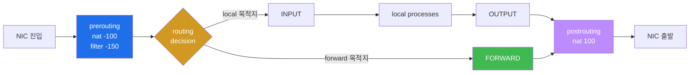
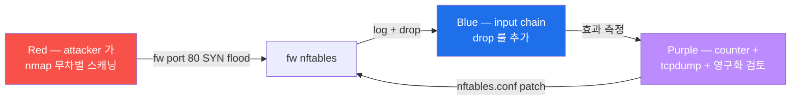
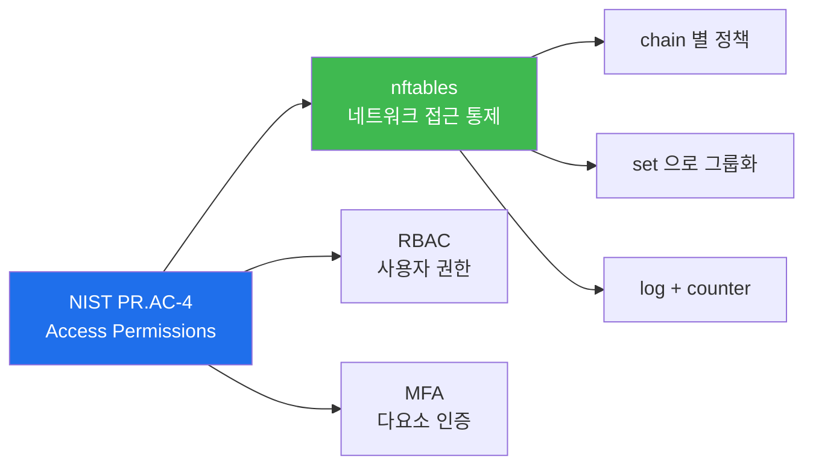

# Week 02 — nftables 방화벽 (1) — 기초 + table/chain/rule/set

> **본 주차의 한 줄 요약**
>
> 6v6-fw 컨테이너의 **nftables** (리눅스 커널 표준 패킷 필터링 프레임워크) 를 깊이
> 해부한다. 4 핵심 개념 (table / chain / rule / set) + 5 hook (input/output/forward/
> prerouting/postrouting) + counter 분석 + 동적 룰 추가/삭제 + Red/Blue/Purple 시나리오
> (Red 가 fw:80 무차별 스캔 → Blue 가 src IP drop 룰 추가 → Purple 가 효과 측정).

---

## 학습 목표

1. nftables 의 4 핵심 개념 (table / chain / rule / set) 을 비유 없이 1분 안에 설명한다.
2. Netfilter 의 5 hook (prerouting / input / forward / output / postrouting) 의 통과
   순서를 화이트보드에 그린다.
3. 6v6-fw 의 실제 ruleset (`inet six_filter` + `ip six_nat`) 을 읽고 어떤 트래픽이
   허용·차단되는지 결정한다.
4. `nft list ruleset` / `nft -j` (JSON) / `nft -c -f` (syntax check) / `nft monitor`
   네 핵심 명령을 상황에 맞게 사용한다.
5. 임시 drop 룰 1개 추가 / counter 증가 검증 / `nft delete rule ... handle N` 으로
   삭제까지 한 cycle 수행한다.
6. iptables ↔ nftables 의 관계를 설명하고 `iptables-translate` 로 마이그레이션 명령을
   생성한다.
7. **Red/Blue/Purple 시나리오 — Red 가 fw:80 으로 무차별 스캔 → Blue 가 input chain
   에 drop 룰 추가 → Purple 가 효과 측정 후 ruleset 영구화 검토.**

---

## 강의 시간 배분 (총 3시간 40분)

| 시간      | 내용                                                                  | 유형     |
|-----------|---------------------------------------------------------------------|----------|
| 0:00–0:25 | 이론 — Netfilter 5 hook + nftables 가 iptables 후속이 된 이유          | 강의     |
| 0:25–0:55 | 이론 — table / chain / rule / set 4 개념 + family (ip / ip6 / inet)   | 강의     |
| 0:55–1:05 | 휴식                                                                  | —        |
| 1:05–1:30 | 6v6-fw 의 실제 ruleset 해부 (nftables.conf + entrypoint)              | 강의/토론 |
| 1:30–2:00 | 실습 1, 2 — ruleset 가시화 + counter / JSON 변환                       | 실습     |
| 2:00–2:30 | 실습 3, 4 — 동적 drop 룰 추가 + tcpdump 검증                          | 실습     |
| 2:30–2:40 | 휴식                                                                  | —        |
| 2:40–3:10 | 실습 5 — iptables-translate 마이그레이션 + nft monitor trace          | 실습     |
| 3:10–3:30 | 실습 6 — **R/B/P** (nmap → drop 룰 → 영구화 검토)                      | 실습     |
| 3:30–3:40 | 정리 + 과제 안내 + W03 (DNAT/SNAT/HAProxy 협업) 예고                  | 정리     |

---

## 0. 용어 해설

| 용어 | 영문 | 뜻 |
|------|------|----|
| **Netfilter** | Netfilter | Linux 커널의 packet filtering framework (1999~) |
| **nf_tables** | netfilter tables | nftables 의 커널 모듈 (2014~) |
| **xt_tables** | extension tables | iptables 의 커널 모듈 (legacy) |
| **hook** | — | 커널 packet 처리의 5 위치 (prerouting/input/forward/output/postrouting) |
| **table** | nftables table | 한 family + 한 이름의 룰 컨테이너 |
| **chain** | nftables chain | 한 table 내부의 룰 묶음, hook 에 attach |
| **rule** | nftables rule | condition (왼쪽) + action (오른쪽), 위에서 아래로 순차 평가 |
| **set** | nftables set | 여러 값을 1개 이름으로 참조 (ipset 내장) |
| **policy** | chain policy | 어느 룰도 매치 안 됐을 때 기본 동작 (accept/drop) |
| **handle** | rule handle | nft 가 룰에 부여한 고유 ID (삭제 시 사용) |
| **family** | — | 패킷의 layer 분류 (`ip` IPv4 / `ip6` IPv6 / `inet` 둘 다 / `arp` / `bridge` / `netdev`) |
| **counter** | — | 룰 단위 byte/packet 통계 |
| **conntrack** | connection tracking | 커널의 stateful inspection |
| **ct state** | — | conntrack 상태 (established / related / new / invalid / untracked) |
| **NAT** | Network Address Translation | 패킷 IP/port 변환 (W03 심화) |
| **REJECT** | — | drop + ICMP unreachable 응답 |
| **DROP** | — | 조용히 폐기 (응답 없음) |
| **iptables-nft** | — | iptables 명령을 nftables backend 로 호환 실행 |
| **atomic update** | — | 룰셋 전체를 한 번에 교체 (race 없음) |

---

## 1. Netfilter 5 hook — 모든 트래픽이 거치는 5 자리

리눅스 커널은 IP 패킷이 NIC 에 도착해서 빠져나갈 때까지 5 개 hook (잡는 자리) 을 제공한다.
이것이 1999년 Netfilter 프로젝트의 정의이며, nftables / iptables 모두 같은 hook 위에 동작한다.



각 hook 에서 nftables / iptables 룰이 평가되어 트래픽이 ACCEPT / DROP / REJECT / NAT
변환된다. **어디서 잡느냐가 보안 정책의 핵심**.

| hook | 언제 평가 | 어떤 트래픽 | 활용 |
|------|----------|------------|------|
| `prerouting` | NIC 진입 후 라우팅 전 | 모든 inbound | DNAT (W03) |
| `input` | 라우팅 후 local 목적지로 | fw 자체로 들어오는 | SSH/HTTP 허용·차단 |
| `forward` | 라우팅 후 다른 host 로 | fw 를 통과하는 | ext↔pipe 통제 |
| `output` | local 에서 나가는 | fw 가 생성한 패킷 | outbound 통제 |
| `postrouting` | NIC 출발 직전 | 모든 outbound | SNAT/MASQUERADE (W03) |

---

## 2. nftables 가 iptables 를 대체한 이유

| 항목 | iptables (legacy) | nftables (modern) |
|------|-------------------|--------------------|
| 도입 | 1998 (커널 2.4) | 2014 (커널 3.13) |
| backend | xt_tables 모듈 | nf_tables 모듈 |
| 명령 | iptables / ip6tables / ebtables / arptables 분리 | `nft` 단일 |
| family | ip 만 (IPv6 는 ip6tables) | ip / ip6 / inet (둘 다) / arp / bridge / netdev |
| set 자료 구조 | ipset 별도 | 내장 (`add set`) |
| 동시 atomic update | 불가 (룰별 update) | `nft -f file` 로 ruleset 통째 교체 |
| JSON 출력 | 비표준 | `nft -j` 표준 |
| 가독성 | `iptables -A INPUT -p tcp --dport 22 -j ACCEPT` | `add rule inet filter input tcp dport 22 accept` |
| 표준화 시점 | 2018 (Debian 10 / RHEL 8 부터 nftables 가 기본 backend) | |

**요점**: 2026 년 현재 신규 룰은 nftables. 그러나 legacy iptables 룰셋이 남은 환경이
많아 두 도구의 변환·해석을 동시에 알아야 한다.

---

## 3. nftables 4 핵심 개념

### 3.1 table — 한 family + 한 이름의 룰 컨테이너

6v6-fw 의 실제 table (실측 2026-05-11):

```bash
$ docker exec 6v6-fw nft list tables
table ip nat                # Docker daemon 이 자동 생성 (DNS 127.0.0.11)
table inet six_filter        # 6v6 의 정책 본체 (IPv4+IPv6 통합 family)
table ip six_nat             # 6v6 NAT stub (W03 에서 채워짐)
```

- `ip` family = IPv4 만
- `ip6` family = IPv6 만
- `inet` family = 둘 다 (IPv4+IPv6 통합)
- `arp`, `bridge`, `netdev` = 특수 (L2 또는 ingress)

> 식별자는 letter 또는 underscore 로 시작해야 한다. digit 시작 (예: `6v6_filter`) 은
> nft 파서가 syntax error 로 거부 — 6v6 가 처음 `6v6_filter` 로 했다가 silent fail
> 후 `six_filter` 로 변경한 이력.

### 3.2 chain — table 내부의 룰 묶음, hook 에 attach

6v6-fw 의 `inet six_filter` 안의 chain 들 (실측):

```
table inet six_filter {
    chain input {
        type filter hook input priority filter; policy accept;
        tcp dport 22 accept           # SSH 허용
        ip protocol icmp accept       # IPv4 ICMP 허용
        ip6 nexthdr icmpv6 accept     # IPv6 ICMP 허용
        ct state established,related accept   # 응답 path
    }
    chain forward {
        type filter hook forward priority filter; policy accept;
        ct state established,related accept   # 응답 path
        # 학생 lab 에서 룰 추가하며 학습할 위치
    }
    chain output {
        type filter hook output priority filter; policy accept;
    }
}
```

chain header 의 4 attribute:
- `type filter` : 필터 (ACCEPT/DROP/REJECT) 용 — `nat` / `route` 도 가능
- `hook input` : 어느 Netfilter hook 에 attach
- `priority filter` (= 0) : 같은 hook 에 여러 chain 이 붙을 때 평가 순서 (낮을수록 먼저)
- `policy accept` : 룰이 다 매치 안 되면 기본 accept (production 은 `drop` 권장)

### 3.3 rule — 위에서 아래로 순차 평가

```
ct state established,related accept       # 조건: ct state → action: accept
ip saddr 10.20.30.202 drop                # 조건: src IP = attacker → drop
tcp dport 22 accept                       # 조건: dst port 22 → accept
log prefix "FW-DENY: " drop               # 조건: 위 어느 룰도 안 매치 → log + drop
```

자주 쓰는 condition:
- `ip saddr <IP>` / `ip daddr <IP>` / `ip protocol tcp`
- `tcp dport 80` / `tcp dport { 80, 443, 8080 }` (set)
- `ct state {established, related, new, invalid}`
- `iifname "eth0"` (입력 인터페이스) / `oifname "eth1"` (출력)
- `meta mark 0x100` (skb mark)

자주 쓰는 action:
- `accept` : 즉시 통과
- `drop` : 조용히 폐기 (응답 없음, 스캐너 탐지 어려움)
- `reject` : ICMP unreachable 또는 TCP RST 응답 (사용자 친화)
- `log prefix "TAG: "` : kernel log 에 기록 (`dmesg` 또는 journald)
- `counter` : 통계 누적 (byte/packet)
- `jump <chain>` : 사용자 정의 chain 으로 분기
- NAT actions (W03): `dnat to ...` / `snat to ...` / `masquerade`

### 3.4 set — 여러 값을 1개 이름으로 참조

대규모 blocklist (1000+ IP) 도 set 하나로 표현 가능.

```bash
# set 생성
nft add set ip filter blocklist '{ type ipv4_addr ; }'

# element 추가
nft add element ip filter blocklist '{ 1.2.3.4, 5.6.7.8, 9.10.11.12 }'

# rule 에서 참조
nft add rule ip filter input ip saddr @blocklist drop
```

`@blocklist` 가 set 참조. set 에 추가/삭제는 ruleset 재컴파일 없이 O(1).

---

## 4. 6v6-fw 의 ruleset 해부

### 4.1 entrypoint 가 부팅마다 `/etc/nftables.conf` 적용

```bash
# /entrypoint.sh 내부 (요약)
echo "[fw] applying nftables (six_filter / six_nat tables)"
nft -f /etc/nftables.conf 2>&1 | sed 's/^/  /' || echo "[fw] WARN: nft apply failed"
```

### 4.2 nftables.conf 본체 (실제 컨테이너 파일)

```nft
#!/usr/sbin/nft -f
# 6v6 fw — edge router firewall (ext <-> pipe).
# docker NAT 룰 (table ip nat) 은 보존하고, 우리 정책 테이블만 정의.
# 식별자는 letter/_ 로 시작 (digit 시작은 nft 파서가 거부).

add table inet six_filter
flush table inet six_filter

table inet six_filter {
    chain input {
        type filter hook input priority 0
        policy accept
        tcp dport 22 accept
        ip protocol icmp accept
        ip6 nexthdr icmpv6 accept
        ct state established,related accept
    }
    chain forward {
        type filter hook forward priority 0
        policy accept
        ct state established,related accept
    }
    chain output {
        type filter hook output priority 0
        policy accept
    }
}

add table ip six_nat
flush table ip six_nat
table ip six_nat {
    chain prerouting {
        type nat hook prerouting priority -100
        policy accept
    }
    chain postrouting {
        type nat hook postrouting priority 100
        policy accept
    }
}
```

핵심 디자인 결정:
- `inet six_filter` 가 IPv4+IPv6 통합 → 룰 1번만 작성하면 두 family 모두 적용
- `flush table inet six_filter` 가 idempotent 보장 (부팅마다 깨끗한 상태)
- `ip six_nat` 는 chain 만 정의 + 룰 없음 → W03 에서 학생이 NAT 룰 추가하며 학습
- `policy accept` (학습용). production 은 `policy drop` + 명시적 화이트리스트가 정석.

---

## 5. nft 명령 cheat sheet

| 목적 | 명령 |
|------|------|
| 전체 ruleset 출력 | `sudo nft list ruleset` |
| filter table 만 | `sudo nft list table inet six_filter` |
| 특정 chain 만 | `sudo nft list chain inet six_filter forward` |
| **handle 포함** | `sudo nft -a list chain inet six_filter forward` |
| JSON 출력 | `sudo nft -j list ruleset \| jq .` |
| syntax 검증 | `sudo nft -c -f /etc/nftables.conf && echo OK` |
| 룰 추가 (위) | `sudo nft insert rule inet six_filter forward position 0 <cond> <action>` |
| 룰 추가 (아래) | `sudo nft add rule inet six_filter forward <cond> <action>` |
| 룰 삭제 | `sudo nft delete rule inet six_filter forward handle <N>` |
| counter reset | `sudo nft reset counters table inet six_filter` |
| 룰셋 통째 교체 | `sudo nft -f /tmp/new-ruleset.nft` (atomic) |
| 룰셋 fully flush | `sudo nft flush table inet six_filter` (6v6 정책만, docker NAT 보존) |
| 실시간 모니터 | `sudo nft monitor` (변경 감시) |
| 실시간 trace | `sudo nft monitor trace` (룰 통과 추적) |

---

## 6. iptables ↔ nftables 마이그레이션 (3 도구)

### 6.1 iptables-translate — 한 줄 변환

```bash
$ echo "iptables -A INPUT -p tcp --dport 22 -j ACCEPT" | iptables-translate
nft add rule ip filter INPUT tcp dport 22 counter accept
```

> ⚠️ STDIN 으로 받는 게 안 되는 경우 (Ubuntu 22.04 의 일부 버전): `iptables-translate
> -A INPUT -p tcp --dport 22 -j ACCEPT` 처럼 argv 로 전달.

### 6.2 iptables-restore-translate — 전체 룰셋 변환

```bash
sudo iptables-save > /tmp/legacy.rules
sudo iptables-restore-translate -f /tmp/legacy.rules > /tmp/new.nft
sudo nft -c -f /tmp/new.nft && echo "변환 OK"
```

### 6.3 iptables-nft — 호환 backend (자동)

Debian/Ubuntu/RHEL 의 `iptables` 명령은 이미 nftables backend 호환 모드.

```bash
$ readlink /etc/alternatives/iptables
/usr/sbin/iptables-nft     # nftables backend (마이그레이션 표준)
```

`iptables -L` 의 결과는 사실 nftables `table ip filter` 의 INPUT/FORWARD/OUTPUT chain.

---

## 7. 영구화: 컨테이너 vs systemd

### 7.1 시스템 호스트 (운영 표준)

```bash
sudo nft list ruleset > /etc/nftables.conf
sudo systemctl enable nftables
sudo systemctl restart nftables
```

부팅 시 `nftables.service` 가 `/etc/nftables.conf` 를 atomic load.

### 7.2 컨테이너 (6v6 의 방식)

도커 컨테이너는 stateless 라 부팅마다 `entrypoint.sh` 가 ruleset 을 재구성한다.

```bash
docker exec 6v6-fw sudo cat /entrypoint.sh | grep -E "^nft|^iptables"
# nft -f /etc/nftables.conf 2>&1 | sed 's/^/  /' || echo "[fw] WARN: nft apply failed"
```

학생이 컨테이너 안에서 `nft add rule ...` 으로 추가한 룰은 컨테이너 재시작 시 사라
진다. 영구화 하려면 `entrypoint.sh` 또는 `nftables.conf` 수정 + 이미지 재빌드 + push
+ 컨테이너 recreate.

---

## 8. 정책 설계 원칙 — Deny by Default

운영 환경의 정석은 두 원칙.

1. **Default deny** — chain policy 를 `drop` 으로 설정한 뒤 필요한 트래픽만 명시 허용
2. **Specific before general** — 더 구체적인 룰을 위에. set 으로 큰 그룹을 한 줄로.

production-grade chain 예:

```
chain forward {
    type filter hook forward priority 0; policy drop;     # ← default deny

    ct state established,related accept                   # ← 가장 빈번 (early-exit)
    ct state invalid drop

    # 화이트리스트
    ip saddr 10.20.30.0/24 ip daddr 10.20.31.0/24 accept  # ext → pipe
    ip saddr 10.20.31.0/24 ip daddr 10.20.30.0/24 accept  # pipe → ext

    # log fallback (policy drop 직전 가시화)
    log prefix "FWD-DROP: " counter
}
```

6v6 의 실제 ruleset 은 시연 환경 단순화를 위해 `policy accept` 다. 학생이 본 주차의
과제로 `policy drop` 으로 강화하는 변형을 작성한다.

---

## 9. 실습 시나리오 (4 축 설명)

### 실습 1 — fw ruleset 가시화 (10분)

> **이 실습을 왜 하는가?** — fw 의 현재 정책이 무엇인지 파악. 운영 인수의 첫 명령.
>
> **이걸 하면 무엇을 알 수 있는가?** — 3 table (ip nat / inet six_filter / ip six_nat)
> 의 존재 + chain header 의 4 attribute + 활성 룰의 정확한 syntax.
>
> **결과 해석** — table 3 표시 + chain header 의 type/hook/priority/policy 모두 명시
> + counter 0 (트래픽 미발생 또는 reset 직후).
>
> **실전 활용** — 운영 인수 첫 5분 명령. 정책 분석.

```bash
ssh 6v6-fw 'sudo nft list ruleset 2>&1 | grep -v "^XT"'
ssh 6v6-fw 'sudo nft list table inet six_filter'
ssh 6v6-fw 'sudo nft -j list ruleset | jq ".nftables | length"'
```

**실측 결과** (2026-05-11):
```
table ip nat
table inet six_filter
table ip six_nat
```

`XT match tcp not found` 같은 경고는 docker 의 ipset 호환 모듈 부재로 인한 출력 잡음
이며 우리 정책 동작과 무관.

### 실습 2 — counter 분석 (10분)

> **이 실습을 왜 하는가?** — 룰별 byte/packet 통계 가시화. 어느 룰이 빈번한지 확인.
>
> **결과 해석** — 활성 트래픽 발생 시 counter 가 증가. 0 이면 룰 미매치 (불필요한 룰?).
>
> **실전 활용** — 룰 효율 측정. 한 번도 매치 안 되는 룰은 candidate for removal.

```bash
ssh 6v6-fw 'sudo nft -a list chain inet six_filter forward'    # handle 포함
ssh 6v6-fw 'sudo nft reset counters table inet six_filter'     # counter 0 으로
ssh 6v6-fw 'sudo nft list chain inet six_filter forward | grep -B1 counter'
```

**실측 결과**:
```
chain forward { # handle 2
    type filter hook forward priority filter; policy accept;
    ct state established,related accept # handle 8
}
```

`# handle 2` (chain 자체의 handle) + `# handle 8` (룰의 handle). 삭제 시 사용.

### 실습 3 — 동적 drop 룰 추가 + 효과 검증 (15분)

> **이 실습을 왜 하는가?** — 실 운영 시 incident 대응 (특정 IP 즉시 차단) 의 핵심.
>
> **이걸 하면 무엇을 알 수 있는가?** — `nft insert rule ... position 0` 의 효과 + chain
> evaluation 순서 + log prefix 의 kernel ring buffer 기록.
>
> **결과 해석** — 룰 추가 후 attacker 의 fw 진입이 timeout (응답 없음). dmesg 에
> `DROP-ATTACKER: ...` 라인.
>
> **실전 활용** — incident response 시 분 단위 IP block. 영구화는 ruleset 수정.

```bash
# 룰 추가 (input chain — fw 자체로 들어오는 트래픽 차단)
ssh 6v6-fw 'sudo nft insert rule inet six_filter input position 0 ip saddr 10.20.30.202 counter log prefix "DROP-ATTACKER: " drop'

# attacker 가 fw:80 시도 → timeout
ssh 6v6-attacker 'timeout 5 curl -s -o /dev/null -w "%{http_code}\n" -H "Host: juice.6v6.lab" http://10.20.30.1/'
# 응답: 000 (timeout)

# kernel log 의 prefix
ssh 6v6-fw 'sudo dmesg | tail -5 | grep DROP-ATTACKER'

# 룰 삭제 (handle 식별 후)
HANDLE=$(ssh 6v6-fw 'sudo nft -a list chain inet six_filter input | grep DROP-ATTACKER | grep -oE "handle [0-9]+" | head -1 | awk "{print \$2}"')
ssh 6v6-fw "sudo nft delete rule inet six_filter input handle $HANDLE"
```

> **핵심 인사이트**: fw 자체로 들어오는 트래픽 (HAProxy 가 80 으로 받는) 은 `input`
> chain. fw 를 통과만 하는 트래픽 (ext → pipe forward) 은 `forward` chain. 같은 src
> IP 라도 어느 chain 의 drop 인지에 따라 효과가 다르다.

### 실습 4 — tcpdump 로 drop 검증 (15분)

```bash
# 한 터미널 (학생 PC) — 패킷 캡처
ssh 6v6-fw 'sudo timeout 10 tcpdump -ni eth0 host 10.20.30.202 -c 5'

# 다른 터미널 — 트래픽 발생
ssh 6v6-attacker 'curl -H "Host: juice.6v6.lab" http://10.20.30.1/'
```

drop 룰 있을 때: SYN 만 보이고 SYN-ACK 없음 → 3-way handshake 미완성. 룰 삭제 후:
SYN + SYN-ACK + ACK 정상 표시.

### 실습 5 — iptables-translate + nft monitor (15분)

```bash
# iptables 명령을 nft 로 변환
ssh 6v6-fw 'iptables-translate -A INPUT -p tcp --dport 22 -j ACCEPT'
ssh 6v6-fw 'iptables-translate -A FORWARD -m state --state ESTABLISHED,RELATED -j ACCEPT'

# nft monitor — 실시간 변경 + trace
ssh 6v6-fw 'sudo timeout 5 nft monitor 2>&1 | head -10'
```

`nft monitor` 은 운영 시 누가 룰 추가/삭제하는지 audit + race 검출에 유용.

### 실습 6 — **R/B/P 통합 시나리오** (25분)



**Red — nmap 무차별 스캐닝**:
```bash
ssh 6v6-attacker 'sudo nmap -sS -p 22,80,443,9100 10.20.30.1 2>&1 | tail -10'
```

**Blue — drop 룰 + log 추가**:
```bash
ssh 6v6-fw 'sudo nft insert rule inet six_filter input position 0 ip saddr 10.20.30.202 counter log prefix "RBP-DROP: " drop'
```

**Red — 다시 시도 (timeout 예상)**:
```bash
ssh 6v6-attacker 'sudo nmap -sS -p 22,80,443,9100 10.20.30.1 2>&1 | tail -10'
# 모든 포트 filtered 또는 closed
```

**Purple — 효과 측정**:
```bash
ssh 6v6-fw 'sudo nft -a list chain inet six_filter input | head -5'
# counter packets N bytes M 가 0 → 증가 (drop 적중)
ssh 6v6-fw 'sudo dmesg | tail -20 | grep RBP-DROP | head -5'
```

**Purple — 영구화 검토** (학습용 시뮬):
```bash
# 본인이 nftables.conf 에 적용한다고 가정한 patch
cat <<'EOF'
# /etc/nftables.conf 의 chain input 끝에 추가
table inet six_filter {
    chain input {
        ...
        ip saddr 10.20.30.202 counter log prefix "PERSIST-DROP: " drop
    }
}
EOF
```

production 환경은 위 patch 를 git PR 검토 후 image 재빌드 + rolling restart.

**Cleanup** (실험 종료):
```bash
HANDLE=$(ssh 6v6-fw 'sudo nft -a list chain inet six_filter input | grep RBP-DROP | grep -oE "handle [0-9]+" | head -1 | awk "{print \$2}"')
ssh 6v6-fw "sudo nft delete rule inet six_filter input handle $HANDLE"
```

---

## 10. 사례 분석 — ISMS-P / KISA / NIST

### 10.1 ISMS-P 2.6.1 (네트워크 접근통제)

본 주차의 fw nftables 가 ISMS-P 2.6.1 의 3 sub-control 모두 만족:

| Sub-control | 본 주차 활동 |
|------------|-------------|
| 2.6.1.1 외부→내부 접근 통제 | nftables filter table 의 input/forward chain |
| 2.6.1.2 정책 변경 승인·기록 | git audit (`6v6/fw/nftables.conf`) |
| 2.6.1.3 로그 1년 보관 | `log prefix` + rsyslog → SIEM 1년 retention |

### 10.2 KISA 보호나라 — 2025 침해사고 사례

KISA "2025 Q1 침해사고" 의 사례 중 **인터넷 노출 관리콘솔** 카테고리 (35%) 의 사고
패턴:

```
공격: 인터넷에 노출된 PostgreSQL 5432 → 무차별 대입 → 데이터 유출
방어: fw input chain 에서 5432/tcp 차단 + IP whitelist
```

본 주차의 실습 3 과 동일한 패턴. 실제 운영에 그대로 적용 가능.

### 10.3 NIST CSF — Protect.AC-4 (Access Permissions)



본 과목 W02-W03 가 PR.AC-4 의 네트워크 측면 구현.

---

## 11. 과제

### A. 정책 강화 시뮬레이션 (필수, 40점)

6v6-fw 의 현재 `policy accept` 를 `policy drop` 으로 바꾸면 어떤 트래픽이 끊기는가?
다음 4 단계 진행:

1. **변경 전**: 4 vhost (juice / siem / portal / bastion) 모두 200/302 응답 확인
2. **policy drop 적용**: `ssh 6v6-fw 'sudo nft chain inet six_filter forward "{ policy drop ; }"'`
3. **영향 측정**: 4 vhost 응답 코드 재측정 + 어느 것이 끊겼는지 분석
4. **복구**: `policy accept` 복귀 + 정상 응답 확인

보고서: 1페이지 — 4 단계 출력 + 끊긴 트래픽 + 끊기지 않은 트래픽 + 이유 분석.

### B. iptables → nftables 마이그레이션 (심화, 30점)

다음 legacy iptables 룰 3건을 `iptables-translate` 로 변환 + 의미 한글 해설:

```
iptables -A INPUT -s 192.168.1.0/24 -j ACCEPT
iptables -A OUTPUT -p udp --dport 53 -j ACCEPT
iptables -A FORWARD -m state --state ESTABLISHED,RELATED -j ACCEPT
```

### C. R/B/P 보고서 (정성, 30점)

실습 6 의 R/B/P 사이클 결과 + 다음 4 항목 포함 1페이지 보고서:

- attacker 의 nmap 결과 (filtered / closed / open 분포)
- fw counter 의 packets/bytes 증가량
- dmesg 의 RBP-DROP 라인 수
- production 환경에서 본 룰을 영구화한다면 어떤 절차 (git PR / 이미지 재빌드 / canary)

---

## 12. 평가 기준

| 항목 | 비중 | 평가 방법 |
|------|------|----------|
| 정책 강화 (A) | 40% | 4 단계 정확도 + 끊긴 트래픽 분석 |
| 마이그레이션 (B) | 30% | 3 변환 결과 + 한글 해설 |
| R/B/P 보고서 (C) | 30% | nmap 결과 + counter + dmesg + 영구화 절차 |

---

## 13. 핵심 정리 (1줄씩)

1. **Netfilter 5 hook** — prerouting / input / forward / output / postrouting. 어디서
   잡느냐가 정책의 핵심.
2. **nftables 4 핵심 개념** — table / chain / rule / set. 식별자는 letter/_ 로 시작.
3. **6v6-fw 의 실제 정책** — `inet six_filter` (정책) + `ip six_nat` (NAT stub, W03).
4. **drop vs reject** — drop 은 응답 없음 (스캐너 회피), reject 는 ICMP unreachable
   (사용자 친화).
5. **iptables ↔ nftables** — `iptables-translate` 가 표준 변환 도구. iptables-nft 가
   호환 backend.
6. **R/B/P 운영** — Red 가 공격 → Blue 가 룰 추가 → Purple 가 효과 측정 후 영구화 검토.

---

## 14. 다음 주차 (W03) 예고

- **주제**: nftables 방화벽 (2) — DNAT / SNAT / HAProxy 협업
- **실습 환경**: `6v6-fw` + `6v6-attacker` + `6v6-web`
- **핵심**: HAProxy 가 L7 라우팅 담당해도, nftables 의 `ip six_nat` table 이 어떻게
  보조 (외부 포트 ↔ 내부 컨테이너 매핑) 하는지, masquerade 가 응답 path 에 어떤 영향을
  미치는지.
- **R/B/P 시나리오**: Red 가 fw:8888 DNAT 통해 직접 web 접근 시도 → Blue 가 HAProxy
  와 nftables 동시 라우팅 충돌 시뮬 → Purple 가 priority + ACL 정리.
