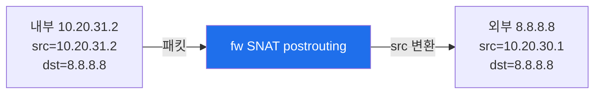
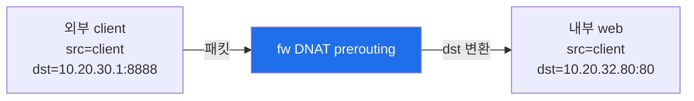
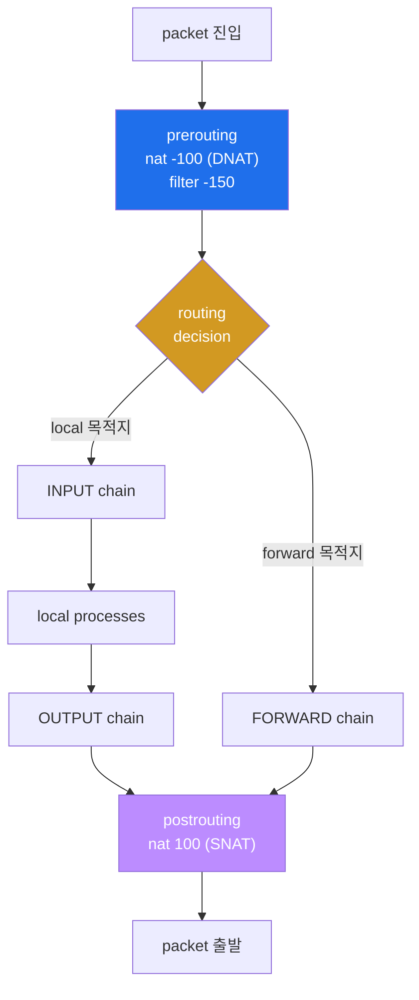
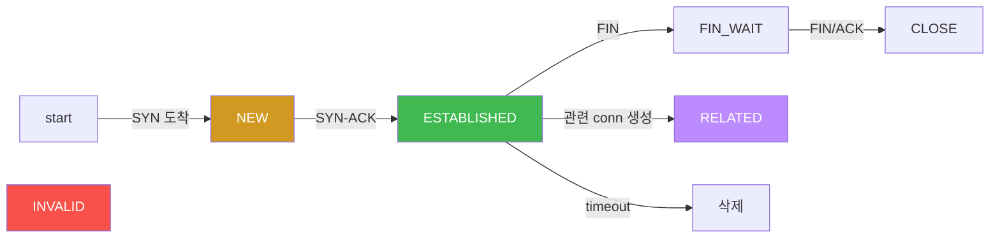
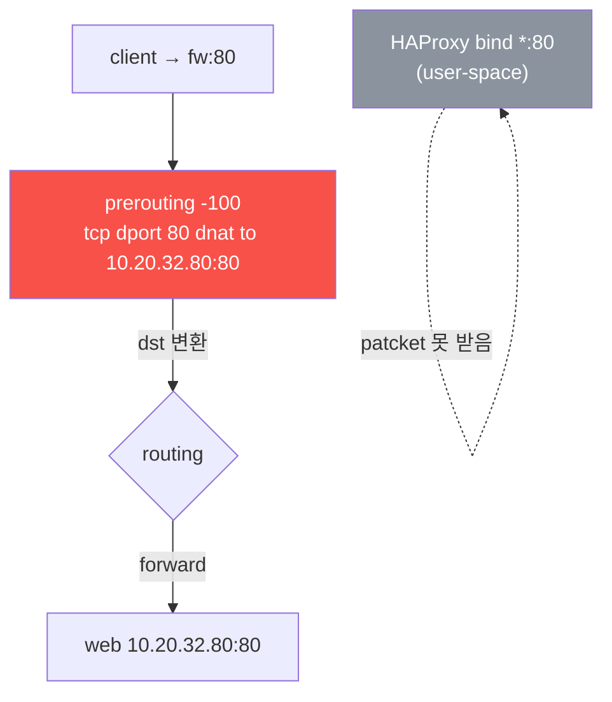
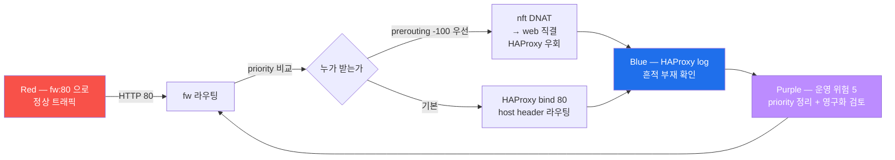
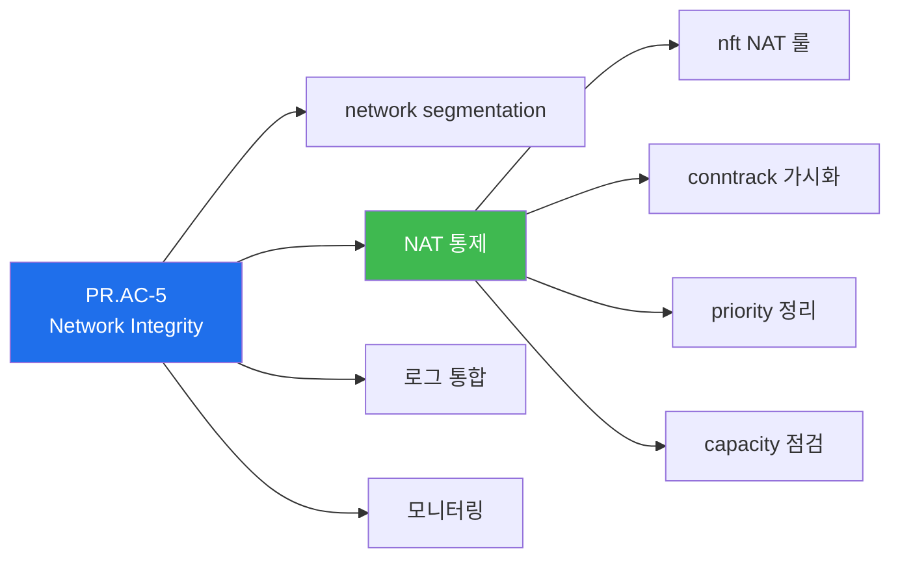
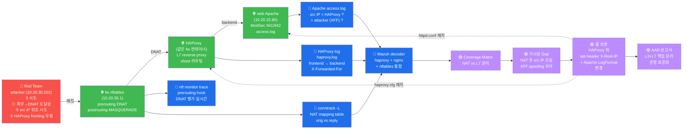

# Week 03 — nftables 방화벽 (2) — NAT (DNAT/SNAT) + HAProxy 협업 + 운영 깊이

> **본 주차의 한 줄 요약**
>
> W02 의 `inet six_filter` 위에 **NAT (Network Address Translation)** 을 얹는다.
> `ip six_nat` 의 DNAT/SNAT/MASQUERADE 3 종을 실 트래픽으로 검증하고, 같은 fw 컨테이너
> 의 HAProxy (L7 reverse proxy) 와 어떻게 협업·충돌하는지, `conntrack -L` / `nft monitor
> trace` 두 디버깅 도구를 동원해 가시화한다. 본 주차의 핵심은 **세 가지 운영 인식**: ①
> NAT 는 방화벽이 아니다, ② Docker daemon 의 `table ip nat` 와 우리 정책 table 의
> priority 가 어떻게 공존하는가, ③ HAProxy 와 nftables DNAT 가 같은 port 에서 충돌하면
> nftables 가 항상 이긴다.

---

## 학습 목표

본 주차 종료 시 학생은 다음 9가지를 **본인 손으로** 할 수 있어야 한다.

1. SNAT / DNAT / MASQUERADE 의 hook 위치 (prerouting -100 / postrouting 100) 와 priority
   별칭 (`dstnat` / `srcnat`) 을 화이트보드에 그린다.
2. `ip six_nat` table 에 DNAT 룰을 추가하여 외부 8888 → 내부 web 80 매핑을 동작시키고
   `conntrack -L` 로 양방향 변환 흔적 (orig dst ≠ reply src) 을 식별한다.
3. `MASQUERADE` 와 `snat to <IP>` 의 차이 + 컨테이너 환경에서 어느 쪽이 적합한지 결정한다.
4. `conntrack` table 의 5 상태 (NEW / ESTABLISHED / RELATED / INVALID / UNREPLIED) 와
   `[ASSURED]` flag 의 의미를 운영자에게 설명한다.
5. `nft monitor trace` 를 1 packet 에 적용하여 chain 통과 단계를 step-by-step 출력하고,
   `meta nftrace set 1` 룰을 즉시 cleanup 한다.
6. HAProxy L7 라우팅 (`hdr(host) -i siem.6v6.lab`) 과 nftables L4 DNAT 의 priority
   비교를 통해 **한 port 에 두 도구를 동시 운영하면 안 되는 이유**를 설명한다.
7. Docker daemon 이 자동 생성한 `table ip nat` (DOCKER_OUTPUT / DOCKER_POSTROUTING) 의
   존재를 확인하고, 우리의 `ip six_nat` 와 어떻게 공존하는지 분석한다.
8. `nf_conntrack_max` / `nf_conntrack_count` / `nf_conntrack_helper` 3 sysctl 을 점검
   하여 conntrack table 의 capacity exhaustion 위험을 사전 감지한다.
9. **R/B/P 시나리오 — Red 가 fw:80 으로 정상 트래픽 시도 → Blue 가 prerouting position
   0 에 DNAT 룰 삽입 (HAProxy 우회) → Purple 이 HAProxy log 흔적 부재 + counter 측정
   + cleanup + 영구화 위험 평가.**

---

## 강의 시간 배분 (총 3시간 40분)

| 시간      | 내용                                                                       | 유형       |
|-----------|---------------------------------------------------------------------------|----------|
| 0:00–0:25 | 이론 — NAT 의 3 종류 (SNAT/DNAT/MASQUERADE) + 사용 시점 표                    | 강의     |
| 0:25–0:55 | 이론 — Netfilter NAT chain + priority 정책 + conntrack 상태머신                | 강의     |
| 0:55–1:05 | 휴식                                                                       | —        |
| 1:05–1:30 | 이론 — HAProxy L7 vs nftables L4 협업 / 충돌 + Docker NAT 의 priority         | 강의/토론 |
| 1:30–2:00 | 실습 1, 2 — six_nat stub 검증 + DNAT 외부 8888 → web + conntrack reply 가시화 | 실습     |
| 2:00–2:30 | 실습 3, 4 — MASQUERADE 3 subnet + conntrack 상태머신 분석                      | 실습     |
| 2:30–2:40 | 휴식                                                                       | —        |
| 2:40–3:10 | 실습 5 — nft monitor trace + Docker NAT 공존 확인                             | 실습     |
| 3:10–3:30 | 실습 6 — **R/B/P** HAProxy + DNAT 80 충돌 시뮬 + 운영 위험 5                    | 실습     |
| 3:30–3:40 | 정리 + 과제 안내 + W04 (Suricata IDS) 예고                                    | 정리     |

---

## 0. 용어 해설 (W03 신규 + W02 누적)

| 용어 | 영문 | 뜻 |
|------|------|----|
| **NAT** | Network Address Translation | 패킷의 IP/port 를 라우팅 경계에서 변환 |
| **SNAT** | Source NAT | 출발지 IP/port 변환 (outbound) |
| **DNAT** | Destination NAT | 목적지 IP/port 변환 (inbound port forwarding) |
| **MASQUERADE** | — | SNAT 의 특수형, outgoing NIC 의 현재 IP 자동 사용 |
| **PAT** | Port Address Translation | port 도 변환 (NAT 의 부분) |
| **prerouting** | — | routing decision **전** hook (DNAT 위치) |
| **postrouting** | — | routing decision **후** hook (SNAT/MASQUERADE 위치) |
| **dstnat priority** | — | nft 11+ 의 별칭, 정수 `-100` |
| **srcnat priority** | — | nft 11+ 의 별칭, 정수 `100` |
| **conntrack** | connection tracking | 커널의 stateful 추적 |
| **ct state** | — | NEW / ESTABLISHED / RELATED / INVALID / UNTRACKED |
| **[ASSURED]** | — | conntrack flag — 양방향 패킷 모두 본 상태 (안정 conn) |
| **[UNREPLIED]** | — | conntrack flag — 응답 못 받은 단방향 conn |
| **nf_conntrack_max** | — | conntrack table 최대 entry 수 (default 262144) |
| **conntrack helper** | — | protocol-aware NAT module (ftp/sip/h323/pptp 등) |
| **nf_conntrack_helper** | — | sysctl, automatic helper 활성 여부 (0=수동, 1=자동) |
| **L7 reverse proxy** | — | 응용 계층 (HTTP host/SNI) 라우팅 도구 |
| **TCP termination** | — | client TCP 를 종료하고 backend 로 새 TCP 개설 |
| **SNI** | Server Name Indication | TLS handshake 의 hostname 필드 (L7 라우팅 키) |
| **priority** | — | 같은 hook 의 chain 평가 순서 (낮을수록 먼저) |
| **trace** | nft monitor trace | packet 의 룰 통과 실시간 가시화 |
| **DOCKER_OUTPUT** | — | Docker daemon 이 생성한 ip nat chain (embedded DNS) |
| **DOCKER_POSTROUTING** | — | Docker daemon 이 생성한 ip nat chain (DNS 응답) |
| **embedded DNS** | — | Docker bridge 의 127.0.0.11:53 가짜 DNS resolver |
| **X-Forwarded-For** | XFF | HAProxy 가 backend 로 전달하는 client IP 헤더 |

---

## 1. NAT 의 3 종류 — 언제 어느 것을 쓰는가

### 1.1 SNAT (Source NAT) — 출발지 변환

**용도**: 내부 호스트가 외부와 통신할 때, 외부에서는 내부 IP 가 보이지 않도록 한다.



**nft 명령**:
```
sudo nft add rule ip six_nat postrouting oifname "eth0" ip saddr 10.20.31.0/24 \
    snat to 10.20.30.1
```

**적용 시점**: 출발지 IP 가 외부에 노출되면 안 될 때. 외부에 노출된 IP 는 출구 IP 1개만.

### 1.2 DNAT (Destination NAT) — 목적지 변환

**용도**: 외부에서 들어온 트래픽을 내부 특정 서버로 포워딩 (port forwarding).



**nft 명령**:
```
sudo nft add rule ip six_nat prerouting iifname "eth0" tcp dport 8888 \
    dnat to 10.20.32.80:80
```

**적용 시점**: 외부 노출 port 가 내부 백엔드의 실제 port 와 다르거나, 외부에 노출하면
안 되는 내부 IP 를 가린다.

### 1.3 MASQUERADE — 동적 SNAT

**용도**: outgoing NIC 의 IP 가 동적으로 바뀔 때 (DHCP, container restart 등) `to <IP>`
명시 없이 NIC 의 **현재** IP 로 자동 변환.

```
sudo nft add rule ip six_nat postrouting oifname "eth0" ip saddr 10.20.31.0/24 \
    masquerade
```

**SNAT vs MASQUERADE 의 미묘한 차이**:

| 항목 | `snat to 10.20.30.1` | `masquerade` |
|------|-----------------------|--------------|
| NIC IP 결정 | rule 작성 시 고정 | 매 packet 마다 NIC IP 조회 |
| 성능 | 약간 빠름 (조회 없음) | 약간 느림 (kernel routing table 조회) |
| 동적 IP | 부적합 (변경 시 rule 재작성) | 적합 (자동 추적) |
| 컨테이너 환경 | 부적합 (restart 시 IP 바뀜) | 적합 |

**6v6 의 fw 컨테이너 ext NIC IP 는 docker bridge 가 할당하므로 fixed** 지만, production
container 환경 (Kubernetes Pod 등) 에서는 NIC IP 가 매번 다르다 → MASQUERADE 가 정석.

### 1.4 priority 와 hook 위치 — 왜 이 자리에서 변환하는가

| Chain | hook | priority (정수) | priority (별칭) | 역할 |
|-------|------|-----------------|------------------|------|
| `prerouting`  | prerouting  | -100 | `dstnat` | inbound DNAT (routing 결정 전 변환해야 routing 가능) |
| `postrouting` | postrouting | 100  | `srcnat` | outbound SNAT/MASQUERADE (routing 후 → NIC 결정됨 → MASQUERADE 가 NIC IP 알 수 있음) |
| `output`      | output      | -100 | `dstnat` | locally-generated 의 DNAT (loopback 등) |
| `input`       | input       | 100  | `srcnat` | locally-destined 의 SNAT (드묾) |

priority 가 낮을수록 먼저 평가된다. `prerouting -100` 이 routing decision 보다 일찍
평가되어 변환된 dst IP 로 routing 이 일어난다. 이 순서가 어긋나면 packet 이 fw 자체로
들어가버린다.

---

## 2. Netfilter NAT chain — 패킷의 5 자리 통과



**핵심 인사이트**:
- **DNAT 는 routing 보다 먼저** 평가되어 변환된 dst 로 routing → forward 또는 input 분기
- **SNAT/MASQUERADE 는 routing 후** 평가 → NIC 결정 후 src 변환
- **conntrack 은 첫 packet 의 변환을 기억** → 후속 응답 packet (역방향) 의 NAT 도 일관 적용

만약 conntrack 이 없다면 같은 conn 의 양방향 packet 마다 NAT 룰을 따로 평가해야 하고,
응답 packet 의 변환이 일관되지 않을 수 있다. conntrack 이 **stateful NAT 의 source of
truth**.

---

## 3. conntrack 의 역할 — stateful NAT + firewall 의 핵심

### 3.1 한 conn = 한 row, 양방향 변환 기록

```
$ sudo conntrack -L | head -3
tcp 6 86400 ESTABLISHED \
    src=10.20.30.202 dst=10.20.30.1 sport=43210 dport=80 \
    src=10.20.32.80 dst=10.20.30.202 sport=80 dport=43210 \
    [ASSURED] mark=0 use=1
```

읽는 법:
- `tcp 6 86400 ESTABLISHED` : protocol / proto# / timeout 초 / 상태
- **첫 src/dst/sport/dport** = `orig` (요청 방향)
- **두 번째 src/dst/sport/dport** = `reply` (응답 방향)
- `[ASSURED]` : 양방향 packet 모두 봄 (안정)

**NAT 판단 룰**:
- orig dst (10.20.30.1) ≠ reply src (10.20.32.80) → **DNAT 흔적** (fw 가 dst 를 web 으로 바꿈)
- orig src 와 reply dst 가 다르면 → **SNAT 흔적**

### 3.2 conntrack 상태머신 (5 states)



| 상태 | 뜻 | 운영 활용 |
|------|----|----------|
| `NEW` | 첫 SYN, 응답 미관측 | `nft ... ct state new accept` 으로 신규 conn 통제 |
| `ESTABLISHED` | 양방향 packet 관측 후 | `ct state established,related accept` (early-exit) |
| `RELATED` | 기존 conn 과 관련 (ICMP unreach, FTP data) | `RELATED accept` 가 필요한 protocol (ftp) |
| `INVALID` | conntrack 가 추적 못 함 | `INVALID drop` 가 정석 |
| `UNTRACKED` | 명시적으로 추적 안 함 (`notrack`) | 고성능 트래픽 (raw table) |

### 3.3 6v6-fw 의 실측 conntrack (2026-05-12)

```
tcp 6 90 FIN_WAIT src=10.20.30.201 dst=192.168.0.107 sport=22 dport=57618 [UNREPLIED]
                  src=192.168.0.107 dst=10.20.30.201 sport=57618 dport=22 mark=0 use=1
tcp 6 6 CLOSE     src=10.20.31.1   dst=10.20.32.120 sport=37196 dport=5601
                  src=10.20.32.120 dst=10.20.31.1   sport=5601  dport=37196 [ASSURED]
tcp 6 2 CLOSE     src=10.20.31.1   dst=10.20.32.80  sport=38012 dport=443
                  src=10.20.32.80  dst=10.20.31.1   sport=443   dport=38012 [ASSURED]
```

읽기:
- 1줄: bastion (10.20.30.201) → 학생 PC (192.168.0.107) **응답 미관측** ([UNREPLIED]) →
  outbound SSH 응답 path 의 RST 또는 timeout
- 2-3줄: fw (10.20.31.1) 가 dashboard (10.20.32.120:5601) / web (10.20.32.80:443) 로의
  HAProxy backend conn — orig src 와 reply dst 가 동일 → **NAT 없음** (HAProxy 가 TCP
  termination 했으므로 새 conn)

이 패턴은 HAProxy 의 동작 증거. HAProxy 가 backend 로 새 conn 을 열기 때문에 fw 가
source 가 된 conntrack entry 가 생성된다.

### 3.4 conntrack 운영 명령 cheat sheet

```bash
sudo conntrack -L                       # 전체 conn 조회
sudo conntrack -L -p tcp                # TCP 만
sudo conntrack -L --src 10.20.30.202    # 특정 src
sudo conntrack -L --dport 80            # 특정 dst port
sudo conntrack -D --src 10.20.30.202    # 특정 conn 강제 종료 (IR 대응)
sudo conntrack -F                       # 전체 flush (⚠️ 활성 conn 다 끊김)
sudo conntrack -E                       # 실시간 event stream
sudo conntrack -S                       # CPU 별 통계 (found / invalid / drop)
sudo conntrack -C                       # 현재 entry 수
```

---

## 4. conntrack table 용량 — capacity exhaustion 위험

### 4.1 nf_conntrack_max — 6v6-fw 실측

```
$ sysctl net.netfilter.nf_conntrack_max
net.netfilter.nf_conntrack_max = 262144

$ sysctl net.netfilter.nf_conntrack_count
net.netfilter.nf_conntrack_count = 37
```

262,144 entry = 약 25.6 MB 메모리. 현재 사용 37 → 사실상 무한대. 그러나 production 에서
는 다음 트래픽 패턴이 흔히 한계 도달:

- **SYN flood** : 분당 수만 NEW state → table 폭증
- **NAT-heavy gateway** : 모든 client conn 이 entry → 1만 client × 10 conn = 10만 entry
- **long-lived ESTABLISHED** : `nf_conntrack_tcp_timeout_established = 432000` (5일) 동안 잔존

**한계 도달 시 증상**: `dmesg` 에 `nf_conntrack: table full, dropping packet` → 새 conn
거부. 사용자는 "간헐적 connection failed" 로 인식.

### 4.2 한계 조정 (production)

```bash
# 일시 변경
sudo sysctl -w net.netfilter.nf_conntrack_max=524288

# 영구 (sysctl.conf)
echo "net.netfilter.nf_conntrack_max=524288" | sudo tee -a /etc/sysctl.d/99-conntrack.conf
sudo sysctl --system

# hashtable 크기도 함께 조정 (max / 4 권장)
echo 131072 | sudo tee /sys/module/nf_conntrack/parameters/hashsize
```

### 4.3 timeout 단축 — long-lived conn 제거

```bash
# ESTABLISHED 의 default 432000 (5일) 은 너무 김
sudo sysctl -w net.netfilter.nf_conntrack_tcp_timeout_established=3600    # 1시간
sudo sysctl -w net.netfilter.nf_conntrack_tcp_timeout_close=10            # 10초
sudo sysctl -w net.netfilter.nf_conntrack_tcp_timeout_fin_wait=30
```

운영 절충: 너무 짧으면 정상 long-lived (DB pool, WebSocket) 가 끊긴다. 1시간 권장.

### 4.4 모니터링 — Prometheus / SIEM 통합

```
# /etc/wazuh/agent/local_internal_options.conf
logcollector.command_period=60
```

```
# /var/ossec/etc/shared/agent.conf
<localfile>
  <log_format>command</log_format>
  <command>cat /proc/sys/net/netfilter/nf_conntrack_count</command>
  <alias>conntrack_count</alias>
  <frequency>60</frequency>
</localfile>
```

Wazuh decoder 로 ingest → 80% 임계치 alert. W09 에서 자세히 다룬다.

---

## 5. conntrack helper modules — protocol-aware NAT

### 5.1 NAT 가 깨는 protocol 들

순수 IP/port 만 변환하는 NAT 는 **payload 안에 IP/port 가 들어가는 protocol** 을 깬다:

- **FTP active mode** : control conn 의 PORT command 가 data conn 의 IP/port 를 평문 전달.
  NAT 가 control 만 변환 → data conn 가 잘못된 IP 로 향함.
- **SIP/H.323** : SDP body 안에 RTP 의 IP/port. NAT 가 안 변환하면 voice 끊김.
- **PPTP** : GRE tunnel + control TCP 1723. GRE 가 conntrack 모름.
- **IRC DCC** : data conn 의 IP 가 평문 메시지에.

해결: **NAT helper** (커널 모듈) 이 payload 까지 검사하여 추가 NAT.

### 5.2 helper 의 보안 위험 — 자동 helper 비활성이 best practice

자동 helper (`nf_conntrack_helper=1`) 는 모든 traffic 의 payload 를 검사 → CVE-2014-3145
등 다수 RCE 취약점. 2017 이후 표준은 **수동 활성** (`nf_conntrack_helper=0`).

### 5.3 6v6-fw 실측

```
$ sysctl net.netfilter.nf_conntrack_helper
net.netfilter.nf_conntrack_helper = 0
```

자동 helper 비활성. 6v6 는 FTP/SIP 사용 안 하므로 안전. 만약 운영 환경이 FTP 를 쓴다면
수동 활성:

```
# 수동 helper 룰 (안전한 패턴)
sudo nft add rule ip raw prerouting tcp dport 21 ct helper set "ftp"
```

이렇게 명시적으로 활성화한 protocol 만 NAT helper 가 처리 → 공격 표면 최소화.

---

## 6. Docker 의 `table ip nat` — 우리와 어떻게 공존하는가

### 6.1 6v6-fw 의 실측 — table 3 종

```
$ sudo nft list tables
table ip nat                # ← Docker daemon 이 생성
table inet six_filter        # ← 우리 정책 (W02)
table ip six_nat             # ← 우리 NAT (W03)
```

### 6.2 Docker `table ip nat` 내부 (실측)

```
table ip nat {
    chain DOCKER_OUTPUT {
        meta l4proto tcp ip daddr 127.0.0.11 tcp dport 53 dnat to 127.0.0.11:34597
        meta l4proto udp ip daddr 127.0.0.11 udp dport 53 dnat to 127.0.0.11:45271
    }
    chain OUTPUT {
        type nat hook output priority -100; policy accept;
        ip daddr 127.0.0.11 jump DOCKER_OUTPUT
    }
    chain DOCKER_POSTROUTING {
        meta l4proto tcp ip saddr 127.0.0.11 tcp sport 34597 snat to :53
        meta l4proto udp ip saddr 127.0.0.11 udp sport 45271 snat to :53
    }
    chain POSTROUTING {
        type nat hook postrouting priority srcnat; policy accept;
        ip daddr 127.0.0.11 jump DOCKER_POSTROUTING
    }
}
```

**해석**:
- Docker 의 embedded DNS resolver 는 `127.0.0.11:53` 으로 가장. 실제 listen 은 random
  port (34597 / 45271).
- 컨테이너 내부 process 가 `127.0.0.11:53` 으로 DNS 질의 → OUTPUT hook 의 룰이 random
  port 로 DNAT → 응답은 POSTROUTING 이 다시 53 으로 SNAT → process 입장에서는 일반
  DNS 와 동일.

### 6.3 priority 공존 — 왜 충돌 안 하는가

두 table 모두 같은 hook 에 attach:

| Table | Chain | Hook | Priority |
|-------|-------|------|----------|
| `ip nat` (Docker) | OUTPUT | output | -100 |
| `ip nat` (Docker) | POSTROUTING | postrouting | 100 |
| `ip six_nat` (우리) | prerouting | prerouting | -100 |
| `ip six_nat` (우리) | postrouting | postrouting | 100 |

같은 hook + 같은 priority 인 두 chain 은 **table 추가 순서대로** 평가. nftables 가 평가
순서를 결정한다.

**핵심 정책**: Docker 의 `table ip nat` 은 학습용으로도 절대 flush 하지 말 것. embedded
DNS 가 깨진다 → 컨테이너 내부에서 `wazuh-indexer` 같은 service name resolution 실패 →
인프라 전체 장애.

6v6 의 `nftables.conf` 는 우리 두 table (`inet six_filter`, `ip six_nat`) 만 flush
하고 Docker 의 `ip nat` 은 건드리지 않도록 설계되었다 (W02 §4.2 참조).

### 6.4 운영 사고 사례 — Docker NAT flush

```
# ⚠️ 금지 명령
sudo nft flush ruleset       # ← Docker 의 ip nat 까지 다 날아감
sudo nft delete table ip nat # ← 동일
```

증상:
- 컨테이너 내부 `nslookup wazuh-indexer` → `127.0.0.11:53 connection refused`
- 모든 docker-compose service name 해석 실패
- 인프라 전체 cascading 장애
- 복구: `systemctl restart docker` 또는 컨테이너 전체 재시작

권장 명령:
```
sudo nft flush table inet six_filter    # 우리 정책만
sudo nft flush table ip six_nat         # 우리 NAT 만
sudo nft -f /etc/nftables.conf          # atomic load
```

---

## 7. HAProxy L7 vs nftables L4 NAT — 같이 쓰는 법, 충돌하는 법

### 7.1 두 도구의 동작 layer 비교

| 측면 | nftables DNAT (L4) | HAProxy (L7) |
|------|---------------------|--------------|
| 동작 layer | L3/L4 (IP + port) | L7 (HTTP host header / TLS SNI) |
| TCP termination | 없음 (커널 packet 변환만) | termination + 새 backend conn |
| host header 라우팅 | 불가 (단일 backend per port) | 가능 (1 port → N backend) |
| TLS termination | 불가 (cert 없음) | 가능 |
| 부하 분산 | 단순 (1:1) | 풍부 (roundrobin / leastconn / source) |
| 헬스체크 | 없음 | check + 자동 failover |
| 로깅 | nftables `log prefix` (kernel ring) | HAProxy access log (rsyslog) |
| 처리 비용 | 낮음 (kernel 만) | 높음 (user-space + TCP 2회) |
| 가시성 | counter / conntrack | stats socket / web UI |
| X-Forwarded-For | 없음 | 자동 추가 |
| 운영 변경 | 즉시 (`nft add rule`) | reload 필요 (`haproxy -sf`) |

### 7.2 6v6 의 HAProxy 실측 (2026-05-12)

```
frontend http_in     bind *:80
frontend https_in    bind *:443
frontend bastion_api_in   bind *:9100

acl is_siem    hdr(host) -i siem.6v6.lab
acl is_portal  hdr(host) -i portal.6v6.lab
acl is_bastion hdr(host) -i bastion.6v6.lab

use_backend dashboard if is_siem
use_backend portal    if is_portal
use_backend bastion   if is_bastion
default_backend waf       # ← 학생 트래픽

backend waf       server web 10.20.32.80:80 check
backend waf_tls   server web 10.20.32.80:443 check ssl verify none
backend dashboard server dashboard 10.20.32.120:5601 check ssl verify none
backend portal    server portal 10.20.32.50:8000 check
backend bastion   server bastion 10.20.30.201:9100 check
backend bastion_api server bastion 10.20.30.201:9100 check
```

**해석**:
- 학생이 `juice.6v6.lab` 요청 → `is_siem/portal/bastion` 모두 false → `default_backend waf`
  → `web 10.20.32.80:80` → web 의 ModSec → int juiceshop. **WAF 적용**.
- 운영자가 `siem.6v6.lab` 요청 → `is_siem` true → `dashboard 10.20.32.120:5601` (TLS
  passthrough) → wazuh-dashboard. **WAF 우회** (운영 트래픽이라 false-positive 위험 회피).

### 7.3 협업 시나리오 1 — HAProxy 가 80/443, nftables 가 보조 port

```
외부 :80    →  HAProxy L7 (host header 라우팅)
외부 :443   →  HAProxy L7 (SNI + TLS)
외부 :9100  →  HAProxy (단일 backend bastion_api)
외부 :2222  →  nftables DNAT → 10.20.30.201:22 (bastion)
```

L7 라우팅이 필요한 port 만 HAProxy, 단순 1:1 forwarding 은 nftables 가 효율적.

### 7.4 협업 시나리오 2 — Docker NAT 가 HAProxy 앞에서 port 매핑

```
host :8003 (호스트 PC) → docker-proxy → 컨테이너 :9100 (HAProxy) → backend bastion
```

docker-compose 의 `ports: ["8003:9100"]` 가 docker-proxy 프로세스를 띄움. host PC 의
8003 트래픽이 docker-proxy 통해 컨테이너의 9100 으로. 그 다음 HAProxy 가 받음. 이 경우
nftables 가 직접 관여 안 함 (docker-proxy 는 user-space).

### 7.5 충돌 시나리오 — 같은 port 에 두 도구

```
nftables prerouting: tcp dport 80 dnat to 10.20.32.80:80     ← web 직접
HAProxy frontend:   bind *:80                                  ← HAProxy 도 80
```

두 룰이 동시 활성이면, **prerouting -100 의 DNAT 가 routing decision 보다 먼저 평가** →
patcket 의 dst 가 10.20.32.80 으로 변환됨 → routing 이 forward chain 으로 보냄 → 패킷
이 HAProxy 의 80 bind 에 도착하지 못함.



**HAProxy 가 진다**. user-space 의 bind 는 prerouting NAT 뒤에 평가되기 때문.

### 7.6 충돌 증거 — conntrack 의 reply src

가장 결정적인 가시화 방법은 fw 의 conntrack table 에서 응답 packet 의 src IP 변화이다.

**HAProxy 통과 시 (정상)** — 실측 2026-05-12:
```
tcp 6 118 TIME_WAIT \
    src=10.20.30.202 dst=10.20.30.1 sport=34148 dport=80 \
    src=10.20.30.1   dst=10.20.30.202 sport=80 dport=34148 \
    [ASSURED]
```
reply src = `10.20.30.1` (fw 자체 IP). HAProxy 가 TCP termination 했으므로 응답이 fw
의 stack 에서 나온 흔적.

**DNAT 우회 시 (충돌)** — 실측:
```
tcp 6 118 TIME_WAIT \
    src=10.20.30.202 dst=10.20.30.1 sport=53332 dport=80 \
    src=10.20.32.80  dst=10.20.30.202 sport=80 dport=53332 \
    [ASSURED]
```
reply src = `10.20.32.80` (web 직접 IP). DNAT 가 dst 를 변환했고 응답은 web 의 stack 에서.

이 단일 필드의 차이가 **HAProxy 우회의 결정적 증거**. lab 의 R/B/P 시뮬에서 이 한 줄
변화를 확인한다.

### 7.7 충돌의 5 가지 운영 위험

가시화된 즉시 영향 3 가지:

1. **HAProxy TCP termination 우회** — backend 가 client IP 를 직접 처리 (응답 source
   IP 차이로 가시화)
2. **host header 라우팅 무력화** — `juice.6v6.lab` 도 `siem.6v6.lab` 도 같은 backend
3. **HAProxy 가시성 부재** — backend session 통계 / access log 미수신

잠재 위험 2 가지 (별 검증 필요):

4. **HAProxy ACL / rate limit 우회** — 보안 통제 무력
5. **TLS termination 우회** — backend 가 TLS 까지 책임 (cert 관리 부담)

> ⚠️ **6v6 인프라의 실제 결함**: 본 fw 컨테이너의 HAProxy 는 `log stdout` 설정이지만
> 컨테이너 stdout 이 `/dev/null` 로 redirect 되어 **HAProxy access log 가 어디에도 기록
> 되지 않는다**. 따라서 lab 에서 "HAProxy log 흔적" 으로 우회를 검증하는 대신 conntrack
> 의 reply src 변화를 사용한다. **운영 fix (별 PR)**: haproxy.cfg 의 `log` 라인을
> `log 127.0.0.1 local0` + rsyslog 설정 또는 직접 `log /var/log/haproxy.log local0` 으로
> 변경.

**운영 정책**: **한 port = 한 도구**. 혼합 운영 금지.

---

## 8. NAT 는 방화벽이 아니다 — 흔한 보안 오해 정리

### 8.1 오해의 출처

1990년대 home router 의 NAT 가 외부에서 내부로의 무단 접속을 막아주는 부수 효과 →
"NAT 가 방화벽" 이라는 통념이 자리잡음.

### 8.2 사실 — NAT 는 단지 변환

NAT 는 **변환 (translation) 도구**일 뿐 보안 정책이 아니다.

- DNAT 만 있으면 외부에서 변환된 dst 로 접속 가능 (외부 노출)
- conntrack 의 ESTABLISHED 가 응답 path 를 자동 허용 → 진짜 보안은 forward chain 의 룰
- NAT 우회 (NAT traversal, STUN, hole punching, IPv6 무 NAT) 으로 NAT 만으로의 "보호"
  는 깨진다

### 8.3 진짜 방어 vs NAT 만의 보호

```
[NAT 만의 보호]
- 내부 → 외부 만 가능
- 외부 → 내부는 미정의 dst port 차단 (단지 라우팅 표 부재로)
- 우회: NAT traversal / hole punching / IPv6

[방화벽 + NAT]
- nftables forward chain 에 명시적 accept/drop 정책
- ct state established,related accept (응답만 허용)
- ct state new + explicit allow list 만 forward
- 외부 → 내부 의 모든 trafffic 명시적 정책
```

### 8.4 6v6 의 정책 — NAT 와 방화벽 분리

```
table ip six_nat { ... }            # ← NAT 만 (변환)
table inet six_filter { ... }        # ← 방화벽 (정책)
```

두 table 이 명확히 역할 분리. NAT 룰만 추가했다고 보안이 강화된 게 아님.

### 8.5 사례 — 흔한 운영 실수

```
# ❌ 잘못된 정책
sudo nft add rule ip six_nat prerouting tcp dport 8888 dnat to 10.20.32.80:80
# 외부에서 8888 접속 가능. 그러나 "DNAT 룰이 차단도 해줄 것" 이라 착각.

# ✅ 올바른 정책 (NAT + 방화벽 동시)
sudo nft add rule ip six_nat prerouting tcp dport 8888 dnat to 10.20.32.80:80
sudo nft add rule inet six_filter forward iifname "eth0" tcp dport 80 \
    ip daddr 10.20.32.80 ip saddr 192.168.0.0/24 accept     # 학생 PC 만
sudo nft add rule inet six_filter forward iifname "eth0" tcp dport 80 \
    ip daddr 10.20.32.80 log prefix "FWD-DROP: " drop       # 그 외 차단
```

DNAT 가 변환을 하고, forward chain 이 **누가 접근 가능한가** 를 결정한다.

---

## 9. 운영 트러블슈팅 — NAT 가 깨지는 4 패턴

### 9.1 패턴 1 — Asymmetric Routing

증상: DNAT 후 첫 packet 은 통과, 응답은 사라짐.

원인: 응답 packet 이 다른 NIC 로 나가서 conntrack 의 reply 가 매칭 안 됨. multi-homed
host 에서 흔함.

진단:
```bash
sudo conntrack -L | grep dport=8888    # [UNREPLIED] 표시
sudo tcpdump -ni eth1 host 10.20.32.80 -c 5   # 다른 NIC 에서 응답 보이는지
```

해결: policy routing (`ip rule`) 으로 응답을 같은 NIC 로 강제.

### 9.2 패턴 2 — Port Exhaustion (SNAT 대량 client)

증상: 새 outbound conn 이 간헐적으로 실패.

원인: SNAT 가 사용하는 source port 범위 (default `32768-60999`) 가 동일 (src, dst, sport,
dport, proto) tuple 으로 고갈됨. 일반적으로 65k client 정도부터 위험.

진단:
```bash
sudo conntrack -L | awk '{print $7}' | sort | uniq -c | sort -rn | head
# 같은 dst:dport 로의 conn 수 카운트
```

해결: SNAT pool 확장 (`snat to 10.20.30.1-10.20.30.10`) 또는 source IP 늘림.

### 9.3 패턴 3 — conntrack table full

증상: 어느 순간 새 conn 이 다 실패. `dmesg | tail` 에 `table full`.

진단:
```bash
sudo sysctl net.netfilter.nf_conntrack_count
sudo sysctl net.netfilter.nf_conntrack_max
```

해결: §4.2 의 max 상향. 근본적으로는 timeout 단축 (§4.3) + helper 비활성.

### 9.4 패턴 4 — NAT helper 가 protocol 깨뜨림

증상: FTP active mode 가 안 됨. SIP voice 가 안 들림.

진단:
```bash
sudo conntrack -L -p tcp --dport 21      # FTP control conn 보임?
sudo conntrack -L -p tcp --dport 20      # FTP data conn 안 보임?
```

해결: §5.3 의 수동 helper 활성.

---

## 10. 6v6-fw 의 NAT 정책 (현재 비어 있음 — 학습 기반)

W02 에서 본 것처럼 6v6 의 `ip six_nat` table 은 chain 만 정의되어 있고 룰이 비어 있다.

```
table ip six_nat {
    chain prerouting {
        type nat hook prerouting priority dstnat
        policy accept
    }
    chain postrouting {
        type nat hook postrouting priority srcnat
        policy accept
    }
}
```

이유:
- fw 가 ext (10.20.30.0/24) ↔ pipe (10.20.31.0/24) **direct routing** (NAT 불필요)
- 외부 노출 port 는 docker-compose 의 `ports:` 로 처리 (docker-proxy)
- L7 라우팅은 HAProxy 에 위임

학생은 본 주차 실습 2-3 에서 학습용 NAT 룰을 추가 → 검증 → cleanup.

---

## 11. 실습 시나리오 1~6 (4 축 설명)

각 실습은 다음 4 축으로 진행:

- **이 실습을 왜 하는가?** — 학습 동기
- **이걸 하면 무엇을 알 수 있는가?** — 기대 산출물
- **결과 해석** — 정상 / 비정상 구분
- **실전 활용** — 운영 시 사용 시점

### 실습 1 — six_nat stub 확인 (10분)

> **이 실습을 왜 하는가?**
>
> NAT 룰 추가 전 baseline 확인. 빈 chain 위에 학생이 룰을 추가하면 즉시 활성. table 이
> 사전에 정의돼 있어야 학생 작업 위치가 명확.
>
> **이걸 하면 무엇을 알 수 있는가?**
>
> - `ip six_nat` table 의 두 chain (prerouting, postrouting) 의 priority 별칭
> - nft 11+ 가 `-100` 을 `dstnat`, `100` 을 `srcnat` 으로 표시한다는 사실
> - 룰이 비어 있어도 chain 자체는 active (hook attach 완료)
>
> **결과 해석**
>
> 정상: 두 chain header 출력 + 룰 0. 비정상: `ip six_nat` 자체 없음 → entrypoint 의
> `nftables.conf` 적용 실패.
>
> **실전 활용**
>
> 운영 인수 시 NAT 정책 baseline 확인. 정책 변경 전 git diff 의 기준점.

```bash
ssh 6v6-fw 'sudo nft list table ip six_nat'
```

**실측 출력** (2026-05-12):
```
table ip six_nat {
    chain prerouting {
        type nat hook prerouting priority dstnat; policy accept;
    }
    chain postrouting {
        type nat hook postrouting priority srcnat; policy accept;
    }
}
```

`dstnat` = `-100`, `srcnat` = `100`. 표시 형태만 다르고 값은 같다.

### 실습 2 — DNAT 외부 8888 → web 80 + conntrack 변환 (20분)

> **이 실습을 왜 하는가?**
>
> port forwarding 의 표준 패턴. 외부 노출 port 와 내부 backend port 가 다른 모든
> production 환경 (예: 외부 SSH 2222 → 내부 22) 의 핵심.
>
> **결과 해석**
>
> 정상: curl 응답 200 + conntrack 의 reply src 가 변환된 IP. 비정상 (응답 000): input
> chain 의 8888 allow 룰 누락. 비정상 (응답 503): backend 다운.
>
> **실전 활용**
>
> 외부 노출 신규 서비스 추가 시 표준 명령. IR 시 임시 port 차단 (역방향: DNAT 제거).

**Step 1 — DNAT 룰 추가**:
```bash
ssh 6v6-fw 'sudo nft add rule ip six_nat prerouting iifname "eth0" tcp dport 8888 \
    counter dnat to 10.20.32.80:80'

# fw 자체로 들어오는 8888/tcp 허용 (input chain — DNAT 평가 전)
ssh 6v6-fw 'sudo nft insert rule inet six_filter input position 0 tcp dport 8888 accept'
```

**Step 2 — 검증**:
```bash
ssh 6v6-attacker 'curl -s -o /dev/null -w "%{http_code}\n" \
    -H "Host: juice.6v6.lab" http://10.20.30.1:8888/'
# 200
```

**Step 3 — conntrack 양방향 변환**:
```bash
ssh 6v6-fw 'sudo conntrack -L | grep dport=8888 | head -1'
```

**예상 출력**:
```
tcp 6 119 TIME_WAIT \
    src=10.20.30.202 dst=10.20.30.1 sport=43544 dport=8888 \
    src=10.20.32.80 dst=10.20.30.202 sport=80 dport=43544 \
    [ASSURED] mark=0 use=1
```

읽기:
- orig: attacker(10.20.30.202) → fw(10.20.30.1):8888
- reply: web(10.20.32.80):80 → attacker(10.20.30.202)
- **DNAT 흔적**: orig dst (10.20.30.1) ≠ reply src (10.20.32.80)
- **port 변환 흔적**: orig dport (8888) ≠ reply sport (80)

**Step 4 — Cleanup**:
```bash
HANDLE=$(ssh 6v6-fw 'sudo nft -a list chain ip six_nat prerouting | \
    grep "dport 8888" | grep -oE "handle [0-9]+" | head -1 | awk "{print \$2}"')
ssh 6v6-fw "sudo nft delete rule ip six_nat prerouting handle $HANDLE"

HANDLE2=$(ssh 6v6-fw 'sudo nft -a list chain inet six_filter input | \
    grep "dport 8888" | grep -oE "handle [0-9]+" | head -1 | awk "{print \$2}"')
ssh 6v6-fw "sudo nft delete rule inet six_filter input handle $HANDLE2"
```

### 실습 3 — MASQUERADE 3 subnet 동시 (15분)

> **이 실습을 왜 하는가?**
>
> 컨테이너 환경의 표준 outbound NAT 패턴. NIC IP 가 변해도 자동 추적.
>
> **결과 해석**
>
> 정상: 3 룰 추가 + 출력에 `masquerade` 키워드. 비정상: `snat to <IP>` 명시 시 컨테이너
> restart 후 NIC IP 바뀌면 NAT 깨짐.

```bash
for net in 10.20.31.0/24 10.20.32.0/24 10.20.40.0/24; do
  ssh 6v6-fw "sudo nft add rule ip six_nat postrouting oifname \"eth0\" \
      ip saddr $net counter masquerade"
done

ssh 6v6-fw 'sudo nft list chain ip six_nat postrouting'

# Cleanup
for net in 10.20.31.0/24 10.20.32.0/24 10.20.40.0/24; do
  HANDLE=$(ssh 6v6-fw "sudo nft -a list chain ip six_nat postrouting | \
      grep \"$net\" | grep -oE \"handle [0-9]+\" | head -1 | awk \"{print \\\$2}\"")
  [ -n "$HANDLE" ] && ssh 6v6-fw "sudo nft delete rule ip six_nat postrouting handle $HANDLE"
done
```

### 실습 4 — conntrack 상태머신 + 양방향 분석 (15분)

> **이 실습을 왜 하는가?**
>
> stateful NAT + firewall 의 source of truth. NAT 효과 검증 + 의심 conn 분석의 핵심.

```bash
ssh 6v6-fw 'sudo conntrack -L -p tcp 2>/dev/null | head -5'
ssh 6v6-fw 'sudo conntrack -S | head -3'
ssh 6v6-fw 'sudo conntrack -C'
```

각 row 의 6 필드 (orig src/dst/sport/dport + reply src/dst/sport/dport) 의 관계 분석.
NAT 가 있으면 orig src ≠ reply dst 또는 orig dst ≠ reply src.

추가 분석 — 상태 분포:
```bash
ssh 6v6-fw 'sudo conntrack -L 2>/dev/null | awk "{print \$3}" | sort | uniq -c | sort -rn'
```

대부분 ESTABLISHED 일 것. SYN_SENT / FIN_WAIT / CLOSE 가 많으면 short-lived conn 폭증.

### 실습 5 — nft monitor trace + Docker NAT 공존 확인 (20분)

> **이 실습을 왜 하는가?**
>
> 정책 디버깅의 황금 도구. 한 packet 이 어느 chain 의 어떤 룰을 통과하는지 step-by-step.

**Step 1 — trace 활성화 룰 추가**:
```bash
ssh 6v6-fw 'sudo nft add rule inet six_filter input tcp dport 80 meta nftrace set 1'
```

**Step 2 — trace event stream + 트래픽 발생** (2 터미널):
```bash
# T1
ssh 6v6-fw 'sudo timeout 5 nft monitor trace 2>&1 | head -20'

# T2 (1초 후)
ssh 6v6-attacker 'curl -s -o /dev/null -H "Host: juice.6v6.lab" http://10.20.30.1/'
```

**예상 출력 (T1)**:
```
trace id 0x... inet six_filter input packet: iif "eth0" ether saddr ... ip saddr 10.20.30.202 ...
trace id 0x... inet six_filter input rule meta nftrace set 1 (verdict continue)
trace id 0x... inet six_filter input verdict continue
trace id 0x... inet six_filter input policy accept
```

같은 trace id 의 여러 라인 = 한 packet 의 chain 통과 단계.

**Step 3 — Docker NAT 공존 확인**:
```bash
ssh 6v6-fw 'sudo nft list table ip nat | head -20'
```

`DOCKER_OUTPUT` / `DOCKER_POSTROUTING` chain 출력 → embedded DNS 의 random port mapping
가시화. 절대 flush 금지 (§6.4).

**Cleanup**:
```bash
HANDLE=$(ssh 6v6-fw 'sudo nft -a list chain inet six_filter input | \
    grep "nftrace set 1" | grep -oE "handle [0-9]+" | head -1 | awk "{print \$2}"')
[ -n "$HANDLE" ] && ssh 6v6-fw "sudo nft delete rule inet six_filter input handle $HANDLE"
```

> 운영 권장: trace 룰은 임시만. CPU 부담 + dmesg/journal 폭주 위험. 운영 종료 시 즉시 cleanup.

### 실습 6 — **R/B/P** HAProxy + DNAT 80 충돌 (30분)



**Step 1 — Red 1차 (baseline, HAProxy 경유)**:
```bash
ssh 6v6-attacker 'curl -s -o /dev/null -w "%{http_code}\n" \
    -H "Host: juice.6v6.lab" http://10.20.30.1/'
# 200

ssh 6v6-fw 'sudo tail -3 /var/log/haproxy.log 2>/dev/null | grep "10.20.30.202" | tail -1'
# HAProxy access log 의 attacker 흔적 1 라인
```

**Step 2 — Blue (충돌 DNAT 룰 삽입)**:
```bash
ssh 6v6-fw 'sudo nft insert rule ip six_nat prerouting position 0 iifname "eth0" \
    tcp dport 80 counter dnat to 10.20.32.80:80'
```

**Step 3 — Red 2차 (DNAT 가 HAProxy 우회)**:
```bash
ssh 6v6-attacker 'curl -s -o /dev/null -w "%{http_code}\n" \
    -H "Host: juice.6v6.lab" http://10.20.30.1/'
# 200 (응답은 동일하지만 우회 발생)

# HAProxy log 의 attacker 흔적 검사
ssh 6v6-fw 'sudo tail -3 /var/log/haproxy.log 2>/dev/null | grep "10.20.30.202" | wc -l'
# 0 (HAProxy 못 받음 — 핵심 증거)
```

**Step 4 — Purple (priority 가시화)**:
```bash
ssh 6v6-fw 'sudo nft list chains 2>&1 | grep "hook prerouting"'
# type nat hook prerouting priority dstnat; ...
# type nat hook prerouting priority dstnat; ...  ← Docker 의 OUTPUT 도 prerouting hook

ssh 6v6-fw 'sudo nft list chain ip six_nat prerouting | grep -B1 "dport 80 "'
# counter packets N bytes M dnat to 10.20.32.80:80  ← packets/bytes 증가 확인
```

**Step 5 — Cleanup + 정상화 검증**:
```bash
HANDLE=$(ssh 6v6-fw 'sudo nft -a list chain ip six_nat prerouting | \
    grep "dport 80 " | grep -oE "handle [0-9]+" | head -1 | awk "{print \$2}"')
[ -n "$HANDLE" ] && ssh 6v6-fw "sudo nft delete rule ip six_nat prerouting handle $HANDLE"

ssh 6v6-attacker 'curl -s -o /dev/null -w "복귀: %{http_code}\n" \
    -H "Host: juice.6v6.lab" http://10.20.30.1/'
# 복귀: 200

ssh 6v6-fw 'sudo tail -3 /var/log/haproxy.log 2>/dev/null | grep "10.20.30.202" | wc -l'
# 1+ (HAProxy log 복귀)
```

**Purple 핵심 인사이트**:
- nat prerouting priority `dstnat` (-100) → routing decision 보다 일찍 → HAProxy 의
  user-space bind 도달 못함
- HAProxy 와 nftables DNAT 를 같은 port 에 동시 운영하면 **nftables 가 무조건 이긴다**
- 결과: HAProxy 우회 + 운영 가시성 손실 + 5 가지 위험 (§7.6)
- **production 정책: 한 port = 한 도구. 혼합 금지**

---

## 11.5 R/B/P 공격 분석 케이스 확장 (본 주차 추가)

### 11.5.0 R/B/P 일상 비유 — 우체국의 주소 변환

본 절은 NAT 와 HAProxy 의 운영을 우체국 비유로 시작한다.

학생이 사는 동네에 작은 우체국이 있다고 하자. 우체국은 외부에서 들어온 편지의 수신자 주소를 안 동에 맞춰 변환해서 전달한다. 예를 들어 외부 주소 "ABC동 101호" 가 우체국 매뉴얼에 따라 내부 주소 "XYZ아파트 5동 101호" 로 바뀐다. 우체국에는 두 가지 변환 책상이 있다.

- **책상 1 (L4 NAT 책상).** 봉투 겉면의 주소만 바꿔서 전달한다. 안의 편지 내용은 보지 않는다.
- **책상 2 (L7 HAProxy 책상).** 봉투를 열어 편지 내용을 보고, 내용에 따라 다른 부서로 보낸다. 예를 들어 "주문 관련" 은 영업부로, "AS 관련" 은 서비스부로 보낸다.

두 책상 사이의 충돌 사례도 있다. 같은 외부 주소를 두 책상이 동시에 처리하려고 하면, 보통 책상 1 (먼저 만나는 책상) 이 우선되고 책상 2 는 편지를 못 받는다. 도둑이 이를 알면 일부러 그런 충돌을 만들어 책상 2 의 가시성을 회피한다.

| 일상 비유 | NAT + HAProxy |
|-----------|----------------|
| 우체국 매뉴얼 | nft NAT 의 ruleset |
| 봉투 주소 변환 (책상 1) | L4 NAT (DNAT / SNAT / MASQUERADE) |
| 편지 내용 분류 (책상 2) | L7 HAProxy (host header / path 분기) |
| 우체국 가시성 손실 | HAProxy 우회 |
| 추적부 (편지 수신 / 발송 기록) | conntrack table |

본 절은 학생이 다음 세 케이스를 직접 재현한다.

- 케이스 1 — Docker NAT 또는 임의 DNAT 가 HAProxy 를 우회하는 공격 흔적을 conntrack 으로 추적한다.
- 케이스 2 — SNAT 후 source IP 가시성 손실을 분석하고 XFF (X-Forwarded-For) 의 적용을 확인한다.
- 케이스 3 — conntrack table 을 의도적으로 부풀려 capacity exhaustion 의 영향을 직접 측정한다.

본 절의 원칙은 W01 / W02 와 같다 — 재현 가능성, 도구 위주 분석, 신입생 친화, 학습 환경 한정.

### 11.5.1 케이스 1 — HAProxy 우회 시도의 conntrack 추적

**0. 일상 비유 — 우체국 책상 1을 통과해버린 편지.**

도둑이 우체국 책상 1 (주소 변환 책상) 의 허점을 알고 일부러 외부 봉투에 책상 1 매뉴얼이 처리하는 주소를 적는다. 그러면 책상 2 (내용 분류 책상) 는 그 편지를 못 본다. 도둑은 추적이 어려운 경로로 안으로 들어간다. 우체국 직원이 추적부를 확인하면 책상 1 의 변환 기록만 남아 있고 책상 2 의 기록은 비어 있다.

| 일상 비유 | 보안 시나리오 |
|-----------|---------------|
| 책상 1 의 허점 (잘못된 매뉴얼) | nft DNAT 가 같은 port 를 가로채기 |
| 책상 2 의 무가시성 | HAProxy 로그가 비어 있음 |
| 책상 1 변환 기록 | conntrack 의 reply src 변경 |
| 추적부 비교 | conntrack 와 HAProxy 로그 cross-check |

**0a. 사용 도구 사전 안내.**

- **curl -v** — HTTP 요청의 verbose 출력. 응답 코드, 헤더, 본문을 모두 볼 수 있다.
- **conntrack -L** — fw 의 connection tracking table 을 보는 명령이다. NAT 변환의 reply src 가 보인다.
- **HAProxy access log** — `/var/log/haproxy.log` 또는 컨테이너 stdout 에 기록된다. host header, backend, response code 가 한 줄로 기록된다.

**1. Red — 공격 재현.**

6v6-attacker 에서 fw 의 ext IP 의 80 포트로 HTTP 요청을 보낸다. 학습 환경 안에서만 실행해야 한다.

```bash
ssh 6v6-attacker
# 비밀번호: ccc
```

다음 두 가지 요청을 동시에 보낸다. 두 번째 요청이 nft DNAT 의 직접 가로채기에 해당한다고 가정한다.

```bash
# 6v6-attacker 내부 (학습 환경 한정)
curl -v -H "Host: juice.6v6.lab" http://10.20.30.1/
curl -v http://10.20.30.1:8888/      # nft DNAT 가 8888 → 내부 80 으로 가로채기
```

각 옵션의 의미는 다음과 같다.

- `-v` — verbose. 요청과 응답 헤더를 모두 출력한다.
- `-H "Host: juice.6v6.lab"` — host header 설정. HAProxy 가 host header 로 backend 를 분기한다.
- `http://...:8888/` — fw 의 8888 포트 직접 호출. 만약 nft DNAT 가 있으면 HAProxy 를 우회한다.

**2. 발생하는 로그/아티팩트.**

첫 번째 요청은 HAProxy access log 에 정상으로 기록된다.

```
2026-05-12T14:40:00 frontend_main juice_be/web1 200 ...
```

두 번째 요청은 HAProxy 로그에는 보이지 않을 수 있다. 대신 fw 의 conntrack table 에 새 entry 가 생긴다.

```
tcp ... src=10.20.30.202 dst=10.20.30.1 sport=54321 dport=8888 ...
  src=10.20.30.1 dst=10.20.30.202 sport=80 dport=54321 [REPLY]
```

reply 줄의 sport 가 80 인 것이 핵심이다. 외부에서는 8888 로 들어왔는데 내부에서는 80 으로 변환되어 처리된 흔적이다.

**3. Blue — conntrack 와 HAProxy 로그 cross-check.**

fw 에 들어가서 conntrack 를 본다.

```bash
ssh 6v6-fw
sudo conntrack -L -p tcp --dport 8888 2>/dev/null
```

각 entry 에서 reply src 가 변환된 internal IP / port 인지 확인한다. 변환이 있으면 NAT 가 동작한 것이다.

다음으로 HAProxy access log 를 본다.

```bash
sudo journalctl -u haproxy --since "5 minutes ago" | grep -E "GET|POST" | tail -20
```

같은 시간대에 8888 포트 요청이 보이지 않으면 HAProxy 우회의 직접 증거다.

두 로그를 시간순으로 cross-check 한다.

```
14:40:00  conntrack  port 8888 src=10.20.30.202 → reply src=10.20.30.1:80
14:40:00  HAProxy    (entry 없음)
```

이 격차가 HAProxy 우회의 증거다.

**4. Blue — 대응 의사결정.**

학생이 다음 세 가지를 판단한다.

- **NAT rule 출처 확인.** Docker 가 만든 NAT rule 인지, 누가 임의로 추가한 rule 인지 본다.
- **HAProxy 우회 영향.** 우회로 인해 어떤 정상 운영 기능이 손상되는지 본다. 보통 audit log, rate limit, WAF 의 가시성이 손상된다.
- **즉시 차단 vs 단계적 조사.** 학습 환경에서는 곧장 NAT rule 을 제거한다. 운영 환경에서는 영향 범위 조사가 먼저다.

**5. Purple — 보완.**

다음 세 가지 방향으로 보완한다.

- **한 port = 한 도구 원칙.** 같은 port 에 HAProxy 와 nft DNAT 를 함께 두지 않는다. 명문화한다.
- **NAT rule 변경 감사.** `/etc/nftables.conf` 와 Docker network 의 NAT 변경을 git audit 으로 추적한다.
- **conntrack 모니터링.** 비정상 reply src 변환을 감지하는 간단한 cron script 를 둔다.

### 11.5.2 케이스 2 — SNAT 후 source IP 가시성 손실

**0. 일상 비유 — 우체국이 모든 발신자 주소를 자기 주소로 바꿔서 전달.**

우체국이 외부에서 들어온 모든 편지의 발신자 주소를 자기 주소로 바꿔서 내부로 전달한다고 가정해보자. 내부 부서는 모든 편지가 우체국에서 보낸 것처럼 보이게 된다. 누가 진짜 발신자인지 알 수 없다. 도둑이 이를 알면 익명성을 누릴 수 있다.

| 일상 비유 | SNAT |
|-----------|------|
| 우체국이 발신자 주소 변환 | nft SNAT 또는 MASQUERADE |
| 내부 부서가 진짜 발신자 모름 | web app 의 client IP 가시성 손실 |
| 진짜 발신자 표기 보조 | XFF (X-Forwarded-For) header |
| 익명성 악용 | 공격자가 source IP 추적 회피 |

**0a. 사용 도구 사전 안내.**

- **X-Forwarded-For (XFF)** — HTTP header. proxy 가 원본 client IP 를 보존하기 위해 추가한다.
- **HAProxy `option forwardfor`** — HAProxy 에서 XFF 를 자동으로 추가하는 설정이다.
- **Apache `mod_remoteip`** — XFF 를 읽어서 access log 의 client IP 를 진짜 IP 로 보정한다.

**1. Red — 공격 재현.**

6v6-attacker 에서 fw ext IP 의 80 포트로 요청을 보낸다.

```bash
ssh 6v6-attacker
# 비밀번호: ccc

# 6v6-attacker 내부 (학습 환경 한정)
curl -v -H "Host: juice.6v6.lab" http://10.20.30.1/ 2>&1 | grep -E "X-Forwarded-For|^< HTTP"
```

각 옵션의 의미는 다음과 같다.

- `-v` — verbose.
- `-H "Host: juice.6v6.lab"` — host header.
- `grep -E ...` — 응답 헤더 중 XFF 관련 줄만 추출한다.

**2. 발생하는 로그/아티팩트.**

fw 의 SNAT 또는 MASQUERADE 가 동작하면 internal traffic 의 source IP 가 fw IP 로 바뀐다. web 의 Apache access log 가 다음 둘 중 하나로 나뉜다.

XFF 가 없는 경우.
```
10.20.30.1 - - [12/May/2026:14:42:00] "GET / HTTP/1.1" 200 ...
```
client IP 가 fw IP 로 나타난다.

XFF 가 적용된 경우 (option forwardfor + mod_remoteip).
```
10.20.30.202 - - [12/May/2026:14:42:00] "GET / HTTP/1.1" 200 ...
X-Forwarded-For: 10.20.30.202
```
client IP 가 진짜 attacker IP (6v6-attacker 의 ext IP) 로 복원된다.

**3. Blue — Apache access log 와 HAProxy log 직접 분석.**

web VM 에 들어가서 access log 를 본다.

```bash
ssh 6v6-web
sudo tail -20 /var/log/apache2/access.log
```

client IP 가 fw 의 internal IP 만 나오면 XFF 가 적용되지 않은 상태다. attacker 의 진짜 IP 가 손실된 것이다.

다음으로 HAProxy 의 forwardfor 설정을 본다.

```bash
ssh 6v6-fw
sudo grep -A2 "frontend\|backend" /usr/local/etc/haproxy/haproxy.cfg | grep -E "forwardfor|forwarded"
```

`option forwardfor` 가 없으면 XFF 추가가 안 되고 있는 것이다.

Apache 의 mod_remoteip 설정도 확인한다.

```bash
ssh 6v6-web
sudo apachectl -M | grep remoteip
sudo grep -r "RemoteIPHeader" /etc/apache2/
```

`RemoteIPHeader X-Forwarded-For` 와 `RemoteIPInternalProxy <fw IP>` 두 줄이 있어야 정상 동작한다.

**4. Blue — 대응 의사결정.**

학생이 다음 세 가지를 판단한다.

- **XFF 신뢰성.** XFF 는 client 가 임의로 보낼 수 있다. 신뢰할 trusted proxy 목록을 명시해야 한다.
- **운영 정책.** access log 의 client IP 가시성이 audit / IR 에 중요한 정도를 평가한다.
- **WAF / SIEM 영향.** ModSec rule 과 Wazuh alert 가 client IP 기반으로 동작하는데, XFF 없으면 모두 fw IP 만 보게 된다.

**5. Purple — 보완.**

다음 세 가지를 적용한다.

- **HAProxy 에 `option forwardfor`.** frontend 또는 backend 의 설정에 한 줄 추가한다.
- **Apache 에 mod_remoteip 활성화.** `a2enmod remoteip` + `/etc/apache2/conf-available/remoteip.conf` 작성.
- **trusted proxy 명시.** `RemoteIPInternalProxy 10.20.30.0/24` 같이 trusted source 만 XFF 를 신뢰하도록 명시한다.

### 11.5.3 케이스 3 — conntrack table capacity 의 영향

**0. 일상 비유 — 우체국 추적부가 가득 차서 새 편지를 못 받음.**

우체국 추적부의 페이지 수가 정해져 있다고 하자. 도둑이 일부러 단기 편지를 1만 통 보내면 추적부가 가득 찬다. 그 뒤에 들어온 정상 편지는 추적부에 등록할 자리가 없어서 우체국이 받을 수 없다. 결과적으로 정상 운영이 중단된다.

| 일상 비유 | conntrack table full |
|-----------|---------------------|
| 우체국 추적부 페이지 수 | `nf_conntrack_max` |
| 단기 편지 1만 통 | 짧은 lifetime 의 다수 conn 생성 |
| 정상 편지 거부 | 정상 connection 의 DROP / RST |
| 추적부 정리 주기 | conntrack timeout |

**0a. 사용 도구 사전 안내.**

- **hping3** — TCP / UDP / ICMP packet 을 임의로 만들어 보내는 도구.
- **conntrack -C** — 현재 entry 수를 출력한다.
- **sysctl net.netfilter.nf_conntrack_max** — 최대 entry 수의 한계.

**1. Red — 공격 재현.**

6v6-attacker 에서 hping3 으로 다수 conn 을 짧게 만든다. 학습 환경 한정.

```bash
ssh 6v6-attacker
# 비밀번호: ccc

# 6v6-attacker 내부 (학습 환경 한정)
sudo hping3 -S --rand-source -p 80 -c 5000 -i u100 10.20.30.1
```

각 옵션의 의미는 다음과 같다.

- `-S` — SYN flag.
- `--rand-source` — 매 packet 마다 source IP 를 random 으로 바꾼다. 결과로 fw conntrack 에 새 entry 가 매번 생긴다.
- `-p 80` — target port 80.
- `-c 5000` — 5000개 보내고 종료.
- `-i u100` — 100 microseconds 간격. 매우 빠르다.

random source 5000 개 + SYN → fw conntrack 에 5000 entry 가 짧게 생긴다.

**2. 발생하는 로그/아티팩트.**

fw 의 conntrack count 가 급증한다. `nf_conntrack_max` 한계에 가까워지면 dmesg 에 다음 메시지가 찍힐 수 있다.

```
nf_conntrack: table full, dropping packet
```

이 메시지가 보이면 capacity exhaustion 의 직접 증거다. 정상 client 의 신규 connection 이 동시에 영향을 받을 수 있다.

**3. Blue — sysctl 과 conntrack 명령으로 직접 분석.**

fw 에 들어간 뒤 한계와 현재 count 를 비교한다.

```bash
ssh 6v6-fw
echo "max=$(sysctl -n net.netfilter.nf_conntrack_max)"
echo "cur=$(sudo conntrack -C 2>/dev/null)"
```

두 값을 비교한다. cur 가 max 의 80% 를 넘으면 위험 신호다.

state 별 분포를 본다.

```bash
sudo conntrack -L 2>/dev/null | awk '{print $4}' | sort | uniq -c | sort -rn | head
```

SYN_SENT 가 비정상적으로 많으면 hping3 같은 짧은 conn 의 폭주가 진행 중이다.

dmesg 에서 conntrack 메시지를 확인한다.

```bash
sudo dmesg --ctime | grep -i "conntrack" | tail -10
```

`table full` 메시지가 있으면 한계 도달이다.

**4. Blue — 대응 의사결정.**

학생이 다음 세 가지를 판단한다.

- **table size 충분성.** `nf_conntrack_max` 가 운영 규모에 맞게 설정되어 있는지 본다. 32768 이 기본인 경우가 많지만 운영 환경에서는 부족하다.
- **timeout 단축.** SYN_SENT timeout 을 60초에서 30초로 줄이면 짧은 conn 의 정리 속도가 빨라진다.
- **공격 차단.** random source 의 패턴이 명확하면 fw input chain 에 SYN flood 차단 rule 을 즉시 추가한다.

**5. Purple — 보완.**

다음 세 가지를 적용한다.

- **`nf_conntrack_max` 상향.** 운영 규모에 맞게 32768 에서 131072 또는 그 이상으로 조정한다.
- **conntrack timeout 단축.** `net.netfilter.nf_conntrack_tcp_timeout_syn_sent=30` 같이 짧은 state 의 timeout 을 줄인다.
- **monitoring.** conntrack count 의 80% 도달 알람을 SIEM 에 추가한다.

### 11.5.4 본 절 정리

본 절은 W03 의 NAT + HAProxy + conntrack 을 실제 공격 분석 cycle 에 연결했다. 학생이 다음 능력을 갖춘다.

- HAProxy 우회 흔적을 conntrack 의 reply src 변환으로 직접 식별한다.
- SNAT 후 source IP 가시성 손실을 Apache access log 와 HAProxy log 로 직접 확인한다.
- conntrack capacity exhaustion 의 영향을 직접 측정하고 한계 조정 + timeout 단축으로 보완한다.

다음 주차 W04 에서는 Suricata IDS 의 packet 분석 cycle 을 같은 R/B/P 흐름으로 학습한다.

---

## 12. 사례 분석

### 12.1 ISMS-P 2.6.4 (네트워크 침입탐지) 매핑

| Sub-control | 본 주차 활동 |
|------------|-------------|
| 2.6.4.1 외부 → 내부 접근 모니터링 | `conntrack -L` 로 활성 conn 추적, `[ASSURED]` flag 분석 |
| 2.6.4.2 정책 변경 audit | `nft monitor` + git PR + 이미지 재빌드 |
| 2.6.4.3 로그 보관 | `log prefix` + counter → rsyslog → Wazuh manager (W09) |
| 2.6.4.4 임계 모니터링 | `nf_conntrack_count` 80% alert |

### 12.2 KISA 2025 Q1 침해사고 — 노출 관리콘솔 사례

KISA 보고서의 카테고리 1위 (35%, "노출 관리콘솔") 사고 패턴:

```
공격: 외부에 DNAT 로 노출된 PostgreSQL 5432 / MongoDB 27017 / Redis 6379
방어: ① DNAT 제거  ② nftables forward chain 의 명시적 drop  ③ bastion ProxyJump 경유
```

본 주차의 §8.5 (NAT + 방화벽 분리) 와 정확히 같은 패턴. 운영 실수가 곧 사고.

### 12.3 NIST CSF PR.AC-5 (Network Integrity)



본 주차가 PR.AC-5 의 NAT 측면 완성.

### 12.4 운영 실수 3건 (현장 사례)

**사례 1 — Docker NAT flush 사고** (§6.4 와 동일):
```
운영자: 정책 정리 의도로 'nft flush ruleset' 실행
결과: Docker embedded DNS 깨짐 → 모든 컨테이너 service name 해석 실패
복구: docker daemon 재시작 (30분 다운타임)
교훈: 항상 'flush table' (특정 table) 사용. 'flush ruleset' 금지.
```

**사례 2 — DNAT 만으로 보안 강화 착각**:
```
운영자: 외부 :8080 → 내부 :22 DNAT 추가 후 "외부 SSH 노출 안 했다" 고 보고
결과: NAT 변환은 됐지만 누구나 :8080 접속 가능 → SSH brute-force
교훈: DNAT + forward chain 의 source IP 화이트리스트 (§8.5).
```

**사례 3 — conntrack table full 장애**:
```
운영자: SYN flood 공격 받음 → nf_conntrack_count 가 max 도달
결과: 정상 사용자도 새 conn 못 만들어 "사이트 다운"
복구: nf_conntrack_max 상향 + tcp_timeout_close 단축 + Suricata IPS 차단 (W05)
교훈: capacity 평소 모니터링 + 자동 alert.
```

**사례 4 — 6v6 인프라의 실제 결함 (운영자의 학습 거리)**:

본 6v6 학습 환경의 fw 컨테이너에는 **HAProxy access log 가 어디에도 기록되지 않는** 결함
이 있다.

```
원인: haproxy.cfg 의 'log stdout format raw local0' 가 stdout 으로 보내지만,
      컨테이너의 HAProxy 가 detached (-D) 로 시작되며 stdout 이 /dev/null 로 redirect.

증상: HAProxy 가 처리한 모든 요청이 access log 미기록.
      운영 시 client IP / response code / backend 분포 추적 불가.

복구 패치 (별 PR):
  - haproxy.cfg 의 log 라인을:
    log /var/log/haproxy.log local0  ← 직접 파일
    또는
    log 127.0.0.1 local0  ← rsyslog 경유 (rsyslog 설정 추가 필요)
  - 컨테이너 이미지 재빌드 + rolling restart

교훈: HAProxy 의 log stdout 은 컨테이너의 fg 실행을 전제. detached 시작 시 log 손실.
      production 인프라는 신뢰할 수 있는 access log 가 trace + audit 의 기반.
```

이 결함 때문에 본 주차의 lab 은 HAProxy access log 대신 **fw 의 conntrack reply src 변화**
를 우회의 결정적 증거로 사용한다 (§7.6 참조).

**사례 5 — ips 의 MASQUERADE 가 source IP 가시성 가림 (학습 환경)**:

6v6 의 ips 컨테이너에는 다음 룰이 있다:
```
oifname "eth0" ip saddr 10.20.30.0/24 masquerade
oifname "eth0" ip saddr 10.20.31.0/24 masquerade
```

운영 의도: ips 를 통과한 traffic 이 외부 (ext, pipe) 로 응답할 때 ips 의 NIC IP 로 src
변환 → 외부에서는 ips 가 source 처럼 보임.

부수 효과: web 의 Apache access log 에서 src IP 가 fw 또는 attacker 가 아닌 `10.20.32.1`
(ips dmz NIC IP) 으로 기록. 학생이 attacker 의 실 IP 를 web 의 access log 로 추적 못 함.

교훈: production 의 IDS 는 보통 transparent bridge (NAT 없음) 가 정석. 6v6 는 학습용으로
ips 를 router 로 운영하므로 NAT 가 들어 있어 source IP 가시성에 영향. W04 에서 Suricata
설정을 검토하며 다시 보자.

---

## 12.x R/B/P 종합 시나리오 — NAT + HAProxy 충돌·협업 의 3 관점

본 주차 의 핵심 = NAT (L3) 와 HAProxy (L7) 의 협업·충돌. R/B/P 의 3 관점 에서 1 사건
을 통합 분석.

### 통합 도식



### Coverage Matrix — NAT + L7 의 3 충돌 사례

| 사례 | Red 시도 | Blue 탐지 source | Blue 결과 | Purple Gap | Purple 권장 |
|------|----------|----------------|----------|-----------|------------|
| **① DNAT 노출 검증** | `curl -v http://10.20.30.1/admin` | fw `nft monitor trace prerouting` + HAProxy haproxy.log + Apache access.log | DNAT 적용 → HAProxy → web 도달 | 의도하지 않은 backend 노출 가능 | HAProxy 의 ACL 로 vhost 화이트리스트, fw nft 의 DNAT 룰 review |
| **② src IP 위조** | `hping3 --spoof 192.168.0.99 -S -p 80 10.20.30.1` | conntrack -L 의 orig vs reply | reverse-path filter (rp_filter) 가 활성 이면 drop | rp_filter 가 loose 면 통과 → log 의 src IP 만 신뢰 위험 | `net.ipv4.conf.all.rp_filter=1` (strict) + nft log prefix 의 분리 |
| **③ HAProxy fronting 우회** | `curl -H 'Host: internal.lab' http://10.20.30.1/` | HAProxy frontend ACL 평가 | 매칭 안 되면 default backend = 의도 외 라우팅 | default_backend 설정 누락 시 unknown vhost 가 web 도달 | HAProxy `default_backend deny` + 명시 vhost ACL 만 허용 |

### 시간선 — DNAT + HAProxy 의 1 사건 흐름

```
T+0    Red attacker 에서 curl http://10.20.30.1/admin
       └→ fw 의 prerouting chain 의 DNAT 룰 평가
          - dport 80 매칭 → daddr 10.20.32.80, dport 80 으로 변환
       └→ HAProxy frontend (bind *:80) 수신
          - ACL "path_beg /admin" 매칭 → backend admin_pool
       └→ Apache (10.20.32.80) 의 admin vhost 응답

T+1s   Blue 1차 탐지 (실시간)
       └→ ssh 6v6-fw "nft monitor trace ip filter prerouting" 의 실시간 trace
          - DNAT 실행 확인 (orig dst 10.20.30.1 → new dst 10.20.32.80)
       └→ ssh 6v6-fw "conntrack -L | grep ESTABLISHED"
          - orig: 10.20.30.202 → 10.20.30.1 / reply: 10.20.32.80 → 10.20.30.202

T+5s   Blue 2차 분석 (root cause)
       └→ ssh 6v6-fw "tail -20 /var/log/haproxy.log"
          - frontend = web_fe, backend = admin_pool, X-Forwarded-For = 10.20.30.202
       └→ ssh 6v6-web "tail -20 /var/log/apache2/access.log"
          - src IP = fw IP (10.20.30.1) ★ 의도 = attacker IP 가 보여야 함

T+30s  Purple Gap 식별
       └→ Coverage Matrix 의 ② 항목 = "Apache access.log 의 src IP 손실"
       └→ 원인 = Apache 의 LogFormat 이 %h (REMOTE_ADDR) 만 사용
       └→ X-Forwarded-For 헤더 가 HAProxy 에 의해 추가 되었지만 Apache 로그 가
          사용 안 함

T+5m   Purple 룰 보완
       └→ ssh 6v6-web 의 /etc/apache2/apache2.conf 의 LogFormat 수정:
          LogFormat "%{X-Forwarded-For}i %h %u %t \"%r\" %>s %O" combined
       └→ sudo systemctl reload apache2
       └→ 재테스트 = curl http://10.20.30.1/admin
          - access.log = 10.20.30.202 10.20.30.1 - [date] "GET /admin" 200

T+15m  Purple AAR 보고서
       └→ What: NAT 후 Apache 의 src IP 가시성 손실 (해결)
       └→ Why: HAProxy 의 XFF 헤더 활용 안 함
       └→ Next: W04 의 ModSec 룰 의 XFF 기반 alert 활성화
```

### R/B/P 의 핵심 인사이트

1. **L3 (NAT) + L7 (HAProxy) 의 책임 분리** — fw nft 는 L3 라우팅, HAProxy 는 L7
   라우팅. 각각 의 로그 가 분리 되어 있으면 src IP 추적 이 어려움.

2. **X-Forwarded-For (XFF) 의 표준화** — HAProxy 가 추가 한 XFF 헤더 를 backend
   (Apache) 가 LogFormat 으로 활용 해야 src IP 가시성 유지.

3. **conntrack 의 운영 가시성** — `conntrack -L` 의 orig vs reply 가 NAT 의 정확
   한 매핑 보여줌. NAT 디버깅 의 표준 도구.

4. **rp_filter 의 중요성** — src IP 위조 (spoof) 방어 의 최후 보루. loose mode
   (=2) 는 multipath 환경 에서만, 일반 운영 = strict mode (=1).

5. **HAProxy default_backend = deny** — 의도 안 한 vhost 가 backend 도달 못 하도록
   default 차단. 새 vhost 추가 시 명시 ACL + backend 매핑 의 routine.

---

## 13. 과제

### A. NAT + 방화벽 분리 정책 작성 (필수, 35점)

다음 시나리오를 작성:

1. 외부 9999/tcp → portal (10.20.32.50:8000) DNAT
2. 학생 PC (192.168.0.0/24) 만 9999 접속 허용
3. 그 외 source IP 는 forward chain 에서 drop + log
4. 검증: 학생 PC 에서 200 응답 + 다른 IP 는 timeout
5. cleanup 까지 1 cycle

git PR 형식의 patch 첨부 (실제로 nftables.conf 에 적용할 형태).

### B. conntrack capacity 점검 보고서 (심화, 25점)

다음 4 측정 + 운영 권장:

- `nf_conntrack_max` 현재 값
- `nf_conntrack_count` 현재 + 1시간 trend (60초 간격 60 sample)
- `conntrack -S` 의 invalid / drop / search_restart 합계
- `conntrack -L | awk '{print $3}' | sort | uniq -c` 상태 분포

권장: 임계치 80% / 90% / 95% 시 어떤 action.

### C. R/B/P 충돌 시뮬 보고서 (정성, 30점)

실습 6 의 R/B/P 결과 + 다음 4 항목:

1. Red 1차 vs 2차 HAProxy log 흔적 비교 (정확한 라인 수)
2. counter packets/bytes 증가량
3. conntrack 의 dst 변환 증거 (orig dst ≠ reply src)
4. §7.6 의 5 가지 운영 위험 중 본 시뮬에서 가시화된 것 3 항목 + 가시화 안 된 2 항목의
   탐지 방법

### D. NAT 보안 오해 검증 (정성, 10점)

§8 의 "NAT 는 방화벽이 아니다" 를 본인의 언어로 설명 (200자 이내). 흔한 오해 1건 + 진짜
방어 1건 비교.

---

## 14. 평가 기준

| 항목 | 비중 | 평가 방법 |
|------|------|----------|
| 분리 정책 (A) | 35% | 4 단계 정확도 + cleanup + git patch 형식 |
| capacity 보고서 (B) | 25% | 4 측정 완성 + 임계치 권장 |
| 충돌 보고서 (C) | 30% | log 라인 수 정확 + counter + conntrack + 위험 5 |
| 보안 오해 (D) | 10% | 200자 + 오해 1 + 방어 1 |

---

## 15. 핵심 정리 (8 줄)

1. **NAT 3 종류** — SNAT (출발지) / DNAT (목적지) / MASQUERADE (동적 SNAT). hook 위치
   prerouting -100 / postrouting 100.
2. **conntrack 은 stateful NAT 의 source of truth** — orig + reply 양방향. `[ASSURED]`
   가 안정 conn. NAT 흔적은 orig dst ≠ reply src.
3. **conntrack 운영** — `nf_conntrack_max` 262k / `count` 모니터링 / `tcp_timeout_established`
   짧게 / `helper` 수동만.
4. **Docker `table ip nat`** — embedded DNS (127.0.0.11:53) 의 random port mapping.
   절대 flush 금지. 우리 `ip six_nat` 와 priority 공존.
5. **HAProxy L7 vs nftables L4** — 같은 port 동시 운영 시 nftables 가 우선 (priority
   -100 vs user-space bind). 혼합 금지.
6. **NAT 는 방화벽이 아니다** — 변환 도구일 뿐. 진짜 방어는 forward chain 의 명시적 정책.
7. **트러블슈팅 4 패턴** — asymmetric routing / port exhaustion / conntrack full / NAT
   helper.
8. **R/B/P** — Red 가 80 정상 트래픽 → Blue 가 DNAT 삽입 → Purple 이 HAProxy log 0 +
   counter 측정 → 5 운영 위험 + cleanup.

---

## 16. 다음 주차 (W04) 예고

- **주제**: Suricata IDS 기초 + ETOpen 룰셋 + eve.json 분석
- **실습 환경**: `6v6-ips` 단독 (pipe 10.20.31.2 / dmz 10.20.32.1 의 dual-NIC sniff)
- **핵심 도구**: `suricatasc`, `jq`, `eve.json`, ETOpen 70,000+ 룰
- **연결**: 본 주차의 nftables DNAT + HAProxy 통과 후 packet 이 ips 의 Suricata 에 도달.
  Suricata 의 룰이 어떻게 매치하고 alert 가 어떻게 생성되는지.
- **R/B/P 시나리오**: Red 가 nikto 웹 스캐너 발사 → Blue 가 ET SCAN 룰 매치 → Purple
  이 false-positive 분석 + 룰 튜닝.

---

## 부록 A — nft NAT 명령 cheat sheet

| 목적 | 명령 |
|------|------|
| DNAT 단순 (port 변환만) | `nft add rule ip six_nat prerouting tcp dport 8888 dnat to :80` |
| DNAT IP+port | `nft add rule ip six_nat prerouting tcp dport 8888 dnat to 10.20.32.80:80` |
| DNAT 특정 iifname | `nft add rule ip six_nat prerouting iifname "eth0" tcp dport 8888 dnat to ...` |
| SNAT 고정 IP | `nft add rule ip six_nat postrouting ip saddr 10.20.31.0/24 snat to 10.20.30.1` |
| SNAT pool | `nft add rule ip six_nat postrouting ip saddr 10.20.31.0/24 snat to 10.20.30.1-10.20.30.10` |
| MASQUERADE | `nft add rule ip six_nat postrouting oifname "eth0" ip saddr 10.20.31.0/24 masquerade` |
| trace 활성 | `nft add rule inet six_filter input tcp dport 80 meta nftrace set 1` |
| trace 모니터 | `nft monitor trace` |
| 변환 가시화 | `conntrack -L --orig-dst 10.20.30.1 --dport 8888` |

## 부록 B — conntrack sysctl 운영 권장값

| sysctl | default | 권장 | 이유 |
|--------|---------|------|------|
| `nf_conntrack_max` | 262144 | env 별 capacity 의 2배 | SYN flood 여유 |
| `nf_conntrack_tcp_timeout_established` | 432000 (5일) | 3600 (1시간) | long-lived 정리 |
| `nf_conntrack_tcp_timeout_close` | 10 | 10 (유지) | RFC default |
| `nf_conntrack_tcp_timeout_fin_wait` | 120 | 30 | half-close 정리 |
| `nf_conntrack_helper` | 0 | 0 (유지) | 보안 best practice |
| `nf_conntrack_buckets` | max/4 | 같이 비례 상향 | hash 충돌 방지 |
