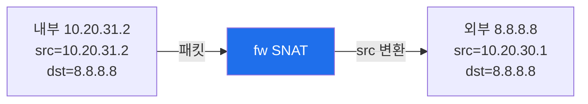
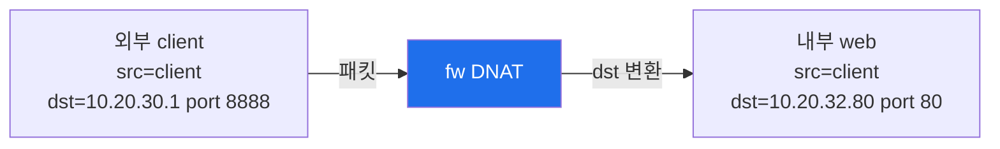
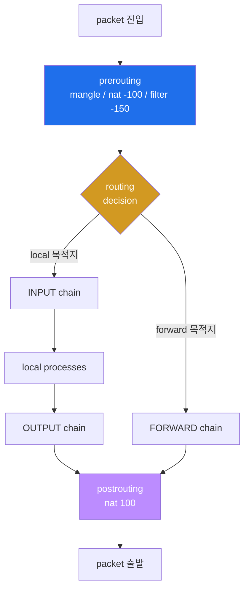
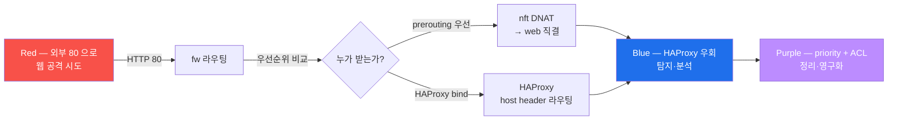
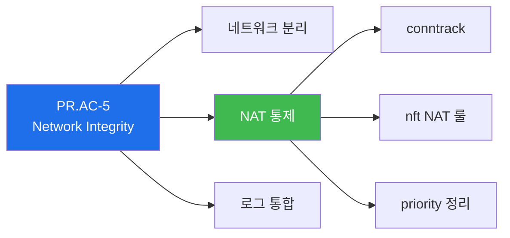

# Week 03 — nftables 방화벽 (2) — DNAT / SNAT + HAProxy 협업

> **본 주차의 한 줄 요약**
>
> W02 의 nftables filter 위에 **NAT (Network Address Translation)** 을 추가한다.
> fw 컨테이너는 L4 NAT (`ip six_nat`) 와 L7 reverse proxy (HAProxy) 두 도구를 동시에
> 운영한다. 학생은 두 도구가 어떻게 협업하는지 (혹은 어떻게 충돌하는지) 를 실습으로
> 검증한다. 더불어 `conntrack -L` / `nft monitor trace` 두 디버그 도구로 양방향
> NAT 변환을 가시화한다.

---

## 학습 목표

1. SNAT / DNAT / MASQUERADE 의 동작 원리와 hook (prerouting / postrouting) 위치를
   화이트보드에 그린다.
2. nftables 의 NAT 룰을 `ip six_nat` table 에 직접 추가·삭제하고 효과를 검증한다.
3. HAProxy 의 L7 라우팅 (host header ACL) 과 nftables L3/L4 NAT 의 차이·협업 관계를
   설명한다.
4. `conntrack -L` 로 활성 conn 의 orig vs reply src/dst 변환을 관찰한다.
5. `nft monitor trace` 로 한 패킷이 어떤 룰을 순차 통과하는지 step-by-step 추적한다.
6. L4 NAT 만으로 처리 가능한 경우 vs L7 HAProxy 가 필수인 경우를 구분한다.
7. **R/B/P 시나리오** — Red 가 fw:8888 직접 DNAT 통해 web 접근 시도 → Blue 가 HAProxy
   와 nftables DNAT 의 priority 충돌 시뮬 → Purple 가 ACL 우선순위 + 영구화 검토.

---

## 강의 시간 배분 (총 3시간 40분)

| 시간      | 내용                                                                  | 유형     |
|-----------|---------------------------------------------------------------------|----------|
| 0:00–0:25 | 이론 — NAT 의 3 종류 (SNAT/DNAT/MASQUERADE) + 운영 시나리오            | 강의     |
| 0:25–0:55 | 이론 — Netfilter NAT chain (prerouting/postrouting) + conntrack 관계 | 강의     |
| 0:55–1:05 | 휴식                                                                  | —        |
| 1:05–1:30 | 이론 — HAProxy L7 vs nftables L4 의 협업·충돌                          | 강의/토론 |
| 1:30–2:00 | 실습 1, 2 — six_nat stub + DNAT 외부 8888 → web                       | 실습     |
| 2:00–2:30 | 실습 3, 4 — MASQUERADE + conntrack -L 변환 분석                       | 실습     |
| 2:30–2:40 | 휴식                                                                  | —        |
| 2:40–3:10 | 실습 5 — nft monitor trace 로 packet 추적                              | 실습     |
| 3:10–3:30 | 실습 6 — **R/B/P** (HAProxy 와 DNAT 동시 80 포트 충돌 시뮬)              | 실습     |
| 3:30–3:40 | 정리 + 과제 안내 + W04 (Suricata IDS) 예고                            | 정리     |

---

## 0. 용어 해설

| 용어 | 영문 | 뜻 |
|------|------|----|
| **NAT** | Network Address Translation | 패킷 IP/port 변환 |
| **SNAT** | Source NAT | 출발지 변환 (outbound) |
| **DNAT** | Destination NAT | 목적지 변환 (inbound 포트 포워딩) |
| **MASQUERADE** | — | SNAT 의 특수 형태, NIC IP 자동 |
| **conntrack** | connection tracking | stateful 추적 (orig/reply 매핑) |
| **prerouting** | — | routing decision 전 hook (DNAT 위치) |
| **postrouting** | — | routing decision 후 hook (SNAT 위치) |
| **L7 reverse proxy** | — | 응용 계층 (HTTP/TLS) 라우팅 |
| **TCP termination** | — | 한 TCP conn 종료 후 새 conn 으로 backend 연결 |
| **PAT** | Port Address Translation | port 도 변환 (NAT 의 부분) |
| **trace** | nft monitor trace | packet 의 룰 통과 실시간 가시화 |
| **SNI** | Server Name Indication | TLS handshake 의 host name (L7 라우팅 키) |
| **priority** | — | 같은 hook 의 chain 평가 순서 (낮을수록 먼저) |

---

## 1. NAT 의 3 종류

### 1.1 SNAT (Source NAT) — 출발지 변환

내부 → 외부 통신 시 사용. 패킷의 출발지 IP/port 를 변환.



**nft 명령**:
```
sudo nft add rule ip six_nat postrouting oifname "eth0" ip saddr 10.20.31.0/24 \
    snat to 10.20.30.1
```

### 1.2 DNAT (Destination NAT) — 목적지 변환

외부 → 내부 포워딩 (port forwarding) 시 사용.



**nft 명령**:
```
sudo nft add rule ip six_nat prerouting iifname "eth0" tcp dport 8888 \
    dnat to 10.20.32.80:80
```

### 1.3 MASQUERADE — SNAT 의 특수 형태

outbound NIC 의 IP 가 동적으로 변할 때 (DHCP 등) `to <IP>` 명시 없이 NIC 의 현재 IP 로
자동 변환.

```
sudo nft add rule ip six_nat postrouting oifname "eth0" ip saddr 10.20.31.0/24 \
    masquerade
```

6v6 환경에서 fw 의 ext NIC IP 는 docker bridge 가 할당하므로 fixed 지만, production
container 환경 (Kubernetes 등) 에서는 NIC IP 가 매번 다르다 → MASQUERADE 가 정석.

### 1.4 priority 와 hook 위치

| Chain | hook | priority | 역할 |
|-------|------|----------|------|
| `prerouting`  | prerouting  | -100 | inbound DNAT (routing 결정 전) |
| `postrouting` | postrouting | 100  | outbound SNAT/MASQUERADE (routing 결정 후) |
| `output`      | output      | -100 | locally-generated 의 DNAT (loopback) |
| `input`       | input       | 100  | locally-destined 의 SNAT (rare) |

priority 가 낮을수록 먼저 평가. `prerouting -100` 은 routing decision 보다 일찍 평가
되어 DNAT 가 routing 에 영향.

---

## 2. Netfilter NAT chain 의 흐름



핵심:
- **DNAT** 는 routing decision 보다 일찍 평가되어 변환된 dst IP 로 routing
- **SNAT** 는 routing 후 평가 (NIC 결정됨 → MASQUERADE 가 NIC IP 알 수 있음)
- conntrack 은 첫 packet 의 변환을 기억 → 후속 응답 패킷 (역방향) 의 NAT 도 일관 적용

---

## 3. conntrack 의 역할

`conntrack` (connection tracking) 은 stateful firewall + NAT 의 핵심.

```
$ sudo conntrack -L | head -3
tcp 6 86400 ESTABLISHED \
    src=10.20.30.202 dst=10.20.30.1 sport=43210 dport=80 \
    src=10.20.30.1 dst=10.20.30.202 sport=80 dport=43210 \
    [ASSURED] mark=0 use=1
```

각 row 가 한 conn 의 양방향 (orig → reply) 변환을 기록.

- **orig** : 첫 SYN 의 방향 (`src=10.20.30.202` → `dst=10.20.30.1`)
- **reply** : 응답 (`src=10.20.30.1` → `dst=10.20.30.202`)

NAT 가 일어났다면 orig 와 reply 의 src/dst 가 단순 swap 이외에도 IP/port 변환 흔적
이 보인다. 예: DNAT 가 있으면 reply 의 src 는 변환된 IP.

**운영 명령**:
```
sudo conntrack -L                       # 전체 conn 조회
sudo conntrack -L -p tcp                # TCP 만
sudo conntrack -L --src 10.20.30.202    # 특정 src
sudo conntrack -D --src 10.20.30.202    # 특정 conn 강제 종료
sudo conntrack -F                       # 전체 flush (조심)
sudo conntrack -E                       # 실시간 event stream
```

---

## 4. HAProxy L7 vs nftables L4 NAT

같은 "외부 포트 → 내부 백엔드" 라우팅이지만 두 도구는 동작 layer 가 다르다.

| 측면 | nftables DNAT (L4) | HAProxy (L7) |
|------|--------------------|--------------|
| 동작 layer | L3/L4 (IP + port) | L7 (HTTP host header / TLS SNI) |
| TCP termination | 없음 (pass-through) | termination + 새 backend conn |
| host header 라우팅 | 불가 (single backend per port) | 가능 (1 port → N backend) |
| TLS termination | 불가 (그냥 forward) | 가능 (cert 보유 시) |
| 부하 분산 | 단순 (1:1 또는 random) | 풍부 (roundrobin, leastconn, source) |
| 헬스체크 | 없음 | check + 자동 failover |
| 로깅 | nftables log prefix (kernel) | HAProxy access log (rsyslog) |
| 처리 비용 | 낮음 (커널 패킷 변환만) | 높음 (user space + TCP 두 번) |
| 운영 가시성 | counter / conntrack | stats socket / web UI |

### 4.1 협업 시나리오 1 — HAProxy 80/443 만, 나머지는 nftables DNAT

```
외부 80 / 443         →  HAProxy L7 (host header 라우팅)
외부 9100 (Bastion)    →  HAProxy (단일 backend)  ← 또는 nftables DNAT
외부 2222 (학생 SSH)  →  nftables DNAT → 10.20.30.201:22 (bastion)
```

L7 가 필요한 트래픽 (host header) 만 HAProxy 가 처리, 단순한 1:1 port forwarding 은
nftables 가 더 효율적.

### 4.2 협업 시나리오 2 — HAProxy 가 DNAT 결과를 받음

```
외부 → nftables DNAT (port 변환만) → HAProxy → backend
```

이 경우 HAProxy 입장에서는 항상 같은 backend conn → L7 라우팅이 hostname 으로 일관.
6v6 는 이 패턴을 사용 (외부 80 → fw eth0:80 의 docker NAT 가 HAProxy 에 도달).

### 4.3 충돌 시나리오 — DNAT 와 HAProxy 가 같은 포트

```
nftables prerouting: tcp dport 80 dnat to 10.20.32.80:80   ← web 직접
HAProxy frontend: bind *:80                                ← HAProxy 도 80
```

두 룰이 동시에 활성이면, **prerouting 의 DNAT 가 먼저 평가** 되어 패킷이 10.20.32.80
으로 변환된다. → HAProxy 는 패킷을 못 받음 → HAProxy log 에 아무것도 안 남음 →
**host header 라우팅 효과 무력화**.

검증: `conntrack -L` 로 dst 가 어디인지 확인.

---

## 5. 6v6-fw 의 NAT 정책 (현재 비어 있음)

W02 에서 본 것처럼 6v6 의 `ip six_nat` table 은 chain 만 정의되어 있고 룰이 비어 있다.

```
table ip six_nat {
    chain prerouting {
        type nat hook prerouting priority -100
        policy accept
    }
    chain postrouting {
        type nat hook postrouting priority 100
        policy accept
    }
}
```

이는 fw 가 ext ↔ pipe 사이 direct routing 으로 동작하고 (NAT 불필요), L7 라우팅은
HAProxy 에 위임했기 때문. 학생은 본 주차에 학습용으로 NAT 룰을 추가하며 효과를 검증
한 후 삭제한다.

---

## 6. 실습 시나리오 1~6 (4 축)

### 실습 1 — six_nat stub 확인 (10분)

> **이 실습을 왜 하는가?**
> NAT 룰 추가 전 baseline 확인. 빈 chain 위에 어떤 룰이 어디 들어가는지 시각화.
>
> **이걸 하면 무엇을 알 수 있는가?**
> - prerouting / postrouting chain 의 priority (-100 / 100)
> - policy accept 의 의미 (NAT 동작 안 함 = direct routing)
> - 룰 추가 후 활성화될 기반
>
> **결과 해석**
> 두 chain header 만 출력 + 룰 없음.
>
> **실전 활용**
> 운영 환경에서 NAT 룰 변경 전 baseline 확인.

```bash
ssh 6v6-fw 'sudo nft list table ip six_nat'
```

**예상 출력**:
```
table ip six_nat {
    chain prerouting {
        type nat hook prerouting priority dstnat; policy accept;
    }
    chain postrouting {
        type nat hook postrouting priority srcnat; policy accept;
    }
}
```

> 참고: nft 11+ 는 priority -100 / 100 을 `dstnat` / `srcnat` 별칭으로 표시.
> 둘은 같은 값.

### 실습 2 — DNAT 룰 추가 (외부 8888 → web 80) (15분)

> **이 실습을 왜 하는가?**
> port forwarding 의 표준 패턴. 외부 8888 트래픽을 내부 web 으로 변환.
>
> **결과 해석**
> 8888 에 curl → 200 응답 (web 의 응답). conntrack 에 dst 변환 흔적.
>
> **실전 활용**
> 외부 노출 서비스의 표준 패턴.

```bash
# DNAT 룰 추가
ssh 6v6-fw 'sudo nft add rule ip six_nat prerouting iifname "eth0" tcp dport 8888 \
    counter dnat to 10.20.32.80:80'

# input chain 의 8888/tcp 허용 (fw 자체로 들어오는 트래픽)
ssh 6v6-fw 'sudo nft insert rule inet six_filter input position 0 tcp dport 8888 accept'

# 검증
ssh 6v6-attacker 'curl -s -o /dev/null -w "%{http_code}\n" -H "Host: juice.6v6.lab" \
    http://10.20.30.1:8888/'
# 200 응답

# conntrack 확인
ssh 6v6-fw 'sudo conntrack -L 2>/dev/null | grep dport=8888'
```

**실측 결과** (2026-05-11):
```
tcp 6 119 TIME_WAIT \
    src=10.20.30.202 dst=10.20.30.1 sport=43544 dport=8888 \
    src=10.20.32.80 dst=10.20.30.202 sport=80 dport=43544 \
    [ASSURED] mark=0 use=1
```

`reply` 의 `src=10.20.32.80` = 변환된 IP. orig dst (10.20.30.1) ≠ reply src (10.20.32.80) → DNAT 변환 흔적.

### 실습 3 — MASQUERADE 룰 추가 (15분)

```bash
ssh 6v6-fw 'sudo nft add rule ip six_nat postrouting oifname "eth0" \
    ip saddr 10.20.31.0/24 counter masquerade'

# postrouting 확인
ssh 6v6-fw 'sudo nft list chain ip six_nat postrouting | grep masquerade'
```

### 실습 4 — conntrack -L 의 양방향 변환 분석 (15분)

```bash
ssh 6v6-fw 'sudo conntrack -L -p tcp 2>/dev/null | head -10'
```

각 row 의 6 필드 (orig src/dst/sport/dport + reply src/dst/sport/dport) 의 관계 분석.
NAT 가 일어났다면 orig src 와 reply dst 가 다름.

### 실습 5 — nft monitor trace 로 packet 추적 (15분)

```bash
# 한 패킷의 trace 활성화
ssh 6v6-fw 'sudo nft add rule inet six_filter input iifname "eth0" tcp dport 80 \
    meta nftrace set 1'

# 다른 터미널 — trace event stream
ssh 6v6-fw 'sudo nft monitor trace 2>&1 | head -20'

# 또 다른 터미널 — curl 발생
ssh 6v6-attacker 'curl -s -H "Host: juice.6v6.lab" http://10.20.30.1/'
```

trace event 가 각 룰 통과 단계를 출력 → 정책 디버깅의 황금 도구.

### 실습 6 — **R/B/P** HAProxy + DNAT 충돌 시뮬 (30분)



**Red — 직접 DNAT 우회 시도** (학습용):
```bash
# attacker 가 fw:80 으로 직접 시도 — 기본은 HAProxy → backend waf
ssh 6v6-attacker 'curl -s -o /dev/null -w "%{http_code}\n" -H "Host: juice.6v6.lab" \
    http://10.20.30.1/'
```

**Blue — 충돌 DNAT 룰 추가** (시뮬):
```bash
# 일부러 prerouting 의 80 → web 직결 룰 (HAProxy 우회)
ssh 6v6-fw 'sudo nft insert rule ip six_nat prerouting position 0 iifname "eth0" \
    tcp dport 80 counter dnat to 10.20.32.80:80'

# 재 curl — HAProxy 우회됨
ssh 6v6-attacker 'curl -s -o /dev/null -w "%{http_code}\n" -H "Host: juice.6v6.lab" \
    http://10.20.30.1/'
# 응답: 200 (DNAT 가 HAProxy 우회 — host header 라우팅 효과 무력화)

# HAProxy log 검증 (DNAT 우회 시 흔적 없음)
ssh 6v6-fw 'sudo tail -5 /var/log/haproxy.log 2>/dev/null | grep "10.20.30.202" | wc -l'
# 0 (HAProxy 안 거침)
```

**Purple — priority 분석 + 영구화 검토**:
```bash
# nat prerouting 의 priority 가 -100 → filter prerouting 의 priority 0 보다 먼저 평가
ssh 6v6-fw 'sudo nft list chains 2>&1 | grep -E "hook prerouting"'

# 운영 위험 분석:
# 1. HAProxy 의 X-Forwarded-For 헤더 누락 → client IP 추적 불가
# 2. host header 라우팅 우회 → wrong backend
# 3. HAProxy log 없음 → 트러블슈팅 곤란
# 4. HAProxy access list / rate limit 우회 → 보안 약화
# 5. TLS termination 우회 → backend 에 TLS 통과 시 cert 불일치

# Cleanup: DNAT 룰 제거 후 HAProxy 정상 동작 확인
HANDLE=$(ssh 6v6-fw 'sudo nft -a list chain ip six_nat prerouting | grep "dport 80 " | \
    grep -oE "handle [0-9]+" | head -1 | awk "{print \$2}"')
ssh 6v6-fw "sudo nft delete rule ip six_nat prerouting handle $HANDLE"

# HAProxy log 복귀
ssh 6v6-fw 'sudo tail -5 /var/log/haproxy.log 2>/dev/null | tail -3'
```

> **Purple Team 핵심 인사이트**: nat prerouting 의 priority `-100` 은 HAProxy 의 user-space
> bind 보다 항상 우선. HAProxy 와 nftables DNAT 를 같은 port 에 동시 운영하면 nftables
> 가 무조건 이긴다 → HAProxy 우회 + 운영 가시성 손실. **production 환경의 정책**: 한
> port 에는 한 도구만 (혼합 운영 금지).

---

## 7. 사례 분석

### 7.1 ISMS-P 2.6.4 (네트워크 침입탐지) 매핑

본 주차의 fw NAT + conntrack 가 어떻게 ISMS-P 2.6.4 sub-control 에 매핑되는가:

| Sub-control | 본 주차 활동 |
|------------|-------------|
| 2.6.4.1 외부 → 내부 접근 모니터링 | conntrack -L 로 활성 conn 추적 |
| 2.6.4.2 정책 변경 audit | nft monitor + git PR |
| 2.6.4.3 로그 보관 | counter + log prefix → rsyslog → SIEM |

### 7.2 KISA 2025 Q1 — 인터넷 노출 DB 사례

KISA 보고서의 35% (관리콘솔 노출) 사고:

```
공격: 외부에 DNAT 로 노출된 PostgreSQL 5432 → 무차별 대입
방어: fw 의 prerouting DNAT 제거 + nftables filter input 의 5432/tcp drop +
      운영자만 bastion 경유 (Bastion ProxyJump 모델)
```

본 주차의 충돌 시나리오와 정확히 동일 패턴.

### 7.3 NIST CSF — PR.AC-5 (Network Integrity)



본 주차가 NAT 통제의 표준.

---

## 8. 과제

### A. NAT 룰셋 작성 (필수, 40점)

다음 시나리오를 nftables 룰셋으로 작성 + 검증:

- 외부 9999/tcp 로 들어온 트래픽을 portal (10.20.32.50:8000) 로 전달
- pipe (10.20.31.0/24) 의 모든 outbound 가 fw 의 ext NIC IP 로 SNAT
- prerouting 에 trace 활성화 룰 추가 후 한 conn 의 trace 로그 첨부

### B. HAProxy vs nftables 비교 (심화, 30점)

다음 표 채우기:

| 시나리오 | nftables 만 가능 | HAProxy 만 가능 | 둘 다 가능 |
|----------|-------------------|-------------------|-----------|
| 외부 80 → 단일 backend | | | |
| host header 별 다른 backend | | | |
| TLS termination | | | |
| 부하 분산 (roundrobin) | | | |
| TCP port forwarding | | | |

각 항목에 √ + 1줄 이유.

### C. 충돌 시나리오 보고서 (정성, 30점)

실습 6 의 R/B/P 결과 + 다음 4 항목:

1. attacker → 80 의 curl 결과 (HAProxy 경유 vs DNAT 우회 후) 차이
2. HAProxy log 의 흔적 (있음/없음)
3. conntrack -L 의 dst 변환 흔적
4. production 환경에서 본 충돌이 발생할 위험 + 권장 정책

---

## 9. 평가 기준

| 항목 | 비중 | 평가 방법 |
|------|------|----------|
| NAT 룰셋 (A) | 40% | 정확도 + trace 첨부 + 검증 출력 |
| 비교 표 (B) | 30% | 5 항목 완성 + 이유 합리성 |
| 충돌 보고서 (C) | 30% | 4 항목 + 위험 분석 |

---

## 10. 핵심 정리

1. **NAT 3 종류** — SNAT (출발지) / DNAT (목적지) / MASQUERADE (동적 SNAT).
2. **hook 위치** — prerouting (-100, DNAT) / postrouting (100, SNAT).
3. **conntrack** — orig + reply 양방향 매핑. NAT 변환의 source of truth.
4. **HAProxy L7 vs nftables L4** — 같은 port 에 동시 운영 시 nftables 가 우선
   (priority -100 → routing 보다 일찍). 혼합 운영 금지.
5. **R/B/P** — Red 의 DNAT 우회 시도 → Blue 의 충돌 시뮬 → Purple 의 priority 정리.

---

## 11. 다음 주차 (W04) 예고

- **주제**: Suricata IDS 기초 + ETOpen 룰셋 + eve.json 분석
- **실습 환경**: `6v6-ips` 단독
- **핵심 도구**: `suricatasc`, `jq`, eve.json
- **R/B/P 시나리오**: Red 가 nikto 웹 스캐너 → Blue 가 Suricata 의 ET SCAN 룰 매치 →
  Purple 가 false-positive 분석 + 룰 튜닝.
