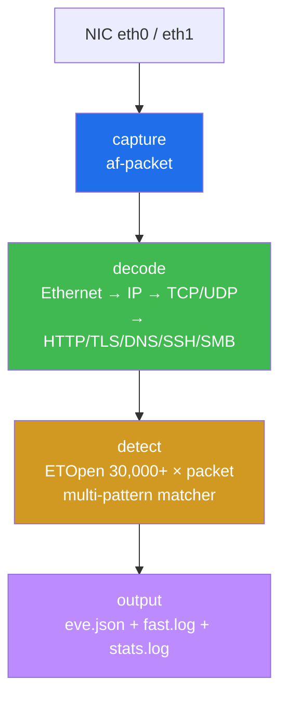
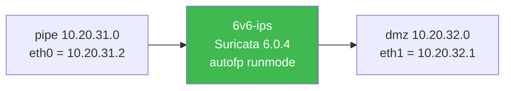
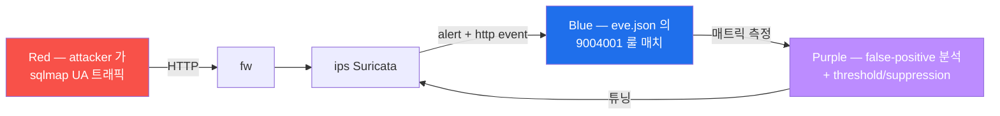

# Week 04 — Suricata IDS — 구성·운영·룰 작성 (1)

> **본 주차의 한 줄 요약**
>
> 6v6-ips 의 **Suricata 6.0.4** 가 두 NIC (pipe + dmz) 에서 동시 sniff 하며 ETOpen
> 룰셋 30,000+ 로 페이로드를 검사한다. 학생은 데몬 가동 → 설정 → 룰셋 → eve.json
> 분석 → 새 룰 작성·트리거 한 사이클을 수행하고, 마지막으로 **R/B/P (Red 가 sqlmap
> UA → Blue 가 새 룰 매치 → Purple 가 false-positive 분석)** 까지 통합한다.

---

## 학습 목표

1. Suricata 의 4 핵심 모듈 (capture / decode / detect / output) 의 데이터 흐름을
   화이트보드에 그린다.
2. af-packet 의 promiscuous capture + clustering + runmode (autofp / workers / single)
   세 옵션 차이를 설명한다.
3. ETOpen 룰셋과 사용자 정의 룰의 위치·우선순위·suricata-update 관리 방법을 이해한다.
4. `eve.json` 의 event_type 별 (alert / http / dns / flow / tls / fileinfo / stats) 의미
   를 jq 로 분석한다.
5. `suricatasc -c <command>` 로 데몬 메트릭을 실시간 조회한다 (dump-counters / uptime
   / reload-rules).
6. 새 alert 룰을 작성·로드·트리거하여 eve.json 의 alert event 발생까지 한 사이클.
7. **R/B/P** — Red 가 sqlmap UA 트래픽 → Blue 가 사용자 정의 룰 매치 → Purple 가
   false-positive 분석 + threshold/suppression 권장.

---

## 강의 시간 배분 (3시간 40분)

| 시간      | 내용                                                                | 유형     |
|-----------|---------------------------------------------------------------------|----------|
| 0:00–0:25 | 이론 — Suricata = "오픈소스 IDS/IPS/NSM" + 동료 (Snort/Zeek/PaloAlto) | 강의     |
| 0:25–0:55 | 이론 — 4 모듈 + 데이터 흐름 (capture → decode → detect → output)     | 강의     |
| 0:55–1:05 | 휴식                                                                 | —        |
| 1:05–1:30 | 6v6-ips 의 실제 구성 (af-packet 두 NIC + autofp + eve.json)         | 강의/토론|
| 1:30–2:00 | 실습 1, 2 — 데몬 상태 + suricata.yaml 핵심 키 분석                  | 실습     |
| 2:00–2:30 | 실습 3 — eve.json event_type 분포 + alert 추출                      | 실습     |
| 2:30–2:40 | 휴식                                                                 | —        |
| 2:40–3:10 | 실습 4 — 새 alert 룰 작성·트리거                                     | 실습     |
| 3:10–3:30 | 실습 5 — **R/B/P** (sqlmap UA → 룰 매치 → false-positive 분석)        | 실습     |
| 3:30–3:40 | 정리 + W05 (룰 작성 심화) 예고                                       | 정리     |

---

## 0. 용어 해설

| 용어 | 영문 | 뜻 |
|------|------|----|
| **af-packet** | Linux Layer 2 capture | 커널의 promiscuous capture 방식 (libpcap 후속) |
| **runmode** | — | Suricata 의 thread 모델 (autofp / workers / single) |
| **flow** | — | 한 conn (5-tuple) 의 양방향 패킷 묶음 |
| **flow_id** | — | flow 의 고유 ID (eve.json 의 모든 event 가 같은 flow_id 공유) |
| **app-layer** | — | application layer 디코더 (HTTP/TLS/DNS/SSH/SMB...) |
| **eve.json** | EVE | Extensible Event Format (JSON 기반 표준) |
| **sid** | Signature ID | 룰의 고유 정수 (사용자 정의는 9M+ 권장) |
| **rev** | revision | 룰 버전 |
| **ETOpen** | Emerging Threats Open | 무료 오픈 룰셋 (제공: Proofpoint) |
| **ETPro** | Emerging Threats Pro | 상용 룰셋 |
| **NSM** | Network Security Monitoring | "탐지" 보다 "관측" — Zeek 의 슬로건 |
| **detect engine** | — | Suricata 의 룰 매칭 코어 (multi-pattern matcher) |
| **hyperscan** | — | Intel SIMD 기반 multi-pattern 매처 (Suricata default) |
| **classification.config** | — | 룰의 클래스 (대분류) + priority 매핑 |
| **threshold.config** | — | 룰별 alert rate-limit (예: 10초에 1건만) |

---

## 1. Suricata 란?

**오픈소스 NSM (Network Security Monitoring) 엔진**. 2009년 OISF (Open Information
Security Foundation) 가 Snort 를 기반으로 분기하여 멀티스레드 + 모던 프로토콜 디코더
+ JSON event 를 갖추고 출시. 2026년 현재 v7.x 가 stable, 본 lab 의 Ubuntu 22.04 패키지
는 6.0.4.

### 1.1 IDS 와 IPS 두 모드

| 모드 | 동작 | 6v6 구성 |
|------|------|----------|
| IDS  | passive sniff → alert (트래픽 개입 X) | 6v6-ips 의 기본 모드 (af-packet) |
| IPS  | NFQUEUE 또는 af-packet inline → drop 가능 | 본 lab 미사용 |

운영 환경의 표준은 IDS + 별도 firewall 로 자동 차단 (Wazuh Active Response 등) 분리.
Suricata 자체 IPS 모드는 throughput 영향이 크다.

### 1.2 4 핵심 모듈 + 데이터 흐름



각 단계가 thread pool 로 병렬화. capture 의 packet 이 detect 에 도달하기 전 decoder
가 프로토콜 식별 (HTTP request / TLS handshake / DNS query) → http/tls/dns event 가
alert 와 별도로 생성된다.

### 1.3 동료 도구 비교

| 도구 | 라이선스 | 주력 | 6v6 사용 |
|------|----------|------|---------|
| Suricata | GPL  | IDS/IPS + NSM | ✓ ips |
| Snort 3  | GPL  | IDS/IPS (legacy 룰 호환) | × |
| Zeek (Bro) | BSD | NSM (스크립트 기반) | × |
| PaloAlto / Cisco FTD | 상용 | NGFW + IPS | × |

Zeek 은 "패킷이 무엇인가" (메타데이터 추출) 에 강점, Suricata 는 "패킷이 악성인가"
(시그니처 매칭) 에 강점. 둘이 보완 관계 → production 운영에서 동시 운영도 흔하다.

---

## 2. 6v6-ips 의 실제 구성

### 2.1 컨테이너 + 네트워크



ips 는 두 NIC 모두에서 promisc capture. fw → pipe → ips → dmz → web/siem 의 모든 트래픽
이 ips 의 두 NIC 를 통과한다 (양쪽 모두 forward path 의 hop).

### 2.2 데몬 시작 옵션 (entrypoint.sh)

```
suricata -i eth1 -i eth0 -c /etc/suricata/suricata.yaml \
    --runmode autofp -l /var/log/suricata
```

- `-i eth0 -i eth1` : 두 NIC 동시 sniff (af-packet thread group 자동 분리)
- `-c` : config 파일
- `--runmode autofp` : auto flow-pinned (한 flow 가 한 thread 에 고정 → cache 친화 + lock-free)
- `-l` : 로그 디렉토리 (`eve.json`, `suricata.log`, `stats.log`)

다른 runmode:
- `workers` : 모든 thread 가 packet pool 공유 (high-throughput 우선)
- `single` : single thread 디버그 모드

### 2.3 룰셋

```
/var/lib/suricata/rules/
├── suricata.rules            # ETOpen 통합 (suricata-update 가 빌드)
├── classification.config
├── app-layer-events.rules
├── decoder-events.rules
├── dns-events.rules
├── http-events.rules
├── tls-events.rules
└── ...

/etc/suricata/rules/local.rules     # 사용자 정의 (W04-W05 학습)
```

- **ETOpen** (Emerging Threats Open) : 무료 오픈 룰셋. 30,000+ 활성 룰. 매일 자동 갱신.
- **사용자 정의 룰** : `/etc/suricata/rules/local.rules` 에 작성 후 `rule-files:` 에 등록.

### 2.4 eve.json — 메인 분석 대상

```json
{
  "timestamp": "2026-05-11T12:56:08.184785+0000",
  "flow_id": 1284584860047176,
  "in_iface": "eth0",
  "event_type": "http",
  "src_ip": "10.20.31.1",
  "src_port": 43210,
  "dest_ip": "10.20.32.80",
  "dest_port": 80,
  "http": {
    "hostname": "juice.6v6.lab",
    "url": "/?q=<script>alert(1)</script>",
    "http_user_agent": "sqlmap/1.5",
    "http_method": "GET",
    "protocol": "HTTP/1.1",
    "status": 403
  }
}
```

한 줄 = 한 event. `event_type` 7+ 종류 (alert / http / dns / flow / tls / fileinfo /
stats / ssh / smtp / smb / quic / dnp3 등).

> 실측 결과 (2026-05-11): 두 NIC 양쪽 모두 sniff 라 같은 transaction 이 보통 **2 event
> 라인** 으로 기록된다 (src=10.20.31.1 + src=10.20.32.1).

---

## 3. 핵심 명령 cheat sheet

```bash
# 데몬 상태
pgrep -a Suricata
sudo suricatasc -c version
sudo suricatasc -c uptime

# eve.json 분석 (jq)
sudo tail -100 /var/log/suricata/eve.json | jq -r .event_type | sort | uniq -c
sudo grep '"event_type":"alert"' /var/log/suricata/eve.json | jq '{sig:.alert.signature}'

# 통계
sudo suricatasc -c dump-counters | jq '.message | with_entries(select(.value>0))'
sudo cat /var/log/suricata/stats.log | tail -30

# 룰셋 관리
sudo suricata-update list-sources
sudo suricata-update                       # 룰 다운로드 + 빌드
sudo suricatasc -c reload-rules            # 재시작 없이 reload
```

---

## 4. 새 alert 룰 작성

### 4.1 룰 syntax

```
alert <proto> <src> <sport> -> <dst> <dport> ( msg:"..." ; <modifier>; ... sid:<int> ; rev:<int> ; )
```

핵심 키워드:
- `alert` : 액션 (alert / drop / reject / pass)
- `tcp / udp / icmp / http / dns / tls / ssh` : 프로토콜
- `$EXTERNAL_NET / any` / `$HOME_NET / any` : 출발지·목적지
- `msg:"..."` : 사람이 읽는 시그니처 이름
- `content:"..."` : 페이로드 매칭 패턴
- `sid:<int>` : signature ID (사용자 정의 9M+)
- `rev:<int>` : revision

### 4.2 예시 — User-Agent 가 "sqlmap" 인 HTTP 요청에 alert

```
alert http any any -> $HOME_NET any (
  msg:"6v6 sqlmap UA detected";
  http.user_agent; content:"sqlmap"; nocase;
  classtype:web-application-attack;
  sid:9004001; rev:1;
)
```

### 4.3 트리거 + 검증

```bash
# 룰 추가
ssh 6v6-ips 'echo ''alert http any any -> any any (msg:"6v6 sqlmap UA"; http.user_agent; content:"sqlmap"; nocase; classtype:web-application-attack; sid:9004001; rev:1;)'' | sudo tee -a /etc/suricata/rules/local.rules'

# rule-files 등록 (이미 있으면 skip)
ssh 6v6-ips 'sudo grep -q "local.rules" /etc/suricata/suricata.yaml || sudo sed -i ''/rule-files:/a\  - /etc/suricata/rules/local.rules'' /etc/suricata/suricata.yaml'

# reload
ssh 6v6-ips 'sudo suricatasc -c reload-rules'

# 트리거
ssh 6v6-attacker 'curl -s -o /dev/null -A "sqlmap/1.5" -H "Host: juice.6v6.lab" http://10.20.30.1/'
sleep 3

# eve.json 의 alert 확인
ssh 6v6-ips 'sudo grep "sid.:9004001" /var/log/suricata/eve.json | tail -1 | jq .alert'
```

---

## 5. R/B/P 통합 시나리오



**Red** — sqlmap UA 트래픽 5회 burst:
```bash
ssh 6v6-attacker 'for i in 1 2 3 4 5; do
    curl -s -o /dev/null -A "sqlmap/1.5" -H "Host: juice.6v6.lab" http://10.20.30.1/
done'
```

**Blue** — eve.json 의 9004001 alert count:
```bash
ssh 6v6-ips 'sudo grep -c "sid.:9004001" /var/log/suricata/eve.json'
# 10 — 5 curl × 2 NIC (양쪽 NIC sniff 라 2 배)
```

**Purple** — false-positive 분석 + threshold 권장:
```bash
# 본 룰이 발생시킨 daily alert 수 예상
ssh 6v6-ips 'sudo grep "sid.:9004001" /var/log/suricata/eve.json | wc -l'

# false-positive 위험 — 정상 사용자가 sqlmap UA 쓸 가능성? (낮음)
# 그러나 burst (1초에 50건) 이면 alert flood → SOC 분석가 부담

# 권장: threshold 룰 (W05 학습) 또는 suppression
# threshold.config 예:
#   event_filter gen_id 1, sig_id 9004001, type rate_filter, track by_src, count 5, seconds 60
# → 같은 src 의 60초 안 5건만 → 6번째부터 무시
```

---

## 6. 사례 분석

### 6.1 ISMS-P 2.6.4 (네트워크 침입탐지)

| Sub-control | 본 주차 활동 |
|------------|-------------|
| 2.6.4.1 외부 → 내부 모니터링 | Suricata 2 NIC sniff + eve.json |
| 2.6.4.2 정책 변경 audit | local.rules + git PR |
| 2.6.4.3 로그 보관 | eve.json → Wazuh agent → 1년 retention |

### 6.2 NIST CSF DE.CM-1 (Network monitoring)

Suricata 가 DE.CM-1 의 표준 구현.

### 6.3 KISA — APT 캠페인 사례

KISA 2025 보고서: 한국 금융권 대상 APT 캠페인 — 정찰 (T1595) → 인증 우회 (T1078) →
측면 이동 (T1021). Suricata 의 ETOpen 룰셋의 `ET SCAN` / `ET TROJAN` / `ET CNC` 카테
고리가 각 단계 매칭.

---

## 7. 실습 시나리오 (4 축)

### 실습 1 — 데몬 상태 + 두 NIC sniff (10분)

```bash
ssh 6v6-ips 'pgrep -a Suricata; echo "---"; sudo suricatasc -c version; sudo suricatasc -c uptime'
```

### 실습 2 — suricata.yaml 핵심 키 (15분)

```bash
ssh 6v6-ips 'sudo grep -A3 "af-packet:" /etc/suricata/suricata.yaml | head -10'
ssh 6v6-ips 'sudo grep -E "default-rule-path|rule-files" /etc/suricata/suricata.yaml'
ssh 6v6-ips 'sudo grep -A3 "eve-log:" /etc/suricata/suricata.yaml | head -10'
```

### 실습 3 — eve.json event_type 분포 (15분)

```bash
ssh 6v6-ips 'sudo tail -500 /var/log/suricata/eve.json | jq -r .event_type | sort | uniq -c | sort -rn'
```

### 실습 4 — 새 alert 룰 + 트리거 (25분)

(위 4.3 절차)

### 실습 5 — R/B/P (20분)

(위 R/B/P 절차)

---

## 8. 과제

### A. 5 alert 룰 작성 (필수, 50점)

다음 5 alert 룰 작성 + 각각 트리거 + eve.json 결과 첨부:

1. User-Agent 가 nikto 인 HTTP 요청
2. URL path 에 `/admin` 포함
3. HTTP request body 에 한국 주민번호 패턴 (정규식)
4. ICMP echo-request 10초에 5번 초과 (threshold)
5. SSH 인증 실패 10회 이상 (suppression 또는 rate-limit)

각 룰의 sid 9004001~9004005 사용.

### B. eve.json 1시간 분석 (심화, 25점)

지난 1시간 eve.json 통계:
- 총 event 수 + event_type 분포
- 가장 자주 매치된 룰 sid top 5
- 가장 자주 trafic 발생 src_ip top 5

### C. R/B/P 보고서 (정성, 25점)

실습 5 의 R/B/P 결과 + false-positive 분석 + threshold/suppression 권장.

---

## 9. 평가 기준

| 항목 | 비중 |
|------|------|
| 룰 작성 (A) | 50% |
| eve.json 분석 (B) | 25% |
| R/B/P 보고서 (C) | 25% |

---

## 10. 다음 주차 (W05) 예고

- **주제**: Suricata 룰 작성 심화 — pcre / fast_pattern / flowbits / threshold / suppression
- **R/B/P 시나리오**: Red 가 다단계 공격 (정찰 → 인증 시도 → admin 접근) → Blue 가
  flowbits 로 단계 추적 → Purple 가 threshold 로 alert flood 차단.
