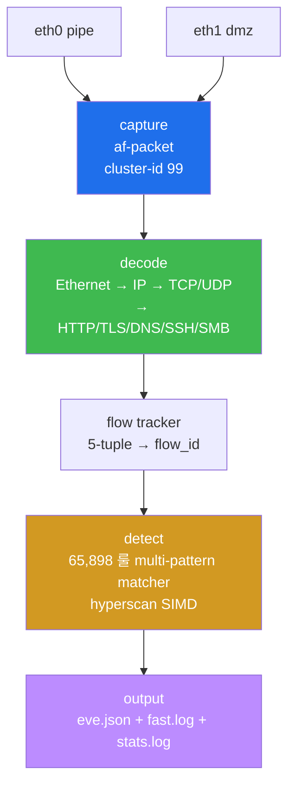
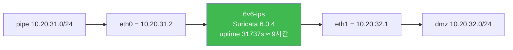

# Week 04 — Suricata IDS — 아키텍처 / 운영 / 룰 작성

> **본 주차의 한 줄 요약**
>
> 6v6-ips 의 **Suricata 6.0.4** 가 pipe + dmz 두 NIC 에서 동시 promiscuous capture 하며
> ETOpen 룰셋 65,898 개로 페이로드를 검사한다. 본 주차는 ① capture/decode/detect/output
> 4 모듈의 데이터 흐름, ② af-packet + cluster + autofp runmode 의 성능 의미, ③ eve.json
> 의 8 event_type 별 필드 사용법, ④ HAProxy 통과 후 traffic 이 ips 에서 어떻게 보이는지
> (실측 — src=10.20.31.1 + xff=10.20.30.202), ⑤ 새 alert 룰 작성·트리거 → R/B/P 까지를
> 다룬다. **운영자 한 줄 결론**: Suricata 는 "패킷이 악성인가" 를 시그니처로 묻고, 답을
> eve.json 의 한 줄 JSON 으로 적는다.

---

## 학습 목표

본 주차 종료 시 학생은 다음 9가지를 **본인 손으로** 할 수 있어야 한다.

1. Suricata 의 4 핵심 모듈 (capture → decode → detect → output) 데이터 흐름을 화이트
   보드에 그리고, 각 단계가 thread pool 로 어떻게 병렬화되는지 설명한다.
2. af-packet + `cluster-id 99` + `cluster_flow` + `--runmode autofp` 4 설정 조합의
   성능적 의미를 1분 안에 설명한다.
3. 6v6-ips 의 두 NIC (eth0=pipe / eth1=dmz) 가 같은 transaction 을 어떻게 2 event 로
   기록하는지 + 실측 src IP (HAProxy 통과 시 10.20.31.1) 와 X-Forwarded-For 헤더
   (10.20.30.202) 의 관계를 설명한다.
4. eve.json 의 8 event_type (alert / http / dns / tls / flow / fileinfo / stats / anomaly)
   별 핵심 필드를 `jq` 로 추출한다.
5. `suricata-update` workflow (source 등록 → fetch → 빌드 → reload) 와 ETOpen 65,898 룰
   의 카테고리 구조 (ET CNC / ET SCAN / ET TROJAN / ET WEB_SPECIFIC_APPS / …) 를 이해.
6. `suricatasc -c dump-counters` 의 `decoder.pkts` / `capture.kernel_drops` /
   `flow.tcp_reuse` 의 의미를 해석하고 drop rate 0% 가 목표인 이유를 설명한다.
7. 새 alert 룰 (sid 9004001 sqlmap UA) 작성 → `local.rules` 등록 → `reload-rules` →
   트리거 → eve.json 의 alert event 검증 사이클을 5분 안에 수행한다.
8. **트러블슈팅 — 룰이 매치 안 되는 4 패턴 (rule-files 미등록 / hostname 오타 /
   in-flight pcap reload / clutter)** 진단법을 안다.
9. **R/B/P 시나리오** — Red 가 sqlmap UA 5회 burst → Blue 가 9004001 alert 10건 (양
   NIC) 카운트 → Purple 이 false-positive 분석 + threshold/suppression 권장.

---

## 강의 시간 배분 (3시간 40분)

| 시간      | 내용                                                                | 유형     |
|-----------|---------------------------------------------------------------------|----------|
| 0:00–0:25 | 이론 — Suricata 정체성 (NSM) + 동료 도구 (Snort/Zeek) 비교            | 강의     |
| 0:25–0:55 | 이론 — 4 모듈 + 데이터 흐름 + thread pool                            | 강의     |
| 0:55–1:05 | 휴식                                                                 | —        |
| 1:05–1:30 | 6v6-ips 실측 — af-packet/cluster/runmode/HAProxy XFF                | 강의/토론|
| 1:30–2:00 | 실습 1, 2 — 데몬 상태 + suricata.yaml 핵심 키 + dump-counters         | 실습     |
| 2:00–2:30 | 실습 3 — eve.json 8 event_type + jq pattern                          | 실습     |
| 2:30–2:40 | 휴식                                                                 | —        |
| 2:40–3:10 | 실습 4 — 새 alert 룰 (sid 9004001) + reload + 트리거                  | 실습     |
| 3:10–3:30 | 실습 5 — **R/B/P** (sqlmap UA × 5 → 10 alert + false-positive 분석)  | 실습     |
| 3:30–3:40 | 정리 + W05 (pcre / flowbits / threshold) 예고                        | 정리     |

---

## 0. 용어 해설

| 용어 | 영문 | 뜻 |
|------|------|----|
| **NSM** | Network Security Monitoring | "관측 + 탐지" 통합 패러다임 (Zeek 의 슬로건) |
| **IDS / IPS** | Intrusion Detection / Prevention | passive sniff (IDS) / inline drop (IPS) |
| **af-packet** | AF_PACKET | Linux kernel 의 L2 capture socket (libpcap 의 modern 후속) |
| **PF_RING** | — | Ntop 의 kernel bypass capture (라이선스: ZC 는 상용) |
| **DPDK** | Data Plane Development Kit | 완전 userspace capture (10Gbps+ 환경) |
| **promiscuous mode** | promisc | NIC 가 자기 dst MAC 아닌 패킷도 받는 모드 |
| **cluster-id** | — | af-packet 의 thread group ID (같은 cluster-id 끼리 share) |
| **cluster_flow** | — | flow (5-tuple) 단위 thread 분배 (cache-friendly) |
| **runmode** | — | Suricata thread 모델: autofp / workers / single |
| **autofp** | auto flow-pinned | flow 단위 thread 고정 (default, balanced) |
| **workers** | — | 모든 packet thread pool 공유 (high-throughput) |
| **flow** | — | 양방향 5-tuple conn (src/dst/sport/dport/proto) |
| **flow_id** | — | flow 고유 ID — eve.json 의 모든 event 가 같은 ID 공유 |
| **app-layer** | application layer | HTTP/TLS/DNS/SSH/SMB/QUIC 등 L7 디코더 |
| **eve.json** | EVE | Extensible EVent — JSON-line 표준 출력 |
| **event_type** | — | eve.json 의 event 분류 (alert/http/dns/tls/flow/...) |
| **sid** | Signature ID | 룰 고유 정수 (custom 9000000+ 권장) |
| **rev** | revision | 룰 버전 |
| **ETOpen** | Emerging Threats Open | Proofpoint 무료 룰셋 (~65,000+) |
| **ETPro** | Emerging Threats Pro | 상용 — daily 갱신 + 0-day |
| **classtype** | — | 룰 카테고리 (web-application-attack / trojan-activity / …) |
| **priority** | — | 1 (가장 높음) ~ 4 (낮음), alert sort 기준 |
| **fast_pattern** | — | multi-pattern matcher 의 first-cut content (성능) |
| **hyperscan** | — | Intel SIMD 기반 매처 (Suricata default) |
| **aho-corasick** | AC | hyperscan 미지원 시 fallback 알고리즘 |
| **detect engine** | — | Suricata 의 룰 매칭 코어 |
| **suricatasc** | suricata socket control | unix socket 통한 runtime 명령 |
| **suricata-update** | — | 룰셋 management CLI (fetch / build / disable) |
| **suricata.rules** | — | suricata-update 가 생성한 ETOpen + custom 통합 룰 파일 |
| **local.rules** | — | 사용자 정의 룰 (operator 수기) |
| **kernel_drops** | — | af-packet 의 kernel level 패킷 손실 (drop rate 0% 목표) |
| **threshold** | — | 룰별 alert rate-limit (예: 60초에 5건만) |
| **suppression** | — | 룰 무시 (특정 src/dst 기준) |
| **flowbits** | — | flow 단위 boolean state (다단계 공격 추적) |

---

## 1. Suricata 란 — 한 줄 정의 + 운영 위치

**한 줄 정의**: 오픈소스 NSM 엔진 — "패킷이 악성인가?" 라는 질문에 시그니처 + 행위 분석
+ 프로토콜 디코더로 답하고, 답을 JSON event 로 적는 도구.

### 1.1 IDS vs IPS — 두 모드의 운영 위치

| 모드 | 동작 | 장점 | 단점 | 6v6 |
|------|------|------|------|-----|
| IDS  | passive sniff → alert | 트래픽 무영향 + throughput 보존 | 차단 기능 없음 → 별 도구 필요 | ✓ |
| IPS (inline NFQUEUE) | 패킷 큐 → 검사 → verdict | 즉시 차단 | 단일 실패점 + throughput 영향 | × |
| IPS (af-packet inline) | 2 NIC 사이 패킷 forward + drop | NFQUEUE 보다 빠름 | 설정 복잡 | × |

운영 환경의 표준 패턴: **IDS + 별도 자동화 차단** (Wazuh Active Response, fail2ban,
nftables drop set 등). Suricata IPS 자체 모드는 throughput 영향 + 단일 실패점 위험.

### 1.2 동료 NSM 도구 비교

| 도구 | 라이선스 | 강점 | 약점 |
|------|----------|------|------|
| Suricata | GPLv2 | 시그니처 매칭 + 풀 프로토콜 디코더 | Lua 외 스크립트 약함 |
| Snort 3 | GPLv2 | legacy Snort 룰 호환 + Cisco backed | multi-thread 늦게 도입 |
| Zeek (구 Bro) | BSD | 스크립트 (Zeek scripting) 풍부 | 시그니처 매칭 약함 |
| 상용 NGFW (PA, FTD) | 상용 | UI + zero-day intel | 비용 + vendor lock |

**보완 관계**: Zeek (메타데이터 + 행위) + Suricata (시그니처) 동시 운영이 production 흔한 패턴.

### 1.3 6v6 의 사용 위치

6v6 의 Defense in Depth 4 계층 (lecture W01 참조) 의 **L2 Inline Detection** 이 Suricata.
- packet 이 fw → pipe → **ips (Suricata)** → dmz → web 로 forward
- ips 의 두 NIC 가 양쪽 모두 promiscuous → 같은 packet 을 2번 sniff (양방향 confirm)
- alert + http/tls/dns event 가 eve.json 의 JSON line 으로 적힘
- W09 의 Wazuh agent 가 eve.json 을 ship → manager 에서 통합 분석

---

## 2. 4 핵심 모듈 — capture / decode / detect / output

### 2.1 데이터 흐름



### 2.2 capture 모듈 — af-packet 의 내부

af-packet 은 Linux kernel 의 표준 L2 capture socket. 6v6-ips 의 실제 설정:

```yaml
af-packet:
  - interface: eth0
    cluster-id: 99
    cluster-type: cluster_flow
    defrag: yes
  - interface: eth1
    cluster-id: 100
    cluster-type: cluster_flow
    defrag: yes
```

**cluster-id 의 의미**: 같은 NIC 의 packet 을 여러 thread 가 나누어 처리하는 group ID.

**cluster-type 옵션**:
- `cluster_flow` (default, **권장**) : 5-tuple hash → 같은 flow 가 같은 thread
- `cluster_cpu` : kernel 의 RX queue 가 같은 CPU → 같은 thread
- `cluster_qm` : NIC RSS hash 신뢰

**6v6 의 선택**: `cluster_flow` — flow-level locality. 같은 conn 의 양방향 packet 이
같은 thread → cache-friendly + lock-free.

### 2.3 decode 모듈 — Ethernet → app-layer

```
Ethernet header (14B) → IP header (20-60B) → TCP/UDP header (8-20B) → payload
                                                                  → HTTP / TLS / DNS / ...
```

Suricata 가 protocol 을 식별하는 우선순위:
1. dst port (예: 80 → HTTP, 443 → TLS, 53 → DNS) — **기본 휴리스틱**
2. 첫 packet payload pattern (예: "GET " → HTTP, `0x16 03 01` → TLS handshake)
3. 사용자 정의 `app-layer.protocols.<x>.detection-ports`

**왜 중요한가**: 잘못 식별되면 `event_type:"http"` 가 안 생성되고 단순 `flow` event 만
남는다 → HTTP 룰이 매치 안 됨 (gap).

### 2.4 detect 모듈 — multi-pattern matcher

65,898 룰을 packet 당 평가 — 단순 순회는 비현실적. Suricata 는 두 매처:

| 매처 | 알고리즘 | 활용 |
|------|----------|------|
| **hyperscan** (Intel) | SIMD 기반 결정 finite automaton | x86 default, ~5x faster |
| **aho-corasick** | 고전 multi-pattern matching | hyperscan 미지원 시 |

**fast_pattern 의 역할**: 각 룰에서 first-cut content (가장 selective). 이게 매치
되어야만 다른 modifier (pcre / flowbits / threshold) 평가. fast_pattern 미설정 시
Suricata 가 가장 긴 content 를 자동 선택.

### 2.5 output 모듈 — eve.json 의 8 event_type

```yaml
outputs:
  - eve-log:
      enabled: yes
      filename: eve.json
      types:
        - alert: {}
        - http:  { extended: yes }
        - dns:   { query: yes }
        - tls:   { extended: yes }
        - flow: {}
        - fileinfo: {}
        - stats: {}
        - anomaly: {}
```

각 event_type 의 의미:

| event_type | 언제 | 핵심 필드 |
|------------|------|----------|
| `alert` | 룰 매치 | alert.signature / alert.sid / alert.severity |
| `http` | HTTP transaction 종료 | http.hostname / url / user_agent / status / xff |
| `dns` | DNS query/response | dns.query.rrname / type / answer |
| `tls` | TLS handshake 완료 | tls.sni / version / ja3.hash / subject |
| `flow` | flow 종료 | flow.pkts_toserver / bytes_toserver / state |
| `fileinfo` | HTTP/SMB 파일 전송 | fileinfo.filename / md5 / size |
| `stats` | 주기적 (default 8초) | stats.uptime / stats.decoder.pkts |
| `anomaly` | decoder anomaly | anomaly.type / event |

---

## 3. 6v6-ips 의 실제 구성 — 실측 2026-05-12

### 3.1 컨테이너 + 두 NIC



ips 가 **router 로 동작** + 양쪽 NIC 에서 promiscuous capture. fw → pipe → ips → dmz →
web 의 모든 트래픽이 ips 의 두 NIC 를 통과 → 같은 packet 을 2번 sniff (양방향 capture).

### 3.2 데몬 시작 — `pgrep -a Suricata` 실측

```
43 suricata -i eth1 -i eth0 -c /etc/suricata/suricata.yaml --runmode autofp -l /var/log/suricata
```

옵션 해석:
- `-i eth1 -i eth0` : 두 NIC 명시 (interface 순서대로)
- `-c /etc/suricata/suricata.yaml` : config
- `--runmode autofp` : auto flow-pinned (default)
- `-l /var/log/suricata` : log dir (`eve.json`, `suricata.log`, `stats.log`)

### 3.3 룰셋 — 실측

```
$ wc -l /var/lib/suricata/rules/suricata.rules
65898 /var/lib/suricata/rules/suricata.rules

$ ls /etc/suricata/rules/
app-layer-events.rules
decoder-events.rules
dhcp-events.rules
dnp3-events.rules
dns-events.rules
files.rules
http-events.rules
http2-events.rules
ipsec-events.rules
kerberos-events.rules
local.rules        ← 사용자 정의 (본 주차)
modbus-events.rules
mqtt-events.rules
nfs-events.rules
ntp-events.rules
smb-events.rules
smtp-events.rules
stream-events.rules
tls-events.rules
```

총 활성 룰 65,898 + 카테고리 별 event 룰 (decoder/app-layer/dns/http/tls 등).

### 3.4 rule-files 설정

```yaml
rule-files:
  - local.rules
  - suricata.rules
```

> ⚠️ **운영 중요 사실**: rule-files 는 **default-rule-path** (`/var/lib/suricata/rules/`)
> 기준 상대 경로. `local.rules` 가 거기 없으면 silent fail. 6v6 는 `local.rules` 가
> `/var/lib/suricata/rules/` 에 symlink (또는 직접 위치).

### 3.5 eve.json 실측 transaction (HAProxy 통과 traffic)

```json
{
  "timestamp": "2026-05-11T21:32:03.780595+0000",
  "flow_id": 1001276243680081,
  "in_iface": "eth1",
  "event_type": "http",
  "src_ip": "10.20.31.1",
  "src_port": 34624,
  "dest_ip": "10.20.32.80",
  "dest_port": 80,
  "proto": "6",
  "tx_id": 0,
  "http": {
    "hostname": "juice.6v6.lab",
    "url": "/test_w04_1",
    "http_user_agent": "TestUA/1.0",
    "xff": "10.20.30.202",
    "http_content_type": "text/html",
    "http_method": "GET",
    "protocol": "HTTP/1.1",
    "status": 200,
    "length": 75002
  }
}
```

**해석**:
- `in_iface: eth1` — dmz 쪽 NIC 에서 capture (HAProxy 가 backend 로 보낸 packet)
- `src_ip: 10.20.31.1` — **fw 의 pipe NIC IP** — HAProxy 가 TCP termination 후 새 conn
- `xff: 10.20.30.202` — **X-Forwarded-For 헤더** — attacker 의 실 IP (HAProxy 가 추가)
- `dest_ip: 10.20.32.80` — web 의 dmz IP
- `length: 75002` — juiceshop index 의 응답 body 크기

**중요 운영 인사이트**: HAProxy 가 정상 통과한 traffic 은 ips 에서 보면 src_ip 가 fw IP
(`10.20.31.1`), 진짜 client IP 는 `http.xff` 필드. 룰을 작성할 때 src_ip 만 보면 모든
HTTP 트래픽이 같은 src 로 보임 — `http.xff` 또는 `request_header` content 매칭이 필수.

### 3.6 양 NIC sniff → 한 transaction = 2 event 라인

ips 는 두 NIC 모두 sniff 라 packet 이 ips 를 forward 통과할 때:
- packet 이 pipe (eth0) 로 들어와서 → capture (event 1, in_iface eth0)
- ips 가 routing 으로 dmz (eth1) 로 보낼 때 → 다시 capture (event 2, in_iface eth1)

따라서 같은 HTTP request 가 eve.json 에 **보통 2 라인** 으로 기록된다. R/B/P 의 alert
count 계산 시 양 NIC 효과를 고려해야 함 (5 curl → 10 alert).

---

## 4. af-packet + cluster + runmode — 성능적 의미

### 4.1 runmode 비교

| runmode | thread 모델 | 장점 | 단점 | 사용 시점 |
|---------|-------------|------|------|----------|
| **autofp** | capture thread × N + flow thread × M | balanced default | flow imbalance 시 일부 thread 폭주 | 일반 운영 |
| **workers** | 모든 thread 가 packet pool 공유 | high-throughput | flow context lock 부담 | 10Gbps+ |
| **single** | 1 thread (debug) | reproducible | slow | 룰 작성 / debug |

6v6 는 `autofp` (default) — 학습 환경에 적합.

### 4.2 cluster_flow 의 locality 효과

```
packet (5-tuple A) → hash → thread X
packet (5-tuple A, 같은 conn 다음 packet) → hash → thread X (같은)
packet (5-tuple B) → hash → thread Y
```

같은 flow 의 packet 이 같은 thread → flow context (HTTP parser state, TCP reassembly
buffer) 가 thread-local → lock-free + cache hit.

cluster_cpu 는 NIC RX queue 의 CPU 기준 — flow locality 가 NIC HW 의 RSS hash 에 의존
하여 비결정적. cluster_flow 가 안정적.

### 4.3 drop rate — 운영 목표

```bash
$ sudo suricatasc -c dump-counters | jq '.message |
    {pkts: .decoder.pkts, drops: .capture.kernel_drops, ifaces: .capture.kernel_ifdrops}'
```

`capture.kernel_drops` > 0 이면 af-packet 의 ring buffer 가 가득 차서 kernel 이 packet
을 버린 것 → **IDS gap**.

원인:
1. CPU 부족 (룰 평가가 packet 속도 못 따라감)
2. ring buffer 작음 (`ring-size: 2048` → `8192` 권장)
3. NIC offload (TSO/GRO) 가 packet 합쳐서 일부 룰 mis-match

**운영 목표**: `kernel_drops / decoder.pkts < 0.01%` (사실상 0%).

### 4.4 stats.log — 8초마다 자가 점검

```
$ tail /var/log/suricata/stats.log
| ...
| decoder.pkts                                 | Total                     | 1234567
| decoder.bytes                                | Total                     | 987654321
| capture.kernel_packets                       | Total                     | 1234567
| capture.kernel_drops                         | Total                     | 0
| ...
```

decoder.pkts == capture.kernel_packets - capture.kernel_drops 이 정상.

---

## 5. eve.json 8 event_type 별 jq pattern

### 5.1 event_type 분포 (실측 — 최근 500 event)

```
$ sudo tail -500 /var/log/suricata/eve.json | jq -r .event_type | sort | uniq -c | sort -rn
    330 flow
    160 tls
     10 stats
```

(주의: HTTP traffic 이 적은 시간대라 alert/http event 가 적음. R/B/P 후 다시 측정.)

### 5.2 핵심 jq pattern

**alert event 만 추출**:
```bash
jq -c 'select(.event_type=="alert") | {ts:.timestamp, sig:.alert.signature, sid:.alert.sid}'
```

**HTTP event 의 url + xff + status**:
```bash
jq -c 'select(.event_type=="http") | {url:.http.url, xff:.http.xff, status:.http.status, ua:.http.http_user_agent}'
```

**같은 flow_id 의 모든 event** (한 conn 의 alert + http + flow 연결):
```bash
FID=1001276243680081
jq -c "select(.flow_id==$FID) | {type:.event_type, ts:.timestamp}"
```

**TLS JA3 fingerprint**:
```bash
jq -c 'select(.event_type=="tls") | {sni:.tls.sni, ja3:.tls.ja3.hash, ja3s:.tls.ja3s.hash}'
```

**flow termination event — 어느 client 가 가장 많은 traffic** (top 5):
```bash
jq -c 'select(.event_type=="flow") | {src:.src_ip, bytes:.flow.bytes_toserver}' \
  | sort -t: -k4 -rn | head -5
```

**fileinfo event — HTTP / SMB 파일 다운로드**:
```bash
jq -c 'select(.event_type=="fileinfo") | {host:.http.hostname, file:.fileinfo.filename, md5:.fileinfo.md5}'
```

**anomaly event — decoder 가 본 비정상**:
```bash
jq -c 'select(.event_type=="anomaly") | {type:.anomaly.type, event:.anomaly.event}'
```

### 5.3 flow_id 의 운영 활용

같은 conn 의 모든 event 가 같은 `flow_id` 를 공유 → 한 alert 의 context (어떤 HTTP
request, TLS handshake 정보) 를 같이 추출 가능.

```bash
# alert sid 9004001 의 모든 context 추출
ALERT_FLOWS=$(jq -r 'select(.alert.sid==9004001) | .flow_id' eve.json | sort -u)
for fid in $ALERT_FLOWS; do
    echo "=== flow $fid ==="
    jq -c "select(.flow_id==$fid)" eve.json
done
```

---

## 6. suricata-update — ETOpen 룰셋 관리 workflow

### 6.1 4 단계 workflow

```
1. source 등록    →  suricata-update enable-source et/open
2. fetch         →  suricata-update update-sources (catalog)
3. 빌드          →  suricata-update           (fetch + 통합 + suricata.rules)
4. reload        →  suricatasc -c reload-rules
```

### 6.2 source 카테고리 (ETOpen 65,898 룰)

```
ET ACTIVEX             — 약 50 룰 — IE ActiveX 취약점
ET ATTACK_RESPONSE    — 약 200 룰 — 공격 후 응답 패턴
ET CHAT                — 약 30 룰 — IRC/messaging
ET CNC                 — 약 8000 룰 — Command & Control
ET CURRENT_EVENTS     — 약 5000 룰 — 최근 캠페인
ET DNS                 — 약 500 룰 — DNS abuse
ET DOS                 — 약 100 룰 — DoS pattern
ET EXPLOIT            — 약 8000 룰 — exploit attempt
ET FTP                 — 약 200 룰 — FTP abuse
ET GAMES               — 약 30 룰 — Game traffic
ET GPL                 — Snort GPL imports
ET HUNTING            — 약 2000 룰 — hunting (실 alert 보다 검색용)
ET ICMP                — 약 100 룰 — ICMP abuse
ET INFO                — 약 1000 룰 — informational (priority 3)
ET MALWARE             — 약 6000 룰 — malware signature
ET MOBILE_MALWARE     — 약 300 룰 — mobile-specific
ET NETBIOS             — 약 200 룰 — NetBIOS abuse
ET P2P                 — 약 100 룰 — P2P traffic
ET POLICY              — 약 2000 룰 — policy violation (gambling 등)
ET POP3                — 약 30 룰 — POP3 abuse
ET RPC                 — 약 30 룰 — RPC abuse
ET SCAN                — 약 3000 룰 — recon / scanning
ET SMTP                — 약 500 룰 — SMTP abuse
ET SNMP                — 약 30 룰 — SNMP abuse
ET SQL                 — 약 200 룰 — SQL inject (mostly DB protocol)
ET TELNET              — 약 30 룰 — Telnet abuse
ET TFTP                — 약 20 룰 — TFTP abuse
ET TROJAN              — 약 8000 룰 — trojan / C2
ET USER_AGENTS        — 약 500 룰 — suspicious UA
ET VOIP                — 약 100 룰 — VOIP abuse
ET WEB_CLIENT          — 약 1000 룰 — browser attack
ET WEB_SERVER          — 약 3000 룰 — server-side attack
ET WEB_SPECIFIC_APPS  — 약 15000 룰 — CMS-specific (WordPress / Joomla / phpMyAdmin)
ET WORM                — 약 200 룰 — network worm
```

### 6.3 룰 disable / enable / modify

```bash
# 특정 sid disable
sudo suricata-update disable-sid 2014773

# 카테고리 전체 disable
echo "group:ET POLICY" | sudo tee -a /etc/suricata/disable.conf

# 적용
sudo suricata-update
sudo suricatasc -c reload-rules
```

### 6.4 정기 갱신 자동화 — cron

```
0 4 * * * /usr/bin/suricata-update -q && /usr/bin/suricatasc -c reload-rules
```

매일 새벽 4시 ETOpen 룰 fetch + reload (downtime 0초). Wazuh agent 가 reload 후 룰셋
변경을 alert 화 (W09).

---

## 7. 새 alert 룰 작성 — 5분 cycle

### 7.1 룰 syntax 의 9 부분

```
alert http any any -> $HOME_NET any (
  msg:"6v6 sqlmap UA detected";
  http.user_agent; content:"sqlmap"; nocase;
  classtype:web-application-attack;
  priority:2;
  sid:9004001; rev:1;
)
```

| 부분 | 의미 |
|------|------|
| `alert` | action (alert / drop / reject / pass) |
| `http` | protocol (tcp/udp/icmp/http/dns/tls/ssh/smb/…) |
| `any any -> $HOME_NET any` | src IP src_port -> dst IP dst_port |
| `msg:"..."` | 사람이 읽는 이름 (eve.json 의 `alert.signature`) |
| `http.user_agent; content:"sqlmap"; nocase;` | matcher — HTTP User-Agent 에 "sqlmap" (대소문자 무시) |
| `classtype:web-application-attack` | classification.config 의 카테고리 |
| `priority:2` | severity (1=critical / 2=high / 3=info / 4=low) |
| `sid:9004001` | 룰 ID (custom 9000000+ 권장) |
| `rev:1` | revision (룰 수정 시 ++) |

### 7.2 변수 정의 (`vars:address-groups:`)

```yaml
vars:
  address-groups:
    HOME_NET: "[10.20.30.0/24,10.20.31.0/24,10.20.32.0/24,10.20.40.0/24]"
    EXTERNAL_NET: "!$HOME_NET"
```

6v6 의 4 subnet 이 HOME_NET. 룰 작성 시 `$HOME_NET` 사용.

### 7.3 룰 추가 → reload → 트리거 → 검증 cycle (실측)

```bash
# 1. 룰 추가
ssh 6v6-ips 'echo "alert http any any -> any any (msg:\"6v6 sqlmap UA\"; http.user_agent; content:\"sqlmap\"; nocase; classtype:web-application-attack; priority:2; sid:9004001; rev:1;)" | sudo tee -a /etc/suricata/rules/local.rules'

# 2. reload (no downtime)
ssh 6v6-ips 'sudo suricatasc -c reload-rules'

# 3. 트리거
ssh 6v6-attacker 'curl -s -o /dev/null -A "sqlmap/1.5" -H "Host: juice.6v6.lab" http://10.20.30.1/'
sleep 3

# 4. eve.json alert event 검증
ssh 6v6-ips 'grep "9004001" /var/log/suricata/eve.json | tail -1 | jq .alert'
```

**예상 출력**:
```json
{
  "action": "allowed",
  "gid": 1,
  "signature_id": 9004001,
  "rev": 1,
  "signature": "6v6 sqlmap UA",
  "category": "Web Application Attack",
  "severity": 2
}
```

---

## 8. R/B/P — Red 가 sqlmap UA × 5 → Blue 가 10 alert → Purple 의 false-positive 분석

### 8.1 시나리오

```mermaid
graph LR
    R["Red — attacker sqlmap UA × 5"] -->|HTTP| FW[fw]
    FW --> IPS[ips Suricata]
    IPS -->|alert × 10 (양 NIC)| B["Blue — eve.json 의 9004001 카운트"]
    B -->|10 이면 정상| P["Purple — false-positive 분석<br/>+ threshold 권장"]
    P -->|threshold 룰| IPS
    style R fill:#f85149,color:#fff
    style B fill:#1f6feb,color:#fff
    style P fill:#bc8cff,color:#fff
```

### 8.2 Red — sqlmap UA 5회

```bash
ssh 6v6-attacker 'for i in 1 2 3 4 5; do
    curl -s -o /dev/null -A "sqlmap/1.5" -H "Host: juice.6v6.lab" http://10.20.30.1/
done'
sleep 5
```

### 8.3 Blue — 9004001 카운트

```bash
ssh 6v6-ips 'sudo grep -c "9004001" /var/log/suricata/eve.json'
```

**예상**: `10` (5 curl × 2 NIC). 5 가 아니면:
- 5 미만 → 룰 reload 안 됨 or content 매치 실패
- 10 초과 → 다른 reload trigger 또는 retry traffic
- 정확히 5 → 한쪽 NIC capture 만 (af-packet 설정 검토)

### 8.4 Purple — false-positive 분석 + threshold 권장

```bash
# false-positive 위험 평가
# - "sqlmap" 이 정상 UA 가능성? (낮음, 도구 시그니처)
# - 그러나 burst (1초 50건) 이면 alert flood → SOC fatigue

# threshold 권장 — 60초 안 5건만 (event_filter)
cat <<'EOF' >> /etc/suricata/threshold.config
event_filter gen_id 1, sig_id 9004001, type rate_filter, track by_src, count 5, seconds 60
EOF

# 적용
sudo suricatasc -c reload-rules

# 또는 룰 자체에 threshold modifier
# alert http any any -> any any (msg:"..."; ... threshold:type both, track by_src, count 5, seconds 60; sid:9004001; rev:2;)
```

`event_filter` vs `threshold modifier`:
- **`event_filter` (threshold.config)** : 운영자 외부 통제, 룰 수정 없이 변경 가능 — production 정석
- **`threshold modifier`** : 룰 자체에 포함, 룰 작성자 의도 명시

---

## 9. Suricata 트러블슈팅 — 룰이 매치 안 되는 4 패턴

### 9.1 패턴 1 — rule-files 미등록

증상: `local.rules` 에 룰 추가 + `reload-rules` 했지만 alert 없음.

진단:
```bash
sudo suricatasc -c reload-rules 2>&1 | head    # error 표시
sudo grep "9004001" /var/log/suricata/suricata.log   # 로드 확인
sudo journalctl -u suricata --since "5 min ago" | grep -E "ERROR|WARN"
```

해결: `suricata.yaml` 의 `rule-files:` 에 `local.rules` 추가 + `default-rule-path`
경로 확인.

### 9.2 패턴 2 — hostname 오타 / wrong field

증상: HTTP 룰이 매치 안 됨.

진단: 룰의 `http.user_agent;` 가 실제 eve.json 의 `http.http_user_agent` 와 매핑 확인.
Suricata 6 의 sticky buffer 이름이 6.0.4 / 7.x 에서 약간 다르다.

```bash
# eve.json 의 실제 필드 확인
sudo tail -50 /var/log/suricata/eve.json | jq 'select(.event_type=="http") | .http' | head -20
```

### 9.3 패턴 3 — packet 이 룰 도달 전 drop

증상: alert 없음 + dump-counters 의 `capture.kernel_drops > 0`.

진단:
```bash
sudo suricatasc -c dump-counters | jq '.message |
    {drops: .capture.kernel_drops, pkts: .decoder.pkts, ratio: (.capture.kernel_drops/.decoder.pkts*100)}'
```

해결: `ring-size: 8192` 상향 + cluster type 검토 + CPU 부족 시 NIC offload (GRO) off.

### 9.4 패턴 4 — flow context 부재 (TCP reassembly 미완)

증상: HTTP request 가 packet 1개에 안 들어 가서 reassembly 가 필요한데 timeout 또는
memcap 도달로 incomplete.

진단:
```bash
sudo suricatasc -c dump-counters | jq '.message |
    {tcp_reuse: .flow.tcp_reuse, syn: .tcp.syn, ssn_memcap_drop: .tcp.ssn_memcap_drop}'
```

해결: `stream.memcap: 64mb → 128mb` 상향, `flow.memcap` 상향.

---

## 10. 사례 분석

### 10.1 ISMS-P 2.6.4 (네트워크 침입탐지) 매핑

| Sub-control | 본 주차 활동 |
|-------------|-------------|
| 2.6.4.1 외부→내부 모니터링 | Suricata 2 NIC sniff + eve.json |
| 2.6.4.2 정책 변경 audit | `local.rules` git PR + `reload-rules` 시각 기록 |
| 2.6.4.3 로그 보관 | eve.json → Wazuh agent (W09) → 1년 retention |
| 2.6.4.4 임계 모니터링 | `kernel_drops` < 0.01% 자동 alert |

### 10.2 NIST CSF DE.CM-1 (Network Monitoring)

Suricata 가 DE.CM-1 의 표준 OSS 구현. 90% 의 enterprise SOC 가 Suricata + Snort + 상용
NGFW 중 하나 이상 운영.

### 10.3 KISA 2025 APT 캠페인 — 룰 매핑

KISA 2025 Q1 보고서의 한국 금융권 APT 캠페인:

| 단계 | TTP | ATT&CK | Suricata 룰 카테고리 |
|------|-----|--------|--------------------|
| 정찰 | port scan | T1595 | ET SCAN |
| 인증 우회 | password spray | T1110 | ET POLICY / ET HUNTING |
| 측면 이동 | SMB / RDP | T1021 | ET NETBIOS / ET POLICY |
| C2 | DNS tunneling | T1572 | ET CNC / ET DNS |
| Exfil | HTTPS upload | T1041 | ET TROJAN / ET HUNTING |

ETOpen 룰셋이 5 단계 모두 cover. 본 주차의 9004001 (sqlmap UA) 룰은 정찰 단계의 OSS
보강.

### 10.4 운영 사고 사례 3 — 6v6 인프라 학습

**사례 1 — silent rule miss**:
```
운영자: local.rules 에 룰 추가 + reload 했는데 alert 없음
원인: rule-files 가 default-rule-path 기준 → local.rules 가 그 경로에 없음 (절대 경로)
해결: suricata.log 확인 → "rule file not found" + 정확한 경로로 변경
```

**사례 2 — sqlmap UA 가 매치 안 됨 (5.x → 6.x sticky buffer 변경)**:
```
운영자: Suricata 5 에서 동작하던 룰을 6 로 옮겼더니 매치 안 됨
원인: `content:"sqlmap"; http_user_agent;` (5.x 후위) → `http.user_agent; content:"sqlmap";` (6.x 전위)
해결: 6.x 의 sticky buffer 문법으로 재작성
```

**사례 3 — kernel_drops 폭증 (10Gbps NIC + 룰 75,000개)**:
```
운영자: 룰 disable 안 한 상태로 1Gbps → 10Gbps 회선 upgrade
원인: CPU 가 룰 평가 못 따라감 → ring buffer overflow
해결: ET POLICY / ET HUNTING / ET INFO 카테고리 disable (10,000+ 룰 감소) + ring-size 상향
```

---

## 11. 실습 시나리오 (4 축 설명)

### 실습 1 — 데몬 상태 + version + uptime (10분)

> **왜 하는가?** 운영 인수 시 첫 점검. 데몬 살아 있는지 + 어느 버전 + 가동 시간.
>
> **무엇을 안다?** ips 컨테이너 의 Suricata 6.0.4 + uptime ~9시간 + 두 NIC sniff.
>
> **결과 해석** — version OK + uptime > 0 + pgrep 출력 1.
>
> **실전 활용** — 운영 인수 + 사고 후 데몬 살아 있는지.

```bash
ssh 6v6-ips 'pgrep -a Suricata'
ssh 6v6-ips 'sudo suricatasc -c version'
ssh 6v6-ips 'sudo suricatasc -c uptime'
```

### 실습 2 — suricata.yaml 핵심 키 (15분)

```bash
ssh 6v6-ips 'sudo grep -A3 "^af-packet:" /etc/suricata/suricata.yaml | head -15'
ssh 6v6-ips 'sudo grep -E "^rule-files:|^default-rule-path" /etc/suricata/suricata.yaml'
ssh 6v6-ips 'sudo grep -A8 "^outputs:" /etc/suricata/suricata.yaml | head -15'
```

### 실습 3 — eve.json event_type 분포 + jq pattern (20분)

```bash
ssh 6v6-ips 'sudo tail -500 /var/log/suricata/eve.json | jq -r .event_type | sort | uniq -c | sort -rn'
ssh 6v6-ips 'sudo grep "\"event_type\":\"http\"" /var/log/suricata/eve.json | tail -1 | jq -c .http'
ssh 6v6-ips 'sudo grep "\"event_type\":\"tls\"" /var/log/suricata/eve.json | tail -1 | jq -c {sni:.tls.sni, ja3:.tls.ja3}'
```

### 실습 4 — 새 alert 룰 추가 + reload + 트리거 (25분)

(§7.3 전체 cycle)

### 실습 5 — **R/B/P** (sqlmap UA × 5 → 10 alert + false-positive 분석) (25분)

(§8 의 R/B/P)

---

## 12. 과제

### A. 5 alert 룰 작성 (필수, 50점)

다음 5 alert 룰 작성 + 각각 트리거 + eve.json 결과 첨부 (sid 9004001~9004005):

1. **9004001 sqlmap UA** — User-Agent 에 "sqlmap"
2. **9004002 nikto UA** — User-Agent 에 "Nikto"
3. **9004003 /admin path** — URL path 에 "/admin"
4. **9004004 SSRF localhost probe** — URL 에 "localhost" 또는 "127.0.0.1"
5. **9004005 ICMP burst** — ICMP echo-request 10초에 10번 초과 (threshold 사용)

각 룰의 `classtype` + `priority` + `rev` 까지 명시.

### B. eve.json 1시간 분석 (심화, 25점)

지난 1시간 eve.json 의 통계 (jq 사용):
- 총 event 수 + event_type 분포 (4 위까지)
- 가장 자주 매치된 alert sid top 5
- 가장 traffic 많은 src_ip top 5
- HTTP request 중 X-Forwarded-For 비율 (HAProxy 경유 %)

### C. R/B/P 보고서 (정성, 15점)

실습 5 의 R/B/P 결과 + 다음 4 항목:

1. Red 5 curl 의 9004001 alert 정확 카운트 (10 예상)
2. 양 NIC capture 가 카운트에 미친 영향
3. false-positive 가능성 + threshold 권장값 (count, seconds)
4. production 환경에서 본 룰을 어떻게 audit 화 (git PR / reload 자동화 / Wazuh 통합)

### D. 트러블슈팅 시뮬 (정성, 10점)

§9 의 4 패턴 중 1 패턴 (rule-files 미등록) 을 시뮬 — 일부러 wrong 경로로 등록 + reload
후 어떤 error 가 어디 (suricata.log / journalctl) 에 적히는지 확인 + 복구.

---

## 13. 평가 기준

| 항목 | 비중 | 평가 방법 |
|------|------|----------|
| 5 룰 작성 (A) | 50% | 5 sid 정확 + 트리거 + alert event 첨부 + classtype/priority/rev |
| eve.json 분석 (B) | 25% | 4 통계 정확 + jq 사용 |
| R/B/P 보고서 (C) | 15% | 4 항목 + 가시화 |
| 트러블슈팅 (D) | 10% | error 위치 정확 + 복구 |

---

## 14. 핵심 정리 (8 줄)

1. **Suricata 4 모듈** — capture (af-packet) → decode (Eth → IP → TCP → HTTP/TLS/DNS) →
   detect (65,898 룰 hyperscan SIMD) → output (eve.json JSON line)
2. **af-packet + cluster_flow + autofp** — flow locality + lock-free thread + cache hit
3. **6v6-ips 의 양 NIC sniff** — pipe (eth0) + dmz (eth1). 한 transaction = 2 event
4. **HAProxy 통과 후 ips 가 본 모습** — src_ip = 10.20.31.1 (fw), xff = 10.20.30.202
   (attacker). 룰은 `http.xff` 또는 header content 로 매칭
5. **eve.json 8 event_type** — alert / http / dns / tls / flow / fileinfo / stats / anomaly.
   같은 flow_id 가 한 conn 의 모든 event 연결
6. **ETOpen 65,898 룰** — 30+ 카테고리 (ET CNC / ET SCAN / ET TROJAN / ET WEB_*) +
   suricata-update workflow (4 단계)
7. **새 alert 룰** — `alert http any any -> $HOME_NET any (msg ...; http.user_agent;
   content:"..."; sid:9004001; rev:1)`. reload-rules 가 downtime 0
8. **R/B/P** — Red 5 curl → 10 alert (양 NIC) → Purple threshold 5/60s

---

## 15. 다음 주차 (W05) 예고

- **주제**: Suricata 룰 작성 심화 — pcre / fast_pattern / flowbits / threshold / suppression
- **R/B/P 시나리오**: Red 가 다단계 공격 (정찰 → 인증 시도 → admin 접근) → Blue 가
  flowbits 로 단계 추적 → Purple 가 threshold 로 alert flood 차단.
- **연결**: 본 주차의 단순 content 매칭에서 stateful matching (`flowbits:set/isset`) +
  rate-limit (threshold) + 정규식 (pcre) 으로 룰의 표현력 확장.

---

## 부록 A — suricatasc 명령 cheat sheet

| 명령 | 효과 |
|------|------|
| `version` | Suricata 버전 |
| `uptime` | 가동 초 |
| `reload-rules` | 룰셋 reload (downtime 0) |
| `dump-counters` | 모든 통계 JSON dump |
| `iface-list` | sniff 중인 NIC 목록 |
| `iface-stat eth0` | 특정 NIC 의 packet/drop |
| `memcap-show` | flow / stream 의 메모리 사용 |
| `memcap-set flow 256mb` | 동적 변경 |
| `register-tenant` | multi-tenant 룰셋 (advanced) |
| `shutdown` | graceful shutdown |

## 부록 B — eve.json 8 event_type 필드 reference

```
alert.signature / sid / rev / category / severity / action
http.hostname / url / http_method / http_user_agent / xff / status / length / protocol
dns.query[].rrname / rrtype / answer[].rrname / rdata
tls.sni / version / subject / issuer / ja3.hash / ja3s.hash / ja4.hash
flow.pkts_toserver / pkts_toclient / bytes_toserver / bytes_toclient / start / end / state
fileinfo.filename / size / md5 / sha1 / sha256 / state
stats.uptime / decoder.pkts / decoder.bytes / capture.kernel_packets / capture.kernel_drops
anomaly.type / event / layer
```

## 부록 C — production-grade 룰 작성 체크리스트

```
□ sid 고유 (9000000+)
□ msg 명확 (운영자 1초 이해)
□ classtype + priority (alert sort)
□ proto 정확 (http vs tcp dport 80 차이)
□ content + nocase + fast_pattern 활용
□ threshold 또는 event_filter (false-positive 대비)
□ reference (URL / CVE — eve.json 의 alert.metadata)
□ test pcap (정상 + 악성 sample 매치 확인)
□ git PR + suricata-update 통합
□ Wazuh agent ship 검증 (W09)
```
