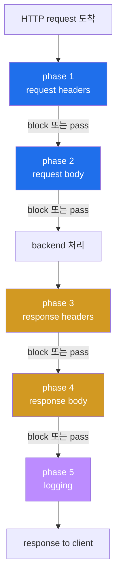
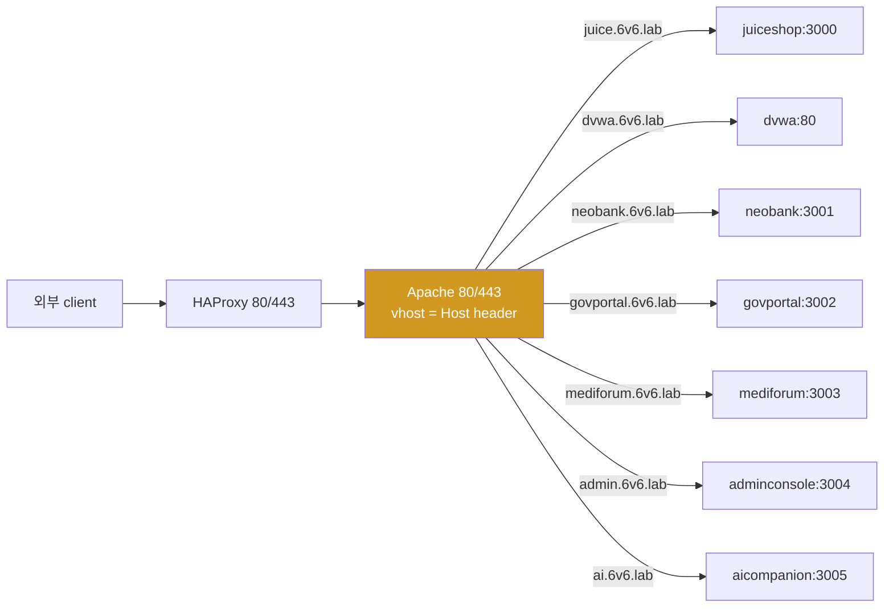
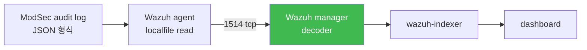

# Week 06 — Apache + ModSecurity v2 + OWASP CRS (WAF)

> **본 주차의 한 줄 요약**
>
> 6v6-web 의 **Apache 2.4 + mod_security2 (2.9.x) + OWASP CRS 3.3.2** 를 깊이 해부한다.
> Suricata 의 passive sniff (W04-W05) 와 달리 ModSec 은 inline + 차단 가능. 학생은
> ① SecRuleEngine 3 모드 + 5 phase 처리 단계, ② OWASP CRS 의 30+ 룰 파일 + paranoia
> level 1-4, ③ anomaly score 누적 메커니즘 (실측 XSS score 15 — 941100 + 941110 + 941160
> 의 critical 3 매치), ④ 실 audit log JSON 의 정확한 구조 (`audit_data.messages[]` 가
> id/msg/data 가 embedded 된 단일 string 배열), ⑤ 6v6 의 11 vhost reverse proxy 흐름
> + ips MASQUERADE 영향, ⑥ false-positive exception 작성 → R/B/P 까지 학습한다.
>
> **운영자 한 줄 결론**: ModSec 은 anomaly score 누적으로 결정한다. paranoia level 과
> threshold 가 운영 정책의 두 축. audit log 의 messages[] 가 IR 의 source of truth.

---

## 학습 목표

본 주차 종료 시 학생은 다음 9가지를 **본인 손으로** 할 수 있어야 한다.

1. WAF 의 자리 (L3/L4 방화벽 / IDS / WAF 의 3 계층) 와 ModSec 의 inline + 차단 가능
   장점을 화이트보드에 그린다.
2. ModSec v2 vs v3 + Apache vs Nginx + libmodsecurity connector 의 차이를 설명한다.
3. `SecRuleEngine` 3 모드 (On / DetectionOnly / Off) + 5 phase 처리 (request headers /
   request body / response headers / response body / logging) 의 동작 단계를 안다.
4. OWASP CRS 의 30+ 룰 파일을 번호 prefix 별 (REQUEST-9xx / RESPONSE-9xx) 로 분류하고,
   941xxx (XSS) / 942xxx (SQLi) / 949xxx (anomaly evaluation) / 980xxx (correlation)
   의 역할을 안다.
5. anomaly scoring 의 수학을 설명한다. CRITICAL=5 / ERROR=4 / WARNING=3 / NOTICE=2 룰
   매치 시 누적 → threshold (default inbound 5 / outbound 4) 도달 시 block.
6. **실측** — XSS payload `<script>alert(1)</script>` 가 941100 + 941110 + 941160 의 3개
   CRITICAL 룰 매치 → score 15 → 949110 block + 980130 correlation summary 의 흐름.
7. modsec_audit.log JSON 의 정확한 구조 (`transaction`, `request`, `response`,
   `audit_data.messages[]`, `audit_data.error_messages[]`) + messages[] 가 **embedded
   metadata 단일 string** 임을 인지하고 jq 로 추출한다.
8. `SecRuleRemoveById` / `SecRuleUpdateTargetById` / `<LocationMatch>` 3 패턴으로
   false-positive exception 을 좁은 범위로 작성한다.
9. **R/B/P 시나리오** — Red 가 XSS + SQLi + LFI 5 페이로드 → Blue 가 audit log 의 룰
   매칭 (941/942/930) → Purple 이 anomaly score 분석 + paranoia tuning 권장.

---

## 강의 시간 배분 (3시간 40분)

| 시간      | 내용                                                                | 유형     |
|-----------|---------------------------------------------------------------------|----------|
| 0:00–0:25 | 이론 — WAF 의 자리 / ModSec v2/v3 / Apache vs Nginx                  | 강의     |
| 0:25–0:55 | 이론 — SecRuleEngine 3 모드 + 5 phase + anomaly scoring 수학          | 강의     |
| 0:55–1:05 | 휴식                                                                 | —        |
| 1:05–1:30 | 6v6-web 실측 — 11 vhost + CRS 3.3.2 + audit log 정확한 구조           | 강의/토론|
| 1:30–2:00 | 실습 1, 2 — 설정 점검 + audit log 구조 + jq pattern                   | 실습     |
| 2:00–2:30 | 실습 3, 4 — XSS / SQLi 실 공격 + audit 의 룰 매칭 분석                | 실습     |
| 2:30–2:40 | 휴식                                                                 | —        |
| 2:40–3:10 | 실습 5, 6 — paranoia 변경 + false-positive exception                  | 실습     |
| 3:10–3:30 | 실습 7 — **R/B/P** (5 공격 → anomaly score 분석 + 권장)                | 실습     |
| 3:30–3:40 | 정리 + W07 (osquery) 예고                                            | 정리     |

---

## 0. 용어 해설

| 용어 | 영문 | 뜻 |
|------|------|----|
| **WAF** | Web Application Firewall | HTTP/HTTPS L7 페이로드 전용 방화벽 |
| **mod_security2** | mod_security v2 | Apache 모듈, 2002 출시 |
| **libmodsecurity** | — | v3 의 standalone 라이브러리 (Apache/Nginx/IIS 연결) |
| **CRS** | Core Rule Set | OWASP 공식 룰셋 (3.x v2 호환, 4.x v3 호환) |
| **paranoia_level** | — | CRS 검사 강도 1-4 (1=느슨, 4=엄격) |
| **anomaly_score** | — | 룰 매치 누적 점수 |
| **inbound_anomaly_score_threshold** | — | request block 임계치 (default 5) |
| **outbound_anomaly_score_threshold** | — | response block 임계치 (default 4) |
| **SecRuleEngine** | — | ModSec 평가 모드 (On / DetectionOnly / Off) |
| **DetectionOnly** | — | 룰 평가 + log 만, block 안 함 (운영 초기) |
| **phase 1-5** | — | request_headers / request_body / response_headers / response_body / logging |
| **SecRule** | — | ModSec 룰 directive |
| **SecAction** | — | unconditional action (룰 평가 없이) |
| **TX** | transaction variable | 한 transaction 의 임시 변수 (anomaly_score 등) |
| **ARGS** | — | request parameter 모음 |
| **ARGS:name** | — | 특정 parameter |
| **REQUEST_HEADERS** | — | request header 모음 |
| **SecAuditLog** | — | audit log 파일 경로 |
| **SecAuditLogFormat JSON** | — | JSON 형식 출력 (Wazuh decoder 친화) |
| **SecAuditLogParts ABCFHZ** | — | log 의 sub-section (A=audit header, B=request header, C=request body, F=response header, H=audit trailer, Z=audit footer) |
| **transaction_id** | — | 한 request 의 고유 ID |
| **libinjection** | — | SQLi / XSS 정교한 매칭 라이브러리 (CRS 가 사용) |
| **vhost** | Virtual Host | Apache 의 도메인별 분기 (11 개 in 6v6) |
| **reverse proxy** | — | Apache 가 backend 로 forward (mod_proxy) |
| **mod_proxy** | — | Apache 의 reverse proxy 모듈 |

---

## 1. WAF 의 자리 — Defense in Depth 의 L3 (Application)

W01 의 4 계층 모델 (Perimeter → Inline Detection → Application → Host) 의 **Application
계층** 이 WAF 의 책임. fw / ips 가 못 잡는 5+ 공격을 잡는다.

| 공격 | 어디서 잡나 |
|------|-----------|
| TCP SYN flood | nftables (fw — W02) |
| 포트 스캔 | Suricata + nftables |
| SQL Injection (HTTP-borne) | **ModSec** + Suricata HTTP decoder (보완) |
| Stored XSS | **ModSec** + browser CSP |
| Command Injection | **ModSec** + 서비스 측 검증 |
| HTTP Request Smuggling | **ModSec** + HAProxy strict mode |
| L7 DoS (Slowloris) | **ModSec** + mod_reqtimeout |
| HTTP method abuse (TRACE/CONNECT) | **ModSec** (911100 method enforcement) |
| Unicode bypass | **ModSec** (920270 invalid char) |
| RFI / LFI | **ModSec** (931xxx / 930xxx) |

**ModSec 의 강점** — Suricata 와 비교:
1. **inline 차단** : packet 차단 가능 (Suricata IDS 는 alert 만)
2. **context-aware** : POST body 의 content-type 별 디코딩 (form / JSON / multipart)
3. **parameter 별 분리** : `ARGS:q` 와 `ARGS:user` 를 개별 검사
4. **transaction state** : phase 1-5 흐름 + TX variable 누적
5. **anomaly scoring** : 여러 룰 매치 누적 → 정확도

**ModSec 의 약점**:
1. **HTTPS termination 필요** — TLS 안 풀면 payload 못 봄 (HAProxy 가 termination 보조)
2. **false-positive** — paranoia 2+ 에서 정상 트래픽도 차단
3. **CPU 부담** — paranoia 4 에서 룰 100+ × 모든 packet → throughput 감소

---

## 2. ModSec v2 vs v3 — 운영 선택

| 항목 | v2 (mod_security2) | v3 (libmodsecurity) |
|------|---------------------|----------------------|
| 출시 | 2002 | 2017 |
| backend | **Apache 전용** | Apache + Nginx + IIS (connector 별도) |
| 표준화 | Debian/Ubuntu 패키지 `libapache2-mod-security2` | `libmodsecurity3` + `ModSecurity-nginx` |
| OWASP CRS | 3.x 호환 (v3.3.2 default) | 4.x 호환 (v3.x 도 지원) |
| 성능 | Apache process-per-request | event-driven (Nginx) |
| 운영 보편성 | legacy 환경 다수 | 신규 환경 우세 |
| 6v6 사용 | ✓ (mod_security2 v2.9.x) | × |

**선택 기준**:
- Apache 환경 + legacy → v2
- Nginx 환경 + 신규 → v3
- AWS WAF / Cloudflare 등 SaaS WAF → CRS 4 가 표준

6v6 는 Apache + v2 + CRS 3.3.2 — 학생이 Linux 패키지 표준으로 학습하기 좋음.

---

## 3. SecRuleEngine 3 모드 + 5 phase 처리

### 3.1 SecRuleEngine 3 모드

```
SecRuleEngine On                 ← 룰 평가 + 차단 (production)
SecRuleEngine DetectionOnly      ← 룰 평가 + log 만, 차단 X (운영 초기)
SecRuleEngine Off                ← ModSec 비활성 (사실상 사용 X)
```

**운영 표준 migration**: 신규 도입 시 `DetectionOnly` 로 시작 → audit log 분석 → false-
positive 가 잡힌 후 `On` 으로 전환. 6v6 는 학습 환경이라 처음부터 `On`.

### 3.2 5 phase 처리 단계



각 phase 에서 룰 평가:
- **phase 1** : request 도착 시 header 분석 (예: User-Agent, Host, Cookie)
- **phase 2** : request body 분석 (POST body, JSON, file upload)
- **phase 3** : backend 응답의 header 분석
- **phase 4** : 응답 body 분석 (data leakage)
- **phase 5** : audit log 작성

**대부분의 CRS 룰은 phase 2** (request body) — body 완전히 받은 후 검사. 949110 block
도 phase 2 끝에서 anomaly score 평가.

### 3.3 SecDefaultAction — phase 별 기본 동작

```
SecDefaultAction "phase:1,log,auditlog,pass"           ← 헤더 phase 는 통과만
SecDefaultAction "phase:2,log,auditlog,deny,status:403" ← body phase 에서 차단
```

`pass` = 다음 룰 평가, `deny` = 즉시 차단 + 403 응답.

---

## 4. OWASP CRS 3.3.2 — 30+ 룰 파일

### 4.1 파일 명명 + 번호 prefix

6v6 의 `/usr/share/modsecurity-crs/rules/` 의 30+ 파일:

```
REQUEST-901-INITIALIZATION.conf            ← TX 변수 초기화
REQUEST-903.9001-DRUPAL-EXCLUSION-RULES.conf  ← CMS 특화 예외
REQUEST-903.9002-WORDPRESS-EXCLUSION-RULES.conf
REQUEST-905-COMMON-EXCEPTIONS.conf         ← 공통 예외 (브라우저)
REQUEST-910-IP-REPUTATION.conf             ← IP 평판
REQUEST-911-METHOD-ENFORCEMENT.conf        ← 허용 HTTP method
REQUEST-912-DOS-PROTECTION.conf            ← L7 DoS
REQUEST-913-SCANNER-DETECTION.conf         ← 스캐너 시그니처 (nmap, sqlmap, nikto)
REQUEST-920-PROTOCOL-ENFORCEMENT.conf      ← HTTP 프로토콜 위반 (header 부정확 등)
REQUEST-921-PROTOCOL-ATTACK.conf           ← HTTP request smuggling
REQUEST-930-APPLICATION-ATTACK-LFI.conf    ← Local File Inclusion
REQUEST-931-APPLICATION-ATTACK-RFI.conf    ← Remote File Inclusion
REQUEST-932-APPLICATION-ATTACK-RCE.conf    ← Remote Code Execution
REQUEST-933-APPLICATION-ATTACK-PHP.conf    ← PHP 특화 (`<?php`, eval 등)
REQUEST-934-APPLICATION-ATTACK-NODEJS.conf ← Node.js
REQUEST-941-APPLICATION-ATTACK-XSS.conf    ← Cross-Site Scripting (884 줄)
REQUEST-942-APPLICATION-ATTACK-SQLI.conf   ← SQL Injection
REQUEST-943-APPLICATION-ATTACK-SESSION-FIXATION.conf
REQUEST-944-APPLICATION-ATTACK-JAVA.conf   ← Java Log4j 등
REQUEST-949-BLOCKING-EVALUATION.conf       ← anomaly score 평가 + block 결정
RESPONSE-950-DATA-LEAKAGES.conf            ← 응답 body 의 sensitive data
RESPONSE-951-DATA-LEAKAGES-SQL.conf        ← SQL 에러 메시지 leak
RESPONSE-952-DATA-LEAKAGES-JAVA.conf       ← Java stack trace leak
RESPONSE-953-DATA-LEAKAGES-PHP.conf
RESPONSE-954-DATA-LEAKAGES-IIS.conf
RESPONSE-959-BLOCKING-EVALUATION.conf      ← outbound anomaly 평가
RESPONSE-980-CORRELATION.conf              ← 상관 분석 summary
```

번호 prefix 의 의미:
- **9xx** : 핵심 카테고리
- **94x** : application attack (XSS=941, SQLi=942, java=944)
- **95x** : response (data leakage)
- **949 / 959 / 980** : evaluation / correlation (block decision 의 마지막 단계)

### 4.2 paranoia level — 검사 강도 4 단계

CRS 의 핵심 운영 파라미터.

| Level | 효과 | trade-off |
|-------|------|----------|
| **1** (default) | 보편적 공격만 (libinjection + 흔한 pattern) | FP 적음, 새 공격 누락 |
| **2** | + 흔한 우회 (encoding, polyglot) | FP 약간 증가 |
| **3** | + 정교한 공격 (regex 변형, multi-byte) | FP 더 많음 |
| **4** | + 모든 의심 차단 (Unicode, base64 등) | FP 다수, production 부적합 |

**운영 표준**: 시작은 paranoia 1. 사이트 안정 후 특정 vhost 만 paranoia 2 단계 상승.

설정:
```
SecAction "id:9001,phase:1,nolog,pass,setvar:tx.paranoia_level=2"
```

(현재 6v6 의 paranoia level 은 default 1 — audit log 의 tag `paranoia-level/1` 로 확인)

### 4.3 anomaly score 수학 — 누적 → block

각 룰 매치 시 score 부여:

| severity | score |
|----------|-------|
| CRITICAL | 5 |
| ERROR | 4 |
| WARNING | 3 |
| NOTICE | 2 |

**threshold**:
- `tx.inbound_anomaly_score_threshold = 5` (default)
- `tx.outbound_anomaly_score_threshold = 4`

XSS critical 룰 1건 매치 → 5 ≥ 5 → block. 정확도 높이려고 여러 룰을 동시 평가 + score 누적.

### 4.4 실측 — XSS payload 의 score 15

6v6 실측 (`<script>alert(1)</script>`):

```
941100 (XSS libinjection)          severity CRITICAL  → +5
941110 (XSS Filter Cat 1: Script)  severity CRITICAL  → +5
941160 (NoScript XSS Checker)      severity CRITICAL  → +5
                                                     ─────
                                   tx.anomaly_score = 15
                                   ≥ threshold 5 → 949110 block
                                   980130 correlation summary
                                     (XSS=15, SQLI=0, RFI=0, LFI=0, RCE=0, PHPI=0, HTTP=0, SESS=0)
```

각 카테고리별 점수가 980130 의 summary 에 표시. SOC 분석가가 한 줄로 어떤 공격이었는지 파악.

---

## 5. 6v6-web 의 실제 구성

### 5.1 디렉토리 트리

```
/etc/modsecurity/
├── modsecurity.conf              ← 메인 설정
├── modsecurity.conf-recommended

/usr/share/modsecurity-crs/rules/
├── REQUEST-901-...conf
├── REQUEST-941-APPLICATION-ATTACK-XSS.conf    ← 884 줄
├── REQUEST-942-APPLICATION-ATTACK-SQLI.conf
├── REQUEST-949-BLOCKING-EVALUATION.conf       ← anomaly score 평가
├── RESPONSE-980-CORRELATION.conf              ← summary
└── ... (30+ 파일)

/etc/apache2/sites-enabled/
├── 000-landing.conf              ← 6v6.lab 랜딩
├── 010-juice.conf                ← juice.6v6.lab → int juiceshop:3000
├── 020-dvwa.conf
├── 030-neobank.conf
├── 040-govportal.conf
├── 050-mediforum.conf
├── 060-admin.conf
├── 070-ai.conf
├── 080-portal.conf               ← portal.6v6.lab → dmz portal (운영)
├── 090-siem.conf                 ← siem.6v6.lab → wazuh-dashboard
└── 100-bastion.conf              ← bastion.6v6.lab → ext bastion

/var/log/apache2/
├── access.log                    ← 모든 vhost 통합
├── error.log
├── juice_access.log              ← juice.6v6.lab 만 (별도 access log)
├── modsec_audit.log              ← JSON 형식 audit (Wazuh ingest)
└── ... (vhost 별 access log)
```

### 5.2 modsecurity.conf 핵심 설정 (실측 2026-05-12)

```
SecRuleEngine On
SecRequestBodyAccess On
SecResponseBodyAccess On
SecAuditLogRelevantStatus "^(?:5|4(?!04))"        # 5xx + 4xx (404 제외) audit log
SecAuditLog /var/log/apache2/modsec_audit.log
SecAuditLogFormat JSON
SecAuditLogType Serial
SecAuditLogParts ABCFHZ
```

**핵심 설정 해석**:
- `SecRuleEngine On` — 차단 활성
- `SecRequestBodyAccess On` — POST body 검사
- `SecResponseBodyAccess On` — 응답 body 검사 (data leakage 탐지)
- `SecAuditLogRelevantStatus` — 5xx + 4xx (404 제외) 만 audit (정상 200 은 audit skip)
- `SecAuditLogFormat JSON` — Wazuh decoder 친화
- `SecAuditLogType Serial` — 한 파일에 모든 transaction (Concurrent 면 transaction 별 파일)
- `SecAuditLogParts ABCFHZ`:
  - **A** : audit log header (transaction_id, timestamp)
  - **B** : request headers
  - **C** : request body
  - **F** : response headers
  - **H** : audit trailer (messages + error_messages)
  - **Z** : audit footer (closing)
  - (D, E, G, I, J, K 는 disabled)

### 5.3 11 vhost reverse proxy 흐름



운영 (siem / portal / bastion) 의 3 vhost 는 HAProxy 가 직접 다른 backend 로 → ModSec
거치지 않음 (lecture W01 참조). 학생 트래픽 (juice / dvwa / neobank 등) 만 ModSec 통과.

### 5.4 audit log 의 실측 JSON 구조

위 §4.4 의 XSS attack 의 audit log:

```json
{
  "transaction": {
    "time": "11/May/2026:21:49:35.107228 +0000",
    "transaction_id": "agJO73VIRPe167IxJ80PhwAAAFM",
    "remote_address": "10.20.32.1",
    "remote_port": 34018,
    "local_address": "10.20.32.80",
    "local_port": 80
  },
  "request": {
    "request_line": "GET /?q=<script>alert(1)</script> HTTP/1.1",
    "headers": {
      "host": "juice.6v6.lab",
      "user-agent": "curl/7.81.0",
      "accept": "*/*",
      "x-forwarded-for": "10.20.30.202"
    }
  },
  "response": {
    "protocol": "HTTP/1.1",
    "status": 403,
    "headers": {...},
    "body": "<!DOCTYPE HTML PUBLIC ... <h1>Forbidden</h1>..."
  },
  "audit_data": {
    "messages": [
      "Warning. detected XSS using libinjection. [file \"...\"] [line \"55\"] [id \"941100\"] [msg \"XSS Attack Detected via libinjection\"] [data \"Matched Data: ...\"] [severity \"CRITICAL\"] [ver \"OWASP_CRS/3.3.2\"] [tag \"application-multi\"] [tag \"attack-xss\"] [tag \"paranoia-level/1\"]",
      "Warning. Pattern match \"...\" at ARGS:q. [file \"...\"] [line \"82\"] [id \"941110\"] ... [severity \"CRITICAL\"]",
      "Warning. Pattern match \"...\" at ARGS:q. [file \"...\"] [line \"199\"] [id \"941160\"] ... [severity \"CRITICAL\"]",
      "Access denied with code 403 (phase 2). Operator GE matched 5 at TX:anomaly_score. [file \"REQUEST-949-BLOCKING-EVALUATION.conf\"] [id \"949110\"] [msg \"Inbound Anomaly Score Exceeded (Total Score: 15)\"] [severity \"CRITICAL\"]",
      "Warning. Operator GE matched 5 at TX:inbound_anomaly_score. [file \"RESPONSE-980-CORRELATION.conf\"] [id \"980130\"] [msg \"Inbound Anomaly Score Exceeded (Total Inbound Score: 15 - SQLI=0,XSS=15,RFI=0,LFI=0,RCE=0,PHPI=0,HTTP=0,SESS=0): individual paranoia level scores: 15, 0, 0, 0\"]"
    ],
    "error_messages": [
      "[file \"apache2_util.c\"] [line 271] [level 3] [client 10.20.32.1] ModSecurity: Warning. detected XSS using libinjection. [id \"941100\"] ... [hostname \"juice.6v6.lab\"] [uri \"/\"] [unique_id \"agJO...\"]",
      ...
    ]
  }
}
```

### 5.5 ⚠️ 중요 — messages[] 의 정확한 형식

`audit_data.messages[]` 의 각 element 는 **JSON object 가 아니라 단일 string** 이며,
ModSec 의 message format 으로 `[key "value"]` 형태가 embedded.

따라서 jq 의 단순 추출이 안 됨:
```bash
# ❌ 부적합 — messages[].id 가 아니라 string 내부
jq '.audit_data.messages[].id'

# ✅ 적합 — string 에서 정규식 추출
jq -r '.audit_data.messages[]' | grep -oE 'id "[0-9]+"' | sort | uniq -c
```

또는 jq + regex:
```bash
jq -r '.audit_data.messages[]' modsec_audit.log | \
  grep -oE '\[id "[0-9]+"\]' | sort | uniq -c | sort -rn
```

**운영 함의**: 운영자가 ModSec audit log 분석 자동화 작성 시 messages 의 string 파싱
정확히 알아야. 단순 `.messages[].id` 로 추출하려다 silent fail.

---

## 6. remote_address 와 X-Forwarded-For — 실 client IP 추적

### 6.1 실측 — 6v6 의 remote_address

XSS audit log:
```json
"transaction": {
  "remote_address": "10.20.32.1",    ← ips 의 dmz NIC IP (MASQUERADE 효과)
  ...
},
"request": {
  "headers": {
    "x-forwarded-for": "10.20.30.202"  ← attacker 의 실 IP (HAProxy 가 추가)
  }
}
```

해석:
- `remote_address: 10.20.32.1` — ModSec 가 본 직접 source. 하지만 이게 ips 의 dmz NIC IP
  → MASQUERADE 효과 (W03 §12.4 참조)
- `x-forwarded-for: 10.20.30.202` — HAProxy 가 추가한 헤더 = 실 client IP (attacker)

### 6.2 운영 — X-Forwarded-For 신뢰 기반 ModSec 룰

ModSec 룰을 client IP 기반으로 작성하려면 `REMOTE_ADDR` (= remote_address) 가 아닌
`REQUEST_HEADERS:X-Forwarded-For` 를 사용해야 한다.

```
# ❌ 부적합 — 모든 trafffic 의 REMOTE_ADDR 이 ips IP
SecRule REMOTE_ADDR "@ipMatch 10.20.30.202" "id:9006001,phase:1,deny"

# ✅ 적합 — XFF 사용
SecRule REQUEST_HEADERS:X-Forwarded-For "@ipMatch 10.20.30.202" \
    "id:9006001,phase:1,deny"
```

또는 Apache 의 `mod_remoteip` 로 remote_address 자체를 XFF 값으로 치환:
```
RemoteIPHeader X-Forwarded-For
RemoteIPInternalProxy 10.20.31.0/24  ← HAProxy 가 있는 subnet
```

---

## 7. false-positive exception — 좁은 범위 작성

운영 시 정상 traffic 이 CRS 룰 매치 시 exception 작성. 3 패턴:

### 7.1 SecRuleRemoveById — 룰 전체 비활성 (광범위)

```
SecRuleRemoveById 941100
```

⚠️ 위험 — XSS 룰 1개 전체 비활성. 사이트 전체에 영향. 분기 검토 필수.

### 7.2 SecRuleUpdateTargetById — 특정 param 만 예외

```
SecRuleUpdateTargetById 941100 "!ARGS:rich_text_field"
```

941100 룰을 유지하되, `rich_text_field` parameter 에 대해서만 비활성. 좁은 범위.

### 7.3 LocationMatch — 특정 vhost / URL 만 예외

```
<LocationMatch "/api/legacy/comments">
    SecRuleRemoveById 941100
    SecRuleRemoveById 941110
</LocationMatch>
```

특정 URL 에서만 비활성. legacy app 의 호환 유지.

### 7.4 운영 원칙

```
1. 가능한 좁은 범위 (특정 vhost + 특정 param)
2. 모든 exception 은 git audit + 추가 사유 주석
3. exception 누적 시 분기별 리뷰 (실제 공격 가려지는지)
4. exception 적용 후 audit log 모니터 (다른 룰 매치되는지)
5. DetectionOnly 모드로 검증 후 적용
```

---

## 8. ModSec audit log → Wazuh agent — W10 예고

ModSec 의 audit log 가 Wazuh agent → manager → dashboard 로 ship. W10 에서 본격 통합:



W10 학습:
- agent.conf 의 `<localfile>` 로 modsec_audit.log polling
- manager 의 decoder (audit_data.messages 의 ModSec format 파싱)
- 알람 우선순위 — anomaly_score 기반 (5+ critical)
- dashboard 의 ModSec panel

---

## 9. 트러블슈팅 — ModSec 운영의 4 흔한 문제

### 9.1 패턴 1 — 정상 traffic 도 403 (false-positive)

증상: 정상 사용자가 게시판 글 작성 시 403.

진단:
```bash
sudo tail -50 /var/log/apache2/modsec_audit.log | \
    jq 'select(.response.status==403) | {time:.transaction.time, host:.request.headers.host, uri:.request.request_line, ids:.audit_data.messages[]}' | head
```

audit log 의 messages 에서 매치된 룰 ID 확인 → exception 추가 (§7).

### 9.2 패턴 2 — audit log 가 비어 있음

증상: `SecRuleEngine On` 인데 audit log 비어 있거나 매우 작음.

원인:
- `SecAuditLogRelevantStatus "^(?:5|4(?!04))"` 가 5xx/4xx 만 audit → 정상 200 traffic 은 audit skip
- `SecAuditEngine RelevantOnly` 가 룰 매치 + relevant status 만

해결: 임시 `SecAuditEngine On` 으로 모든 traffic audit (debug 시).

### 9.3 패턴 3 — POST body 검사 안 됨

증상: POST body 의 SQL injection 안 차단.

원인: `SecRequestBodyAccess On` 미설정. 또는 `SecRequestBodyLimit` 작아서 body 잘림.

해결:
```
SecRequestBodyAccess On
SecRequestBodyLimit 13107200          # 12.5 MB
SecRequestBodyNoFilesLimit 131072     # 128 KB
SecRequestBodyLimitAction Reject      # 한계 초과 시 거부
```

### 9.4 패턴 4 — paranoia 변경 적용 안 됨

증상: `crs-setup.conf` 의 paranoia 수정 후 reload 했지만 변화 없음.

원인:
- crs-setup.conf 가 다른 경로 (예: `/etc/modsecurity/crs/`)
- `Include` directive 의 순서 오류 — paranoia 변경이 룰 로드 전에 와야 함
- vhost 단위 SecAction 으로 override 됨

해결:
```bash
sudo find / -name "crs-setup.conf" 2>/dev/null
sudo grep -r "tx.paranoia_level" /etc/apache2/sites-enabled/   # vhost override 확인
sudo apache2ctl configtest                                      # syntax 검증
sudo systemctl reload apache2
```

---

## 10. 사례 분석

### 10.1 ISMS-P 매핑

| Sub-control | 본 주차 활동 |
|-------------|-------------|
| 2.6.4.1 외부→내부 모니터링 | ModSec audit log + Wazuh ship |
| 2.6.4.2 정책 변경 audit | crs-setup.conf + exception 의 git PR |
| 2.6.4.3 로그 보관 | modsec_audit.log → SIEM 1년 retention |
| 2.6.4.4 차단 정책 | SecRuleEngine On + anomaly threshold |

### 10.2 OWASP Top 10 매핑

| OWASP A0X | CRS 룰 카테고리 |
|-----------|----------------|
| A01 Broken Access Control | (별도 — application 측 검증) |
| A02 Cryptographic Failures | (별도 — TLS / 데이터 암호화) |
| A03 Injection | 941 XSS / 942 SQLi / 932 RCE / 933 PHP |
| A04 Insecure Design | (전반 — design pattern) |
| A05 Misconfiguration | 920 Protocol enforcement |
| A06 Vulnerable Components | (별도 — SCA tool) |
| A07 Identity/Auth | (별도 — application 측) |
| A08 Data Integrity | 944 Java (Log4Shell) |
| A09 Logging | ModSec audit log (본 주차) |
| A10 SSRF | 932 RCE (일부) |

ModSec 가 OWASP Top 10 의 50%+ cover. 보완은 application 측 + WAF 외 도구 (RASP, IAST).

### 10.3 KISA 사례 — 2024 한국 금융권 침해

KISA 2024 보고서의 한국 금융권 침해 패턴:

```
1. 정찰 — sqlmap 스캐닝 → ModSec 의 942110 (sqlmap UA) 차단
2. SQLi 시도 — UNION SELECT → ModSec 의 942100 (libinjection SQLi) 차단
3. LFI 시도 — ../../etc/passwd → ModSec 의 930120 (LFI traversal) 차단
4. 다단계 우회 → paranoia 1 우회 시도 → paranoia 2 필요 (FP 분석 후)
```

본 주차 학습의 정확한 매핑. paranoia 1 → 2 upgrade 가 운영 진화 패턴.

### 10.4 운영 사고 3 사례

**사례 1 — DetectionOnly → On 전환 실패**:
```
운영자: DetectionOnly 1주 운영 후 On 전환 → 일부 정상 traffic 403
원인: 모든 vhost 가 같은 paranoia → legacy app 이 false-positive
복구: legacy vhost 만 LocationMatch 로 paranoia 1 유지 + 새 vhost paranoia 2
교훈: vhost 별 paranoia tuning 필요 + 1주 audit 모니터링 부족
```

**사례 2 — X-Forwarded-For 신뢰 부재**:
```
운영자: ModSec 룰을 REMOTE_ADDR 로 작성 → 모든 traffic 의 src 가 HAProxy IP
결과: IP 화이트리스트 룰 무용 + 차단 효과 없음
복구: REQUEST_HEADERS:X-Forwarded-For 또는 mod_remoteip 사용
교훈: reverse proxy 환경의 표준 — XFF 신뢰 + remote_address 비신뢰
```

**사례 3 — audit log 디스크 full**:
```
운영자: 트래픽 폭증 시 modsec_audit.log 가 100GB+ → 디스크 full → Apache 다운
복구: logrotate + SecAuditLogRelevantStatus 강화 + Wazuh ship 즉시
교훈: audit log 의 retention + 외부 ship 자동화 (W10 의 Wazuh 통합)
```

---

## 11. 실습 시나리오 (4 축 설명)

### 실습 1 — 설정 + audit log 구조 점검 (10분)

```bash
ssh 6v6-web 'sudo grep -E "^SecRuleEngine|^SecAuditLog|^SecRequestBody|^SecResponseBody" /etc/modsecurity/modsecurity.conf'
ssh 6v6-web 'sudo apache2ctl -M 2>&1 | grep -i security'
ssh 6v6-web 'sudo dpkg -l | grep -E "modsec|crs"'
```

### 실습 2 — CRS 룰 파일 + paranoia (15분)

```bash
ssh 6v6-web 'sudo ls /usr/share/modsecurity-crs/rules/ | wc -l'
ssh 6v6-web 'sudo ls /etc/apache2/sites-enabled/ | wc -l'
ssh 6v6-web 'sudo grep -l "tx.paranoia_level" /etc/apache2/sites-enabled/* 2>/dev/null | head'
```

### 실습 3 — XSS 공격 + audit log 분석 (20분)

```bash
ssh 6v6-attacker 'curl -s -o /dev/null -w "%{http_code}\n" -H "Host: juice.6v6.lab" "http://10.20.30.1/?q=<script>alert(1)</script>"'
# 403 응답

sleep 2
ssh 6v6-web 'sudo tail -1 /var/log/apache2/modsec_audit.log | jq "{ip:.transaction.remote_address, xff:.request.headers.\"x-forwarded-for\", status:.response.status, msg_count:(.audit_data.messages | length)}"'

# 매치된 룰 ID 추출
ssh 6v6-web 'sudo tail -1 /var/log/apache2/modsec_audit.log | jq -r ".audit_data.messages[]" | grep -oE "\\[id \"[0-9]+\"\\]" | sort | uniq'
```

### 실습 4 — SQLi 공격 + audit (20분)

```bash
ssh 6v6-attacker "curl -s -o /dev/null -w '%{http_code}\n' -H 'Host: juice.6v6.lab' \"http://10.20.30.1/?q=1' OR '1'='1\""
sleep 2
ssh 6v6-web 'sudo tail -1 /var/log/apache2/modsec_audit.log | jq -r ".audit_data.messages[]" | grep -oE "\\[id \"942[0-9]+\"\\]"'
```

### 실습 5 — paranoia 변경 시뮬 (15분)

```bash
ssh 6v6-web 'sudo find / -name "crs-setup.conf" 2>/dev/null'
# 6v6 환경에서는 crs-setup.conf 가 vhost 단위 또는 별 경로에 있을 수 있음

# vhost 단위 paranoia 2 설정 시뮬 (실 적용 X)
echo '<Location />
    SecAction "id:9006001,phase:1,nolog,pass,setvar:tx.paranoia_level=2"
</Location>'
```

### 실습 6 — exception 작성 (15분)

```bash
# 941100 룰을 특정 URI 에서만 비활성 (시뮬)
echo '<LocationMatch "/api/legacy/">
    SecRuleRemoveById 941100
</LocationMatch>'
```

### 실습 7 — **R/B/P** 5 공격 + audit 분석 (25분)

```bash
# Red — 5 공격 burst
for payload in "?q=<script>alert(1)</script>" "?q=1'OR'1'='1" "?q=../../etc/passwd" "?q=;cat /etc/passwd" "?q=<?php system('id'); ?>"; do
  ssh 6v6-attacker "curl -s -o /dev/null -w '%{http_code} ' -H 'Host: juice.6v6.lab' 'http://10.20.30.1/$payload'"
done
sleep 5

# Blue — audit log 의 룰 카테고리 분포
ssh 6v6-web 'sudo tail -50 /var/log/apache2/modsec_audit.log | jq -r ".audit_data.messages[]" | grep -oE "\\[id \"[0-9]+\"\\]" | sort | uniq -c | sort -rn | head'

# Purple — anomaly score 분석
ssh 6v6-web 'sudo tail -5 /var/log/apache2/modsec_audit.log | jq -r ".audit_data.messages[]" | grep -oE "Total Score: [0-9]+" | head'
```

---

## 12. 과제

### A. 5 공격 매트릭스 (필수, 50점)

OWASP Top 10 의 5 카테고리 각각 1 페이로드 + ModSec 차단 검증 + audit log 의 매칭 룰 ID 정리:

1. **A03 XSS** — `<script>alert(1)</script>` → 941xxx
2. **A03 SQLi** — `1' OR '1'='1` → 942xxx
3. **A03 LFI** — `../../etc/passwd` → 930xxx
4. **A03 RCE** — `;cat /etc/passwd` → 932xxx
5. **A03 PHP** — `<?php system('id'); ?>` → 933xxx

각각 audit log 의 transaction_id + 매칭 룰 ID + anomaly score.

### B. paranoia 영향 분석 (심화, 25점)

paranoia level 1 vs 2 비교 시뮬 — 정상 traffic (예: HTML 의 `<b>tag</b>` 가 input 에 들어
간 경우) 이 1 에서는 통과하지만 2 에서 차단되는 케이스 1건 예측 + 검증.

### C. exception 작성 (정성, 15점)

본 lab 환경에서 false-positive 라 판단되는 룰 1개 선택 + exception 작성 (LocationMatch
+ SecRuleRemoveById) + git audit 주석.

### D. R/B/P 보고서 (정성, 10점)

실습 7 의 R/B/P 결과 + 5 공격 anomaly score + 980130 의 summary (SQLI=X, XSS=Y 등).

---

## 13. 평가 기준

| 항목 | 비중 |
|------|------|
| 5 공격 매트릭스 (A) | 50% |
| paranoia 분석 (B) | 25% |
| exception (C) | 15% |
| R/B/P 보고서 (D) | 10% |

---

## 14. 핵심 정리 (8 줄)

1. **WAF 의 자리** — L3 Application (Defense in Depth 4 계층 중). HTTP/HTTPS L7 페이로드 전용
2. **ModSec v2 vs v3** — v2 Apache 전용 (6v6 사용), v3 Apache/Nginx (libmodsecurity)
3. **SecRuleEngine** — On / DetectionOnly / Off. production migration 은 DetectionOnly → On
4. **5 phase 처리** — request headers / body / response headers / body / logging. 대부분 룰은 phase 2
5. **OWASP CRS 3.3.2** — 30+ 파일, 941 XSS / 942 SQLi / 949 anomaly evaluation / 980 correlation
6. **anomaly scoring** — CRITICAL=5 / ERROR=4 / WARNING=3 / NOTICE=2 누적 → threshold 5 도달 시 block
7. **audit log** — JSON 형식. `audit_data.messages[]` 는 **embedded metadata 단일 string**. jq + grep 으로 추출
8. **exception** — SecRuleRemoveById (위험, 광범위) / SecRuleUpdateTargetById (좁음) / LocationMatch (특정 URL)

---

## 15. 다음 주차 (W07) 예고

- **주제**: osquery — OS 를 SQL 로 가시화 (호스트 가시화)
- **실습 환경**: bastion / fw / ips / web 4 호스트에 osquery 설치
- **핵심**: 네트워크 가시화 (fw/ips/web W02-W06) 가 packet 만 봤다면, osquery 는 호스트
  내부 (프로세스 / 파일 / 사용자 / 소켓) 가시화
- **연결**: WAF/IDS 가 다 통과한 후의 호스트 행위 추적 — 마지막 안전망
- **R/B/P 시나리오**: Red 가 의심 프로세스 시작 → Blue 가 osquery 의 processes 쿼리 →
  Purple 가 baseline 대비 anomaly 식별

---

## 부록 A — ModSec audit log jq pattern reference

```bash
# 1. 모든 transaction 의 status / vhost / ID
jq '{status:.response.status, host:.request.headers.host, id:.transaction.transaction_id}' modsec_audit.log

# 2. 매치된 룰 ID 추출 (messages 의 embedded id)
jq -r '.audit_data.messages[]' | grep -oE '\[id "[0-9]+"\]' | sort | uniq -c | sort -rn

# 3. anomaly score 추출
jq -r '.audit_data.messages[]' | grep -oE 'Total Score: [0-9]+'

# 4. 980130 correlation summary 추출
jq -r '.audit_data.messages[]' | grep "980130" | grep -oE 'XSS=[0-9]+|SQLI=[0-9]+|RFI=[0-9]+|LFI=[0-9]+|RCE=[0-9]+'

# 5. X-Forwarded-For 가 attacker IP 인 transaction
jq 'select(.request.headers."x-forwarded-for"=="10.20.30.202") | {time:.transaction.time, status:.response.status}'

# 6. POST body 의 sensitive pattern 검색
jq -r '.request | select(.request_line | startswith("POST"))'

# 7. 5xx 응답 (backend error → 운영자 점검)
jq 'select(.response.status >= 500)'

# 8. 페이로드 길이 분포
jq '{len:(.request.headers | length), uri:.request.request_line}'
```

## 부록 B — ModSec 운영 권장 5

```
□ DetectionOnly 1주 운영 후 On 전환
□ paranoia 1 시작, 사이트 안정 후 vhost 별 2 단계 상승
□ X-Forwarded-For 신뢰 (reverse proxy 환경)
□ exception 은 LocationMatch 좁은 범위 + git audit
□ audit log Wazuh agent ship 자동화 (W10) + 디스크 logrotate
```

## 부록 C — CRS 룰 카테고리 ↔ MITRE ATT&CK 매핑

```
941 XSS          → T1059.007 (JavaScript)
942 SQLi         → T1190 (Exploit Public-Facing App)
930 LFI          → T1083 (File and Directory Discovery)
931 RFI          → T1059 (Command and Scripting Interpreter)
932 RCE          → T1059.004 (Unix Shell)
933 PHP          → T1505.003 (Server Software Component: Web Shell)
944 Java/Log4j   → T1190 (CVE-2021-44228)
910 IP Reputation→ T1071 (Application Layer Protocol)
```
