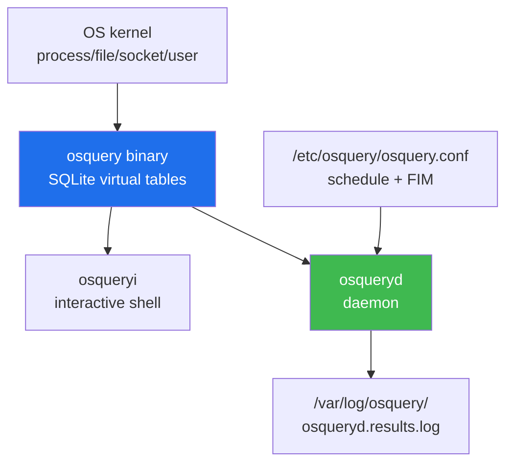

# Week 07 — osquery 호스트 가시화 — "OS as SQL"

> **본 주차의 한 줄 요약**
>
> 6v6 의 **4 호스트 (bastion / fw / ips / web)** 에 설치된 **osquery 5.23.0** 으로 OS 를
> SQL 테이블로 추상화하여 가시화. 158 테이블 (processes / users / file / listening_ports
> / authorized_keys / crontab / suid_bin / file_events / 등) + SQL join + scheduled
> query + FIM (File Integrity Monitoring) + Wazuh agent ship 까지. 학습 마지막에 R/B/P
> (Red 가 의심 process / 새 사용자 / 새 cron entry → Blue 가 osquery 헌팅 → Purple 의
> baseline + scheduled query 자동화) 한 cycle.
>
> **운영자 한 줄 결론**: ps + ss + find + last 의 출력 형식이 모두 다른 시절은 끝났다.
> 1개 SQL 로 OS 의 어떤 정보도 동일 syntax 로 추출. 158 테이블이 그 표면.

---

## 학습 목표

본 주차 종료 시 학생은 다음 9가지를 **본인 손으로** 할 수 있어야 한다.

1. osquery 의 "OS as SQL" 추상화 + 158 테이블 카테고리 (process / user / file /
   network / kernel / package / system) 분류 + 6 핵심 테이블의 사용 시점.
2. **osqueryi** (interactive shell) vs **osqueryd** (daemon — scheduled query) 차이 +
   6v6 의 현재 운영 (osqueryi ad-hoc only, daemon 미운영) 인지.
3. SQL JOIN 패턴 — `processes JOIN listening_ports`, `processes JOIN process_open_sockets`
   3+ 케이스 작성.
4. **헌팅 쿼리 10 패턴 카탈로그** — disk 없는 process / 새 사용자 / cron backdoor /
   authorized_keys 변경 / SUID 새로 / world-writable / hidden directories / 등.
5. **FIM** — `file_paths` + `file_events` 테이블 + `inotify` 기반 실시간 변경 감지 +
   `osquery.conf` 작성.
6. **scheduled query** — osquery.conf 의 schedule (interval / removed / snapshot) +
   결과 log 의 JSON format (`/var/log/osquery/osqueryd.results.log`).
7. osquery vs **sysmon-for-linux** (W11) 비교 — snapshot (osquery) vs event stream
   (sysmon). 두 도구의 보완 관계.
8. Wazuh agent → manager 통합 흐름 (W10) — agent.conf 의 `<localfile>` 로 osquery
   결과 polling + decoder.
9. **R/B/P 시나리오** — Red 가 fake malicious process / 새 cron entry / 새 authorized_keys
   → Blue 가 osquery 의 5 헌팅 쿼리 매치 → Purple 의 scheduled query 자동화 + baseline.

---

## 강의 시간 배분 (3시간 40분)

| 시간      | 내용                                                                  | 유형     |
|-----------|----------------------------------------------------------------------|----------|
| 0:00–0:25 | 이론 — 호스트 가시화의 자리 + osquery 등장 배경 + "OS as SQL"          | 강의     |
| 0:25–0:55 | 이론 — 158 테이블 카테고리 + 6 핵심 테이블 + SQL JOIN                  | 강의     |
| 0:55–1:05 | 휴식                                                                  | —        |
| 1:05–1:30 | 6v6 실측 — 4 호스트 osquery 5.23.0 + osqueryi 패턴                    | 강의/토론|
| 1:30–2:00 | 실습 1, 2 — osqueryi 진입 + 6 테이블 쿼리                              | 실습     |
| 2:00–2:30 | 실습 3, 4 — SQL JOIN + 헌팅 쿼리 5 패턴                                | 실습     |
| 2:30–2:40 | 휴식                                                                  | —        |
| 2:40–3:10 | 실습 5, 6 — FIM 설정 + scheduled query + daemon 시작                   | 실습     |
| 3:10–3:30 | 실습 7 — **R/B/P** + Wazuh ship 검증                                  | 실습     |
| 3:30–3:40 | 정리 + W08 (중간고사) + W09 (Wazuh manager) 예고                       | 정리     |

---

## 0. 용어 해설

| 용어 | 영문 | 뜻 |
|------|------|----|
| **osquery** | — | Facebook (Meta) 의 OS-as-SQL 호스트 가시화 도구 (2014~) |
| **osqueryi** | interactive | 대화형 SQL shell |
| **osqueryd** | daemon | 백그라운드 데몬, scheduled query + extension |
| **osqueryctl** | — | 데몬 management CLI |
| **table** | — | OS 의 한 데이터 영역 (processes, users, files, …) |
| **virtual table** | — | osquery 의 SQLite virtual table (실시간 OS 데이터 추상) |
| **schedule** | — | osquery.conf 의 주기 쿼리 정의 |
| **interval** | — | schedule 의 polling 주기 (초) |
| **snapshot** | — | schedule 의 결과 type (모든 행 vs differential) |
| **differential** | — | schedule 의 결과 type — 변경 (added/removed) 만 |
| **packs** | query packs | 사전 정의 쿼리 묶음 (incident-response, hardware 등) |
| **FIM** | File Integrity Monitoring | inotify 기반 실시간 파일 변경 감지 |
| **file_paths** | — | osquery.conf 의 FIM 대상 경로 그룹 |
| **file_events** | — | FIM 결과 테이블 |
| **inotify** | — | Linux kernel 의 파일 시스템 이벤트 mechanism |
| **eventing** | — | osquery 의 event-based 데이터 수집 (kernel-based) |
| **extension** | — | osquery 의 plugin (Lua / Python / C++) |
| **carve** | — | 파일을 osquery 가 직접 가져옴 (forensics) |
| **on_disk** | — | processes 테이블 컬럼 — binary 가 디스크에 있는지 (malware 탐지) |
| **ATC** | Auto Table Construction | csv/log 를 osquery 테이블로 자동 변환 |

---

## 1. 호스트 가시화의 자리 — Defense in Depth 의 L4

W01 의 4 계층 (Perimeter / Inline Detection / Application / Host) 중 **Host** 가 호스트
가시화의 책임. 다음 시나리오에서 다른 계층은 못 잡는다:

| 시나리오 | fw (W02) | ips (W04) | web (W06) | **host (W07)** |
|----------|----------|-----------|-----------|----------------|
| TCP SYN flood | ✓ |   |   |   |
| XSS / SQLi | (passive) | (passive sniff) | ✓ (block) |   |
| webshell upload + 실행 | (응답 일부만) | (passive) | ✓ (block, paranoia 4+) | ✓ |
| 권한 상승 (SUID) |   |   |   | ✓ |
| 새 SSH key 추가 |   |   |   | ✓ |
| cron backdoor |   |   |   | ✓ |
| disk 없는 process |   |   |   | ✓ |
| /etc/shadow 변경 |   |   |   | ✓ |

호스트 가시화는 **마지막 안전망**. 네트워크 계층이 다 통과한 후 호스트 내부에서 어떤 일이
벌어지는지 추적.

---

## 2. osquery 가 왜 등장했나 — "OS as SQL"

### 2.1 전통 도구의 한계

```bash
ps -ef               # 프로세스
ss -tlnp             # 소켓
last                 # 로그인
find / -newer ...    # 파일
dmesg / journalctl   # 커널 / 서비스
cat /etc/passwd      # 사용자
```

각 도구의 출력 형식이 다르고, OS / distro 마다 미묘한 차이. 자동화 + 헌팅 도구로 통합
어려움.

### 2.2 osquery 의 통찰 — 모든 정보를 SQL 테이블로

```sql
SELECT pid, name, on_disk FROM processes WHERE on_disk = 0;
-- 디스크에 없는 process (메모리에만 존재) = malware 의심
```

한 번 SQL 익히면 OS 의 어떤 정보도 동일 syntax 로 추출. JOIN / WHERE / GROUP BY / 등
SQL 의 모든 표현력 활용.

### 2.3 등장 + 성장

- 2014 — Facebook 출시 (BSD 라이선스)
- 2016 — Linux Foundation 산하로 이관
- 2024 — 5.x 안정, Meta + Linux Foundation 공동 운영
- 2026 — 6v6 사용 버전: **5.23.0**

---

## 3. osquery 의 핵심 컴포넌트



| 컴포넌트 | 역할 |
|---------|------|
| `osqueryi` | 대화형 SQL shell (학습 / ad-hoc 헌팅) |
| `osqueryd` | daemon — 주기적 scheduled query 실행 + log |
| `osqueryctl` | daemon management |
| `/etc/osquery/osquery.conf` | 설정 (schedule, FIM, packs) |
| `/var/log/osquery/osqueryd.results.log` | scheduled query 결과 (JSON 라인) |
| `/var/log/osquery/osqueryd.snapshots.log` | snapshot 결과 |

### 3.1 6v6 의 현재 운영 — osqueryi only

6v6 의 4 호스트 (bastion / fw / ips / web) 의 osquery 운영 상태 (실측 2026-05-12):
- osquery **5.23.0** 4 호스트 모두 설치 ✓
- `osqueryi` 가 ad-hoc 쿼리 도구로만 사용
- **`osqueryd` daemon 미운영** — 스케줄 쿼리 없음
- `/etc/osquery/osquery.conf` **미존재** — 설정 없음
- 158 테이블 사용 가능

운영 함의:
- 학생은 본 주차에 `osqueryi` 로 ad-hoc 헌팅 익숙해짐
- W10 학습 시 osqueryd + scheduled query + Wazuh agent ship 본격 적용
- 6v6 의 osquery 운영 패치 (별 PR) — W10 의 작업 일부

---

## 4. 158 테이블 카테고리 — 6v6 실측

`osqueryi ".tables"` 출력 (158 라인):

### 4.1 8 카테고리 분류

| 카테고리 | 대표 테이블 | 예 |
|----------|-------------|-----|
| **Process** | processes / process_open_sockets / process_open_files | 활성 프로세스 + 소켓 |
| **User / Authn** | users / shadow / authorized_keys / sudoers / known_hosts | 사용자 + 인증 |
| **File / FIM** | file / file_events / hash | 파일 메타 + FIM |
| **Network** | listening_ports / interface_addresses / routes / arp_cache | 소켓 + ifconfig |
| **System** | os_version / kernel_info / system_info / uptime | OS 정보 |
| **Package** | apt_sources / deb_packages / rpm_packages / pip_packages | 설치된 패키지 |
| **Scheduled / Cron** | crontab / startup_items | 스케줄 + autostart |
| **Eventing** | bpf_process_events / bpf_socket_events / file_events | 실시간 events |

### 4.2 6 핵심 테이블 — 운영 인수 시 가장 자주 쓰는

#### `processes` — 실행 중 프로세스

```sql
SELECT pid, parent, name, path, cmdline, uid, on_disk, start_time
FROM processes
WHERE name LIKE '%suricata%';
```

운영 핵심 컬럼:
- `pid` / `parent` : 프로세스 ID / 부모 (process tree 추적)
- `name` / `path` : 이름 / binary 경로
- `cmdline` : 전체 명령행 (argv)
- `uid` / `gid` : 실행 사용자
- **`on_disk`** : 1=disk 에 binary 있음 / 0=메모리만 (malware 의심)
- `start_time` : 시작 epoch

#### `users` — 시스템 사용자

```sql
SELECT username, uid, gid, shell, directory
FROM users
WHERE uid >= 1000;
```

uid >= 1000 = 일반 사용자 (system account 제외).

#### `file` — 파일 메타데이터

```sql
SELECT path, mode, uid, gid, mtime, size
FROM file
WHERE path = '/etc/passwd';

-- glob 으로 디렉토리 검색
SELECT path, mode, mtime
FROM file
WHERE path LIKE '/etc/cron.d/%%';
```

`%%` (double-percent) = osquery 의 glob (recursive). 단순 `%` 는 SQL LIKE.

#### `listening_ports` / `process_open_sockets` — 소켓

```sql
SELECT l.port, l.protocol, l.address, p.name, p.pid
FROM listening_ports l
JOIN processes p ON l.pid = p.pid
WHERE l.port < 1024;
```

JOIN 으로 port 가 어느 process 인지 식별.

#### `kernel_info` — 커널 정보

```sql
SELECT version, arch, path FROM kernel_info;
```

#### `authorized_keys` — SSH 키

```sql
SELECT * FROM users JOIN authorized_keys USING (uid);
```

비인가 SSH 키 헌팅의 핵심.

---

## 5. SQL JOIN 패턴 — 운영에 자주 쓰는 3 케이스

### 5.1 processes + listening_ports — port 가 어느 process 인가

```sql
SELECT
    l.port, l.protocol, l.address,
    p.pid, p.name, p.path, p.cmdline
FROM listening_ports l
JOIN processes p ON l.pid = p.pid
WHERE l.address NOT IN ('127.0.0.1', '::1');
```

외부 노출 port 의 process 식별. 비인가 listener (예: rogue web shell on port 8000)
즉시 발견.

### 5.2 processes + process_open_sockets — outbound 연결

```sql
SELECT
    p.name, p.pid, p.cmdline,
    s.remote_address, s.remote_port, s.state
FROM process_open_sockets s
JOIN processes p ON s.pid = p.pid
WHERE s.remote_port = 443
  AND s.remote_address NOT LIKE '10.%'
  AND s.remote_address NOT LIKE '192.168.%';
```

외부 (private subnet 외) 443 으로 outbound — C2 callback 헌팅.

### 5.3 users + authorized_keys — SSH 신뢰 매트릭스

```sql
SELECT
    u.username, u.uid, u.directory,
    a.key, a.key_type
FROM users u
JOIN authorized_keys a USING (uid);
```

어느 user 가 어떤 SSH key 를 신뢰하는지 매트릭스. 새로 추가된 key 추적의 baseline.

---

## 6. 헌팅 쿼리 10 패턴 카탈로그

운영자 자주 쓰는 핵심 헌팅 쿼리:

### 6.1 disk 없는 process (malware 의심)

```sql
SELECT pid, name, path, cmdline FROM processes WHERE on_disk = 0;
```

binary 가 삭제됐는데 메모리에서 실행 중 = fileless malware.

### 6.2 cmdline 에 base64 / wget / curl 포함

```sql
SELECT pid, name, cmdline FROM processes
WHERE cmdline LIKE '%base64%'
   OR cmdline LIKE '%wget%'
   OR cmdline LIKE '%curl%';
```

post-exploit downloader / encoded payload 헌팅.

### 6.3 SUID binary 변경 / 추가

```sql
SELECT path, mode FROM suid_bin WHERE mode LIKE '%4%';
```

권한 상승 도구 (예: backdoor SUID shell).

### 6.4 새 사용자 추가 (uid >= 1000)

```sql
SELECT username, uid, shell, directory FROM users WHERE uid >= 1000;
```

baseline 과 diff — 새 사용자 발견.

### 6.5 비표준 shell

```sql
SELECT username, shell FROM users
WHERE shell NOT IN ('/bin/bash', '/bin/sh', '/sbin/nologin', '/usr/sbin/nologin', '/bin/false');
```

비표준 shell 사용 — bypass 도구 의심.

### 6.6 cron entry 변경 — backdoor

```sql
SELECT * FROM crontab;
```

`/etc/crontab` + `/etc/cron.d/*` + user crontab — 모든 cron entry.

### 6.7 외부 IP 로의 outbound 443 (C2 callback)

```sql
SELECT p.name, s.remote_address, s.remote_port
FROM process_open_sockets s JOIN processes p ON s.pid = p.pid
WHERE s.remote_port IN (443, 8080)
  AND s.remote_address NOT LIKE '10.%'
  AND s.remote_address NOT LIKE '192.168.%';
```

### 6.8 world-writable 파일 (system dir)

```sql
SELECT path, mode FROM file
WHERE path LIKE '/etc/%%' AND mode LIKE '%7';
```

권한 상승 잠재 — system 디렉토리의 world-writable.

### 6.9 hidden directories in /

```sql
SELECT path FROM file WHERE path LIKE '/.%';
```

`/.hidden` 등 root 의 hidden directory.

### 6.10 chrome 확장 (browser hijack 시) — 데스크톱 환경

```sql
SELECT name, version, identifier FROM chrome_extensions;
```

데스크톱 환경 한정. 6v6 의 컨테이너에는 chrome 없음 → empty.

---

## 7. FIM (File Integrity Monitoring) — `file_events`

### 7.1 동작 원리

osquery 의 FIM 은 Linux **inotify** 기반. 다음 흐름:


### 7.2 osquery.conf 설정

```json
{
  "file_paths": {
    "system_etc": [
      "/etc/passwd",
      "/etc/shadow",
      "/etc/sudoers",
      "/etc/sudoers.d/%%"
    ],
    "ssh_keys": [
      "/root/.ssh/%%",
      "/home/%/.ssh/%%"
    ],
    "cron_paths": [
      "/etc/crontab",
      "/etc/cron.d/%%",
      "/var/spool/cron/%%"
    ],
    "web_root": [
      "/var/www/landing/%%"
    ]
  },

  "schedule": {
    "file_changes": {
      "query": "SELECT * FROM file_events WHERE category IN ('system_etc','ssh_keys','cron_paths','web_root');",
      "interval": 60,
      "removed": false
    }
  }
}
```

해석:
- `file_paths` : 감시 대상 path 그룹 (category 별)
- `%%` : recursive glob (모든 하위)
- `schedule.file_changes` : 60초마다 file_events 의 새 row 출력 (`removed: false` = differential)

### 7.3 검증

```bash
# 1. 변경 발생
sudo touch /etc/sudoers.d/test_w07
sudo rm /etc/sudoers.d/test_w07

# 2. 60초+ 대기 후 log 확인
sudo tail /var/log/osquery/osqueryd.results.log | jq .
```

JSON log 의 `columns.action` (CREATED / UPDATED / DELETED) + `columns.target_path` 가
변경 흔적.

---

## 8. scheduled query + osquery.conf 의 schedule:

### 8.1 schedule 의 구조

```json
{
  "schedule": {
    "process_snapshot": {
      "query": "SELECT pid, name, path, on_disk FROM processes;",
      "interval": 300,
      "snapshot": true
    },
    "new_users": {
      "query": "SELECT username, uid, shell FROM users WHERE uid >= 1000;",
      "interval": 600,
      "removed": false
    },
    "listening_ports": {
      "query": "SELECT port, address, pid FROM listening_ports;",
      "interval": 60
    }
  }
}
```

옵션:
- `interval` (sec) : polling 주기
- `snapshot` : true = 모든 row, false = differential (added / removed)
- `removed` : false = added 만, true = added + removed

### 8.2 log format — JSON line

```
/var/log/osquery/osqueryd.results.log
─────────────────────────────────────
{"name":"new_users","hostIdentifier":"web","calendarTime":"...","action":"added","columns":{"username":"newuser","uid":"1001",...}}
{"name":"listening_ports","hostIdentifier":"web","action":"snapshot","snapshot":[{"port":"80",...},...]}
```

각 라인 = 한 query 결과. `action`:
- `added` : new row (differential)
- `removed` : row 사라짐 (differential, `removed: true` 시만)
- `snapshot` : 전체 결과 (snapshot: true)

### 8.3 packs — 사전 정의 쿼리 묶음

```
/usr/share/osquery/packs/
├── incident-response.conf       ← 침해 사고 대응 쿼리
├── it-compliance.conf           ← IT 컴플라이언스
├── hardware-monitoring.conf     ← H/W 상태
├── osquery-monitoring.conf      ← osquery self
├── osx-attacks.conf             ← macOS 특정
└── vuln-management.conf         ← 취약점 관리
```

osquery.conf 의 `"packs": ["incident-response"]` 로 활성.

---

## 9. osquery vs sysmon-for-linux (W11 비교)

| 측면 | osquery | sysmon-for-linux |
|------|---------|-------------------|
| 모델 | **snapshot** (시점) | **event stream** (실시간) |
| query | SQL (interactive) | XML config + auditd |
| 데이터 source | 158 테이블 (대부분 OS read) | eBPF + auditd 이벤트 |
| schedule | osquery.conf 의 schedule | 항상 실시간 stream |
| FIM | file_events (inotify) | sysmon FileCreate event |
| 강점 | flexible query / 명료한 SQL | low-latency event / process tree |
| 약점 | event 지연 (interval) | XML config 복잡 / 학습 곡선 |

**보완 관계**: osquery 는 baseline 헌팅 + ad-hoc, sysmon-for-linux 는 실시간 alert.
production 양쪽 동시 운영 권장.

---

## 10. 트러블슈팅 — osquery 운영 4 패턴

### 10.1 패턴 1 — 'no such column' 오류

증상: `SELECT name FROM osquery_info` 실행 시 `Error: no such column: name`.

원인: 테이블 schema 가 사용자 예상과 다름. `osqueryi ".schema processes"` 로 정확한
컬럼 확인 필요.

해결:
```bash
osqueryi
osquery> .schema processes
osquery> SELECT * FROM osquery_info LIMIT 1;     # 모든 컬럼 + 1 row
```

### 10.2 패턴 2 — daemon 안 떠 있음 (6v6 현재 상태)

증상: scheduled query 결과 없음. /var/log/osquery/ 비어 있음.

진단:
```bash
sudo systemctl status osqueryd
sudo ps -ef | grep osqueryd | grep -v grep
ls /etc/osquery/
```

해결:
```bash
# osquery.conf 작성
sudo systemctl enable --now osqueryd
sudo systemctl status osqueryd
```

### 10.3 패턴 3 — FIM 가 동작 안 함

증상: `/etc/passwd` 변경했지만 file_events 비어 있음.

원인:
1. `file_paths` 정의 안 됨 (osquery.conf)
2. `osquery.conf` 의 syntax error
3. daemon 재시작 안 됨
4. inotify limit 초과 (`max_user_watches`)

진단:
```bash
sudo osqueryctl config-check
cat /proc/sys/fs/inotify/max_user_watches
sudo journalctl -u osqueryd --since "5 min ago"
```

### 10.4 패턴 4 — query 성능 (대규모 host)

증상: `SELECT * FROM file WHERE path LIKE '/var/%%'` 가 OOM 또는 timeout.

원인: glob 이 너무 광범위 → 수십만 row.

해결:
- 좁은 path
- LIMIT
- WHERE 조건 추가

---

## 11. 6v6 의 4 호스트 osquery 적용 매트릭스

| 호스트 | 역할 | 헌팅 활용 |
|--------|------|-----------|
| **bastion** | SSH jump + Bastion API | login history, authorized_keys, sudoers |
| **fw** | nftables + HAProxy | nft rule 변경, haproxy.cfg 변경, process |
| **ips** | Suricata | suricata daemon 상태, suricata.yaml 변경, eve.json size |
| **web** | Apache + ModSec | apache config 변경, modsec_audit.log size, vhost |

### 11.1 호스트 별 핵심 쿼리

**bastion**:
```sql
-- 새 SSH key 추가 헌팅
SELECT u.username, a.key_type, a.key
FROM users u JOIN authorized_keys a USING (uid);
```

**fw**:
```sql
-- nftables process + HAProxy process
SELECT pid, name, cmdline FROM processes
WHERE name IN ('haproxy', 'nft', 'iptables');
```

**ips**:
```sql
-- Suricata 가 정상 running
SELECT pid, name, cmdline FROM processes WHERE name = 'Suricata-Main';
SELECT * FROM uptime;
```

**web**:
```sql
-- Apache vhost config 파일 + 변경 시각
SELECT path, mtime FROM file
WHERE path LIKE '/etc/apache2/sites-enabled/%';
```

---

## 12. Wazuh agent → manager 통합 (W10 예고)

```yaml
# /var/ossec/etc/ossec.conf
<localfile>
  <log_format>json</log_format>
  <location>/var/log/osquery/osqueryd.results.log</location>
</localfile>
```

Wazuh agent 가 osqueryd.results.log 의 JSON 라인을 manager 로 ship. W10 에서 decoder
+ dashboard panel 본격 통합.

---

## 13. 사례 분석

### 13.1 ISMS-P 매핑

| Sub-control | 본 주차 활동 |
|-------------|-------------|
| 2.9.3 (서버 변경 관리) | FIM + file_events |
| 2.10.5 (운영시스템 패치) | apt_sources + package version 추적 |
| 2.5.4 (사용자 등록 변경) | users + authorized_keys 변경 추적 |

### 13.2 NIST CSF — DE.CM (Continuous Monitoring)

osquery 의 scheduled query 가 DE.CM-7 (외부 service provider 모니터링) + DE.AE-3
(event correlation) 의 표준 구현.

### 13.3 KISA — 한국 금융권 침해 사례

KISA 2024 보고서: APT 의 lateral movement 시 새 사용자 추가 + SSH key 배포 + cron
backdoor. osquery 의 3 헌팅 (users / authorized_keys / crontab) 으로 즉시 검출.

### 13.4 운영 사고 3 사례

**사례 1 — disk 없는 process 미감지 (osquery 무 운영)**:
```
운영자: 평소 ps -ef 만 사용 → fileless malware (binary 삭제 + 메모리 실행) 미감지
교훈: osquery on_disk=0 헌팅이 baseline 점검 항목이 되어야
```

**사례 2 — 새 SSH key silent 추가**:
```
APT: 침해 후 /root/.ssh/authorized_keys 에 새 key 추가 → 영구 재진입
교훈: authorized_keys FIM + baseline diff scheduled query
```

**사례 3 — osquery 의 scheduled interval 너무 길음**:
```
운영자: interval 600 (10분) → fileless malware 가 10분 안 짧게 동작 후 사라짐 → 미감지
교훈: 중요 쿼리는 interval 60 이하, network connect / process create 는 eventing
```

---

## 14. 실습 시나리오 (4 축)

### 실습 1 — osqueryi 진입 + version + 158 테이블 (10분)

```bash
ssh 6v6-web 'sudo osqueryi --json "SELECT version, build_distro FROM osquery_info LIMIT 1;"'
ssh 6v6-web 'sudo osqueryi ".tables" 2>&1 | wc -l'
ssh 6v6-fw 'sudo osqueryi --json "SELECT version FROM kernel_info;"'
```

### 실습 2 — 6 핵심 테이블 (15분)

```bash
ssh 6v6-web 'sudo osqueryi --json "SELECT pid, name FROM processes ORDER BY pid DESC LIMIT 5;"'
ssh 6v6-bastion 'sudo osqueryi --json "SELECT username, uid, shell FROM users WHERE uid >= 1000;"'
ssh 6v6-fw 'sudo osqueryi --json "SELECT port, address, pid FROM listening_ports WHERE address NOT LIKE \"127.%\";"'
ssh 6v6-web 'sudo osqueryi --json "SELECT path, mtime FROM file WHERE path = \"/etc/passwd\";"'
```

### 실습 3 — SQL JOIN 패턴 (15분)

§5 의 3 JOIN 케이스.

### 실습 4 — 헌팅 쿼리 5 (15분)

§6 의 6.1 / 6.4 / 6.5 / 6.6 / 6.7 5 패턴.

### 실습 5 — FIM 설정 + 검증 (20분)

§7 의 osquery.conf 작성 + daemon 시작 + 변경 트리거 + log 확인.

### 실습 6 — Wazuh ship 검증 (10분)

```bash
ssh 6v6-web 'sudo grep -A3 "osquery" /var/ossec/etc/ossec.conf'
```

### 실습 7 — **R/B/P** (Red 가 새 사용자 / cron / authorized_keys 추가 → Blue 헌팅)

§16 참조.

---

## 15. 과제

### A. 헌팅 쿼리 10 작성 (필수, 50점)

본 4 호스트 환경에 적합한 10 헌팅 쿼리 작성 + 각 쿼리의 의도 + 결과 + 발견된 anomaly
(있다면).

### B. FIM 설정 + 검증 (심화, 30점)

bastion 의 `/root` + web 의 `/etc/apache2/sites-enabled/` + fw 의 `/etc/nftables.conf`
3 경로의 FIM 작성 + osquery.conf patch + 실 변경 트리거 + file_events log 확인.

### C. R/B/P 보고서 (정성, 20점)

실습 7 의 결과 + 5 헌팅 쿼리 의 매치 결과 + baseline 비교 + scheduled query
자동화 권장.

---

## 16. **R/B/P** 통합 — Red 가 호스트 침해 시뮬 → Blue 헌팅 → Purple 자동화


**Red — 호스트 침해 시뮬 (학습용, 빠른 cleanup)**:
```bash
# 1. 새 사용자 추가
ssh 6v6-web 'sudo useradd -m -s /bin/bash -u 1099 fakeintruder' 2>/dev/null

# 2. authorized_keys 추가
ssh 6v6-web 'echo "ssh-rsa AAAAB3FAKEKEY fakeintruder@evil" | sudo tee -a /root/.ssh/authorized_keys'

# 3. cron entry 추가
ssh 6v6-web 'echo "* * * * * root /tmp/backdoor.sh" | sudo tee /etc/cron.d/w07_backdoor'
```

**Blue — osquery 헌팅 5 쿼리**:
```bash
# 1. 새 사용자
ssh 6v6-web 'sudo osqueryi --json "SELECT username, uid FROM users WHERE uid = 1099;"'

# 2. 새 authorized_keys
ssh 6v6-web 'sudo osqueryi --json "SELECT * FROM authorized_keys WHERE key LIKE \"%FAKEKEY%\";"'

# 3. 새 cron
ssh 6v6-web 'sudo osqueryi --json "SELECT * FROM crontab WHERE path = \"/etc/cron.d/w07_backdoor\";"'

# 4. 의심 process (있다면)
ssh 6v6-web 'sudo osqueryi --json "SELECT pid, name, cmdline FROM processes WHERE cmdline LIKE \"%backdoor%\";"'

# 5. SUID / world-writable 변경 (없을 것)
ssh 6v6-web 'sudo osqueryi --json "SELECT path FROM suid_bin WHERE path LIKE \"%intruder%\";"'
```

**Purple — scheduled query 자동화**:
```json
{
  "schedule": {
    "new_users_hourly": {
      "query": "SELECT username, uid, shell FROM users WHERE uid >= 1000;",
      "interval": 3600,
      "removed": false
    },
    "ssh_keys_change": {
      "query": "SELECT * FROM users JOIN authorized_keys USING (uid);",
      "interval": 600,
      "removed": false
    },
    "cron_changes": {
      "query": "SELECT * FROM crontab;",
      "interval": 600
    }
  }
}
```

**Cleanup (실험 종료)**:
```bash
ssh 6v6-web 'sudo userdel -r fakeintruder' 2>/dev/null
ssh 6v6-web 'sudo sed -i "/FAKEKEY/d" /root/.ssh/authorized_keys'
ssh 6v6-web 'sudo rm -f /etc/cron.d/w07_backdoor'
```

---

## 17. 평가 기준

| 항목 | 비중 |
|------|------|
| 헌팅 쿼리 10 (A) | 50% |
| FIM 설정 (B) | 30% |
| R/B/P (C) | 20% |

---

## 18. 핵심 정리 (8 줄)

1. **호스트 가시화 = Defense in Depth L4** — 마지막 안전망
2. **osquery 5.23.0** — 4 호스트 (bastion/fw/ips/web), 158 테이블, 6 핵심 (processes / users / file / listening_ports / authorized_keys / crontab)
3. **osqueryi (ad-hoc) vs osqueryd (scheduled)** — 6v6 현재 osqueryi only, W10 의 daemon 본격
4. **SQL JOIN** — processes + listening_ports + process_open_sockets + authorized_keys
5. **헌팅 10 패턴** — on_disk=0 / 새 user / SSH key / cron / 비표준 shell / 외부 outbound 443 / world-writable / hidden / chrome ext / SUID
6. **FIM = inotify + file_paths + file_events** — osquery.conf 설정 + scheduled query
7. **osquery vs sysmon-for-linux** — snapshot vs event stream. 보완 관계
8. **R/B/P** — Red 의 새 user/key/cron → Blue 5 헌팅 매치 → Purple 의 scheduled 자동화

---

## 19. 다음 주차 (W08 중간고사) + W09-11 (Wazuh + sysmon) 예고

- **W08 중간고사**: W01-W07 통합 — fw / ips / web / host 4 도구 + R/B/P
- **W09**: Wazuh manager 도입 + agent 등록 + 11 daemon
- **W10**: dashboard + osquery + ModSec audit 통합 + sysmon 1차
- **W11**: sysmon-for-linux 본격 + osquery 와 비교 + event-driven 헌팅

---

## 부록 A — osqueryi 명령 cheat sheet

```sql
.help                   -- 도움말
.tables                 -- 158 테이블 목록
.schema processes       -- 테이블 스키마
.mode line              -- 출력 format (line / column / json / csv)
.timer ON               -- 쿼리 시간 측정
.quit                   -- 종료

-- 자주 쓰는 쿼리 형식
SELECT * FROM <table> LIMIT 5;
SELECT * FROM <table> WHERE <column> LIKE '%pattern%';
SELECT count(*) FROM <table>;
SELECT t1.x, t2.y FROM t1 JOIN t2 ON t1.id = t2.id;
```

## 부록 B — osquery.conf production 권장값

```json
{
  "options": {
    "logger_path": "/var/log/osquery",
    "schedule_splay_percent": "10",
    "host_identifier": "hostname"
  },
  "file_paths": { ... },
  "schedule": {
    "process_snapshot": {"query":"...","interval":60,"snapshot":true},
    "new_users": {"query":"...","interval":600,"removed":false},
    "ssh_keys_change": {"query":"...","interval":600,"removed":false},
    "cron_changes": {"query":"...","interval":600},
    "listening_ports": {"query":"...","interval":60},
    "file_changes": {"query":"...","interval":60}
  },
  "packs": ["incident-response", "vuln-management"]
}
```

## 부록 C — osquery 트러블슈팅 4 패턴 ↔ 진단 명령

```
패턴 1 (no such column) → osqueryi ".schema <table>" 로 schema 확인
패턴 2 (daemon down) → systemctl status osqueryd + journalctl -u osqueryd
패턴 3 (FIM 미동작) → osqueryctl config-check + cat /proc/sys/fs/inotify/max_user_watches
패턴 4 (query 성능) → LIMIT + 좁은 path + WHERE 조건
```
