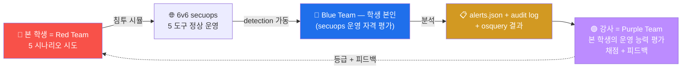

# Week 08 — 중간고사 — 보안 솔루션 + 호스트 가시화 종합 실기 (90분)

> W01-W07 secuops 의 종합 평가. 5종 보안 솔루션 (방화벽 nftables / IDS Suricata /
> WAF ModSec / SIEM Wazuh manager / 호스트 가시화 osquery) 운영 능력 평가. 90분
> 시험 + 5 시나리오 × 20점 = 100점. 본 시험 통과 시 W09 (Wazuh 본격) 진입.

## 1. 시험 개요

### 1.1 형식

```
시간: 90분 (5분 전 카운트다운)
시나리오: 5 (각 20점, 총 100점)
도구: 6v6 의 모든 secuops 도구 + 본인 PC + 인터넷 검색 허용
RoE: 6v6 환경만, AI 어시스턴트 금지, 다른 학생과 communication 금지
산출물: 1 페이지 PDF (명령 + 출력 + 분석)
```

### 1.2 시험 환경

```
대상: 6v6 환경의 4 호스트 (fw / ips / web / siem) + osquery 4 호스트
도구: bastion ProxyJump 통한 ssh 접근
시간: 본인 PC 에서 단독 진행 (시험관 monitoring)
```

### 1.3 시험 규칙

```
✅ 허용:
  - W01-W07 lecture md + lab yaml 자료
  - 인터넷 검색 (man page / OWASP / Wazuh 문서)
  - 본인 메모
  - 매 시나리오 별 변경 즉시 cleanup

❌ 금지:
  - 다른 학생과 communication
  - AI 어시스턴트 (ChatGPT / Claude / Copilot)
  - 다른 학생의 secuops 환경 변경
  - 시험 종료 후 cleanup 미완 (룰 / 파일 / agent 등)
```

---

## 2. 5 시나리오 상세

### 2.1 시나리오 1 (20점) — fw nftables 정책 (W02-W03 학습)

#### 문제

> 6v6-fw 의 inet six_filter input chain 의 가장 위 (position 0) 에 다음 룰을 추가:
> "attacker (10.20.30.202) 의 80/tcp 접근만 drop, 다른 src 는 정상 통과."
> 검증 후 룰 삭제 + 정상화.

#### 평가 항목

```
5점: 룰 추가 정확도 (정확한 inet six_filter input chain + position 0)
5점: 검증 출력 (attacker timeout 000 + 다른 host 200)
5점: counter packets > 0 + handle 식별
5점: 룰 삭제 + 정상화 검증 (attacker 200 복귀)
```

#### 실행 예

```bash
# 1. 룰 추가
ssh 6v6-fw 'sudo nft insert rule inet six_filter input \
    position 0 \
    ip saddr 10.20.30.202 tcp dport 80 \
    counter drop'

# 2. attacker 검증 (timeout 예상)
ssh 6v6-attacker 'timeout 4 curl -s -o /dev/null -w "%{http_code}\n" \
    -H "Host: juice.6v6.lab" http://10.20.30.1/'

# 3. 다른 host (web) 검증
ssh 6v6-web 'curl -s -o /dev/null -w "%{http_code}\n" \
    -H "Host: juice.6v6.lab" http://10.20.30.1/' || true

# 4. counter 검증
ssh 6v6-fw 'sudo nft list chain inet six_filter input | grep 10.20.30.202'

# 5. 룰 삭제 (handle 식별 후)
HANDLE=$(ssh 6v6-fw 'sudo nft -a list chain inet six_filter input | \
    grep "10.20.30.202" | grep -oE "handle [0-9]+" | head -1 | awk "{print \$2}"')
ssh 6v6-fw "sudo nft delete rule inet six_filter input handle $HANDLE"

# 6. 정상화 검증
ssh 6v6-attacker 'curl -s -o /dev/null -w "%{http_code}\n" \
    -H "Host: juice.6v6.lab" http://10.20.30.1/'
```

### 2.2 시나리오 2 (20점) — Suricata 룰 작성 (W04-W05 학습)

#### 문제

> 6v6-ips 의 local.rules 에 다음 alert 룰 추가:
> "HTTP URI 에 `' OR '1'='1` SQLi 패턴이 포함된 요청 매치. sid 9008001, classtype
> web-application-attack, threshold limit by_src 60초 1번."
> 트리거 + eve.json 검증.

#### 평가 항목

```
5점: 룰 syntax 정확 + reload-rules OK
5점: 트리거 성공 (alert 발생)
5점: 정확한 sid + classtype + threshold
5점: cleanup (룰 삭제 + 재 트리거 시 alert 미발생 검증)
```

#### 실행 예

```bash
# 1. 룰 추가
ssh 6v6-ips 'echo "alert http any any -> any any (msg:\"SQLi tautology\"; \
    http.uri; pcre:\"/'\''\\s*OR\\s*'\''1'\''='\''1/i\"; \
    threshold:type limit, track by_src, count 1, seconds 60; \
    classtype:web-application-attack; sid:9008001; rev:1;)" \
    | sudo tee -a /etc/suricata/rules/local.rules'

# 2. reload
ssh 6v6-ips 'sudo suricatasc -c reload-rules'

# 3. 트리거
sleep 2
ssh 6v6-attacker "curl -s -o /dev/null -H 'Host: juice.6v6.lab' \
    \"http://10.20.30.1/?q=1' OR '1'='1\""

sleep 4

# 4. alert 검증
ssh 6v6-ips 'sudo grep "sid.:9008001" /var/log/suricata/eve.json | \
    tail -1 | jq .alert'

# 5. cleanup
ssh 6v6-ips 'sudo sed -i "/sid:9008001/d" /etc/suricata/rules/local.rules'
ssh 6v6-ips 'sudo suricatasc -c reload-rules'
```

### 2.3 시나리오 3 (20점) — ModSecurity 공격 시뮬 (W06 학습)

#### 문제

> 6v6-attacker 에서 3 가지 공격 (XSS / SQLi / LFI) 페이로드 발송:
> - XSS: `<script>alert(1)</script>` to juice.6v6.lab
> - SQLi: `1' OR '1'='1` to dvwa.6v6.lab
> - LFI: `../../../etc/passwd` to govportal.6v6.lab
> 각 응답 코드 + audit log 의 매치 룰 ID 추출.

#### 평가 항목

```
5점: 3 페이로드 작성 정확
5점: 3 차단 모두 403
5점: 매치 룰 ID 정확 추출 (941xxx / 942xxx / 930xxx)
5점: audit log jq 분석 (transaction.messages[].id)
```

#### 실행 예

```bash
# 1. XSS
ssh 6v6-attacker "curl -s -o /dev/null -w 'XSS: %{http_code}\n' \
    -H 'Host: juice.6v6.lab' \
    'http://10.20.30.1/?q=<script>alert(1)</script>'"

# 2. SQLi
ssh 6v6-attacker "curl -s -o /dev/null -w 'SQLi: %{http_code}\n' \
    -H 'Host: dvwa.6v6.lab' \
    \"http://10.20.30.1/?q=1' OR '1'='1\""

# 3. LFI
ssh 6v6-attacker "curl -s -o /dev/null -w 'LFI: %{http_code}\n' \
    -H 'Host: govportal.6v6.lab' \
    'http://10.20.30.1/?file=../../../etc/passwd'"

sleep 2

# 4. audit log 매치 룰 추출
ssh 6v6-web 'sudo tail -3 /var/log/apache2/modsec_audit.log | head -1 | \
    jq -r ".transaction.messages[].id" | sort -u | head'

# 예상 출력:
#   941100  (XSS)
#   942100  (SQLi)
#   930100  (LFI)
#   949110  (anomaly threshold)
```

### 2.4 시나리오 4 (20점) — osquery 헌팅 (W07 학습)

#### 문제

> 6v6-web 에서 다음 4 헌팅 쿼리 SQL 작성 + 실행:
> 1. `on_disk = 0` 인 process
> 2. uid >= 1000 인 사용자
> 3. listening_ports + processes JOIN → 22/80/443 매핑
> 4. SUID binary 중 path 가 /usr/bin 이 아닌 것

#### 평가 항목

```
5점: 4 SQL syntax 정확
5점: 결과 정확 (baseline 매치)
5점: JOIN 쿼리 정확
5점: 분석 (정상 baseline vs 의심 판단)
```

#### 실행 예

```bash
# 1. on_disk = 0 (fileless malware 의심)
ssh 6v6-web 'sudo osqueryi --json \
    "SELECT pid, name, path FROM processes WHERE on_disk = 0;"'
# 정상 baseline: [] (빈 결과)

# 2. uid >= 1000 사용자
ssh 6v6-web 'sudo osqueryi --json \
    "SELECT username, uid, shell, directory FROM users WHERE uid >= 1000;"'
# 정상: ccc / 학습 환경의 사용자만

# 3. listening_ports + processes JOIN
ssh 6v6-web 'sudo osqueryi --json \
    "SELECT l.port, l.address, p.name, p.pid \
     FROM listening_ports l \
     JOIN processes p ON l.pid = p.pid \
     WHERE l.port IN (22, 80, 443);"'
# 정상: 22 sshd, 80 apache2, 443 apache2

# 4. SUID 비-표준
ssh 6v6-web "sudo osqueryi --json \
    \"SELECT path FROM suid_bin WHERE path NOT LIKE '/usr/bin/%';\""
# 정상: 비표준 SUID 가 있다면 의심
```

#### 분석 보고서

```markdown
## osquery 헌팅 분석

### 정상 baseline
- on_disk=0 process: 0 건 (정상)
- uid >= 1000 사용자: ccc 1 명 (학습 환경 정상)
- listening_ports: 22 (sshd), 80 (apache2), 443 (apache2)
- SUID 비-표준: 없음 (또는 /opt 등의 학습 환경 의도된 SUID)

### 의심 시 시나리오
- on_disk=0 process 발견 시 → fileless malware 가능성, 즉시 격리
- 알 수 없는 uid 1099 등 → backdoor account
- 비정상 listening port (예: 4444) → C2 channel
- /tmp/ 의 SUID → 권한 상승 도구
```

### 2.5 시나리오 5 (20점) — 통합 침해 분석 (전 주차 종합)

#### 문제

> 다음 침해 시나리오의 detection 도구 + 분석 순서 작성:
>
> "attacker (10.20.30.202) 에서 sqlmap (User-Agent: sqlmap) 으로 juice.6v6.lab 의
>  /search endpoint 에 UNION SELECT 페이로드 발송 → ModSec 차단 → 그래도 4번 추가
>  reconnaissance 시도 → Suricata 알람 → 운영자 인지"

#### 평가 항목

```
5점: fw / ips / web / Wazuh manager 각 도구의 로그·alert 위치 정확
5점: 명령 syntax 정확 (jq / grep / sudo 등)
5점: timeline 의 순서 (Suricata flow → http → alert / ModSec audit / Wazuh alert)
5점: 운영자 조치 권장 (rate-limit / IP block / 추가 모니터링)
```

#### 시뮬 실행 + 분석

```bash
# 1. 침해 시뮬 — sqlmap 4 시도
ssh 6v6-attacker '
for i in 1 2 3 4; do
    curl -s -o /dev/null \
        -A "sqlmap/1.5" \
        -H "Host: juice.6v6.lab" \
        "http://10.20.30.1/?q=1+UNION+SELECT+user,pass+FROM+users--"
    sleep 1
done'
sleep 3

# 2. fw 측 — HAProxy log
echo "=== fw HAProxy log ==="
ssh 6v6-fw 'sudo tail -10 /var/log/haproxy.log 2>/dev/null | grep "10.20.30.202" | head -3'

# 3. ips 측 — Suricata alert
echo ""
echo "=== ips Suricata alert ==="
ssh 6v6-ips 'sudo tail -100 /var/log/suricata/eve.json | \
    jq "select(.event_type==\"alert\" and (.alert.signature | tostring | test(\"SQL|sqlmap\")))" 2>/dev/null | head -3'

# 4. web 측 — ModSec audit
echo ""
echo "=== web ModSec audit ==="
ssh 6v6-web 'sudo tail -5 /var/log/apache2/modsec_audit.log | head -1 | \
    jq ".transaction.response.http_code, .transaction.messages[] | select(.id | startswith(\"942\")) | .msg" 2>/dev/null'

# 5. Wazuh manager 측 — 통합 alert
echo ""
echo "=== Wazuh manager alerts ==="
ssh 6v6-siem 'sudo grep -E "modsec|sqlmap" /var/ossec/logs/alerts/alerts.json 2>/dev/null | \
    tail -3 | head -1 | jq ".rule.id, .rule.description"'
```

#### 운영자 조치 권장

```markdown
## 침해 분석 timeline + 권장

### Timeline (10초 안에)
- T+0   : attacker 가 sqlmap UA + UNION SELECT 페이로드 발송
- T+0.05: fw HAProxy 가 backend (web) 로 forward
- T+0.10: ips Suricata 가 패킷 sniff + ET WEB_SERVER SQL alert
- T+0.10: web ModSec 가 942100 (libinjection) + 942110 매치 → 403 차단
- T+0.15: web Wazuh agent 가 modsec_audit.log 의 transaction 을 manager 에 ship
- T+0.20: manager 의 analysisd 가 룰 0245 (Apache modsec) 매치 → alerts.json 기록
- T+1-T+4: attacker 가 4 회 추가 시도 → 같은 패턴
- T+5: Wazuh dashboard 에서 sqlmap UA + ModSec 942 burst → SOC 알림

### 운영자 조치 권장
1. (즉시) Wazuh AR — attacker IP 의 fw drop 30 분
2. (즉시) Slack/email 알림 → 분석가
3. (1시간 안) ModSec paranoia 1 → 2 단계 상승 (sqlmap 우회 가능성 평가)
4. (1일 안) Suricata custom 룰 추가 — sqlmap UA detect
5. (1주 안) CDB list 에 known scanner UA 등록 (W13 secuops)
```

---

## 3. 평가 매트릭스

| 점수 | 등급 | 의미 |
|------|------|------|
| 90+ | **A** | W09 부터 advanced track 자격 |
| 80-89 | **B+** | 정상 진행 |
| 70-79 | **B** | 정상 진행 |
| 60-69 | **C+** | 부분 재시험 (W01-W07 중 약점 1-2 주차) |
| 50-59 | **C** | 부분 재시험 (W01-W07 중 약점 3+ 주차) |
| 0-49 | **F** | 재수강 |

---

## 4. 시험 진행 순서

### 4.1 시작 전 (5분)

```
1. bastion ProxyJump 확인 + 4 호스트 (fw / ips / web / siem) 접근 확인
2. 각 도구의 가동 상태 (osquery / wazuh / nft / suricata)
3. 답안 파일 생성: /tmp/midterm_secuops_<학번>.md
4. 시간 confirm
```

### 4.2 시험 중 (90분)

```
시나리오 1 (15분 + 5 분 정리): fw nftables
시나리오 2 (15분 + 5 분 정리): Suricata 룰
시나리오 3 (10분): ModSec 공격
시나리오 4 (15분): osquery 헌팅
시나리오 5 (20분): 통합 침해 분석

답안 파일 정리 (5분)
```

### 4.3 답안 양식 (1 페이지)

```markdown
# 중간고사 (secuops) — <학번 / 이름>
# 제출 시간: <2026-MM-DD HH:MM>

## 시나리오 1 — fw nftables
명령: <nft 명령 + handle>
검증: attacker timeout 000, web 200
counter: <packets>
cleanup: 룰 삭제 + 정상화 검증

## 시나리오 2 — Suricata 룰
sid 9008001 syntax: <pcre / threshold / classtype>
reload-rules: OK
트리거: SQLi 페이로드 → alert 발생 (jq output)
cleanup: 룰 삭제

## 시나리오 3 — ModSec 공격
XSS: 403 (rule 941100)
SQLi: 403 (rule 942100)
LFI: 403 (rule 930100)

## 시나리오 4 — osquery
1. on_disk=0: 0 건
2. uid>=1000: 1 (ccc)
3. listening_ports JOIN: sshd:22, apache2:80, apache2:443
4. SUID 비표준: 0 또는 ...

## 시나리오 5 — 통합 침해 분석
Timeline:
  T+0   sqlmap 발송
  T+0.05 fw forward
  T+0.10 Suricata + ModSec
  T+0.15 Wazuh ingest
  T+0.20 alerts.json + dashboard
권장:
  1. Wazuh AR
  2. paranoia 상승
  3. CDB list
```

### 4.4 시험 후 (30분)

```
1. 답안 파일 제출 (LMS 또는 강사 email)
2. 본인이 추가한 룰 / 파일 모두 cleanup
   - Suricata local.rules 의 sid 9008001 라인 삭제
   - nftables 의 추가 룰 삭제 (이미 시나리오 1에서)
   - reload-rules
3. 다른 학생 영향 없는지 확인
```

---

## 5. R/B/P 시나리오 — 본 시험의 종합



본 시험에서 학생은 **Blue Team 의 역할** (secuops 운영) — 5 도구의 동작 검증 + alert
분석 + 침해 추적.

---

## 6. 시험 대비 — W01-W07 review (시험 직전)

```
W01 : 5 종 보안 솔루션 + 6v6 4-tier + bastion ProxyJump
W02 : nftables — table / chain / rule / set, sudo nft list
W03 : nftables NAT — DNAT / SNAT / HAProxy 협업
W04 : Suricata 기초 — af-packet / eve.json / 룰 작성
W05 : Suricata 룰 심화 — pcre / fast_pattern / threshold / suppression
W06 : ModSec — CRS 941 / 942 / 930 / paranoia / libinjection
W07 : osquery — 5 테이블 / FIM / 헌팅 쿼리
```

각 주차의 핵심 명령 1~2개를 외워두면 시험 시간 단축.

---

## 7. 시험 후 학습 권장

### 7.1 모든 학생

- 본인 답안 review + 강사 피드백 검토
- 못 푼 시나리오의 정답 분석
- W09-W15 의 advanced 학습 준비

### 7.2 A 등급 (advanced track)

- W09-W14 의 심화 실습 (Wazuh + sysmon + OpenCTI)
- 본인 환경에 secuops 도구 설치 (HackTheBox / TryHackMe 형식)

### 7.3 C 이하 (재시험)

- 약점 주차의 lecture 재독
- W08 의 5 시나리오 다시 시도

---

## 8. 핵심 정리 (10 줄)

1. **secuops 의 본 시험** = 5 도구 운영 능력 평가 (90분 / 5 시나리오 / 100점)
2. **시나리오 1**: fw nftables (룰 추가/삭제/검증)
3. **시나리오 2**: Suricata 룰 (pcre + threshold + classtype)
4. **시나리오 3**: ModSec 공격 시뮬 (XSS/SQLi/LFI → 942/941/930)
5. **시나리오 4**: osquery 헌팅 (4 SQL)
6. **시나리오 5**: 통합 침해 분석 (4 도구 timeline + 권장)
7. **답안 양식** 1 페이지 — 명령 + 출력 + 분석
8. **시험 후 cleanup** 필수 (다른 학생 영향)
9. **본 시험 = Blue Team 의 역할** — secuops 운영 자격 평가
10. **W09 (Wazuh manager)** 다음 주차 — 본 시험 통과 후
