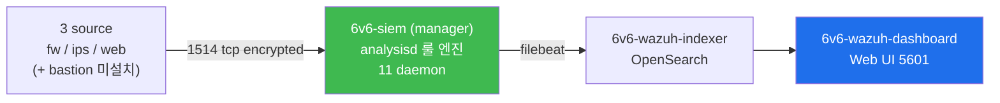
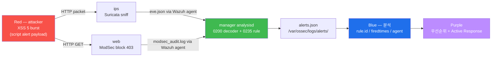

# Week 09 — Wazuh manager 도입 — 11 daemon + 3 agent + 룰·디코더 + 통합 ingest

> **본 주차의 한 줄 요약**
>
> 6v6 의 **6v6-siem** 컨테이너에 **Wazuh manager 4.10.0** 이 동작 (실측 2026-05-12).
> 16 default daemon 중 **11 running** (analysisd / remoted / modulesd / monitord /
> logcollector / syscheckd / execd / db / authd / apid 등) + 5 optional 미운영
> (clusterd / maild / agentlessd / integratord / csyslogd). **3 agent 등록** (web 005 /
> ips 006 / fw 007, **bastion agent 미등록** — 운영 보완 필요). Suricata 의 eve.json
> 이 이미 통합 ingest 중 — alerts.json 에 rule id 86601 (Wazuh 의 Suricata decoder)
> 으로 매핑.
>
> **운영자 한 줄 결론**: SIEM 의 본질은 **decoder → 룰 → alert level → alerts.json**.
> Wazuh 의 11 daemon 이 각자 역할을 분담하여 100+ source 의 로그를 한 형식으로 정규화.

---

## 학습 목표

본 주차 종료 시 학생은 다음 9가지를 **본인 손으로** 할 수 있어야 한다.

1. SIEM 의 자리 (W01 의 Defense in Depth L4 의 Host visibility 보완) + Wazuh 의
   open-source SIEM 정체성.
2. Wazuh 4.10 의 **3-tier 아키텍처** (manager + indexer + dashboard) + 6v6 의 3 컨테이너
   (`6v6-siem` / `6v6-wazuh-indexer` / `6v6-wazuh-dashboard`) 매핑.
3. **16 default daemon** 중 6v6 에서 **11 running** + **5 optional 미운영** 의 의미 +
   각 daemon 의 역할 (analysisd = 룰 엔진, remoted = agent 통신, syscheckd = FIM,
   modulesd = SCA / VD / GCP / Office365 등 모듈).
4. **3 agent (web 005 / ips 006 / fw 007)** + **bastion agent 미등록** 의 운영 함의 +
   agent 등록 절차 (authd 또는 manage_agents).
5. **decoder + 룰** — `/var/ossec/etc/decoders/` + `/var/ossec/etc/rules/` 의 구조.
   Suricata decoder + ModSec decoder + osquery decoder 의 매핑.
6. **alerts.json + alerts.log** 의 정확한 구조 — `rule` + `agent` + `manager` +
   `data` (decoded fields) 의 4 sub-section.
7. **rule level 0-15** 의 우선순위 + 운영 의미. level 7+ = critical, level 5+ = important.
8. **agent.conf** + `<localfile>` 로 새 log source ingest (W10 에서 본격 통합 — osquery /
   ModSec audit / Suricata eve.json).
9. **R/B/P 시나리오** — Red 가 web 에 XSS 공격 → Blue 가 ips → manager 의 alerts.json
   ingest 추적 → Purple 의 우선순위 룰 + Active Response 권장.

---

## 강의 시간 배분 (3시간 40분)

| 시간      | 내용                                                                  | 유형     |
|-----------|----------------------------------------------------------------------|----------|
| 0:00–0:25 | 이론 — SIEM 의 자리 + Wazuh 정체성 (vs Splunk / Elastic / OSSEC fork)  | 강의     |
| 0:25–0:55 | 이론 — 3-tier 아키텍처 + 16 daemon + 6v6 의 11 running                | 강의     |
| 0:55–1:05 | 휴식                                                                  | —        |
| 1:05–1:30 | 6v6 실측 — 3 agent 등록 + bastion 누락 + alerts.json 의 Suricata ingest | 강의/토론|
| 1:30–2:00 | 실습 1, 2 — manager status + 3 agent + alerts.json baseline           | 실습     |
| 2:00–2:30 | 실습 3, 4 — decoder/rule 구조 + Suricata decoder 매핑                  | 실습     |
| 2:30–2:40 | 휴식                                                                  | —        |
| 2:40–3:10 | 실습 5, 6 — 새 agent 등록 (bastion) + agent.conf 보강                  | 실습     |
| 3:10–3:30 | 실습 7 — **R/B/P** (XSS → ips → manager alerts.json)                   | 실습     |
| 3:30–3:40 | 정리 + W10 (dashboard + 통합) 예고                                    | 정리     |

---

## 0. 용어 해설

| 용어 | 영문 | 뜻 |
|------|------|----|
| **SIEM** | Security Information & Event Management | 다 source log 통합 + 정규화 + 상관분석 |
| **Wazuh** | — | OSSEC fork 의 open-source SIEM (2015~) |
| **manager** | — | Wazuh 의 중앙 분석 노드 (analysisd + remoted 등) |
| **indexer** | — | OpenSearch 기반 색인 (Elasticsearch fork) |
| **dashboard** | — | Wazuh UI (Kibana fork) |
| **agent** | — | 호스트 데이터 수집기 (logcollector + syscheck 등) |
| **manager-agent** | — | manager 의 self-agent (id 000) |
| **analysisd** | — | 룰 엔진 daemon — log 매칭 + alert 생성 |
| **remoted** | — | agent 통신 daemon (1514/tcp encryption) |
| **modulesd** | — | SCA / VD / GCP / Office365 등 모듈 |
| **monitord** | — | agent 상태 모니터 |
| **logcollector** | — | manager 자신의 log polling |
| **syscheckd** | — | FIM (File Integrity Monitoring) |
| **execd** | — | Active Response 실행 |
| **db** | — | wazuh-db 서버 |
| **authd** | — | agent 등록 (자동 enrollment) |
| **apid** | — | REST API daemon (55000/tcp) |
| **decoder** | — | log 의 raw text → JSON field 변환 |
| **rule** | — | decoder 후 field 매칭 → alert 생성 |
| **level** | — | rule 의 우선순위 0-15 |
| **alerts.json** | — | manager 의 alert 출력 (JSON line) |
| **alerts.log** | — | manager 의 alert 출력 (사람 친화 multi-line) |
| **agent.conf** | — | agent 의 설정 (manager 가 배포) |
| **ossec.conf** | — | manager + agent 설정 파일 |
| **localfile** | — | log source 정의 |
| **Active Response** | AR | alert 시 자동 명령 실행 (firewall block 등) |
| **CDB list** | constant database | key-value DB (IOC / 화이트리스트) |

---

## 1. SIEM 의 자리 + Wazuh 정체성

### 1.1 Defense in Depth 의 L4 보완

W01 의 4 계층 — Perimeter (fw) / Inline Detection (ips) / Application (web) / Host
visibility (osquery, sysmon). SIEM 은 **L4 의 통합 분석 도구** — 모든 source 의 alert /
log 가 모이는 곳.

### 1.2 Wazuh 의 정체성

- **OSSEC fork**: 2015 년 OSSEC 의 fork 로 출발
- **Open source**: GPLv2
- **all-in-one**: 단일 platform 으로 SIEM + XDR + EDR + SCA + FIM + Active Response
- **vs Splunk / Elastic / Sumo Logic**: 상용 대안. 비용 0 + 자체 hosted

### 1.3 6v6 의 Wazuh 사용 위치



W10 에서 dashboard 본격 학습. W09 는 manager 중심.

---

## 2. Wazuh 4.10 의 3-tier 아키텍처

### 2.1 3 컨테이너 (6v6)

| 컨테이너 | IP | 역할 |
|----------|-----|------|
| **6v6-siem** | 10.20.32.100 | manager (11 daemon, listen 1514/1515/55000) |
| **6v6-wazuh-indexer** | 10.20.32.110 | OpenSearch (9200) |
| **6v6-wazuh-dashboard** | 10.20.32.120 | Web UI (HTTPS 5601) |

### 2.2 데이터 흐름

```
agent (fw/ips/web) → manager:1514 (TLS encrypted)
manager:analysisd (decoder + rule) → /var/ossec/logs/alerts/alerts.json
manager:filebeat → indexer:9200 (Elasticsearch API)
indexer → dashboard:5601 (HTTPS)
운영자 → dashboard 의 UI → 쿼리 + visualization
```

### 2.3 listen port

| port | proto | 데몬 | 용도 |
|------|-------|------|------|
| 1514 | tcp/udp | remoted | agent 통신 (encrypted) |
| 1515 | tcp | authd | agent 등록 (enrollment) |
| 55000 | tcp | apid | REST API (HTTPS) |
| 9200 | tcp | indexer | OpenSearch REST |
| 5601 | tcp | dashboard | Web UI (HTTPS) |

---

## 3. 16 default daemon — 6v6 의 11 running + 5 optional 미운영

### 3.1 실측 (2026-05-12)

```
$ wazuh-control status

running:
  wazuh-modulesd       (SCA / VD / 모듈)
  wazuh-monitord       (agent 상태)
  wazuh-logcollector   (manager self log)
  wazuh-remoted        (agent 통신 1514)
  wazuh-syscheckd      (FIM)
  wazuh-analysisd      (룰 엔진)
  wazuh-execd          (Active Response)
  wazuh-db             (wazuh-db 서버)
  wazuh-authd          (agent enrollment 1515)
  wazuh-apid           (REST API 55000)
  + (vulnerability-detector, indexer-connector 등 추가 기능)

not running (optional):
  wazuh-clusterd       (다중 manager cluster)
  wazuh-maild          (이메일 alert)
  wazuh-agentlessd     (SSH 기반 agent-less)
  wazuh-integratord    (Slack / Virustotal 등 통합)
  wazuh-dbd            (legacy DB)
  wazuh-csyslogd       (syslog forward)
```

### 3.2 미운영 daemon 의 운영 함의

- **clusterd**: 단일 manager → 고가용성 부족 (운영 환경은 2+ manager cluster 권장)
- **maild**: 이메일 alert 없음 → alert 통보는 dashboard 수동 점검 또는 별 도구
- **integratord**: Slack / Virustotal / PagerDuty 통합 없음 → SOAR 통합 시 별 PR
- **csyslogd**: external syslog server forward 없음 → 다른 SIEM (Splunk 등) 와 연결 불가

운영 권장 — clusterd + integratord 활성이 production minimum.

### 3.3 daemon 별 역할 + 운영 명령

| daemon | 책임 | 운영 명령 |
|--------|------|-----------|
| analysisd | 룰 엔진 (decoder → rule → alert) | `/var/ossec/bin/wazuh-logtest` (룰 디버그) |
| remoted | agent 통신 (1514/tcp) | `netstat` / `ss -tlnp \| grep 1514` |
| modulesd | SCA + VD + 모듈 | `wazuh-modulesd` log + agent.conf |
| monitord | agent 상태 (Active / Disconnected) | `agent_control -l` |
| logcollector | manager self log | `ossec.conf` 의 `<localfile>` |
| syscheckd | FIM (manager 자신) | `<syscheck>` directives |
| execd | Active Response | `/var/ossec/active-response/` |
| db | wazuh-db 서버 | `/var/ossec/queue/db/` |
| authd | enrollment (1515) | `manage_agents` |
| apid | REST API (55000) | `curl https://siem:55000/...` |

---

## 4. 3 agent 등록 + bastion 누락

### 4.1 6v6 의 agent 실측

```
$ /var/ossec/bin/agent_control -lc

Wazuh agent_control. List of available agents:
   ID: 000, Name: wazuh.manager (server), IP: 127.0.0.1, Active/Local
   ID: 005, Name: web,    IP: any, Active
   ID: 006, Name: ips,    IP: any, Active
   ID: 007, Name: fw,     IP: any, Active
```

3 agent + 1 manager-self. **bastion 누락** — 운영 보완 필요.

### 4.2 agent 등록 절차 (bastion 보완 예시)

```bash
# 1. manager 측 — manage_agents 또는 authd
ssh 6v6-siem 'sudo /var/ossec/bin/manage_agents'
# 또는 자동 enrollment (authd 가 실행 중)

# 2. agent 측 — 등록
ssh 6v6-bastion 'sudo /var/ossec/bin/agent-auth -m 10.20.32.100 -A bastion'

# 3. agent 측 — 시작
ssh 6v6-bastion 'sudo /var/ossec/bin/wazuh-control start'

# 4. manager 측 — 확인
ssh 6v6-siem 'sudo /var/ossec/bin/agent_control -lc | grep bastion'
```

### 4.3 agent.conf 의 source 정의

각 agent 가 manager 로 ship 할 log source. 6v6 의 web agent 는 보통:

```xml
<agent_config>
  <localfile>
    <log_format>apache</log_format>
    <location>/var/log/apache2/access.log</location>
  </localfile>

  <localfile>
    <log_format>json</log_format>
    <location>/var/log/apache2/modsec_audit.log</location>
  </localfile>

  <localfile>
    <log_format>syslog</log_format>
    <location>/var/log/apache2/error.log</location>
  </localfile>
</agent_config>
```

agent.conf 는 **manager 가 배포** → agent 가 manager 로부터 polling. 변경 시 manager
의 `/var/ossec/etc/shared/default/agent.conf` 수정 + `wazuh-control restart`.

---

## 5. decoder + 룰 구조

### 5.1 디렉토리

```
/var/ossec/etc/
├── decoders/                    ← 250+ default decoder (built-in)
│   ├── 0010-active-response_decoders.xml
│   ├── 0020-ms-exchange_decoders.xml
│   ├── 0185-apache_decoders.xml
│   ├── 0200-suricata_decoders.xml  ← Suricata eve.json decoder
│   ├── 0260-osquery_decoders.xml   ← osquery 결과 decoder
│   ├── ...
│   └── local_decoder.xml           ← 사용자 정의
├── rules/                       ← 700+ default 룰
│   ├── 0085-apache_rules.xml
│   ├── 0095-sshd_rules.xml
│   ├── 0235-suricata_rules.xml     ← Suricata 룰 (rule id 86600+)
│   ├── 0260-osquery_rules.xml
│   ├── ...
│   └── local_rules.xml             ← 사용자 정의
└── ossec.conf
```

### 5.2 Suricata decoder 매핑 (실측)

ips 의 eve.json 이 어떻게 alerts.json 으로 변환:

```
eve.json (ips)
  ↓ Wazuh agent 가 ship
  ↓
manager:remoted (1514)
  ↓
analysisd
  ↓ 0200-suricata_decoders.xml 매칭
  ↓ decoded fields: alert.signature, alert.sid, http.url, ...
  ↓
0235-suricata_rules.xml 매칭 (rule id 86601 등)
  ↓
alerts.json (1 라인 JSON)
```

### 5.3 alerts.json 의 정확한 구조 (실측 2026-05-12)

```json
{
  "timestamp": "2026-05-11T21:41:36.028+0000",
  "rule": {
    "level": 3,
    "description": "Suricata: Alert - step2 admin after step1",
    "id": "86601",
    "firedtimes": 14,
    "mail": false,
    "groups": ["ids", "suricata"]
  },
  "agent": {
    "id": "006",
    "name": "ips",
    "ip": "10.20.32.1"
  },
  "manager": {
    "name": "wazuh.manager"
  },
  "data": {
    "alert": {
      "signature": "step2 admin after step1",
      "sid": 9005011
    }
  }
}
```

해석:
- `rule.level: 3` — informational (level 0-15)
- `rule.id: 86601` — Wazuh 의 Suricata decoder 룰 ID
- `rule.groups: ["ids", "suricata"]` — 카테고리
- `agent.id: 006` — ips agent
- `agent.ip: 10.20.32.1` — ips 의 dmz NIC
- `data` — decoded fields (원본 eve.json 에서 추출)

---

## 6. rule level 0-15 의 우선순위

| level | 의미 | 운영 활용 |
|-------|------|-----------|
| 0 | ignored (필터) | log 만, alert 없음 |
| 1-2 | low / notice | 통계 / 일상 운영 |
| 3-4 | medium | 일반 활동 추적 |
| 5-6 | important | 의심 활동 (관리자 알림) |
| 7-8 | high | 공격 시도 (즉시 대응) |
| 9-10 | critical | 침해 발생 (Active Response) |
| 11-12 | severe | system 위협 |
| 13-14 | severe + persistence | rootkit / 인증 우회 |
| 15 | severe | 완전 침해 |

운영 표준 — dashboard 의 default alert filter 는 보통 level 5+ (informational 제외).

---

## 7. agent.conf + `<localfile>` (W10 본격)

W10 에서 본격 통합. W09 는 baseline 점검.

```xml
<!-- /var/ossec/etc/shared/default/agent.conf -->
<agent_config>
  <!-- web agent 의 source -->
  <localfile>
    <log_format>json</log_format>
    <location>/var/log/apache2/modsec_audit.log</location>
  </localfile>

  <!-- ips agent 의 source -->
  <localfile>
    <log_format>json</log_format>
    <location>/var/log/suricata/eve.json</location>
  </localfile>

  <!-- osquery (W10 — 현재 6v6 osqueryd 미운영) -->
  <localfile>
    <log_format>json</log_format>
    <location>/var/log/osquery/osqueryd.results.log</location>
  </localfile>

  <!-- 동적 모니터링 — Suricata drop_rate -->
  <localfile>
    <log_format>command</log_format>
    <command>cat /proc/sys/net/netfilter/nf_conntrack_count</command>
    <alias>conntrack_count</alias>
    <frequency>60</frequency>
  </localfile>
</agent_config>
```

---

## 8. Active Response — alert 시 자동 명령

manager 의 `execd` daemon 이 특정 rule level 도달 시 agent 에서 명령 실행.

```xml
<!-- /var/ossec/etc/ossec.conf -->
<active-response>
  <command>firewall-drop</command>
  <location>local</location>
  <rules_id>5712</rules_id>
  <timeout>600</timeout>
</active-response>
```

5712 = SSH brute force rule. 매치 시 agent 에서 `/var/ossec/active-response/bin/firewall-drop`
실행 → nftables 의 drop set 에 attacker IP 추가 → 10분 후 자동 해제.

---

## 9. 운영 트러블슈팅 4 패턴

### 9.1 agent disconnected

증상: dashboard 에서 agent 가 빨간색 (Disconnected).

진단:
```bash
sudo /var/ossec/bin/agent_control -lc
# 해당 agent 의 status 가 Disconnected
ssh <agent_host> 'sudo /var/ossec/bin/wazuh-control status'
ssh <agent_host> 'sudo /var/ossec/bin/wazuh-control restart'
```

### 9.2 alerts.json 폭증 — alert flood

증상: alerts.json 이 GB 단위 + dashboard 느림.

원인: 특정 rule (예: Suricata rule 86601) 의 firedtimes 폭증.

해결:
- threshold (Suricata 측)
- Wazuh 의 rule level 조정
- frequency 룰 사용 (X 회 이상 누적 시 통합 alert)

### 9.3 새 decoder 안 작동

증상: agent 의 새 log source 가 alerts.json 에 안 보임.

진단:
```bash
# log 형식 테스트
echo "test log line" | sudo /var/ossec/bin/wazuh-logtest -t

# decoder 매핑 확인
sudo /var/ossec/bin/wazuh-logtest
> [입력 line]
```

### 9.4 manager 데몬 crash

증상: dashboard 무응답 / agent 차단.

진단:
```bash
sudo /var/ossec/logs/ossec.log | tail -50
sudo journalctl -u wazuh-manager --since "10 min ago"
sudo /var/ossec/bin/wazuh-control restart
```

---

## 10. R/B/P — XSS 공격 → ips → manager alerts.json 통합 추적



> **mermaid 호환 주의**: node label 안에 `<script>` 같은 raw HTML 태그를 직접 쓰면 mermaid
> sanitizer 가 깨뜨린다. 항상 `<br/>` 만 허용하고 나머지는 한글 설명 또는 escape. edge
> label 의 `()` 도 일부 파서에서 거부 → 가능하면 회피.

본 lab 의 Step 7 에서 구현.

---

## 11. 사례 분석

### 11.1 ISMS-P 매핑

| Sub-control | 본 주차 활동 |
|-------------|-------------|
| 2.9.2 (감사 기록) | alerts.json + alerts.log 1년 retention |
| 2.10.3 (보안 모니터링) | 11 daemon + 3 agent |
| 2.6.4 (네트워크 침입탐지) | Suricata + ips agent ingest |

### 11.2 NIST CSF — DE.AE (Anomalies and Events)

DE.AE-1 ~ DE.AE-5 의 표준 구현 (multi-source aggregation + correlation + analysis).

### 11.3 운영 사고 3 사례

**사례 1 — single manager 의 SPOF**:
```
운영자: clusterd 미운영 → manager crash 시 SIEM 전체 다운
복구: clusterd 활성 + 2+ manager cluster + load balancer
```

**사례 2 — alerts.json 디스크 full**:
```
운영자: alerts.json 1주 retention 후 logrotate 누락 → 100GB
복구: rotate 일별 + retention 30일 + cold storage
```

**사례 3 — agent.conf 의 syntax error**:
```
운영자: agent.conf 수정 후 restart → 일부 agent 가 Disconnected
복구: ossec.log 의 syntax error 확인 + git revert
```

---

## 12. 실습 시나리오 (4 축)

### 실습 1 — manager 데몬 상태 + 3 agent 검증

```bash
# wazuh-control status — 16 daemon 의 running/not-running 상태 한 번에 조회
# (analysisd / remoted / monitord / modulesd / db / authd / apid 등 표시)
ssh 6v6-siem 'sudo /var/ossec/bin/wazuh-control status 2>&1 | head -20'

# agent_control -lc — 등록 agent 목록 (-l) + connection status 같이 (-c)
# 출력: ID Name IP Status (Active/Disconnected/Never connected)
ssh 6v6-siem 'sudo /var/ossec/bin/agent_control -lc'

# wazuh-control info — manager version + revision + 빌드 일시 + license
# 운영 시 매 분기 버전 업그레이드 검토용 정보
ssh 6v6-siem 'sudo /var/ossec/bin/wazuh-control info'
```

### 실습 2 — alerts.json 의 최근 alert 구조 분석

```bash
# tail -3 — alerts.json 의 마지막 3 라인 (JSON 라인 1줄 = 1 alert)
# jq 로 핵심 4 필드만 추출 → 가독성 + 운영 dashboard 친화
#   rule.id        : 매치된 룰 ID (5710=SSH brute, 31115=Apache 4xx 등)
#   rule.level     : 0~16 severity (>=7 medium+)
#   rule.description : 사람이 읽는 이름
#   agent.name     : 어느 호스트에서 발생 (fw/ips/web)
ssh 6v6-siem 'sudo tail -3 /var/ossec/logs/alerts/alerts.json | \
    jq "{rule_id:.rule.id, level:.rule.level, desc:.rule.description, agent:.agent.name}"'
```

### 실습 3 — decoder + rule 구조

```bash
# decoder 갯수 — Wazuh 4.10 의 기본 decoder 200+ (apache, suricata, ssh, ...)
ssh 6v6-siem 'sudo ls /var/ossec/etc/decoders/ | wc -l'

# rule 갯수 — 300+ XML 룰 파일 (각 파일은 수십 ~ 수백 룰)
ssh 6v6-siem 'sudo ls /var/ossec/etc/rules/ | wc -l'

# 0200-suricata_decoders.xml — Suricata eve.json 파싱 decoder
# 0200 prefix = decoder 의 평가 우선순위 (낮을수록 먼저). suricata 는 0200 영역
ssh 6v6-siem 'sudo grep -A2 "0200-suricata" /var/ossec/etc/decoders/0200-suricata_decoders.xml 2>&1 | head -10'
```

### 실습 4 — Suricata decoder 매핑 검증

```bash
# wazuh-logtest — 표준 입력의 raw log 한 줄을 manager 가 어떻게 decode/rule 매핑
# 하는지 출력. 새 decoder/룰 작성 시 사전 검증 도구.
# 예: echo '{"event_type":"alert", ...}' | wazuh-logtest
#     → "Phase 2 (Decoder): name = suricata-alert"
#     → "Phase 3 (Rule): id = 86601, level = 5"
ssh 6v6-siem 'echo "test" | sudo /var/ossec/bin/wazuh-logtest 2>&1 | head -5'
```

### 실습 5 — bastion agent 등록 (보완) 또는 시뮬

```bash
# 현재 6v6 의 bastion 은 Wazuh agent 미등록 (시연용 syslog 패러다임)
# 등록 절차:
#   1. bastion 에 wazuh-agent 패키지 설치 + Dockerfile 수정 (인프라 변경)
#   2. ossec.conf 의 <server><address>10.20.32.100</address> 지정
#   3. authd 로 enrollment: agent-auth -m 10.20.32.100
#   4. wazuh-agent.service 시작
# 본 lab 은 시뮬만 — 실 적용은 6v6 Dockerfile patch 필요
echo "bastion agent 등록 = 인프라 변경 — W10 예고"
```

### 실습 6 — agent.conf 점검

```bash
# /var/ossec/etc/shared/default/agent.conf — 모든 agent 에 공통 적용되는 config
# (특정 agent 만 차별 설정하려면 group 별 agent.conf 사용)
# 핵심 섹션: <syscheck> (FIM, W10) / <sca> / <localfile> / <wodle>
ssh 6v6-siem 'sudo cat /var/ossec/etc/shared/default/agent.conf | head -20'
```

### 실습 7 — **R/B/P** — XSS 5 burst → alerts.json ingest 추적

§16 참조.

---

## 12.5 R/B/P 공격 분석 케이스 확장 (본 주차 추가)

### 12.5.0 R/B/P 일상 비유 — 경찰 종합상황실

본 절은 Wazuh manager 의 운영을 경찰 종합상황실 비유로 시작한다.

경찰 종합상황실을 떠올려보자. 시내 곳곳에 있는 CCTV (각 호스트의 agent), 순찰차의 무전 (Suricata decoder), 출입구의 출입증 검사 (osquery / FIM) 가 모두 한 곳의 상황실로 흘러들어온다. 상황실 안에는 11명의 직원 (11개 running daemon) 이 각자 역할을 맡고, 그 중 한 직원 (analysisd) 이 모든 사건을 한 줄짜리 alert 로 정리해 화이트보드 (alerts.json) 에 적는다. 화이트보드는 다시 외부 분석실 (OpenSearch indexer) 로 사진 찍혀 보존된다.

| 일상 비유 | Wazuh manager 운영 |
|-----------|---------------------|
| 시내 CCTV | 각 host 의 Wazuh agent |
| 순찰차 무전 | Suricata decoder + remoted |
| 출입증 검사 | osquery + FIM |
| 상황실 직원 11명 | 11 running daemon |
| 화이트보드 alert 정리 | analysisd 의 alerts.json |
| 외부 분석실 사진 보존 | OpenSearch indexer |
| 자동 응답 명령 | Active Response |

본 절은 다음 세 케이스를 다룬다.

- 케이스 1 — Suricata 의 한 alert 가 analysisd 의 alerts.json 으로 ingest 되는 흐름을 직접 추적.
- 케이스 2 — chain rule (rule 5710 + 5712) 의 multi-stage SSH brute force 탐지.
- 케이스 3 — Active Response 의 자동 차단 발동 + rollback.

원칙은 W01 ~ W08 와 같다. 재현 가능성, 도구 위주 분석, 신입생 친화, 학습 환경 한정.

### 12.5.1 케이스 1 — Suricata alert 의 alerts.json ingest 추적

**0. 일상 비유 — 순찰차 무전을 상황실 직원이 받아 화이트보드에 적기까지.**

순찰차가 의심 차량을 발견해 무전을 보낸다. 상황실의 무전 담당 직원 (remoted) 이 받아 메모지에 적고, 그 메모지를 사건 분석 직원 (analysisd) 에게 전달한다. 분석 직원은 사건 카테고리, 위치, 심각도를 한 줄로 정리해 화이트보드 (alerts.json) 에 적는다. 화이트보드는 매번 사진으로 외부 분석실 (OpenSearch indexer) 로 전송된다. 학생은 이 다섯 단계의 흐름을 끝까지 한 번 따라가본다.

| 일상 비유 | Wazuh ingest 흐름 |
|-----------|--------------------|
| 순찰차 무전 | Suricata eve.json 의 alert event |
| 무전 받은 직원 | logcollector + remoted |
| 메모지 분류 | decoder 매칭 |
| 화이트보드 한 줄 | analysisd 의 alerts.json |
| 외부 분석실 사진 | OpenSearch indexer 의 wazuh-alerts-* |

**0a. 사용 도구 사전 안내.**

- **Suricata eve.json** — IDS 의 원본 alert.
- **/var/ossec/logs/alerts/alerts.json** — Wazuh manager 의 통합 alert 한 줄당 한 JSON.
- **/var/ossec/logs/ossec.log** — Wazuh manager 의 운영 로그.
- **Wazuh Dashboard** — Web UI. Discover 와 Security events 모듈.

**1. Red — 공격 재현.**

attacker VM 에서 학습 환경 web 의 80 포트에 XSS payload 한 줄을 보낸다. 학습 환경 한정으로 실행한다.

```bash
ssh ccc@192.168.0.112
# password: 1
```

attacker VM 내부에서 한 줄을 보낸다.

```bash
# attacker VM 내부 (학습 환경 한정)
curl -s -o /dev/null -w "%{http_code}\n" \
    -H "Host: juice.6v6.lab" \
    "http://192.168.0.103/search?q=%3Cscript%3Ealert(1)%3C/script%3E"
```

XSS payload 가 web 에 도달하면서 ips 의 Suricata 가 이를 인식한다.

**2. 발생하는 로그/아티팩트.**

- ips 의 `/var/log/suricata/eve.json` 에 alert event 한 줄 추가.
- siem 의 `/var/ossec/logs/alerts/alerts.json` 에 통합 alert 한 줄 추가.
- siem 의 `/var/ossec/logs/ossec.log` 에 ingest 처리 흔적.

**3. Blue — 5 단계 ingest 흐름 직접 추적.**

**Step 1 — ips 의 eve.json 에 원본 alert 확인.**

```bash
ssh 6v6-ips
sudo tail -50 /var/log/suricata/eve.json \
  | jq -r 'select(.event_type=="alert" and .src_ip=="192.168.0.112") | "\(.timestamp) ips \(.alert.signature_id) \(.alert.signature)"' \
  | tail -5
```

타임스탬프, signature_id, signature 메시지가 한 줄로 출력된다.

**Step 2 — Wazuh agent 가 ips 의 eve.json 을 ship.**

ips VM 에 Wazuh agent 가 설치되어 있고, `agent.conf` 에 `<localfile>` 로 `/var/log/suricata/eve.json` 이 등록되어 있어야 한다.

```bash
ssh 6v6-ips
sudo grep -A2 "eve.json" /var/ossec/etc/ossec.conf
```

`location` 이 eve.json 이고 `log_format` 이 `json` 이면 정상이다.

**Step 3 — siem manager 의 analysisd 가 decoder 매칭.**

```bash
ssh 6v6-siem
sudo tail -20 /var/ossec/logs/ossec.log | grep -i "suricata\|decoder"
```

decoder 매칭에 성공하면 단순 로그가 정상 ingest 된다. 실패하면 ossec.log 에 `Reason: ` 또는 `Unknown event` 메시지가 보일 수 있다.

**Step 4 — alerts.json 에 통합 alert 한 줄.**

```bash
ssh 6v6-siem
sudo tail -50 /var/ossec/logs/alerts/alerts.json \
  | jq -r 'select(.agent.name=="ips") | "\(.timestamp) rule=\(.rule.id) level=\(.rule.level) desc=\(.rule.description)"' \
  | tail -5
```

여기서 `rule.id` 는 86601 (Suricata XSS) 또는 86xxx 시리즈로 매핑된다.

**Step 5 — Wazuh Dashboard 의 Discover 에서 보기.**

1. 좌측 햄버거 메뉴 → `Discover` 선택.
2. Index pattern 을 `wazuh-alerts-*` 로 바꾼다.
3. Time picker `Last 15 minutes`.
4. Search bar 에 `agent.name:ips AND rule.groups:suricata AND data.srcip:192.168.0.112` 입력.
5. 결과 한 줄을 펼쳐 `data.alert.signature`, `data.src_ip`, `data.dest_ip` 를 확인한다.

5 단계 모두 같은 사건이 보여야 정상 ingest 다.

**4. Blue — 5 단계 중 한 단계라도 실패하면 진단.**

학생이 다음 세 가지를 판단한다.

- **Step 2 실패.** agent.conf 의 `<localfile>` 미등록 또는 권한 문제. agent 가 eve.json 을 읽지 못한다.
- **Step 3 실패.** decoder 미등록 또는 잘못된 매칭. ossec.log 에 `Reason: 'Unknown'` 같은 메시지.
- **Step 5 실패.** indexer 와 dashboard 의 연결 실패. OpenSearch 인덱스에 alert 가 들어가지 않음.

각 단계의 실패에 대응되는 진단 명령은 W09 §9 (트러블슈팅 4 패턴) 의 패턴 1, 패턴 3 참조.

**5. Purple — ingest baseline 운영.**

다음 세 가지를 적용한다.

- **모든 host 의 agent.conf git 추적.** `<localfile>` 와 `<directories>` 의 변경 history 가 git 으로 audit 된다.
- **alerts.json retention 1년.** ISMS-P 표준. log rotate 의 보관 정책 확인.
- **alerts.json baseline 측정.** 정상 운영의 분당 alert 수를 baseline 으로 측정. 5배 이상 spike 시 자동 알람.

본 케이스 cycle 한 바퀴는 약 20분 정도다.

### 12.5.2 케이스 2 — chain rule (5710 + 5712) 의 multi-stage SSH brute force 탐지

**0. 일상 비유 — 한 사람이 한 번 실수하면 메모, 다섯 번 반복하면 책임자 호출.**

상황실의 정상 운영 원칙이다. 한 호실에서 출입 카드 입력 실수 한 번은 단순 메모로 적어둔다. 같은 호실에서 같은 사람이 5번 실패하면 chain 규칙이 발동되어 책임자에게 즉시 알린다. 단발 사고는 false positive 가능성이 크지만, chain 누적은 진짜 침해의 직접 신호다.

| 일상 비유 | chain rule |
|-----------|------------|
| 단발 실수 메모 | rule 5710 (level 5, "non-existent user") |
| chain 발동 | rule 5712 (level 10, "Multiple authentication failures") |
| 같은 사람 5회 | frequency 5 + timeframe 60 + same_source_ip |
| 책임자 호출 | level 10 의 즉시 alarm |

**0a. 사용 도구 사전 안내.**

- **rule 5710** — Wazuh 의 기본 rule. sshd 의 single Failed password.
- **rule 5712** — chain rule. 5710 의 frequency 누적 + same_source_ip.
- **Wazuh Dashboard 의 Modules → Security events.**

**1. Red — 공격 재현.**

attacker VM 에서 학습 환경 web 의 SSH 에 5번 실패 시도를 보낸다.

```bash
ssh ccc@192.168.0.112

# attacker VM 내부 (학습 환경 한정)
for i in $(seq 1 5); do
    sshpass -p "wrong${i}" ssh -o ConnectTimeout=3 \
        -o StrictHostKeyChecking=no \
        admin@192.168.0.103 'whoami' 2>/dev/null
done
```

5번 모두 실패한다. 학습 환경 admin 의 정상 비밀번호가 `wrongN` 이 아니기 때문이다.

**2. 발생하는 로그/아티팩트.**

- web 의 `/var/log/auth.log` 에 Failed password 5건.
- siem 의 alerts.json 에 rule 5710 alert 5건 + rule 5712 alert 1건 (5번째 시점).

**3. Blue — Wazuh Dashboard 에서 chain rule 직접 확인.**

학생이 자기 host 의 web browser 에서 Wazuh Dashboard 에 접속한다.

- URL: `https://dashboard.6v6.lab` (또는 `https://192.168.0.103:5601`).
- 로그인.

UI 클릭 흐름은 다음과 같다.

1. 좌측 햄버거 메뉴 → `Wazuh` → `Modules` → `Security events` 선택.
2. Time picker `Last 15 minutes`.
3. 화면 상단의 `Top Rules` 카드에서 rule 5710 의 카운트 5 와 rule 5712 의 카운트 1 을 확인.
4. rule 5712 를 클릭하면 그 rule 의 alert 만 필터링된다.
5. alert 한 줄을 펼쳐 `previous_log` 또는 `parent` 필드를 본다. chain 으로 묶인 이전 5710 alert 들의 reference 가 보인다.

다음으로 jq 로 직접 확인한다.

```bash
ssh 6v6-siem
sudo tail -100 /var/ossec/logs/alerts/alerts.json \
  | jq -r 'select(.rule.id=="5712" and .data.srcip=="192.168.0.112") | "\(.timestamp) rule=\(.rule.id) level=\(.rule.level) desc=\(.rule.description) srcip=\(.data.srcip)"' \
  | tail -3
```

level 10 의 5712 한 줄이 보이면 chain 발동이 정상이다.

**4. Blue — 대응 의사결정.**

학생이 다음 세 가지를 판단한다.

- **level 10 의 즉시 알람.** rule 5712 의 level 10 은 즉시 SOC 통지 대상이다.
- **단일 5710 vs chain 5712.** 5710 한 건은 단순 모니터링. 5712 발동은 침해 직접 신호.
- **Active Response 연계.** 5712 발동 시 자동 차단 적용 여부를 정한다. 다음 케이스 3 에서 다룬다.

**5. Purple — chain rule 의 frequency 조정.**

다음 세 가지를 적용한다.

- **frequency 5 → 3 으로 강화.** 학습 환경의 정상 SSH 시도가 분당 몇 건인지 baseline 측정 후 적정 값을 정한다.
- **same_source_ip + same_user 결합.** 같은 IP 의 다양한 user 시도도 chain 대상이 되도록 보강.
- **timeframe 60 → 120.** 천천히 진행하는 brute force 도 잡히도록 시간 창을 늘린다.

```xml
<group name="local,authentication_failures,">
  <rule id="100300" level="12" frequency="3" timeframe="120">
    <if_matched_sid>5710</if_matched_sid>
    <same_source_ip />
    <description>LOCAL Strict SSH brute - 3 fails in 2 minutes from same src</description>
  </rule>
</group>
```

### 12.5.3 케이스 3 — Active Response 자동 차단 + rollback

**0. 일상 비유 — 상황실이 자동 응답 명령으로 호실 출입문 임시 잠금.**

상황실 직원이 침해 신호를 받으면 자동 응답 명령을 발동해 호실 출입문을 10분간 임시 잠근다. 10분 뒤에는 자동으로 잠금이 해제된다. 학생은 본 자동 응답 명령이 어떻게 발동되고, 어떻게 자동 rollback 되는지를 직접 확인한다.

| 일상 비유 | Active Response |
|-----------|------------------|
| 자동 응답 명령 | active-response 등록 |
| 출입문 임시 잠금 | firewall-drop (iptables drop) |
| 잠금 시간 10분 | timeout 600 초 |
| 자동 잠금 해제 | timeout 만료 시 자동 rollback |

**0a. 사용 도구 사전 안내.**

- **active-response** — Wazuh 의 자동 응답 메커니즘. rule 발동 시 agent 가 명령 실행.
- **firewall-drop** — Active Response 의 표준 명령. iptables 또는 nftables 의 drop rule 자동 추가.
- **timeout** — 자동 rollback 시간. 초 단위.

**1. Red — 공격 재현.**

케이스 2 의 5번 SSH 실패를 다시 한 번 실행한다.

```bash
ssh ccc@192.168.0.112

# attacker VM 내부 (학습 환경 한정)
for i in $(seq 1 5); do
    sshpass -p "wrong${i}" ssh -o ConnectTimeout=3 \
        -o StrictHostKeyChecking=no \
        admin@192.168.0.103 'whoami' 2>/dev/null
done

# 이제 6번째 시도를 보낸다 — 차단되어야 한다
sshpass -p "wrong6" ssh -o ConnectTimeout=3 \
    -o StrictHostKeyChecking=no \
    admin@192.168.0.103 'whoami' 2>&1
```

5번 실패 후 rule 5712 가 발동되면 Active Response 가 attacker IP 를 차단한다. 6번째 시도는 connection 자체가 timeout 또는 refused 가 된다.

**2. 발생하는 로그/아티팩트.**

- siem 의 alerts.json 에 rule 5712 + active-response 발동 log.
- web 의 `iptables -L INPUT` 에 attacker IP 의 drop rule 한 줄 추가.
- web 의 `/var/ossec/logs/active-responses.log` 에 발동 + rollback 의 두 줄 기록.

**3. Blue — Active Response 발동 + rollback 직접 확인.**

Wazuh Dashboard 의 클릭 흐름은 다음과 같다.

1. 좌측 햄버거 메뉴 → `Wazuh` → `Active Response` 선택.
2. 최근 발동 목록의 첫 줄을 확인한다. command 가 `firewall-drop`, agent 가 `web`, IP 가 `192.168.0.112` 인지 확인한다.
3. Time picker `Last 15 minutes` 로 좁혀 시각도 본다.

다음으로 web VM 에서 iptables 의 drop rule 한 줄을 직접 확인한다.

```bash
ssh 6v6-web
sudo iptables -L INPUT -n --line-numbers | grep "192.168.0.112"
```

`DROP all -- 192.168.0.112 0.0.0.0/0` 같은 줄이 보이면 정상 발동이다.

active-responses.log 의 발동 줄을 본다.

```bash
sudo tail -20 /var/ossec/logs/active-responses.log
```

`Wed May 12 14:45:00 EXEC active-response/bin/firewall-drop.sh ... add 192.168.0.112` 같은 줄이 보이면 실행 직접 증거다.

timeout 만료 후 자동 rollback 도 확인한다.

```bash
# 600초 후 다시 실행
sudo iptables -L INPUT -n --line-numbers | grep "192.168.0.112" || echo "rollback complete"
sudo tail -5 /var/ossec/logs/active-responses.log
```

rule 이 사라졌고 active-responses.log 에 `delete 192.168.0.112` 같은 줄이 보이면 자동 rollback 정상이다.

**4. Blue — 대응 의사결정.**

학생이 다음 세 가지를 판단한다.

- **timeout 적정성.** 600 초가 학습 환경에서 적정한가? 운영 환경은 보통 1800 ~ 3600 초.
- **auto-drop 의 false positive 위험.** rule 5712 가 false positive 라면 정상 사용자가 10분 차단된다. chain rule 의 frequency 가 너무 낮으면 위험.
- **whitelist 적용.** 학습 환경의 bastion (10.20.30.201) 같은 정상 운영 IP 는 active-response 의 whitelist 에 등록해 false positive 차단을 막는다.

**5. Purple — Active Response 운영 baseline.**

다음 세 가지를 적용한다.

- **whitelist 등록.** `ossec.conf` 의 `<active-response>` 섹션에 `<repeated_offenders>` 와 `<whitelist>` 를 추가한다. bastion, monitoring server 같은 정상 IP 는 차단 면제.
- **timeout 운영 정책 명문화.** 학습 환경 600, 운영 환경 3600 의 정책을 문서화한다.
- **반복 차단의 timeout 점진 증가.** 같은 IP 가 반복 차단되면 timeout 을 600 → 3600 → 86400 로 점진 증가한다. `<repeated_offenders>` 옵션으로 가능.

### 12.5.4 본 절 정리

본 절은 W09 의 Wazuh manager 학습을 실제 공격 분석 cycle 에 연결했다. 학생이 다음 능력을 갖춘다.

- Suricata alert 의 5 단계 ingest 흐름 (eve.json → agent → remoted → analysisd → alerts.json → Dashboard) 을 직접 추적한다.
- chain rule (5710 + 5712) 의 multi-stage 탐지를 frequency, timeframe, same_source_ip 로 분석한다.
- Active Response 의 자동 차단 발동과 timeout rollback 을 직접 확인하고 whitelist 와 repeated_offenders 로 보완한다.

다음 주차 W10 에서는 Wazuh Dashboard 의 시각화 + 4 통합 패턴 (ModSec / osquery / FIM / Active Response) 의 R/B/P cycle 을 학습한다.

---

## 13. 과제

### A. 11 daemon 분석 보고서 (필수, 30점)

각 daemon 의 역할 + 6v6 의 11 running + 5 not running + 운영 권장 (어느 daemon
운영 시작 권장? 이유?).

### B. alerts.json 분석 (심화, 30점)

지난 1시간 alerts.json 의 통계:
- 총 alert 수 + rule.id top 10
- agent 별 분포
- level 별 분포
- 가장 매치된 rule 의 description + groups

### C. R/B/P 보고서 (정성, 30점)

실습 7 결과 + alerts.json 의 ingest 흐름 + Active Response 권장.

### D. bastion agent 등록 계획 (정성, 10점)

bastion agent 등록 절차 + 보안 고려 (key 관리 / authd 권장).

---

## 14. 평가 기준

| 항목 | 비중 |
|------|------|
| 11 daemon 분석 (A) | 30% |
| alerts.json 분석 (B) | 30% |
| R/B/P 보고서 (C) | 30% |
| bastion 계획 (D) | 10% |

---

## 15. 핵심 정리 (8 줄)

1. **SIEM = Defense in Depth L4 통합** — Wazuh manager 가 모든 source ingest
2. **Wazuh 4.10 3-tier** — manager + indexer + dashboard. 6v6 의 3 컨테이너
3. **16 daemon 중 11 running** (analysisd / remoted / modulesd 등) + 5 optional 미운영
4. **3 agent (web/ips/fw)** + **bastion 미등록** — 운영 보완 필요
5. **decoder + 룰** — /var/ossec/etc/decoders + /var/ossec/etc/rules. Suricata 0200 + 0235
6. **alerts.json** — JSON line. rule + agent + manager + data 4 sub-section
7. **rule level 0-15** — 0 ignored / 5+ important / 7+ high / 10+ critical
8. **R/B/P** — Red XSS → ips agent → manager analysisd → alerts.json → dashboard

---

## 16. 다음 주차 (W10) 예고

- **주제**: Wazuh dashboard + osquery + ModSec audit 통합 + sysmon 1차
- **연결**: W09 의 manager 가 받은 ingest 를 dashboard 의 panel 로 visualize
- **R/B/P 시나리오**: 5 source (Suricata / ModSec / osquery / sysmon / nftables log)
  의 alert 가 dashboard 의 1 화면에 모두 표시 + 우선순위 정렬
