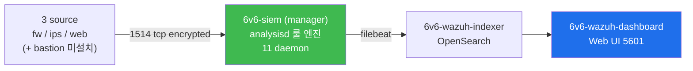

# Week 09 — Wazuh manager 도입 — 11 daemon + 3 agent + 룰·디코더 + 통합 ingest

> **본 주차의 한 줄 요약**
>
> 6v6 의 **6v6-siem** 컨테이너에 **Wazuh manager 4.10.0** 이 동작 (실측 2026-05-12).
> 16 default daemon 중 **11 running** (analysisd / remoted / modulesd / monitord /
> logcollector / syscheckd / execd / db / authd / apid 등) + 5 optional 미운영
> (clusterd / maild / agentlessd / integratord / csyslogd). **3 agent 등록** (web 005 /
> ips 006 / fw 007, **bastion agent 미등록** — 운영 보완 필요). Suricata 의 eve.json
> 이 이미 통합 ingest 중 — alerts.json 에 rule id 86601 (Wazuh 의 Suricata decoder)
> 으로 매핑.
>
> **운영자 한 줄 결론**: SIEM 의 본질은 **decoder → 룰 → alert level → alerts.json**.
> Wazuh 의 11 daemon 이 각자 역할을 분담하여 100+ source 의 로그를 한 형식으로 정규화.

---

## 학습 목표

본 주차 종료 시 학생은 다음 9가지를 **본인 손으로** 할 수 있어야 한다.

1. SIEM 의 자리 (W01 의 Defense in Depth L4 의 Host visibility 보완) + Wazuh 의
   open-source SIEM 정체성.
2. Wazuh 4.10 의 **3-tier 아키텍처** (manager + indexer + dashboard) + 6v6 의 3 컨테이너
   (`6v6-siem` / `6v6-wazuh-indexer` / `6v6-wazuh-dashboard`) 매핑.
3. **16 default daemon** 중 6v6 에서 **11 running** + **5 optional 미운영** 의 의미 +
   각 daemon 의 역할 (analysisd = 룰 엔진, remoted = agent 통신, syscheckd = FIM,
   modulesd = SCA / VD / GCP / Office365 등 모듈).
4. **3 agent (web 005 / ips 006 / fw 007)** + **bastion agent 미등록** 의 운영 함의 +
   agent 등록 절차 (authd 또는 manage_agents).
5. **decoder + 룰** — `/var/ossec/etc/decoders/` + `/var/ossec/etc/rules/` 의 구조.
   Suricata decoder + ModSec decoder + osquery decoder 의 매핑.
6. **alerts.json + alerts.log** 의 정확한 구조 — `rule` + `agent` + `manager` +
   `data` (decoded fields) 의 4 sub-section.
7. **rule level 0-15** 의 우선순위 + 운영 의미. level 7+ = critical, level 5+ = important.
8. **agent.conf** + `<localfile>` 로 새 log source ingest (W10 에서 본격 통합 — osquery /
   ModSec audit / Suricata eve.json).
9. **R/B/P 시나리오** — Red 가 web 에 XSS 공격 → Blue 가 ips → manager 의 alerts.json
   ingest 추적 → Purple 의 우선순위 룰 + Active Response 권장.

---

## 강의 시간 배분 (3시간 40분)

| 시간      | 내용                                                                  | 유형     |
|-----------|----------------------------------------------------------------------|----------|
| 0:00–0:25 | 이론 — SIEM 의 자리 + Wazuh 정체성 (vs Splunk / Elastic / OSSEC fork)  | 강의     |
| 0:25–0:55 | 이론 — 3-tier 아키텍처 + 16 daemon + 6v6 의 11 running                | 강의     |
| 0:55–1:05 | 휴식                                                                  | —        |
| 1:05–1:30 | 6v6 실측 — 3 agent 등록 + bastion 누락 + alerts.json 의 Suricata ingest | 강의/토론|
| 1:30–2:00 | 실습 1, 2 — manager status + 3 agent + alerts.json baseline           | 실습     |
| 2:00–2:30 | 실습 3, 4 — decoder/rule 구조 + Suricata decoder 매핑                  | 실습     |
| 2:30–2:40 | 휴식                                                                  | —        |
| 2:40–3:10 | 실습 5, 6 — 새 agent 등록 (bastion) + agent.conf 보강                  | 실습     |
| 3:10–3:30 | 실습 7 — **R/B/P** (XSS → ips → manager alerts.json)                   | 실습     |
| 3:30–3:40 | 정리 + W10 (dashboard + 통합) 예고                                    | 정리     |

---

## 0. 용어 해설

| 용어 | 영문 | 뜻 |
|------|------|----|
| **SIEM** | Security Information & Event Management | 다 source log 통합 + 정규화 + 상관분석 |
| **Wazuh** | — | OSSEC fork 의 open-source SIEM (2015~) |
| **manager** | — | Wazuh 의 중앙 분석 노드 (analysisd + remoted 등) |
| **indexer** | — | OpenSearch 기반 색인 (Elasticsearch fork) |
| **dashboard** | — | Wazuh UI (Kibana fork) |
| **agent** | — | 호스트 데이터 수집기 (logcollector + syscheck 등) |
| **manager-agent** | — | manager 의 self-agent (id 000) |
| **analysisd** | — | 룰 엔진 daemon — log 매칭 + alert 생성 |
| **remoted** | — | agent 통신 daemon (1514/tcp encryption) |
| **modulesd** | — | SCA / VD / GCP / Office365 등 모듈 |
| **monitord** | — | agent 상태 모니터 |
| **logcollector** | — | manager 자신의 log polling |
| **syscheckd** | — | FIM (File Integrity Monitoring) |
| **execd** | — | Active Response 실행 |
| **db** | — | wazuh-db 서버 |
| **authd** | — | agent 등록 (자동 enrollment) |
| **apid** | — | REST API daemon (55000/tcp) |
| **decoder** | — | log 의 raw text → JSON field 변환 |
| **rule** | — | decoder 후 field 매칭 → alert 생성 |
| **level** | — | rule 의 우선순위 0-15 |
| **alerts.json** | — | manager 의 alert 출력 (JSON line) |
| **alerts.log** | — | manager 의 alert 출력 (사람 친화 multi-line) |
| **agent.conf** | — | agent 의 설정 (manager 가 배포) |
| **ossec.conf** | — | manager + agent 설정 파일 |
| **localfile** | — | log source 정의 |
| **Active Response** | AR | alert 시 자동 명령 실행 (firewall block 등) |
| **CDB list** | constant database | key-value DB (IOC / 화이트리스트) |

---

## 1. SIEM 의 자리 + Wazuh 정체성

### 1.1 Defense in Depth 의 L4 보완

W01 의 4 계층 — Perimeter (fw) / Inline Detection (ips) / Application (web) / Host
visibility (osquery, sysmon). SIEM 은 **L4 의 통합 분석 도구** — 모든 source 의 alert /
log 가 모이는 곳.

### 1.2 Wazuh 의 정체성

- **OSSEC fork**: 2015 년 OSSEC 의 fork 로 출발
- **Open source**: GPLv2
- **all-in-one**: 단일 platform 으로 SIEM + XDR + EDR + SCA + FIM + Active Response
- **vs Splunk / Elastic / Sumo Logic**: 상용 대안. 비용 0 + 자체 hosted

### 1.3 6v6 의 Wazuh 사용 위치



W10 에서 dashboard 본격 학습. W09 는 manager 중심.

---

## 2. Wazuh 4.10 의 3-tier 아키텍처

### 2.1 3 컨테이너 (6v6)

| 컨테이너 | IP | 역할 |
|----------|-----|------|
| **6v6-siem** | 10.20.32.100 | manager (11 daemon, listen 1514/1515/55000) |
| **6v6-wazuh-indexer** | 10.20.32.110 | OpenSearch (9200) |
| **6v6-wazuh-dashboard** | 10.20.32.120 | Web UI (HTTPS 5601) |

### 2.2 데이터 흐름

```
agent (fw/ips/web) → manager:1514 (TLS encrypted)
manager:analysisd (decoder + rule) → /var/ossec/logs/alerts/alerts.json
manager:filebeat → indexer:9200 (Elasticsearch API)
indexer → dashboard:5601 (HTTPS)
운영자 → dashboard 의 UI → 쿼리 + visualization
```

### 2.3 listen port

| port | proto | 데몬 | 용도 |
|------|-------|------|------|
| 1514 | tcp/udp | remoted | agent 통신 (encrypted) |
| 1515 | tcp | authd | agent 등록 (enrollment) |
| 55000 | tcp | apid | REST API (HTTPS) |
| 9200 | tcp | indexer | OpenSearch REST |
| 5601 | tcp | dashboard | Web UI (HTTPS) |

---

## 3. 16 default daemon — 6v6 의 11 running + 5 optional 미운영

### 3.1 실측 (2026-05-12)

```
$ wazuh-control status

running:
  wazuh-modulesd       (SCA / VD / 모듈)
  wazuh-monitord       (agent 상태)
  wazuh-logcollector   (manager self log)
  wazuh-remoted        (agent 통신 1514)
  wazuh-syscheckd      (FIM)
  wazuh-analysisd      (룰 엔진)
  wazuh-execd          (Active Response)
  wazuh-db             (wazuh-db 서버)
  wazuh-authd          (agent enrollment 1515)
  wazuh-apid           (REST API 55000)
  + (vulnerability-detector, indexer-connector 등 추가 기능)

not running (optional):
  wazuh-clusterd       (다중 manager cluster)
  wazuh-maild          (이메일 alert)
  wazuh-agentlessd     (SSH 기반 agent-less)
  wazuh-integratord    (Slack / Virustotal 등 통합)
  wazuh-dbd            (legacy DB)
  wazuh-csyslogd       (syslog forward)
```

### 3.2 미운영 daemon 의 운영 함의

- **clusterd**: 단일 manager → 고가용성 부족 (운영 환경은 2+ manager cluster 권장)
- **maild**: 이메일 alert 없음 → alert 통보는 dashboard 수동 점검 또는 별 도구
- **integratord**: Slack / Virustotal / PagerDuty 통합 없음 → SOAR 통합 시 별 PR
- **csyslogd**: external syslog server forward 없음 → 다른 SIEM (Splunk 등) 와 연결 불가

운영 권장 — clusterd + integratord 활성이 production minimum.

### 3.3 daemon 별 역할 + 운영 명령

| daemon | 책임 | 운영 명령 |
|--------|------|-----------|
| analysisd | 룰 엔진 (decoder → rule → alert) | `/var/ossec/bin/wazuh-logtest` (룰 디버그) |
| remoted | agent 통신 (1514/tcp) | `netstat` / `ss -tlnp \| grep 1514` |
| modulesd | SCA + VD + 모듈 | `wazuh-modulesd` log + agent.conf |
| monitord | agent 상태 (Active / Disconnected) | `agent_control -l` |
| logcollector | manager self log | `ossec.conf` 의 `<localfile>` |
| syscheckd | FIM (manager 자신) | `<syscheck>` directives |
| execd | Active Response | `/var/ossec/active-response/` |
| db | wazuh-db 서버 | `/var/ossec/queue/db/` |
| authd | enrollment (1515) | `manage_agents` |
| apid | REST API (55000) | `curl https://siem:55000/...` |

---

## 4. 3 agent 등록 + bastion 누락

### 4.1 6v6 의 agent 실측

```
$ /var/ossec/bin/agent_control -lc

Wazuh agent_control. List of available agents:
   ID: 000, Name: wazuh.manager (server), IP: 127.0.0.1, Active/Local
   ID: 005, Name: web,    IP: any, Active
   ID: 006, Name: ips,    IP: any, Active
   ID: 007, Name: fw,     IP: any, Active
```

3 agent + 1 manager-self. **bastion 누락** — 운영 보완 필요.

### 4.2 agent 등록 절차 (bastion 보완 예시)

```bash
# 1. manager 측 — manage_agents 또는 authd
ssh 6v6-siem 'sudo /var/ossec/bin/manage_agents'
# 또는 자동 enrollment (authd 가 실행 중)

# 2. agent 측 — 등록
ssh 6v6-bastion 'sudo /var/ossec/bin/agent-auth -m 10.20.32.100 -A bastion'

# 3. agent 측 — 시작
ssh 6v6-bastion 'sudo /var/ossec/bin/wazuh-control start'

# 4. manager 측 — 확인
ssh 6v6-siem 'sudo /var/ossec/bin/agent_control -lc | grep bastion'
```

### 4.3 agent.conf 의 source 정의

각 agent 가 manager 로 ship 할 log source. 6v6 의 web agent 는 보통:

```xml
<agent_config>
  <localfile>
    <log_format>apache</log_format>
    <location>/var/log/apache2/access.log</location>
  </localfile>

  <localfile>
    <log_format>json</log_format>
    <location>/var/log/apache2/modsec_audit.log</location>
  </localfile>

  <localfile>
    <log_format>syslog</log_format>
    <location>/var/log/apache2/error.log</location>
  </localfile>
</agent_config>
```

agent.conf 는 **manager 가 배포** → agent 가 manager 로부터 polling. 변경 시 manager
의 `/var/ossec/etc/shared/default/agent.conf` 수정 + `wazuh-control restart`.

---

## 5. decoder + 룰 구조

### 5.1 디렉토리

```
/var/ossec/etc/
├── decoders/                    ← 250+ default decoder (built-in)
│   ├── 0010-active-response_decoders.xml
│   ├── 0020-ms-exchange_decoders.xml
│   ├── 0185-apache_decoders.xml
│   ├── 0200-suricata_decoders.xml  ← Suricata eve.json decoder
│   ├── 0260-osquery_decoders.xml   ← osquery 결과 decoder
│   ├── ...
│   └── local_decoder.xml           ← 사용자 정의
├── rules/                       ← 700+ default 룰
│   ├── 0085-apache_rules.xml
│   ├── 0095-sshd_rules.xml
│   ├── 0235-suricata_rules.xml     ← Suricata 룰 (rule id 86600+)
│   ├── 0260-osquery_rules.xml
│   ├── ...
│   └── local_rules.xml             ← 사용자 정의
└── ossec.conf
```

### 5.2 Suricata decoder 매핑 (실측)

ips 의 eve.json 이 어떻게 alerts.json 으로 변환:

```
eve.json (ips)
  ↓ Wazuh agent 가 ship
  ↓
manager:remoted (1514)
  ↓
analysisd
  ↓ 0200-suricata_decoders.xml 매칭
  ↓ decoded fields: alert.signature, alert.sid, http.url, ...
  ↓
0235-suricata_rules.xml 매칭 (rule id 86601 등)
  ↓
alerts.json (1 라인 JSON)
```

### 5.3 alerts.json 의 정확한 구조 (실측 2026-05-12)

```json
{
  "timestamp": "2026-05-11T21:41:36.028+0000",
  "rule": {
    "level": 3,
    "description": "Suricata: Alert - step2 admin after step1",
    "id": "86601",
    "firedtimes": 14,
    "mail": false,
    "groups": ["ids", "suricata"]
  },
  "agent": {
    "id": "006",
    "name": "ips",
    "ip": "10.20.32.1"
  },
  "manager": {
    "name": "wazuh.manager"
  },
  "data": {
    "alert": {
      "signature": "step2 admin after step1",
      "sid": 9005011
    }
  }
}
```

해석:
- `rule.level: 3` — informational (level 0-15)
- `rule.id: 86601` — Wazuh 의 Suricata decoder 룰 ID
- `rule.groups: ["ids", "suricata"]` — 카테고리
- `agent.id: 006` — ips agent
- `agent.ip: 10.20.32.1` — ips 의 dmz NIC
- `data` — decoded fields (원본 eve.json 에서 추출)

---

## 6. rule level 0-15 의 우선순위

| level | 의미 | 운영 활용 |
|-------|------|-----------|
| 0 | ignored (필터) | log 만, alert 없음 |
| 1-2 | low / notice | 통계 / 일상 운영 |
| 3-4 | medium | 일반 활동 추적 |
| 5-6 | important | 의심 활동 (관리자 알림) |
| 7-8 | high | 공격 시도 (즉시 대응) |
| 9-10 | critical | 침해 발생 (Active Response) |
| 11-12 | severe | system 위협 |
| 13-14 | severe + persistence | rootkit / 인증 우회 |
| 15 | severe | 완전 침해 |

운영 표준 — dashboard 의 default alert filter 는 보통 level 5+ (informational 제외).

---

## 7. agent.conf + `<localfile>` (W10 본격)

W10 에서 본격 통합. W09 는 baseline 점검.

```xml
<!-- /var/ossec/etc/shared/default/agent.conf -->
<agent_config>
  <!-- web agent 의 source -->
  <localfile>
    <log_format>json</log_format>
    <location>/var/log/apache2/modsec_audit.log</location>
  </localfile>

  <!-- ips agent 의 source -->
  <localfile>
    <log_format>json</log_format>
    <location>/var/log/suricata/eve.json</location>
  </localfile>

  <!-- osquery (W10 — 현재 6v6 osqueryd 미운영) -->
  <localfile>
    <log_format>json</log_format>
    <location>/var/log/osquery/osqueryd.results.log</location>
  </localfile>

  <!-- 동적 모니터링 — Suricata drop_rate -->
  <localfile>
    <log_format>command</log_format>
    <command>cat /proc/sys/net/netfilter/nf_conntrack_count</command>
    <alias>conntrack_count</alias>
    <frequency>60</frequency>
  </localfile>
</agent_config>
```

---

## 8. Active Response — alert 시 자동 명령

manager 의 `execd` daemon 이 특정 rule level 도달 시 agent 에서 명령 실행.

```xml
<!-- /var/ossec/etc/ossec.conf -->
<active-response>
  <command>firewall-drop</command>
  <location>local</location>
  <rules_id>5712</rules_id>
  <timeout>600</timeout>
</active-response>
```

5712 = SSH brute force rule. 매치 시 agent 에서 `/var/ossec/active-response/bin/firewall-drop`
실행 → nftables 의 drop set 에 attacker IP 추가 → 10분 후 자동 해제.

---

## 9. 운영 트러블슈팅 4 패턴

### 9.1 agent disconnected

증상: dashboard 에서 agent 가 빨간색 (Disconnected).

진단:
```bash
sudo /var/ossec/bin/agent_control -lc
# 해당 agent 의 status 가 Disconnected
ssh <agent_host> 'sudo /var/ossec/bin/wazuh-control status'
ssh <agent_host> 'sudo /var/ossec/bin/wazuh-control restart'
```

### 9.2 alerts.json 폭증 — alert flood

증상: alerts.json 이 GB 단위 + dashboard 느림.

원인: 특정 rule (예: Suricata rule 86601) 의 firedtimes 폭증.

해결:
- threshold (Suricata 측)
- Wazuh 의 rule level 조정
- frequency 룰 사용 (X 회 이상 누적 시 통합 alert)

### 9.3 새 decoder 안 작동

증상: agent 의 새 log source 가 alerts.json 에 안 보임.

진단:
```bash
# log 형식 테스트
echo "test log line" | sudo /var/ossec/bin/wazuh-logtest -t

# decoder 매핑 확인
sudo /var/ossec/bin/wazuh-logtest
> [입력 line]
```

### 9.4 manager 데몬 crash

증상: dashboard 무응답 / agent 차단.

진단:
```bash
sudo /var/ossec/logs/ossec.log | tail -50
sudo journalctl -u wazuh-manager --since "10 min ago"
sudo /var/ossec/bin/wazuh-control restart
```

---

## 10. R/B/P — XSS 공격 → ips → manager alerts.json 통합 추적

```mermaid
graph LR
    R["Red — attacker XSS 5 burst<br/><script>alert(1)</script>"] -->|HTTP| WEB
    WEB[web ModSec block 403]
    SURI[ips Suricata]
    R --> SURI
    SURI -->|eve.json + Wazuh agent| MGR
    WEB -->|modsec_audit.log + Wazuh agent (W10)| MGR
    MGR[manager analysisd<br/>0200 decoder + 0235 rule]
    MGR --> ALERTS["/var/ossec/logs/alerts/alerts.json"]
    ALERTS --> B[Blue — alerts.json 추적<br/>rule.id / firedtimes / agent]
    B --> P[Purple — 우선순위 +<br/>Active Response]
    style R fill:#f85149,color:#fff
    style MGR fill:#3fb950,color:#fff
    style B fill:#1f6feb,color:#fff
    style P fill:#bc8cff,color:#fff
```

본 lab 의 Step 7 에서 구현.

---

## 11. 사례 분석

### 11.1 ISMS-P 매핑

| Sub-control | 본 주차 활동 |
|-------------|-------------|
| 2.9.2 (감사 기록) | alerts.json + alerts.log 1년 retention |
| 2.10.3 (보안 모니터링) | 11 daemon + 3 agent |
| 2.6.4 (네트워크 침입탐지) | Suricata + ips agent ingest |

### 11.2 NIST CSF — DE.AE (Anomalies and Events)

DE.AE-1 ~ DE.AE-5 의 표준 구현 (multi-source aggregation + correlation + analysis).

### 11.3 운영 사고 3 사례

**사례 1 — single manager 의 SPOF**:
```
운영자: clusterd 미운영 → manager crash 시 SIEM 전체 다운
복구: clusterd 활성 + 2+ manager cluster + load balancer
```

**사례 2 — alerts.json 디스크 full**:
```
운영자: alerts.json 1주 retention 후 logrotate 누락 → 100GB
복구: rotate 일별 + retention 30일 + cold storage
```

**사례 3 — agent.conf 의 syntax error**:
```
운영자: agent.conf 수정 후 restart → 일부 agent 가 Disconnected
복구: ossec.log 의 syntax error 확인 + git revert
```

---

## 12. 실습 시나리오 (4 축)

### 실습 1 — manager 데몬 상태 + 3 agent 검증

```bash
ssh 6v6-siem 'sudo /var/ossec/bin/wazuh-control status 2>&1 | head -20'
ssh 6v6-siem 'sudo /var/ossec/bin/agent_control -lc'
ssh 6v6-siem 'sudo /var/ossec/bin/wazuh-control info'
```

### 실습 2 — alerts.json 의 최근 alert 구조 분석

```bash
ssh 6v6-siem 'sudo tail -3 /var/ossec/logs/alerts/alerts.json | jq "{rule_id:.rule.id, level:.rule.level, desc:.rule.description, agent:.agent.name}"'
```

### 실습 3 — decoder + rule 구조

```bash
ssh 6v6-siem 'sudo ls /var/ossec/etc/decoders/ | wc -l'
ssh 6v6-siem 'sudo ls /var/ossec/etc/rules/ | wc -l'
ssh 6v6-siem 'sudo grep -A2 "0200-suricata" /var/ossec/etc/decoders/0200-suricata_decoders.xml 2>&1 | head -10'
```

### 실습 4 — Suricata decoder 매핑 검증

```bash
# eve.json 의 한 라인을 wazuh-logtest 로 검증 (시뮬)
ssh 6v6-siem 'echo "test" | sudo /var/ossec/bin/wazuh-logtest 2>&1 | head -5'
```

### 실습 5 — bastion agent 등록 (보완) 또는 시뮬

(현재 6v6 의 bastion agent 미등록 — 시뮬만, 실 등록은 환경 변경 필요)

### 실습 6 — agent.conf 점검

```bash
ssh 6v6-siem 'sudo cat /var/ossec/etc/shared/default/agent.conf | head -20'
```

### 실습 7 — **R/B/P** — XSS 5 burst → alerts.json ingest 추적

§16 참조.

---

## 13. 과제

### A. 11 daemon 분석 보고서 (필수, 30점)

각 daemon 의 역할 + 6v6 의 11 running + 5 not running + 운영 권장 (어느 daemon
운영 시작 권장? 이유?).

### B. alerts.json 분석 (심화, 30점)

지난 1시간 alerts.json 의 통계:
- 총 alert 수 + rule.id top 10
- agent 별 분포
- level 별 분포
- 가장 매치된 rule 의 description + groups

### C. R/B/P 보고서 (정성, 30점)

실습 7 결과 + alerts.json 의 ingest 흐름 + Active Response 권장.

### D. bastion agent 등록 계획 (정성, 10점)

bastion agent 등록 절차 + 보안 고려 (key 관리 / authd 권장).

---

## 14. 평가 기준

| 항목 | 비중 |
|------|------|
| 11 daemon 분석 (A) | 30% |
| alerts.json 분석 (B) | 30% |
| R/B/P 보고서 (C) | 30% |
| bastion 계획 (D) | 10% |

---

## 15. 핵심 정리 (8 줄)

1. **SIEM = Defense in Depth L4 통합** — Wazuh manager 가 모든 source ingest
2. **Wazuh 4.10 3-tier** — manager + indexer + dashboard. 6v6 의 3 컨테이너
3. **16 daemon 중 11 running** (analysisd / remoted / modulesd 등) + 5 optional 미운영
4. **3 agent (web/ips/fw)** + **bastion 미등록** — 운영 보완 필요
5. **decoder + 룰** — /var/ossec/etc/decoders + /var/ossec/etc/rules. Suricata 0200 + 0235
6. **alerts.json** — JSON line. rule + agent + manager + data 4 sub-section
7. **rule level 0-15** — 0 ignored / 5+ important / 7+ high / 10+ critical
8. **R/B/P** — Red XSS → ips agent → manager analysisd → alerts.json → dashboard

---

## 16. 다음 주차 (W10) 예고

- **주제**: Wazuh dashboard + osquery + ModSec audit 통합 + sysmon 1차
- **연결**: W09 의 manager 가 받은 ingest 를 dashboard 의 panel 로 visualize
- **R/B/P 시나리오**: 5 source (Suricata / ModSec / osquery / sysmon / nftables log)
  의 alert 가 dashboard 의 1 화면에 모두 표시 + 우선순위 정렬
