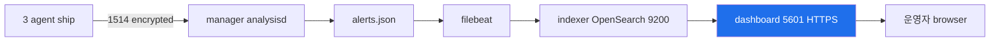
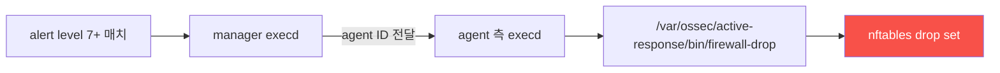

# Week 10 — Wazuh dashboard + 통합 운영 (osquery + ModSec audit + FIM + Active Response)

> **본 주차의 한 줄 요약**
>
> W09 의 manager (analysisd + 11 daemon + 3 agent) 위에서 **dashboard** (Web UI 5601 HTTPS)
> + **OpenSearch indexer** (9200) 의 visualization 활용 + 4 통합 패턴 (① ModSec audit
> ingest 활성 / ② osquery 통합 설계 / ③ syscheck FIM / ④ Active Response). 6v6 의 현
> 상태 — **sysmon-for-linux 미설치** (W11 본격), **osquery daemon 미운영** (ad-hoc only)
> 등 운영 갭 인지 + 보완 계획. 학습 마지막에 **R/B/P 통합 시나리오** (5 source XSS →
> dashboard 1 화면 통합) 수행.
>
> **운영자 한 줄 결론**: dashboard 가 SOC 의 single pane of glass. 모든 source 의 alert
> 이 1 화면에 모이고, 운영자가 5 초 안에 우선순위 판단.

---

## 학습 목표

본 주차 종료 시 학생은 다음 9가지를 **본인 손으로** 할 수 있어야 한다.

1. dashboard 의 5 main panel (Overview / Agents / Modules / Discovery / Rules) +
   접근 방법 (HAProxy `siem.6v6.lab` → dashboard:5601 TLS passthrough).
2. **OpenSearch indexer** (9200) 의 색인 + 쿼리 + dashboard 의 backend 역할.
3. **인증** — admin / 또는 LDAP / SSO 통합 + RBAC.
4. **ModSec audit ship** — web agent 의 ossec.conf 의 `<localfile>` 에 modsec_audit.log
   json 추가 + decoder (0025 Apache / 0250 Apache rule) 매핑.
5. **osquery 통합 설계** — 6v6 의 osqueryd 미운영 → daemon enable + scheduled query +
   /var/log/osquery/osqueryd.results.log ship.
6. **syscheck FIM** — manager + agent 측 `<syscheck>` directive + frequency + 알림 룰.
7. **Active Response** — manager 측 명령 정의 + agent 측 실행 + nftables 자동 차단.
8. **dashboard 트러블슈팅 4 패턴** — indexer 동기화 / login 실패 / panel 빈 화면 / alert
   지연.
9. **R/B/P 시나리오** — Red 가 XSS 5 burst → 5 source (Suricata / ModSec / Apache /
   osquery / syscheck) → dashboard 1 화면 통합 + Active Response 시뮬.

---

## 강의 시간 배분 (3시간 40분)

| 시간      | 내용                                                                   | 유형     |
|-----------|-----------------------------------------------------------------------|----------|
| 0:00–0:25 | 이론 — dashboard 의 역할 + 5 main panel + 인증 모델                     | 강의     |
| 0:25–0:55 | 이론 — OpenSearch indexer + RBAC + 6v6 의 운영 갭 (osquery/sysmon 미운영) | 강의     |
| 0:55–1:05 | 휴식                                                                  | —        |
| 1:05–1:30 | 6v6 실측 — dashboard 접근 + ModSec audit 미설정 + sysmon 미설치          | 강의/토론|
| 1:30–2:00 | 실습 1, 2 — dashboard 인증 + panel navigation                          | 실습     |
| 2:00–2:30 | 실습 3, 4 — ModSec audit ship 설정 + osquery 통합 설계                  | 실습     |
| 2:30–2:40 | 휴식                                                                  | —        |
| 2:40–3:10 | 실습 5, 6 — syscheck FIM + Active Response 시뮬                        | 실습     |
| 3:10–3:30 | 실습 7 — **R/B/P** (XSS 5 burst → 5 source 통합)                        | 실습     |
| 3:30–3:40 | 정리 + W11 (sysmon-for-linux) 예고                                    | 정리     |

---

## 0. 용어 해설

| 용어 | 영문 | 뜻 |
|------|------|----|
| **dashboard** | — | Wazuh 의 Web UI (Kibana fork) |
| **OpenSearch** | — | Elasticsearch fork (Wazuh indexer 가 사용) |
| **panel** | — | dashboard 의 화면 단위 (Overview / Agents / Modules / Discovery / Rules) |
| **Overview panel** | — | 전체 alert 통계 (level / rule / agent 분포) |
| **Agents panel** | — | agent 별 상태 + alert |
| **Modules panel** | — | FIM / SCA / VD / Office365 / GCP 등 모듈 별 화면 |
| **Discovery** | — | OpenSearch 쿼리 + Kibana 식 visualization |
| **RBAC** | Role-Based Access Control | dashboard 의 권한 관리 |
| **filebeat** | — | manager 가 alerts.json 을 indexer 로 ship 하는 도구 |
| **indexer** | — | OpenSearch 백엔드 (색인 + 검색) |
| **syscheck** | — | Wazuh 의 FIM 모듈 |
| **SCA** | Security Configuration Assessment | CIS benchmark 자동 점검 |
| **VD** | Vulnerability Detection | CVE 기반 취약점 점검 |
| **Active Response** | AR | alert 시 자동 명령 (firewall-drop / disable-account 등) |
| **firewall-drop** | — | nftables 의 drop set 에 IP 추가 |
| **disable-account** | — | usermod -L lock |
| **CDB list** | — | constant database (key-value, IOC 화이트리스트 등) |

---

## 1. dashboard 의 자리 — SOC 의 single pane of glass

W09 의 manager (analysisd + alerts.json) 가 raw alert source. **dashboard 가 운영자
UI** — alerts.json 의 모든 라인을 OpenSearch 색인 → 운영자가 쿼리 + filter + chart.

### 1.1 데이터 흐름



### 1.2 6v6 접근

```
학생 PC browser → http(s)://siem.6v6.lab → HAProxy 80/443 → dashboard:5601 TLS passthrough
```

HAProxy 의 `is_siem` ACL 매칭 → backend dashboard → dashboard 의 self-signed cert →
HTTP/HTTPS 응답 → 인증 페이지.

### 1.3 인증 — default admin

```
URL: https://siem.6v6.lab/
User: admin
Password: admin (default — production 즉시 변경)
```

OR LDAP / SSO 통합 (관리자가 설정). 6v6 학습 환경은 default.

---

## 2. 5 main panel — 운영자 화면

### 2.1 Overview panel

전체 통계:
- alert level 분포 (parallel coordinate)
- rule.id top 10
- agent 별 alert 수
- timeline (24h / 7d / 30d)

### 2.2 Agents panel

- agent 별 상태 (Active / Disconnected / Pending)
- 마지막 keepalive
- agent IP / OS / version

### 2.3 Modules panel — 8+ 모듈

| 모듈 | 화면 |
|------|------|
| **Security events** | 모든 alert (default view) |
| **Integrity monitoring** | syscheck FIM 결과 |
| **Vulnerability detection** | CVE 검출 |
| **Configuration assessment** | SCA CIS 점검 |
| **Regulatory compliance** | PCI / HIPAA / GDPR |
| **MITRE ATT&CK** | T1xxx 매핑 |
| **Suricata** | Suricata 통합 (custom)  |
| **Docker listener** | Docker daemon 이벤트 |

### 2.4 Discovery panel — Kibana 식 query

- OpenSearch DSL 또는 KQL (Kibana Query Language)
- 예: `rule.level: 7 AND agent.name: web`
- 시각화 — bar / pie / area / data table

### 2.5 Management 의 Rules / Decoders

- 250+ default decoder + 700+ default rule list
- 검색 + edit (manager API 경유)

---

## 3. 6v6 의 운영 갭 — W10 의 책임

6v6 의 현재 상태 점검 (실측 2026-05-12):

| 갭 | 현재 | 운영 권장 |
|----|------|----------|
| **dashboard 인증** | admin/admin default | 강력 password + RBAC + LDAP |
| **ModSec audit ship** | web ossec.conf 의 localfile 미설정 | `<localfile>` 추가 + decoder 매핑 |
| **osquery daemon** | 미운영 (osqueryi only) | osqueryd 활성 + osquery.conf + log ship |
| **sysmon-for-linux** | 미설치 | W11 에서 본격 설치 |
| **integratord** | 미운영 | Slack / Virustotal 통합 |
| **clusterd** | 미운영 | HA 2+ manager |
| **bastion agent** | 미등록 | 등록 (W09 §4.2 참조) |
| **Active Response** | 미설정 | nftables drop + 자동화 |

본 주차는 ① ModSec audit ship ② osquery 통합 설계 ③ syscheck FIM ④ Active Response
4 갭을 보완.

---

## 4. ModSec audit ship — web agent 의 localfile 추가

### 4.1 현재 상태

```bash
ssh 6v6-web 'sudo grep -B1 -A3 "modsec" /var/ossec/etc/ossec.conf'
# 결과: 비어 있음 (미설정)
```

### 4.2 추가 패치 (시뮬)

```xml
<!-- /var/ossec/etc/ossec.conf 의 <ossec_config> 안 -->
<localfile>
  <log_format>json</log_format>
  <location>/var/log/apache2/modsec_audit.log</location>
</localfile>
```

`log_format json` → Wazuh 가 JSON 라인 그대로 파싱 → audit_data.messages[] 의 `[id "X"]`
embedded 가 0250-apache 룰의 regex 로 매핑.

### 4.3 적용 + 검증

```bash
# patch 적용 (실 적용 — 시뮬은 manager 측 shared config)
ssh 6v6-web 'sudo systemctl restart wazuh-agent'
sleep 5

# attacker XSS 트리거
ssh 6v6-attacker 'curl -s -o /dev/null -H "Host: juice.6v6.lab" "http://10.20.30.1/?q=<script>"'
sleep 8

# manager alerts.json 의 web agent + modsec 매치
ssh 6v6-siem 'sudo tail -20 /var/ossec/logs/alerts/alerts.json | jq "select(.agent.name==\"web\") | {rule_id:.rule.id, desc:.rule.description}"'
```

---

## 5. osquery 통합 설계 — daemon enable + log ship

### 5.1 현재 상태

W07 에서 본 것처럼 6v6 의 osquery 는 osqueryi only. osqueryd 미운영 → scheduled query
없음 → /var/log/osquery/ 비어 있음.

### 5.2 통합 설계 (3 단계)

**1단계 — osquery.conf 작성** (W07 §7-8 참조):
```json
{
  "options": { "logger_path": "/var/log/osquery", "host_identifier": "hostname" },
  "file_paths": { "system_etc": [...], "ssh_keys": [...], "cron_paths": [...] },
  "schedule": {
    "process_snapshot": {"query":"...","interval":60,"snapshot":true},
    "new_users": {"query":"...","interval":600,"removed":false},
    "listening_ports": {"query":"...","interval":60}
  }
}
```

**2단계 — osqueryd enable**:
```bash
sudo systemctl enable --now osqueryd
```

**3단계 — Wazuh agent 의 localfile 추가**:
```xml
<localfile>
  <log_format>json</log_format>
  <location>/var/log/osquery/osqueryd.results.log</location>
</localfile>
```

Wazuh 의 `0545-osquery_rules.xml` 룰이 osquery 결과를 매핑 → alerts.json 에 적재.

### 5.3 통합 효과

- 4 호스트의 host visibility 가 dashboard 의 1 panel 로
- FIM (file_events) + scheduled query 모두 자동 alert
- baseline diff — 분기 검토

---

## 6. syscheck FIM — Wazuh 자체 FIM 모듈

osquery 의 FIM 외에 Wazuh 자체 FIM (syscheck daemon) 도 운영.

### 6.1 ossec.conf 의 `<syscheck>` directives

```xml
<syscheck>
  <disabled>no</disabled>
  <frequency>3600</frequency>
  <scan_on_start>yes</scan_on_start>

  <!-- 핵심 시스템 경로 -->
  <directories realtime="yes" check_all="yes">/etc/passwd,/etc/shadow,/etc/sudoers</directories>
  <directories realtime="yes" check_all="yes">/etc/cron.d,/etc/cron.daily,/etc/cron.hourly</directories>
  <directories realtime="yes" check_all="yes">/root/.ssh</directories>
  <directories realtime="yes" check_all="yes">/etc/apache2/sites-enabled</directories>

  <!-- 무시할 path -->
  <ignore>/etc/mtab</ignore>
  <ignore>/etc/resolv.conf</ignore>
</syscheck>
```

- `realtime="yes"`: inotify 기반 실시간 (FIM)
- `frequency 3600`: 1시간 마다 전체 스캔
- `check_all="yes"`: 모든 속성 (size / hash / mtime / owner)

### 6.2 syscheck 룰 — Wazuh default

| rule.id | 의미 |
|---------|------|
| 550 | Integrity checksum changed |
| 551 | Integrity checksum changed again |
| 553 | File deleted |
| 554 | File added |

운영 — `<directories>` 의 변경 시 자동 alert (default level 7).

### 6.3 osquery FIM 과의 비교

| 항목 | Wazuh syscheck | osquery file_events |
|------|----------------|---------------------|
| 매커니즘 | inotify + scheduled scan | inotify only |
| 결과 | alerts.json | osqueryd.results.log → Wazuh ship |
| 룰 | 550/551/553/554 | 사용자 정의 rule |
| 추가 정보 | hash / mtime / owner | category |

**보완 관계**: 두 도구 동시 운영 권장. Wazuh syscheck = manager 중심 (default), osquery
file_events = 추가 query 기능 (SQL 활용).

---

## 7. Active Response — 자동 차단

### 7.1 동작 원리



### 7.2 manager 측 ossec.conf

```xml
<active-response>
  <command>firewall-drop</command>
  <location>local</location>     <!-- agent 자기 자신에서 실행 -->
  <rules_id>5712,9009001</rules_id>
  <timeout>600</timeout>          <!-- 10분 후 자동 해제 -->
</active-response>
```

rule 5712 = SSH brute force, rule 9009001 = 사용자 정의 (예: sqlmap UA Wazuh 룰).

### 7.3 agent 측 — firewall-drop 스크립트

```bash
#!/bin/sh
# /var/ossec/active-response/bin/firewall-drop
ACTION=$1     # add / delete
SRCIP=$2

case $ACTION in
add)
    nft add element ip six_nat blocklist { $SRCIP }
    ;;
delete)
    nft delete element ip six_nat blocklist { $SRCIP }
    ;;
esac
```

(실 6v6 은 nftables 의 blocklist set + active-response 가 추가/삭제).

### 7.4 위험 + 운영 권장

- **자기 차단 위험**: 운영자 IP 가 IOC 매치 시 자기 차단
- **방어**: `<allow_list>` 에 운영자 IP / subnet 추가
- **timeout**: 너무 짧으면 효과 없음, 너무 길면 정상 사용자 차단 지속
- **로그**: `/var/ossec/logs/active-responses.log` 에 모든 AR 기록 + git audit

---

## 8. 트러블슈팅 — dashboard 운영 4 패턴

### 8.1 패턴 1 — login 실패

증상: admin/admin 도 안 됨.

진단: dashboard container log + indexer 의 password 검증.

```bash
ssh 6v6-wazuh-dashboard 'tail /var/log/wazuh-dashboard/*.log 2>&1 | tail'
```

해결: `wazuh-passwords-tool` 또는 indexer 의 internal_users.yml 의 password hash 변경.

### 8.2 패턴 2 — panel 빈 화면

증상: dashboard 의 Discovery 또는 Overview 가 비어 있음.

원인:
1. filebeat 가 manager 와 indexer 사이 ship 안 됨
2. indexer 의 색인 부재
3. dashboard 의 time range 가 잘못된 기간

진단:
```bash
ssh 6v6-siem 'sudo systemctl status filebeat'
ssh 6v6-wazuh-indexer 'curl -k -u admin:<pw> https://localhost:9200/_cat/indices/wazuh-*'
```

### 8.3 패턴 3 — alert 지연

증상: Suricata alert 발생 → 30+ 초 후 dashboard 에 표시.

원인:
1. manager analysisd 부하
2. filebeat queue 부담
3. indexer refresh interval (기본 1s)

해결: 보통 < 10 초 OK. 30+ 초 면 manager / indexer 자원 확인.

### 8.4 패턴 4 — RBAC 권한 오류

증상: 일부 사용자가 Modules 또는 Agents panel 못 봄.

해결: dashboard 의 Security > Roles 설정 + 사용자 매핑.

---

## 9. 사례 분석

### 9.1 ISMS-P 매핑

| Sub-control | 본 주차 활동 |
|-------------|-------------|
| 2.9.4 (모니터링 통합) | dashboard 의 single pane of glass |
| 2.9.6 (이상 행위 감지) | Active Response + level 7+ 자동 차단 |
| 2.10.3 (보안 점검) | SCA 모듈 + CIS benchmark |

### 9.2 NIST CSF — RS.RP (Response Planning)

Active Response 가 RS.RP-1 의 자동화 구현.

### 9.3 운영 사고 3 사례

**사례 1 — Active Response 자기 차단**:
```
운영자: AR firewall-drop 활성 → 자기 IP 가 IOC 매치 → 자기 차단
복구: bastion 의 console 접속 + AR allow_list 추가 + IP 해제
교훈: AR 도입 전 allow_list 사전 정의 + 시뮬 1주
```

**사례 2 — dashboard 의 alert 지연 100+ 초**:
```
운영자: manager 부하 시 alerts.json 적재 30+ 초 지연
원인: filebeat queue full + indexer disk I/O 부족
복구: filebeat의 spool size + indexer SSD
```

**사례 3 — dashboard 의 빈 화면 (filebeat 실패)**:
```
운영자: filebeat 가 indexer 연결 실패 → dashboard 빈 화면 → "SIEM 다운" 으로 인식
복구: filebeat restart + 연결 keystore 재구성
```

---

## 10. 실습 시나리오 (4 축)

### 실습 1 — dashboard 접근 + 인증

```bash
# 외부에서 dashboard 응답 확인
curl -k -o /dev/null -s -w "%{http_code}\n" -H "Host: siem.6v6.lab" "https://10.20.30.1/"
# 302 또는 401 — 인증 페이지로 리다이렉트

# 학생 PC 브라우저로 https://siem.6v6.lab 접근 → admin/admin
```

### 실습 2 — OpenSearch indexer 의 색인

```bash
ssh 6v6-wazuh-indexer 'curl -k -u admin:<pw> "https://localhost:9200/_cat/indices/wazuh-*?h=index,docs.count"'
```

### 실습 3 — ModSec audit ship (web agent.conf 패치 시뮬)

§4 의 patch + 검증.

### 실습 4 — osquery 통합 설계 (시뮬, 실 적용은 W11)

§5 의 3 단계 + 시뮬.

### 실습 5 — syscheck FIM 검증

```bash
ssh 6v6-siem 'sudo grep -B1 -A5 "<syscheck>" /var/ossec/etc/ossec.conf | head -20'
# 파일 변경 트리거 + 60초 후 alerts.json 의 rule 550 매치
```

### 실습 6 — Active Response 시뮬

```bash
ssh 6v6-siem 'sudo grep -B1 -A5 "active-response" /var/ossec/etc/ossec.conf | head -15'
# AR 활성 시뮬 + alert 발생 + active-responses.log 확인
```

### 실습 7 — **R/B/P** XSS 5 burst → 5 source 통합

§11 참조.

---

## 11. R/B/P 통합 — XSS 5 burst → 5 source dashboard 통합

**Red**:
```bash
for i in 1 2 3 4 5; do
    ssh 6v6-attacker "curl -s -o /dev/null -H 'Host: juice.6v6.lab' 'http://10.20.30.1/?q=<script>$i</script>'"
done
```

**Blue — 5 source 추적**:
1. Suricata (이미 ingest) — ips agent rule 86xxx
2. ModSec (활성 시) — web agent Apache 0250 룰
3. Apache access log — web agent 의 access.log
4. osquery (활성 시) — process / socket / file
5. syscheck (변경 발생 시) — rule 550/554

```bash
DELTA=$(ssh 6v6-siem 'sudo wc -l /var/ossec/logs/alerts/alerts.json | awk "{print \$1}"')
ssh 6v6-siem "sudo tail -50 /var/ossec/logs/alerts/alerts.json | jq -r '.rule.groups | join(\",\")' | sort | uniq -c"
```

**Purple — dashboard 통합 visualization**:
- Overview: alert level 분포 + timeline
- Discovery: `rule.id: 86601 OR rule.id: 30xxx`
- MITRE ATT&CK panel: T1190 (Exploit Public-Facing App)

---

## 12. 과제

### A. ModSec audit ship 적용 (필수, 30점)

§4 의 patch 실 적용 + 5 XSS burst + alerts.json 의 web agent + apache 룰 매치 검증.

### B. osquery 통합 설계 (심화, 30점)

§5 의 3 단계 설계 문서 + osquery.conf draft + Wazuh agent.conf draft.

### C. R/B/P 보고서 (정성, 30점)

실습 7 결과 + 5 source 매핑 + Active Response 권장.

### D. dashboard 트러블슈팅 시뮬 (정성, 10점)

§8 의 4 패턴 중 1 패턴 시뮬 + 진단 + 복구.

---

## 13. 평가 기준

| 항목 | 비중 |
|------|------|
| ModSec ship (A) | 30% |
| osquery 설계 (B) | 30% |
| R/B/P (C) | 30% |
| 트러블슈팅 (D) | 10% |

---

## 14. 핵심 정리 (8 줄)

1. **dashboard = SOC single pane of glass** — 5 main panel + RBAC + 인증
2. **OpenSearch indexer** (9200) + **filebeat** ship 흐름
3. **6v6 운영 갭 4** — dashboard 인증 / ModSec ship / osquery daemon / sysmon 미설치
4. **ModSec audit ship** — web ossec.conf 의 `<localfile>` JSON + 0250 decoder 매핑
5. **osquery 통합** — osqueryd enable + osquery.conf + Wazuh agent 의 ship
6. **syscheck FIM** — `<directories realtime="yes">` + rule 550/551/553/554
7. **Active Response** — manager 의 `<active-response>` + agent 의 firewall-drop +
   nftables drop set + allow_list
8. **R/B/P** — XSS 5 burst → 5 source 통합 → dashboard 1 화면

---

## 15. 다음 주차 (W11) 예고

- **주제**: sysmon-for-linux 본격 설치 + decoder + ProcessCreate / NetworkConnect / FileCreate event
- **6v6 현 상태**: sysmon 미설치 — W11 에서 본격 설치
- **연결**: osquery 의 snapshot vs sysmon 의 event stream 비교 (W07 §9 참조)
- **R/B/P 시나리오**: Red 가 의심 process spawn → sysmon ProcessCreate event → Wazuh
  rule 0800-sysmon_id_1 매치 → dashboard
