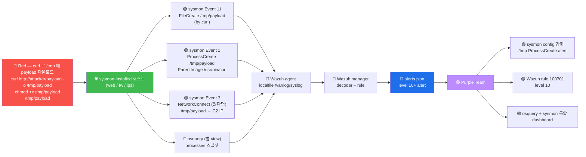

# Week 11 — sysmon-for-linux — eBPF 기반 호스트 이벤트 (신규)

> **Microsoft Sysmon for Linux** (2021) = Windows Sysmon 의 Linux 포팅. eBPF +
> auditd 기반으로 process / network / file 이벤트를 실시간 stream. osquery (W07) 가
> "OS 의 SQL snapshot" 이라면 sysmon 은 "OS 의 event stream". 본 주차는 sysmon
> 의 설치 + config + 9 EventID + Wazuh 통합 모두 다룬다.

## 학습 목표

학생은 본 주차 종료 시 다음을 수행할 수 있어야 한다.

1. **sysmon-for-linux 의 정의·역사·라이선스**
2. **eBPF 기반 의 동작** + auditd 와의 차이
3. **9 핵심 EventID** (1 ProcessCreate / 3 NetworkConnect / 11 FileCreate / 등)
4. **config XML 작성** + filter (include / exclude)
5. **SwiftOnSecurity / Olaf Hartong config** 의 표준 사용
6. **Wazuh agent 통합** (localfile + decoder + rule)
7. **osquery vs sysmon** 의 query-based vs event-driven 비교 + 보완 운영
8. **운영 권장** — 호스트별 + noise 관리 + 분기 review

## 강의 시간 배분 (3시간 40분)

| 시간      | 내용                                                                  | 유형 |
|-----------|-----------------------------------------------------------------------|------|
| 0:00–0:30 | 이론 — sysmon 의 정의·역사·왜 필요한가                                  | 강의 |
| 0:30–1:00 | 이론 — eBPF 기반 + 9 EventID                                          | 강의 |
| 1:00–1:10 | 휴식                                                                   | —    |
| 1:10–1:40 | 이론 — config XML + filter 패턴                                       | 강의 |
| 1:40–2:00 | 이론 — Wazuh 통합 (localfile + decoder + rule)                       | 강의 |
| 2:00–2:30 | 실습 1, 2 — 설치 + 가동 확인                                           | 실습 |
| 2:30–2:40 | 휴식                                                                   | —    |
| 2:40–3:10 | 실습 3, 4 — Event 분석 + Wazuh 통합                                    | 실습 |
| 3:10–3:30 | 실습 5 — osquery + sysmon 비교 + R/B/P                                | 실습 |
| 3:30–3:40 | 정리 + W12 (OpenCTI 개론) 예고                                         | 정리 |

---

## 1. sysmon-for-linux 가 등장한 이유

### 1.1 Linux 의 host 가시화 도구 비교 (2024)

| 도구 | 출시 | 모델 | 장점 | 단점 |
|------|------|------|------|------|
| **auditd** | 2003 | kernel audit subsystem | 표준 + 안정 | 출력 형식 비통일, 룰 작성 복잡 |
| **osquery** | 2014 | SQL snapshot | 헌팅 친화, 5 카테고리 | snapshot 한계 (짧은 시간 event 놓침) |
| **falco** | 2016 | runtime security | Kubernetes 친화 | k8s 외 어색 |
| **sysmon-for-linux** | 2021 | event stream (Sysmon 호환) | Sysmon EventID 호환 + eBPF | 모던 (학습 필요) |

### 1.2 Sysmon (Windows) 의 성공

```
Windows Sysmon (2014 Mark Russinovich):
  - SOC 의 가장 표준 호스트 도구
  - 30+ EventID
  - SwiftOnSecurity config 의 community 표준
  - Sigma rule 의 대부분이 Sysmon 기반

Linux 의 동급 도구 부재 → osquery 도 일부 한계
2021 Microsoft 가 Sysmon for Linux 출시 — Sysmon EventID 호환 + eBPF 기반
```

### 1.3 sysmon-for-linux 의 가치

```
1. Sysmon 의 EventID 호환 (1 / 3 / 5 / 11 / 22 / 23 등)
   → SOC 가 Windows + Linux 통합 운영
2. eBPF 기반 (모던 + 성능)
   → 안전 (kernel 안에 verified bytecode 만)
   → 가벼움 (legacy auditd 보다)
3. Sigma rule 의 Linux 호환
   → Detection Engineering 의 표준화
```

---

## 2. eBPF 기반의 동작 원리

### 2.1 eBPF (extended Berkeley Packet Filter)

```
eBPF = 1992 BPF 의 진화 (2014 Alexei Starovoitov)
  - Linux kernel 안에 user 정의 bytecode 안전 실행
  - verifier 가 bytecode 검증 (무한 loop / 비정상 메모리 접근 차단)
  - JIT compiler 가 kernel native 코드 변환
  - 매우 빠름 + 안전

사용처:
  - 네트워크 (XDP / tc): 패킷 처리
  - 보안 (sysmon / falco / tetragon): syscall hooking
  - 트레이싱 (bpftrace / bcc): kernel debug
  - 관찰 (Cilium): kubernetes networking
```

### 2.2 sysmon-for-linux 의 eBPF 활용

```
syscall execve()    →    eBPF probe    →    sysmon 의 logger
fork() / exit()
connect() / accept()
open() / write() / unlink()
        │
        ▼
/var/log/sysmonforlinux.log (또는 syslog) — JSON 또는 XML
```

각 syscall 의 hook 시:
- syscall arguments + caller context (process / user / parent)
- timestamp + process tree
- network packet 의 metadata (5-tuple)
- file path + mode

### 2.3 sysmon vs auditd vs osquery 비교

| 측면 | auditd | osquery | sysmon |
|------|--------|---------|--------|
| 출시 | 2003 | 2014 | 2021 |
| 모델 | kernel audit | SQL snapshot | event stream |
| 시점 | 실시간 (event) | 주기적 (query) | 실시간 (event) |
| backend | netlink | DB | eBPF + audit |
| 출력 | text (비통일) | JSON | XML / JSON |
| 룰 작성 | complex | SQL | XML config |
| Sigma 호환 | △ | △ | ✓ |
| 운영 가치 | 표준 (legacy) | 헌팅 | 이벤트 stream |

**운영 권장**: osquery (헌팅) + sysmon (이벤트 stream) **둘 다** 사용. 보완 관계.

---

## 3. 9 핵심 EventID

Windows Sysmon 의 30+ EventID 중 Linux 의 9 핵심:

### 3.1 Event 1 — ProcessCreate (가장 핵심)

```xml
<Event>
  <System>
    <EventID>1</EventID>
    <TimeCreated SystemTime="2026-05-12T10:30:45.123Z"/>
  </System>
  <EventData>
    <Data Name="UtcTime">2026-05-12 10:30:45.123</Data>
    <Data Name="ProcessGuid">{12345678-1234-1234-1234-123456789012}</Data>
    <Data Name="ProcessId">12345</Data>
    <Data Name="Image">/usr/bin/curl</Data>
    <Data Name="CommandLine">curl -s http://example.com</Data>
    <Data Name="CurrentDirectory">/home/ccc</Data>
    <Data Name="User">ccc</Data>
    <Data Name="LogonGuid">{...}</Data>
    <Data Name="LogonId">1000</Data>
    <Data Name="TerminalSessionId">0</Data>
    <Data Name="IntegrityLevel">High</Data>
    <Data Name="Hashes">SHA256=abc...</Data>
    <Data Name="ParentProcessGuid">{...}</Data>
    <Data Name="ParentProcessId">11111</Data>
    <Data Name="ParentImage">/usr/sbin/sshd</Data>
    <Data Name="ParentCommandLine">sshd: ccc@pts/0</Data>
  </EventData>
</Event>
```

**활용**:
- LOLBin (Living-off-the-Land) detection — 정상 binary 의 악성 사용
- parent process tree — "ssh 가 어떻게 spawn 됐는가"
- command line 분석 — 의심 인자 (예: base64 -d | sh)

### 3.2 Event 3 — NetworkConnect

```xml
<Data Name="Image">/usr/bin/curl</Data>
<Data Name="DestinationIp">192.168.0.110</Data>
<Data Name="DestinationPort">80</Data>
<Data Name="Protocol">tcp</Data>
```

**활용**:
- C2 communication detection
- 비정상 outbound (예: bash 가 외부 IP conn — 의심)
- DNS exfiltration 의 일부

### 3.3 Event 5 — ProcessTerminate

```xml
<Data Name="ProcessGuid">{...}</Data>
<Data Name="ProcessId">12345</Data>
<Data Name="Image">/usr/bin/curl</Data>
```

**활용**:
- process lifecycle 추적
- 짧은 시간 의 process (실행 직후 종료) 분석

### 3.4 Event 11 — FileCreate

```xml
<Data Name="Image">/usr/bin/curl</Data>
<Data Name="TargetFilename">/tmp/shell.sh</Data>
<Data Name="CreationUtcTime">...</Data>
```

**활용**:
- dropper malware detection (예: curl 이 /tmp 에 shell.sh 생성)
- web shell detection (/var/www/ 에 .php 생성)
- 의심 디렉토리 (/tmp, /var/tmp, /dev/shm) 모니터링

### 3.5 Event 22 — DnsQuery

```xml
<Data Name="ProcessGuid">{...}</Data>
<Data Name="QueryName">attacker.com</Data>
<Data Name="QueryStatus">0</Data>
<Data Name="QueryResults">1.2.3.4</Data>
```

**활용**:
- DGA (Domain Generation Algorithm) detection
- DNS tunneling 의 알려진 도메인 매칭
- malware 의 C2 도메인 검출

### 3.6 Event 23 — FileDelete (선택)

```xml
<Data Name="Image">/usr/bin/shred</Data>
<Data Name="TargetFilename">/tmp/evidence.log</Data>
```

**활용**: anti-forensics detection (shred / wipe).

### 3.7 Event 4 — Sysmon service state change

sysmon 자체의 가동 상태 — 비활성 시 즉시 alert.

### 3.8 Event 9 — RawAccessRead

```xml
<Data Name="Image">/usr/bin/dd</Data>
<Data Name="Device">/dev/sda1</Data>
```

**활용**: raw disk read (filesystem 우회 시도 — 매우 위험).

### 3.9 Event 16 — Sysmon config state changed

sysmon 의 config 변경 추적.

---

## 4. config XML 작성

### 4.1 기본 구조

```xml
<Sysmon schemaversion="4.81">
  <!-- HashAlgorithms — 어느 hash 알고리즘 사용 -->
  <HashAlgorithms>SHA256</HashAlgorithms>

  <EventFiltering>
    <ProcessCreate onmatch="exclude">
      <!-- noise 제외 -->
      <Image condition="end with">apt</Image>
      <Image condition="end with">/cron</Image>
      <Image condition="end with">/systemd</Image>
    </ProcessCreate>

    <NetworkConnect onmatch="include">
      <!-- 핵심 port 만 -->
      <DestinationPort condition="is">22</DestinationPort>
      <DestinationPort condition="is">80</DestinationPort>
      <DestinationPort condition="is">443</DestinationPort>
    </NetworkConnect>

    <FileCreate onmatch="include">
      <!-- 의심 디렉토리만 -->
      <TargetFilename condition="begin with">/tmp/</TargetFilename>
      <TargetFilename condition="begin with">/var/tmp/</TargetFilename>
      <TargetFilename condition="begin with">/dev/shm/</TargetFilename>
    </FileCreate>
  </EventFiltering>
</Sysmon>
```

### 4.2 onmatch + condition

```
onmatch="include" : 매치되는 event 만 기록 (whitelist)
onmatch="exclude" : 매치되는 event 제외 (blacklist)

condition values:
  is                : 정확히 일치
  is not            : 다름
  contains          : 포함
  contains all      : 모든 단어 포함
  contains any      : 단어 중 하나
  excludes          : 제외
  begin with        : 시작
  end with          : 끝
  less than         : 숫자 비교
  more than
  image             : 정확히 path
```

### 4.3 운영 권장 config (SwiftOnSecurity / Olaf Hartong)

```
SwiftOnSecurity 의 Sysmon-Config (Windows 원본):
  https://github.com/SwiftOnSecurity/sysmon-config

Olaf Hartong 의 sysmon-modular:
  https://github.com/olafhartong/sysmon-modular
  - modular 형식 (각 Technique 별 분리)
  - ATT&CK 매핑 명시적

Linux 의 community 표준:
  https://github.com/Sysinternals/SysmonForLinux/blob/main/sysmonconfig-example.xml
```

### 4.4 본 lab 의 권장 config (간소)

```xml
<Sysmon schemaversion="4.81">
  <HashAlgorithms>SHA256</HashAlgorithms>

  <EventFiltering>
    <!-- ProcessCreate — noise 제외 -->
    <ProcessCreate onmatch="exclude">
      <Image condition="end with">/apt</Image>
      <Image condition="end with">/apt-get</Image>
      <Image condition="end with">/dpkg</Image>
      <Image condition="end with">/systemd</Image>
      <Image condition="end with">/cron</Image>
      <Image condition="end with">/logrotate</Image>
    </ProcessCreate>

    <!-- NetworkConnect — 핵심 + 의심 port -->
    <NetworkConnect onmatch="include">
      <DestinationPort condition="is">22</DestinationPort>
      <DestinationPort condition="is">80</DestinationPort>
      <DestinationPort condition="is">443</DestinationPort>
      <DestinationPort condition="is">3389</DestinationPort>
      <DestinationPort condition="is">4444</DestinationPort>  <!-- 자주 사용되는 reverse shell port -->
      <DestinationPort condition="is">8080</DestinationPort>
    </NetworkConnect>

    <!-- FileCreate — 의심 디렉토리 -->
    <FileCreate onmatch="include">
      <TargetFilename condition="begin with">/tmp/</TargetFilename>
      <TargetFilename condition="begin with">/var/tmp/</TargetFilename>
      <TargetFilename condition="begin with">/dev/shm/</TargetFilename>
      <TargetFilename condition="begin with">/var/www/</TargetFilename>
    </FileCreate>

    <!-- DNS -->
    <DnsQuery onmatch="exclude">
      <QueryName condition="end with">.local</QueryName>
      <QueryName condition="end with">.6v6.lab</QueryName>
    </DnsQuery>
  </EventFiltering>
</Sysmon>
```

---

## 5. 설치 + 가동

### 5.1 Microsoft 공식 APT 저장소

```bash
# 1단계: GPG 키 추가
sudo wget -O- https://packages.microsoft.com/keys/microsoft.asc | \
    sudo gpg --dearmor -o /usr/share/keyrings/microsoft.gpg

# 2단계: APT 저장소 추가
echo "deb [arch=amd64 signed-by=/usr/share/keyrings/microsoft.gpg] \
    https://packages.microsoft.com/ubuntu/22.04/prod jammy main" | \
    sudo tee /etc/apt/sources.list.d/microsoft.list

# 3단계: 패키지 설치
sudo apt-get update
sudo apt-get install -y sysmonforlinux
```

### 5.2 config 설치 + 시작

```bash
# config 다운로드 (예시)
sudo wget -O /etc/sysmon.xml \
    https://raw.githubusercontent.com/Sysinternals/SysmonForLinux/main/sysmonconfig-example.xml

# 첫 실행 — EULA accept + config install
sudo sysmon -accepteula -i /etc/sysmon.xml

# systemd 활성
sudo systemctl enable --now sysmon
```

### 5.3 검증

```bash
# config 확인
sudo sysmon -s

# event 발생 확인
sudo journalctl -u sysmon --since "5 min ago"
sudo tail -10 /var/log/syslog | grep -i sysmon

# 또는 /var/log/sysmonforlinux.log
sudo tail /var/log/sysmonforlinux.log
```

---

## 6. Wazuh 통합

### 6.1 agent 측 localfile

```xml
<!-- /var/ossec/etc/ossec.conf 또는 manager 의 shared agent.conf -->
<localfile>
  <log_format>syslog</log_format>
  <location>/var/log/syslog</location>
</localfile>
```

sysmon 이 syslog 로 출력 → Wazuh agent 가 ingest.

### 6.2 manager 측 decoder

```xml
<!-- /var/ossec/etc/decoders/local_decoder.xml -->
<decoder name="sysmon-event1">
  <prematch>EventID: 1</prematch>
  <regex>Image: (\S+).*?CommandLine: (.+?).*?User: (\S+).*?ParentImage: (\S+)</regex>
  <order>image, commandline, user, parent_image</order>
</decoder>

<decoder name="sysmon-event3">
  <prematch>EventID: 3</prematch>
  <regex>Image: (\S+).*?DestinationIp: (\S+).*?DestinationPort: (\S+)</regex>
  <order>image, destination_ip, destination_port</order>
</decoder>
```

### 6.3 manager 측 rule

```xml
<!-- /var/ossec/etc/rules/local_rules.xml -->
<group name="sysmon,linux,">

  <rule id="100700" level="3">
    <decoded_as>sysmon-event1</decoded_as>
    <description>Sysmon — ProcessCreate</description>
  </rule>

  <rule id="100701" level="10">
    <if_sid>100700</if_sid>
    <field name="image">^/tmp/</field>
    <description>Sysmon — Process created from /tmp (의심)</description>
  </rule>

  <rule id="100702" level="10">
    <if_sid>100700</if_sid>
    <field name="parent_image">/usr/bin/curl</field>
    <description>Sysmon — child of curl (download → exec 패턴)</description>
  </rule>

</group>
```

### 6.4 Wazuh 의 기본 sysmon rule

Wazuh 4.10 의 기본 ruleset 에 sysmon 룰 포함:
- `0330-sysmon_rules.xml` (base)
- `0800-sysmon_id_1.xml` (ProcessCreate — Linux 핵심)
- `0810-sysmon_id_3.xml` (NetworkConnect)
- `0830-sysmon_id_11.xml` (FileCreate)
- `0945-sysmon_id_10.xml` (ProcessAccess)

---

## 7. osquery vs sysmon 비교 + 보완

### 7.1 같은 사건의 두 view

```
사건: attacker 가 /tmp/payload 실행

osquery 의 view (다음 query 시 — 5분 후):
  SELECT pid, name, path FROM processes WHERE name='payload';
  결과: pid 12345 / name=payload / path=/tmp/payload
  (단, 실 process 가 5분 안에 종료되면 놓침)

sysmon 의 view (즉시):
  EventID 1 ProcessCreate
  Image=/tmp/payload
  ParentImage=/usr/bin/curl (또는 다른)
  CommandLine=/tmp/payload --c2 attacker.com
  timestamp=2026-05-12 10:30:45
```

**보완**:
- osquery → 헌팅 (특정 시점의 snapshot)
- sysmon → 이벤트 stream (실시간 + 짧은 process 포착)

### 7.2 보완 운영 모델

```
1. sysmon — 실시간 event 캡처 → SOC 분석가가 alert 인지
2. osquery — 헌팅 쿼리 → 분기별 baseline 점검
3. 둘 다 → Wazuh manager 의 alerts.json 에 통합
4. ATT&CK Navigator → Coverage Matrix 측정
```

---

## 8. ATT&CK 매핑

본 주차의 sysmon 활용 = 모든 ATT&CK Technique 의 detect 가능.

| Technique | sysmon Event |
|-----------|--------------|
| T1059 Command Execution | Event 1 ProcessCreate |
| T1071 C2 | Event 3 NetworkConnect |
| T1505.003 Web Shell | Event 11 FileCreate on /var/www |
| T1543 systemd | Event 1 (systemd-* parent) |
| T1547.006 LD_PRELOAD | Event 1 의 환경 변수 |
| T1574 Hijack Execution Flow | Event 1 의 parent 분석 |
| T1083 File Discovery | Event 1 + 11 |

---

## 9. R/B/P 시나리오 — sysmon detection 1 사이클



---

## 10. 실습 1~5

### 실습 1 — sysmon 설치 상태 확인 (시뮬)

```bash
ssh 6v6-web '
echo "=== sysmon 설치 확인 ==="
which sysmon 2>&1
apt-cache policy sysmonforlinux 2>&1 | head -5
ls -la /var/log/sysmonforlinux.log 2>&1
echo ""
echo "본 lab 환경에 sysmon 미설치 — W11 학습은 패턴 + Wazuh 통합 시뮬"
'
```

### 실습 2 — config XML 작성 + syntax 검증

```bash
ssh 6v6-web '
cat > /tmp/sysmon-config.xml <<EOF
<Sysmon schemaversion="4.81">
  <HashAlgorithms>SHA256</HashAlgorithms>
  <EventFiltering>
    <ProcessCreate onmatch="include">
      <Image condition="begin with">/tmp/</Image>
      <Image condition="begin with">/var/tmp/</Image>
      <Image condition="begin with">/dev/shm/</Image>
    </ProcessCreate>

    <NetworkConnect onmatch="include">
      <DestinationPort condition="is">22</DestinationPort>
      <DestinationPort condition="is">4444</DestinationPort>
      <DestinationPort condition="is">8080</DestinationPort>
    </NetworkConnect>

    <FileCreate onmatch="include">
      <TargetFilename condition="begin with">/tmp/</TargetFilename>
      <TargetFilename condition="begin with">/var/www/</TargetFilename>
    </FileCreate>
  </EventFiltering>
</Sysmon>
EOF

cat /tmp/sysmon-config.xml
echo ""
echo "=== XML syntax (xmllint) 검증 ==="
xmllint --noout /tmp/sysmon-config.xml 2>&1 && echo "VALID" || echo "INVALID"
'
```

### 실습 3 — Event 1 시뮬 (수동 명령)

```bash
ssh 6v6-web '
# sysmon 미설치 → 명령 실행만 시뮬
echo "=== Event 1 ProcessCreate 시뮬 ==="

# curl 으로 fake payload 다운로드 + 실행 (영향 없는 명령)
curl -s http://10.20.30.1/ -o /tmp/test_payload 2>&1 | head
ls -la /tmp/test_payload
file /tmp/test_payload

# 정리
rm -f /tmp/test_payload

echo ""
echo "sysmon 가 가동 중이라면 다음 Event 발생:"
echo "  Event 11 FileCreate /tmp/test_payload (by curl)"
echo "  Event 1 ProcessCreate curl (parent: bash)"
'
```

### 실습 4 — Wazuh 통합 시뮬

```bash
ssh 6v6-web '
echo "=== /var/log/syslog 의 sysmon event 시뮬 ==="
# sysmon 미설치 → fake syslog 줄 추가 (학습 시뮬)
echo "$(date) sysmon: EventID: 1 Image: /tmp/payload CommandLine: /tmp/payload --c2 1.2.3.4 User: ccc ParentImage: /usr/bin/curl" | \
    sudo tee -a /var/log/syslog

echo ""
echo "=== Wazuh decoder + rule 시뮬 ==="
echo "decoder: sysmon-event1 매치"
echo "rule: 100701 (level 10) — process from /tmp"
echo "alerts.json 에 기록 예상 (실 활성 시)"
'
```

### 실습 5 — osquery vs sysmon 비교

```bash
ssh 6v6-web '
echo "=== osquery 의 processes 스냅샷 ==="
sudo osqueryi --json "SELECT pid, name, cmdline, parent FROM processes WHERE name=\"curl\" LIMIT 3;" 2>&1 | head

echo ""
echo "=== sysmon 가 본 view (가상) ==="
echo "Event 1 ProcessCreate:"
echo "  - Image: /usr/bin/curl"
echo "  - CommandLine: curl -s http://10.20.30.1/"
echo "  - ParentImage: /bin/bash"
echo "  - timestamp: $(date -Iseconds)"
echo ""
echo "비교:"
echo "  osquery: snapshot — 현재 실행 중 process 만"
echo "  sysmon: stream — 모든 ProcessCreate event (실 끝난 것 포함)"
'
```

---

## 11. R/B/P 보고서

```markdown
# W11 R/B/P 보고서 — sysmon-for-linux

## Red 측 (시뮬)
- /tmp 에 payload 생성 (curl)
- payload 실행 (Event 1 의 parent: curl 패턴)
- C2 outbound (Event 3 의 dst port)

## Blue 측 (sysmon 가동 가정)
| Event | sysmon detect | osquery detect |
| 1 ProcessCreate | ✓ (실시간) | ✓ (5분 안에 query 시) |
| 3 NetworkConnect | ✓ | △ (socket 의 활성만) |
| 11 FileCreate | ✓ | △ (file_events 활성 시) |
| 22 DnsQuery | ✓ | ✗ |

총 Coverage: sysmon 100% / osquery 50%

## Purple 측 권장
1. sysmon 4 호스트 (fw / ips / web / bastion) 설치
2. config 의 noise 제외 (apt / cron / systemd-)
3. Wazuh decoder + rule (100700-100702 시리즈)
4. osquery + sysmon 보완 운영
5. ATT&CK Navigator 의 Coverage 측정
```

---

## 12. 한국 사례 + 표준

### 12.1 ISMS-P 2.9.6

이상행위 감지 — sysmon 의 Event 1/3/11 매핑.

### 12.2 Sigma rule 표준

```
https://github.com/SigmaHQ/sigma
Linux 카테고리의 대부분이 sysmon EventID 기반
한국 ISAC / KISA 와 community share
```

---

## 13. 과제

### A. sysmon 설치 + 검증 (필수, 40점)

본 lab 의 4 호스트 (web / fw / ips / bastion) 에 sysmon 설치 + config 적용 +
Event 발생 검증.

(인프라 변경 필요 — Dockerfile patch + 재빌드)

### B. config XML 작성 (심화, 30점)

본 lab 환경에 맞는 filter 5+ 작성 + xmllint syntax 검증 + ATT&CK Technique 매핑.

### C. Wazuh 통합 decoder + rule (정성, 30점)

sysmon Event 1/3/11 의 Wazuh decoder + rule 작성 + 가상 시뮬.

---

## 14. 핵심 정리 (10 줄)

1. **sysmon-for-linux** = Microsoft 의 2021 Sysmon 포팅 + eBPF 기반
2. **Sysmon EventID 호환** (1/3/5/11/22/23 등)
3. **eBPF** = 모던 + 안전 + 가벼움 (auditd 보다)
4. **9 핵심 EventID** — ProcessCreate / NetworkConnect / FileCreate / DnsQuery 등
5. **config XML** + filter (include / exclude + 10 condition)
6. **SwiftOnSecurity / Olaf Hartong** = community config 표준
7. **Wazuh 통합** — localfile + decoder + rule
8. **osquery + sysmon** = 보완 운영 (snapshot + stream)
9. **W11 R/B/P** — Red curl→/tmp/payload → sysmon 3 Event → Wazuh
10. **W12 (OpenCTI 개론)** 다음 주차 — CTI 표준 (STIX / TAXII)
