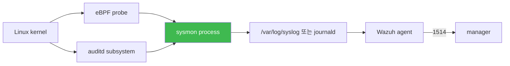

# Week 11 — sysmon-for-linux — Event Stream 기반 호스트 가시화

> **본 주차의 한 줄 요약**
>
> Microsoft Sysinternals 의 **Sysmon for Linux** (eBPF + auditd 기반) 으로 **event stream**
> 호스트 가시화. W07 osquery (snapshot, ad-hoc query) 와 보완 관계. 6v6 의 **4 호스트
> 모두 sysmon 미설치** (실측 2026-05-12) — 본 주차에서 설치 + config.xml + Wazuh 통합
> + 6 핵심 Event (ProcessCreate / NetworkConnect / FileCreate / ProcessTerminate /
> ImageLoad / ProcessAccess) + R/B/P. 학습 마지막에 Red 가 base64 payload 실행 →
> sysmon Event 1 → Wazuh rule 0800-sysmon_id_1 매치 → dashboard.
>
> **운영자 한 줄 결론**: osquery 는 "지금 상태", sysmon 은 "방금 무슨 일이 있었는가".
> 두 도구 동시 운영이 호스트 가시화의 정답.

---

## 학습 목표

1. sysmon vs osquery 비교 — event stream vs snapshot, low latency vs flexible query.
2. Sysmon for Linux 의 eBPF + auditd 기반 아키텍처.
3. 9+ Event ID 의미 + Linux 활용 6 핵심 (1 / 3 / 5 / 7 / 10 / 11).
4. config.xml 의 RuleGroup + Include / Exclude 패턴.
5. 설치 절차 (4 호스트) — apt / .deb / 의존성 (libbpf, auditd).
6. sysmon log → Wazuh agent → manager 의 0800-sysmon_id_1 등 default 룰 매핑.
7. R/B/P — Red base64 payload → sysmon Event 1 → Wazuh alert.

---

## 1. sysmon vs osquery — 보완 관계

| 항목 | osquery (W07) | sysmon-for-linux (W11) |
|------|---------------|-------------------------|
| 모델 | **snapshot** (시점) | **event stream** (실시간) |
| query | SQL (interactive) | config.xml + auditd |
| 데이터 source | 158 테이블 | eBPF + auditd |
| schedule | osquery.conf 의 schedule | 항상 실시간 |
| 강점 | flexible / SQL JOIN | low-latency / process tree |
| 약점 | event 지연 | XML config 복잡 |
| 6v6 상태 | 설치 (osqueryi only) | **미설치** (W11 본격) |

**운영 권장**: 두 도구 동시 운영.

---

## 2. Sysmon for Linux 아키텍처



- **eBPF**: 커널 verified bytecode, low overhead
- **auditd**: Linux audit subsystem
- sysmon 이 두 source 결합 → 통일 XML event → syslog ship → Wazuh

---

## 3. 9+ Event ID — Linux 핵심 6

| Event ID | 의미 | 운영 활용 |
|----------|------|-----------|
| **1** | ProcessCreate | malware 실행 / 의심 cmdline |
| 2 | FileCreateTime | 파일 시각 변조 |
| **3** | NetworkConnect | C2 callback / outbound 443 |
| 4 | Sysmon state | sysmon 자체 시작/정지 |
| **5** | ProcessTerminate | 종료 (정상 vs SIGKILL) |
| 6 | DriverLoad | 커널 모듈 (rootkit) |
| **7** | ImageLoad | DLL/.so 로드 |
| 8 | CreateRemoteThread | code injection |
| **10** | ProcessAccess | LSASS dump 등 |
| **11** | FileCreate | 새 파일 (webshell / dropper) |

핵심 6 (Linux): 1 / 3 / 5 / 7 / 10 / 11.

---

## 4. config.xml — RuleGroup + Include/Exclude

```xml
<Sysmon schemaversion="4.40">
  <EventFiltering>
    <RuleGroup name="" groupRelation="or">

      <!-- Event 1 - ProcessCreate -->
      <ProcessCreate onmatch="include">
        <CommandLine condition="contains">base64</CommandLine>
        <CommandLine condition="contains">wget</CommandLine>
        <CommandLine condition="contains">curl</CommandLine>
        <ParentImage condition="end with">sshd</ParentImage>
      </ProcessCreate>

      <!-- Event 3 - NetworkConnect -->
      <NetworkConnect onmatch="include">
        <DestinationPort>443</DestinationPort>
        <DestinationPort>4444</DestinationPort>
        <DestinationPort>8080</DestinationPort>
      </NetworkConnect>

      <!-- Event 11 - FileCreate -->
      <FileCreate onmatch="include">
        <TargetFilename condition="contains">.php</TargetFilename>
        <TargetFilename condition="contains">.jsp</TargetFilename>
        <TargetFilename condition="begin with">/tmp/</TargetFilename>
      </FileCreate>

      <!-- Exclude noise -->
      <ProcessCreate onmatch="exclude">
        <Image>/usr/lib/systemd/systemd</Image>
        <Image>/usr/sbin/cron</Image>
      </ProcessCreate>

    </RuleGroup>
  </EventFiltering>
</Sysmon>
```

- `groupRelation="or"` — OR 조건
- `onmatch="include"` — 매치 시 기록
- `onmatch="exclude"` — 매치 시 무시 (noise 차단)
- condition: `contains` / `begin with` / `end with` / `is` / `not contains`

---

## 5. 설치 절차 (4 호스트)

### 5.1 패키지 (Ubuntu 22.04)

```bash
# Microsoft 공식 APT 저장소 추가 (sysmonforlinux 가 여기 있음)
#   1단계: GPG 키 다운로드 + dearmor (binary 형식 변환)
sudo wget -O- https://packages.microsoft.com/keys/microsoft.asc | \
    sudo gpg --dearmor -o /usr/share/keyrings/microsoft.gpg

# 2단계: 저장소 source list 추가
#   arch=amd64: x86_64 만 (ARM 환경 별도)
#   signed-by: 위 단계의 키로 서명 검증
echo "deb [arch=amd64 signed-by=/usr/share/keyrings/microsoft.gpg] \
    https://packages.microsoft.com/ubuntu/22.04/prod jammy main" | \
    sudo tee /etc/apt/sources.list.d/microsoft.list

# 3단계: 패키지 index 갱신 + sysmonforlinux 설치
#   의존성: libbpf, libxml2, BCC (eBPF Compiler Collection)
sudo apt-get update
sudo apt-get install -y sysmonforlinux
```

### 5.2 config + 시작

```bash
# config XML 다운로드 — SwiftOnSecurity 의 Linux 포팅 (noise 제거)
#   주요 filter: apt/cron/systemd-* 제외 + 22/80/443 만 NetworkConnect
sudo wget -O /etc/sysmon.xml \
    https://raw.githubusercontent.com/.../sysmon-config-linux.xml

# 첫 실행 — EULA accept + config install
#   -accepteula: EULA 자동 동의 (production 도 동일)
#   -i: install + config 적용
sudo sysmon -accepteula -i /etc/sysmon.xml

# systemd 의 sysmon.service 활성 + 시작
#   enable: 부팅 자동 시작
#   --now: 즉시 시작
sudo systemctl enable --now sysmon
```

### 5.3 검증

```bash
# sysmon -s: 현재 적용된 config 출력 (디버깅용)
#   출력에 ProcessCreate / NetworkConnect / FileCreate 등 filter 표시
sudo sysmon -s

# journalctl 의 sysmon 로그 (최근 5분)
#   --since "5 min ago": 시간 filter
#   sysmon 시작 / EBPF probe / 종료 시점 가시화
sudo journalctl -u sysmon --since "5 min ago" | head

# /var/log/syslog 의 sysmon event 라인
#   sysmon 의 event 는 syslog facility user.notice 로 출력
#   sysmonforlinux 의 prefix: "sysmon: <Event JSON>"
sudo tail /var/log/syslog | grep -i sysmon | head
```

### 5.4 Wazuh agent 통합

```xml
<localfile>
  <log_format>syslog</log_format>
  <location>/var/log/syslog</location>
</localfile>
```

Wazuh 의 `0330-sysmon_rules.xml` + `0800-sysmon_id_1.xml` default 매칭.

---

## 6. Wazuh sysmon 룰 — 실측

```
0330-sysmon_rules.xml            (base + 공통)
0800-sysmon_id_1.xml             (ProcessCreate)  ← Linux 핵심
0810-sysmon_id_3.xml             (NetworkConnect) ← Linux 핵심
0820-sysmon_id_7.xml             (ImageLoad)
0830-sysmon_id_11.xml            (FileCreate)     ← Linux 핵심
0860-sysmon_id_13.xml            (Registry — Windows)
0870-sysmon_id_8.xml             (CreateRemoteThread)
0945-sysmon_id_10.xml            (ProcessAccess)
0950-sysmon_id_20.xml            (WmiEventConsumer — Windows)
```

핵심 4 (Linux): **0800 / 0810 / 0830 / 0945**.

---

## 7. R/B/P — base64 payload 실행 → Event 1 → alert

```bash
# Red — 무해한 base64 payload (학습용)
ssh 6v6-web 'echo "echo W11_TEST" | base64 -d | sh'

# Blue — sysmon Event 1 + Wazuh alert
ssh 6v6-web 'sudo journalctl -u sysmon --since "1 min ago" | grep "EventID.*1\b" | tail -3'
ssh 6v6-siem 'sudo tail -30 /var/ossec/logs/alerts/alerts.json | jq "select(.rule.id | startswith(\"80\")) | {rule_id:.rule.id, desc:.rule.description}"'

# Purple — 분석
# - cmdline base64 -d | sh
# - parent process (sshd / apache / cron / 등)
# - 시각 + user id
# - Active Response 권장 (level 7+ → process kill 또는 user disable)
```

---

## 8. 트러블슈팅

- **sysmon 미시작**: eBPF 의존성 또는 auditd 충돌 → kernel >= 4.18 + audit 동시 운영
- **event 없음**: config 의 condition 매칭 안 됨 → `sysmon -s` 검토
- **alert 없음**: Wazuh 룰 미로드 → `wazuh-logtest`
- **noise 폭증**: Event 1 분당 1000+ → exclude 룰 추가 (systemd / cron 등)

---

## 9. 사례 분석

- ISMS-P 2.9.6 (이상 행위 감지)
- NIST DE.CM-7 + DE.AE-2 (Event Analysis)
- KISA 2024 — APT lateral movement 의 sysmon Event 1 + 3 매칭

---

## 10. 과제

### A. 4 호스트 sysmon 설치 + 검증 (필수, 40점)
### B. config.xml 작성 (심화, 30점)
### C. R/B/P 보고서 (정성, 30점)

---

## 11. 다음 주차 (W12) 예고

- **주제**: OpenCTI 도입 + STIX 2.1 + TAXII 2.1
- **연결**: 외부 위협 정보 (APT 그룹 / IOC / TTP) → 본 환경 SIEM 통합

---

## 부록 — Wazuh sysmon rule id 매핑

```
0330 — base
0800 — ProcessCreate (rule id 80100+)
0810 — NetworkConnect (80200+)
0820 — ImageLoad (80300+)
0830 — FileCreate (80400+)
0945 — ProcessAccess (80700+)
```
