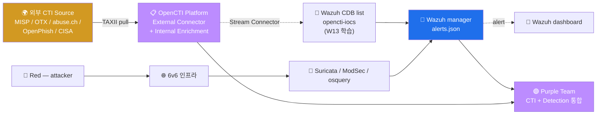

# Week 12 — OpenCTI (1) — STIX 2.1 / TAXII 2.1 / CTI 표준

> **CTI (Cyber Threat Intelligence)** 의 표준 (STIX 2.1) + 교환 프로토콜 (TAXII 2.1)
> + 통합 플랫폼 (OpenCTI) 의 개론. 본 주차는 OpenCTI 설치 전 STIX / TAXII 표준
> 학습 + 무료 IOC feed 5 종 평가 + OpenCTI 아키텍처 + W13-W14 의 Wazuh 통합 준비.

## 학습 목표

학생은 본 주차 종료 시 다음을 수행할 수 있어야 한다.

1. **CTI 의 정의** + 5 종류 (Strategic / Operational / Tactical / Technical / IOC)
2. **STIX 2.1** 의 18 SDO + 2 SCO + Relationship + Pattern
3. **TAXII 2.1** 의 client / server 모델 + collection + envelope
4. **OpenCTI 아키텍처** (Platform + Workers + Connectors + Elasticsearch / Redis / RabbitMQ / MinIO)
5. **무료 IOC feed 5 종** (MISP / AlienVault OTX / abuse.ch / OpenPhish / CISA AIS)
6. **CTI Pyramid of Pain** (Bianco) + actionable intelligence
7. **운영 시나리오** (SOC / Threat Hunting / IR / 분기 review)
8. W13-W14 의 Wazuh CDB list 통합 준비

## 강의 시간 배분 (3시간 40분)

| 시간      | 내용                                                                | 유형 |
|-----------|---------------------------------------------------------------------|------|
| 0:00–0:30 | 이론 — CTI 정의 + 5 종류 + Pyramid of Pain                          | 강의 |
| 0:30–1:00 | 이론 — STIX 2.1 표준 + 18 SDO                                       | 강의 |
| 1:00–1:10 | 휴식                                                                 | —    |
| 1:10–1:40 | 이론 — TAXII 2.1 + collection                                       | 강의 |
| 1:40–2:00 | 이론 — OpenCTI 아키텍처                                              | 강의 |
| 2:00–2:30 | 실습 1, 2 — STIX JSON 분석 + TAXII 조회                             | 실습 |
| 2:30–2:40 | 휴식                                                                 | —    |
| 2:40–3:10 | 실습 3, 4 — 무료 IOC feed + MITRE ATT&CK Navigator                 | 실습 |
| 3:10–3:30 | 실습 5 — OpenCTI 도입 계획                                           | 실습 |
| 3:30–3:40 | 정리 + W13 (CTI Wazuh 통합) 예고                                    | 정리 |

---

## 1. CTI (Cyber Threat Intelligence) 의 정의

### 1.1 정의

```
CTI = 사이버 위협 정보 — 공격자 / 캠페인 / TTP (Technique, Tactic, Procedure) /
       IOC (Indicator of Compromise) 등 의 사전 정보를 수집·분석·공유하는 활동

목표: 사고 발생 전 / 발생 시 / 발생 후 의 의사결정에 actionable intelligence 제공
```

### 1.2 CTI 의 가치

```
1. Proactive detection — 룰 작성 전에 IOC matching 으로 사전 차단
2. Context — alert 가 "왜 발생" 했는지 + "누구" 인지 파악
3. Prioritization — 1000+ alert 중 critical 만 SOC 분석가 손
4. Sharing — 같은 산업 / 국가의 다른 회사와 정보 공유
```

### 1.3 5 종류 (Pyramid)

```
              Strategic    ← 경영진 (CEO / CISO)
              ┌────────┐    의사결정 — 산업 위협 트렌드 / 지정학 위험
              │  높음  │
              ├────────┤
            Operational    ← CISO / SOC 분석가
              │        │    캠페인 / 적 분석 — APT 그룹 의 동향
              │        │
              ├────────┤
             Tactical      ← SOC 분석가
              │        │    TTP — 공격 기법 (MITRE ATT&CK Technique)
              │        │
              ├────────┤
             Technical     ← 보안 엔지니어
              │        │    IOC — IP / domain / hash / file
              │        │
              ├────────┤
                IOC        ← 자동화 도구 (SOC platform)
              │  낮음  │    Indicator of Compromise (단순 매칭)
              └────────┘

낮을수록 자동화 친화, 높을수록 사람 분석 필요.
```

### 1.4 Pyramid of Pain (David Bianco, 2013)

```
공격자에게 가장 "변경 어려운" 것이 가장 "value 높은" IOC

위에서 아래 = 변경 어려움 (공격자에게 pain)
              ┌────────┐
              │ TTPs   │    ← Tough (변경 가장 어려움)
              ├────────┤
              │ Tools  │    ← Challenging
              ├────────┤
              │Network │    ← Annoying
              │Artifacts│
              ├────────┤
              │ Host   │
              │Artifacts│
              ├────────┤
              │Domain  │
              │Names   │
              ├────────┤
              │ IP     │    ← Easy (공격자가 쉽게 변경)
              │Addrs   │
              ├────────┤
              │ Hash   │    ← Trivial (1 byte 만 변경해도 다른 hash)
              │Values  │
              └────────┘

운영 권장: TTPs / Tools 까지 식별 + 차단 (단순 IP / hash 만으로는 부족)
```

### 1.5 한국 환경의 CTI

```
- KISA 보호나라 — 한국 침해 사고 분석 + IOC 공유
- K-ISAC — 산업별 보안 정보 공유
- KrCERT — 한국 CERT (정부)
- KCMVP — 암호 모듈 검증
- 일부 SOC SaaS (안랩 / 이글루시큐리티 / SK인포섹) 가 CTI 통합 제공
```

---

## 2. STIX 2.1 — 표준 객체 모델

### 2.1 STIX 의 정의

```
STIX = Structured Threat Information eXpression
출시: 2012 MITRE (1.x) → 2017 OASIS 표준화 (2.0) → 2021 2.1 (현재)
형식: JSON (이전 1.x 는 XML)
표준 문서: https://docs.oasis-open.org/cti/stix/v2.1/
```

### 2.2 STIX 의 객체 카테고리

```
1. SDO (STIX Domain Objects) — 18 종
   — Indicator, Threat Actor, Malware, Attack Pattern 등

2. SCO (STIX Cyber Observables) — 19 종
   — file, IP, domain, URL, registry-key 등 (실 관찰된 데이터)

3. SRO (STIX Relationship Objects)
   — Relationship (양방향 connection)
   — Sighting (관측 결과)

4. STIX Bundle
   — 여러 객체를 묶은 envelope
```

### 2.3 핵심 SDO 18 종

| SDO | 의미 | 예 |
|-----|------|-----|
| **Indicator** | IOC (탐지 가능한 패턴) | 악성 IP / domain |
| **Threat Actor** | 공격 주체 (개인 / 그룹) | APT29 / Lazarus |
| **Intrusion Set** | 캠페인 묶음 | Cozy Bear |
| **Campaign** | 일련의 공격 시도 | SolarWinds attack |
| **Malware** | 악성코드 family | Emotet / TrickBot |
| **Attack Pattern** | 공격 기법 (ATT&CK 매핑) | T1190 Public-Facing App |
| **Tool** | 정상 도구의 악성 사용 | Mimikatz / PsExec |
| **Vulnerability** | CVE | CVE-2024-1234 |
| **Course of Action** | 대응 절차 | "Patch CVE-2024-1234" |
| **Identity** | 사람 / 조직 | "KISA" / "Financial Firm A" |
| **Location** | 지역 | 한국 / 미국 / 러시아 |
| **Report** | 위협 보고서 | "Q1 2026 APT Trends" |
| **Note** | 메모 (개인) | 분석가 메모 |
| **Opinion** | 동료 의견 (peer review) | "confirmed" / "likely false" |
| **Observed Data** | 관찰된 데이터 | "IP 1.2.3.4 seen at ..." |
| **Marking Definition** | 표시 (TLP / GPDR 등) | TLP:GREEN |
| **Grouping** | 객체 묶음 | 한 incident 의 모든 객체 |
| **Infrastructure** | C2 서버 등 | "Amazon EC2 IP block X" |

### 2.4 SDO JSON 예시 — Indicator

```json
{
  "type": "indicator",
  "spec_version": "2.1",
  "id": "indicator--12345678-1234-1234-1234-123456789012",
  "created": "2026-05-12T10:00:00.000Z",
  "modified": "2026-05-12T10:00:00.000Z",
  "name": "Malicious C2 IP",
  "description": "APT29 의 C2 서버 IP — confirmed 2026-05",
  "indicator_types": ["malicious-activity"],
  "pattern": "[ipv4-addr:value = '1.2.3.4']",
  "pattern_type": "stix",
  "pattern_version": "2.1",
  "valid_from": "2026-05-12T10:00:00.000Z",
  "valid_until": "2026-12-31T23:59:59.999Z",
  "labels": ["malicious-activity", "apt29"],
  "kill_chain_phases": [
    {
      "kill_chain_name": "mitre-attack",
      "phase_name": "command-and-control"
    }
  ]
}
```

### 2.5 Pattern 의 syntax (STIX Pattern)

```
# IP 단일
[ipv4-addr:value = '1.2.3.4']

# domain
[domain-name:value = 'evil.com']

# hash
[file:hashes.SHA256 = 'abc...']
[file:hashes.'MD5' = '123...']

# URL
[url:value = 'http://evil.com/malware']

# 조합
[ipv4-addr:value = '1.2.3.4' OR ipv4-addr:value = '5.6.7.8']
[file:hashes.SHA256 = 'abc...' AND file:name = 'evil.exe']

# 시간 조건
[network-traffic:dst_port = 4444]
  WITHIN 60 SECONDS
[file:created = '2026-05-12T10:00:00.000Z']
```

### 2.6 Relationship Object

```json
{
  "type": "relationship",
  "spec_version": "2.1",
  "id": "relationship--abc...",
  "created": "...",
  "modified": "...",
  "relationship_type": "attributed-to",
  "source_ref": "indicator--12345678-...",
  "target_ref": "threat-actor--apt29-..."
}
```

자주 사용하는 relationship_type:
- `attributed-to` : Indicator → ThreatActor
- `indicates` : Indicator → Malware
- `targets` : ThreatActor → Identity (산업 / 회사)
- `uses` : Malware → AttackPattern
- `mitigates` : CourseOfAction → AttackPattern
- `related-to` : 일반 (덜 specific)

### 2.7 Bundle (envelope)

```json
{
  "type": "bundle",
  "id": "bundle--xyz...",
  "objects": [
    { "type": "indicator", "...": "..." },
    { "type": "threat-actor", "...": "..." },
    { "type": "relationship", "...": "..." }
  ]
}
```

---

## 3. TAXII 2.1 — 교환 프로토콜

### 3.1 정의

```
TAXII = Trusted Automated eXchange of Intelligence Information
출시: 2014 MITRE (1.x) → 2019 OASIS (2.1 — 현재)
형식: REST API + HTTPS
표준: https://docs.oasis-open.org/cti/taxii/v2.1/
```

### 3.2 endpoint 구조

```
GET /taxii2/                                  # 서버 메타
GET /taxii2/api1/                              # API root
GET /taxii2/api1/collections/                  # collection 목록
GET /taxii2/api1/collections/<id>/             # collection 상세
GET /taxii2/api1/collections/<id>/objects      # STIX 객체 조회 (페이지)
POST /taxii2/api1/collections/<id>/objects     # STIX 업로드 (권한 시)
GET /taxii2/api1/collections/<id>/objects/<id> # 단일 객체
GET /taxii2/api1/collections/<id>/manifest     # 객체 메타
GET /taxii2/api1/status/<status-id>            # async 작업 상태
```

### 3.3 collection 의 의미

```
collection = 논리적 그룹의 STIX 객체 묶음
예:
  - "AbuseIPDB Critical" (high-confidence IP)
  - "MISP Daily Threats" (일별 threat)
  - "Industry Sector — Financial" (산업별)

권한 단위로 분리:
  - public collection: 모든 사용자 read
  - private collection: 인증된 사용자 only
```

### 3.4 인증 + TLS

```
표준:
  - HTTPS 필수
  - Bearer JWT 또는 Basic auth
  - mutual TLS (mTLS) 권장 (회사 간)

요청 예:
  curl -H "Accept: application/taxii+json;version=2.1" \
       -H "Authorization: Bearer <JWT>" \
       https://taxii.example.com/taxii2/api1/collections/
```

### 3.5 자주 사용하는 TAXII source

| Source | URL | 라이선스 |
|--------|-----|----------|
| **MITRE ATT&CK** | https://attack.mitre.org/api/ | CC BY 4.0 |
| **MISP** | (회사별 self-hosted) | 무료 / 유료 |
| **Anomali** | https://anomali.com/api/ | 유료 |
| **OASIS demo** | https://oasis-open.github.io/cti-taxii-server/ | 학습용 |
| **OpenCTI** | (self-hosted) | 무료 |
| **AlienVault OTX** | https://otx.alienvault.com/api/v1/ | 무료 (API key 등록) |

---

## 4. OpenCTI 아키텍처

### 4.1 OpenCTI 의 정의

```
OpenCTI = Open Cyber Threat Intelligence Platform
출시: 2019 Filigran (Luatix → Filigran)
라이선스: Apache 2.0
언어: TypeScript (Platform) + Python (Workers / Connectors) + React (UI)
홈페이지: https://www.opencti.io
GitHub: https://github.com/OpenCTI-Platform/opencti
```

### 4.2 아키텍처

```
┌──────────────────────┐
│   OpenCTI Platform    │  GraphQL API + Web UI (port 8080)
│   (TypeScript)        │
└──────┬───────────────┘
       │
       ▼
┌──────────────────────┐
│ Elasticsearch (검색) │  port 9200
└──────┬───────────────┘
       │
       ▼
┌──────────────────────┐
│ Redis (cache)         │  port 6379
└──────┬───────────────┘
       │
       ▼
┌──────────────────────┐
│ RabbitMQ (queue)      │  port 5672
└──────┬───────────────┘
       │
       ▼
┌──────────────────────┐
│ MinIO (S3 storage)    │  port 9001
└──────────────────────┘

추가 component:
  - Workers (Python) — 데이터 처리 백그라운드
  - Connectors — 외부 source 통합 (40+)
  - Telemetry (선택) — Prometheus / Grafana
```

### 4.3 의존성 + Docker compose

```yaml
# 공식 docker-compose-opencti.yml (간소)
services:
  opencti:
    image: opencti/platform:6.0
    ports: ["8080:8080"]
    depends_on: [redis, elasticsearch, rabbitmq, minio]
  elasticsearch:
    image: elasticsearch:8.10
  redis:
    image: redis:7
  rabbitmq:
    image: rabbitmq:3-management
  minio:
    image: minio/minio
    command: server /data
  worker:
    image: opencti/worker:6.0
    depends_on: [opencti]
```

대략 **4 GB RAM 추가** 필요 — 본 lab 의 6v6 VM (8GB) 에는 부담. 별 lab 또는 reduced
config 권장.

### 4.4 OpenCTI 의 6 main view

| View | 용도 |
|------|------|
| **Investigations** | 사고 분석 + timeline |
| **Threats** | Threat Actor / Intrusion Set / Campaign |
| **Arsenal** | Malware / Tool / Vulnerability |
| **Techniques** | ATT&CK Tactic / Technique |
| **Entities** | Identity / Location / Sector |
| **Observations** | Indicator / Observable / Sighting |

---

## 5. Connector

### 5.1 Connector 3 종

#### 5.1.1 External Connector (외부 → OpenCTI)

```
외부 source 의 데이터를 OpenCTI 에 ingest

대표:
  - MITRE ATT&CK
  - MISP
  - Anomali
  - AbuseIPDB
  - OTX AlienVault
  - VirusTotal
  - URLhaus / ThreatFox (abuse.ch)
```

#### 5.1.2 Internal Enrichment (내부 객체 확장)

```
이미 OpenCTI 에 있는 객체를 enrich:
  - IP → GeoIP / WHOIS / ASN
  - Domain → VirusTotal / DomainTools
  - Hash → VirusTotal / MalwareBazaar
```

#### 5.1.3 Stream Connector (OpenCTI → 외부)

```
OpenCTI 의 데이터를 외부 시스템에 push:
  - **OpenCTI → Wazuh** (CDB list — W13 학습)
  - OpenCTI → Splunk
  - OpenCTI → MISP (양방향 sync)
  - OpenCTI → ELK
```

### 5.2 본 lab 의 핵심 — Wazuh Stream Connector

W13 에서 본격 학습. 패턴:

```
OpenCTI → 30분 주기 polling → STIX Indicator → CDB list 변환
→ /var/ossec/etc/lists/opencti-iocs → Wazuh reload → alert 의 level 자동 상승
```

---

## 6. 5 무료 IOC Feed

| Feed | source | type | 라이선스 |
|------|--------|------|----------|
| **MISP** | community + 회사 self-hosted | IOC + TTP | 무료 |
| **OTX AlienVault** | community + AT&T | IOC + Pulses | 무료 (API key) |
| **abuse.ch** | URLhaus / Feodotracker / SSLBL | 악성 URL / C2 / TLS cert | 무료 (CC0) |
| **OpenPhish** | community | phishing URL | 무료 |
| **CISA AIS** | 미국 정부 | IOC + indicator | 무료 (등록) |

본 lab 의 W13-W14 에서 이 중 1-2 개 통합.

---

## 7. CTI 운영 시나리오

### 7.1 SOC 분석 (Tier 1-2)

```
1. SIEM 의 alert 발생 (예: SSH brute force from 1.2.3.4)
2. 분석가 가 OpenCTI 에서 1.2.3.4 검색
3. 발견: APT29 의 C2 IP (TLP:GREEN)
4. 우선순위 상승 + IR 시작
```

### 7.2 Threat Hunting (Tier 3)

```
1. CTI 의 새 IOC 받음 (예: APT29 의 새 TTP)
2. 본 환경의 historical 데이터에 매칭
3. 과거 침해 흔적 발견 또는 부재 확인
4. Detection 룰 강화
```

### 7.3 IR (Incident Response)

```
1. 사고 발생 시 OpenCTI 의 attribution 분석
2. 알려진 TTP 와 매칭 → 다음 단계 예측
3. CTI 의 IOC 로 영향 확산 차단
```

### 7.4 분기 review

```
1. 본 환경에 매치된 IOC 통계
2. 가장 빈번한 ThreatActor / Malware
3. Coverage Matrix 갱신
4. CTI source 의 신뢰도 평가
```

---

## 8. R/B/P 시나리오 — OpenCTI 의 자리



---

## 9. 실습 1~5

### 실습 1 — STIX 2.1 Indicator JSON 작성 + 분석

```bash
ssh 6v6-attacker '
echo "=== STIX 2.1 Indicator 예시 ==="
cat <<EOF | tee /tmp/indicator.json
{
  "type": "indicator",
  "spec_version": "2.1",
  "id": "indicator--$(uuidgen)",
  "created": "$(date -u +%Y-%m-%dT%H:%M:%S.000Z)",
  "modified": "$(date -u +%Y-%m-%dT%H:%M:%S.000Z)",
  "name": "6v6 Lab Test IOC",
  "description": "학습 환경의 가상 IOC",
  "indicator_types": ["malicious-activity"],
  "pattern": "[ipv4-addr:value = \"1.2.3.4\"]",
  "pattern_type": "stix",
  "valid_from": "$(date -u +%Y-%m-%dT%H:%M:%S.000Z)",
  "labels": ["c2", "test"]
}
EOF

echo ""
echo "=== jq 로 분석 ==="
jq . /tmp/indicator.json

echo ""
echo "=== pattern 부분 만 ==="
jq -r .pattern /tmp/indicator.json
'
```

### 실습 2 — MITRE ATT&CK 의 STIX 다운로드 + 분석

```bash
ssh 6v6-attacker '
echo "=== MITRE ATT&CK Enterprise — JSON 다운로드 ==="
curl -s https://raw.githubusercontent.com/mitre/cti/master/enterprise-attack/enterprise-attack.json -o /tmp/attack.json 2>&1 | head -3
ls -la /tmp/attack.json

echo ""
echo "=== Bundle 의 object 종류 통계 ==="
jq -r ".objects[].type" /tmp/attack.json | sort | uniq -c | sort -rn

echo ""
echo "=== Threat Actor (intrusion-set) 10 개 ==="
jq -r ".objects[] | select(.type==\"intrusion-set\") | .name" /tmp/attack.json 2>/dev/null | head -10

echo ""
echo "=== Attack Pattern (Technique) 10 개 ==="
jq -r ".objects[] | select(.type==\"attack-pattern\") | .name" /tmp/attack.json 2>/dev/null | head -10
'
```

### 실습 3 — TAXII 2.1 collection 조회 (OASIS demo)

```bash
ssh 6v6-attacker '
echo "=== TAXII 2.1 서버 메타 ==="
curl -s -H "Accept: application/taxii+json;version=2.1" \
    https://oasis-open.github.io/cti-taxii-server/ 2>&1 | head -30 | head

echo ""
echo "=== 또는 OpenCTI 공개 demo ==="
curl -s -H "Accept: application/taxii+json;version=2.1" \
    https://app.opencti.io/taxii2/ 2>&1 | head -30 | head
'
```

### 실습 4 — abuse.ch URLhaus 의 IOC 다운로드

```bash
ssh 6v6-attacker '
echo "=== URLhaus 의 최근 malicious URL ==="
curl -s https://urlhaus.abuse.ch/downloads/csv_recent/ -o /tmp/urlhaus.csv 2>&1 | head -3
wc -l /tmp/urlhaus.csv
echo ""
echo "=== 상위 5 entry ==="
head -10 /tmp/urlhaus.csv | tail -5

echo ""
echo "=== CSV → STIX 변환 예시 (pseudocode) ==="
echo "각 URL 의 row → STIX Indicator JSON 변환"
echo "  pattern: [url:value = \"...\"]"
echo "  indicator_types: [malicious-activity]"
echo "  valid_from: ..."
'
```

### 실습 5 — OpenCTI 도입 계획 작성

```markdown
# 6v6 환경의 OpenCTI 도입 계획

## 1. 현황
- 6v6 환경: 16 컨테이너 + 8 vuln + 4 인프라
- 현재 CTI 통합: 없음 (Wazuh CDB list 가 manual)
- 본인 환경: 8GB RAM VM

## 2. 도입 목표
- 6v6-secuops 의 detection 능력 향상 (Coverage 90%+)
- 외부 IOC feed 의 자동 ingest → Wazuh CDB
- 분기별 Threat Hunting session

## 3. 아키텍처 plan
- 별 docker-compose 의 OpenCTI stack (또는 별 VM)
- 4GB RAM 추가 (Elasticsearch + Redis + RabbitMQ + MinIO)
- 6v6 의 dmz subnet 에 추가 컨테이너 (10.20.32.130)

## 4. 통합 plan
- W13: Wazuh Stream Connector 작성
- W14: 분기 Threat Hunting (Sighting + Report)

## 5. CTI source 선택
- MITRE ATT&CK (필수)
- abuse.ch URLhaus / Feodotracker (무료)
- OTX AlienVault (API key 등록)
- MISP (옵션 — community 가입)
```

---

## 9.5 R/B/P 공격 분석 케이스 확장 (본 주차 추가)

### 9.5.0 R/B/P 일상 비유 — 동네 안전 정보 공유 게시판

본 절은 CTI 의 운영을 동네 안전 정보 공유 게시판 비유로 시작한다.

학생이 사는 동네의 주민 안전 카페에 한 운영자가 있다. 운영자는 다음 세 가지 일을 한다.

- **외부 신고 수집.** 다른 동네에서 발생한 사기 사건의 phone 번호, 가짜 web 주소 같은 정보를 모은다 (외부 CTI feed).
- **표준 양식으로 정리.** 모든 사건의 정보를 같은 양식에 맞춰 카페에 글로 올린다 (STIX 표준).
- **자동 공유.** 카페 글이 다른 동네 카페에도 자동으로 복사된다 (TAXII protocol).

동네 주민은 카페 게시판을 매일 읽으면서 본인이 받은 이상한 전화나 메시지가 게시된 사기 패턴과 같은지 즉시 비교한다. 같은 phone 번호가 게시되어 있으면 즉시 차단한다.

| 일상 비유 | CTI 운영 |
|-----------|----------|
| 외부 신고 수집 | abuse.ch URLhaus / Feodotracker 같은 feed |
| 표준 양식 | STIX 2.1 의 SDO + Pattern |
| 자동 공유 | TAXII 2.1 protocol |
| 카페 게시판 | OpenCTI 의 통합 plat form |
| 본인 받은 전화 비교 | Wazuh alert 의 srcip vs CTI indicator |
| 즉시 차단 | Active Response 또는 fw 의 dynamic blacklist |

본 절은 다음 세 케이스를 다룬다.

- 케이스 1 — abuse.ch URLhaus 에서 받은 IOC list 의 한 도메인이 학습 환경 DNS query 에서 매칭되는 과정을 추적.
- 케이스 2 — STIX Indicator 한 줄을 직접 작성하고 본인의 학습 환경 attacker VM IP 를 매핑한다.
- 케이스 3 — OpenCTI UI 의 Investigation 화면에서 한 indicator 의 관계 (relationship) 를 시각 탐색.

원칙은 W01 ~ W11 와 같다. 재현 가능성, 도구 위주 분석, 신입생 친화, 학습 환경 한정.

### 9.5.1 케이스 1 — abuse.ch URLhaus IOC 의 학습 환경 매칭 시뮬

**0. 일상 비유 — 옆 동네 사기 phone 번호 list 가 우리 동네 통화 기록과 매칭.**

옆 동네에서 신고된 사기 phone 번호 100개가 동네 카페에 공유되었다. 학생이 본인 휴대폰의 최근 통화 기록과 비교한다. 만약 같은 번호가 보이면 즉시 그 번호를 차단하고 경찰에 신고한다. 본 cycle 의 핵심은 외부 신고 list 를 본인 환경의 흔적과 매칭하는 표준 절차다.

| 일상 비유 | CTI matching |
|-----------|--------------|
| 사기 phone 번호 list | URLhaus 의 도메인/URL list |
| 본인 통화 기록 | web VM 의 DNS query 로그 |
| 매칭 결과 | 동일 도메인 발견 |
| 즉시 차단 | fw 의 dynamic blacklist set |
| 신고 | OpenCTI 의 sighting + 운영자 알람 |

**0a. 사용 도구 사전 안내.**

- **abuse.ch URLhaus** — open community 의 malicious URL feed. CSV / JSON / TAXII 의 세 가지 형식으로 배포.
- **CDB list** — Wazuh 의 Constant Database. key-value 형식의 정적 lookup list.
- **`active-response`** — Wazuh 의 자동 대응.

**1. Red — 공격 재현 (학습용 시뮬).**

학습 환경에서는 실제 known bad 도메인 대신 시뮬 도메인 (`bad-test-c2.local.lab`) 을 학습용 CDB list 에 미리 등록해두고, attacker VM 에서 web VM 안으로 들어가 그 도메인을 조회한다.

```bash
ssh ccc@192.168.0.112
ssh -o StrictHostKeyChecking=no admin@192.168.0.103

# web VM 안 (학습 환경 한정)
dig +short "bad-test-c2.local.lab" >/dev/null 2>&1
```

학습 환경의 DNS resolver 가 `bad-test-c2.local.lab` 를 미등록으로 응답한다. 그러나 web VM 의 sysmon Event 22 또는 ips Suricata 의 dns event 가 query 자체를 기록한다.

**2. 발생하는 로그/아티팩트.**

- ips 의 eve.json — dns event 한 줄.
- web 의 sysmon — Event 22 DnsQuery 한 줄.
- siem 의 alerts.json — 단순 정보 alert 한 줄.

CDB list 에 본 도메인이 등록되어 있다면 Wazuh manager 의 lookup decoder 가 매칭하여 alert level 을 상향한다.

**3. Blue — CDB list 등록 + lookup decoder + 매칭 alert.**

먼저 siem manager 에서 학습용 CDB list 를 등록한다.

```bash
ssh 6v6-siem
sudo tee /var/ossec/etc/lists/local_bad_domains > /dev/null <<'EOF'
bad-test-c2.local.lab:
suspicious-test.local.lab:
EOF
sudo /var/ossec/bin/wazuh-makelists
```

다음으로 lookup decoder + rule 을 추가한다.

```xml
<group name="local,cti,">
  <rule id="100600" level="11">
    <if_sid>61644</if_sid>
    <list field="data.sysmon.QueryName" lookup="match_key">
      etc/lists/local_bad_domains
    </list>
    <description>LOCAL CTI Match - bad domain in DNS query: $(data.sysmon.QueryName)</description>
  </rule>
</group>
```

(`if_sid` 의 값은 학습 환경의 sysmon Event 22 기본 rule id 에 맞게 조정.)

Wazuh manager 를 reload 한다.

```bash
sudo /var/ossec/bin/wazuh-control restart
```

attacker VM 에서 dig 를 다시 보내고 alert 발생을 확인한다.

```bash
sudo tail -100 /var/ossec/logs/alerts/alerts.json \
  | jq -r 'select(.rule.id=="100600") | "\(.timestamp) \(.data.sysmon.QueryName) level=\(.rule.level)"'
```

level 11 의 한 줄이 보이면 CDB lookup 매칭 정상이다.

Wazuh Dashboard 에서도 본다.

1. 좌측 햄버거 메뉴 → `Discover` 선택.
2. Index pattern `wazuh-alerts-*`.
3. Search bar 에 `rule.id:100600` 입력.
4. 결과의 `data.sysmon.QueryName` 과 `agent.name` 확인.

**4. Blue — 대응 의사결정.**

학생이 다음 세 가지를 판단한다.

- **CDB list 의 신뢰도.** abuse.ch 의 known bad list 는 신뢰도 높다. 그러나 false positive 도 있을 수 있어 자동 차단 전에 운영자 review 한 단계가 안전하다.
- **자동 차단 vs 모니터링.** 학습 환경은 자동 차단이 안전. 운영 환경은 confidence 가 높은 source 만 자동 차단.
- **추가 추적.** 같은 source IP 가 다른 known bad domain 도 시도했는지 cross-check 한다.

**5. Purple — CDB 자동 sync + 운영 baseline.**

다음 세 가지를 적용한다.

- **W13 의 자동 sync.** abuse.ch 의 URL list 를 매 시간 cron 으로 다운로드하고 CDB list 를 자동 갱신한다. 다음 주차 학습 주제다.
- **lookup decoder 의 source 분리.** 한 CDB 파일이 너무 커지지 않게 source 별 (URLhaus, Feodotracker, OTX) 로 분리한다.
- **운영 baseline 의 false positive 측정.** 본인 환경의 정상 도메인 (`*.6v6.lab`) 이 우연히 CDB 와 충돌하지 않는지 분기 검토.

본 케이스 cycle 한 바퀴는 약 25분 정도다.

### 9.5.2 케이스 2 — STIX Indicator 한 줄 직접 작성 + attacker VM 매핑

**0. 일상 비유 — 본인이 직접 신고 글을 표준 양식으로 작성.**

학생이 본인이 받은 이상한 phone 번호를 동네 카페에 직접 글로 올린다. 글의 양식은 운영자가 미리 정해둔 표준 양식 (사건 시각, phone 번호, 사기 유형, 신뢰도) 을 따른다. 표준 양식이 있어야 다른 동네 카페에도 자동 공유가 가능하다.

이 비유를 STIX Indicator 작성에 옮긴다.

| 일상 비유 | STIX 작성 |
|-----------|-----------|
| 신고 글 한 장 | STIX Indicator object 한 줄 (JSON) |
| 사건 시각 | created, valid_from |
| phone 번호 | pattern (예: `[ipv4-addr:value = '192.168.0.112']`) |
| 사기 유형 | indicator_types |
| 신뢰도 | confidence |
| 신고자 | created_by_ref |

**0a. 사용 도구 사전 안내.**

- **STIX 2.1 Indicator** — SDO 의 한 종류.
- **STIX Pattern** — 매칭 조건의 표준 문법.
- **jq + python -m json.tool** — JSON validation.

**1. Red — 본인 학습 환경의 attacker VM IP 를 indicator 로 표현.**

학습 환경 attacker VM (192.168.0.112) 을 학습용 indicator 로 표현한다.

```bash
cat > /tmp/local_attacker_indicator.json <<'EOF'
{
  "type": "indicator",
  "spec_version": "2.1",
  "id": "indicator--550e8400-e29b-41d4-a716-446655440042",
  "created": "2026-05-13T00:00:00Z",
  "modified": "2026-05-13T00:00:00Z",
  "name": "LOCAL Learning Environment Attacker VM",
  "description": "학습 환경의 attacker VM. 학습 목적의 시뮬 공격만 발생.",
  "indicator_types": ["malicious-activity"],
  "pattern": "[ipv4-addr:value = '192.168.0.112']",
  "pattern_type": "stix",
  "pattern_version": "2.1",
  "valid_from": "2026-05-13T00:00:00Z",
  "confidence": 95,
  "labels": ["learning-only", "ccc-6v6"]
}
EOF

python3 -m json.tool /tmp/local_attacker_indicator.json | head -20
```

JSON 이 정상 파싱되면 잘 작성된 것이다.

**2. 발생하는 로그/아티팩트.**

본 단계는 단순 JSON 파일 생성이라 alert 는 없다. 다음 단계에서 OpenCTI 또는 Wazuh CDB 로 ingest 하면 적용된다.

**3. Blue — STIX Pattern 의 syntax 검증 + Wazuh 통합.**

먼저 STIX Pattern 의 syntax 를 확인한다.

```
[ipv4-addr:value = '192.168.0.112']
```

각 부분의 의미는 다음과 같다.

- `[...]` — pattern 의 전체.
- `ipv4-addr` — STIX 의 cyber observable object type.
- `value` — 그 object 의 property.
- `=` — 비교 연산자.
- `'192.168.0.112'` — 매칭 대상 값.

복잡한 pattern 의 예 (도메인 + 시간 조건).

```
[domain-name:value = 'bad-test-c2.local.lab'] WITHIN 60 SECONDS
```

다음으로 본 indicator 를 Wazuh CDB list 의 한 줄로 변환한다.

```bash
echo "192.168.0.112:learning_only_attacker" \
  | sudo tee -a /var/ossec/etc/lists/local_known_ips
sudo /var/ossec/bin/wazuh-makelists
```

Wazuh rule 에 lookup 추가.

```xml
<group name="local,cti,">
  <rule id="100601" level="10">
    <if_sid>5710</if_sid>
    <list field="data.srcip" lookup="match_key">
      etc/lists/local_known_ips
    </list>
    <description>LOCAL CTI Match - known src IP: $(data.srcip)</description>
  </rule>
</group>
```

attacker VM 에서 SSH 실패 시도를 보내면 rule 100601 이 trigger 되어 alert 가 발생한다.

```bash
ssh ccc@192.168.0.112
sshpass -p "wrong" ssh -o ConnectTimeout=3 admin@192.168.0.103 'whoami' 2>/dev/null
```

siem 에서 확인.

```bash
ssh 6v6-siem
sudo tail -50 /var/ossec/logs/alerts/alerts.json \
  | jq -r 'select(.rule.id=="100601") | "\(.timestamp) src=\(.data.srcip) level=\(.rule.level)"'
```

**4. Blue — 대응 의사결정.**

학생이 다음 세 가지를 판단한다.

- **indicator 의 valid_from / valid_until.** 학습 환경의 attacker VM 은 영구적인 학습 용도이므로 valid_until 을 비워둔다. 운영 환경의 known bad IP 는 보통 90일 만료를 둔다.
- **confidence 적정성.** 본인이 직접 확인한 attacker VM 은 95 (very high). 외부 source 의 unverified IOC 는 50 (medium).
- **labels 의 운영 활용.** `learning-only` label 의 indicator 는 운영 환경 dashboard 에서 자동 필터링한다.

**5. Purple — STIX 작성 표준 + OpenCTI 도입 준비.**

다음 세 가지를 적용한다.

- **회사 표준 STIX 양식 정립.** 모든 indicator 작성 시 필수 필드 (name, description, indicator_types, pattern, valid_from, confidence, created_by_ref, labels) 를 명문화한다.
- **OpenCTI 도입 plan.** W12 의 §9 (실습 5) 에서 작성한 도입 계획을 환경에 맞게 구체화한다.
- **회사 indicator 의 외부 공유.** confidence 가 높은 indicator 는 한국 KISA 또는 산업 ISAC 공유 채널로 전송. W14 학습 주제다.

### 9.5.3 케이스 3 — OpenCTI UI 의 Investigation 시각 탐색

**0. 일상 비유 — 동네 카페의 글타래 관계 그림으로 시각 탐색.**

동네 카페에 글이 쌓이면 운영자가 글타래 관계 그림 (한 사기 사건이 어떤 사람의 다른 신고와 연결되는지) 을 만든다. 학생이 그림을 보면 한 사건 뒤에 숨은 더 큰 패턴이 보인다. 한 phone 번호가 다른 가짜 web 주소와 같은 사람의 것이라면, 두 신고가 한 글타래로 연결된다.

OpenCTI 의 Investigation 화면이 같은 역할을 한다.

| 일상 비유 | OpenCTI Investigation |
|-----------|------------------------|
| 한 신고 글 | Indicator object |
| 신고자 | Threat Actor |
| 사용 도구 | Malware, Attack Pattern |
| 글타래 관계 | Relationship object |
| 그림 시각화 | Investigation 의 graph view |

**0a. 사용 도구 사전 안내.**

- **OpenCTI Investigation 화면** — Web UI 의 한 메뉴.
- **Relationship object** — 두 SDO 의 관계.
- **graph view** — 관계의 시각화.

**1. Red — 공격 재현 (없음, OpenCTI 의 기본 데이터 활용).**

본 케이스는 OpenCTI 의 기본 import (예: MITRE ATT&CK) 의 데이터를 활용한 학습 시뮬이다. 실 공격 재현은 케이스 1, 2 에서 다뤘다.

**2. 발생하는 로그/아티팩트.**

OpenCTI 의 ATT&CK connector 가 이미 다음 데이터를 import 한 상태라고 가정한다.

- Threat Actor: APT29 (Cozy Bear).
- Malware: WellMess, WellMail.
- Attack Pattern: T1190 Exploit Public-Facing Application.
- Relationship: APT29 uses WellMess, APT29 uses T1190.

**3. Blue — OpenCTI UI 의 Investigation 시각 탐색.**

학생이 자기 host 의 web browser 에서 OpenCTI 에 접속한다 (학습 환경에 OpenCTI 가 설치된 후).

UI 클릭 흐름은 다음과 같다.

1. 좌측 메뉴 → `Threats` → `Threat actors` 선택.
2. 목록에서 `APT29` 클릭.
3. APT29 의 상세 화면에서 상단 탭 중 `Knowledge` 클릭.
4. `Knowledge` 화면의 좌측 sidebar 에서 `Investigation` 선택.
5. graph view 에 APT29 의 노드가 가운데에 표시된다.
6. 노드 우클릭 → `Expand` → `All relationships` 선택.
7. 화면에 APT29 의 관계가 시각적으로 펼쳐진다.
   - `uses` → WellMess (malware).
   - `uses` → T1190 (attack pattern).
   - `targets` → 특정 sector / region.

각 노드를 클릭하면 우측 panel 에 그 객체의 상세가 표시된다.

**4. Blue — 대응 의사결정 (정보 활용).**

학생이 다음 세 가지를 판단한다.

- **본인 환경의 노출 정도.** APT29 가 use 하는 attack pattern (T1190) 이 본인 환경의 어떤 자산을 위협하는지 매핑한다. 학습 환경은 web (juice.6v6.lab) 이 T1190 의 표적이다.
- **detection coverage.** 본인 환경의 detection rule 이 T1190 을 잡고 있는가? W04 의 Suricata + W06 의 ModSec 룰이 coverage 의 핵심이다.
- **mitigation plan.** OpenCTI 의 한 attack pattern 페이지에는 `Mitigations` 탭이 있다. 표준 mitigation 권고를 본인 환경에 맞춰 적용 계획화.

**5. Purple — Investigation graph 의 운영 활용.**

다음 세 가지를 적용한다.

- **분기 1 회 Investigation session.** 운영팀이 분기마다 APT29, APT28, Kimsuky 같은 한국 위협의 Investigation 을 한 화면에서 본다. 본인 환경의 detection coverage 격차를 식별.
- **coverage 매트릭스.** ATT&CK 의 14 tactic × 본인 환경의 detection rule 수를 정리. coverage 50% 이하의 tactic 은 다음 분기 우선 작업.
- **외부 공유 활성.** 본인 환경에서 발견된 indicator (case 2 의 attacker VM 같은 학습용 indicator 는 제외) 는 OpenCTI 의 sharing 기능으로 산업 ISAC 채널에 공유한다.

### 9.5.4 본 절 정리

본 절은 W12 의 CTI 표준 학습을 실제 공격 분석 cycle 에 연결했다. 학생이 다음 능력을 갖춘다.

- abuse.ch URLhaus 같은 외부 IOC feed 의 도메인을 Wazuh CDB list + lookup decoder 로 매칭한다.
- STIX Indicator 한 줄을 표준 양식으로 직접 작성하고 Wazuh CDB 와 OpenCTI 양쪽에 적용한다.
- OpenCTI 의 Investigation graph view 로 한 threat actor 의 관계망을 시각 탐색하고 본인 환경의 detection coverage 격차를 식별한다.

다음 주차 W13 에서는 OpenCTI Stream Connector + Wazuh CDB 자동 sync 의 본격 통합 cycle 을 학습한다.

---

## 10. ATT&CK + 한국 표준

### 10.1 ATT&CK 의 STIX 표현

```
ATT&CK 자체가 STIX 2.1 형식으로 배포
  Tactic = x-mitre-tactic (custom SDO)
  Technique = attack-pattern
  Mitigation = course-of-action
  Group = intrusion-set
  Software = malware / tool
```

### 10.2 ISMS-P 매핑

| ISMS-P | 본 주차 |
|--------|---------|
| 2.10.7 보안위협 대응 | CTI 의 actionable intelligence |
| 2.11.3 정보보호 인식 제고 | CTI 의 분기 review |

### 10.3 NIST CSF + Cyber Threat Framework

```
- NIST CSF Identify : CTI 의 자산 위협 매핑
- NIST CSF Detect   : IOC matching
- NIST CTF (CSF v2) : Strategic / Operational / Tactical 매핑
```

---

## 11. 과제

### A. STIX 분석 (필수, 40점)

MITRE ATT&CK 의 STIX bundle 다운로드 + 다음 분석:
1. object 종류별 갯수
2. intrusion-set (APT 그룹) 10+ list
3. attack-pattern (Technique) 의 Tactic 별 분포

### B. TAXII 통신 (심화, 30점)

OASIS demo 또는 OpenCTI 공개 demo 의 collection 1+ 조회 + STIX Indicator
다운로드.

### C. OpenCTI 도입 plan (정성, 30점)

본 6v6 환경에 OpenCTI 도입하는 plan 작성:
- 자원 요구사항
- 통합 시나리오 (Wazuh / Suricata)
- 분기 운영 사이클

---

## 12. 평가 기준

| 항목 | 비중 |
|------|------|
| STIX 분석 (A) | 40% |
| TAXII 통신 (B) | 30% |
| 도입 plan (C) | 30% |

---

## 13. 핵심 정리 (10 줄)

1. **CTI 5 종류** — Strategic / Operational / Tactical / Technical / IOC
2. **Pyramid of Pain** (Bianco) — TTP / Tool 까지 detect 가 가장 가치
3. **STIX 2.1** — 18 SDO + Relationship + Pattern + Bundle
4. **TAXII 2.1** — REST API + collection + envelope
5. **OpenCTI** = Platform + Workers + Connectors + ES/Redis/RabbitMQ/MinIO
6. **Connector 3 종** — External / Internal Enrichment / Stream
7. **5 무료 IOC feed** — MISP / OTX / abuse.ch / OpenPhish / CISA AIS
8. **운영 시나리오 4** — SOC / Threat Hunting / IR / 분기 review
9. **W13 (CTI Wazuh 통합)** = OpenCTI → Wazuh CDB list (Stream Connector)
10. **W14 (Threat Hunting)** = OpenCTI 의 Sighting + Report
