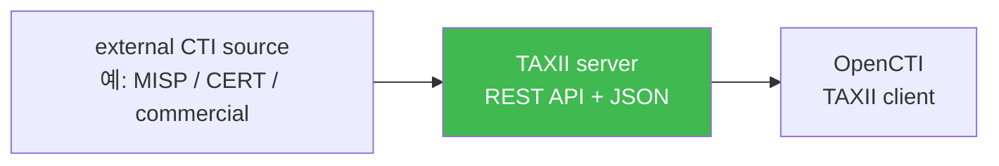
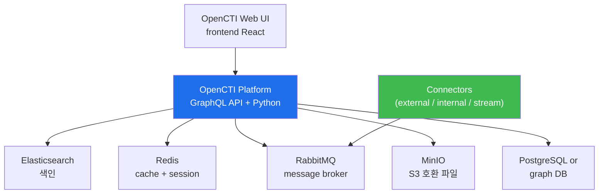
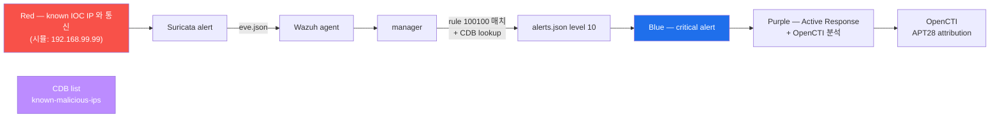

# Week 12 — OpenCTI 도입 — STIX 2.1 + TAXII 2.1 + Connector

> **본 주차의 한 줄 요약**
>
> **OpenCTI (Open Cyber Threat Intelligence)** = Filigran 의 open-source CTI 플랫폼.
> Threat Intelligence (CTI) 데이터의 **STIX 2.1** 표준 + **TAXII 2.1** 교환 프로토콜 +
> **Connector** (input/output/internal) 3 종 학습. 6v6 에 OpenCTI **미설치** — 본 주차
> 의 도입 계획 + W13 운영 + W14 MISP 통합 까지 3 주 cycle. 학습 마지막에 IOC feed 가
> Wazuh CDB list 로 통합되어 자동 alert 격상되는 흐름.
>
> **운영자 한 줄 결론**: SIEM 이 "본 환경" 데이터만 본다면, CTI 가 "외부 위협" 데이터를
> 가져와 본 환경과 매핑. APT 그룹 / TTP / IOC 를 실시간 SIEM 알람으로 격상.

---

## 학습 목표

1. CTI 의 자리 + OpenCTI 정체성 (vs MISP / TheHive / Anomali).
2. **STIX 2.1** 의 4 핵심 객체 — Indicator / Malware / Threat Actor / Attack Pattern.
3. **TAXII 2.1** 의 client / server 모델 + collection + envelope.
4. **OpenCTI 아키텍처** — frontend (Web UI) + backend (GraphQL API) + Elasticsearch
   (색인) + Redis (queue) + RabbitMQ (message broker) + MinIO (S3 호환).
5. **3 Connector 종** — external input / internal enrichment / stream / output.
6. **CTI feed 통합 흐름** — TAXII source → OpenCTI → STIX object → Wazuh CDB list.
7. **R/B/P** — Red 가 known IOC IP 와 통신 → OpenCTI IOC 매칭 → Wazuh alert 격상.

---

## 1. CTI 의 자리 + OpenCTI 정체성

### 1.1 CTI 의 자리

W04-W11 의 도구들은 **본 환경** 의 packet / log / process 만 본다. **CTI** 는 **외부
위협 정보** (APT 그룹 / IOC / TTP) 를 가져와 본 환경과 연결.

```
external threat intel (APT report, IOC feed, government CERT)
  ↓
OpenCTI (CTI platform)
  ↓ STIX 2.1 객체
Connector → Wazuh CDB list
  ↓
Wazuh manager alert 격상
```

### 1.2 OpenCTI vs MISP vs TheHive

| 도구 | 라이선스 | 주력 | 6v6 사용 |
|------|----------|------|---------|
| **OpenCTI** (Filigran) | Apache 2.0 | CTI platform + visualization | 본 주차 |
| **MISP** (Luxembourg CIRCL) | AGPLv3 | sharing platform (feed + signature) | W14 |
| **TheHive** | AGPLv3 | SOC case management | (별 과정) |
| **Anomali** | 상용 | enterprise CTI | × |
| **Recorded Future** | 상용 | threat intel feed | × |

OpenCTI + MISP 보완 운영 — MISP 가 feed source, OpenCTI 가 analyst UI + correlation.

---

## 2. STIX 2.1 — 표준 객체 모델

### 2.1 4 핵심 객체

| Object | 의미 | 예 |
|--------|------|-----|
| **Indicator** | IOC (IP / domain / hash / URL) | "evil.com" / "1.2.3.4" / SHA256 |
| **Malware** | 멀웨어 family | Emotet / WannaCry |
| **Threat Actor** | APT 그룹 | APT28 / Lazarus / FIN7 |
| **Attack Pattern** | TTP (MITRE ATT&CK) | T1059 (Command and Scripting) |

추가 객체: Campaign, Intrusion Set, Tool, Vulnerability, Course of Action, Identity, Location.

### 2.2 STIX 객체 예 (JSON)

```json
{
  "type": "indicator",
  "spec_version": "2.1",
  "id": "indicator--abc-...-456",
  "created": "2026-05-12T00:00:00Z",
  "valid_from": "2026-05-12T00:00:00Z",
  "pattern_type": "stix",
  "pattern": "[ipv4-addr:value = '192.168.99.99']",
  "indicator_types": ["malicious-activity"],
  "labels": ["malicious-activity", "apt28-c2"],
  "kill_chain_phases": [
    {"kill_chain_name": "mitre-attack", "phase_name": "command-and-control"}
  ]
}
```

해석:
- `type`: indicator
- `pattern`: STIX pattern language (IP 매칭)
- `kill_chain_phases`: MITRE ATT&CK C2 단계

### 2.3 STIX Relationship — 객체 간 연결

```
Threat Actor (APT28)
  ↓ uses
Malware (Emotet)
  ↓ indicates
Indicator (1.2.3.4)
  ↓ uses
Attack Pattern (T1059 Command and Scripting)
```

각 객체가 `relationship` 객체로 연결 → graph database.

---

## 3. TAXII 2.1 — 교환 프로토콜

### 3.1 client / server 모델



### 3.2 collection + envelope

```
TAXII server
  ├── /taxii2/ (root endpoint)
  ├── /api-root/
  ├── /api-root/collections/
  └── /api-root/collections/<id>/objects/  ← STIX object list
```

OpenCTI 가 `/objects/` 를 polling → 새 STIX object 가져옴.

### 3.3 인증 + TLS

- HTTPS (TLS 1.2+)
- Bearer Token 또는 Basic Auth
- API rate-limit

### 3.4 자주 쓰는 TAXII source

- **MISP TAXII 2.1 server** (MISP 의 export)
- **Anomali ThreatStream**
- **Recorded Future**
- **OTX (AlienVault)** — 무료
- **abuse.ch** (URLhaus, ThreatFox)

---

## 4. OpenCTI 아키텍처



| 컴포넌트 | 역할 |
|---------|------|
| frontend | React Web UI |
| platform | GraphQL API + Python worker |
| Elasticsearch | STIX object 색인 + 검색 |
| Redis | session + cache |
| RabbitMQ | connector message broker |
| MinIO | 파일 (PDF report 등) |
| PostgreSQL | metadata DB |
| Connectors | 3 종 (external / internal / stream) |

### 4.1 Docker Compose 배포 (시뮬)

```yaml
# docker-compose-opencti.yml
services:
  opencti:
    image: opencti/platform:6.0.0
    ports:
      - "8080:8080"
  elasticsearch:
    image: elasticsearch:8.10.0
  redis:
    image: redis:7
  rabbitmq:
    image: rabbitmq:3-management
  minio:
    image: minio/minio
```

6v6 의 portal subnet (10.20.32.0/24) 에 추가 컨테이너 6개 배포 가능.

---

## 5. Connector 3 종

### 5.1 External Connector — 외부 source

| Connector | source |
|-----------|--------|
| MITRE ATT&CK | https://github.com/mitre/cti |
| MISP | TAXII 2.1 endpoint |
| Anomali | API |
| AbuseIPDB | API |
| OTX (AlienVault) | API |
| VirusTotal | API |
| URLhaus / ThreatFox (abuse.ch) | TAXII |

### 5.2 Internal Enrichment Connector

기존 OpenCTI 의 indicator 에 추가 정보 enrich:
- IP geolocation
- WHOIS lookup
- VirusTotal scan
- Shodan lookup

### 5.3 Stream Connector — 출력

OpenCTI → 외부 시스템 stream:
- **OpenCTI → Wazuh** (CDB list 갱신)
- **OpenCTI → MISP** (양방향 sync)
- **OpenCTI → Splunk**

---

## 6. Wazuh CDB list 통합 흐름

### 6.1 CDB list 란?

Wazuh 의 **constant database** — key-value 형식 IOC / 화이트리스트 / 신뢰 IP 등.

```
# /var/ossec/etc/lists/known-malicious-ips
192.168.99.99: apt28-c2
1.2.3.4: emotet
5.6.7.8: malware-distribution
```

CDB list 가 `/var/ossec/etc/lists/` 에 .cdb 형식으로 컴파일.

### 6.2 룰 사용

```xml
<rule id="100100" level="10">
  <if_sid>4751</if_sid>     <!-- Suricata Alert -->
  <list field="srcip" lookup="address_match_key">etc/lists/known-malicious-ips</list>
  <description>Suricata Alert + Known IOC: $(srcip)</description>
</rule>
```

Suricata alert 의 srcip 가 known-malicious-ips 에 있으면 level 10 (critical) 으로 격상.

### 6.3 OpenCTI → CDB list 동기화 (Stream Connector)

```
OpenCTI Stream Connector (Python)
  ↓ OpenCTI 의 indicator (Type IPv4) 추출
  ↓ /var/ossec/etc/lists/known-malicious-ips 갱신
  ↓ wazuh-control reload
Wazuh 룰 100100 매치 → level 10 alert
```

자동화: 30분 주기 polling + diff sync.

---

## 7. R/B/P — IOC 매칭 시나리오



본 lab 의 Step 5 에서 시뮬.

---

## 8. 사례 분석

### 8.1 ISMS-P 매핑

- 2.9.5 (위협정보 수집) — OpenCTI + MISP
- 2.9.6 (이상 행위 감지) — CDB list 매칭 + 자동 격상

### 8.2 NIST CSF — ID.RA (Risk Assessment)

- ID.RA-2: 외부 위협 정보 수집 + 분석
- ID.RA-3: 위협 우선순위

### 8.3 KISA — 한국의 CTI 운영

- KISA C-TAS (Cyber-Threat Analysis System)
- 금융보안원 FSEC-CTI
- 한국 CERT 의 IOC feed (PIPS 시스템)

---

## 9. 6v6 OpenCTI 도입 갭

- **미설치** — 6v6 에 OpenCTI 컨테이너 없음
- **MISP 도 없음** — W14 에서 함께 도입
- **TAXII client 없음** — Wazuh 자체 외부 IOC 통합 미설정
- **CDB list 비어 있음** — `/var/ossec/etc/lists/` 의 known-malicious-ips 미생성

W12-W14 의 3 주 cycle 로 OpenCTI 설치 → MISP 통합 → CDB list 자동 sync.

---

## 10. 과제

### A. OpenCTI 설치 계획 (필수, 30점)

docker-compose-opencti.yml 작성 + 6 컨테이너 + 의존성 + 포트 매핑.

### B. STIX 2.1 객체 작성 (심화, 30점)

다음 시나리오의 STIX 객체 4종 작성:
- Threat Actor: APT 28
- Malware: Emotet
- Indicator: 192.168.99.99 (IPv4) + evil.com (domain)
- Attack Pattern: T1059 (Command and Scripting Interpreter)

객체 간 relationship 도 포함.

### C. CDB list 작성 (정성, 20점)

`/var/ossec/etc/lists/known-malicious-ips` 의 10 entry + Wazuh 룰 100100 작성.

### D. TAXII server / client 비교 (정성, 20점)

OpenCTI 가 client 인 시나리오 + server 인 시나리오 + 양방향 sync 시 권장.

---

## 11. 다음 주차 (W13) 예고

- **주제**: OpenCTI 운영 + IOC enrichment + Wazuh CDB list 본격 통합
- **연결**: W12 의 도입 → W13 의 실 운영
