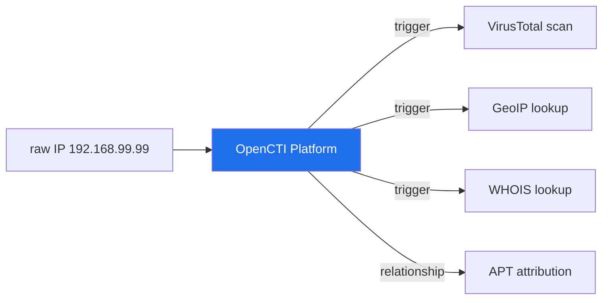
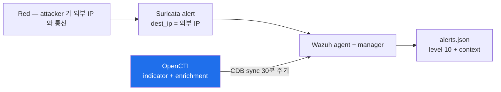

# Week 13 — OpenCTI 운영 — Connector 활성 + IOC enrichment + Wazuh 본격 통합

> **본 주차의 한 줄 요약**
>
> W12 의 OpenCTI 도입 위에서 **실 운영** — 4 external Connector 활성 (MITRE ATT&CK / OTX
> / URLhaus / AbuseIPDB), Internal Enrichment Connector (VirusTotal / GeoIP / WHOIS),
> Stream Connector (Wazuh CDB list 자동 sync). **OpenCTI Web UI 의 핵심 6 화면**
> (Analyst Workbench / Investigations / Knowledge / Observables / Threats /
> Connectors). 학습 마지막에 IOC enrichment 가 alert 분석에 어떻게 가치 추가하는지
> R/B/P 로 검증.
>
> **운영자 한 줄 결론**: external feed 만으로는 noise. Internal enrichment + analyst
> workbench 가 CTI 의 진짜 가치.

---

## 학습 목표

1. **4 external Connector** — MITRE ATT&CK / OTX / URLhaus / AbuseIPDB 활성 + 작동 원리.
2. **Internal Enrichment Connector** 3 — VirusTotal / GeoIP / WHOIS.
3. **Stream Connector** — OpenCTI → Wazuh CDB list 자동 sync (Python).
4. **OpenCTI 6 화면** — Analyst Workbench / Investigations / Knowledge / Observables /
   Threats / Connectors.
5. **MITRE ATT&CK Navigator** 통합 — 본 환경 alert 의 TTP 매트릭스.
6. **IOC enrichment 흐름** — raw IP → GeoIP + WHOIS + VT scan + APT attribution.
7. **R/B/P** — Red 의 의심 IP → OpenCTI 자동 enrichment → Wazuh alert level 격상.

---

## 1. external Connector 4 — 활성 + 동작

### 1.1 MITRE ATT&CK Connector

- source: https://github.com/mitre/cti
- 가져오는 객체: Tactics / Techniques / Sub-techniques / Mitigations / Groups
- 14 Tactics + 200+ Techniques + 600+ Sub-techniques
- 업데이트: 분기별 자동

### 1.2 OTX (AlienVault) Connector

- source: AT&T Cybersecurity OTX (무료)
- API key 필요 (otx.alienvault.com 가입)
- 가져오는 객체: Indicator (IP / Domain / File hash / URL)
- Pulse (분석 보고서) 의 IOC

### 1.3 URLhaus Connector (abuse.ch)

- source: urlhaus.abuse.ch
- 무료 + TAXII 2.1 지원
- 실시간 malware URL feed (분당 100+ 신규)
- Indicator: URL + 관련 hash + tags

### 1.4 AbuseIPDB Connector

- source: abuseipdb.com
- API key 필요
- IP reputation score (0-100)
- abuse confidence + 보고 timestamp

---

## 2. Internal Enrichment Connector 3

### 2.1 VirusTotal Connector

- 새 Indicator (file hash / URL / domain) 가 OpenCTI 에 들어오면 자동 enrichment
- VT scan 결과 attach (detection ratio + AV vendor 이름)
- API key 필요 (vt.com 무료 plan)

### 2.2 IP GeoIP

- MaxMind GeoLite2 DB 활용 (무료)
- IP → 국가 / 도시 / ASN / 위도/경도
- attribution 분석에 활용 (APT 의 출신 국가 추정)

### 2.3 WHOIS Connector

- Domain → 등록자 / 등록 시각 / 등록자 email
- 새 도메인 (< 30일) 검출 — phishing 의심

---

## 3. Stream Connector — Wazuh CDB list 자동 sync

### 3.1 Python connector 구조

```python
# /opt/opencti/connectors/wazuh-stream/main.py
import pycti, time, os
from datetime import datetime, timedelta

helper = pycti.OpenCTIConnectorHelper(config)

def sync_to_wazuh():
    # 1. 최근 7일 indicator 추출
    indicators = helper.api.indicator.list(
        filters=[
            {"key": "valid_from", "values": [(datetime.now() - timedelta(days=7)).isoformat()]},
            {"key": "indicator_types", "values": ["malicious-activity"]}
        ],
        first=10000
    )

    # 2. CDB 형식 변환
    cdb_lines = []
    for ind in indicators:
        if "ipv4-addr:value" in ind["pattern"]:
            ip = ind["pattern"].split("'")[1]
            labels = ",".join(ind.get("labels", []))
            cdb_lines.append(f"{ip}: {labels}")

    # 3. CDB list 갱신
    with open("/var/ossec/etc/lists/opencti-iocs", "w") as f:
        f.write("\n".join(cdb_lines))

    # 4. Wazuh reload
    os.system("/var/ossec/bin/ossec-makelists")
    os.system("/var/ossec/bin/wazuh-control reload")

    helper.log_info(f"Synced {len(cdb_lines)} indicators")

while True:
    sync_to_wazuh()
    time.sleep(1800)
```

### 3.2 운영 권장

- 1800초 (30분) 주기 sync
- diff sync (added / removed) → CDB 부분 갱신
- error handling + logging (helper.log_info)
- 7-30일 retention (오래된 IOC 자동 제거)

---

## 4. OpenCTI Web UI — 6 핵심 화면

### 4.1 Analyst Workbench (대시보드)

- 최근 indicators / observables / reports
- analyst 별 할당 case
- timeline + recent activity

### 4.2 Investigations (조사)

- case 별 STIX object 묶음
- evidence + narrative + timeline
- analyst 노트 + 동료 review

### 4.3 Knowledge — 4 sub

- **Threats**: Threat Actor / Intrusion Set / Campaign / Tool / Malware
- **Arsenal**: Tool / Attack Pattern / Vulnerability
- **Techniques**: MITRE ATT&CK 14 Tactics × 200+ Techniques
- **Entities**: Identity / Location / Sector

### 4.4 Observables

- Indicator + Stix Cyber Observable (IP / Domain / Hash / URL / Email / 등)
- 검색 + 필터

### 4.5 Threats — Threat Actor 의 매트릭스

- APT28 의 TTP 매트릭스 (어느 Technique 사용)
- Indicator 통계

### 4.6 Connectors — 통합 관리

- 4 external + 3 enrichment + 1 stream 활성 상태
- 마지막 sync timestamp
- error log

---

## 5. MITRE ATT&CK Navigator 통합

OpenCTI 의 MITRE matrix 가 dashboard 의 Modules > MITRE ATT&CK 와 매핑.

```
OpenCTI: Threat Actor APT28
  ├── uses Technique T1059.004 (Unix Shell)
  ├── uses Technique T1071 (Application Layer Protocol)
  └── uses Technique T1078 (Valid Accounts)

dashboard: Modules > MITRE ATT&CK
  → 본 환경에서 매치된 alert 의 Technique 가시화
  → APT28 의 매트릭스 와 overlay → coverage gap 식별
```

운영 권장 — 매월 MITRE coverage report (어느 Technique 가 alert 됐는지) + 분석.

---

## 6. IOC enrichment 흐름



원본 raw IP → OpenCTI 의 Indicator 객체 → 3 enrichment trigger → APT attribution

**enrichment 후 정보**:
- IP: 192.168.99.99
- GeoIP: Russia / Moscow / AS12345 (RuNet ISP)
- WHOIS: 등록 2020-01-15 / suspicious-registrar.ru
- VirusTotal: detection 45/72 (positive ratio 62%)
- Tags: apt28-c2, emotet-distributor
- MITRE: T1071.001 (Web Protocols)

이게 IOC enrichment 의 가치 — raw IP 한 줄이 풀 context.

---

## 7. R/B/P — 의심 IP enrichment → alert 격상



본 lab Step 5 에서 시뮬.

---

## 8. 사례 분석

### 8.1 ISMS-P / NIST / KISA

- ISMS-P 2.9.5 / 2.9.6 (지속)
- NIST CSF ID.RA-2 / DE.AE-3 (Event Analysis)
- KISA C-TAS + FSEC-CTI feed 통합

### 8.2 운영 사고 3 사례

**사례 1 — Connector noise 폭증**:
```
운영자: OTX Connector 활성 → 분당 1000+ indicator import → CDB 갱신 부담
복구: filter (high confidence only) + 30분 sync interval
```

**사례 2 — IOC retention 부재**:
```
운영자: 1년 누적 IOC → CDB 크기 100MB+ → Wazuh 매칭 성능 부담
복구: 30일 retention + 자동 expire
```

**사례 3 — VT API rate limit**:
```
운영자: VirusTotal 무료 plan (분당 4 query) → enrichment 대기열 폭증
복구: 유료 plan 또는 enrichment 우선순위 (high confidence only)
```

---

## 9. 과제

### A. Connector 활성 계획 (필수, 30점)

4 external + 3 enrichment + 1 stream = 8 Connector 활성 + API key 필요 표 + 우선순위.

### B. Python Stream Connector (심화, 30점)

§3.1 의 Python connector 보강 — diff sync + error handling + log + retention.

### C. R/B/P 보고서 (정성, 25점)

§7 의 시나리오 + enrichment 가 alert 분석에 추가한 가치.

### D. MITRE matrix coverage (정성, 15점)

본 환경 alert (1 주 분량) 의 MITRE Technique 매트릭스 + coverage gap.

---

## 10. 다음 주차 (W14) 예고

- **주제**: MISP + OpenCTI 양방향 sync + IOC sharing community
- **연결**: W13 의 OpenCTI 단일 platform → W14 의 community sharing
