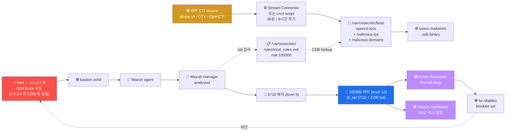

# Week 13 — OpenCTI (2) — IOC Feed → Wazuh CDB list 통합

> W12 의 STIX/TAXII 표준 위에, 실제 외부 IOC feed 를 **Wazuh 의 CDB list (Constant
> Database)** 에 자동 sync 하여 SIEM alert 의 level 을 자동 상승시키는 가장 단순
> 강력한 CTI ↔ SIEM 통합 패턴 학습. 본 주차는 W12 의 OpenCTI Stream Connector +
> Wazuh CDB list + Active Response 의 3 통합.

## 학습 목표

학생은 본 주차 종료 시 다음을 수행할 수 있어야 한다.

1. **Wazuh CDB list** 의 구조 + key-value lookup + .cdb binary index
2. **CDB list 등록** (ossec.conf 의 `<list>`) + 자동 rebuild
3. **rule 의 list lookup** (`<list field="..." lookup="...">...</list>`)
4. **lookup 모드 5** (address_match_key / match_key / match_key_value 등)
5. **IOC feed 자동 갱신** — cron + abuse.ch / OTX 의 download
6. **OpenCTI Stream Connector** — Python script 의 STIX → CDB 변환
7. **Active Response 통합** — CDB 매치 시 fw drop 자동
8. **운영 권장 + alert fatigue 방지**

## 강의 시간 배분 (3시간 40분)

| 시간      | 내용                                                                | 유형 |
|-----------|---------------------------------------------------------------------|------|
| 0:00–0:30 | 이론 — CDB list 구조 + lookup 모드 5                                | 강의 |
| 0:30–1:00 | 이론 — rule 의 list 매칭 + level 자동 상승                          | 강의 |
| 1:00–1:10 | 휴식                                                                 | —    |
| 1:10–1:40 | 이론 — IOC feed 자동 갱신 + cron                                    | 강의 |
| 1:40–2:00 | 이론 — OpenCTI Stream Connector + Active Response 통합               | 강의 |
| 2:00–2:30 | 실습 1, 2 — CDB list 작성 + ossec.conf 등록                          | 실습 |
| 2:30–2:40 | 휴식                                                                 | —    |
| 2:40–3:10 | 실습 3, 4 — rule 의 list lookup + 트리거                              | 실습 |
| 3:10–3:30 | 실습 5 — IOC 자동 갱신 cron + R/B/P                                 | 실습 |
| 3:30–3:40 | 정리 + W14 (Threat Hunting) 예고                                    | 정리 |

---

## 1. Wazuh CDB list 의 정의

### 1.1 CDB 란?

```
CDB = Constant Database (Dan Bernstein 의 데이터 형식)
      key-value 자료 구조
      읽기 매우 빠름 (O(1) lookup)
      파일 기반 (atomic update)

Wazuh 에서 사용:
  - text file (사람 읽기) → ossec-makelists → .cdb binary index
  - manager 가 alert 처리 시 lookup
```

### 1.2 CDB list 의 가치

```
1. Wazuh rule 안에서 빠른 IOC 매칭
2. text file 형식 → 외부 source (cron / Python script) 갱신 용이
3. 갯수 무관 (10K+ IOC 도 O(1) lookup)
4. .cdb 가 binary 라 lookup 매우 빠름 (10K row 도 1ms 미만)
```

### 1.3 사용 시나리오

```
1. Known malicious IP 차단
2. Known scanner UA 차단 (sqlmap / nmap / nikto)
3. Known phishing domain 차단
4. Compromised credential 매칭
5. Allowlist (정상 IP — false-positive 회피)
```

---

## 2. CDB list 의 형식

### 2.1 단순 텍스트 형식

```
# /var/ossec/etc/lists/malicious-ips
# 형식: key:value
# value 는 optional (단순 list 시 비움 가능)
1.2.3.4:c2_server
5.6.7.8:botnet
9.10.11.12:malware_distribution
185.156.73.31:abuse.ch
```

### 2.2 키 의 종류 5

```
1. IP address              : 1.2.3.4
2. CIDR (subnet)           : 1.2.3.0/24
3. domain                  : evil.com
4. hash (MD5/SHA256)        : abcdef0123...
5. arbitrary string        : sqlmap/1.5  (User-Agent)
```

### 2.3 .cdb binary 생성

```bash
# 변경 후 binary index 재 생성
sudo /var/ossec/bin/ossec-makelists

# 또는 wazuh-control reload 가 자동 호출
sudo /var/ossec/bin/wazuh-control reload
```

### 2.4 CDB list 의 위치

```
/var/ossec/etc/lists/      ← Wazuh 의 기본 CDB 디렉토리
  audit-keys
  amazon-account-roles
  ...
  malicious-ips             ← 사용자 정의
  malicious-hashes
  malicious-domains
  known-scanner-uas
```

---

## 3. ossec.conf 의 CDB list 등록

### 3.1 ruleset 섹션

```xml
<!-- /var/ossec/etc/ossec.conf -->
<ossec_config>
  <ruleset>
    <decoder_dir>ruleset/decoders</decoder_dir>
    <rule_dir>ruleset/rules</rule_dir>

    <!-- CDB list 등록 — 여러 개 가능 -->
    <list>etc/lists/malicious-ips</list>
    <list>etc/lists/malicious-hashes</list>
    <list>etc/lists/malicious-domains</list>
    <list>etc/lists/known-scanner-uas</list>
  </ruleset>
</ossec_config>
```

### 3.2 적용

```bash
# config 변경 후 reload
sudo /var/ossec/bin/wazuh-control reload

# 또는 restart (큰 변경 시)
sudo /var/ossec/bin/wazuh-control restart
```

### 3.3 검증

```bash
# binary index 가 생성 됐는지 확인
ls -la /var/ossec/etc/lists/*.cdb

# 예: malicious-ips.cdb
# size 가 0 이 아닌지
```

---

## 4. rule 의 list lookup

### 4.1 기본 syntax

```xml
<!-- /var/ossec/etc/rules/local_rules.xml -->
<group name="6v6,cti,custom,">

  <rule id="100300" level="12">
    <if_sid>5710</if_sid>   <!-- SSH failed login chain -->
    <list field="srcip" lookup="address_match_key">etc/lists/malicious-ips</list>
    <description>6v6 — SSH login from KNOWN malicious IP (CTI)</description>
  </rule>

</group>
```

### 4.2 lookup 모드 5

| lookup | 의미 | 사용 |
|--------|------|------|
| `match_key` | field 가 key 와 정확 일치 | 단순 매칭 |
| `match_key_value` | field 가 "key:value" 형식 매칭 | value 도 검사 |
| `not_match_key` | 매치 안 됨 | 화이트리스트 |
| `address_match_key` | IP / CIDR 매칭 (subnet 지원) | 본 주차의 핵심 |
| `address_match_key_value` | IP + value 매칭 | IP 의 label 도 검사 |

### 4.3 address_match_key 의 동작

```
CDB list:
  10.0.0.0/8:internal
  1.2.3.4:c2

rule 의 field=srcip 검사:
  srcip = 1.2.3.4 → match (CDB 의 1.2.3.4 매칭)
  srcip = 10.5.6.7 → match (CDB 의 10.0.0.0/8 subnet 매칭)
  srcip = 8.8.8.8 → no match
```

### 4.4 if_sid + list 결합

```xml
<rule id="100300" level="12">
  <if_sid>5710</if_sid>     <!-- 부모 rule (SSH failed login) -->
  <list field="srcip" lookup="address_match_key">etc/lists/malicious-ips</list>
  <description>SSH brute from malicious IP</description>
</rule>
```

해석:
1. parent rule (5710) 이 매치 (SSH failed login)
2. + CDB list 매칭 (srcip 이 malicious-ips 에 있음)
3. → level 12 alert

### 4.5 결과: alert level 자동 상승

```
원래:
  5710 SSH failed login (level 5)
  → alert.json 에 level 5 alert (medium)

CDB list 매치 후:
  100300 (level 12) 의 if_sid 5710 매치 + list 매치
  → alert.json 에 level 12 alert (critical)
  → dashboard 의 우선순위 자동 상승
  → SOC 분석가 즉시 알림
```

---

## 5. IOC Feed 자동 갱신

### 5.1 abuse.ch URLhaus

```bash
#!/bin/bash
# /usr/local/bin/wazuh-ioc-update-urlhaus.sh
set -e

URL="https://lists.blocklist.de/lists/all.txt"
OUT="/var/ossec/etc/lists/malicious-ips"
TMP="${OUT}.tmp"

# 1. 다운로드
curl -s "$URL" -o /tmp/ips_raw.txt

# 2. 정제 (주석 제외 + 빈 줄 제외 + 1000 개만)
grep -v "^#" /tmp/ips_raw.txt | grep -v "^$" | head -1000 | \
    awk '{print $1 ":blocklist.de"}' > "$TMP"

# 3. atomic move
mv "$TMP" "$OUT"

# 4. binary index 재 생성
/var/ossec/bin/ossec-makelists

# 5. Wazuh reload
/var/ossec/bin/wazuh-control reload

# 6. log
echo "$(date) — Updated malicious-ips: $(wc -l < $OUT) entries" >> /var/log/ioc-update.log
```

### 5.2 cron 자동화

```cron
# /etc/cron.d/wazuh-ioc-update
0 */6 * * * root /usr/local/bin/wazuh-ioc-update-urlhaus.sh
```

매 6 시간 갱신.

### 5.3 OTX AlienVault

```bash
#!/bin/bash
# OTX_API_KEY 환경 변수 설정 필요
curl -s -H "X-OTX-API-KEY: $OTX_API_KEY" \
    "https://otx.alienvault.com/api/v1/indicators/export?types=IPv4&modified_since=$(date -d 'yesterday' -Iseconds)" \
    -o /tmp/otx_ips.json

# JSON → CDB
jq -r '.results[] | select(.indicator_type=="IPv4") | "\(.indicator):otx"' /tmp/otx_ips.json \
    >> /var/ossec/etc/lists/malicious-ips

# rebuild + reload
/var/ossec/bin/ossec-makelists
/var/ossec/bin/wazuh-control reload
```

### 5.4 OpenCTI Stream Connector (W12 참조 — 본 주차 핵심)

```python
#!/usr/bin/env python3
# /opt/opencti-wazuh-stream/main.py
#
# OpenCTI 의 indicator → Wazuh CDB list 자동 sync

import os
import time
import pycti
from datetime import datetime, timedelta

config = {
    "opencti_url": "https://opencti.local:8080",
    "opencti_token": os.environ["OPENCTI_TOKEN"],
    "connector_id": "wazuh-stream-001",
    "connector_type": "STREAM",
    "interval": 1800,    # 30분
}

helper = pycti.OpenCTIConnectorHelper(config)


def sync_indicators_to_wazuh():
    """OpenCTI → Wazuh CDB list 1 사이클"""

    # 1. 최근 7일 + malicious-activity 라벨의 indicator 조회
    indicators = helper.api.indicator.list(
        filters=[
            {"key": "valid_from",
             "values": [(datetime.now() - timedelta(days=7)).isoformat()]},
            {"key": "indicator_types",
             "values": ["malicious-activity"]}
        ],
        first=10000
    )

    helper.log_info(f"Found {len(indicators)} indicators")

    # 2. STIX pattern → CDB 형식 변환
    cdb_lines = []
    for ind in indicators:
        pattern = ind.get("pattern", "")
        labels = ",".join(ind.get("labels", []))

        # IPv4 추출
        if "ipv4-addr:value" in pattern:
            # [ipv4-addr:value = '1.2.3.4']
            ip = pattern.split("'")[1] if "'" in pattern else None
            if ip:
                cdb_lines.append(f"{ip}:{labels}")

        # domain 추출 (별 CDB list 로)
        elif "domain-name:value" in pattern:
            domain = pattern.split("'")[1] if "'" in pattern else None
            if domain:
                # /var/ossec/etc/lists/malicious-domains 에 별도 작성
                pass

    # 3. 임시 파일에 작성 (atomic move)
    out = "/var/ossec/etc/lists/opencti-iocs"
    tmp = f"{out}.tmp"
    with open(tmp, "w") as f:
        f.write("\n".join(cdb_lines))
    os.rename(tmp, out)

    # 4. Wazuh rebuild + reload
    os.system("/var/ossec/bin/ossec-makelists")
    os.system("/var/ossec/bin/wazuh-control reload")

    helper.log_info(f"Synced {len(cdb_lines)} indicators to Wazuh CDB")


# 무한 polling loop
while True:
    try:
        sync_indicators_to_wazuh()
    except Exception as e:
        helper.log_error(f"Sync failed: {e}")
    time.sleep(config["interval"])
```

---

## 6. Active Response 통합

### 6.1 CDB list 매치 → 자동 차단

```xml
<!-- /var/ossec/etc/ossec.conf -->

<!-- 명령 정의 -->
<command>
  <name>firewall-drop</name>
  <executable>firewall-drop</executable>
  <timeout_allowed>yes</timeout_allowed>
</command>

<!-- Active Response 의 trigger 룰 -->
<active-response>
  <command>firewall-drop</command>
  <location>local</location>
  <rules_id>100300</rules_id>    <!-- 위 §4 의 rule id -->
  <timeout>1800</timeout>          <!-- 30분 차단 -->
</active-response>
```

### 6.2 firewall-drop 의 동작

```bash
# /var/ossec/active-response/bin/firewall-drop.sh
# Wazuh 가 자동 호출

#!/bin/bash
# args: $1 = add / delete
# args: $2 = source IP
# args: $3 = rule ID

ACTION=$1
SOURCE_IP=$2

case $ACTION in
  add)
    # nftables drop set 에 추가
    nft add element ip filter blocklist { $SOURCE_IP }
    logger "Wazuh AR: blocked $SOURCE_IP"
    ;;
  delete)
    # timeout 후 자동 삭제 (Wazuh 가 호출)
    nft delete element ip filter blocklist { $SOURCE_IP } 2>/dev/null
    logger "Wazuh AR: unblocked $SOURCE_IP"
    ;;
esac
```

### 6.3 alert → AR 의 전체 흐름

```
1. attacker (1.2.3.4) 가 SSH brute 시도
2. Wazuh 5710 (SSH failed login) 매치 + level 5
3. 본인 100300 매치: 5710 + CDB list 의 1.2.3.4 → level 12
4. ossec.conf 의 active-response 가 100300 매치 detect
5. firewall-drop 호출 → nft add element
6. attacker 의 후속 시도 즉시 fw drop (timeout 30분)
7. 30분 후 자동 unblock
```

---

## 7. 알람 매트릭스 — CTI 통합 의 효과

| event | rule_id | level (전) | level (후, IOC 매치) | AR |
|-------|---------|------------|---------------------|----|
| SSH failed login | 5710 | 5 (medium) | 12 (critical) | fw drop 30분 |
| HTTP 404 burst | 31151 | 4 (low) | 12 (critical) | fw drop 30분 |
| HTTP unknown UA | 31115 | 3 (low) | 10 (high) | log only |
| ModSec block | 30317 | 6 (medium) | 12 (critical) | fw drop 30분 |
| Suricata alert | 86601 | 6 | 12 | fw drop |

IOC 매치 1건 만으로 alert 우선순위 자동 상승 → SOC 효율 향상.

---

## 8. 운영 권장 + alert fatigue 방지

### 8.1 alert fatigue 의 문제

```
1000+ alert / 일 → SOC 분석가 burnout
중요한 alert 가 noise 에 묻힘
critical 매치 가 분석가 손에 가는 데 시간 지연
```

### 8.2 CTI 통합 의 효과

```
1. level 12 alert 만 즉시 분석 (1-2건 / 일)
2. level 7+ alert 는 자동 ticket (자동화)
3. level 6 이하는 batch (분기 review)
4. CDB list 의 신뢰도 평가 (false-positive 비율)
```

### 8.3 운영 사이클

```
일별: alerts.json 의 level 12 alert review (5분)
주별: CDB list 의 신뢰도 review (어떤 IOC 가 false-positive 인지)
월별: IOC feed source 추가 / 제거
분기별: Coverage Matrix 갱신 + AR 효과 평가
```

---

## 9. ATT&CK + 한국 표준

### 9.1 ATT&CK Detect 매핑

본 주차의 CDB list 매칭 = ATT&CK 의 거의 모든 Tactic 의 IOC detection.

### 9.2 ISMS-P 2.10.7 + 2.6.4

- 2.10.7 보안위협 대응 — CTI 통합으로 사전 차단
- 2.6.4 네트워크 침입탐지 — Suricata + Wazuh 통합

### 9.3 KISA 의 IOC 공유

```
KISA 보호나라가 매년 발표하는 침해 사고의 IOC → 본 CDB list 에 추가
한국 ISAC 의 산업별 IOC 공유 → 정기 sync
```

---

## 10. R/B/P 시나리오 — CTI Wazuh 통합 1 사이클



---

## 11. 실습 1~5

### 실습 1 — CDB list 3 파일 작성

```bash
ssh 6v6-siem '
# 1. malicious-ips
cat > /tmp/malicious-ips <<EOF
1.2.3.4:c2_server
5.6.7.8:botnet
9.10.11.12:malware_distribution
185.156.73.31:abuse.ch
10.0.0.0/8:internal_range
EOF
sudo cp /tmp/malicious-ips /var/ossec/etc/lists/malicious-ips
sudo chown ossec:ossec /var/ossec/etc/lists/malicious-ips

# 2. malicious-domains
cat > /tmp/malicious-domains <<EOF
evil.com:phishing
malware.net:c2
attacker.example:test
EOF
sudo cp /tmp/malicious-domains /var/ossec/etc/lists/malicious-domains
sudo chown ossec:ossec /var/ossec/etc/lists/malicious-domains

# 3. known-scanner-uas
cat > /tmp/known-scanner-uas <<EOF
sqlmap:scanner
nmap:scanner
nikto:scanner
masscan:scanner
EOF
sudo cp /tmp/known-scanner-uas /var/ossec/etc/lists/known-scanner-uas
sudo chown ossec:ossec /var/ossec/etc/lists/known-scanner-uas

# 4. cat 으로 검증
sudo cat /var/ossec/etc/lists/malicious-ips
'
```

### 실습 2 — ossec.conf 에 등록 + reload

```bash
ssh 6v6-siem '
echo "=== ossec.conf 의 ruleset 섹션에 list 등록 (이미 있으면 skip) ==="
sudo grep -q "malicious-ips" /var/ossec/etc/ossec.conf || \
    sudo sed -i "/<ruleset>/a\\    <list>etc/lists/malicious-ips</list>\\n    <list>etc/lists/malicious-domains</list>\\n    <list>etc/lists/known-scanner-uas</list>" \
    /var/ossec/etc/ossec.conf

sudo grep -A5 "<ruleset>" /var/ossec/etc/ossec.conf | head -10

echo ""
echo "=== ossec-makelists — binary index 생성 ==="
sudo /var/ossec/bin/ossec-makelists

echo ""
echo "=== .cdb 파일 검증 ==="
sudo ls -la /var/ossec/etc/lists/*.cdb

echo ""
echo "=== reload ==="
sudo /var/ossec/bin/wazuh-control reload
'
```

### 실습 3 — rule 100300 작성

```bash
ssh 6v6-siem '
cat > /tmp/local_rules.xml <<EOF
<group name="6v6,cti,custom,">

  <!-- SSH login from known malicious IP -->
  <rule id="100300" level="12">
    <if_sid>5710</if_sid>
    <list field="srcip" lookup="address_match_key">etc/lists/malicious-ips</list>
    <description>6v6 — SSH login from KNOWN malicious IP (CTI)</description>
  </rule>

  <!-- HTTP UA = known scanner -->
  <rule id="100301" level="10">
    <if_sid>31115</if_sid>
    <list field="srcuser" lookup="match_key">etc/lists/known-scanner-uas</list>
    <description>6v6 — HTTP from known scanner UA</description>
  </rule>

  <!-- DNS query to malicious domain -->
  <rule id="100302" level="12">
    <if_sid>62100</if_sid>
    <list field="query" lookup="match_key">etc/lists/malicious-domains</list>
    <description>6v6 — DNS query to KNOWN malicious domain</description>
  </rule>

</group>
EOF
sudo cp /tmp/local_rules.xml /var/ossec/etc/rules/local_rules.xml
sudo chown root:wazuh /var/ossec/etc/rules/local_rules.xml

echo "=== 룰 작성 완료 ==="
sudo cat /var/ossec/etc/rules/local_rules.xml | head -25

echo ""
echo "=== reload ==="
sudo /var/ossec/bin/wazuh-control reload
sleep 5

echo ""
echo "=== wazuh-logtest 로 사전 검증 (시뮬) ==="
# wazuh-logtest 가 가능하면 사용
sudo /var/ossec/bin/wazuh-logtest 2>&1 | head -5 || echo "wazuh-logtest 미사용 가능"
'
```

### 실습 4 — 트리거 + alert 검증

```bash
# 학습 시뮬 — 실 brute force 안 함, fake log line 만 manager 에 inject
ssh 6v6-siem '
echo "=== 시뮬 — manager 에 fake auth.log line inject ==="
# manager 의 logcollector 로 직접 보냄 (학습용)
echo "$(date +"%b %d %T") sshd[12345]: Failed password for invalid user admin from 1.2.3.4 port 22" | \
    sudo /var/ossec/bin/wazuh-logtest 2>&1 | head -15

# alerts.json 확인 (5초 후)
sleep 5
echo ""
echo "=== alerts.json 의 100300 매치 ==="
sudo grep "100300" /var/ossec/logs/alerts/alerts.json 2>/dev/null | tail -3 | head -1 | jq
'
```

### 실습 5 — IOC 자동 갱신 cron

```bash
ssh 6v6-siem '
# 1. 갱신 script 작성
cat > /tmp/wazuh-ioc-update.sh <<EOF
#!/bin/bash
URL="https://lists.blocklist.de/lists/all.txt"
OUT="/var/ossec/etc/lists/blocklist-de"
TMP="\${OUT}.tmp"

curl -s "\$URL" | grep -v "^#" | grep -v "^\$" | head -500 | \\
    awk "{print \\\$1 \":blocklist.de\"}" > "\$TMP"

mv "\$TMP" "\$OUT"
/var/ossec/bin/ossec-makelists
/var/ossec/bin/wazuh-control reload
echo "\$(date) — Updated blocklist-de" >> /var/log/ioc-update.log
EOF
sudo cp /tmp/wazuh-ioc-update.sh /usr/local/bin/wazuh-ioc-update.sh
sudo chmod +x /usr/local/bin/wazuh-ioc-update.sh

# 2. cron 등록 (예시 — 6시간 주기)
cat > /tmp/wazuh-ioc-cron <<EOF
# Wazuh IOC update — every 6 hours
0 */6 * * * root /usr/local/bin/wazuh-ioc-update.sh
EOF
sudo cp /tmp/wazuh-ioc-cron /etc/cron.d/wazuh-ioc-update

# 3. 시뮬 실행
sudo /usr/local/bin/wazuh-ioc-update.sh 2>&1 | head -5
ls -la /var/ossec/etc/lists/blocklist-de 2>&1 | head
wc -l /var/ossec/etc/lists/blocklist-de 2>&1
'
```

---

## 12. R/B/P 보고서

```markdown
# W13 R/B/P 보고서 — CTI ↔ Wazuh CDB list 통합

## Red 측 (시뮬)
- 가짜 SSH brute 시도 (1.2.3.4 가 CDB 에 있음)
- log injection 으로 manager 에 fake event

## Blue 측 Coverage
| Source | rule | level | AR |
| 5710 (SSH fail) | 부모 매치 | 5 | (없음) |
| 100300 (CDB match) | level 12 | critical | firewall-drop |

총 효과: alert level 5 → 12 자동 상승 + 30분 fw drop

## Purple 측 권장
1. blocklist.de + abuse.ch + OTX 의 3 source 통합
2. cron 6시간 주기 → SLA 의 균형 (실시간 vs 부하)
3. OpenCTI Stream Connector 별 lab (W12 도입 plan)
4. alert fatigue 의 평가 — false-positive 분기 review
5. Active Response 의 timeout 조정 (30분 → 1시간 검토)
```

---

## 13. 과제

### A. CDB list 작성 (필수, 40점)

3 카테고리 (malicious-ips / malicious-hashes / malicious-domains) 각각 10+ entry +
ossec.conf 등록 + binary index 생성 + reload.

### B. rule 작성 (심화, 30점)

3 CDB list 각각 매칭 rule + level 12 + Active Response 연결.

### C. 자동 갱신 (정성, 30점)

본인이 선택한 무료 feed (AbuseIPDB / OTX / blocklist.de 등) 의 갱신 스크립트 + cron
+ 운영 권장.

---

## 14. 평가 기준

| 항목 | 비중 |
|------|------|
| CDB list (A) | 40% |
| rule 작성 (B) | 30% |
| 자동 갱신 (C) | 30% |

---

## 15. 핵심 정리 (10 줄)

1. **CDB list** = Wazuh 의 key-value lookup (Dan Bernstein Constant Database)
2. **5 lookup 모드** — match_key / address_match_key / not_match_key 등
3. **list 등록** = ossec.conf 의 `<ruleset><list>...</list></ruleset>`
4. **rule 의 list lookup** = `<list field="srcip" lookup="address_match_key">...</list>`
5. **alert level 자동 상승** (5 → 12) → SOC 효율
6. **IOC feed 자동 갱신** — cron + abuse.ch / OTX / blocklist.de
7. **OpenCTI Stream Connector** — STIX → CDB 변환 (W12 design)
8. **Active Response** = level 12 매치 → firewall-drop 30분
9. **alert fatigue 방지** = CTI 통합으로 우선순위 자동화
10. **W14 (Threat Hunting)** 다음 주차 — Sighting + Report
