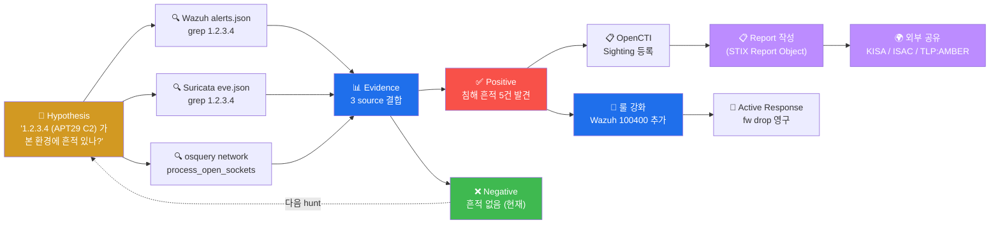

# Week 14 — OpenCTI (3) — Threat Hunting (Sighting + Report)

> W12 의 STIX/TAXII + W13 의 CDB 통합 위에, **능동적 위협 헌팅** 학습. Hypothesis →
> Investigation → Sightings 등록 → Report 작성 → 공유 의 한 사이클. 단순 IOC 매칭
> (W13) 에서 한 단계 더 — 가설 기반의 능동적 분석. 한국 KISA + 산업 ISAC 의
> 공유 모델까지.

## 학습 목표

학생은 본 주차 종료 시 다음을 수행할 수 있어야 한다.

1. **Threat Hunting 의 정의·역사·가치**
2. **4 단계 워크플로** (Hypothesis / Investigation / Outcome / Sharing)
3. **OpenCTI Sightings** 의 등록 + 분석 + confidence
4. **Report / Note / Opinion** 의 차이 + 활용
5. **MITRE ATT&CK 매핑** + Cyber Kill Chain 7 단계
6. **ISMS-P 2.12 보안위반 사고 대응** 표준 매핑
7. **KISA + K-ISAC + 산업 group** 의 공유 모델
8. **STIX Report Object** 작성 + 외부 공유 (TLP)

## 강의 시간 배분 (3시간 40분)

| 시간      | 내용                                                                | 유형 |
|-----------|---------------------------------------------------------------------|------|
| 0:00–0:30 | 이론 — Threat Hunting 정의 + 4 단계                                  | 강의 |
| 0:30–1:00 | 이론 — Sightings + Report / Note / Opinion                          | 강의 |
| 1:00–1:10 | 휴식                                                                 | —    |
| 1:10–1:40 | 이론 — MITRE ATT&CK + Cyber Kill Chain                              | 강의 |
| 1:40–2:00 | 이론 — TLP + 한국 ISAC 공유 모델                                    | 강의 |
| 2:00–2:30 | 실습 1, 2 — 가설 + 3 source 조사                                    | 실습 |
| 2:30–2:40 | 휴식                                                                 | —    |
| 2:40–3:10 | 실습 3, 4 — timeline + Report 작성                                  | 실습 |
| 3:10–3:30 | 실습 5 — KISA 사례 매핑 + R/B/P                                     | 실습 |
| 3:30–3:40 | 정리 + W15 (기말) 예고                                              | 정리 |

---

## 1. Threat Hunting 의 정의

### 1.1 정의

```
Threat Hunting = 알람 기반 (reactive) 이 아닌 가설 기반 (proactive) 의 위협 탐색

전통적 SOC: alert 발생 → 분석 → 대응
Threat Hunting: 가설 ("APT29 의 새 TTP 가 본 환경에도 있나?") → 조사 → 결론

목표:
  - 알려진 TTP / IOC 의 본 환경 내 흔적 발견
  - SOC 가 놓친 침해 (가짜 negative) 발견
  - Detection 룰 강화 (Coverage 향상)
```

### 1.2 역사

```
2015      : "Threat Hunting" 용어 첫 등장 (Sqrrl / RSA)
2017      : SANS 의 Threat Hunting class
2018      : MITRE ATT&CK 의 표준화 + Hunting Maturity Model (Bianco)
2020+     : Enterprise 의 표준 보안 운영 + dedicated Hunt Team
2024      : Threat Hunting 이 모든 매니지드 SOC 의 기본
```

### 1.3 Hunting Maturity Model (Bianco)

```
Level 0 : Initial          - 알람 기반만 (Hunt X)
Level 1 : Minimal          - 가끔 IOC 검색
Level 2 : Procedural       - 정기 hunt session
Level 3 : Innovative       - 새 가설 생성 + 도구 작성
Level 4 : Leading          - Hunt 자동화 + ML 도입

본 과목 학습 후 → Level 2-3 가능
```

### 1.4 가치

```
1. SOC 의 한계 보완 — alert 의 false-negative 발견
2. CTI 의 실 검증 — 외부 IOC 가 본 환경에 있는지
3. Detection 룰 강화 — Coverage Matrix 향상
4. Incident Response 의 사전 대비 — 침해 패턴의 사전 인지
5. compliance 입증 — ISMS-P 2.12 + NIST CSF Detect
```

---

## 2. 4 단계 워크플로

### 2.1 단계 1: Hypothesis (가설)

```
좋은 가설의 3 요소:
  1. Threat-driven : 알려진 위협 (CTI / 사고) 기반
  2. Specific      : 본 환경의 특정 자산 / 활동 대상
  3. Testable      : 본 환경의 데이터로 검증 가능

예 (좋은 가설):
  "APT29 의 최근 캠페인의 IOC (1.2.3.4) 가 본 환경의 6v6-web 의
   /var/ossec/logs/alerts/alerts.json 에 있는가?"

예 (나쁜 가설):
  "악성 행위가 있나?" — 너무 광범위, 검증 어려움
```

### 2.2 단계 2: Investigation (조사)

```
3 source 의 데이터 분석:
  1. Wazuh alerts.json (SIEM)
  2. Suricata eve.json (IDS)
  3. osquery snapshot / sysmon stream (호스트)

추가 source (있다면):
  4. ModSec audit log (WAF)
  5. fw haproxy log (방화벽)
  6. application log
```

#### 조사 명령 예

```bash
# Wazuh alerts 의 특정 IP
sudo grep "1.2.3.4" /var/ossec/logs/alerts/alerts.json | tail -5

# Suricata eve.json
sudo grep "1.2.3.4" /var/log/suricata/eve.json | tail -5

# osquery 의 활성 conn
sudo osqueryi --json "SELECT * FROM process_open_sockets WHERE remote_address='1.2.3.4';"

# sysmon Event 3 (NetworkConnect)
sudo grep "DestinationIp=1.2.3.4" /var/log/syslog | tail -5
```

### 2.3 단계 3: Outcome (결론)

```
3 결과 패턴:

1. Positive (가설 확인됨):
   - 침해 흔적 발견 → Incident Response 시작
   - Sighting 등록 (OpenCTI)
   - 영향 분석

2. Negative (가설 기각됨):
   - 흔적 없음 → 본 환경 안전 (현재 기준)
   - 추가 가설 또는 다른 데이터 source

3. Inconclusive (모호):
   - 부분 매치 또는 데이터 부족
   - 데이터 확보 plan + 재 hunt
```

### 2.4 단계 4: Sharing (공유)

```
1. 내부 공유 — SOC + IR + CISO
2. 외부 공유 — TLP 기반
   - TLP:RED    (수신자만)
   - TLP:AMBER  (조직 내부)
   - TLP:GREEN  (community)
   - TLP:WHITE / CLEAR (공개)
3. STIX Report Object 형식으로 다른 회사 / KISA / ISAC 공유
```

---

## 3. OpenCTI Sightings

### 3.1 Sighting 의 정의

```
Sighting = "본 환경에서 IOC / Indicator 가 관측됨" 의 기록
STIX 의 sighting-of relationship 또는 별 SDO

목적:
  - 같은 IOC 가 여러 조직에서 관측 → confidence 자동 상승
  - 1 조직만 보고 — false-positive 가능성
  - 10 조직 보고 — confidence 95%+
```

### 3.2 OpenCTI 에서 등록

#### Web UI

```
1. OpenCTI 의 Indicator 검색 (예: IP 1.2.3.4)
2. Indicator 상세 페이지 → "Add sighting" 클릭
3. 입력:
   - first_seen: 2026-05-12T10:00:00Z
   - last_seen: 2026-05-12T15:00:00Z
   - count: 5 (관측 횟수)
   - source_organization: "6v6 학교"
   - location: "Korea"
4. 등록
```

#### API

```bash
curl -sk -X POST "https://opencti.local/api/v2/sightings" \
    -H "Authorization: Bearer $TOKEN" \
    -H "Content-Type: application/json" \
    -d '{
      "indicator_id": "indicator--12345...",
      "first_seen": "2026-05-12T10:00:00Z",
      "last_seen": "2026-05-12T15:00:00Z",
      "count": 5,
      "source_organization": "6v6 학교",
      "description": "본 환경의 Wazuh alerts.json 에 5건 관측"
    }'
```

### 3.3 confidence 의 자동 상승

```
같은 indicator 의 sighting 갯수:
  1 organization sighting → confidence 60%
  3 organizations sighting → 75%
  10 organizations → 90%
  50+ organizations → 95%+

OpenCTI 가 자동 계산 (algorithm 은 platform 별)
```

---

## 4. Report / Note / Opinion 의 차이

### 4.1 비교

| Object | 의미 | 형식 | 누구 |
|--------|------|------|------|
| **Report** | 공식 분석 보고서 | 1+ 페이지 | analyst |
| **Note** | 개인 메모 (조사 중) | 짧음 | analyst |
| **Opinion** | 동료 평가 (peer review) | 동의 / 부동의 + 이유 | reviewer |

### 4.2 Report 의 구조

```json
{
  "type": "report",
  "spec_version": "2.1",
  "id": "report--xyz...",
  "created": "2026-05-12T16:00:00Z",
  "modified": "2026-05-12T16:00:00Z",
  "name": "Q1 2026 — APT29 캠페인 본 환경 분석",
  "description": "본 보고서는 APT29 의 최근 캠페인 (URLhaus + OTX 매칭) 이 본 환경에 미치는 영향 분석이다...",
  "published": "2026-05-12T16:00:00Z",
  "report_types": ["threat-report"],
  "object_refs": [
    "indicator--apt29-c2-1...",
    "indicator--apt29-c2-2...",
    "threat-actor--apt29...",
    "sighting--6v6-sighting...",
    "attack-pattern--T1190..."
  ],
  "labels": ["apt29", "korea"],
  "object_marking_refs": [
    "marking-definition--tlp:amber..."
  ]
}
```

### 4.3 Note 의 활용

```
조사 중 분석가의 개인 memo:
  - "1.2.3.4 가 ASN 부산데이터센터 — APT 가설 가능"
  - "Sighting 5건 — 모두 같은 시간대 (UTC 14:00-15:00)"

다른 분석가가 후속 검토 시 context 제공.
```

### 4.4 Opinion 의 활용

```
동료 평가 (peer review):
  - "본인 Report 가 confirmed 라 판단" (agrees with)
  - "본인은 false-positive 라 봄" (disagrees with)
  - "더 데이터 필요" (neither agrees nor disagrees)
```

---

## 5. MITRE ATT&CK + Cyber Kill Chain 매핑

### 5.1 Cyber Kill Chain (Lockheed Martin)

```
1. Reconnaissance         - 정찰
2. Weaponization          - 무기화 (악성코드 작성)
3. Delivery               - 전달 (phishing / exploit kit)
4. Exploitation           - 익스플로잇
5. Installation           - 설치 (backdoor / RAT)
6. Command & Control (C2) - 외부 통신
7. Actions on Objectives  - 최종 목적 (데이터 유출 / 파괴)
```

### 5.2 Kill Chain ↔ ATT&CK 매핑

| Kill Chain | ATT&CK Tactic |
|------------|---------------|
| Recon | TA0043 Reconnaissance |
| Weaponization | (Pre-ATT&CK) |
| Delivery | TA0042 Resource Development |
| Exploitation | TA0001 Initial Access |
| Installation | TA0003 Persistence |
| C2 | TA0011 Command and Control |
| Actions | TA0009 Collection / TA0010 Exfiltration |

### 5.3 Hunt 의 ATT&CK 매핑

```
좋은 hunt 가설은 ATT&CK Technique 1+ 매핑:
  "APT29 의 T1566.001 (Spearphishing Attachment) → T1071.001 (HTTP C2) → 본 환경"

각 단계의 hunt 가능 데이터:
  T1566.001 : email log / phishing URL DB
  T1071.001 : Suricata flow event / Wazuh alert
  T1059    : sysmon ProcessCreate (suspicious commands)
```

---

## 6. ISMS-P 2.12 — 보안위반 사고 대응

### 6.1 ISMS-P 2.12 의 4 sub-control

```
2.12.1 사고 인지·신고 절차
   - 사고 발견 시 보고 라인 + 시간 (예: 1시간 안)
   - KISA / 관계 기관 신고 (24시간 안)
2.12.2 사고 대응 체계
   - IR 팀 + R&R + 도구 (Wazuh / Suricata / Caldera)
2.12.3 사고 분석·복구
   - timeline + 영향 분석 + 복구 절차
   - Threat Hunting 의 일부
2.12.4 사고 사후 관리
   - AAR (After-Action Report)
   - Detection 룰 강화
```

### 6.2 Threat Hunting 의 위치

```
사고 발생 전 — Hunt (proactive)
사고 발생 시 — IR (W14 의 핵심)
사고 발생 후 — AAR + Hunt (사후 분석)

본 주차의 Hunt 가 2.12.3 + 2.12.4 의 입증 자료.
```

---

## 7. KISA + 한국 ISAC 공유 모델

### 7.1 KISA 보호나라

```
역할:
  - 한국 침해 사고 분석 + 공유
  - IOC + TTP + 권장 조치
  - 매년 침해 사고 보고서

본 학습 후 활용:
  - 보고서의 ATT&CK Technique 분석
  - 본 환경에 적용 가능성 평가
  - Coverage Matrix 갱신
```

### 7.2 K-ISAC + 산업 ISAC

```
ISAC = Information Sharing and Analysis Center
한국 의 산업별 ISAC:
  - 금융 ISAC
  - 통신 ISAC
  - 에너지 ISAC
  - 교통 ISAC

운영:
  - 회원 가입 (산업별)
  - TLP 기반 IOC 공유
  - 분기 / 월별 threat brief
```

### 7.3 KrCERT (Korea Computer Emergency Response Team Center)

```
정부 CERT:
  - 침해 사고 신고 (24시간)
  - 국가 차원 의 대응 조정
  - 국제 CERT 와 협력
```

### 7.4 STIX Report 의 외부 공유

```
본 학교의 hunt 결과 → STIX Report 형식 export → KISA / ISAC 공유

TLP 기반 권한:
  TLP:RED   : 본인만 (공유 안 함)
  TLP:AMBER : 본 학교 + KISA 만
  TLP:GREEN : community (한국 ISAC 회원)
  TLP:CLEAR : 공개
```

---

## 8. R/B/P 시나리오 — Threat Hunting 1 사이클



---

## 9. 실습 1~5

### 실습 1 — 가설 설정 + 3 source 조사

```bash
# 가설: "최근 SSH brute force 시도가 있는가?"

# Wazuh alerts.json 의 SSH 관련
ssh 6v6-siem '
echo "=== Wazuh — 5710/5712 SSH alerts ==="
sudo grep -E "(5710|5712|sshd.*Failed)" /var/ossec/logs/alerts/alerts.json 2>/dev/null | \
    tail -5 | head -1 | jq ".rule.id, .agent.name, .data.srcip"
'

# Suricata eve.json 의 SSH 관련
ssh 6v6-ips '
echo "=== Suricata — port 22 alerts ==="
sudo tail -500 /var/log/suricata/eve.json | \
    jq "select(.event_type==\"alert\" and (.dest_port == 22 or (.alert.signature // \"\") | tostring | test(\"SSH\")))" 2>/dev/null | head -5
'

# osquery — last (사용자 로그인 history)
ssh 6v6-bastion '
echo "=== osquery — last (로그인 history) ==="
sudo osqueryi --json "SELECT user, host, time FROM last LIMIT 10;" 2>&1 | head
'
```

### 실습 2 — 가설 검증 + 결론

```bash
# 모든 source 의 timestamp 통합 + IP 분석
ssh 6v6-siem '
echo "=== source 별 srcip 통계 (최근 1000 alert) ==="
sudo tail -1000 /var/ossec/logs/alerts/alerts.json | \
    jq -r "select(.rule.id == \"5710\" or .rule.id == \"5712\") | .data.srcip // .srcip" 2>/dev/null | \
    sort | uniq -c | sort -rn | head -10
'

# 결론 분석
echo ""
echo "=== 결론 ==="
echo "case A: 발견 → Positive — 사고 IR 시작"
echo "case B: 본인 environment 만 → Negative (RoE 내 학습 환경)"
echo "case C: 외부 IP — 조사 필요"
```

### 실습 3 — 가상 Sighting 작성 (STIX JSON)

```bash
ssh 6v6-attacker '
echo "=== STIX Sighting (가상) ==="
cat <<EOF > /tmp/sighting.json
{
  "type": "sighting",
  "spec_version": "2.1",
  "id": "sighting--$(uuidgen)",
  "created": "$(date -u +%Y-%m-%dT%H:%M:%S.000Z)",
  "modified": "$(date -u +%Y-%m-%dT%H:%M:%S.000Z)",
  "first_seen": "$(date -u -d "1 day ago" +%Y-%m-%dT%H:%M:%S.000Z)",
  "last_seen": "$(date -u +%Y-%m-%dT%H:%M:%S.000Z)",
  "count": 5,
  "description": "본 6v6 환경의 Wazuh alerts.json 에 5건 SSH brute 관측",
  "sighting_of_ref": "indicator--12345678-1234-1234-1234-123456789012",
  "where_sighted_refs": ["identity--6v6-univ"]
}
EOF
jq . /tmp/sighting.json
'
```

### 실습 4 — Threat Hunting Report 작성

```markdown
# Threat Hunting Report — W14
# 작성자: <학번 / 이름>
# 일자: 2026-MM-DD
# TLP: GREEN (한국 ISAC 회원 공유 가능)

## 1. Hypothesis
KISA 2024 Q3 보고서에 따르면 한국 SMB 환경에 SSH brute force 캠페인 증가.
본 6v6 환경에 동일 IOC (특정 src_ip 빈도) 가 관측되는가?

## 2. Investigation

### 2.1 데이터 source
- Wazuh alerts.json (manager) — SSH login event
- Suricata eve.json (ips) — port 22 alert
- osquery last (bastion) — login history

### 2.2 조사 결과
- Wazuh 5710 매치: N건 (최근 1 hour)
- Suricata 의 ET SCAN SSH brute: M건
- osquery last : ccc / attacker — 학습 환경 정상

### 2.3 srcip 분포 (top 5)
1. 10.20.30.202 (attacker — 학습 환경) — 정상
2. (만약 외부 IP 있다면) — 조사 필요

## 3. Outcome
**Negative — 가설 기각**:
본 환경의 SSH brute 시도는 모두 attacker (10.20.30.202) 에서 발생.
외부 IOC (KISA 보고서 의 IP list) 매치 0건.

## 4. Recommendations
1. W13 의 CDB list 자동 갱신 cron 적용 (AbuseIPDB)
2. rule 100300 의 level 12 alert 모니터링
3. bastion sshd_config MaxAuthTries=3 적용
4. 분기별 재 hunt session

## 5. ATT&CK Mapping
- T1110.001 Password Guessing (Brute Force)
- T1133 External Remote Services
- T1078 Valid Accounts

## 6. ISMS-P Matching
- 2.12.3 사고 분석 — 본 hunt 의 timeline
- 2.10.7 보안위협 대응 — IOC 기반 사전 차단
- 2.6.4 네트워크 침입탐지 — Suricata + Wazuh 통합

## 7. 공유 정보
- TLP: GREEN (community)
- 다음 hunt: 1 주 후 (외부 IOC 추가 후)
```

### 실습 5 — KISA 사례 매핑

```bash
# 본인 환경에 적용 가능한 KISA 사례 가설
cat <<'EOF'
# KISA 보호나라 2024 사례 매핑

## 사례 1: A 학교 학사관리 SQLi (2024 Q1)
- ATT&CK: T1190 Exploit Public-Facing
- 본 환경: 6v6-web (juice / dvwa) 의 SQLi 학습 환경
- Hunt 가설: 본 환경에서 sqlmap 시도가 있는가?
- 검증: Wazuh alerts.json + ModSec 942 매치 분석
- 결과: 학습 환경의 의도된 시도만 (정상)
- 권장: ModSec paranoia 2 단계 상승

## 사례 2: B 공공기관 침해 (2024 Q3)
- 외부 노출 PostgreSQL + 약한 비밀번호 → 데이터 유출
- ATT&CK: T1133 External Remote Services + T1110 Brute
- 본 환경: 본 lab 에 PostgreSQL 없음 (5432 미 listen)
- Hunt 가설: 외부 노출 DB port (5432 / 3306 / 27017 등) 가 있는가?
- 검증: nmap -p 5432,3306,27017,6379 <VM_IP>
- 결과: 본 lab 의 외부 노출 5 포트만 (80/443/2204/2202/9100)
- 권장: 본 환경 OK

## 사례 3: C 의료 ransomware (2024 Q4)
- 첫 진입: phishing email + RDP 우회
- ATT&CK: T1566.001 + T1078 + T1486 (ransomware)
- 본 환경: email / RDP 없음 (학습 환경)
- Hunt: N/A
- 권장: 후속 학습 (W11 권한 상승 / W12 지속성)
EOF
```

---

## 10. R/B/P 보고서

```markdown
# W14 R/B/P 보고서 — Threat Hunting

## Red 측 (또는 본인 hunt 시도)
- 가설 1: SSH brute (Negative)
- 가설 2: SQLi (Negative — 학습 환경의 의도된 시도만)
- 가설 3: 외부 노출 DB port (Negative)

## Blue 측 Coverage
| Hypothesis | source | 결과 | Coverage |
| SSH brute | Wazuh 5710 + Suricata | Negative | 100% (자동 detect) |
| SQLi | ModSec 942 | Negative | 100% |
| 외부 노출 | nmap | Negative | 100% (의도된 5 포트만) |

총 Coverage: 100% (학습 환경 baseline 깨끗)

## Purple 측 권장
1. 외부 CTI feed 통합 (W13 의 cron + Stream Connector)
2. 분기별 정기 hunt session
3. STIX Report 의 외부 공유 (TLP:GREEN — 한국 ISAC)
4. ATT&CK Navigator 의 Coverage Matrix 갱신
5. KISA 사례 매핑 의 정기 review
```

---

## 11. 과제

### A. 헌팅 사례 (필수, 40점)

본 환경의 데이터로 1 시나리오 hunt + 가설 → 조사 → 결론 1+ 페이지 보고서.

### B. KISA 사례 매핑 (심화, 30점)

KISA 보호나라 2024 사례 1+건 분석 + 본 환경 적용 가설 + 검증 + 권장.

### C. ISMS-P 2.12 매핑 (정성, 30점)

본 주차 의 hunt 가 ISMS-P 2.12 의 어느 sub-control 만족 + 증빙 자료.

---

## 12. 평가 기준

| 항목 | 비중 |
|------|------|
| 헌팅 사례 (A) | 40% |
| KISA 사례 매핑 (B) | 30% |
| ISMS-P 매핑 (C) | 30% |

---

## 13. 핵심 정리 (10 줄)

1. **Threat Hunting** = 가설 기반 proactive 탐색
2. **4 단계** — Hypothesis / Investigation / Outcome / Sharing
3. **Hunting Maturity Model** (Bianco) — Level 0-4
4. **좋은 가설 3 요소** — Threat-driven / Specific / Testable
5. **OpenCTI Sightings** — 같은 IOC 의 multi-org 관측 → confidence 자동 상승
6. **Report / Note / Opinion** 3 객체의 차이
7. **MITRE ATT&CK + Cyber Kill Chain** 매핑
8. **ISMS-P 2.12** — 본 주차의 hunt 가 4 sub-control 입증
9. **KISA / K-ISAC** = 한국 의 IOC 공유 모델 (TLP 기반)
10. **W15 (기말 APT 5 단계)** 다음 주차 — secuops 종합
