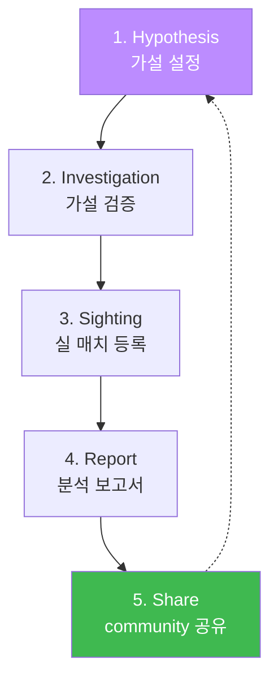
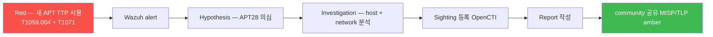

# Week 14 — MISP + OpenCTI 양방향 sync + Threat Hunting + Sightings + Report

> **본 주차의 한 줄 요약**
>
> **MISP (Malware Information Sharing Platform, Luxembourg CIRCL)** 의 **양방향 IOC
> sharing** 모델 + **OpenCTI ↔ MISP Connector** 로 양방향 sync + **Threat Hunting 워크
> 플로** (Hypothesis → Investigation → Sighting 등록 → Report 작성 → community 공유).
> 단순 IOC 매칭 (W13) 에서 **능동적 헌팅** 으로 진화.
>
> **운영자 한 줄 결론**: external feed 만 받으면 consumer. Hunting + Sighting 등록 +
> Report 공유로 contributor 가 되면 CTI 의 진짜 가치 실현.

---

## 학습 목표

1. **MISP 정체성** + OpenCTI 와의 비교 (sharing-focused vs platform-focused).
2. **MISP 의 핵심 객체** — Event / Attribute / Object / Tag / Galaxy.
3. **OpenCTI ↔ MISP 양방향 sync** (Connector 양방향 + circular loop 회피).
4. **Threat Hunting 워크플로 5 단계** — Hypothesis → Investigation → Sighting →
   Report → Share.
5. **MISP Galaxy** — APT / Malware family / Threat Actor 의 분류 체계.
6. **community sharing** — TLP (Traffic Light Protocol) + ISAC / CERT 연계.
7. **R/B/P** — Red 의 새 공격 패턴 발견 → Blue Hunting → Sighting 등록 → Report 작성.

---

## 1. MISP 정체성 + OpenCTI 비교

### 1.1 MISP

- Luxembourg CIRCL (Computer Incident Response Center Luxembourg) 개발
- AGPLv3 license
- 2012~ — sharing-focused (양방향 community sharing 의 시초)
- 200+ MISP 인스턴스 운영 (정부 CERT / 금융 / 방산 / 통신 등)
- **PHP + MySQL** 기반

### 1.2 MISP vs OpenCTI

| 항목 | MISP | OpenCTI |
|------|------|---------|
| 라이선스 | AGPLv3 | Apache 2.0 |
| 모델 | sharing-focused (양방향) | platform-focused (analyst UI) |
| 데이터 | Event-based (incident 중심) | STIX 2.1 object (entity 중심) |
| backend | PHP + MySQL | GraphQL + Elasticsearch |
| 강점 | community sharing + ISAC / CERT 연계 | visualization + Knowledge graph |
| 약점 | UI 복잡 | sharing 제한적 |
| 호환성 | STIX 2.1 export | MISP Connector import/export |

**보완 운영 — production 의 표준 패턴**:
- MISP = feed source + sharing endpoint
- OpenCTI = analyst UI + correlation + enrichment

---

## 2. MISP 핵심 객체 5

### 2.1 Event

incident 중심. 한 침해 / 캠페인 / APT 의 단위.

```
Event ID 12345
  - Date: 2026-05-12
  - Threat Level: Medium
  - Analysis: Initial
  - Distribution: Connected communities
  - Tags: tlp:amber, apt28, malware:emotet
```

### 2.2 Attribute

Event 내의 단일 IOC.

```
Attribute (Event 12345 안)
  - Type: ip-src
  - Value: 192.168.99.99
  - Category: Network activity
  - Comment: APT28 C2
  - to_ids: yes
```

### 2.3 Object

Attribute 묶음 (file + hash + filename + size 등).

```
Object: file
  - filename: malware.exe
  - md5: abc...
  - sha256: def...
  - size: 1234567
  - mimetype: application/x-dosexec
```

### 2.4 Tag — Taxonomy

표준 분류 (TLP / kill-chain / MITRE 등).

```
tlp:white / tlp:green / tlp:amber / tlp:red
kill-chain:reconnaissance / weaponization / delivery
mitre-attack:T1059
malware_classification:trojan
```

### 2.5 Galaxy — Threat 분류

APT 그룹 / Malware family / Threat Actor 분류 체계 (MISP-galaxy github).

```
galaxy-cluster:threat-actor:APT28
galaxy-cluster:malware:Emotet
galaxy-cluster:rat:Cobalt-Strike
```

---

## 3. OpenCTI ↔ MISP 양방향 sync

### 3.1 OpenCTI 의 MISP Connector

- Type: **external-import**
- source: MISP API (REST + API key)
- 가져오는 객체: Event → STIX 2.1 변환 → OpenCTI 의 Indicator / Threat Actor / Malware

### 3.2 MISP 의 OpenCTI Export Connector

- Type: **export**
- source: OpenCTI STIX 2.1 객체
- MISP Event 로 변환 → MISP DB 적재

### 3.3 양방향 sync 의 위험 — circular loop

```mermaid
graph LR
    M[MISP Event 12345] -->|import| O[OpenCTI Indicator]
    O -->|export| M2[MISP Event 12346 (다시)]
    M2 -->|import| O2[OpenCTI duplicate]
    style M fill:#f85149,color:#fff
```

**해결**:
- ID 추적 (source_ref / target_ref)
- timestamp 기반 diff (already exists check)
- per-direction filter (특정 tag 만 export, 다른 tag 만 import)

---

## 4. Threat Hunting 워크플로 5 단계



### 4.1 Hypothesis (가설)

예: "최근 APT28 의 lateral movement TTP (T1078 + T1021) 가 본 환경에서 발견될 가능성".

데이터 source: 최근 외부 보고서 (Mandiant / CrowdStrike / KISA) + community sharing.

### 4.2 Investigation (조사)

- OpenCTI 의 Investigations 화면 + STIX object 묶음
- Wazuh alerts 의 1-3 개월 검색 (rule.id / agent.name / data.alert.signature 매칭)
- osquery / sysmon 의 host log 분석
- 의심 사례 1-N 건 식별

### 4.3 Sighting (실 매치 등록)

OpenCTI 의 Sighting object — "이 IOC 가 이 환경에서 이 시각에 발견됨".

```json
{
  "type": "sighting",
  "spec_version": "2.1",
  "sighting_of_ref": "indicator--abc-...-001",
  "first_seen": "2026-05-12T10:00:00Z",
  "last_seen": "2026-05-12T11:30:00Z",
  "count": 5,
  "where_sighted_refs": ["identity--6v6-secuops"]
}
```

Sighting 이 분석가의 **실 매치 증거**. community 공유 시 신뢰도 향상.

### 4.4 Report (분석 보고서)

OpenCTI 의 Report object — 사람 친화 분석 문서.

```json
{
  "type": "report",
  "name": "APT28 lateral movement in 6v6 environment - W14",
  "report_types": ["threat-report"],
  "published": "2026-05-12T12:00:00Z",
  "object_refs": [
    "indicator--abc-...-001",
    "threat-actor--abc-...-003",
    "attack-pattern--abc-...-004",
    "sighting--abc-...-005"
  ]
}
```

PDF 첨부 + 분석 narrative.

### 4.5 Share (community 공유)

- MISP — Event 로 변환 + TLP 적용 (보통 tlp:amber)
- OpenCTI export → TAXII 2.1 server (있다면)
- ISAC / CERT 직접 공유 (이메일 / API)

---

## 5. MISP Galaxy — Threat 분류 체계

### 5.1 Galaxy 카테고리

| Galaxy | 예 |
|--------|-----|
| threat-actor | APT28 / APT29 / Lazarus / FIN7 / Conti |
| malware | Emotet / TrickBot / Mirai / WannaCry / SolarWinds |
| ransomware | LockBit / REvil / Ryuk / DarkSide |
| rat | Cobalt-Strike / Metasploit-Meterpreter / Sliver |
| sector | finance / government / healthcare / energy |
| country | Russia / North Korea / China / Iran |

### 5.2 Galaxy 활용

분석가가 IOC → Galaxy 매핑 → APT attribution 자동화.

```
Indicator (192.168.99.99) + Galaxy (threat-actor:APT28)
  ↓ MITRE Technique
TA0001 (Recon) — T1595 (Active Scanning)
TA0011 (C2) — T1071 (Application Layer Protocol)
```

---

## 6. TLP (Traffic Light Protocol)

community sharing 의 표준 분류.

| TLP | 의미 | 공유 범위 |
|-----|------|----------|
| **tlp:white** | 공개 | 무제한 |
| **tlp:green** | community | 분야 (sector) 안 |
| **tlp:amber** | limited | 특정 조직 + need-to-know |
| **tlp:red** | restricted | 받은 사람만 |

운영 권장 — 외부 공유 시 **tlp:amber** 가 default.

---

## 7. ISAC / CERT 연계 — 한국

### 7.1 한국의 주요 sharing community

- **KISA** — 한국인터넷진흥원 C-TAS (Cyber Threat Analysis System)
- **금융보안원** FSEC — 금융권 ISAC
- **K-ISAC** — 통신 / 방송 / 인터넷 ISAC
- **EnergyKISC** — 에너지 산업 ISAC

### 7.2 연계 방법

- 각 ISAC 의 회원 가입 + 자체 MISP 운영
- MISP feeds — 정기 IOC sharing (보통 TAXII 2.1 또는 직접 다운로드)
- 신뢰망 — 24시간 emergency alert

### 7.3 sharing 의 의무

- KISA 의 침해 사고 신고 의무 (개인정보보호법 제 34 조)
- 금융기관의 금감원 신고
- 사고 보고 → ISAC 공유 → community-wide hunting

---

## 8. R/B/P — 새 공격 발견 → Hunting → Sighting → Report



본 lab 의 Step 5 에서 시뮬.

---

## 9. 사례 분석

### 9.1 ISMS-P / NIST / KISA

- ISMS-P 2.9.5 (위협정보 수집·공유) — 본 주차의 핵심
- NIST CSF ID.RA-3 (Threat Communication)
- KISA C-TAS 연계

### 9.2 운영 사고 사례

**사례 1 — circular loop 사고**:
```
운영자: MISP ↔ OpenCTI 양방향 sync 활성 → 중복 객체 polymorph 폭증
복구: tag 기반 filter (source 별)
```

**사례 2 — TLP 위반**:
```
운영자: tlp:amber 데이터를 tlp:white community 에 공유 → 신뢰 침해
복구: TLP 자동 검증 + community 별 분리
```

**사례 3 — Sighting 누락**:
```
운영자: IOC 매치 발생했으나 Sighting 등록 안 함 → community 에 false negative report
복구: 자동 Sighting 생성 (rule 매치 → Sighting API call)
```

---

## 10. 과제

### A. MISP + OpenCTI sync 설계 (필수, 30점)

양방향 sync 의 6 단계 + circular loop 회피 + filter 정의.

### B. STIX Sighting 객체 작성 (심화, 30점)

본 환경의 실 alert (예: Suricata sid 9009001) 의 Sighting object.

### C. Threat Hunting 보고서 (정성, 30점)

가상 Hypothesis (APT28 의 lateral movement) → Investigation → Sighting → Report 1 cycle.

### D. TLP 적용 (정성, 10점)

본인이 작성한 Report 의 TLP 분류 + 정당화 근거.

---

## 11. 다음 주차 (W15) 예고

- **주제**: 기말 — W01-W14 통합 시험 + 6-stage 종합 시나리오
- **연결**: 14 주차 학습을 R/B/P 1 cycle 로 통합 평가
