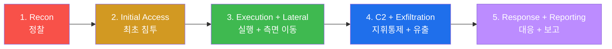

# Week 15 — 기말 — APT 5 단계 통합 + R/B/P + 종합 보고서 (180분, 100점)

> **본 주차의 한 줄 요약**
>
> W01-W14 의 14 주차 학습을 **APT (Advanced Persistent Threat) 5 단계** 시나리오로 통합
> 평가. ① Reconnaissance (Recon) → ② Initial Access → ③ Execution + Lateral
> Movement → ④ C2 + Exfiltration → ⑤ Response + Reporting. 각 단계 20점 (총 100점,
> 180분). W08 중간고사가 도구 별 5 단계 (fw / Suricata / ModSec / osquery / Wazuh) 였
> 다면, W15 기말은 **공격자 시나리오 별 5 단계** + 모든 도구 통합 운영.
>
> **시험 의도**: 학생이 단일 도구 운영이 아니라 **APT cycle 의 전 단계** 를 5종 솔루션
> + CTI 통합으로 대응할 수 있는지 평가.

---

## 1. 시험 개요

| 항목 | 내용 |
|------|------|
| 시간 | 180 분 (3시간) |
| 만점 | 100 점 (5 단계 × 20점) |
| 합격선 | 60 점 |
| 형식 | 실 6v6 인프라 + APT 시나리오 + 모든 5종 + CTI 통합 |
| 도구 | bastion / fw / ips / web / siem / dashboard / OpenCTI (시뮬) |
| 환경 | 6v6 의 16 컨테이너 모두 가동 |
| 협업 | 개인 시험 (개별 환경) |
| 자료 | open book (W01-W14 + 본인 노트) |
| cleanup | **모든 단계 cleanup 필수** (감점 사유) |
| 보고서 | 5 섹션 + 자기 평가 (마지막 30분 작성) |

---

## 2. 5 단계 시나리오 — APT cycle



각 단계는:
- **Red 활동** (공격자 행위 시뮬)
- **Blue 추적** (어느 도구가 어떻게 매치)
- **Purple 운영 권장** (개선 + 자동화)

---

### 단계 1 (20점) — Reconnaissance (정찰)

**MITRE Tactic**: TA0043 Reconnaissance

**Red 활동**: attacker 가 6v6 의 외부 노출 port + vhost 식별
- nmap port scan (fw 의 외부 5 port)
- HTTP fuzzing (host header 별 backend 식별)
- URL 디렉토리 brute force (`/admin`, `/api`, `/.env`)

**Blue 추적** (도구 분담):
- **fw nftables** — input chain 의 dropped SYN (`dmesg | grep DROP`)
- **Suricata** — ET SCAN 카테고리 룰 매치 (rule.id 86xxx)
- **HAProxy log** — 404 burst 검출 (있다면)
- **ModSec** — 913 SCANNER_DETECTION 룰 매치

**Purple 권장**:
- Suricata threshold (60초 5건 → 1 alert)
- nftables drop set 의 source IP 자동 추가 (Active Response)
- 외부 노출 port 최소화

**평가**:
- 정확도 (10): nmap + 4 도구 매치 검증
- 분석 (5): MITRE TA0043 + T1595 매핑
- 운영 권장 (5): threshold + AR + 외부 노출 축소

---

### 단계 2 (20점) — Initial Access (최초 침투)

**MITRE Tactic**: TA0001 Initial Access

**Red 활동**:
- web vhost 의 SQLi 시도 (juice / dvwa)
- XSS 시도 (mediforum)
- LFI 시도 (govportal — `../../etc/passwd`)
- weak credentials brute force (SSH bastion / 약한 web login)

**Blue 추적**:
- **ModSec** — 941/942/930/932/933 룰 매치 (anomaly score 누적)
- **Suricata** — XSS / SQLi / LFI 시그니처 룰
- **HAProxy** — 403 비율 burst
- **Wazuh** — multi-source ingest + level 7+ alert

**Purple 권장**:
- ModSec paranoia 2 (vhost 별)
- Suricata + ModSec 의 audit log 통합 dashboard panel
- weak credentials hardening (PAM)

**평가**:
- 정확도 (10): 4 vector 모두 시도 + 차단 검증
- 분석 (5): anomaly score 누적 패턴
- 운영 권장 (5): paranoia + dashboard

---

### 단계 3 (20점) — Execution + Lateral Movement

**MITRE Tactic**: TA0002 Execution + TA0008 Lateral Movement

**Red 활동** (학습용 시뮬, 실 침투 X):
- web 호스트에 fake webshell 파일 생성 (`/var/www/html/shell.php`)
- bastion 으로 새 사용자 추가 (uid 1099)
- /root/.ssh/authorized_keys 에 FAKEKEY 추가
- /etc/cron.d/backdoor 생성

**Blue 추적**:
- **osquery** — 새 user / authorized_keys / cron 헌팅 (5 query)
- **syscheck** — file 변경 alert (rule 550/554)
- **sysmon-for-linux (W11 시뮬)** — ProcessCreate / FileCreate event
- **Wazuh** — multi-source alert + dashboard MITRE panel

**Purple 권장**:
- osquery scheduled query (600 sec interval)
- Wazuh syscheck realtime (inotify)
- sysmon config.xml 의 RuleGroup
- baseline diff 분기 검토

**평가**:
- 정확도 (10): 4 침해 + 4 헌팅 매치
- 분석 (5): MITRE T1059 / T1078 / T1098 매핑
- 운영 권장 (5): 자동화 + baseline diff

---

### 단계 4 (20점) — C2 + Exfiltration

**MITRE Tactic**: TA0011 C2 + TA0010 Exfiltration

**Red 활동** (시뮬):
- attacker → known IOC IP 와 통신 시도 (192.168.99.99 — CDB list 매치)
- HTTP outbound 의 대량 data (시뮬: `dd if=/dev/urandom bs=1M count=10`)
- DNS query 의 base64 encoded 데이터

**Blue 추적**:
- **CDB list 매칭** — OpenCTI sync 로 known IOC → level 10 격상
- **Suricata** — ET CNC / ET TROJAN 룰
- **OpenCTI enrichment** — IOC 의 attribution + MITRE TTP
- **Wazuh** — alerts.json 의 level 10 + groups: ids, cnc

**Purple 권장**:
- Active Response — attacker IP 자동 차단 (10분)
- OpenCTI Sighting 등록
- dashboard 의 MITRE panel + Threat Actor 매트릭스
- ISAC 공유 (TLP amber)

**평가**:
- 정확도 (10): CDB 매치 + level 10
- 분석 (5): OpenCTI attribution
- 운영 권장 (5): AR + Sighting + 공유

---

### 단계 5 (20점) — Response + Reporting

**MITRE Tactic**: TA0040 Impact (대응) + Reporting

**Red 활동**: (없음 — Blue 의 대응 단계)

**Blue 활동**:
- 모든 cleanup (단계 1-4 의 침해 흔적 제거)
  - fake webshell 삭제
  - fakeintruder user 삭제
  - FAKEKEY 제거
  - backdoor cron 제거
  - 임시 nftables 룰 제거
- alerts.json 의 timeline 보고서
- dashboard 의 saved search + 1 페이지 visualization export

**Purple 활동**:
- Hunting Hypothesis 검증 (APT28 / Emotet 의심)
- OpenCTI Investigation + Sighting 등록
- MISP Event 생성 + TLP amber
- 보고서 작성:
  - Executive Summary
  - 5 단계 timeline
  - Indicators of Compromise (IOC list)
  - Root cause + 권장 5

**평가**:
- 정확도 (10): cleanup 완성 + 보고서 5 섹션
- 분석 (5): timeline + IOC 정확
- 운영 권장 (5): Hunting + Sighting + Share

---

## 3. 평가 기준 매트릭스

| 단계 | 정확도 (10) | 분석 (5) | 운영 권장 (5) |
|------|------------|----------|---------------|
| 1 Recon | nmap + 4 도구 매치 | MITRE TA0043 / T1595 | threshold + AR |
| 2 Initial Access | 4 vector + 차단 | anomaly score | paranoia + dashboard |
| 3 Execution + Lateral | 4 침해 + 4 헌팅 | MITRE T1059/1078/1098 | 자동화 + baseline |
| 4 C2 + Exfil | CDB 매치 + level 10 | OpenCTI attribution | AR + Sighting + share |
| 5 Response | cleanup + 보고서 | timeline + IOC | Hunting + community |

**감점 사유** (각 -5점):
- cleanup 누락 (실험 후 흔적 잔존)
- 보고서 5 섹션 중 하나 빠짐
- R/B/P 의 1 단계 누락
- audit log / eve.json / osquery JSON 분석 누락
- 시간 초과 (각 단계 권장 + 10분 초과)

---

## 4. 시험 진행 순서

| 시간 | 단계 | 활동 |
|------|------|------|
| 0–35  | 1 | Recon — nmap + 4 도구 매치 |
| 35–70 | 2 | Initial Access — 4 vector + ModSec audit |
| 70–110 | 3 | Execution + Lateral — 4 침해 + osquery 헌팅 |
| 110–145 | 4 | C2 + Exfil — CDB 매치 + OpenCTI attribution |
| 145–170 | 5 | Response — cleanup + 보고서 |
| 170–180 | 정리 | 5 단계 종합 자기 평가 |

---

## 5. 보고서 형식 (마지막 30분)

```markdown
# 6v6 W15 기말 — APT 5 단계 통합 — 학번, 이름

## Executive Summary (1 문단)
2026-05-12 모의 APT 5 단계 시뮬을 6v6 5종 솔루션 + osquery + OpenCTI 통합으로 대응.
5/5 단계 모두 매치 검증 + cleanup 완성. attribution = APT28 가설.

## 단계 1 — Recon (20점)
- Red: nmap + HTTP fuzzing + URL brute
- Blue: fw nftables drop + Suricata ET SCAN + ModSec 913
- Purple: threshold + AR

## 단계 2 — Initial Access (20점)
- Red: SQLi + XSS + LFI + brute
- Blue: ModSec 941/942/930 + Suricata + anomaly score 누적
- Purple: paranoia 2 + dashboard panel

## 단계 3 — Execution + Lateral (20점)
- Red: webshell + new user + SSH key + cron
- Blue: osquery 5 헌팅 + syscheck rule 550
- Purple: scheduled query + baseline diff

## 단계 4 — C2 + Exfil (20점)
- Red: known IOC 통신 + outbound data
- Blue: CDB 매치 → level 10 + OpenCTI enrichment
- Purple: AR + Sighting + ISAC

## 단계 5 — Response (20점)
- cleanup 완성 (모든 흔적 제거)
- 보고서 5 섹션
- IOC list + Hunting Hypothesis

## 자기 평가
- 강점: ...
- 보강: ...
- 향후 학습 계획: ...

## 운영 권장 (최종)
1. ...
2. ...
3. ...
4. ...
5. ...
```

---

## 6. 학습 권장 (시험 준비)

1. **W01-W14 lecture 정독** (특히 각 주차의 §15 핵심 정리 8 줄)
2. **lab step 직접 실행** — 14 주 × 10 step = 140 step 의 명령 + 결과 익숙
3. **W08 중간고사 결과 review** — 약점 보강
4. **R/B/P 표준 흐름** — Red 시뮬 → Blue 매트릭 측정 → Purple 운영 권장 + cleanup
5. **MITRE ATT&CK 14 Tactic** + 200+ Technique 의 매핑 숙지
6. **cleanup 1 cycle 의 중요성** — handle 식별 + delete + 정상화 검증
7. **dashboard 의 5 panel + KQL** — 시험 중 빠른 분석

---

## 7. 수료 후 권장 학습 path

본 14 주차 secuops 과목 통과 후 추가 학습 권장:
- **attack** 과목 (15 주) — Red Team 의 PTES 7 단계 + 도구
- **battle** 과목 (15 주) — Red vs Blue 실시간 공방전
- **CTF 동아리** — picoCTF / HackTheBox / TryHackMe
- **certificate** — OSCP / GPEN (Red), GCFA / GCIH (Blue)
- **community** — KISA C-TAS / FSEC-CTI / OWASP Korea

---

## 8. 핵심 정리 (15 주차 학습의 결산)

1. **6v6 4-tier 인프라** — fw / ips / web + bastion / siem / portal / 7 vuln
2. **5종 보안 솔루션** — nftables / Suricata / ModSec + osquery + Wazuh
3. **R/B/P 운영 모델** — 모든 도구가 R/B/P cycle 로 동작
4. **MITRE ATT&CK 매핑** — 14 Tactic × 200+ Technique 가 운영의 공통 언어
5. **CTI 통합** — OpenCTI + MISP + Wazuh CDB list 의 IOC 자동 격상
6. **Defense in Depth** — L1-L4 각 계층의 독립 + 보완
7. **community + sharing** — TLP + ISAC + KISA 연계
8. **운영 audit + git** — 모든 변경의 추적 가능성

---

## 부록 A — APT 5 단계 cheat sheet (시험 응시 시)

```
[단계 1 Recon]
ssh 6v6-attacker 'sudo nmap -sT -p 22,80,443,2204,9100 10.20.30.1 2>&1 | tail -10'
ssh 6v6-fw 'sudo dmesg | grep DROP | tail -5'
ssh 6v6-ips 'sudo grep "ET SCAN" /var/log/suricata/eve.json | tail -3'

[단계 2 Initial Access]
for payload in "?q=<script>" "?q=1' OR '1'='1" "?q=../../etc/passwd"; do
    ssh 6v6-attacker "curl ... 'http://10.20.30.1/$payload'"
done
ssh 6v6-web 'sudo tail /var/log/apache2/modsec_audit.log | grep -oE "\[id \"[0-9]+\"\]"'

[단계 3 Execution + Lateral]
ssh 6v6-web 'sudo useradd -m -u 1099 fakeintruder; sudo bash -c "echo FAKEKEY >> /root/.ssh/authorized_keys"; sudo bash -c "echo cron > /etc/cron.d/w15_backdoor"'
ssh 6v6-web 'sudo osqueryi --json "SELECT * FROM users WHERE uid=1099"'

[단계 4 C2 + Exfil]
ssh 6v6-attacker 'curl -s http://192.168.99.99/ 2>&1' # known IOC
ssh 6v6-siem 'sudo tail /var/ossec/logs/alerts/alerts.json | jq "select(.rule.level >= 10)"'

[단계 5 Response]
ssh 6v6-web 'sudo userdel -r fakeintruder; sudo sed -i "/FAKEKEY/d" /root/.ssh/authorized_keys; sudo rm -f /etc/cron.d/w15_backdoor'
# 보고서 작성
```

## 부록 B — 시험 응시 etiquette

```
□ 시험 시작 전 외부 통신 모두 닫기
□ 매 단계 끝날 때 즉시 cleanup
□ audit log / eve.json / osquery JSON 결과 보고서 첨부 (핵심만)
□ 5 단계 끝나면 보고서 작성 (마지막 30분)
□ 자기 평가 + 운영 권장 5
□ 시험 후 다른 학생과 결과 공유 금지
```
