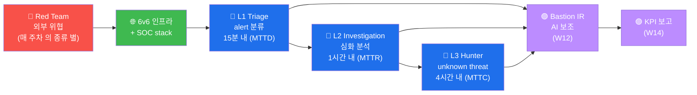

# W01 — SOC 의 역할 + 3 tier + KPI

> SOC = *24/7 의 사이버 방어 운영 센터*. 3 tier (L1/L2/L3) + 5 KPI (MTTD/MTTR/etc).

## SOC 3 tier
- **L1 Triage** (24/7) — alert 의 *1차 분류*
- **L2 Investigation** — 심화 분석 + IR
- **L3 Hunter** — *unknown* threat hunt + lead

## 5 KPI + 목표
- MTTD < 15 분
- MTTR < 1 시간 (high)
- MTTC < 4 시간
- FPR < 5%
- Coverage 70%+

## 6v6 의 SOC stack
- Wazuh (SIEM)
- Suricata (IDS/IPS)
- ModSec (WAF)
- osquery (EDR-like)
- Bastion (LLM agent)

## 본 과목 의 14 weeks
- W02 Threat Hunting / W03 EDR / W04 SOAR / W05 UEBA / W06 TIP / W07 IR / W08 중간
- W09 ATT&CK rule / W10 Sigma / W11 KQL/SPL / W12 Bastion IR / W13 SOAR playbook
- W14 KPI 보고 / W15 기말

## R/B/P 시나리오 — SOC 운영 의 base 형식

본 과목 (soc) 의 모든 주차 의 R/B/P 의 base. SOC 의 R/B/P 의 특수성 = **L1/L2/L3 의
3 tier 의 의사결정 분리**.

### Coverage Matrix — SOC 3 tier × 5 KPI

| KPI | 목표 | L1 의 책임 | L2 의 책임 | L3 의 책임 |
|-----|------|----------|----------|----------|
| **MTTD** | < 15분 | 100% L1 의 책임 (24/7) | N/A | N/A |
| **MTTR (high)** | < 1시간 | trigger 만 | 100% L2 의 책임 | 지원 |
| **MTTC (high)** | < 4시간 | 정리 | 분석 + 대응 | 100% L3 (root cause) |
| **FPR** | < 5% | trigger 정확도 | rule 의 tuning | rule 의 redesign |
| **Coverage** | 70%+ | (자동) | hunting | hunting + new rule |

### 핵심 인사이트 (5 항, 본 과목 base)

1. **3 tier 의 명확 한 책임 분리** — L1 = triage (분류), L2 = investigation (분석),
   L3 = hunting (선제). 각 tier 의 SLA + KPI 의 측정 + 운영 routine.

2. **MTTD < 15분 의 표준** — 알림 의 자동화 + L1 의 24/7 의 routine. 15분 초과 = SLA
   violation = 분기 review 의 alert.

3. **FPR < 5% 의 운영 의 routine** — false positive 의 5% 이상 = SOC fatigue + 실
   alert 의 누락. rule 의 정기 tuning (W10 Sigma 의 학습).

4. **Coverage 70%+ 의 ATT&CK 매핑** — 모든 ATT&CK technique 의 70% 의 detection rule
   의 적용. Gap 분석 의 routine (W09).

5. **Bastion IR 의 AI 보조 (W12)** — L1/L2/L3 의 매 단계 의 Bastion 의 chat 보조.
   alert triage + investigation + hunting 의 3 mode 의 분리 사용.
