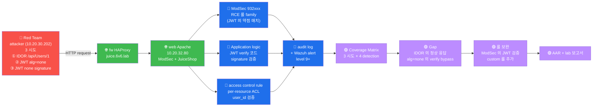

# W02 — A01 Broken Access Control — IDOR + JWT (JuiceShop hands-on)

> **본 주차의 한 줄 요약**
>
> OWASP Top 10 의 1 위 (94% 응용프로그램 발견) — *Broken Access Control* 의 *가장
> 흔한 2 패턴* — IDOR + JWT 변조 — 의 JuiceShop hands-on. JWT 의 3 segment 의
> 구조 + Bearer header 의 IDOR + alg=none 의 *2015 critical bug* 의 *현재 상태*
> 인지.
>
> **운영자 한 줄 결론**: *인증 됐다고 권한 도 자동 부여 X*. JWT 가 *유효* 하더라도
> *role / id 검증* 가 *서버 측* 에 *반드시* 추가. 본 주차 가 *modern API 의 최소
> 권한 원칙* hands-on.

---

## 학습 목표

본 주차 종료 시 학생은 다음 7 가지 를 **본인 손으로** 할 수 있어야 한다.

1. A01 의 *5 대표 패턴* (IDOR / Path Traversal / Force Browsing / Method 변경 /
   Privilege Escalation) 의 *예시 + CWE* 응답.
2. JWT 의 *3 segment* (header / payload / signature) 의 *base64url* decode + 의미
   인지.
3. JWT 의 *alg 5 종* (RS256 / HS256 / ES256 / PS256 / **none**) 의 차이 + *위험도*.
4. Bearer header 의 IDOR 시퀀스 + *role check 부재* 의 결과 인지.
5. JWT alg=none 변조 의 *2015 critical bug* + *2024 modern lib 대응* 의 *현재* 비교.
6. 본 주차 의 lab 5 step 모두 본인 손 으로 + 보고서 작성.
7. CWE-639 (IDOR) + CWE-345 (alg=none) 매핑 + 한국 사고 사례 인지.

---

## 강의 시간 배분 (3시간 30분)

| 차시 | 주제 | 시간 |
|:----:|------|------|
| 1차시 | A01 의 5 대표 패턴 + 6v6 의 JuiceShop 의 매핑 | 50 분 |
| 2차시 | JWT 의 3 segment + 5 alg + Bearer header 흐름 | 60 분 |
| 3차시 | IDOR 의 hands-on + alg=none 의 변조 + modern lib 대응 | 60 분 |
| 4차시 | 보고서 작성 + 한국 사고 사례 + 다음 주차 예고 | 30 분 |
| 휴식 | 차시 사이 + 마지막 | 20 분 |

---

## 1차시 — A01 의 5 대표 패턴 + JuiceShop 매핑

### 1-1. A01 의 의미 — *왜 1 위 인가*

OWASP Top 10 (2021) 의 1 위 = *Broken Access Control*. *94% 응용프로그램* 에서
발견 — *모든 web app 의 거의 모든 곳* 에 잠재.

**원인** = *인증 (Authentication, 너 누구?)* 과 *권한 (Authorization, 너 무엇
할 수 있나?)* 의 *혼동*. 인증 되었다고 *모든 권한* 자동 부여 X — 본인 의 자원만.

### 1-2. 5 대표 패턴

**패턴 1 — IDOR (Insecure Direct Object Reference, CWE-639)**

가장 흔함. *URL 또는 form 의 ID 파라미터* 를 *변조* → *본인 외* 자원 접근.

```
/api/Users/1   ← 본인 의 user
/api/Users/2   ← 다른 user (vuln 시 200 응답)
```

방어: 서버 측 *id 검증* — `if requested_id != current_user.id: return 403`.

**패턴 2 — Path Traversal (CWE-22)**

*파일 경로* 의 *상위 디렉토리* 접근. `../` 또는 URL encoded 변형.

```
?file=image.jpg          ← 정상
?file=../../etc/passwd   ← 시스템 파일 접근
?file=%2e%2e%2f...       ← URL encoded
?file=....//....//       ← double dot bypass
```

방어: *whitelist* 의 file 만 허용 + `realpath` 검증 (chroot 등).

**패턴 3 — Force Browsing (CWE-425)**

*권한 검증 누락* 된 URL *직접 입력*. *링크* 가 *숨겨* 진 페이지 가 *URL 만* 알면 접근.

```
/admin/users      ← 메뉴 에 *링크 X* (관리자 만 보임)
                  ← URL 직접 입력 시 권한 검증 누락 → 200
```

방어: *모든 페이지* 의 *진입 시 권한 검증* (middleware) — *링크 의 부재* 가 *권한
의 부재* 가 아님.

**패턴 4 — HTTP Method 변경 (CWE-285)**

`GET /user/1` 의 *권한 검증* 만 있고 `DELETE /user/1` 의 검증 누락.

```
GET /user/1     ← 200 (정상)
PUT /user/1     ← 권한 검증 X → 데이터 변경 가능
DELETE /user/1  ← 권한 검증 X → 삭제 가능
```

방어: 모든 method 의 *동일 권한 검증* 적용 — middleware 의 *method 무관 적용*.

**패턴 5 — Privilege Escalation (CWE-269)**

*권한 의 점진 상승*. user role 의 *json field* 변조 또는 cookie 변조.

```
POST /api/profile {"role":"user"}    ← 정상 요청
POST /api/profile {"role":"admin"}   ← role field 의 *서버 검증 없음* → 권한 상승
```

방어: *클라이언트* 의 *role field 신뢰 X* — 항상 *서버 측* 의 *user.role* 사용.

### 1-3. 6v6 의 JuiceShop 의 매핑

본 과목 의 *대표 target* — JuiceShop 의 *각 패턴 의 실 vuln*:

| 패턴 | JuiceShop 의 vuln |
|------|------------------|
| IDOR | `/api/Users/{id}` — admin token 으로 *모든 user* 조회 (W02 hands-on) |
| Path Traversal | `/ftp/...` 의 `../` 시도 — *file system* 접근 |
| Force Browsing | `/score-board` 의 *숨겨진* admin 페이지 |
| Method 변경 | `/api/Products/{id}` 의 PUT — *권한 검증 부족* |
| Privilege Escalation | `role: admin` 의 *registration field* 변조 |

본 주차 의 lab = **IDOR + JWT alg=none** 의 *2 패턴* 의 *깊은 hands-on*.

---

## 2차시 — JWT 의 3 segment + 5 alg + Bearer header 흐름

### 2-1. JWT 의 *역할*

JWT (JSON Web Token, RFC 7519) = *modern web* 의 표준 인증 토큰. *cookie 의 대체*
+ *stateless* + *cross-domain 의 쉬움* 의 3 장점.

**왜 modern 한가** — 서버 측 *session storage 없음*. 토큰 자체 의 *서명* 으로 *위
변조 불가* (서명 정상 시).

### 2-2. JWT 의 3 segment

JWT = *3 부분* 의 `.` 구분:

```
eyJhbGciOiJSUzI1NiIsInR5cCI6IkpXVCJ9.eyJkYXRhIjp7ImlkIjoxLCJlbWFpbCI6ImFkbWluQGp1aWNlLXNoLm9wIn19.SIGNATURE
└────────────────────────────────────┘ └────────────────────────────────────────────────────────┘ └───────┘
           Header (base64url)                              Payload (base64url)                     Signature
```

**Header** (decode):
```json
{
  "alg": "RS256",
  "typ": "JWT"
}
```

**Payload (claims)** (decode):
```json
{
  "data": {
    "id": 1,
    "email": "admin@juice-sh.op",
    "role": "admin"
  },
  "iat": 1715840000,
  "exp": 1715843600
}
```

**Signature** = `HMACSHA256(base64(header) + "." + base64(payload), secret)` 또는
RSA 의 *private key 서명*.

### 2-3. alg 5 종 + 위험도

| alg | 설명 | 위험도 |
|-----|------|------|
| **RS256** | RSA + SHA-256 (asymmetric) | ★ Lowest — production 권장 |
| **HS256** | HMAC + SHA-256 (symmetric) | ★★ — secret 노출 시 위험 |
| **ES256** | ECDSA + SHA-256 (asymmetric) | ★ Lowest — short signature |
| **PS256** | RSA-PSS + SHA-256 | ★ Lowest — modern |
| **none** | 서명 X | ★★★★★ — *절대 X*, RFC 의 *legacy* |

**왜 none 이 존재** — RFC 7519 의 *legacy* (1.0 의 호환). modern lib (2020+) 가
*default 거부*.

### 2-4. Bearer header 의 흐름

`Authorization: Bearer <JWT>` — modern API 의 *표준* (RFC 6750).

```
[클라이언트]                              [서버]
     ↓ POST /login {email,password}
                                          ↓ DB 의 user 검증
     ← 200 {token: "eyJ..."}              ← JWT 생성 + RS256 서명
     ↓ token 저장 (localStorage / cookie)
     ↓ GET /api/Users/2
       Authorization: Bearer eyJ...       ↓ JWT 검증:
                                            1. signature 검증 (RS256)
                                            2. exp / iat 확인
                                            3. **권한 검증 (role / id)** ★
     ← 200 {user data}                    ← 정상 시 응답
```

**vuln 의 핵심** — *3 번 권한 검증 누락*. JWT 가 *유효* 하더라도 *role 또는 id*
검증 가 *서버 측* 에 *반드시* 추가.

### 2-5. JuiceShop 의 JWT (실측)

본 step 1 의 *실 응답*:

```json
{
  "alg": "RS256",
  "typ": "JWT"
}
```

```json
{
  "data": {
    "id": 1,
    "email": "admin@juice-sh.op",
    "role": "admin"
  },
  "iat": 1715840000,
  "exp": 1715843600
}
```

JuiceShop = RS256 + admin role 의 token. *vuln* = 본 admin token 으로 *모든 user
조회* 가능 — *role 검증* 없는 *open API*.

---

## 3차시 — IDOR hands-on + alg=none 변조 + modern lib 대응

### 3-1. lab step 3 의의 — Bearer IDOR 5 user

```
admin token (id=1, role=admin) → /api/Users/{1..5}
  user 1 (admin 본인): 200 ← 정상
  user 2 (다른 user): 200 ← VULN! (role 검증 없음)
  user 3: 200 ← VULN
  user 4: 200 ← VULN
  user 5: 200 ← VULN
```

vs

```
no Bearer → /api/Users/{1..5}
  모두 401 ← 정상 (인증 자체 X)
```

**핵심** = *인증 OK 하지만 권한 검증 X*. JuiceShop 의 *고의 vuln* (학습 의도) — 실
production 의 *같은 결함* 가 *모든 API* 에 잠재.

### 3-2. modern API 의 *방어 표준*

OWASP 의 *A01 권장 13* 중 *web 특화 5*:

1. **Deny by default** — *모든 요청* 의 *기본 = 거부*. 명시 적 허용 만.
2. **Single access control mechanism** — *전체 시스템* 의 *한 메커니즘*.
   여러 방식 = bug 가능.
3. **Model access control thoroughly** — *비즈니스 규칙* 의 *명시 적 모델링*.
4. **Disable directory listing** — `Index of /` 의 *기본 거부*.
5. **Log access control failures** — *모든 거부* 의 *log + alert*.

### 3-3. lab step 4 의의 — alg=none 변조

본 step 의 시도:

```
원본 header: {"alg":"RS256","typ":"JWT"}     ← base64url
변조 header: {"alg":"none","typ":"JWT"}      ← base64url
변조 token : <new_header>.<original_payload>. (signature 빈 문자)
```

**예상 결과** (modern, 2024):
```
401 Unauthorized — "invalid algorithm: none"
```

**실측 결과** (JuiceShop, 2026-05-16):
```
user 1: 200
user 2: 200
user 3: 200
```

→ **JuiceShop 의 vuln 확인** — alg=none 통과 → 본 vuln 의 *학습 의도*.

### 3-4. modern lib 의 대응 표준

**2015 의 critical bug** (CVE-2015-9235) — 많은 JWT lib 의 *alg=none* 자동 통과.

**modern lib (2020+)** 의 표준:

```python
# PyJWT — alg whitelist
import jwt
try:
    payload = jwt.decode(token, public_key, algorithms=["RS256"])  # ★ alg whitelist
except jwt.InvalidAlgorithmError:
    raise  # alg=none 자동 거부
```

```javascript
// jsonwebtoken (Node.js)
const decoded = jwt.verify(token, secretKey, {
    algorithms: ['RS256']  // ★ alg whitelist
});
```

**JuiceShop 이 *legacy mode*** — *학습 의도* 의 vuln. 실 production = *반드시*
alg whitelist 적용.

### 3-5. 3 추가 JWT vuln 패턴

본 주차 외 의 *심화 패턴* (W03 / 심화 과정):

**패턴 1 — RS256 → HS256 confusion (CVE-2016-5431)**
- 서버 가 RS256 expected → 공격자 가 HS256 알고리즘 사용
- HMAC 의 secret = RSA 의 *public key*
- 결과: public key 만 알면 토큰 위조 가능

**패턴 2 — weak HS256 secret brute**
- HS256 의 *short secret* (예: "secret123") brute force
- `jwt_tool.py --crack` 의 자동화

**패턴 3 — kid (key id) parameter injection**
- header 의 `kid: ../../etc/passwd` → server 가 파일 읽음
- 또는 `kid: 1; DROP TABLE users--` → SQLi

---

## 4차시 — 보고서 + 한국 사고 사례 + W03 예고

### 4-1. 보고서 의 *3 청자* — 동시 만족

**임원 (CISO)** 의 관심:
- vuln 의 *영향* (얼마나 critical?)
- *돈* 의 손실 가능성 (개인정보 5만 건 = ___원)
- *법* 적 책임 (GDPR / 개인정보보호법)

**운영자 (Platform Engineer)** 의 관심:
- *즉시 패치* 방법
- *production 적용* 의 *영향* (downtime / regression)
- *모니터* 의 *추가 항목*

**분석가 (Security Engineer)** 의 관심:
- *reproduction step* (다른 환경 의 *동일 vuln* 검증)
- *근본 원인* (architecture? code? config?)
- *CVSS / CWE / ATT&CK* 의 *표준 매핑*

본 W02 의 step 5 의 *4 섹션* = 3 청자 *동시 만족* 의 표준.

### 4-2. CVSS 3.1 의 *계산*

JuiceShop IDOR + alg=none 의 *CVSS 추정*:

**IDOR** (Bearer with admin token):
- AV (Attack Vector): N (Network) — *원격 가능*
- AC (Attack Complexity): L (Low) — *단순 curl*
- PR (Privileges Required): L (Low) — *normal user 권한*
- UI (User Interaction): N (None) — *피해자 X*
- S (Scope): U (Unchanged) — *같은 system 내*
- C (Confidentiality): H (High) — *모든 user 데이터*
- I (Integrity): N (None) — *읽기 만*
- A (Availability): N (None)
- **CVSS = 8.2 (High)**

**alg=none**:
- AV/AC/PR/UI/S = 동일
- C/I/A = H/H/H (모든 user 의 *위조 token 가능*)
- **CVSS = 9.1 (Critical)**

### 4-3. 한국 사고 사례 — IDOR + JWT 의 실 사고

**사례 (2024-03): 한국 의 모 핀테크 의 IDOR → 다른 user 의 *계좌 잔액* 노출**
- API: `/api/account/balance?user_id={id}`
- 본인 token 으로 *user_id* 파라미터 변조 → 다른 user 의 잔액 응답
- 영향: 50 만 user 의 잔액 + 거래 내역 노출 가능 (실 침투 X — bug bounty 신고)
- 보상: 한국 첫 *5천만원* bug bounty
- 정정: API 의 *user_id* 파라미터 제거 + 서버 측 *jwt.data.id* 사용

**교훈** — *API parameter* 의 *user_id* 가 *반드시* *jwt.data.id* 와 *일치* 검증.
client 의 *임의 파라미터* 신뢰 X.

### 4-4. W03 예고 — A02 Cryptographic Failures

**W03 = A02 (Cryptographic Failures)** — JWT 의 *심화* + TLS + 비밀번호 hash + 세션
secret.

- lecture: cipher 종류 + hash 종류 + TLS handshake + 비밀번호 hash 의 4 표준
- lab 5 step: weak hash 식별 + TLS 분석 + JWT secret brute + session cookie 분석
- 예상 시간: 8 시간

본 주차 lab step 5 의 *보고서* 가 W03 의 *준비 점검* — 의 *4 섹션 형식* 가 W03 의
*보고 형식*.

---

## 4-5. R/B/P 종합 시나리오 — IDOR + JWT 의 3 관점

본 주차 의 R/B/P. Red = IDOR + JWT alg=none / Blue = ModSec + access control rule /
Purple = 통합 분석 + JWT validation 룰 보완.

### 통합 도식



### Coverage Matrix — 3 시도 × 4 detection

| 시도 | Red 명령 | Blue ModSec | Blue App | Blue ACL | Purple Gap |
|------|---------|------------|---------|---------|-----------|
| **① IDOR /api/Users/1** | `curl -H 'Authorization: Bearer <token>' http://juice.6v6.lab/api/Users/1` | 매치 X (정상 의 HTTP) | JuiceShop = 의도 적 vuln (학습 환경) | ACL 부재 (학습 의 의도) | runtime 의 user_id ↔ token user_id 비교 의 코드 의 부재 |
| **② JWT alg=none** | `curl -H 'Authorization: Bearer <header.payload.>' ...` (signature 비움) | 매치 X (정상 HTTP) | JuiceShop = alg=none 의 의도 vuln | 별도 의 JWT verify 룰 필요 | ModSec 의 custom rule 의 추가 (Authorization header 의 alg=none 패턴 차단) |
| **③ JWT secret brute** | `hashcat -m 16500 jwt.txt rockyou.txt` | 매치 X (offline) | JuiceShop 의 약한 secret | log 없음 (offline brute) | secret 의 entropy 의 강제 + audit 의 routine |

### 시간선 — IDOR + JWT alg=none 의 1 사건 흐름

```
T+0      Red attacker 의 정상 login (자신 의 계정)
         └→ POST /rest/user/login 의 응답 = JWT token (header.payload.sig)
         └→ payload decode = {"id":2, "email":"user@me", ...}

T+5s     Red 의 IDOR 시도
         └→ curl -H 'Authorization: Bearer <token>' http://juice.6v6.lab/api/Users/1
         └→ 응답 = 200 + admin (id=1) 의 data ★ IDOR 발생

T+10s    Red 의 JWT alg=none 시도
         └→ python: header = {"alg":"none", "typ":"JWT"}
                    payload = {"id":1, "email":"admin@..."} (admin 의 id)
                    token = base64(header) + "." + base64(payload) + "."
         └→ curl -H 'Authorization: Bearer <new_token>' http://juice.6v6.lab/api/Users/1
         └→ 응답 = 200 + admin 의 data (signature 검증 안 됨) ★ alg=none bypass

T+30s    Blue 1차 detection (사후)
         └→ ModSec 의 audit log = HTTP 의 정상 응답 의 기록 (alert X)
         └→ access.log 의 /api/Users/1 의 호출 의 burst
         └→ Wazuh 의 standard rule 의 미매치

T+1m     Purple Gap 식별
         └→ Coverage Matrix 의 ②③ 항목 = "ModSec 의 표준 룰 의 미커버"
         └→ JWT 의 alg=none 패턴 = ModSec 의 custom rule 의 필요
         └→ IDOR = application 의 ACL 코드 의 필요 (ModSec 외)

T+10m    Purple 룰 보완 (ModSec custom rule)
         └→ /etc/modsecurity/modsec_local_rules.conf:
            SecRule REQUEST_HEADERS:Authorization "@rx Bearer\s+([^\.]+)\.([^\.]+)\.$" \
                "id:1000001,phase:1,deny,status:403,msg:'JWT alg=none bypass attempt'"
         └→ sudo systemctl reload apache2
         └→ 재테스트 = alg=none 시도 의 403 차단 확인

T+30m    Purple AAR + lab 보고서
         └→ What: IDOR + JWT alg=none 의 detection 의 추가
         └→ Why: 표준 CRS 의 미커버 영역
         └→ Next: W03 의 JWT secret + cipher 의 심화 학습
```

### R/B/P 의 핵심 인사이트 (5 항)

1. **JuiceShop 의 학습 vs 운영 의 의도 적 vuln** — 학습 환경 = JuiceShop 의 vuln 의
   100% 의도. 운영 환경 = 같은 vuln 의 0% 의도. R/B/P 의 학습 = 의도 적 vuln 의 분석
   + 운영 의 적용 의 base.

2. **IDOR 의 application 의 책임** — IDOR = HTTP 의 정상 응답 + application 의 ACL
   의 실패. ModSec (network layer) 의 detection 의 한계. application 의 runtime 의
   user_id 검증 의 코드 필수.

3. **JWT alg=none 의 ModSec custom rule** — JWT 의 표준 검증 = application 의
   책임. 그러나 ModSec 의 custom rule (Authorization header 의 패턴 매치) 으로 1 차
   방어 가능. defense in depth 의 적용.

4. **JWT secret 의 entropy 의 강제** — JWT 의 secret 의 약한 값 (예: "secret123") =
   offline brute 의 위험. secret 의 32+ byte 의 random 의 강제 + 정기 rotation.

5. **audit 의 routine** — 정상 의 HTTP 응답 의 alert 부재 = audit log 만 의 사후
   분석 가능. access.log 의 anomaly (특정 ID 의 burst) 의 detection = SIEM 의 chain
   rule 의 routine 화.

---

## 본 주차 정리

본 W02 을 마치면 학생 은:

1. ✅ A01 의 5 대표 패턴 + JuiceShop 의 매핑 인지
2. ✅ JWT 의 3 segment + 5 alg + 위험도 인지
3. ✅ Bearer header IDOR 의 실 hands-on (Bearer 5×200 + no-auth 5×401)
4. ✅ alg=none 변조 + JuiceShop 의 vuln 확인 (3×200)
5. ✅ 4 섹션 보고서 (Executive / Findings / Remediation / 매핑)

---

## 자기 점검

```
[ ] IDOR 의 *정의* + JuiceShop 의 *실 예* + 방어 표준 응답?
[ ] JWT 의 *3 segment* 의 *base64url* decode + 의미 응답?
[ ] alg 5 종 + *none 의 위험* + modern lib 의 대응 응답?
[ ] Bearer header 의 *흐름* (login → token → IDOR) 응답?
[ ] CVSS 3.1 의 *8 metric* 의 *IDOR 추정* 응답?
[ ] 한국 사고 사례 (핀테크 IDOR) + *교훈* 응답?
```

---

## 다음 주차 — W03

**W03 — A02 Cryptographic Failures**. JWT 의 *심화* + TLS + 비밀번호 hash + 세션
secret.

- lecture: cipher 종류 + hash 종류 + TLS handshake + 비밀번호 hash 의 4 표준
- lab 5 step: weak hash + TLS 분석 + JWT secret brute + session cookie + 보고서
- 예상 시간: 8 시간 (lecture 3 + lab 5)
