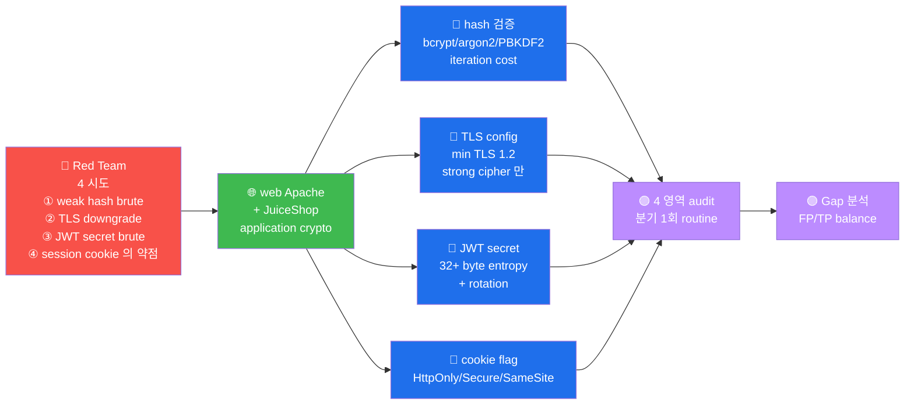

# W03 — A02 Cryptographic Failures — Hash + TLS + JWT secret + Session

> **본 주차의 한 줄 요약**
>
> OWASP Top 10 의 2 위 (이전 명: Sensitive Data Exposure) — *암호 결함 의 4 표준
> 영역* — Hash / TLS / JWT secret / Session — 의 audit 표준. *modern crypto 의 4
> 핵심* 의 *공격 면 + 방어 표준* hands-on.
>
> **운영자 한 줄 결론**: 암호 의 결함 = *모든 보안 의 무력화*. weak hash =
> brute 분 단위 / weak TLS = MITM / weak JWT secret = token 위조 / weak cookie
> = session 절도. 본 주차 의 *4 영역 audit* 가 *최소 보안* 의 baseline.

---

## 학습 목표

본 주차 종료 시 학생은 다음 7 가지 를 **본인 손으로** 할 수 있어야 한다.

1. Hash 6 종 (MD5 / SHA1 / SHA256 / SHA512 / bcrypt / Argon2) 의 *길이 + 형식 + 약함*
   30 초 응답.
2. TLS 의 *handshake 4 단계* + *cipher suite 의 4 부분* (key exchange + auth +
   encryption + MAC) 인지.
3. JWT 의 *alg 5 종* 의 *위험도* + HS256 weak secret 의 *brute 가능성* 인지.
4. Session cookie 의 *4 표준* (HttpOnly / Secure / SameSite / signed) + 각 의 방어
   대상.
5. OpenSSL s_client + nmap ssl-enum-ciphers 의 *TLS audit* 표준 명령.
6. PyJWT 또는 jwt_tool 의 *HS256 secret brute* 시뮬.
7. 4 영역 *종합 보고서* 작성 (4 findings + CVSS + CWE + ATT&CK).

---

## 강의 시간 배분 (3시간 30분)

| 차시 | 주제 | 시간 |
|:----:|------|------|
| 1차시 | Hash 6 종 + bcrypt vs Argon2 + 비밀번호 storage 표준 | 50 분 |
| 2차시 | TLS handshake 4 단계 + cipher suite + cert chain | 60 분 |
| 3차시 | JWT alg 5 + HS256 brute + RS256 마이그레이션 | 50 분 |
| 4차시 | Session cookie 4 표준 + 보고서 작성 | 40 분 |
| 휴식 | 차시 사이 + 마지막 | 20 분 |

---

## 1차시 — Hash 6 종 + 비밀번호 storage 표준

### 1-1. Hash 의 *역할*

비밀번호 의 *원본 저장 X* — *역산 불가* 의 *고정 길이* 출력. 사용자 인증 시 *입력
의 hash* 와 *저장 의 hash* 비교.

**왜 직접 저장 X** — DB 유출 시 *모든 비밀번호 평문 노출*. hash 사용 = *유출 후 도
공격자 가 비밀번호 모름* (이상적).

### 1-2. 6 hash 의 비교

| Hash | 출시 | 길이 (bit) | 길이 (hex) | 적합성 | 약함 |
|------|:----:|:---------:|:---------:|:------:|------|
| **MD5** | 1992 | 128 | 32 | ❌ X | 2004 충돌 + brute 빠름 |
| **SHA1** | 1995 | 160 | 40 | ❌ X | 2017 충돌 |
| **SHA256** | 2002 | 256 | 64 | ⚠️ (password X) | brute 빠름 (GPU 의 10억/초) |
| **SHA512** | 2002 | 512 | 128 | ⚠️ (password X) | brute 가능 |
| **bcrypt** | 1999 | 184 | 60 (format) | ✅ password OK | cost 12+ 권장 |
| **Argon2id** | 2015 | variable | ~100 (format) | ✅ password 최고 | PHC winner |

**왜 SHA-* 가 password 부적합** — *single-pass* + *fast* → GPU 의 *brute 분 단위*.
password 는 *느린* hash (bcrypt / Argon2 의 *시간 + memory cost*) 필수.

### 1-3. bcrypt vs Argon2 — 의 *비교*

**bcrypt (1999, Niels Provos)**:
- *adaptive cost* — `cost 12` = 2^12 iteration. cost ↑ → 느림 ↑
- *salt 자동* — `$2y$12$<salt 22 char><hash 31 char>`
- 한계: *memory-hard 아님* (GPU 의 *parallel brute* 가능)

**Argon2id (2015, PHC winner)**:
- *3 axis*: time cost + memory cost + parallelism
- *memory-hard* — GPU 의 *memory bottleneck* 활용
- *3 variant*: Argon2d (GPU 저항) / Argon2i (side-channel 저항) / Argon2id (mix, 권장)
- 한계: 신생 — *legacy lib 의 지원 부족*

**선택 기준**:
- 새 프로젝트 = **Argon2id** (PHC winner)
- 기존 시스템 = **bcrypt cost 12+** (검증된 lib)
- 절대 X = **MD5 / SHA-* + salt 만**

### 1-4. 비밀번호 storage 표준 5 step

1. **salt 자동** — bcrypt / Argon2 가 자동. *고유 salt* 필수
2. **pepper 추가** (옵션) — *application 측 secret* + salt + password
3. **cost 의 *적정*** — bcrypt 12 (login 100ms) / Argon2id (memory 64MB)
4. **hash 의 *upgrade*** — cost 5 → 12 의 *user 의 다음 login 시 rehash*
5. **DB 의 *유출 가정*** — *모든 hash 의 *유출 후* 안전* 설계

### 1-5. JuiceShop 의 password hash (실측)

W03 lab step 1 의 검증:
- JuiceShop 의 user password = (실측 시 출력) — MD5 / bcrypt / Argon2 중

실 production = *반드시* bcrypt 또는 Argon2id. MD5 발견 시 *즉시 rotate*.

---

## 2차시 — TLS handshake 4 단계 + cipher suite + cert chain

### 2-1. TLS 의 *역할*

TLS (Transport Layer Security, 이전 명: SSL) = *HTTPS 의 핵심*. *3 보장* —
*기밀성 (Encryption)* + *무결성 (MAC)* + *인증 (Cert)*.

### 2-2. TLS handshake 4 단계 (TLS 1.3)

```
[클라이언트]                              [서버]
     ↓ ClientHello
       (지원 cipher list + random)
                                          ↓ ServerHello
                                          ← (선택 cipher + random + cert)
     ↓ Cert 검증 + key 교환
       (Diffie-Hellman)
                                          ↓ Finished
     ← Finished
     ↓ Application Data (encrypted)       ↔ ↑
```

**TLS 1.3 (2018)** — *1 RTT* (이전 2 RTT). *0-RTT* 가능 (옵션, replay 위험).

### 2-3. Cipher suite 의 4 부분

`ECDHE-RSA-AES256-GCM-SHA384` 의 분해:

| 부분 | 의미 | 예시 |
|------|------|------|
| **Key Exchange** | session key 교환 | ECDHE (Elliptic Curve DH Ephemeral) |
| **Authentication** | server 인증 | RSA (또는 ECDSA) |
| **Encryption** | data 암호화 | AES256-GCM (or ChaCha20-Poly1305) |
| **MAC** | 무결성 | SHA384 (또는 SHA256) |

**TLS 1.3 의 단순화** — `TLS_AES_256_GCM_SHA384` (cipher 만 + 표준 ECDHE / authent).

### 2-4. Cipher 의 적합 / 부적합

**적합 (modern, 2024)**:
- `TLS_AES_256_GCM_SHA384` (TLS 1.3)
- `TLS_AES_128_GCM_SHA256` (TLS 1.3)
- `TLS_CHACHA20_POLY1305_SHA256` (TLS 1.3)
- `ECDHE-RSA-AES256-GCM-SHA384` (TLS 1.2)
- `ECDHE-ECDSA-AES256-GCM-SHA384` (TLS 1.2)

**부적합 (deprecated 2020+)**:
- `RC4-*` (CVE-2013-2566) — 즉시 disable
- `3DES-*` (Sweet32 attack 2016) — 즉시 disable
- `DES-*` — 1990s 부터 X
- `EXPORT-*` (FREAK attack 2015) — 즉시 disable
- `NULL-*` (encryption 없음) — 즉시 disable

### 2-5. Cert chain — 의 3 구성

```
[leaf cert]           ← www.example.com (가장 자주)
  signed by ↓
[intermediate CA]     ← Let's Encrypt R3 (또는 DigiCert / Sectigo 등)
  signed by ↓
[root CA]             ← ISRG Root X1 (브라우저 의 trust store 의 root)
```

**검증** — *leaf 부터 root 까지* 의 *서명 chain* 검증. 한 단계 라도 *서명 invalid*
시 거부.

**self-signed** — *leaf = root* (단일). 학습 환경 OK, production 거부 (브라우저 의
경고 표시).

### 2-6. JuiceShop 의 TLS (실측 — W03 lab step 2)

- Protocol: TLSv1.3
- Cipher: TLS_AES_256_GCM_SHA384
- Cert: self-signed (학습 환경)

→ *modern* 적합. 단 cert = self-signed (학습 환경 OK, production = Let's Encrypt).

### 2-7. TLS audit 표준 도구

| 도구 | 용도 |
|------|------|
| `openssl s_client` | *handshake 단순 분석* |
| `nmap --script ssl-enum-ciphers` | *cipher list enumeration* |
| `testssl.sh` | *종합 audit* (Qualys 의 free 대체) |
| `sslyze` | Python TLS scanner |
| Qualys SSL Labs (외부) | *production audit* (외부 URL 만) |

---

## 3차시 — JWT alg 5 + HS256 brute + RS256 마이그레이션

### 3-1. JWT alg 5 — 의 *위험도 재확인*

W02 의 *알람* 재확인:

| alg | 위험도 | 사용 권장 |
|-----|------|---------|
| RS256 | ★ Lowest | production 표준 |
| ES256 | ★ Lowest | TLS 1.3 + short key |
| PS256 | ★ Lowest | modern RSA-PSS |
| HS256 | ★★ — secret 의존 | *long random* secret 필수 |
| **none** | ★★★★★ — 절대 X | RFC legacy |

### 3-2. HS256 의 *위험*

HS256 = HMAC + SHA-256. *서명 + 검증 의 동일 secret* (symmetric).

**위험 1 — secret leak**:
- secret = `JWT_SECRET=mysecret123` 의 *env var* 노출
- git commit 의 *config file* 노출
- log 의 *exception trace* 노출

**위험 2 — weak secret brute**:
- short secret ("secret", "password") brute = *초 단위*
- dictionary secret 의 *분 단위* brute (jwt_tool / hashcat)

**위험 3 — secret rotation 의 *복잡***:
- HS256 의 *secret rotation* = *모든 active session 무효화*
- RS256 의 *private key rotation* = *kid 의 graceful migration* 가능

### 3-3. RS256 vs HS256 — *언제 어느 것*

**HS256 권장** = *small project + symmetric 가능*:
- 작은 *monolith*
- *single server* + *지속 secret*

**RS256 권장** = *production / multi-service*:
- *microservice* — public key 공유 가능
- *외부 partner* — public key 만 공유
- *graceful key rotation* — kid 의 *2 key 공존*

### 3-4. HS256 brute 의 실 도구

**jwt_tool** (Python, ticarpi/jwt_tool):
```bash
git clone https://github.com/ticarpi/jwt_tool
cd jwt_tool
python3 jwt_tool.py <token> --crack -d /usr/share/wordlists/rockyou.txt
```

**hashcat** (mode 16500 = JWT HS256):
```bash
hashcat -m 16500 token.txt /usr/share/wordlists/rockyou.txt
```

**brute 시간 추정** (RTX 4090):
- rockyou.txt (14M words): ~5 분
- 8 char alphanumeric (62^8 = 218 trillion): ~38 일
- 12 char random alphanumeric: *수십 년* (안전)

**결론** — HS256 의 secret = *최소 64 char random* (또는 RS256).

### 3-5. RS256 마이그레이션 절차

1. **새 RSA key pair 생성** (RS256 의 2048bit 권장)
2. **JWT lib 의 *alg whitelist*** — `algorithms=["RS256"]`
3. **kid 추가** — header 의 `kid: 1` (새 key), `kid: 0` (이전 HS256)
4. **graceful migration** — 새 token 은 RS256, 기존 HS256 token 은 *유효 기간 까지*
5. **HS256 deprecation** — 모든 user 의 *다음 login 시* RS256 변환

### 3-6. W03 lab step 3 의의

본 step 의 *시뮬*:
- weak secret "secret" 의 *brute 5 candidate* 시도
- *FOUND* 메시지 출력 → secret 발견 가능 인지

실 운영 = *PyJWT 의 weak token 자체 가 위험* — `pip install pyjwt` 후 의 시뮬.

---

## 4차시 — Session cookie 4 표준 + 보고서

### 4-1. Session cookie 의 *4 표준*

modern web 의 *session 의 최소 보안*:

**1. HttpOnly** = JS 접근 차단
```http
Set-Cookie: sessionid=abc123; HttpOnly
```
방어 대상: **XSS** 의 cookie 절도 (`document.cookie` 차단)

**2. Secure** = HTTPS 만 전송
```http
Set-Cookie: sessionid=abc123; Secure
```
방어 대상: **MITM** (HTTP 의 *평문 전송* 차단)

**3. SameSite** = cross-site 의 차단
```http
Set-Cookie: sessionid=abc123; SameSite=Strict
```
- `Strict` — *완전 차단* (가장 안전)
- `Lax` — *navigation* 만 허용 (default 2020+)
- `None` — *없음* (Secure 필수)
방어 대상: **CSRF**

**4. signed cookie** = 변조 검출
```http
Set-Cookie: sessionid=abc123.signature_hex; HttpOnly
```
방어 대상: 변조 (client 의 cookie 수정 검출)

### 4-2. 4 표준 의 *방어 매핑*

| 표준 | 방어 대상 (OWASP) |
|------|-----------------|
| HttpOnly | A03 XSS |
| Secure | A02 MITM |
| SameSite | A01 CSRF |
| signed | A08 변조 |

→ 4 표준 모두 적용 = *4 OWASP 카테고리* 동시 방어.

### 4-3. 금융 표준 — 7 추가 권장

NeoBank 같은 금융 시스템 의 *추가 7*:

1. **session timeout** = 15 분 (idle) / 8 시간 (절대)
2. **session ID 재발급** = login 시 + 권한 변경 시
3. **device binding** = user-agent + IP (옵션)
4. **2FA / MFA** = high-risk 행동 의 추가 인증
5. **rate limit** = login 의 *10 시도 / 5 분* (brute 방어)
6. **session revocation** = logout / 의심 행동 시 즉시 무효
7. **session log** = 모든 session 의 *시작 / 종료 / 의심* 기록

### 4-4. W03 lab step 5 의의 — 4 영역 종합 보고서

본 step 의 *4 finding* (hash + TLS + JWT + cookie) 가 *crypto audit 의 최소 단위*.
실 운영 = *분기 1 회* 의 *4 영역 audit* 가 *기본 frequency*.

**보고서 의 *3 청자*** (W02 와 동일):
- 임원: *위험 도 + 법 적 책임*
- 운영자: *즉시 / 단기 권장*
- 분석가: *reproduction + 근본 원인*

---

## 4-5. R/B/P 종합 시나리오 — Cryptographic Failures

### 통합 도식



### Coverage Matrix — 4 시도 × 4 detection

| 시도 | Red 명령 | Blue 검증 | Purple Gap | Purple 권장 |
|------|---------|----------|-----------|------------|
| **① weak hash** | `hashcat -m 0 hash.txt rockyou.txt` (MD5) | hash algorithm 의 확인 (bcrypt vs MD5) | legacy DB 의 MD5 password 의 잔존 | 점진적 rehash (login 시 의 자동 migration) |
| **② TLS downgrade** | `openssl s_client -tls1` (TLS 1.0 강제) | TLS config 의 min version 검증 | 일부 server 의 fallback 의 잔존 | 모든 server 의 TLS 1.3 의 enforce + 로그 audit |
| **③ JWT secret brute** | `hashcat -m 16500 jwt.txt rockyou.txt` | JWT secret 의 entropy 측정 | 약한 secret ("secret123") 의 사용 | secret 의 32+ byte random + 정기 rotation |
| **④ session cookie 약점** | `curl -c cookies.txt /login; cat cookies.txt` (flag 확인) | cookie 의 HttpOnly/Secure/SameSite 의 검증 | cookie flag 의 일부 누락 | 모든 session cookie 의 3 flag 의 강제 + automation |

### R/B/P 의 핵심 인사이트

1. **Crypto 의 audit 의 분기 routine** — 4 영역 (hash/TLS/JWT/cookie) 의 분기 1회 의
   audit = crypto failure 의 사전 detection. 운영 의 routine.

2. **hash migration 의 점진적 적용** — legacy MD5 의 일시적 교체 = 운영 위험. login 시
   의 자동 rehash (bcrypt) 의 점진 적용. 6개월 이내 의 100% migration.

3. **TLS 1.3 의 enforce** — 모든 server 의 TLS 1.3 의 강제 + fallback 의 차단. 일부
   legacy client 의 영향 = 5% 이하 (현재 표준).

4. **JWT secret 의 entropy + rotation** — secret = openssl rand -base64 32 의 표준.
   rotation = 분기 1회 + secret 변경 의 backward-compatible 의 2 secret 의 grace
   period.

5. **cookie 의 3 flag (HttpOnly/Secure/SameSite) 의 default** — application
   framework 의 cookie middleware 의 default = 3 flag 의 모두 on. opt-out 의 명시
   적 결정 만 허용.

---

## 본 주차 정리

본 W03 을 마치면 학생 은:

1. ✅ Hash 6 종 의 *길이 + 형식 + 약함* 인지
2. ✅ TLS handshake + cipher suite 4 부분 + cert chain 인지
3. ✅ JWT alg 5 + HS256 brute + RS256 마이그레이션 인지
4. ✅ Session cookie 4 표준 + 방어 매핑 인지
5. ✅ 4 영역 종합 보고서 + CVSS / CWE / ATT&CK 매핑

---

## 자기 점검

```
[ ] MD5 vs bcrypt 의 *brute 시간 차이* + *왜 password 에 bcrypt 권장* 응답?
[ ] TLS handshake 4 단계 + cipher suite 의 *4 부분* 응답?
[ ] HS256 의 weak secret brute 가능성 + RS256 권장 *언제* 응답?
[ ] Session cookie 의 4 표준 + 각 *방어 대상 OWASP* 응답?
[ ] W03 의 4 영역 audit 의 *분기 1 회* 의 표준 frequency 응답?
```

---

## 다음 주차 — W04

**W04 — A03 Injection (SQLi 심화)** — sqlmap + tamper script + ModSec 942
우회 + DVWA + AdminConsole hands-on.

- lecture: SQLi 5 카테고리 + sqlmap 의 4 phase + tamper 의 10 종
- lab 5 step: DVWA SQLi 자동 + AdminConsole NoSQL + 5 tamper × ModSec 우회 + 보고서
- 예상 시간: 10 시간 (lecture 3 + lab 7)
