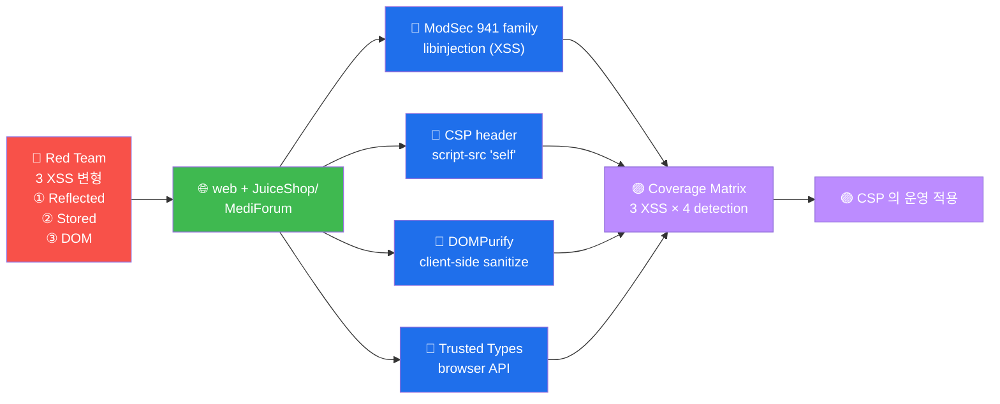

# W05 — A03 Injection (XSS 심화) — ModSec 941 + DOM + CSP

> **본 주차의 한 줄 요약**
>
> A03 의 *XSS* 심화. 3 종 (Stored / Reflected / DOM) + ModSec 941 family + CSP
> 5 directive + DOM 5 sink. *server-side 차단* 외 *client-side 방어* 의 *2 축*.
>
> **운영자 한 줄 결론**: XSS = *cookie 절도 + 화면 변조 + phishing*. *output
> encoding* (서버) + *CSP* (브라우저) + *DOMPurify* (client JS) 의 *3 축* 필수.

---

## 학습 목표

1. XSS 3 종 (Stored / Reflected / DOM) 의 *영향 + 발생 위치 + 방어* 응답
2. ModSec CRS 941 family 의 주요 룰 + libinjection XSS
3. CSP 의 *5 directive* + 'unsafe-inline' 위험 + nonce 적용
4. DOM XSS 의 *5 sink* + DOMPurify / trusted types
5. W05 보고서 + CWE-79 + CWE-1021

---

## 1차시 — XSS 3 종 + ModSec 941

### 1-1. XSS 의 *영향*

XSS = 사용자 브라우저 의 *임의 JS 실행*. *cookie 절도 + form 변조 + phishing 리디
렉트 + 키로깅* 등.

### 1-2. XSS 3 종 비교

| 종류 | 발생 위치 | 영향 면적 | 예시 |
|------|---------|---------|------|
| **Stored** | DB | *모든 user* | 댓글 의 `<script>` 저장 → 페이지 로딩 시 실행 |
| **Reflected** | URL | *한 user* | 검색 결과 의 `?q=<script>` 반사 |
| **DOM** | JS (client) | *한 user* | `document.location.hash` 의 `#<script>` 처리 |

**영향 1 위 = Stored**. 1 공격 → N user.

### 1-3. ModSec CRS 941 의 주요 룰

| Rule ID | 패턴 |
|:-------:|------|
| 941100 | libinjection XSS (token-based) |
| 941110 | XSS attack detected (CRS legacy) |
| 941120 | XSS using JavaScript pseudo URI |
| 941130 | XSS using CDATA |
| 941140 | XSS using XML attribute (xmlns) |
| 941160 | NoScript XSS InjectionChecker — HTML attribute |
| 941170 | NoScript XSS InjectionChecker — attribute injection |
| 941180 | Node-Validator blacklist |
| 941190 | IE XSS (legacy) |
| 941200 | MSIE 의 src=URL XSS |
| 941210 | obfuscated JavaScript |
| 941220 | obfuscated VBScript |
| 941230 | XSS using `<embed>` |
| 941240 | XSS using `<import>` |

---

## 2차시 — CSP (Content Security Policy) 의 5 directive

### 2-1. CSP 의 *역할*

CSP = *브라우저 측 whitelist*. 허용 source 만 의 *resource load*. XSS 의 *영향
최소화*.

### 2-2. 5 핵심 directive

| directive | 의미 |
|-----------|------|
| `default-src` | fallback (모든 type) |
| `script-src` | JS source 제한 (가장 중요) |
| `style-src` | CSS source |
| `img-src` | image source |
| `connect-src` | AJAX / fetch / WebSocket |

### 2-3. CSP 의 *값*

- `'self'` = 같은 origin 만
- `'none'` = 모두 거부
- `'unsafe-inline'` = inline `<script>` 허용 (★ 위험)
- `'unsafe-eval'` = `eval()` 허용 (★ 위험)
- `'nonce-XXX'` = 한 페이지 의 *한 번 만* (random)
- `'sha256-...'` = script content 의 hash 매칭
- `https:` = HTTPS 만
- `https://cdn.example.com` = 특정 host 만

### 2-4. CSP 의 *권장* (modern, 2024)

```http
Content-Security-Policy:
  default-src 'self';
  script-src 'self' 'nonce-RANDOM_PER_REQUEST';
  style-src 'self' 'unsafe-inline';
  img-src 'self' data: https:;
  connect-src 'self';
  frame-ancestors 'none';
  base-uri 'self';
  form-action 'self';
```

### 2-5. CSP 의 *우회 패턴*

CSP 가 *완벽 X*. *우회 가능*:

1. **JSONP endpoint** — `script-src 'self'` 의 *같은 origin* 의 JSONP API 활용
2. **Angular / Vue expression** (legacy) — `{{ alert(1) }}`
3. **upload 가능 파일** — 같은 origin 의 *임의 JS 업로드*
4. **trusted CDN 의 *유명 lib*** — 의 *기존 vuln* 활용

→ CSP + *기타 방어* (output encoding) 의 *조합* 필수.

---

## 3차시 — DOM XSS + DOMPurify + trusted types

### 3-1. DOM XSS 의 *특수성*

server log 에 X. *client-side 만*. server-side WAF (ModSec) 의 *완전 우회*.

### 3-2. 5 sink

| sink | 위험 |
|------|------|
| `innerHTML` | 가장 흔함 — HTML 의 *임의 삽입* |
| `eval()` | JS 의 *임의 실행* |
| `document.write()` | HTML 의 *후처리* |
| `setTimeout(string)` | string 인 시 eval 과 동일 |
| `location.href / window.location` | redirect 의 *user-controlled* |

### 3-3. 방어

**DOMPurify** (cure53):
```javascript
const clean = DOMPurify.sanitize(dirty);
element.innerHTML = clean;  // SAFE
```

**trusted types** (modern browser, 2020+):
```http
Content-Security-Policy: require-trusted-types-for 'script'
```

```javascript
// 모든 string → DOM 의 *type 검증* enforce
element.innerHTML = "..."  // TypeError — string 거부
element.innerHTML = trustedHTML  // OK — TrustedHTML type
```

---

## 4차시 — 보고서 + W06 예고

### 4-1. W05 보고서 4 영역

1. Reflected XSS (JuiceShop)
2. Stored XSS (MediForum)
3. CSP audit (7 vhost)
4. DOM XSS (5 sink)

각 의 *CVSS + CWE + ATT&CK*.

### 4-2. W06 예고

**W06 — A04 Insecure Design (NeoBank workflow)**. 송금 의 *2FA 부재 + 가격 검증
부재 + rate limit 부재* 등 *설계 결함*.

---

## 4-3. R/B/P 종합 시나리오 — XSS 3 종 의 detection + 방어



### Coverage Matrix — XSS 3 종 × 4 detection

| 시도 | Red | Blue ModSec | Blue CSP | Blue DOMPurify | Purple |
|------|-----|-----------|---------|--------------|--------|
| **① Reflected** | `/search?q=<script>alert(1)</script>` | 941100/941160 매치, block | inline-script 차단 | N/A (server-side) | ModSec block 이 1차, CSP 가 2차 |
| **② Stored** | 댓글 의 `` 저장 | 941100 (저장 시) + 941110 (응답 시) | inline-handler 차단 | DB 출력 시 의 sanitize | Stored 의 영향 = 모든 viewer 의 위험 → 즉시 차단 + DB 정리 |
| **③ DOM** | `#fragment` 의 innerHTML 주입 | server 미경유 = ModSec 우회 ★ | inline-script 차단 | innerHTML sanitize | Trusted Types 의 browser-level 차단 |

### R/B/P 의 핵심 인사이트

1. **DOM XSS 의 server 미경유 의 한계** — ModSec / WAF 의 사후 detection 의 한계.
   client-side 의 CSP + DOMPurify + Trusted Types 의 3 layer 의 필수.

2. **CSP 의 inline-script unsafe-inline 의 위험** — 'unsafe-inline' 의 사용 = XSS 의
   block 의 무력 화. nonce 또는 hash 기반 의 inline 의 허용 의 routine.

3. **Stored XSS 의 즉시 대응 의 routine** — Stored = 모든 viewer 의 위험. 발견 즉시
   = DB 의 sanitize + 영향 받은 user 의 알림 + 사고 기록.

4. **DOMPurify 의 server-side 와 client-side 의 분리** — server-side = JSDOM +
   DOMPurify, client-side = browser 의 DOMPurify. 양 layer 의 적용 = defense in
   depth.

5. **Trusted Types 의 browser-level 차단** — Chrome 의 Trusted Types API = innerHTML
   의 raw string 의 거부. opt-in 의 CSP directive (`require-trusted-types-for
   'script'`) 의 적용 = 강력 한 DOM XSS 차단.

---

## 자기 점검

```
[ ] XSS 3 종 (Stored/Reflected/DOM) 의 *영향 + 방어* 응답?
[ ] CSP 5 directive + 'unsafe-inline' 위험 응답?
[ ] DOM XSS 5 sink + DOMPurify / trusted types 응답?
[ ] ModSec 941 의 *libinjection vs regex* 응답?
```
