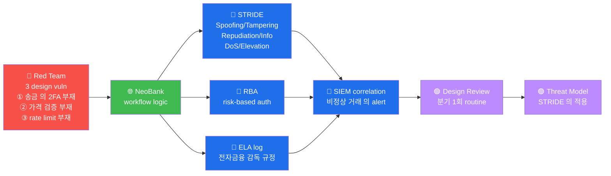

# W06 — A04 Insecure Design — NeoBank workflow + STRIDE + 전자금융감독규정

> **본 주차의 한 줄 요약**
>
> A04 (Insecure Design, 2021 신규) = *코드 의 결함 아님*, *architecture 의 결함*.
> NeoBank 송금 workflow 의 *4 설계 결함* + STRIDE 위협 모델링 + 한국 전자금융감독
> 규정 매핑. 본 주차 가 *모든 web vuln 의 *예방* 단계*.

---

## 학습 목표

1. A04 의 *이전 카테고리 와 차이* (코드 → architecture)
2. *threat modeling* 의 *STRIDE 6 카테고리*
3. NeoBank 의 *송금 workflow* 의 5 표준 단계 + 4 설계 결함
4. 한국 *전자금융감독규정* 의 *송금 의 2 채널* 의무
5. zero-trust + risk-based authentication 의 modern 표준

---

## 1차시 — A04 의 *이전 카테고리 와 차이*

### 1-1. *코드* vs *architecture*

- **A01-A03 / A05-A10** = *코드 의 결함* (input validation / crypto / config / etc)
- **A04** = *architecture 의 결함* (설계 단계 의 *없는 기능* 또는 *잘못된 가정*)

**예**:
- *코드* 결함: SQLi (input validation 누락)
- *architecture* 결함: 송금 의 *2FA 없음* (요구사항 의 *처음 부터* 누락)

### 1-2. 발견 어려움

A04 의 *vuln* = *침투 도구 의 자동 탐지 어려움*. *비즈니스 로직 의 분석* 필수 — 분석가
의 *수동 + 도메인 지식*.

---

## 2차시 — STRIDE 위협 모델링

### 2-1. STRIDE 6 카테고리 (Microsoft, 1999)

| 알파벳 | 의미 | 영향 |
|:------:|------|------|
| **S**poofing | 신분 위장 | identity 의 *위변조* |
| **T**ampering | 변조 | data 의 *임의 변경* |
| **R**epudiation | 부인 | *log 부재* — 사용자 의 *부인* |
| **I**nformation Disclosure | 정보 누출 | *허가 외* 의 접근 |
| **D**enial of Service | 서비스 거부 | *가용성* 의 침해 |
| **E**levation of Privilege | 권한 상승 | *낮은 권한 → 높은 권한* |

### 2-2. NeoBank workflow STRIDE 매핑

| Finding | STRIDE | 매핑 |
|---------|--------|------|
| 2FA 부재 | Spoofing | 단일 인증 의 *신분 위장* |
| 가격 검증 부재 | Tampering | 금액 *임의 변조* |
| Rate limit 부재 | DoS | brute force 의 *서비스 거부* |
| Log 부재 | Repudiation | 사용자 의 *부인* |

### 2-3. PASTA / TRIKE / DREAD — 대안

- **PASTA** (Process for Attack Simulation and Threat Analysis) — 7 단계
- **TRIKE** — risk-based
- **DREAD** — Damage / Reproducibility / Exploitability / Affected / Discoverability

→ STRIDE 가 가장 *직관* + *발견 효율*.

---

## 3차시 — NeoBank workflow + 전자금융감독규정

### 3-1. 한국 *전자금융감독규정* (2014+)

**제13조** — *송금* 의 *2 channel 인증* 의무:
- 비밀번호 + OTP / 공인인증서 / 생체 / FIDO2

**제18조** — *FDS (Fraud Detection System)* 의무:
- 비정상 거래 의 *실시간 탐지*
- *risk-based authentication*

**제21조** — *log* 의 *5 년 보존*:
- 모든 *금융 거래* 의 *log 보존*
- 부인 방지

### 3-2. NeoBank 의 *vuln 매핑*

W06 lab 의 *4 결함*:

| Finding | 전자금융감독규정 | 한국 사고 가능성 |
|---------|----------------|----------------|
| F1 workflow 부족 | 제13조 의 *2 channel* | 모의해킹 보고 의무 |
| F2 2FA 부재 | 제13조 의 *명백한 위반* | 과징금 가능 |
| F3 가격 검증 | 제18조 의 *FDS* | 비정상 거래 탐지 의무 |
| F4 rate limit | 제13조 의 *brute 방어* | 보고 의무 |

---

## 4차시 — modern 표준 (zero-trust + RBA) + W07 예고

### 4-1. zero-trust architecture

**원칙** — *Trust nothing, verify everything*.

- 모든 *request* 의 *재 인증*
- *내부 vs 외부* 의 *경계 X*
- *device + user + context* 의 *3 차원 검증*

### 4-2. risk-based authentication (RBA)

**조건** = *user behavior* + *device fingerprint* + *location* + *time*
- 평소 와 다름 = *추가 인증* 또는 *block*
- 평소 와 같음 = *2FA skip 가능* (UX 향상)

### 4-3. W07 예고

**W07 — A05 Security Misconfiguration**. 7 vhost 의 *HTTP 헤더 매트릭스* + ModSec
exception 분석.

---

## 4-4. R/B/P 종합 시나리오 — Insecure Design 의 STRIDE 분석



### Coverage Matrix — 3 design vuln × STRIDE 매핑

| 시도 | Red | STRIDE | Blue 의 보강 | Purple 의 routine |
|------|-----|--------|------------|------------------|
| **① 송금 2FA 부재** | 1억 송금 의 단일 인증 | Elevation of Privilege | RBA 의 risk score > 임계 → 2FA 강제 | 모든 송금 의 design review (분기) |
| **② 가격 검증 부재** | 1원 결제 + 가격 변조 | Tampering | server-side 의 가격 재계산 + DB 의 가격 검증 | order workflow 의 threat model |
| **③ rate limit 부재** | API brute = 1000 req/sec | DoS | nginx limit_req + application rate limit | API gateway 의 routine 적용 |

### R/B/P 의 핵심 인사이트

1. **A04 의 코드 결함 아닌 architecture** — A03 (Injection) 의 코드 패치 vs A04 의
   design 변경. 코드 만 의 fix = 의미 X, 설계 의 review 의 필수.

2. **STRIDE 6 카테고리 의 운영 적용** — 모든 새 feature 의 design 시 = STRIDE 6 의
   각 항목 의 명시 적 검토. mitigation 또는 risk acceptance 의 문서 화.

3. **RBA 의 modern 표준** — 고정 2FA = UX 손해 + 의무 만족. RBA = user behavior +
   device + location + time 의 risk score → 동적 추가 인증. UX + 보안 의 balance.

4. **전자금융감독규정 의 법 적 의무** — 한국 금융 의 의무 적 audit. ELA log 의 1 년
   보관 + 정기 audit + 사고 보고 의무 의 routine.

5. **Threat Model 의 분기 routine** — 신규 feature 의 design 시 + 분기 1회 의 전체
   workflow 의 threat model 업데이트. 변경 의 risk 의 사전 detection.

---

## 자기 점검

```
[ ] A04 가 *코드 결함 아님 architecture* 인 이유 응답?
[ ] STRIDE 6 카테고리 + NeoBank 매핑 응답?
[ ] 전자금융감독규정 의 13/18/21 조 응답?
[ ] zero-trust + RBA 의 *modern 표준* 응답?
```
