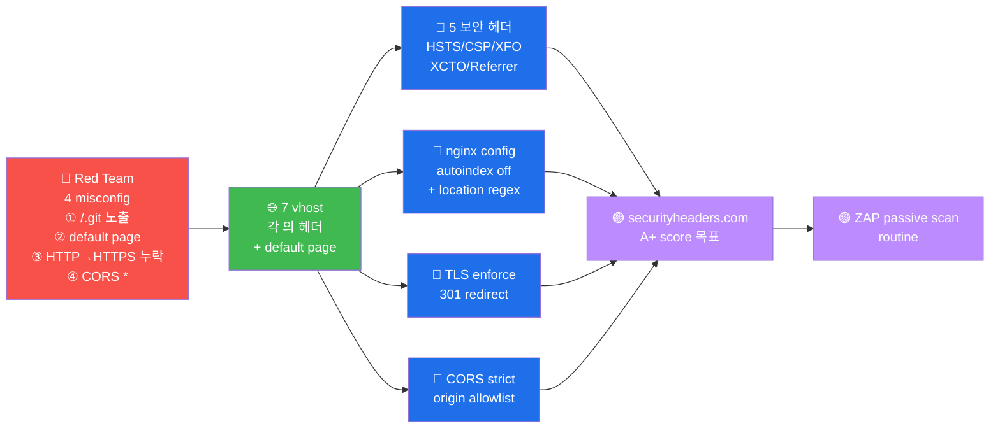

# W07 — A05 Security Misconfiguration — 7 vhost 헤더 + default page + TLS-HTTP

> **본 주차의 한 줄 요약**
>
> A05 = *15 분* 의 *모든 보안 헤더 적용* 만 으로 *대부분 vuln 차단* 가능 한 *low-
> hanging fruit*. 7 vhost 의 *5 헤더 + default page + TLS/HTTP misconfig* audit.
>
> **운영자 한 줄 결론**: 보안 헤더 의 *적용* = *minimum baseline*. 의무.

---

## 학습 목표

1. 5 보안 헤더 (X-Frame / X-Content-Type / HSTS / CSP / X-XSS) 의 *역할 + 표준 값*
2. default page (`/server-status`, `/.git`, `/.env`) 노출 의 *영향*
3. TLS 의 *HTTP→HTTPS redirect* + CORS + Referrer-Policy + Permissions-Policy
4. server fingerprint 의 *제거 표준* (`ServerTokens Prod`)
5. CI/CD 의 *자동 audit* 통합

---

## 1차시 — 5 보안 헤더

### 1-1. X-Frame-Options
- 값: `DENY` / `SAMEORIGIN` / `ALLOW-FROM uri`
- 방어: clickjacking (iframe 의 *악성 사이트 안에 삽입*)
- modern 대체: CSP `frame-ancestors`

### 1-2. X-Content-Type-Options
- 값: `nosniff`
- 방어: MIME sniffing (브라우저 의 *파일 type 추론 공격*)

### 1-3. Strict-Transport-Security (HSTS)
- 값: `max-age=31536000; includeSubDomains; preload`
- 방어: HTTP downgrade (MITM 의 HTTPS → HTTP)

### 1-4. Content-Security-Policy (CSP)
- 값: W05 참고 (script-src 'self' 등)
- 방어: XSS / data injection

### 1-5. X-XSS-Protection
- 값: `1; mode=block` (legacy) / 또는 *제거* (modern, CSP 의 보완)

---

## 2차시 — Default page + Directory listing

### 2-1. 위험 default path
- `/server-status` — Apache mod_status
- `/server-info` — Apache mod_info
- `/.git/` — git directory (source code 의 *전체*)
- `/.env` — environment variable (secret)
- `/backup/` — 백업 파일
- `/phpinfo.php` — PHP 정보

### 2-2. .git 노출 의 *위험* (실 사고)
- 2022 한국 의 모 핀테크 의 `/.git/` 노출 → source code + DB credential 유출
- git clone 의 *일부 (config)* 만 으로 도 *전체 history 복원 가능*

---

## 3차시 — TLS / HTTP misconfig + CORS

### 3-1. HTTP → HTTPS redirect 의무
- Apache: `Redirect permanent / https://example.com/`
- nginx: `return 301 https://$host$request_uri;`
- 부재 시: MITM 의 *credential 절도* 가능

### 3-2. CORS 의 *위험*
- `Access-Control-Allow-Origin: *` = *모든 origin 허용* — CSRF 위험
- `Access-Control-Allow-Credentials: true` + `*` = *불가능 조합* (브라우저 차단)
- 권장: *whitelist* (`https://app.example.com` 만)

---

## 4차시 — 보고서 + W08 (중간고사) 예고

### 4-1. 자동 audit 도구
- **securityheaders.com** — 5 보안 헤더 + score (A+ 부터 F)
- **Mozilla Observatory** — *종합* score
- **OWASP ZAP** — *passive scan*
- **CI 통합**: GitHub Action 의 *securityheaders-action*

### 4-2. W08 — 중간고사 (W01-W07 종합)

---

## 4-3. R/B/P 종합 시나리오 — Security Misconfiguration



### Coverage Matrix — 4 misconfig × Blue 보강

| 시도 | Red 발견 | Blue 보강 | 한국 사고 사례 | Purple routine |
|------|---------|----------|--------------|----------------|
| **① /.git 노출** | `curl /.git/config` = git config 노출 | nginx `location ~ /\.git { deny all; }` | 2023 사고 (1억 record 유출) | 분기 audit + CI 통합 |
| **② default page** | `curl /server-status` = mod_status 노출 | Apache `LoadModule status_module` 비활성 | 다수 | 모든 default 의 disable |
| **③ HTTP 응답** | `curl -I http://...` = TLS 미적용 | HSTS + 301 redirect | 정기 PCI audit fail | 모든 vhost 의 HTTPS-only |
| **④ CORS *** | `curl -H 'Origin: evil.com'` = `Access-Control-Allow-Origin: *` | origin allowlist + credentials 분리 | 다수 | API gateway 의 default strict |

### R/B/P 의 핵심 인사이트

1. **securityheaders.com 의 A+ score 목표** — 5 보안 헤더 (HSTS/CSP/XFO/XCTO/
   Referrer-Policy) 의 100% 적용 = A+. 운영 환경 의 routine baseline.

2. **CORS 의 * + credentials 의 불가능 조합** — browser 의 SOP (Same-Origin Policy)
   에서 의 unspecified behavior. 명시 적 allowlist + credentials true 의 분리 적용.

3. **/.git 노출 의 즉각 차단** — nginx/Apache 의 hidden directory 의 deny rule 의
   기본 적용. CI 의 build 시 의 .git directory 의 cleanup 의 routine.

4. **default page 의 production 의 제거** — Apache mod_status / Tomcat manager /
   phpMyAdmin 의 default page = production 의 즉시 disable. install 시 의
   automation.

5. **TLS 의 enforce 의 strictly** — HTTP 응답 = 즉시 HTTPS redirect + HSTS 의 1년
   max-age + includeSubDomains + preload. 운영 의 분기 verify.

---

## 자기 점검

```
[ ] 5 보안 헤더 + 표준 값 응답?
[ ] /.git 노출 의 위험 + 한국 사고 응답?
[ ] CORS 의 * + credentials 의 *불가능 조합* 응답?
[ ] securityheaders.com 의 score (A+ 부터 F) 응답?
```
