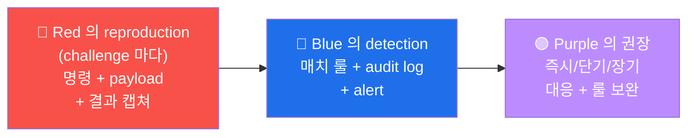

# W08 — 중간고사 (W01-W07 종합)

> **본 주차** = 시험. lab 의 *5 챌린지 × 20점* 의 *180분* 실기.

## 시험 준비
- W01-W07 의 *각 step* 의 *본인 재현 가능* 여부 자가 진단
- 본인 PC 의 curl + jq + python3 + sqlmap + openssl 가용 확인
- 6v6 의 가동 확인 (`ssh 6v6-bastion docker ps`)

## 시험 의 *3 분야*
1. **재현** — W02-W07 의 *각 lab* 의 *실 실행* (60+ 분)
2. **분석** — 5 finding 의 *근본 원인* + *영향* + *권장* (60 분)
3. **보고** — PTES 4 섹션 + CVSS + CWE + ATT&CK 매핑 (60 분)

## 채점 기준
- 각 챌린지 = 20점
- 합 = 100점
- 통과 = 60점+
- 우수 = 80점+

## 시험 종료 후
- W09 의 *A06 Vulnerable Components* 준비
- 본인 의 *weak 영역* 의 *재학습*

---

## R/B/P 시나리오 — 중간고사 답안 의 표준 형식

중간고사 의 5 challenge 의 R/B/P 답안 의 표준. 매 finding 의 R/B/P 의 3 관점 의
명시.

### Coverage Matrix — 5 challenge × R/B/P 답안

| Challenge | Red 답안 (20점) | Blue 답안 (20점) | Purple 답안 (20점) |
|-----------|---------------|----------------|------------------|
| 1. IDOR | curl + token swap | application ACL | runtime user_id 검증 |
| 2. JWT | alg=none token | ModSec custom rule | signature 검증 + secret rotation |
| 3. SQLi | sqlmap + tamper | ModSec 942 + paranoia 3 | parameterized query |
| 4. XSS | reflected payload | ModSec 941 + CSP | DOMPurify + Trusted Types |
| 5. Misconfig | /.git curl | nginx deny rule | CI 의 secret scan |

### R/B/P 답안 의 평가 기준

1. **Red 의 reproduction (실 환경)** — 명령 + 결과 의 캡쳐 + CVSS 계산. **20점**
   - 명령 정확 = 10점, 결과 분석 = 5점, CVSS = 5점

2. **Blue 의 detection** — 매치 룰 + audit log + Wazuh alert 의 cross-check. **20점**
   - 매치 룰 식별 = 10점, audit log 분석 = 5점, alert flow = 5점

3. **Purple 의 권장** — 3 시간선 (즉시/단기/장기) 의 권장 + 룰 보완. **20점**
   - 즉시 (1시간) = 5점, 단기 (1주) = 10점, 장기 (분기) = 5점
