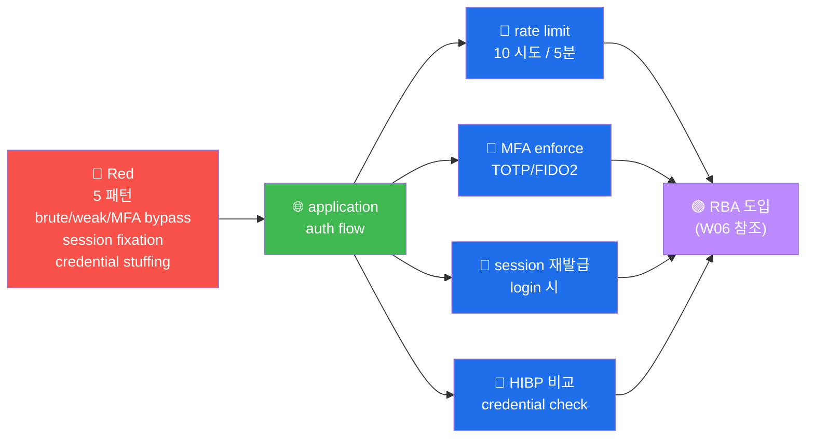

# W10 — A07 Identification and Authentication Failures

> *brute force + weak password + MFA bypass + session fixation*.

## 5 대표 패턴
1. **brute force** — rate limit 부재
2. **weak password** — 12 char 미만 + 단순 dictionary
3. **MFA bypass** — recovery code 약함 / TOTP secret 노출
4. **session fixation** — login 전 session 재사용
5. **credential stuffing** — 외부 유출 의 credential 의 *재시도*

## NIST SP 800-63B (2017 update)
- *min length 12+* (이전 8)
- *복잡도 강제 X* — *length 가 더 중요*
- *no forced rotation* (이전 90일 마다)
- *해킹 데이터베이스* 비교 (HaveIBeenPwned API)

## MFA 표준
- SMS / 이메일 — *약함* (SIM swap / phishing)
- TOTP (Google Authenticator) — *권장*
- FIDO2 / WebAuthn — *최고* (hardware key)
- 생체 — *Apple/Android* 표준

## R/B/P 시나리오 — Auth Failures



### Coverage Matrix — 5 패턴 × 4 detection

| 패턴 | Red | Blue 1차 | Blue 2차 | Purple 권장 |
|------|-----|---------|---------|-----------|
| **brute** | hydra ssh | rate limit | Wazuh rule 5712 | IP 임시 차단 + MFA 강제 |
| **weak pwd** | password spray | min length 12 | NIST 800-63 적용 | HIBP check + rejection |
| **MFA bypass** | recovery code brute | recovery 의 entropy | secret rotation | FIDO2 의 enforce |
| **session fixation** | login 전 cookie 재사용 | session ID 재발급 | secure flag | login 시 무조건 새 ID |
| **credential stuffing** | leak DB 의 brute | rate limit + HIBP | 비정상 location alert | RBA + 추가 인증 |

### 핵심 인사이트 (5 항)

1. **rate limit 의 default** — login 의 10 시도 / 5분 = 표준. 단, 정상 user 의 영향
   최소화 위 = exponential backoff + CAPTCHA fallback.

2. **NIST 800-63 (2017) 의 변경** — min length 12 + special char 강제 X + 90일 rotation
   X. 의의 = "강한 12 char" + "leak 발견 시 변경" 의 modern 표준.

3. **MFA 의 strength 의 layer** — SMS (약) < TOTP (중) < FIDO2 (강) < biometric (강).
   금융 = FIDO2 의 의무, 일반 = TOTP 의 권장.

4. **session 의 재발급 의 routine** — login 시 + 권한 변경 시 + 의심 행동 시. session
   fixation 의 100% 차단.

5. **HIBP 의 운영 통합** — Have I Been Pwned 의 API 의 password 의 leak 의 즉시
   detection. 회원가입 + 비밀번호 변경 시 의 routine check.

## 자기 점검
```
[ ] 5 패턴 응답?
[ ] NIST 의 *2017 변경* 응답?
[ ] MFA 4 표준 + 위험도 응답?
```
