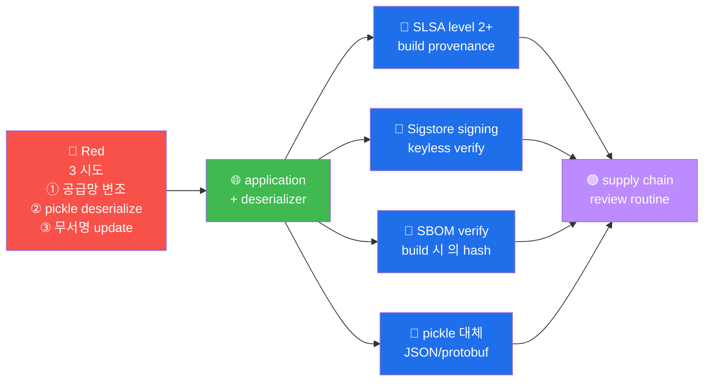

# W11 — A08 Software and Data Integrity Failures — Supply chain + Deserialization

> 공급망 + 무결성 검증 부재. 2024 xz-utils + Log4Shell 의 *역대 최대 사고*.

## 핵심
- **공급망 공격** = 신뢰 받은 source 의 *변조*
- **deserialization** = `pickle.loads()` 등 의 *임의 코드 실행*

## modern 표준 (SLSA + Sigstore + SBOM)
- SLSA 1-4 level (Google + Linux Foundation)
- Sigstore — keyless signing
- SBOM — CycloneDX / SPDX

## CWE
- CWE-502 Deserialization of Untrusted Data
- CWE-829 Inclusion of Functionality from Untrusted Sphere
- CWE-1357 Reliance on Insufficiently Trustworthy Component

## R/B/P 시나리오 — Software/Data Integrity Failures

### Coverage Matrix

| 시도 | Red | Blue 의 표준 | Purple 권장 |
|------|-----|------------|-----------|
| **① 공급망 변조** | xz-utils 같은 의도 적 backdoor | SLSA 4 + Sigstore | maintainer trust + signed commit |
| **② pickle deserialize** | `pickle.loads(<malicious>)` | pickle 사용 금지 | JSON/protobuf 의 default |
| **③ 무서명 update** | malicious update server | signed release + verify | TUF (The Update Framework) |

### 핵심 인사이트 (5 항)

1. **SLSA level 의 점진 적 ramp-up** — Level 1 (build process) → 2 (signed) → 3
   (hardened build) → 4 (two-party review). 운영 = 분기 별 level 올리기.

2. **Sigstore 의 keyless signing** — key 관리 의 burden 제거 + OIDC 의 identity 기반.
   open source 의 표준 화.

3. **pickle 의 운영 환경 의 금지** — pickle = 임의 코드 실행. 운영 = JSON/protobuf
   의 100% 적용. legacy pickle 의 점진 적 교체.

4. **TUF (The Update Framework) 의 update security** — root → targets → snapshot →
   timestamp 의 4 role 의 signed metadata. update server 의 compromise 의 방어.

5. **2024 xz-utils 의 사례 의 교훈** — 2년 의 social engineering + 의도 적 backdoor.
   maintainer 의 trust verification + review process 의 routine 의 필수.
