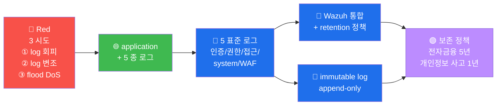

# W12 — A09 Security Logging and Monitoring Failures

> *log + monitor 부재* = *사고 추적 불가*. ModSec audit + Wazuh 통합 + 보존 정책.

## 표준 5 종 로그
1. 모든 인증 시도 (성공 + 실패)
2. 권한 변경
3. 데이터 접근 (sensitive)
4. system event
5. WAF 차단

## 한국 보존 정책
- 전자금융감독규정: 5 년
- 개인정보보호법: *유출 시 1 년 보고*

## 6v6 의 실 운영
- ModSec audit log = 19766 line (2026-05-16 실측)
- Wazuh alerts.json 통합

## CWE
- CWE-778 Insufficient Logging
- CWE-779 Excessive Logging (반대 — 너무 많음)

## R/B/P 시나리오 — Logging Failures

### Coverage Matrix

| 시도 | Red | Blue 보강 | Purple routine |
|------|-----|---------|----------------|
| **① log 회피** | sensitive action 의 log 누락 활용 | 5 표준 로그 의 의무 | 모든 endpoint 의 log 검증 (정기 audit) |
| **② log 변조** | log file 의 변조 시도 | append-only + WORM storage | immutable storage (S3 object lock) |
| **③ flood DoS** | 의도 적 1M alert/sec | rate limit + log throttling | SIEM 의 burst protection |

### 핵심 인사이트 (5 항)

1. **5 표준 로그 의 의무화** — 인증/권한/접근/system/WAF 의 5 종 = 운영 의 표준
   baseline. 어떤 endpoint 의 누락 도 위험.

2. **한국 의 보존 의무** — 전자금융 5년 + 개인정보 사고 1년 보고. 법 적 의무 + 영구
   기록 의 routine.

3. **append-only 의 log 변조 방어** — log file 의 immutable storage (S3 object lock,
   WORM). attacker 의 log clear 의 100% 차단.

4. **CWE-779 의 반대 위험** — 과도 한 logging = disk full + signal noise. 적정 한
   level + sampling (production INFO, debug TRACE 의 분리).

5. **Wazuh + SIEM 통합 의 routine** — log 의 generation 은 application, ship 은
   Wazuh agent, search 는 OpenSearch. 3 단계 의 명확 한 책임 분리.
