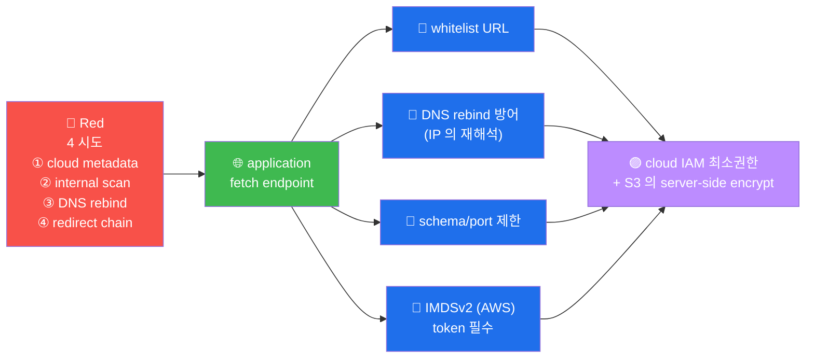

# W13 — A10 SSRF (Server-Side Request Forgery)

> 서버 의 *공격자 의도* 의 *내부 요청*. cloud metadata 노출 의 *주 원인*.

## 표준 cloud metadata
- AWS: `169.254.169.254/latest/meta-data/`
- GCP: `metadata.google.internal/`
- Azure: `169.254.169.254/metadata/instance`

## 5 방어
1. whitelist URL
2. DNS rebind 방어
3. schema 제한 (http/https 만)
4. port 제한 (80/443)
5. redirect 추적 X

## 한국 사례 (2024-02)
- 공공 기관 SSRF → AWS metadata → IAM → S3 의 주민등록번호 노출

## R/B/P 시나리오 — SSRF

### Coverage Matrix

| 시도 | Red | Blue 방어 | Purple 권장 |
|------|-----|---------|-----------|
| **① cloud metadata** | `?url=http://169.254.169.254/...` | whitelist + IMDSv2 | IAM 최소 권한 + 정기 audit |
| **② internal scan** | `?url=http://10.0.0.1:8500/` | schema/port 제한 | VPC 의 layered network |
| **③ DNS rebind** | `?url=http://malicious.com/` (TTL 0, IP rebind) | DNS rebind 방어 lib | DNS resolver 의 lock |
| **④ redirect chain** | `?url=http://attacker/redirect-to-metadata` | redirect 추적 X | follow_redirects = false |

### 핵심 인사이트 (5 항)

1. **cloud metadata 의 SSRF 주 표적** — AWS/GCP/Azure 의 metadata endpoint =
   credential 노출 = IAM 의 takeover 위험. IMDSv2 (AWS) 의 token 필수 강제.

2. **DNS rebind 의 detection 의 어려움** — initial DNS = 정상 IP, 사용 시 = 내부 IP.
   resolver 의 lock + rebind 방어 lib (예: dnsdbq).

3. **redirect chain 의 위험** — 302 의 chain 으로 의 우회. 운영 = follow_redirects
   = false + 명시 적 URL 검증.

4. **schema/port 의 explicit allowlist** — http/https + 80/443 만 의 허용.
   file:// / gopher:// / tftp:// 의 차단.

5. **2024 한국 공공 사례 의 교훈** — SSRF → metadata → IAM → S3 의 chain 의 위험.
   각 계층 의 defense in depth 의 필수.
