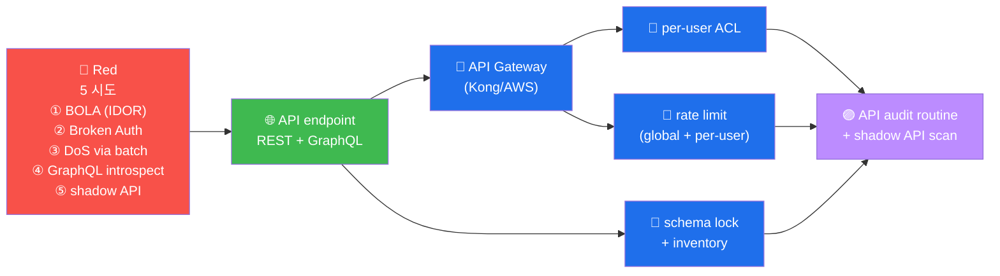

# W14 — API Security Top 10 (2023) — REST + GraphQL

> OWASP API Top 10 (2023, 신규). REST + GraphQL 의 *5 vuln 매트릭스*.

## API Top 10 (2023)
- API1 BOLA (IDOR for API)
- API2 Broken Auth
- API3 Broken Property Auth
- API4 Resource Consumption (DoS)
- API5 Broken Function Auth
- API6 Sensitive Business Flow
- API7 SSRF
- API8 Misconfig
- API9 Improper Inventory (shadow API)
- API10 Unsafe Consumption

## GraphQL 5 vuln
1. introspection enabled
2. batching attack (DoS)
3. circular query
4. field suggestion (info leak)
5. mutation 의 권한 우회

## modern API 방어 5
1. *모든 endpoint* 의 *권한 검증*
2. rate limit (per user / per IP)
3. *introspection* production 거부
4. GraphQL depth limit (5+)
5. API gateway (Kong / AWS API Gateway)

## R/B/P 시나리오 — API Security

### Coverage Matrix — 5 시도

| 시도 | Red | Blue 방어 | Purple routine |
|------|-----|---------|----------------|
| **① BOLA** | curl /api/users/{other_id} | per-user ACL middleware | 모든 endpoint 의 ACL 검증 (분기 audit) |
| **② Broken Auth** | JWT alg=none + secret weak | strong JWT + rotation | OAuth 2.1 의 routine |
| **③ DoS via batch** | GraphQL batching 100 query | depth limit + batch limit | API Gateway 의 default |
| **④ introspect** | `__schema { types { name } }` | production introspection 거부 | env 별 schema 분리 |
| **⑤ shadow API** | undocumented endpoint 발견 | API inventory + spec 강제 | 자동 API discovery + 매핑 |

### 핵심 인사이트 (5 항)

1. **API Top 10 (2023) 의 신규 카테고리** — Web Top 10 과 다른 API 특유 의 위협
   (BOLA, Resource Consumption, Shadow API). 별도 의 audit framework.

2. **shadow API 의 운영 위험** — API spec 의 documented = 보안 검증. undocumented =
   미검증 + 보안 사각. inventory 의 routine + spec 의 의무화.

3. **GraphQL 의 introspection 의 production 거부** — introspection = 개발 의 편의 +
   production 의 위험. env 별 schema 분리 + production = 거부.

4. **batching attack 의 detection** — 단일 query = 정상 / batched query = DoS 가능.
   batch limit + depth limit + complexity score 의 조합.

5. **API Gateway 의 default 보안** — Kong / AWS API Gateway 의 default 정책 =
   rate limit + ACL + audit. 모든 API endpoint 의 gateway 경유 의 routine.
