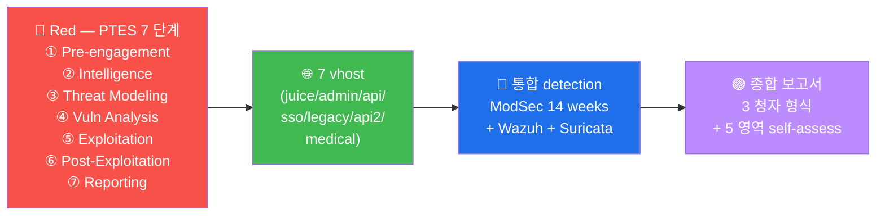

# W15 — 기말 — 7 vhost 종합 침투 + PTES 보고서

> 180 분 100 점. 7 vhost 중 3 선택 + PTES 7 단계 + 6 finding + 종합 보고서.

## 시험 구조
- 단계 1 Recon (15점, 30분)
- 단계 2 Vuln Analysis (20점, 30분)
- 단계 3 Exploitation (25점, 45분)
- 단계 4 Post Exploit 가설 (10점, 15분)
- 단계 5 Reporting (30점, 60분)

## 채점 기준
- 통과: 60점+
- 우수: 80점+
- 최우수: 95점+

## 졸업 의 *5 요건*
1. W01-W14 의 *각 lab* 통과
2. W08 중간 통과
3. W15 기말 60점+
4. 본인 의 *학습 도구* 1 종 작성 (예: JWT brute Python)
5. 본인 의 *self-assessment* 5 영역 모두 *3+ 점*

## 본 과목 졸업 후
- *후속*: API Security 심화 (W14 연결) / Mobile Security / Cloud Security
- *bug bounty*: HackerOne / Bugcrowd 의 *profile 생성* (참여 X — 학습 만)
- *resume*: web-vuln 의 *7 vhost hands-on* + *PTES 보고서* 작성 가능

## R/B/P 시나리오 — 기말 종합 의 PTES 7 단계

기말 의 R/B/P 의 통합 = PTES 7 단계 의 매 단계 의 R/B/P 의 통합 분석.

### Coverage Matrix — PTES 7 단계 × 3 vhost 선택

| 단계 | 시간 | 점수 | R/B/P 의 답안 형식 |
|------|------|------|------------------|
| ① Pre-engagement | (사전) | (RoE 준수) | RoE 의 명시 + scope 의 동의 |
| ② Intelligence | 30분 | 15점 | nmap + nikto + ffuf 의 출력 + Blue 의 SCAN 룰 매치 |
| ③ Threat Modeling | (Vuln 일부) | (포함) | STRIDE 의 6 적용 + 우선순위 |
| ④ Vuln Analysis | 30분 | 20점 | 6 finding 의 CVSS + CWE + ATT&CK |
| ⑤ Exploitation | 45분 | 25점 | 3 vhost 의 실 exploit + Blue 의 audit log 의 매치 |
| ⑥ Post-Exploitation | 15분 | 10점 | 가설 (실 X) + 영향 분석 + Purple 의 차단 권장 |
| ⑦ Reporting | 60분 | 30점 | 3 청자 (임원/운영/분석) + PTES 형식 + 5 영역 self-assess |

### 핵심 인사이트 (5 항)

1. **PTES 의 7 단계 의 routine** — 모의 침투 의 표준. 매 finding 의 7 단계 의 매핑 +
   문서화 의 의무. resume 의 PTES 보고서 = 실 운영 의 base 도구.

2. **3 청자 의 분리 작성** — 임원 (위험도 + 법적) + 운영자 (즉시/단기) + 분석가
   (reproduction + 근본 원인). 한 보고서 의 3 section 의 명확 한 분리.

3. **5 영역 self-assessment** — Recon / Exploit / Detection / Mitigation / Reporting
   의 5 영역. 졸업 = 3+ 점 의 5 영역 모두. weak 영역 의 재학습 plan.

4. **bug bounty 의 윤리적 진입** — 졸업 후 의 실전 = HackerOne / Bugcrowd 의 RoE.
   학습 환경 의 정확 한 적용 + scope 의 100% 준수.

5. **평생 학습 의 routine** — OWASP Top 10 의 매 3년 의 update + API Top 10 + Cloud
   + Mobile 의 후속 영역. 본 과목 = base, 평생 = 보완.
